# 普通人如何通过生态位选择，实现长期自由职业？

> 原文：[`www.yuque.com/for_lazy/thfiu8/cqko9giysylrzso8`](https://www.yuque.com/for_lazy/thfiu8/cqko9giysylrzso8)

## (精华帖)(499 赞)普通人如何通过生态位选择，实现长期自由职业？

作者： 张柯 Ker

日期：2023-12-29

大家好，我是张柯 Ker，

这篇文章是我近一年里，

关于**「商业逻辑」**的思考与总结，

也是去年年底写的这篇文章的延伸与补充，

[《普通人如何通过项目实战，成为自由职业》](https://wx.zsxq.com/dweb2/index/topic_detail/214514455848821)

去年这篇分享的角度是：**微观视角，**

更多的是从**「个人」**能力出发，

阶段为 0-1，

今年这篇分享的角度是：**宏观视角，**

更多的是从**「模式」**能力出发，

阶段为 1-10，10-100，

**模式高维打低维，生态定位定生死，**

想写这个内容挺久了，

发现圈子里很多人没有**「生态位」**的思维，

也没有搭建**「商业模式」**的思考，

不少人付费咨询过我，

大部分还都是已经从 0-1 跑通的人，

**但，就一直都在 0-1 里绕圈跑，**

陷入怪圈，

跑不出 1-10，10-100，

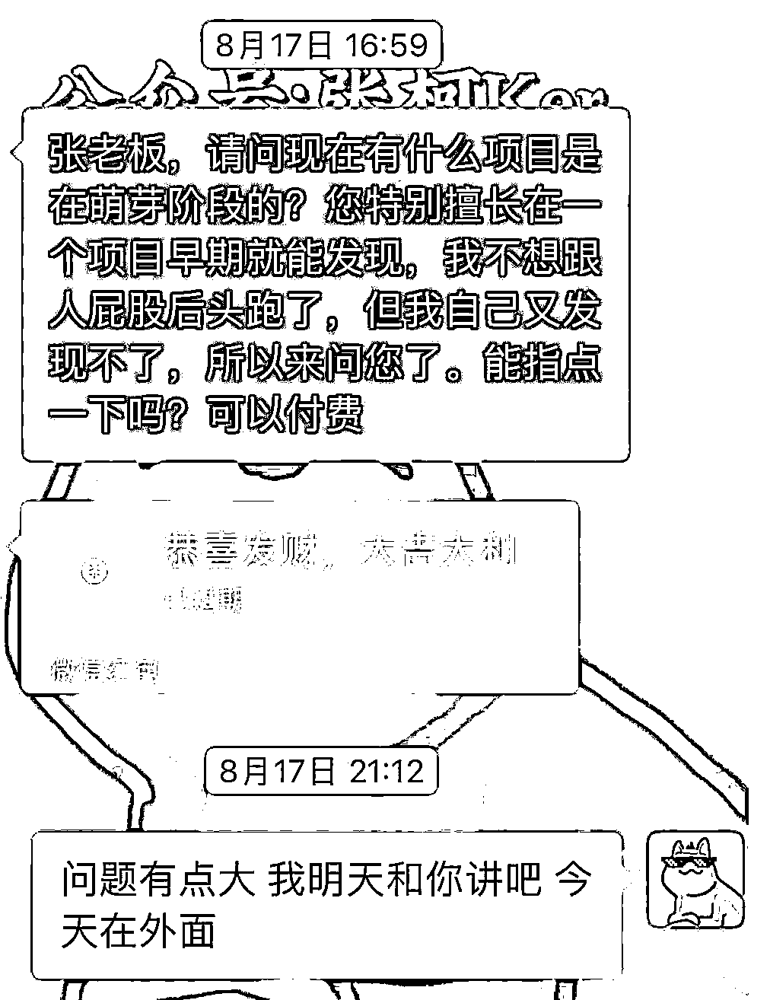

绝大多数人认识我，应该都是因为副业项目，

1、去年的小说推文，我大概率算全网首发，

如果现在你去搜我文章里写的语句，

你能发现，我那篇文章被全网抄了个遍，

除了没人能写得比我好以外，

就因为我是首发，还给项目拉爆了，

2、后续的短剧 CPS，我也是第一批进场的，

带人半个月内也搞了几十万 GMV，还当上了生财的航海教练，

3、公众号爆文写作，我是生财里第一个拆解分享原理的，顺便拿了颗龙珠，

4、再往后的小红书商单，也算第一批，

5、最近的杂七杂八的项目，也算第一批拉出来的，

还有很多我对趋势和机会的预言，

也不少在最近印证了，

就是有点心痛，

知道了，但没有下注，少赚了很多很多很多很多……

**ok，以上这些，都不重要，**

重要的是，

**我这种商业灵敏度的「嗅觉」到底是从哪来的？**

**你们要如何做，才能学会并掌握？**

甚至我说，

**这些机会是自己找上门的，你信不信？**

往下看，

我将生态位分为五个阶段，

**困局者，入局者，**

**借势者，成势者，**

**布局者，**

以下内容，为了方便大家理解，

我将从对应阶段，

加以布局者的 ##双重视角## 进行讲述，

**一、困局者**

先讲结论，

**我们心甘情愿的置身于每一个「局」中，**

不管现在是有意识，还是无意识，

我们都是**「心甘情愿」**置身局中，

反之，早已破局，

**我再强调一次，**

**不管你对现状有多么厌恶，**

**你就是心甘情愿的待在局中，**

要么你在蓄力，

要么你已提前自我否定，

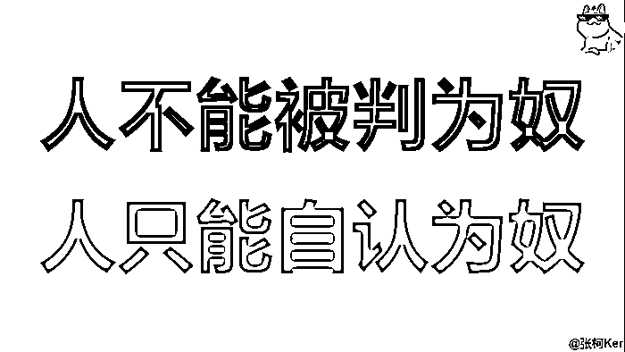

**无意识的，则为困局者，**

大部分人都处于这个阶段，

1、总感觉现状有点不对劲，但又说不出来哪里不对劲，

没有开过眼，

**不知道什么是真正的「好」，**

**什么是真正的「坏」，**

2、每天都很努力，像老黄牛一样勤勤恳恳的做事，

但是又想象不出来很好的出路，

**对未来没有画面感，**

3、逃避思考，只想尽快把今天糊弄过去，

然后安慰自己今天又是辛苦的一天，赶紧躺平放松一下，

**甚至知识付费也只是为了缓解焦虑，**

买了就是学了，没有内化学习，

自己骗自己「我很棒」，「我正在积极向上」，

**是不是你？**

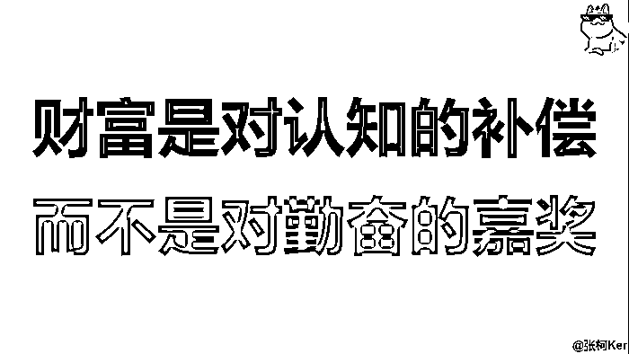

##苦其心志，劳其筋骨，饿其体肤，空乏其身，行拂乱其所为，

**无为使我有为，无知使我有秩，**

**绝对正确的，不一定是正确的，**

你，懂了吗，##

**二、入局者**

我们每个人都必然身处于不同的「局」中，

**不成局，不成活，**

想破局，就得从处于舒适圈的局里，

向前迈一步，**主动进入**另一个不怎么舒适的局里，

**商业的本质是价值互换，**

很多人没有想明白这个点，

**怨天尤人是没有用的，看我鸟不鸟你就完事了，**

多想想，你能给他人提供的价值是什么？

如果你不能提供价值，

那他人为什么要帮助你，为你提供价值？

当你想明白了这一点，

你就成了**「有意识」的入局者，**

知道自己不能就这么算了，

**要么把自己「卖出去」，**

**要么把知识「买进来」，**

很多人都是打工思维，

觉得老板开这么点钱，还想要我卖命，你在想屁吃，

觉得我知识付费了，还不赶紧把东西塞我喉咙里，不然就是割我，

从不主动钻研思考提问，

日子能混就混，以摸鱼混底薪为乐，

殊不知，

**自己唯一拿得出手的资本：年轻，**

**正在被自己挥霍糟蹋，**

我毕业后只上过半年班，

干了两个多月销售，干了两个多月社群运营，

彻底自由职业后，

还被家里人以「不稳定」、「不体面」磨耳朵磨得道心不稳，

又跑去上了半个月班，

至此我算是明白了，

**我走的就是一条不归路，没有退路可言，**

一个月赚过六位数，让我再去拿几千块钱工资，

你还不如给我来个痛快，

别和我说什么稳定不稳定，

**我一年赚你十年的钱，**

**我再跑出去玩九年，**

**算不算稳定？**

被我文章吸引过来的，

被我这个人吸引过来的，

主动进入这个圈子的，

**我们大概率都是同类人，**

见识过互联网**「机会的涌现」，**

早点认命吧，你回不去了，

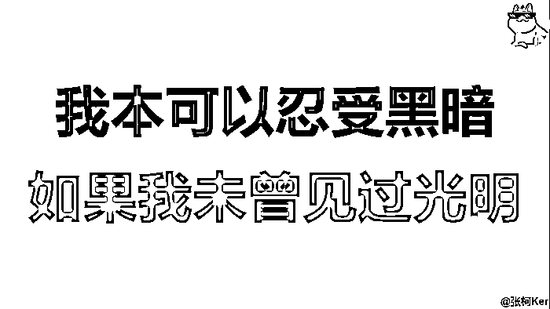

我从一开始就知道，

我上班只有一个目的，

就是**「学东西」，**

我社恐，所以想干下销售锻炼锻炼自己，

我想做个人 IP，于是我跑去做社群运营，

东西学完了，

如果我看不到公司这个平台能给我更大的机会，

老板不相信我的能力，

那我就走了，

**把，**

**「我为两个 b 钱帮老板卖命」的想法，**

**趁早改成，**

**「老板花钱招我进来学习技能」，**

你就成了，

1、既然我什么都不会，那我唯一能交换的就是我的时间与精力，

我必须忍辱负重，必须卧薪尝胆，

**去做自己不喜欢的事，来交换自己未来喜欢的事**

努力去学到点什么东西，才能让以后的我更有交换价值，

2、我会一点东西了，我能交换的价值，就多了一个「能力」，

我能把自己，

**卖出更高的价钱，**

**抓住更好的机会，**

**尝试更多的可能性，**

**从「没得选」，变成「有得选」，**

人活一口气，

首先，

**你得相信自己迟早会「有点东西」，**

其次，

**你得真的主动入局去变得「有点东西」，**

**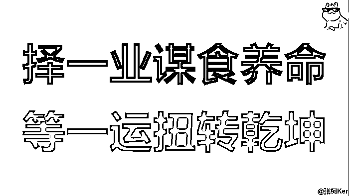**

##**破局钥匙不会存在于局中，**

其中一把钥匙，在布局者心中，

另外一把钥匙，在你的态度中，##

**三、借势者**

恭喜你，你的「价值」更高了，

或许是因为你的「技能」亮眼，

大腿把你从「入局者」中捞起来了，

又或许是你主动把自己卖给大腿，

卖了个好「价值」，

总之，你跳出来了，

**你被看到了，**

我知道你很急，但你先不要急，

你是跳出来了，

**但你还飘在半空，**

**没有真正的落地上岸，**

​

给机会是一码事，

你能不能抓住机会，又是另一码事，

第三波筛选，开始了，

注意，注意，

到这个阶段，内容与职场无关了，

不是上班，不是上班，

**你已经有一定的技能与能力了，**

**你要去接近你的「理想人」，**

**谁过上了你梦想中的生活，你就去接近谁，**

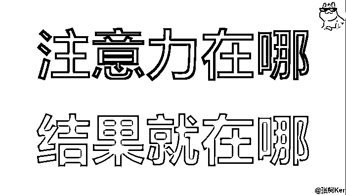

##你的价值我看到了，

现在，我要看到你的**执行与忠诚，**

**有能力的人很多，**

**有机会的人很少，**

如果你的**能力**不能为我所用，

那我绝对会倾向于让你泯于众人，

不然我帮你磨刀干什么，让你找机会捅我吗？##

**能力又分为直接兑现与后期兑现，**

**直接兑现：**

要么就是你给我打钱，

要么就是信息互换，资源互换，

**后期兑现：**

我感觉你人品还可以，态度不错，

我多说两句，让你少走点弯路，

投资一下你成事以后记住我的可能性，

**交流市场绝对是劣币驱逐良币的，**

以我为例，

一开始我也是个老好人，

有求必应，问我问题，我能回就回，

后来发现，有的人根本就不懂得什么叫礼貌，

不说谢谢就算了，还把爷屏蔽了，

既不能提供金钱价值，又不能提供情绪价值，

拉倒吧，你还是好好待在困局里，

**道不同，不相为谋，**

至此，

不熟的，没给我氪过金的人，问我问题，

我心情好，敷衍两句，

心情一般，已读不回，

心情不好，直接删了，

给我发小红包，我就少说两句，

给我发大红包，我就多说两句，

给我转账砸我脸上的，我就把老底都掏出来给你过一遍，

**哥就是出来卖的，价高者得，**

以上，就是位于「借势者」阶段应该懂得的道理，

**不忠，不用，**

何以为忠？

要问你自己，

有没有**「用心」，**

有没有**「诚意」，**

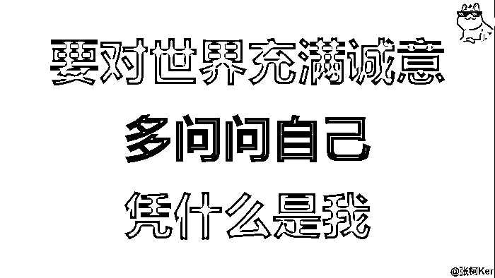

##我什么都知道，也什么都能看到，但我不会说，

我只会用破局的后半截钥匙投资你，

至于前半截钥匙，要么你自己长出来，要么我投资下一个，##

**四、成势者**

你就是个天才！

你已经走出怪圈了，

**这个阶段，就是你人生的重大转折点，**

从主动问人，

**「哥，我能不能……」**

变成了别人主动问你，

**「好兄弟，你要不要……」**

~~怎么说出来感觉怪怪的，~~

但道理就是这么个道理，

你能力已经「相对到位」了，

也被不少人看见了，

**有了属于自己的「代表作」，**

不少人愿意主动靠近你，

有了一定的势能，

**你成为了别人心中的「理想人」，**

为什么我说这个阶段会是人生的重大转折点，

因为，

如果当你到达了这个位置，

成为了「成势者」，

除非你自己作死，

不然你就**永远都掉不下来了，**

**现在不是你去找机会了，**

**是机会主动来找你，**

**优质的一手信息差，绝对只在小圈子中流通，**

而你已经进入这个小圈子了，

你想躺平都不行，

很多项目的一手信息，

都是圈里人或主动，或被动，

透露给我的，

他们会问我做不做，有没有做，

**而拆解项目的能力是可以迁移的，**

**我看一眼就知道这玩意能不能做，**

**因此，我一直跑在前面，**

环境和氛围中的人会硬拉着你往前冲，

我就时常被高能量场的同行打鸡血，

要么适量给我打亢奋了，

要么过量给我打 emo 了，

但最终的结果，都是好的，

**都是为了向上生长，**

**都会变成向上生长，**

##我的左膀右臂，少了你我可就亏大了，我可得好好带带你，##

**五、布局者**

到了这个阶段，

和之前的大腿基本上就变成了**「合作关系」，**

甚至你还可以拥有多条大腿，

或者已经成为了自己的大腿，

**有了自己的「基本盘」，**

**任外界风吹雨打都不怕，**

在这里，我重点讲一下，

在**「入局者」**阶段后，会有两个分支，

**有的人喜欢继续「一线奋战」，**

**有的人喜欢「隐居幕后」做局，**

前者，大部分是没有借势与成势这两个阶段的，

**多见于工作室，**

后者，是必须要经历完整的生命周期，才能「体悟」，

**多见于个人 IP，超级个体，**

两者并无优劣之分，都能赚到大钱，

但因为前者缺少过渡期，

**也很少融入圈子，**

所以很多偏向于，

「单干」、「个体户」、「工作室」的，

**非常容易陷入一直在 0-1 里跑的怪圈，**

项目确实能赚钱，

但是如果哪天项目凉了，没有提前准备 Plan B，

就不知道干什么了，

又开始新一轮的阶段性迷茫，

开始找项目，开始跑 0-1，

无法跳出成为布局者，

**很多问题，**

**归根结底都是商业模式的问题，**

回到我们最开始的图片提问内容，

还是以这个举例子，

那天我话比较多，印象比较深，

**请看图，**

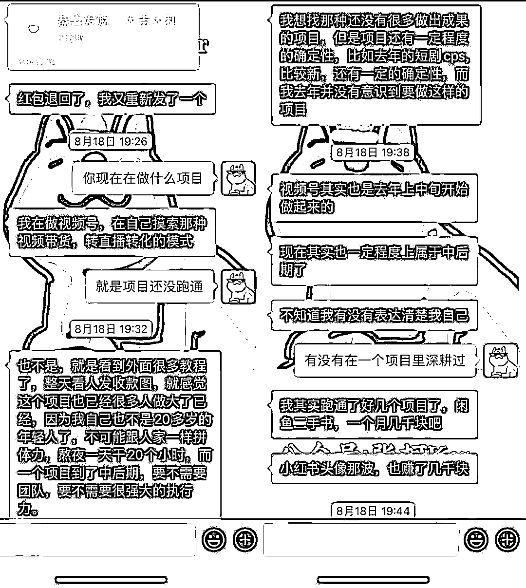

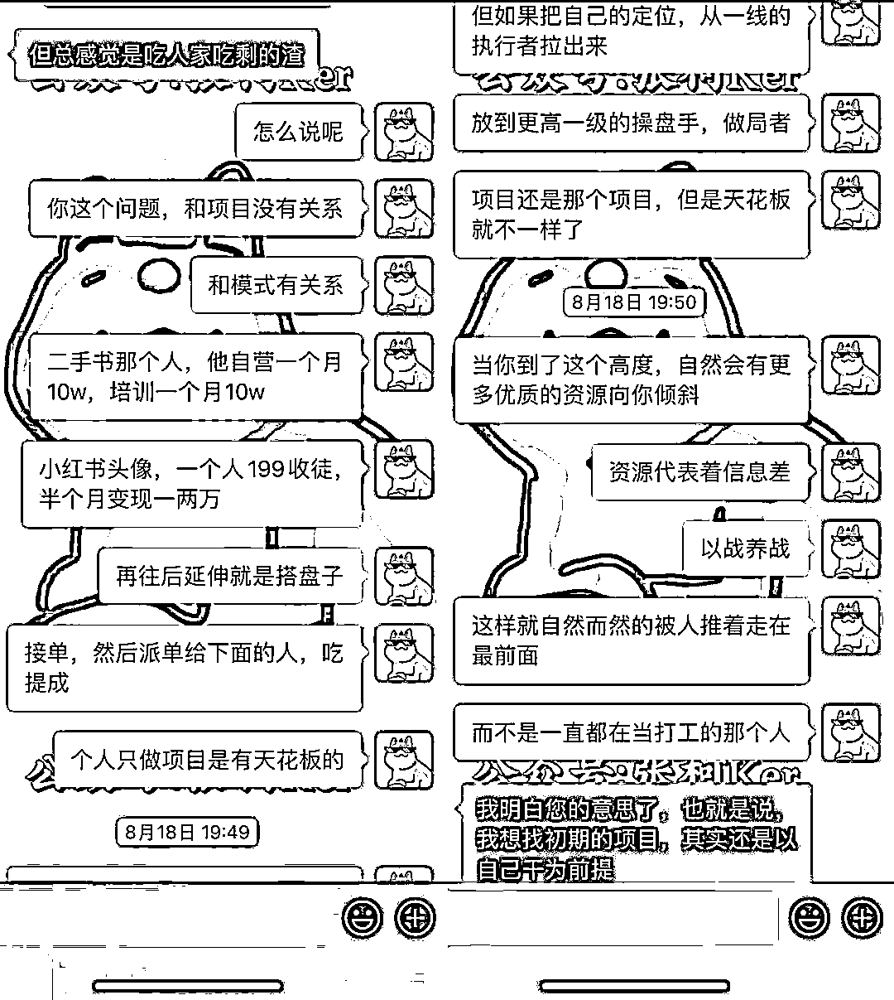

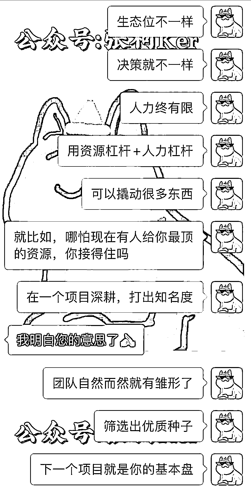

学会跳出现阶段，

**到更高一个维度去看待问题，**

**解法和天花板都是不一样的，**

很多项目，

如果单纯都是自己上场干，天花板是能看见的，

想多赚点，

**要么加号，要么招人放大，要么开发新玩法，**

如果一直不能从商业模式的根源解决，

**没有搭建自己的「长期商业基本盘」，**

那么，问题就来了，

**项目必死，能力永存，**

你做这个项目积累下来的能力，

**能不能复利，**

以后能不能用得上，

如果不能，你是不是又要从头开始？

很多人做事是没有主干的，

今天这里学一点，明天那里学一点，

但就是一直没想好，

**自己究竟想成为什么样的人，想做成什么样的事，**

**有可能是因为「试错」得不够多，**

能拿到正反馈的事情还没找到，

**也可能是因为「没开眼」，还是「困局者」，**

见过的东西太少了，

单凭自己绞尽脑汁去想也不可能想到，

虽说，

人生没有白走的路，每一步都算数，

但，

**如果走路的步伐齐一点，**

**会不会可以更快的到达商业拐点？**

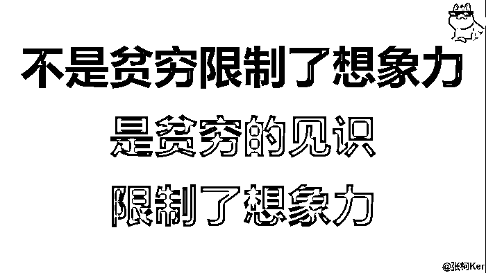

我再讲深一点，

**生态位的选择，以及商业模式的搭建，**

**都是为了「穿越周期」，**

在 0-1 跑通以后，单纯的做项目，

**很难达到「质变」，**

**基本上都是「量变」，**

短期内多赚点和少赚点的区别罢了，

要明白，

**「我可以赚到钱」，**

**和「我随时可以有钱」，****是两个概念，**

**即，赚到钱之后，**

**如何复用财富，如何守住财富？**

**财富不单单是指金钱，**

还有在赚钱过程中收获的人脉、能力、认知、信息源等因素，

**想达成「我随时可以有钱」的能力，**

就必须要有质变，而不是单纯在项目上做线性增长，

**为学日益，为道日损，**

**学习做项目的过程，是做加法的，**

只是在一条直线上一直延长，没有波动，

**而搭建商业模式的过程，是做减法的，**

是把已有直线归零为点，再去延长环绕炸成漫天星光，汇聚成「体」，

**因为前者，我们所追求的是，**

**「我要什么」，**

**而后者，需要你想的是，**

**「我不要什么」，**

继续以我为例，

我是个物欲极低的人，

因为经历过，所以更具有参考价值，

自从入行以后，

我头疼的最大问题，

**从来都不是做什么项目能赚钱，**

**而是，我赚钱到底是为了什么，**

这个问题困扰了我将近两年，

以往我只能逃避，

我梭哈，直接把钱花光，

在饿死面前，

就自然会继续开始赚钱，不用想了，

而现在，我要给出另一个答案，

我不能单纯的去想，

**我赚钱的源动力是为了什么，**

而是应该想，

**我赚钱的源动力是不为了什么，**

我为什么选择自由职业，

我不喜欢被无意义的工作束缚，

→ 我要创作，

我不喜欢每天三点一线被锁死，

→ 我要自由，

我不喜欢被工资限制未来期望，

→ 我要创业，

我不喜欢忙到没有时间去发呆，

→ 我要思考，

……

**所以我的整个商业模式，**

**都是围绕着「自由」去搭建的，**

**为了摆脱「束缚」，**

所有一切选择的底层原因，

都是因为我不喜欢某件事，

而导致我做出了与之对应的这个选择，

**我们所有当下所做出的选择，**

**本质上，还是源自我们内心的驱动，**

**我们可能很难明确的说出，**

**「我要什么」，**

**但我们一定可以坚定的说出，**

**「我不要什么」，**

你可以停下来仔细回忆一下，

你以往做出的最大决策，

是不是归根结底，

还是因为你确定自己「不要什么」，

进而做出了选择，

只要做的事情，不是自己不喜欢的，

结果都差不到哪去，

**这才应该是我们每个人要寻找的「道」，**

也就是减法，

**确定性的砍掉自己不喜欢的东西，**

**把自己归零，再「从无到有」去思考，**

**「我不要什么」，**

排除绝对错误的答案以后，

选择那些，可能正确的路，

走着走着，就对了，

**从自己心里走出来的路，**

**才有可能成为你的「商业模式」，**

**成为你的「生态位」，**

**拥有「基本盘」，**

**进而，成功「穿越周期」，**

**拥有「随时有钱」的底气，**

**实现「长期自由职业」，**

在有一定的赚钱能力后，

多想想，

**如何才能让自己可以「随时有钱」，**

**什么是变的，什么是不变的，**

天天单纯的从销售、转化、团队管理、SOP 等等去思考，

反而有点着相了，

这些东西，我现在不懂，无所谓，

**我学不就完了？**

**只要能跑通从 0-1 的人，都不会是傻 b，**

学习能力差不到哪去，

**特别是和我一样还有点艺术细菌的人，**

**更应该回归内心本质，**

**不要强迫自己去做不喜欢的事情，赚不喜欢的钱，**

很多时候，

看到同行的「强商业营销逻辑」，

也就是抓死流量、转化这两个点，

做的所有动作，都是为了最终的成交，

在纯商业的角度来看，是对的，是非常赚钱的，

他们本身也赚到了很多钱，

但我就是不喜欢这样赚钱，那是他们的「道」，

我眼中的商业，不应该是这样的，

**没有「味」，**

**我更喜欢，**

**来之则喜，去之则安，**

选择我，你一定不会亏，

不选择我，你也一定是找到了更好的，

我从来都不会去主动成交任何一个人，

要么自己主动给我打钱，

要么过段时间被我删掉，

对，我没素质，

**如果所有的「过程」，**

**都只是为了强商业营销赚钱的「结果」，**

那我所做的努力可太没劲了，

**我更想要的是在赚钱的「过程」中，**

**达成我内心证道的「结果」，**

**我最终能留下点什么，**

**比我能赚到多少钱，更重要，**

**而当我证道成功了，**

**财富，也只不过是个必然的过程，必然的附属品罢了，**

再结合前段时间亦仁老板航海家线下分享的，

**「十倍增长」以及「终局思维」，**

也给了我很大的启发，

以下内容为当时的速记整理，仅代表我个人的主观解读，

**「十倍增长」：**

核心就三句话，

**我们的业务在获得十倍增长，与获得两倍增长的过程中，**

**我们所要付出的时间和精力是一样的，**

生态位不同，

做出的选择，解决的问题就不同，仅此而已，

**1、十倍思维是关于勇气的，**

在舒适区时，

不敢付出额外成本，不敢承担额外风险，

在没有人指导的情况下，大多数人都会往后退一步，

但如果有高人指点，则不是什么大事情，会有勇气去向前走一步，

**2、要顺应趋势**

在上升的趋势中，平台放大五倍，你放大两倍，

加一起就是放大十倍，

在下滑的趋势中，平台缩小一倍，你放大两倍，

加一起还是只有一倍，

**3、要有团队**

团队拆分问题、解决问题，可以让你有清晰的笃定感，方便试错，

然后才能空出时间、集中精力发挥优势和思考战略，

要调整、打破思维模型，不能线性思维，

多回到原点去想这件事的本质和规律是什么，

**4、开放心态**

保持交流，**突破往往是在弱关系里面，**

你和你身边熟悉的人，和在同一行业里的人聊天，

往往破局灵感都不如和跨行业的人交流来得多，

**十倍增长业务选择原则：**

1、不要对抗平台，否则越往上走，越容易崩盘，

2、业务要和背后的趋势相符，要跟着趋势走，而不能仅仅只是一个业务，

3、业务的底层是不是真的有解，是否真的有解决方案，

大多数业务都可以长成年入千万的样子，边界会在过程中不断拓宽，

需要向后看，第一性在哪，能不能打开，

点线面体，你在哪个位置？

**「终局思维」：**

问问自己，

**你这个业务的终局是什么样的？**

**你在千万体量的业务终局里扮演什么位置？**

**如果有画面感，你就不会急，**

因为你知道终局就在那里，路径是清晰的，

区别只是快与慢而已，迟早的事，就不用急，

**如果没有画面感，就是路径不清晰**，

或者是选择的平台、趋势有限，

无法成为一个押注的选择，就很容易急，

**一急，动作就容易变形，**

**增长，是趋势带给我们的增长，**

**要有相信自己的力量，**

要有勇气去突破，不应该纠结短期的得失，

要把自身优势发挥极致，与业务做深度结合，

人无我有，人有我叼的东西，往往是天赋所在，

他人无法轻易复制，这就是壁垒与定价权，

注意，注意，

**以上布局者部分的内容，**

**我个人认为，**

**仅适用于已经从 0-1 跑通的业务的朋友阅读，**

在起步阶段，

更应该思考的是如何多赚一块钱，现金流就是弹药，

在没有足够存款的前提下，没有太多的试错机会与试错心态，

**长期主义是一种能力，而不是一种选择，**

当然，我再说回来，

**也不是所有人都想成为布局者，**

**不是所有人都必须成为布局者，**

**你要当兵，还是要当将，自己心里是有数的，**

我认识很多人，

就是卡在困局者或者入局者的阶段，

但他就是很开心，

**我是没得选了，**

但不是所有人都得成为像我一样的叼毛，

赚钱不就是为了开心，为了更好的生活，

既然已经过上了开心的生活，又何必割肉喂鹰，

我偶尔还真有点羡慕他们，

但我也相信自己的终局，不会太差，

大家各自努力，认真过好每一天就行了，

**不是让你知足常乐，**

**而是让你像搭建商业模式一样，**

**搭建好自己的人生模式，**

**赚钱是用来生活的，**

**不是用来继续受苦的，**

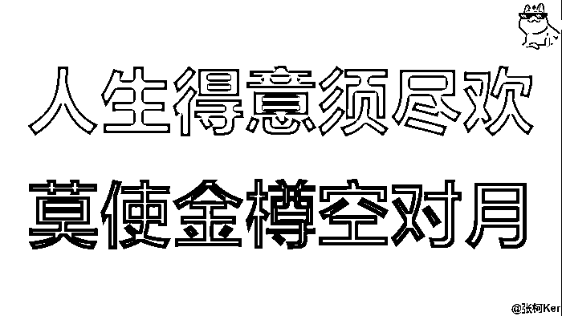

变强总得有个理由，

单纯为了变强而变强，

**最终只会成为力量的奴隶，**

别 tm 说什么顶峰相见，

这个世界根本就没有顶啊，

**能充实过好每一天的人，**

**就是真正的 winner，**

**只想着赚钱，不会生活的人，**

**才是真正的 joker，**

且前者，

往往还能自然而然的赚到不少钱，

你说气不气，

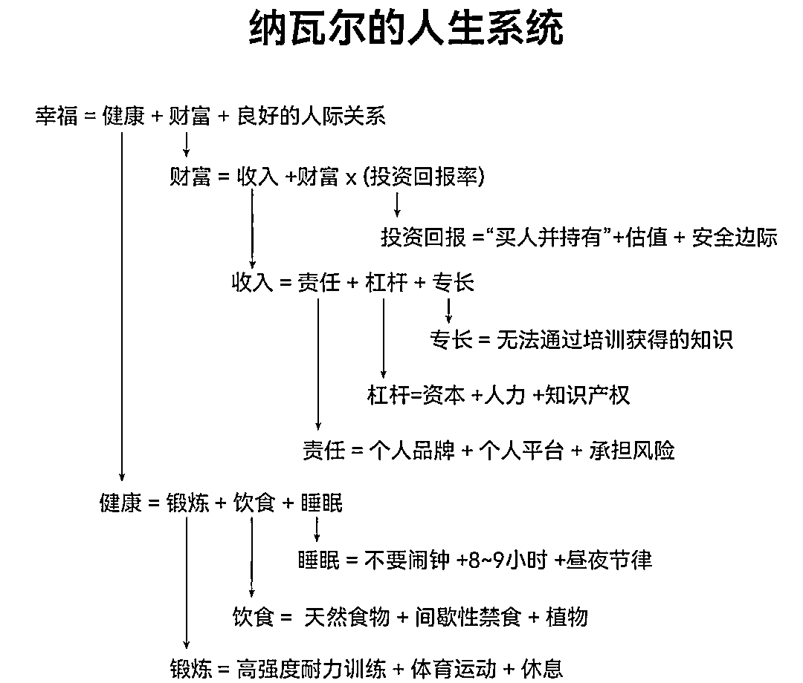

（图源网络）

**如果一直寄期望于明天会更好，**

**那是不是代表着今天是一团糟，**

且你还偏偏不想改变，

而是选择逃离今天，

什么都不做，

**只许愿「不可能达到的明天」会更好，**

最后，

这种框架性内容，知道的人很少，

**知道的人也未必想写，**

**想写也未必会写，**

还是开头那句话，

**无为使我有为，无知使我有秩，**

本身我也是既得利益者，

但我觉得，我不应该不说，

我知道自己不喜欢什么，

我不想，也不愿，

**一将功成万骨枯，**

我更希望，

**相逢意气为君饮，系马高楼垂柳边，**

以上，祝好，

有收获，请点赞，

提前祝大家，新年快乐，

微信：ker600

欢迎链接，

* * *

评论区：

周梦行 : 注意力在哪，结果就在哪，财富就在哪，说得真好。
清欢 : 先赞后看[强][强]
阿仧 biu : 柯总牛逼
星尘丶 : 太牛了
鲸鱼 ken : 深度好文，已赞赏[偷笑]
不明 : 字字诛心，别骂了别骂了 [捂脸]
浅笑 : 先赞后看！养成习惯！
523 : 先赞后看[强][强]

* * *