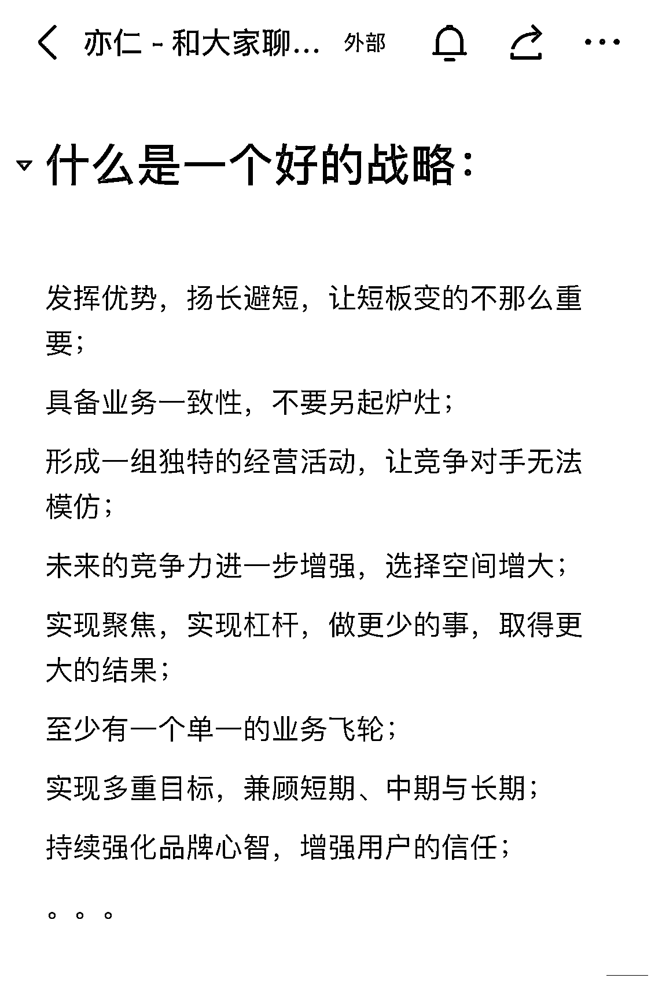

# 在我眼里，什么样的战略是一个好战略？

> 原文：[`www.yuque.com/for_lazy/thfiu8/eksnpsu0xc2h7fd8`](https://www.yuque.com/for_lazy/thfiu8/eksnpsu0xc2h7fd8)

## (245 赞)在我眼里，什么样的战略是一个好战略？

作者： 亦仁

日期：2023-12-29

在我眼里，什么样的战略是一个好战略？

* * *

评论区：

MAGGIE✞ : 👍👍👍
国强，坐标日本 : 做自己擅长的事情💪
Dreamland : 又学到了一个知识
生财小苗哥 : 在擅长的领域里挖掘优势
请回答 . : 我为什么觉得很难实现 在当前市场环境下
亦仁 : 所以好的战略是艺术，不是逻辑
杨阳 : 不找新方法
卧牛山王叔 : 提升业务壁垒

* * *