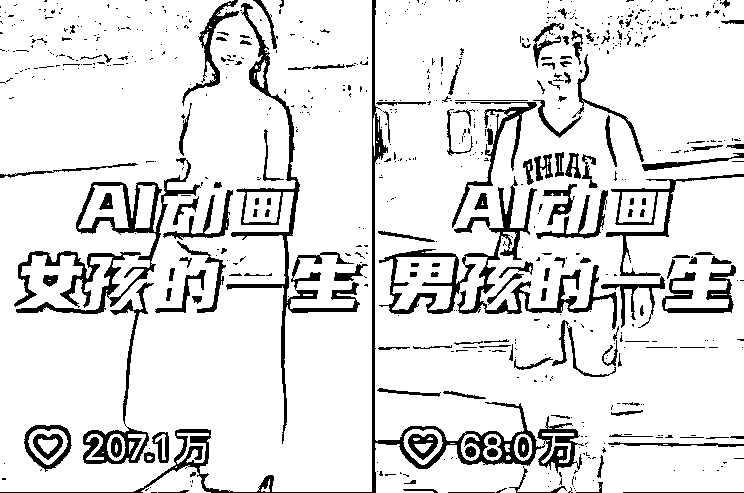
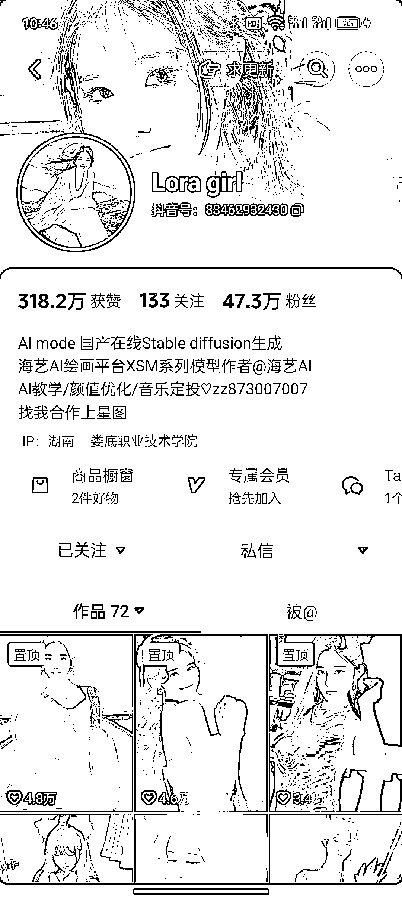
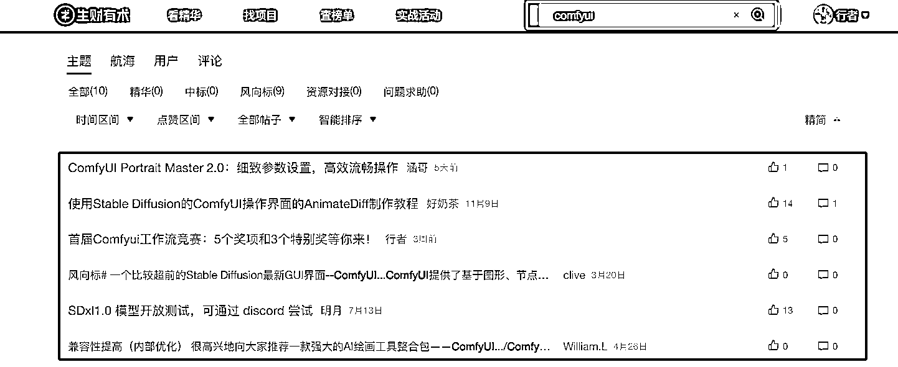
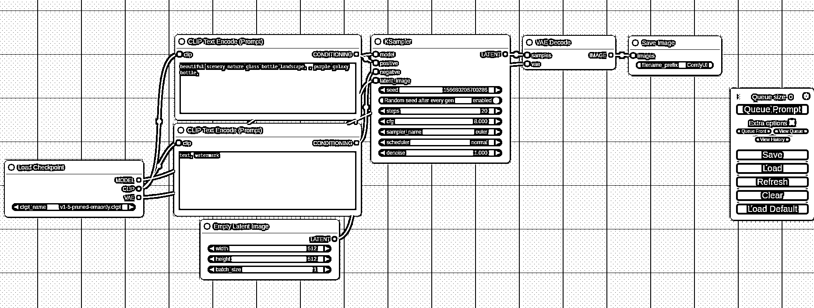

# ComfyUI 宝典新手入门和使用手册

> 原文：[`www.yuque.com/for_lazy/thfiu8/ystwtyoucsftqlgz`](https://www.yuque.com/for_lazy/thfiu8/ystwtyoucsftqlgz)

## （43 赞）ComfyUI 宝典-新手入门和使用手册

​    ComfyUI 是 AI 绘画的新秀，其独特的工作流机制+显存占用优化，吸引了更多的开发者和个人使用者。使用 ComfyUI+animatediff 可以生成丝滑的视频， 比如抖音前段时间很火的一个女孩/一个男孩的一生，以及各种新的 AI 应用（SVD,Turbo,Krita 实时渲染）。2023 年 AI 进化的速度非常快。

抖音上很多 AI 美女视频账号，效果几乎以假乱真了。涨粉的速度也非常快。比如下面的这个账号。现在还是拿真人生成 AI，那么未来是不是 AI 生成的视频来进行 AI 创作。

​                              

搜了下生财帖子，comfyui 领域的文章很少.在生财小航海起航之际，写一篇 ComfyUI 入门和使用手册。

### 一、ComfyUI 是什么

ComfyUI 是一个基于节点流程式的 stable diffusion AI 绘图工具， 你可以把它想象成集成了 stable diffusion 功能的 substance designer， 通过将 stable diffusion 的流程拆分成节点，实现了更加精准的工作流定制和完善的可复现性。（但节点式的工作流也提高了一部分使用门槛。）

### 二、使用 ComfyUI 有哪些好处？

ComfyUI 为 Stable Diffusion 提供了一个强大的节点流程操作界面，带来了更多的自由度和可复现性，同时降低了显存要求。ComfyUI 生成图片时的速度相较于 WebUI 有 10%~25%的提升,对显存占用小，现在 8G 显存就可以在 comfyui 上使用 XL 工作流了。

除了显卡优化以外，ComfyUI 是一款易于上手的工作流设计工具，基于工作流节点设计，可视化工作流搭建，快速切换工作流，除了支持文生图，图生图，高清修复，面部修复，局部重绘，LORA 等工作流节点，还支持多种插件，如 Reactor、Controlnet、IPAdapter 和 AnimateDIFF 等。

对应企业内部的工作流，可以搭建好工作流后，一键运行。比如一键替换背景，抠图。或者摄影类，搭建摄影工作流。comfyui 节点流的一个很大优点是，你也可以直接导入别人分享的工作流，加载即可用。

本篇篇幅较长，为给您更好的阅读体验，请移步飞书直达：

[`jrnoijjrwm.feishu.cn/docx/QVeOdYtiHooLkRxmOzccLdb5nKc?from=from_copylink`](https://jrnoijjrwm.feishu.cn/docx/QVeOdYtiHooLkRxmOzccLdb5nKc?from=from_copylink)