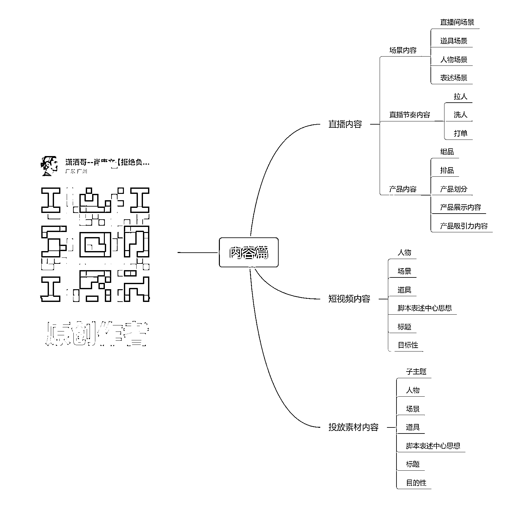

# 视频号史上最全实操干货全文！

> 原文：[`www.yuque.com/for_lazy/thfiu8/ruvcmsustlil0g7k`](https://www.yuque.com/for_lazy/thfiu8/ruvcmsustlil0g7k)

## (110 赞)视频号史上最全实操干货全文！

作者： 潇洒哥--肖康文

日期：2023-12-26

**【生财有术****原创****首发】**

**想通过几句话讲明白直播带货，简直就是异想天开，天方夜谭!**

这篇长达数万字的直播带货实战心得，目的是为了帮助那些没什么资本资源依旧心怀梦想的人，提供一份全面的实战操作指南，为了便于理解活学即用，该指南按执行的先后顺序，由浅入深分别进行实操化复述。

**1.赛道选择!**

当今情况下，你的目的是什么? 应该如何选择赛道!

**2.产品与玩法的关系！**

带你打开顶级操盘手的商业全局观，操盘手必知的一个问题！

**3.视频号的算法！**

玩法千变万化，自始至终是为迎合算法产生的某种形式!

**4.内容篇**

看懂内容，才能理解直播！

**5.话术篇**

话术背后的用意与逻辑

**6.数据篇**

不同玩法需要注重的数据不同

**7.投放篇**

抖音的随心推和千川与视频号的微信豆与 ADQ

**8.复盘篇**

复盘是直播公司最重要的核心关键点

**9.直播玩法篇**

市面上流行玩法，背后的一些小 99!

**10.自身团队情况如何选择匹配的玩法！**

找到自己最擅长的，发挥到极致，才有可能获胜，延长避短才是每个公司应该做的！

**11.团队篇**

从 0 到 1 组建直播间团队

**12.场景篇**

优质的直播间打造攻略

**13.直播间运作流程**

直播团队必备运营技能

**14.协助小工具篇**

运营过程中的各种小的插件软件及其运用！

**15.从电商历史进程，分析【抖音与视频号】**

看懂平台，找寻规律，拿到结果

**16.商人思维看待直播行业！**

带你打开另外一个互联网视角！

**17.历史经验分享篇！**

从事 9 年电商行业，个人经历分享，带你避坑！

## 一、赛道选择--当今情况下，你的目的是什么?

应该如何选择赛道？

**字节跳动-张一鸣说过: 对事情的认知是最关键的，你对事情的理解，就是你在这件事情上的竞争力!**

**提升认知是第一步，选择好赛道是第二步!**

现在的直播带货行业竞争力已经非常激烈了，早已是红海，越来越难做了。但真正从平台角度来看的话，视频号的增长才刚刚开始呢！视频号直播带货才刚刚进入付费阶段，甚至还有非常多类目付费人群都没洗出来呢，23 年下半年用户增长强劲，达到历史最佳。可喜的是这种增长，带来的还有内容满意度的提升！

为什么说视频号才刚刚进入增长阶段呢? 因为视频号 23 年中旬定位一个战略是让其中平台所有的中腰部商家都过来视频号，平台给他灌流量，从这个战略可看出来，视频号的战略层已经非常明白，视频号在各大直播平台中的真正站位！

**视频号的核心优势是基于微信大体量用户下的产量，我给兄弟们经常比喻的就是，视频号就是微信的一个亲儿子，微信就是世界首富，任何平台都没有微信的用户有粘性，没有微信用户的体量多。视频号要做的其实就是接住微信的流量即可，跟抖音需要做引流是截然不同的，视频号只需要有好的内容去承接流量就可以了，视频号 23 年官方战略会选择邀请其他平台所有中腰部的网红过来视频号，核心已经表明视频号的战略层已经觉悟了，也正是这个动作，让 23 年下半年迎来了视频号这几年当中最好的增长数据。从用户体验时长上的增加，到各种粘性的数据增加，前段时间线下课跟兄弟们还说过，我在同一天上午的时间，刷到了好几个抖音刚刚刷过的视频，视频号也刷到了！从这可以看出，视频号内容端已经慢慢的在变好，用户体验也越来越好！是因为很多在抖音的博主网红，都来视频号发内容了，一样的内容发两个平台而已，所以内容其实是一样的，抖音 23 年已经没有什么用户增长了，视频号却增长巨大！这是每个电商平台红利期最好的表现！用户体量的持续增长，也是平台野蛮生长的时刻，迎来了流量的红利！**

不过视频号也有一些产品已经进入了红海阶段了，这其中的核心是因为这个行业的商家入局比较早，而且见效也是最快的。

就比如说你是卖牛仔裤的，你在牛仔裤的产业带，你在视频号爆单了，那你同行也肯定会知道，就会引发大批同行进入视频号，导致视频号这个行业的竞争维度早早就已经白热化了！所以大家选择赛道时，切记注重**三个核心点：**

**1.你这个竞争对手数量           2.你竞争对手的规模           3.竞争对手能力强弱**

咱们做任何事情都得先了解现有行业情况和竞争维度，才可更好的获得成果。所有的盲目都是一个未知数，都会为你事业日后的灭亡积累多个隐形炸弹！之前我有分享过如何去查看竞争对手的数量和竞争对手的规模，判断这个行业是否处在卷与不卷之中的！核心是：以**短视频的数量**判断，和**直播间账号数量**判断，与其他平台的存量相对比判断！

在选择赛道当中还有一个非常重要的维度就是，自身团队的情况，与自身的目的性。如果你团队能力偏向拍摄美工剪辑类型，那不容置疑你团队能力更加适合做素材类型的玩法。但如果你团队更偏向主播端，那肯定更偏向搞直播间，重直播间打法的。又如果你公司的强项是供应链能力，那你应该发挥自身供应链能力才是最正确的！

赛道选择的核心目的就是：根据自身情况，判断出来做什么事情才是最正确最有可能性的，才最有能力去把握的！

**只有赛道选择上对了，后面的所有技术才能被正确使用,拿到结果！**

## 二、产品与玩法的关系！

**带你打开顶级操盘手的商业全局观，操盘手必知的一个问题！**

所有带货直播间只有两种类型：一种就是**单品直播间**，一种就是**多品直播间**。流量也分为两种：一种是**偏向精准的付费流量或者素材进来种草精准流量**，还有一种就是**不这么精准的广场流量**和**吃瓜类型的视频爆了引进来的流量。**这个也是大家一定要知道的，有些产品本质上就会更加适合某种打法，有些团队也会从本质上更加适合某种玩法，所以咱们在开始做之前，需要理解这其中的关系和含义！

有些高端产品，例如杯子；普通杯子在大众认知中都是几块到几十块这种价值认知，但是如果你一个杯子有特殊的作用要卖几百块，这种情况下你去做广场流量纯自然流，这种产品本身就不具备这个能力的。从这种选择上就已经错误了，广场流量进来直播间是目的性没这么强的，精准度没这么强的。所以导致我们想要做这种玩法时，在选品端就要选有价值认知差的产品。例如你苹果 15 最新款完全不拆封，这种市场价值认知非常普片的。你把他市场半价去售卖，只需要做的一个核心动作就是证明它是原装正品，真实的、没有任何瑕疵和问题的手机！这种就是观众贪便宜的心理！想要做广场极速流，或者不精准的流量，一定要有给观众贪便宜的心理！但如果你是偏向高价的产品，售价普遍高于观众价值认知的，这种情况下，你需要提前种草，或者是有非常精准的流量，这种才有可能去成交它。

还有团队跟玩法之间的不同关系等等等~~~

**切记****：在开始之前需要有系统的认知与团队认知！才能走的更远，更久，更好！**

## **三、视频号的算法！**

**玩法千变万化，自始至终是为了迎合算法产生的某种形式!**

直播玩法千变万化，有憋单的，有平播的，有自然流的，有微付费的，有纯付费的，有打素材的，也有打人设的，还有玩演戏的，搞套路的，等等等~~~太多太多了，所有打法的成功都源于迎合了平台的算法！

我从事电商 9 年有余了，从一开始做淘宝刷单，到抖音直播的养鱼去刷数据等等这一系列的违规操作，都是为了迎合算法系统。而出现的一些操作手段，核心原因是因为所有电商平台背后都是一台电脑机器，都会有他们的一个算法机制和公式！就例如憋单，为什么直播间会出现憋单这种行为呢？？为什么又有些直播间是平播的？为什么又有些直播间是微憋单呢？核心是：**一切源于迎合算法！**

大家要知道，视频号跟抖音不同。抖音是纯正的兴趣电商，但是视频号是社交电商与兴趣电商的结合体。这其中非常关键的一个点就是视频号有很多社交功能，也会给直播间带来权重。所以视频号不能以抖音兴趣电商这种维度去判断视频号！兴趣电商的算法我之前就分享过很多次了，这类算法的核心就是：系统是根据那些数据维度去判断直播间。哪部分的人更喜欢你的直播间去判断的！就例如系统推给你 100 个人，其中有 95 个人瞬间离开了，5 个人在你直播间停留很久，而且给你做了各种各样的数据。例如停留互动、关注那些，后面还下单成交了。这种情况下，系统是不是就会明确知道这 5 个人是比较喜欢你直播间的，系统后期就会给你推更多这种类似的人群。系统一直给你推人，你一直给系统正向反馈，留住喜欢你直播间的人。这种情况下，你的账号标签就慢慢形成了，慢慢系统就已经给你打上了标签，就知道给你推荐什么样的人了，这种情况下，你直播间就算是正常起号成功了！

最终逻辑算法，是以谁更喜欢你直播间来推流的，谁喜欢你的直播间系统是以用户看到直播间的表现数据来判断的，**曝光点击率，点赞，停留，互动，关注,灯牌，小黄车点击，小黄车停留，下单，成交**，这些数据都是有不同权重的，**还有分享功能，预约功能，具体权重也跟账号阶段有关系。**

**切记：系统抓取的是以曝光量为基准的方式计算，在浅层数据电商数据之上的曝光进入率或者说用户进入精准率有时会让数据极度夸张的变化!所以会出现有时换一个场景直播间流量变化极大的情况，切记 ip 账号主播本身也是场景之一。**【拿流量的核心是赛马某单个数据极度夸张爆发或者多个数据综合达标，即可产生持续推流的情况】

这其中标签，账号阶段考核的核心数据，等等等这些也是非常需要注重的！

**视频号的算法核心考核的数据维度是：**

1.  **曝光进入率**

2.  **停留**

3.  **点赞**

4.  **互动**

5.  **关注**

6.  **粉丝团**

7.  **小黄车点击**

8.  **小黄车停留**

9.  **下单**

10.  **成交**

11.  **分享功能**

12.  **预约功能**

上次线下课我有专门非常明确的讲清楚明白视频号的具体不同阶段下，应该注重那种数据，这其中分享功能和预约功能，算法是如何定义这两个数据维度的！

## **四、内容篇- -看懂内容，才能理解直播！**

内容分为**直播内容**与**短视频内容**和**投流素材内容**，三个内容板块。我们看一个账号时一定要从三个内容板块去分析一个账号，才能更全面的分析这个账号的核心优点，他哪个板块做的最好，他的成功是因为哪个板块的内容！

直播内容又分为：**场景内容**，**直播节奏内容**，**产品内容，**三个细分板块。

往常跟大家说的最多的，大家最感兴趣的也就是**直播节奏内容**。我把所有带货直播间都分成三个节奏：**拉人**，**洗人**，**打单**，总共三个环节。咱们要看直播间内容时，要分析他直播间的节奏哪种节奏占比多少，为什么他的直播节奏是如此安排，跟他的场景内容有什么配合的地方！产品端是如何配合的！

场景内容又分为：**直播间场景**，**道具场景**，**人物场景**，**表述场景**，四个细分内容。每个细分内容都可以解决相应不同的问题！直播间场景可以解决部分玩法的匹配度和信任感问题，道具场景也是，人物场景也是，表述场景也是！今天就不细讲了，之前线下课给兄弟们分享过很多细节的！

产品内容又分为：**组品**，**排品**，**产品划分**，**产品展示内容**，**产品吸引力内容**，5 个细分内容。

每个细分内容解决产品力方面的各项问题，大多数团队都是只关注产品组品，排品，其他的三个细分内容就没关注过了！

直播间的节奏内容与场景内容和产品内容这些内容直接的关系各种搭配达成了直播间的整体内容！

短视频内容和投流素材内容也是一样的，很多细分内容，咱们关注内容时需要拆分成各个小细分部分。这样去分析内容、拆解内容才能真正理解内容，看懂内容。在做操盘手生涯中不断去看内容，再不断去看对应内容产生的数据，你对内容与流量的关系会慢慢形成一种敏感力。这种敏感力，恰恰是操盘手最需要，最应该有的。这种敏感力，可以让你对内容有原创设计能力，和对好的内容的学习力！这种对内容的理解，能让你更透彻的理解直播带货！

**内容篇总结：**

**多看内容，多拆解内容，不断积累学习，一点点沉淀，积累内容敏感力，才能真正成为顶级操盘手！**

## **五、话术篇- -话术背后的用意与逻辑**

我自己培训主播一直以来有一套自己的思维和方式，我把话术分为 13 个细分类别：

**1.活动话术，2.痛点话术，3.卖点话术，4.场景话术，5.信任话术，6.开款话术，7.踢单话术，8.保障话术，9.转场话术，10.互动话术，11.指导话术，12.留存话术，13.配合话术**

**什么是活动话术？**

针对直播间设计一些活动主题氛围让观众感受到今天是不一样的一天，活动话术可以增加直播间的营销氛围，提高直播间的吸引力！

**什么是痛点话术？**

我们生活中迫切需要的，抱怨的，不满的，让人感受到痛苦的都是痛点，每个产品的诞生都会解决部分痛点，痛点话术就是把客户迫切想解决的痛点用话术形式说出来，痛点话术可以提高用户对产品的购买欲望！

**什么是卖点话术？**

直播间产品的卖点也正是痛点的解决方案，卖点话术讲的越好可以让客户对产品的购买欲望提高！

**什么是场景话术？**

场景话术是主播对用户对生活场景的描述，主播用假设的方式描述用户在自己生活场景中拥有了该产品的使用会带来的好处，场景话术就是根据产品对应用户的使用场景进行假设描述！

**什么是信任话术？**

核心解决用户对直播间的信任缺失的临门一脚，主要解决三个信任纬度，1.为什么要买，2.为什么找我买，3.为什么今天买，信任话术在直播间中极其重要！

**什么是开款话术？**

当主播在直播间介绍完商品卖点，活动，购物保障需要引导用户去下单，引导用户下单的话术，就叫做开款话术！

**什么是踢单话术？**

直播间主播介绍完产品，并开款了，但是还是会有客户依然犹豫不决不下单，或者是下完单没付款的情况，那不下单的原因有非常多，这个时候用一些踢单话术，还有最后一单了，这种类型的紧张感，就可以直接让犹豫不决的客户直接下单！

**什么是保障话术？**

直播间在介绍完产品痛点卖点时，客户听了会有一些不信任感，这是增加一些解决客户当时考虑的顾虑话术，例如正品保障，假一罚三，有运费险等类似的～～就是保障话术，保障话术核心是解决客户购买顾虑的话！

**什么是转场话术？**

在直播间的过程中会出现人气低迷，销售下滑的情况，如果不及时调整就会造成在线人数持续下滑，遇到这样的情况，主播就可以通过转场话术来创作新的话题点，重新吸引看播客户的注意力，重述直播间价值，在次吸引力客户注意力的话术就是转场话术！

**什么是互动话术？**

在很多兄弟们的认知当中，评论就是互动，这是一个非常错误的认知，互动里面包含了客户评论，但评论不等于互动，直播间中点击进入直播间，点赞，点关注，加粉丝团，评论，点击小黄车，下单，点击福袋包括看直播间都是互动，客户在直播间做的所有行为都是互动！互动话术是能引导客户做出互动行为的话术就是互动话术！

**什么是指导话术？**

是教客户如何操作，或者是提醒用户如何操作，又或者是模拟给做出某种操作的客户相应的好处，诱导性的指导，所有一切有指导客户做什么动作的话术都是指导话术！

**什么是留存话术？**

是主播描述直播间价值，透出直播间吸引力，增加用户停留时长都叫留存话术！

**什么是配合话术？**

直播间助播，场控，中控，等～～一些列除了主播的人员之外，一切配合主播去做直播间氛围节奏的话术都是配合话术，配合话术核心是帮助主播去输出【创造产品价值，营销直播间氛围，帮助主播逼单，踢单，等等帮助主播的一切直播间输出都是配合话术】，团队代替主播输出时，也可以让主播有稍微休息一下的时间！

很多团队都知道话术很重要，但是可能从来没有真正理解拆解过话术背后的用意和逻辑。一个厉害的直播间主播的话术都是被设计过的，而且是一字一字扣出来的。为什么有些团队可以无限复制自然流直播间？无限复制主播？很多时候就是因为操盘手对话术的理解很深，知道用意与背后的逻辑，而且可以明确讲给主播听，甚至演示给主播看。

我去年，也就是 22 年时，跑一个玩法模型。【我们平常每个直播间都会有各种不同长度的话术脚本，这是为了应对不同情况时做出的调整手段，针对各种突发情况准备了各种应对脚本，脚本背后延伸出具体的话术细节，去年玩的那个玩法模型时总共有 12 个维度的长度话术模板】，我一个月就优化了 500 多次，一个字一个字根据数据不同的表现，不断的去扣细节，优化细节！

所以即使来一个完全没干过直播的新人主播，在我手里只要 3-7 天就可以上岗，而且不会比老主播差，是因为一个玩法模型当中各种会出现的问题，都被记录过，而且都用具体的优化细节记录了起来。不管是主播的姿态动作还是话术细节表达情绪，都是完全被记录起来的！

主播与话术之间的关系，一定要记得，**主播不是背话术的，而是理解**，而是要表达话术背后真正的用意。例如逼单话术，不是说你要完完全全要把那段话说出来。而是你要在当时情况下，用适合自己的方式去逼单，永远要知道话术只是用文字表达你想表述的意思，所以主播尽可能要去理解话术而不是死记硬背！我之前在主播系列线下课有教大家如何用到这些话术去组建成自己的话，如何去培训自己的主播。这些话术一定要灵活运用，千万不要死记硬背，不然可能你的主播一直卡在一个粗浅的位置上不去了！

**一定要学会拆解话术**，我之前给大家上的主播系列线下课当中有具体讲过如何培训一个顶级主播，其中最重要的一个点就是培训主播理解话术，话术拆解一定要一个字一个字的拆，一个字一个字搭配他当时的肢体动作和场景内容的去分析他表达的是啥，才能真正拆解真正的含义，大家要知道话术只是用文字表述而已，人与人的沟通交流 30%是说话，70%是肢体动作，所以在拆解话术时要全套搭配起来！

拔取话术，做直播的一定要学会拔取同行话术，拆解分析，学习借鉴等动作！

**话术篇总结：**

**话术是死的，主播是活的，千万记得主播可以背话术，但是不要死记硬背，理解话术背后表达的意思才是真正要做的！话术没有绝对的会坏，只有不断根据数据去调整优化，不断扣细节一点点优化，才能诞生更好的话术！**

## **六、数据篇- -不同玩法需要注重的数据不同**

所有直播间的流量推送情况都是有因果关系的，优秀的直播带货团队一定是会分析数据情况，不断调整优化直播间内容的，只要你是做电商的，那就一定离不开数据整理统计！

**01、分析流量来源技巧**

通过数据大盘，点开流量详情即可查看，流量来源可以帮我们分析出各个渠道流量来源的占比，在不同的环境下，分析的手段也会有所区别。

其中一个非常关键的点就是不同玩法对应主攻流量渠道可能不一样，例如主攻短视频的，或者主攻付费的，又或者主攻直播推荐的。这其中他们的流量主要来源渠道都是不同的，所以我们需要根据自身的玩法对应去分析自己的流量情况！

作为一个新号，重点关注的是你玩法对应的主攻流量和直播推荐的占比就已经够用了。可以通过占比分析出你的流量来源情况。一般情况下，你的主攻流量和直播推荐是相辅相成的，也就是说你的主攻流量爆了，你的直播推荐也会被带动起来，如果你的主攻流量本身就是直播推荐更是直接，爆发程度是非常迅猛的！

关注流量渠道来源直播间也是可以根据流量情况来调整的，因为每个渠道的流量不同对应的承接方式也是不同的。每个流量渠道的流量精准度他们需要的承接方式都是不同的。例如你视频端来的流量，可能是因为看了你种草型素材来到你直播间的，这种客户本身就是偏精准了，很多时候你需要承接的方式更多是偏向于打单的动作承接了！如果是主攻直播推荐的承接方式又是不一样，直播推荐广场流量本身是精准性没有这么强的，所以承接方式是偏泛的！

在查看流量渠道占比时一定要做好数据登记，通过周期环比分析，可以得出你近期某流量渠道的表现效果，再对内容作出及时调整。因为直播间的流量都是综合体来的，只是前期新号的主攻流量端口可能会很单一，大的流量核心来源可能就是在那一两个渠道上，但是都需要实时关注所有流量渠道入口的占比情况，及时发现流量的变化，对直播间做出最好的优化动作！

**分析流量核心总结：**

**流量渠道中有些流量是非常不精准的，如果自己不及时操作可能还有坏处，所以关注主攻流量渠道时也要关注其他的一些流量占比变化，可以做好每场数据登记，用周期环比的分析方式去进行对比！**

**02、分析用户画像技巧**

这部分更多用于新号打标阶段，通过大盘右上角的画像罗盘，可判断当场直播用户占比的人群模型。如果说模型反映出来的人群不精准，这时候就需要关注几个方面：第一是流量占比最多的来源是哪一个、引流品的选品是否有问题、付费推送的框选是否正确，直播内容是否与以往有所改变引来其他人群，然后通过进一步的人工调整，把用户模型纠正。

**03、互动数据的分析技巧**

主要分析对象：**停留时长**，**点赞率**、**评论率**、**关注率**，**加粉丝团率**，**分享直播间人数**，这些数据的交叉权重，可大体上反映直播间的人气。很多培训博主提到的，达到怎样的停留、加粉率才合格，这种并不准确，任何指标的对比，一定是类比时期、类比同品才有意义。比如一个开播不到半个月的新号，要进行指标之间的对比，就应该去寻找所处同一流量级别或者高于自己级别的优质账号进行对比，这样才能更多分析出优化的区间，这其中还有一个关键点就是考虑渠道分别进来的流量表现情况，系统在计算交叉权重时，是渠道流量与渠道流量的影响关系，也就是说系统考核你直播推荐的数据，核心考核是直播推荐这个渠道进来的这批人的数据为主！一些小团队就没必要做的这么细，因为你们本身流量基数也没这么大，流量渠道也比较单一！

**04、交易数据的分析技巧**

主要分析对象：包含**GMV**、**小黄车点击率**，**小黄车停留**，**小黄车成交率**，**整体曝光转化率**、**千次转化金额**等等~，每一个指标有着对应的优化方向，GMV 代表本场的交易数据，将之与过去的交易额进行对比、与过去 7 天的数据做环比，可得到近期数据的整体表现。再比如人均 GMV，更适合的不是单场之间的计算，而是周期性环比，一周、两周，因为客单价的提升绝对不是单场能够衡量，需要一个周期的爬升，其他数据的分析也同理，只不过代表的优化对象不一样而已！

**05、流量数据的主要分析对象**

包含：**场观、峰值，流速，流速稳定性**，这 4 个数据可以最直接的反映当前直播间的流量规模程度与直播间的流量模型类别，场观适合按周计算。经常发现的一点是如果场观在周期环比下降的情况下，主要流量渠道的占比也可能在降低，而峰值的计算需要区分开场峰值跟推荐峰值，开场峰值受上一场场观跟推流波动的影响与最近 7 天直播历史数据的影响，而推荐峰值则受当场互动指标、电商指标的影响。

**06、直播间流速的情况数据**

视频号罗盘暂时没有像抖音一样的运营专业版的大屏，只有普通版的大屏，但是流速情况是有明确数据情况的。在直播大屏的左下角，通过直播间流速情况，可随时对当前流量的留存进行计算，同时推流人数的表现，也进一步体现当前流量的健康程度，以及互动、交易指标的完成程度。对于一场合格的直播间，在直播未进入下半场时，整体的五分钟数据应该呈现螺旋上升，只有这样，才能在当场中拉升推荐峰值，数据不错的情况下持续一段时间后会推送至更多广场流量，这其中可以从互动数据和电商数据两个维度提升优化！

**07、实时直播的评论展示**

表现直播间的引导程度跟健康程度，评论区的扣评，大多受直播间活动、主播引导的影响，对于活动类直播间，重点关注实时评论区的扣评回复及频次，而对于平播形式的直播间，则更多关注用户的扣评问题，进而形成后期主播培训的优化回复话术，也可在遇到恶意评价时，用水军去引导配合主播带动直播间的氛围往好的方向走！

**08、转化漏斗的分析**

打开直播数据的入口，进入单场数据，找到该直播场次点击右边的数据详情，找到带货数据，里面有整体转化，可查看整场直播的营销漏斗，从**曝光转化率、点击转化率、下单转化率、成交转化率**，可大体打出漏斗对应的哪个环节出了问题，曝光点击率可简单你直播间的封面与直播内容的质量情况，点击转化率则又受购物车商品排列、卖点设定、主播话术引导的影响，下单转化率更多依赖主播引导、定价、详情页，而最终转化率，同样受主播逼单效果，商品的实际吸引程度，可以说每一个维度的因子拆分，对应的就是具体的问题，只有把漏斗从上至下，任何一个分漏的收紧，都会对最终的成单转化造成极大的影响。

**09、优劣商品分析**

**爆款链接、引流品、测款爆款链接**是三类需要重点分析的商品。爆款链接是单场或者连续多场排名靠前的商品可作为直播间爆品主推，引流品就是查看他每场的小黄车点击率，成交率，等，其中一个非常核心的点是，引流品拉人时的在线留存率，这个是很多操盘手没有关注到的，引流品周期有些比较短，所以需要及时关注，引流品对直播间的重要性占比巨大，应当实时关注多准备备用链接，同时通过选品补充新品，所有产品中，劣质产品即在小店售后处理中，退货率较高的商品，像这类商品容易造成销售业绩的虚高，但实际上对小店评分，用户影响很大，要及时淘汰掉。

针对直播间的数据分析，单纯的从直播罗盘并不足够，但是视频号内部数据还未向外部第三方软件授权，可能等视频号在成长一段时间后，会出现像抖音蝉妈妈等一系列的第三方插件出来，现在视频号的第三方插件数据都是不准的，没有可看性，正是因为这种数据的不透明，导致视频号还有非常多的蓝海类目产品未被发现！

## **七、投放篇- -抖音千川，小店随心推，视频号微信豆，adq**

视频号付费还是刚刚启动没多久阶段，像 ADQ 也是刚刚出来，还在洗数据阶段，就类似于抖音千川刚刚出来一样，数据是非常不稳定的。现在的 ADQ 就是如此，这段时间我们投了很多 ADQ，对比微信豆，ADQ 的 ROI 各项数据都会表现比微信豆差很多。所以调整过后，整体重点投微信豆为主，今天投放篇也主要讲微信豆为主，ADQ 的话，暂时没这么稳定，大家可以先投微信豆已经够用了！今天在这里给大家分享一种微信豆的投法！

在学习具体投法之前大家一定要记得，投流是给直播间购买流量的一个行为，这种购买方式他可以从这几个层面影响到你直播间。第一，这些进来直播间的付费流量，可以影响你直播间的实时标签数据；第二，这些进来直播间的付费流量，可以影响你直播间的实时直播综合数据！如果你是玩纯付费的，那这两个点倒是可以忽略掉，但是我希望大家真正认识我后，都是有能力去做直播间策划设计的，有能力拿到自然流的！

其次一定要知道的是，付费流量中，有不同选项，这不同选项也决定着你的出价高低，决定着你的流量精准程度！

**你在购买付费流量时都会有这些选项：**

**1.观众**

【这个选项的意思就是购买观众进入你直播间】

**2.商品点击**

【这个选项的意思就是购买观众进入你直播间且更高机率点击你的小黄车】

**3.互动**

【这个选项的意思就是购买观众进入你直播间且更高机率给你互动】

**4.涨粉**

【这个选项的意思就是购买观众进入你直播间且更高机率关注你】

**5.提高订单下单**

【这个选项的意思就是购买观众进入你直播间且更高机率给你下单】

**6.提高订单成交**

【这个选项的意思就是购买观众进入你直播间且更高机率给你成交】

**7.支付 ROI**

【这个选项的意思就是购买观众进入你直播间且更高机率给你成交还满足你要求的 ROI】

**大家了解这些选项时，一定要知道这些选项背后是你给系统交钱后，告诉系统你购买流量的目的是什么？系统明确知道你的需求后，会按你的目标去给你找人！越是深层的数据维度，卖的越贵，所以想要更便宜的获得流量，一定要有直播间的内容设计去配合承接付费流量，不同指标背后的承接方式不同！**

这其中我重点说两个选项，是我平常很少用的。互动和涨粉。为什么我说我个人很少去用这两个选项呢？？

是因为我觉得这两个选项性价比不高，我更多是选项：**商品点击**，然后想要互动和涨粉的话，是优化主播的话术内容，和话术频率去达到这两个数据。因为互动或者涨粉，可能是商品点击的流量的几倍价格。

你要知道，你购买的流量去你直播间会给你做商品点击，这本身就是对你直播间商品有一点点意向了，所以你花 100 块购买到 100 个商品点击的意向客户，你在话术做优化和增加频率，你的互动和关注率，自然会被增加，，但是你花 100 块够买互动或者涨粉的流量，可能只能买到 30 个，这其中 30 个，是对你直播间有一点点意向，这些人是平常非常喜欢互动和关注别人直播间的人群，所以导致系统在卖这部分流量时，可以卖出更高的价格。所以大家不要去做冤大头，去花这个钱买这类数据指标动作！

下单，成交，ROI 之间的关系也是一样，如果你直播间的节奏，其中逼单能力偏强，那可以买下单就好，如果你直播间逼单能力偏弱那就选择成交和 ROI 会更好！

这种选项背后，还有很多很多细节门门道道，对直播间的影响也是多方面的，之前线下课就给大家普及了，什么情况下付费可以撬动自然流，什么情况下，付费会压制自然流，这两种情况都是有的，但是在不同的情况下，需要的用法不同！就不多说了，先来了解具体投法！

**第一种微信豆多笔投法：**

首先大家要知道，视频号微信豆跟抖音的小店随心推有个非常大的区别就是：随心推投的话，基本上你的钱都可以全部花完。但是微信豆不一样，他是 500 块钱一笔，5000 微信豆。就例如你投 30 笔微信豆，500 块钱一笔，30 笔总共是 1.5 万，但是他每次消耗的话，就只消耗了三分之一，大部分都是 500 块钱的计划，消耗 100-200 多之间就停了，如果你想放量，就多笔打！【然后如果你是玩自然流偏多的，前期尽可能用观看，与点击为主，而不是直接去投成交，直接投深层数据，会把系统的探索口子压缩到极小】！

大家一定要知道，一切投成交这种深层数据，都是以 ROI 为核心考核目的！

如果你是投点击观看，这些数据维度核心是考核他对你直播间的其他维度的帮助，所以 ROI 是次要考核目标！

大家要知道为什么微信豆投浅层一点的数据指标【观看、商品点击】就都可以烧的出去呢？？是因为视频号现在还处在洗标签阶段，如果你想要成交指标的数据，是没办法一下子给你提供这么多的。特别是那种大额成交计划，他很多时候烧一部分就停了，你需要多笔去建计划。每条投流计划都是系统的一个探索口子，每一条探索的情况都会不同！所以一定要多笔去建！如果你想去放量的话！

**投流一定要知道自己是为什么而投，我们在前面的问题提到过，不同玩法对应的播法节奏和流量结构是不同的，所以我们投放也是一样，需要根据自身情况来判断去投！**

## **八、复盘篇- -复盘是直播公司最重要的核心关键点**

复盘是我个人认为直播当中最最重要的一个环节了。一个好的复盘正确的复盘才能真正找到核心问题去解决优化它，我看很多直播公司播完后复盘就是稍微做一下，聊一下这一场数据怎么样了这种类型的聊一聊天，还有些复盘看是分析数据的问题头头是道，结果呢？？一问录屏也没，这种复盘又有什么用呢？复盘核心是找到本次直播数据不好的纬度，根据纬度的具体原因导致情况，去看数据到底是那个时间段这个数据纬度做的最不好，为什么说操盘手要跟播，核心就是要登记直播间的很多具体细节，复盘时可以明确告诉主播或者团队其他人，某个时间段那里没有做好，进而做好优化方案，进行落实！

**复盘分围这几个纬度：**

**1.复盘本场数据纬度**

环比一周的数据情况，**gmv，场观，互动率，关注率，停留时长**等等，根据自身打法去优化，环比每个时间段的数据情况，找出差的，和好的进行对比！找出核心原因点！【老操盘手很多适合跟播有一个好处就是，看你直播，他就已经知道你大概数据会是什么样了，他脑海里早都已经有你要优化的点了】

**2.复盘商品纬度**

每个产品的表现情况！**曝光点击率**，**点击转化率**等等～～一系列的商品纬度数据表现情况，找出好的产品，重点去推荐，淘汰差的产品，减少推荐次数或者不推荐，，又或者产品排品组品进行更换等等～～让每个产品都可以做好他该做的责任，引流品引流能力强弱，利润品承接能力等等！爆款周期是否下降等等～～很多纬度～！

**3.主播以及直播团队能力复盘**

根据直播间的团队表现情况进行直播间内容优化复盘！

**4.流量纬度复盘！**

那个渠道的流量占比增加或者减少，该流量的转化率等等～～

**5.付费预算与整场总投入产出比退货率等等，总的财务复盘！**

**复盘总结：**

**   还有太多太多复盘纬度了，例如视频端的，复盘视频端与直播间的配合情况等等！！～～我思维导图也没写完，复盘这个是根据自身玩法去复盘核心维度的，这个是不限的，之前也有专门给大家分享过，不同玩法对应应该复盘的数据情况！！**

## **九、直播玩法篇**

你在市面上看到的所有玩法，各种形态，各种形式，各种场景，不同话术，不同氛围等等等~~~五花八门的，核心都是基于内容底层逻辑迎合系统算法而产生的某种形态，不同的玩法核心区别，是他们解决某种数据的方式是不同的！

我看过的玩法太多了，有几十种。今天给大家成列分享主要以市面上最常见的玩法为主吧。一些比较特殊奇特的玩法复制学起来比较吃团队能力，就不全部阐述了。这其中成列出来的所有玩法，都会把这类玩法的特性做一个总结，兄弟们尽可能多去理解玩法的原理思维！

第一种

### **AB 链原理玩法！**

AB 链玩法做直播比较久的都应该听过，此类玩法的原理是最迎合系统直播推荐而形成的，也是自然流当中最常见也是传播最广的玩法，这种玩法现在在抖音或许已经不能怎么玩了，很容易违规！但是视频号此类玩法正是最火热的时候，AB 链玩法底层逻辑原理：就是用产品的福利感去引发客户想购买到特价的福利产品，从而被主播引导做出停留，互动，关注等各项数据，做出第一波数据后，系统会因为这个账号产生了比较好的数据，从而引来第二波人，第二波人引进来后想办法洗人把第一波洗掉，洗掉后筛选出来意向客户，进行打单成交，成交的目标是第二波人，AB 链是不断循环往复的一种玩法逻辑，偏向于玩单品爆款的直播间！

AB 链玩法总结核心原理：系统推流是线型的，所以时时刻刻有人进，时时刻刻有人出，AB 链核心就是利用福利去引导做出各项数据后，从系统推的第二波人筛选出精准客户，在形成打单成交！

该类玩法优点：起号强劲，起号非常快，比较强的团队 2 场就可以直接拉爆，正常情况下 3-7 场也可以直接干爆直播间，弱点是比较吃话术和主播的表现力！【这类玩法我比较推荐刚刚开始做直播的小团队，这种玩法虽然会麻烦一点，但是学会这个玩法，后期在学其他玩法时，你会发现就比较容易了，这个玩法是自然流玩法当中必学玩法！】

我之前有发布过万字长文超级详细版的 AB 链玩法文章！有需要的联系我！V:18127870025

**第二种**

### **低价起号玩法！**

可能很多兄弟不管你有没有做过直播，都听过一句话就是亏品起号，有些其他玩法可能是骗人的，亏品起号很多时候普片出现在低价起号玩法当中，这种玩法的核心就是，一开始时用一个非常便宜且低价的产品去拉停留，互动，关注，下单，成交等数据，因为产品本身是极具性价比的，所以在直播间中想要得到成交，是相对比较简单容易的！

这其中非常多人在这种玩法中会踩坑的一个点就是，引流品与承接品的匹配度不高的问题，例如你在做低价起号玩法，你用低价产品起号去做数据时，一定要知道的一个核心点是，这波人是你想引流进来做的除了成交低价品之外，很重要一个点是成交你另外一个承接品，也就是你想主推的爆款，这其中引流品一定要与承接品的匹配人群是一直的，例如你卖轻奢大衣做承接品，可以用轻奢风格打底衫做引流品，是因为轻奢风格打底衫引进来的人，也包含了卖大衣的人群，你后期筛选买大衣的人群也包含在里面了，，但是如果你换成卖家具去引流，卖轻奢大衣，这其中你可能引来的人群跟你要最终成交的目标人群都不是一个人群！这也是很多人做低价起号失败的很大一个点！

低价起号玩法总结核心原理：用引流品拉停留，互动，关注，整场直播间福利感，做出数据后，转款承接品！这其中比较注重转款话术，怎么转会更加协调等等~！~

这类玩法优点：起号强劲，起号速度非常快，比较强的团队 2 场也是可以直接拉爆的，正常情况下 3-7 场直播就可以直接干爆，弱点是比较吃话术和主播的能力，还有组品能力也比较关键！【这类玩法我也比较推荐小团队，他是比较容易让小团队拿到结果的，前期只要你直播间硬性投入不大的话，直播起号本身是花不了多少钱的！】

我之前有发布过万字长文超级详细版的低价起号玩法文章！有需要的联系我！V:18127870025

**第三种**

### **私域起号玩法**

私域起号玩法的核心点是利用本身的私域流量，去引到直播间形成成交，相信很多做电商的或者是一些做 2B 的，或者一些做美容的老板，这些行业普片都会有自己的私域人群，私域起号玩法就类似于线上会销，在私域群里提前预热预告几天后的直播福利，线上直播时就类似于把会销搬到网上一样，这种情况下还可以形成无成本裂变，什么是无成本裂变呢？就比如普通美容的私域人群去会销是还需要去某个会场场地的，但是线上直播会销是不需要的，可以直接转发邀请等动作，让私域的朋友在邀请朋友等方式，直接又一次放大自己的私域圈层，我身边好几个美容行业的老板，玩此类赚得彭满坡满！私域之前我还发过一套私域如何撬动公域流量的玩法，形成私域公域打通互联，形成互联后，价值彻底翻倍！

私域玩法总结核心原理：**用已有的私域人群来到直播间形成搞活动的方式进行会销一样的杀单目的！**

这类玩法优点：**可以让私域裂变，形成更高的营业额，线上各项成本也会更低，也更高效！弱点就是需要有自己的私域人群！**我之前有发布过万字长文超级详细版的私域起号玩法文章！有需要的联系我！V:18127870025

**第四种**

### **微付费微憋单起号**

微付费微憋单玩法是市面上超级常见的玩法，很多一些服装高价直播间，或者一些品牌直播间，大部分都是以此类玩法起号！

这类玩法核心是：憋单配合话术营造福利感，配合一点点付费流量，让系统在前期就有更多的流量进入到直播间，提高直播间对流量的反应情况，增加系统更加快速的识别到直播间需要什么人群！加速直播间打上数据标签，可能很多小白不知道什么是打上数据标签，核心就是直播间迎接观众后，观众的各种表现，可以翻看算法篇，系统是根据观众在直播间做出的那些表现反应的强弱，来判断那些人更喜欢你的直播间，从而给你直播间打上识别标签！起号成功的一般就是系统正常可以给你推流，而且你的标签是精准的！

微付费微憋单起号玩法总结核心原理：**提高活动感，增加数据维度，加快系统识别的一个动作，这种玩法我更推荐偏高价一点的产品！如果是太低价更推荐直接玩纯自然流，暴力一点，视频号现在还是自然流为主的，还处在洗标签阶段！**

这类玩法优点：**高客单价产品可以加速起号，增加数据维度体量，这类玩法流量多元化一些稳定性更强，这种玩法的弱势是起号成本可能会比纯自然流直播间高一些！**我之前有发布过万字长文超级详细版的微付费微憋单玩法文章！有需要的联系我！V:18127870025

### **第五种：**

### **数据递增螺旋起号【市面上称之为 7 天螺旋起号】**

7 天螺旋起号，我特别不喜欢称他 7 天螺旋，因为 7 天这个词就是错误的，很多时候如果你数据做的好，3 天也是爆的，甚至有些 2 天，又有时候你上升数据比较小，你递增半个月还是没有任何效果，所以这种固定的量级我个人特别不喜欢，因为这会给大家传导错误的思维！

数据递增螺旋起号这种玩法是市面上非常热门也是全能型逻辑的一种玩法，也就是说数据递增螺旋这个动作不管你玩任何玩法，做到同样的目的，都是可以上升数据的，大家要知道所有电商平台都是运营流量的公司，你数据递增螺旋数据上涨，这种情况下，就证明系统每次给你推人，你都接住了，这种情况下除非有其他人数据比你还好，不然你在算法中综合得分是肯定要比其他人高的，自然而然系统会给你更大的流量，这种玩法也是会比较稳定的！

这其中数据递增螺旋的核心是各项数据的螺旋上升，或者场观的螺旋上升，各项数据保持稳定在一个优秀或者合格的值，都算是在螺旋上升！

这类玩法的优点：**系统最喜欢的一种直播间对数据的反应方式，这种玩法也是最稳定的，弱点是这种直播间的周期稍微慢一点点，有时候控制数据的能力不够强，导致中途螺旋失败！**我之前有发布过万字长文超级详细版的数据递增螺旋起号玩法文章！有需要的联系我！

**第六种：**

### **快速过款玩法！**

快速过款玩法是市面上非常常见的一种玩法，这种玩法也是最适合自然流的一种玩法之一，这种玩法是以快速过款的方式，让同样的人群在直播间挑选物品一样的形式，所以这种播法本身就自带停留，这种播法比其他直播间更容易拉停留！也是为什么这种直播间可以拿到更多自然流的核心原因！！

这种直播间核心原理总结：是确定一种人群后，以人群的某种特性去组品，让直播间处在一个从场景到人物产品都是围绕着一群人去解决某个特性需求的方式进行的直播，从而让这一群人在直播间形成不断挑选款式不断有更多的选择的形式直播，这种直播间的套路设计也是会更加的隐蔽！设计套路也跟平播一样！

**一、这种玩法为什么会这么多自然流呢？？**

因为这类玩法的形成本身就是以兴趣内容设计而成的！！【就比如快速过款女装直播间，切的是女人喜欢挑的兴趣】，【百货快速过款直播间，切的是喜欢便宜喜欢促销的兴趣】，这种玩法都是以你想切的人群他们的兴趣点去设计的内容！！这种直播间的可看性会比其他直播间要强很多，大家要知道直播都是以内容为核心承载力的，你的承载力就决定了你的一切，这类直播间我个人定义为只有两种类型：

**1.完全的兴趣直播间！【更注重可看性，加上促销感】**

**2.完全的促销直播间！【更注重促销感，加上可看性】**

大家可能不理解什么是可看性！，可看性是我个人对一个直播间的内容吸引力的一种称呼：

可看性分为这几个点：（**主播动作，主播表情，主播情绪，直播间统一性，人货场匹配度，直播间戏剧性**，等等等~~~还有超级多方面，核心就是除了产品之外的玩法吸引力，我称之为可看性】

**二．为什么这类自然流直播间又可以如此的稳定持久呢？？**

单品直播间玩的是产品爆款！很多时候拉人会以福利感去拉，然后洗人的时候以介绍产品细节去磨耐心的方式洗，直到打单逼单一套下来，这种持续循环性的！如果产品他一直爆那肯定会比较持久一点，但是大家都知道爆款都是有周期的！！而且加上播单品，很多时候节奏是分为三个节点的，**拉人洗人打单**，这种节点导致肯定不可能成交所有人！他的数据也是属于波动性的，因为不同节点上要的数据不同！！

快速过款这种直播间可以持续稳定的核心是因为玩的是人群！！快速过款直播间整场给人一种活动感，他的节奏点比较细微，套路也比较隐蔽，拉人时用一些钩子产品报了价格但是不挂车，这种挂空单的技巧不是所有观众都看得懂的！他又可以满足同一种人群的很多需求，这种情况下，你可以试想一下，你刚好想买衣服，你逛到一个店铺他家从内裤袜子，到大衣羽绒服，全部都是你喜欢的风格，而且还在搞活动，你自己可想而知刷到这种直播间能走的动吗？？

**三．这种直播间为什么有些直播间我一看就做不起来？为什么有些直播间从他一开播就知道他必定要爆？**

核心就是他里面的促销感与兴趣感的结合能不能达到一个阀值！我就没有弄的特别细节了，要弄完完整整的全部细节，估计得上万字了！大家记得从这些维度去判断：

**1.场景**

**2.主播跟场景的契合度**

**3.直播间流畅性**

**4.产品背后的人群是否统一**

**5.排品节奏**

**6.戏剧性**

**7.主播话术核心表述点是否准确**

以上这几个点你做的越细，直播间爆单就越是必然的！！在这里就不每个维度一一去细节性表述了，太多太复杂！！

**大家记得产品：**

一定要切一种人群，选品要以一种人群为基础点去选，例如你切的是老人家服装低价的，那你选的所有品都要以这一个人群为基准去选品！！

### **有几个非常核心的疑问在这里给大家解答一下：**

**1.快速过款这种播法能不能玩高价？？**

**回答：**当然可以，女装直播间，我刷到超多这种快速过款的，营业额贼高，大部分都是快速过款！

**2.****快速过款****直播间是不是人设就弱了？？**

**回答：**当然不是，这种直播间切的是统一人群，这种直播间跟客户的粘性更高，除非你自己产品出问题！或者产品定位人群混乱了

**3.****快速过款****直播间能不能玩精选联盟的产品？？**

**回答：**当然可以玩，抖音上半年大部分很多带货榜直播间就是这种播法，因为郑香香前段时间超级爆发了一下，让官方都关注到了这种播法，进而对这种播法开始进行了打压，太薅羊毛了，纯纯的自然流最合适的玩法！，视频号现在很多大场观都是这种播法！

**起号核心思维，前期多搞一些钩子产品，穿插到过款节奏中，或者准备一些亏品，达到启动直播间数据的目的！**

**第一天：**播 2 小时左右，正常过款就 OK，多穿插一些钩子产品，准备一些拉互动关注的话术！前期多注重互动和关注！

**第二天：**根据前一天的数据，针对性递增数据，递增直播时长【这种直播间拼的其实就是直播最底层的基本功，这种是最简单的，对有些半桶水运营也是最难的！】

**第 3-7 天：**持续递增就 OK 了！，，视频号有方法可以直接第一天二开，第二场直接拉爆！！......哈哈哈，兄弟们让我保留一点点自己的核心维度哈！！

兄弟们记得，哪个数据不行就针对性优化哪个数据！

停留不够【从产品吸引力维度，场景维度，主播过款介绍维度等等等！还有太多细节了】

转化率也是一样【从场景的高级感维度，从产品的价格吸引力维度，从产品的人群是否统一性的维度，产品的款式维度，等等等等等！~~~太多了，我就不一一表述了，这个就是拼基本功的一种玩法！】基本功都练不好的操盘手，就是一个中控！！

这类玩法的形成本身就是以兴趣内容设计而成的！！

**【就比如快速过款女装直播间，切的是女人喜欢挑的兴趣】**

**【百货快速过款直播间，切的是喜欢便宜喜欢促销的兴趣】**

 这种玩法都是以你想切的人群他们的兴趣点去设计的内容！！这种直播间的可看性会比其他直播间要强很多，大家要知道直播都是以内容为核心承载力的，你的承载力就决定了你的一切。

这类直播间我个人定义为只有两种类型：

**1.完全的兴趣直播间！**

【更注重可看性，加上促销感】

**2.完全的促销直播间！**

【更注重促销感，加上可看性】

我之前有发布过万字长文超级详细版的快速过款玩法文章！有需要的联系我！

**第七种**

### **短视频玩法起号**

短视频玩法这种玩法也是市面上比较常见的玩法之一，这类玩法主攻是短视频素材端，跟其他玩法主攻直播间有所不同，这种玩法是用短视频素材拍摄的方式获取到精准的自然流进入直播间，这种玩法没有这么的吃主播，主播能力偏弱就比较推荐这种玩法，此类玩法可以卖的产品客单价利润率也会比其他主攻直播间的玩法可以更高一些，短视频玩法核心点是以短视频种草引流直播间为主，因为是视频端已经被精准种草过的观众进入直播间，所以这种流量普篇更加精准！

短视频玩法原理总结：

**这种玩法核心是素材痛点输出能力，例如你是卖服装的，你的视频端拍的素材贼好看，让大家看了就想买，这种情况下进入你直播间的人都是非常精准的，直播间只要在正常平播介绍即可！可以大大弥补主播不够强的短板！这种玩法普篇会跟单品付费等类型的玩法集合，短视频端做的好，永远是一个优势！**

这种玩法的优点：

**起号后直播间会更加稳定，标签会更加精准，不这么吃主播能力，弱点是这种玩法起号周期偏长，对素材团队有一定要求，不够视频号现在盗素材的情况比较多，主播能力不强的情况下，可以选择这类玩法！我之前有发布过万字长文超级详细版的短视频起号玩法文章！有需要的联系我！**

**第八种**

### **废店玩法**

废店玩法最近一两个月在视频号尤为的火爆，这也是视频号的一个非常火爆热门的赚块钱的玩法，这个玩法的核心原理也如同名字一样，废店，这其中的一个原理是，以达人作者挂优选联盟其他店铺的链接时，把 a 店铺和 b 店铺链接分开挂，达人作者挂优选联盟链接挂很多个，其中有一个 a 链接，是为了冲数据做出的炮灰链接，就例如苹果 15，50 块钱包邮，保证原装正品，假一罚三，这种形式的链接，让所有客户看到此链接后，有无脑成交的无限欲望，不买就亏了的那种感觉，这个链接的整体转化率也是超级高，可以一下子把数据怼上去，在数据怼上去后，直播间有人后，在介绍 b 链接，这种形式操作，因为 a 链接是 a 视频号小店的链接，b 链接又是 b 视频号小店的链接，所以 a 链接被拍后，会持续不发货，b 链接是正常盈利的可以正常发货，这种方式进行的操作！导致 a 店铺是炮灰，b 链接是正常盈利！这也是废店玩法的核心原理！

废店玩法是赚快钱最简单直接的方法之一，就是比较废店，废实名，现在视频号也对这种玩法进行了严打，但是始终还是有办法可以玩，只是其中的细节操作更加麻烦对团队要求更高而已！

这种玩法的优点：

**适合小团队赚快钱，但是这种玩法极其不稳定，不适合成熟的团队去玩，如果只是单纯赚快钱倒是比较推荐，想玩稳定的项目就尽量不考虑此玩法！**

以上是我分享的 8 种直播玩法，也是比较常见的几种，除此之外还有太多太多种玩法了，我就不一一在这里赘述了，这 8 种玩法其中有几种我之前写过超级详细直接可落地版的文章，如果需要可以联系我！

**玩法篇总结：**

**无论所有玩法都抵不过系统赛马，系统给你的每一个曝光每一个流量，都是有原因的，每种玩法的形成都是以某一种形式去解决数据而已，各大电商平台都是运营流量的机构平台，他们核心目的就是把流量做到最大价值化分发，你要理解的不是玩法本身，而是玩法背后对应是如何解决的一个个数据纬度，这才是兄弟们核心要思考的！【玩法有简单容易学的，也有非常复杂难懂的，想要做好直播一定要学会沉淀积累！】**

我之前有发布过万字长文超级详细版的废店玩法文章！有需要的联系我！

## **十.如何根据自身团队情况选择匹配的玩法！**

找到自己最擅长的，发挥到极致，才有可能获胜，扬长避短才是每个人每个公司应该做的！

为什么我会写匹配篇呢？

是因为我的历史经验和一路直播经历中见过踩坑最大的其实就是选择匹配度上了！有些人是美工拍摄剪辑类型的工作人才创业，他们却选择了玩话术玩直播间去研究强直播间的玩法，丢弃了最适合他们的素材拍摄道路！这种情况下，这种从能力上就已经水土不服了，你怎么可能会成功呢？就类似于你从小到大都是擅长文科，你理科都没及格过，这种情况下，你去做关于理科的工作，这本质上已经跟你的能力匹配度是不符的了！

我以前确实不相信人是有不同工作天赋存在的，后面的这么多年工作经历让我越来越觉得，真的是存在人有不同擅长天赋点的，这些擅长天赋核心是取决于个人以往的经历经验积累沉淀的性格偏好属性导致的，这其中让我感悟非常深的一个点，所以不管你现在是一个人还是小团队几个人，还是大型团队，都要知道自己团队的核心能力偏向那种类型，如果你团队更偏向做视频那么你应该选择更多偏向选择是素材为主，如果你团队是更偏向销售人才，比较懂人性思维类型的那可能更加偏向于去做强直播间类型的玩法。

还有一些玩法是拼资本的，也有一些玩法是拼供应链的，希望大家在真正入手时有真正的对某种玩法和团队自身属性有做相应理解，因为这个选择可能会是你在这个行业当中最重要的选择之一，这会直接导致你选择的赛道，对手是谁，你的对手到底是哪方面强，你的强项到底要没有被发挥出来等等这一系列的，很多因素，之前我线下课给大家讲过完整版，所有全部的直播间分为几大类型，这些类型分别有什么特点，不同特点对应的不同属性与特质都不同！是从拼人，还是拼货，又或者是拼资本，等等这几大类别去延伸自身团队的核心组织架构对应，应该如何去选择。

如果你就是一个人或者几个人的小团队，你核心要考虑的就是你是偏向主播销售型，还是偏向素材拍摄剪辑型，这两个方面即可，上面那其他纬度是更多更全面细节性的分析了，他会偏向于中等团队或者大型团队，又或者是大资本进入开始选择要走的方向等等！！

自身团队匹配玩法当中还有一个点也是非常关键，也就是公司现在的自身定位，到底是赚快钱还是想做稳定的项目，这其中也是非常关键的，因为选择玩法当中有些玩法本身就是赚快钱的玩法，你想做稳定项目，本身选择赚快钱的玩法就是不匹配的了，所以明确自己的目标性也是非常关键的，也需要综合考虑进去！因为当你只想着赚快钱只想着赚眼前的利益时，你有可能错过的是最好的布局时机，这个时机可能导致你错过一个莫大机会，所以每个团队的目标性也是不同的，需要考虑到这个维度的因素才能更好的合理选择正确的玩法！

这个选择玩法匹配篇也是在我看来最最重要的一个篇章了，或许很多兄弟认为这个篇章是最无关紧要的，如果你这么想或许你只是还没认识到这种选择背后对你未来的影响力，我自己是把这个篇章称之为“道”的篇章【道是社会运行的规律】，这个篇章学会了，其他的“术”的篇章就算是学的差一点也是没关系的【术是具体操作方法】，但是这个篇章要是选择就错误了【那是你违背了社会运行的规律】，你在大的选择上错了，或许后面得到结果也不是你想要的！！

**团队自身情况匹配篇总结：**

**一定要发挥自己的强项去与他人竞争，这才是最最重要关键的一个核心点！也是很多公司成功的原因！**

## **十一、团队篇- -从 0-1 组建直播团队**

在进行团队组建的时候，一定要知道自己选择什么产品什么打法，应该组建一个更重视那个岗位的团队！

作为一个初创直播团队，只需要 2 个岗位：**主播**、**运营**。主播负责直播、拍摄、协助选品，运营负责直播中控、小店后台、客服管理及发货，水军，投手，助理岗位都可一个运营代替完全，像副播等都可一个人顶替！

有很多团队可能对于直播团队的面试，筛选，考核，激励等等~~并没有一套完善的管理文化制度体系，结合自身以往的经验，聊聊大家关心的问题。

关于主播的招聘分为新人主播，做过一段时间的老主播，【我们在这称之为 1 年以上都是老主播】还有在某种玩法上取得过很高成绩的高手主播！到底是招新人主播好还是普通主播呢？又或者应该是花重金找厉害的主播呢？这其实是根据公司不同情况而定的！也根据公司不同目的性而定的！

如果公司本身有非常厉害的操盘手，这个操盘手会培训主播，又懂数据懂流量，这种情况下，招新人即可。如果公司本身就是小白，那么招聘普通的主播最佳，这考核的不仅仅是直播水平问题了，而是一个老的主播可以给你公司解决很多一些你不懂的问题，少走很多弯路。这其中也可以用厉害主播培训老主播的方式帮助老主播成长，这其中核心激励方式是可以让厉害主播也享受到部分老主播带来的利润，让厉害主播与老主播的利益做一些对应捆绑之类的！直播行业其实拼的就是执行力细节和信息差！尽可能的老板可以多向外走一走，打开自己的视野！获取到更多的信息，缩短你与信息差的距离，很多时候南方例如广州杭州，这些地方直播人会更愿意交流沟通一些，也是为什么很多大型公司都会在杭州设一个分公司的原因，核心是获取杭州那边的人才与信息！可能南方年初就普片知道的玩法，北方可能年底才普片知道！

这就是信息差！如果老板不走出去，不向外获取信息，或许你现在做的很好，一段时间后，你可能跟不上时代了！

主播的面试，老主播看以往**历史账号、数据、离职原因、与自己产品的匹配度**！新手主播看以往的工作经历，人生经历。这个人是否是偏向销售类型的人才，表述能力是否合格，是否有做过销售类似的岗位，还有一个非常关键的点就是，他的工作意愿，和想做这个岗位的目的性和目标性。我招主播极其注重一个点就是他对工作的意愿强度，和决心！

大家要知道，主播岗位是销售岗，销售岗核心要的是决心和执行力与不断优化能力。这其中如果他对这个岗位就报着试一试的想法，抱着播一天敲一天钟的想法，那就完全不用考虑了。招聘主播其实核心的一个点不是他的能力，而是他的学习力，和执行力，只是说自己公司没有培训能力的时候，尽可能找老手，可以弥补很多信息差~！然后除此之外让他试播一段，他有没有镜头恐惧症，他的口音音色是否说话说不清楚等等，从形象，从感觉，都尽可能找到与自己卖的产品需要的人群匹配度高的主播！

关于操盘手的面试，也是相当复杂的，市面上太多人谎报自己履历了，说自己以前很厉害很厉害，干过什么账号，其实打电话过去一问，是里面的一个中控。操盘手有部分顶级操盘手，这种普片市面上不可能出现，很多时候这部分人都已经在创业中，或者是已经创业成功了！在市面上出现去面试应聘的操盘手大多数为普通操盘手，懂一点点玩法，懂一点点直播间的流程，这种操盘手普片对商业认知偏弱，对技术非常看中，但是其中的商业认知和产品思维，用户思维偏弱，如果自己公司老板是商业认知，和产品认知非常到位的，或者有很厉害的选品团队，这种情况下，招这种操盘手是可行的！

或者你有一个顶级操盘手带着这些小的操盘手，给他们把控很多方面的细节问题，避免犯大错之类的！还有一些是刚刚做了中控，随便听了一些东西，看了一些文章就去面试操盘手的，去忽悠老板的，市面上超多这种人。这种人可以让他给出以往的账号，和账号数据，让他说出以往操盘中的一些具体细节，面试完后在打电话给他以前的公司进行核实他所说的是否属实！可能很多人觉得这很麻烦，我创业 4 次了，搭建过很多次团队，每一次搭建的方式方法注重的东西思维可能都比上一次更加准确，也导致我每次搭建团队都会比以前的更强。以前我也认为这种很麻烦，但是你一定要知道直播这个行业拼的是人才，是团队执行力是行业信息差！所以在面试任何岗位的时候，尽可能的做一个岗位信息核查动作，这会让你的团队从基础上就会更加强！避免很多不必要的坑！

关于中控的面试，我也是非常注重决心和执行力的，中控其实就类似于操盘手的学徒，如果你学徒招的都是意愿不这么强的，或者混日子的，那你公司很可能不具备什么竞争力！直播公司的竞争力其中一个非常关键的维度就是团队的狼性文化，和创新能力！

我公司很多时候会以赋予权限为核心主导底层逻辑去操作，就类似于你告诉他们要去哪里，我们初步战略是应该怎么去，然后战略在拆解划分给个个高层，高层在划分成更细的目标给到中层，中层在划分给个个岗位，每个员工都有长期目标，中期目标，短期目标，和每日的工作进度目标，重表扬，重明确规矩，少批评，很多时候是让规矩去约束员工，上级更多的是鼓励表扬为主，这样大家都更加积极想把这件事情做好！该批评的时候也以简单直接为主【我公司文化价值观，真实就是其中一个非常核心的价值观】，多说奖励！

公司人员的考核与激励，每个岗位背后的指标不一样，考核机制情况也不一样，甚至有些工作是没有办法衡量的。而且岗位人员的阶段性考核指标也不一样。

所以首先主播的考核：第一层考核基础的工作态度，是否准时开播、开播状态、学习速度等，第二层考核数据指标，互动指标、交易指标、流量指标，通过每一场的总结，为下一场的数据立好目标。良好的数据直接反映主播的激励机制，但往往新主播一开始是很难产出交易数据，那么在施加压力的同时，对于非数据指标的完成程度，可以适当提供奖励，特别是小城市，招募主播本身就难。

主播和操盘手可从提成机制上，可走销售额提成机制，即销售额*提点比例。其次是其他岗位，则无提成机制，如中控，考核的是工作量是否完成，是否出现工作失误，工作良好的情况下，为其提供奖励机制。奖励机制跟提成机制的不同，在于奖励机制不固定提点，对员工来说，更多公司对其工作能力的肯定。

实操过程中，每个主播都有特殊用处，首先主播，完全不让主播了解运营的一些思维不让他了解推流底层逻辑，一定是错误的，不了解推流底层逻辑的主播，很难真正理解自己在干嘛，到底自己当时做这个事情的目的是为什么，很难真正运用好话术，很难把控好节奏！

实操过程中，操盘手完全没有做过主播，也是有弊端的，因为你没办法真正理解主播在上面的状态，和在上面的时候的感觉，所以很多操盘手会有纸上谈兵的感觉。跟主播沟通时，他说的话，主播不听不懂，理解不了，很多时候是因为操盘手自身不是主播出身，不会播，所以理解不了主播在上面的情况和状态，和心境！为什么我一直可以培养出来自然流主播，很大一个关键点就是因为我是主播出身，我有一段不短的直播时间，所以我完全可以理解主播在上面想什么，做我的主播也是比较舒服的，因为我理解他们，懂他们，做我主播恰恰也是很有压力的，因为我完全知道他处在哪个阶段，需要什么东西，所以在他成为顶级主播前，是不会让他停下来的，会一直激励他成长不断学习进步！不断刻意练习！

作为一个初期的直播间，2 个角色足够，两种情况下，直播间开始需要增岗增人，第一种情况，订单量激增时，可以通过增加一名单独的客服岗，分担运营的客服管理，发货，第二种情况，直播间开播时间延长，需要在各个岗位上进行人员增设。

最后给出一个观点，因为每个公司老板都不同，所以公司文化也不同，但是直播团队其实就是一个销售团队，一定要注重狼性文化，和创新意识，多激励多发奖金，多表扬，他会比你压迫式管理好很多！这是我见了几百位操盘手，去过他们公司深度聊过得到的共同感觉！团队强的往往是员工有自发创新意识思维在里面的！作为老板很多时候要核算的是这操作背后的风险程度与这错误带来的影响大小！做一个风险可控的授权者吧！这或许是你直播公司更强的一个非常重要的文化！

## **十二、场景篇- -优质直播间打造攻略**

很多传统企业转型都会放一个错误，就是在直播间装修上，一上去就猛砸钱，仿佛只要直播间很高级，直播时就会顺风顺水一样，有些直播间看起来非常普通，一个月营业额可能几百万，有些直播间看起来很高级，可能起号都成问题，直播间不是说越简单越好，也不是说一味追求高级豪华，直播间的打造核心是要跟自身产品玩法匹配才是最好的，人货场，人货场，场景不是说越高级越好，而是说越匹配越好，任何一个直播间如果你装修打造违背了你原有的玩法，和产品定位，这本身只有负面影响！例如你本身就是做性价比清仓模式的，你弄了一个非常豪华的直播间，可能进来你直播间的人群都改变了！

**只要能保证直播场景符合逻辑，那么在 0 到 1 阶段，尽量追求化繁为简，等上路再升级硬件，这里重点对三个方面进行分析。**

从场地选择的角度：

**第一** 关注场地面积，不同的品类对场景的要求不一样，服装品类要求会大一些，因为除了出镜部分以外，还要有货品陈列、试衣间、以及简单的拍摄区域，而像零食类直播间，从原有办公室划分即可使用，前提是能至少能放置货架，

**第二**  关注直播间墙高，墙越高越能保证直播间空气的流畅，主播不至于气闷，其次墙高对于灯光效果也有正面作用，太矮会造成上部光源过度集中在直播主体。

**第三** 是直播间隔音效果，这里有个血泪史例子就是，在创业初期租赁办公室时，由于选的是低楼层，结果开业不到半个月，下面公共马路翻新，无论如何隔音都无法断绝噪音导致断播迁移。

手机硬件的角度，手机基本能满足 90%以上的主播使用，苹果 12 及以上即可，除此以外的摄像头直播、单反直播，根据不同品类选择，品牌直播间可采用单反直播提升质感！

动态绿幕直播视频号暂时是不允许的，是被之前的无人直播搞怕了，现在是直接对绿幕直播严格管控！只要你的图是动态的都不允许！

场景布置的角度，直播间场景布置没有结合人设布局是大多数直播间大同小异的根本原因。场景布置上，如何去高效迎合转化布场，关键在于想清楚这几个问题：我是谁、我卖什么、我主推什么、我能提供什么额外的价值，我的目标人群是谁，他们喜欢在什么场景下成交我这个产品。我是谁的角度决定了直播间的装修风格，比如我的定位是一名服装设计师，那么在直播场景的布景当中，不光墙面、地板、道具，都应该有着服装设计风格一样的调性。

其次是我卖什么，基础布景结束后，就应该在直播主体当中，不管是人模、还是展架，都要能突出你的货品类别；我主推什么，什么东西是主推，在直播当中就要确保覆盖用户观看的每一秒；我能额外提供什么价值，就需要在原有的基础上，通过贴纸等道具去体现，比如顺丰包邮、运费险、买一送一等营销活动。

场景总结：要学会利用好每一个直播画面的空白处，利用空白处输出吸引力，输出购买欲，输出产品价值，输出活动感，做到最佳状态！特别是搞大场活动时，专门设计一些活动感的小装饰和 kt 板之类的，会让整场直播间都得到赋能，升华整场直播的各项数据！

## **十三、直播间运作流程- -直播团队必备运营技能**

作为一个成熟的运营团队，必须具备直播间脚本能力，短视频脚本能力，直播间配合辅助维护能力等基本操作技能，一些所谓的运营技能本身在现实生活中已普及，比如基础的拍摄技能，其次直播带货毕竟是以直播为主体，对于过去短视频创作的门槛要求大大降低，如果本身不是大规模的直播带货团队，甚至都不需要具备单独的拍摄跟剪辑人员，直接由运营、场控兼职也可，不管是直播端还是视频端，有非常强的团队总归是一个优势，只是前期可能会选择成本更低的方式去经营运作性价比会更高！

视频号官方战略层在 23 年中旬定了新战略邀请其他各大平台的中腰部网红达人来视频号，可以灌输流量这个策略后，23 年下半年，视频号的用户在极速增长，里面的优质内容也越来越多，直播间也越来越多优秀团队进入！所以在这视频号还未完全爆发时，跟上平台红利就得各方面能力不断提升！

一般情况下，带货团队必备的运营技能，详细细分可以分为以下几种，每种提供相应的学习提示，便于新手团队快速学习。

**1.直播脚本能力**

一定要记得，前期自己没有创作能力时，尽可能的选择模仿抄袭为主，在这直播电商平台，是没有绝对的脚本版权之类的，所以前期没有原创能力时，模仿抄袭是进步最快的唯一方式，先学会模仿抄袭，这模仿抄袭中寻找到玩法的规律共同点，你会发现他们会有相同的底层逻辑！

其中一个非常关键点：直播间玩法中分很多中，一直介绍产品逼单节奏的直播间脚本，是因为他们针对性是玩精准流量的，他的流量渠道大多都是付费或者是短视频种草进来的，因为付费和短视频种草进来的客户都是偏精准了，所以他直播内容是偏向直接介绍产品为主的，直播间一直玩各种套路憋单的直播间，这类直播间大多数是玩自然流直播广场流量的，广场流量是没有明确的购买意向的，所以这种流量需要用一些方式去筛选用各种桥段去拿到数据的同时又形成筛选的过程！也有两者的结合体，！所以你一定要知道的是自己直播间做的是那种类型的流量！

作为一个合格的直播脚本，首先应该满足一个点就是整体直播脚本是完整的，是顺畅有逻辑的，一个非常强的直播脚本都会围绕着某个活动主题去设计全套系列的产品排品极其各种细节应对的手段！

**2.短视频脚本能力**

短视频也是一样，一定要学会模仿抄袭，选模仿抄袭然后在足部创作超越！

有必要提出**1**个观点：直播带货的创作视频跟不带货的短视频创作完全不一样，日常中看到的短视频作品，更多是符合短视频运营的逻辑，激发用户点赞、评论等行为，而直播带货的创作则直指直播间，即希望看到作品的用户能够被作品所打动进而跳入直播间完成成交，正因为目的不一样，所以脚本创作不一样。

**作为一个合格的带货脚本，首先应该满足一点是：**

**1.商品即主角！**

所有分线的展开一定要围绕主线即商品，这是一个带货作品的前提。其次，在分脚本时，无需像娱乐性短视频一样，在结构上、悬念上做过多的渲染，好的分脚本逻辑，就是能够围绕商品的卖点层层展开，因为对于用户来说，你只需要让他知道这个东西为什么好就行，其次，单纯的陈列拍摄肯定过于枯燥，那么增加跟商品相关的剧情、槽点，会极大的为作品的丰富赋能。

正如前面所说，直播带货作品大大弱化了纯娱乐短视频作品对拍摄、剪辑的要求，作为一个小的带货团队，直播人员就可直接进行拍摄、剪辑，如果需要更加复杂的技巧，仅需在抖音搜索拍摄剪辑课程，以极低的价格即可完成快速学习，故在此不做过多展开。

**2.直播间配合辅助维护能力**

对于操盘手来说，对账号的各种功能的熟悉是基础要求，其次是后台管理，如视频号小店，视频号助手；数据分析能力，如对直播数据的复盘分析，付费投流能力，如 adq，微信豆的投放，基于这些方面已经分别做了其他章节做了分析，这里就不多说了！

**除了这些之外，挑选几个重点，是相当部分新手团队仍然一知半解的部分，做下详细讲解：**

**1.老号直播 vs 新号直播**

如果是老号，首先看开播历史，如果是没有开播过的号，那么要关注的点是这个账号粉丝画像与即将要做的品类画像是否一致，如果一致，则可以用于测试；其次如果开播过了，这就看开播数据，如果说以前的开播数据整体较好，那么可以继续播；如果说以前的整体的直播都不是特别好的话，就不太建议，为什么？因为一个账号的权重受过去累积，如果说好几场，包括说特别长期以来播的数据都不怎么好，那后面这个号再去想把它播好，难度比新号的难度要高很多！

**2.达人号 vs 开通小店账号**

首先第一点，并不是所有的账号都要去开通小店，达人号找人去刷 1000 粉也是可以直接挂车的，我们平常都是如此操作，如果想刷粉找不到渠道可以找我，首先讲一下开通小店账号，第一就是需要一张营业执照，这资质也是处理起来时间周期比较麻烦，其次达人账号我个人会更加喜欢，因为后期不要了，可以直接注销，不用牵扯到视频号小店！特别是那些个人的小团队，自己是不去发货的，更加没必要去开通小店了！

**3.养号 vs 不养号**

养号可以帮账号打标签？这个一定是错误的，因为账号标签只会通过作品爆流进而识别到作品属性，用户喜欢看你这个作品，然后给你这个账号打上标签。但第二点，养号是必须的，因为视频号在发展的过程当中会遭遇矩阵号，批量去发布违规作品，视频号为了打压，会把一些部分的，没有任何活跃的。比如说你账号新注册下来，可能资料也不改，作品也不刷，直接就发布作品，特别是批量发布作品的账号，就会容易被直接限流。为了避免这种情况，新账号在注册以后，应该根据一个正常人的操作去养号，去点赞、去评论，包括去看直播即可，这个时间段不用很长，3-7 天即可！

## **十四、协助小工具篇！！**

咱们在做直播带货中必不可少的一种操作方式，就是查看行业情况与竞争对手情况，拔取各种数据都是运营必不可少必须会的操作！但是视频号官方还没向第三方数据平台公开他们内部数据，所以第三方数据软件的数据，完全没有可参考性，我个人开了两个视频号的第三方软件，都是一个鸟样，真的坑，完全没一点作用！！啥东西也没，收费还贵的要死！！完全割韭菜，大家在这里一定要知道一下，别被坑了！

然后我推荐大家一个方式是，如果你想看对方的流量情况，可以用抖音的第三方软件，在抖音查找到这种类似播法节奏的，查看他们的各项流量情况，找品也是一样，可以直接用抖音的第三方软件查询，抖音可以卖的，视频号肯定可以卖，然后只要进视频号时，在去判断视频号当时的竞争维度即可！

抖音第三方数据软件我推荐两种，**“蝉妈妈”**与“**达多多”**是我个人习惯用的。达多多最近用的比较多！

特别是手机版的，我习惯用他来查看竞争对手的数据流量渠道情况，查看他们是自然流还是付费，与自己的判断是否一致，如果不一致是因为哪些原因，我个人比较喜欢用这个手机版的。然而这个软件的一个缺点就是，他的数据库没有蝉妈妈这么多，所以导致很多新号，播了一段时间，在蝉妈妈有被记录，但是达多多还没记录！这也是因为蝉妈妈用户体量大的原因导致的！

**“达多多”**比蝉妈妈好的一个点就是可以看到对方的付费流量占比情况，也就是流量渠道来源占比。但是目前蝉妈妈这边也 已经攻克了这个问题点，现在就两个软件都比较喜欢用了。

**“蝉妈妈”**的产品数据库会更加强大一些，所以如果兄弟们需要开的话，可以考虑开蝉妈妈，会更加具有性价比，也会更加全面一些，一定要记得，开蝉妈妈会员时，不要直接在蝉妈妈官方哪里开，会比较贵，有一些渠道会更加便宜，如果不知道的可以联系我！

这种第三方软件，是可以查看行业产品各种链接的具体表现情况，还有各个账号的具体表现情况，看大盘，看竞争对手都是非常好用的，算是一个作弊的软件通道，能让你更加清楚的了解竞争对手和行业情况，也算是购买行业最新消息的一个软件的方式！

教大家如何用好蝉妈妈软件，我就教几个核心点就行了，其他的一些细微的小操作，我就不具体公开了哈！怕引起一些不必要的麻烦！大家要知道，我们使用这个软件是为了了解这个产品在抖音市场是否有存量，所以核心目的是：看这个产品在抖音的情况！然后我们去视频号做的时候，会更加明确目标性！

**1.产品存量分析：**

例如你要做一款高腰小脚牛仔裤，女装的，可以用蝉妈妈搜索关键词：**高腰小脚牛仔裤女**

记得选择是商品选项，这样下方就会出现高腰小脚裤的各种链接，你在看这个市场你的裤型销量有多少存量！因为我选择的是一个非常大类的产品，所以展示特别多，你是非常小众的产品才去这样判断市场！

除此之外还可以用抖音的扫一扫，识别你这个产品的外表，然后抖音会出现同款，你在里面看同款销量即可看到你这个产品的存量情况了，这个 **扫一扫** 或许会更加直接有效一些！

**2.渠道流量分析：**

你在视频号找到竞争对手后，想看对方的流量情况，种类，可以到抖音找到相似播法的账号，输入账号名字，就会出现这个账号，然后点开这个账号，找到他的直播分析，在找到他的直播流量结构，即可找到他的流量渠道占比情况，知道他到底付费占比多少！！

在这里大家一定要知道，视频号跟抖音不一样，抖音如果是微付费的直播间，在视频号可能是纯自然流的直播间，在视频号纯付费的直播间，在视频号有可能是微付费的直播间，在抖音自然流的直播间在视频号肯定是纯自然流的直播间，核心是想表述，视频号平台的阶段，他还没迎来全面付费时代，大部分账号都是有自然流的，只有极少一点点直播间是纯付费，这种直播间极少，懂一点点播法玩法的人，在视频号都是可以搞到自然流的，所以大家要切记这个点，我们分析竞争对手流量情况的核心是要知道，这个账号最终的流量模型大概是什么！

但是这需要视频号平台的各种标签数据已经被全面洗出来了，才可以形成这种状态，这个阶段也是视频号崛起爆发的阶段，到了那个阶段，视频号或许已经是可以跟抖音抗衡的平台了！所以大家要清楚知道，视频号更多的是自然流，视频号的付费流量也是比抖音要便宜很多，是因为视频号有很多人群是还没洗出来，所以到视频号，当你投观看时，都会有一些掺杂着有成交属性的人群，平台把他卖给你，核心是因为平台太缺数据了，他也不知道这个用户到底是喜欢什么，所以很多流量分配是没有抖音这么精准，这么完善的，恰巧是因为这种不精准的情况，导致视频号的流量超级便宜，也是我们商家真正可以赚钱的机会！

蝉妈妈还有超多的一些玩法，我在这里就不一一阐述了，因为这个技术含量偏低，我就不太想写了，我想写更多干货给大家！

**工具篇总结：**

**做直播的一定要学会用工具，这些软件是可以让你打开视野的软件，也可以让你更了解行业，更了解你竞争对手的！如果你做直播连第三方软件都还不会用，或许那一天你有可能就不存在了！这是运营和老板必须一定要会的东西之一！！**

## **十五、从电商历史进程，分析【抖音与视频号】**

抖音 23 年依旧是短视频领域，直播领域，独一档的老大，占比份额超过整个市场的一半以上。但是 23 年用户增长红利已经慢慢消退，慢慢进入稳定平稳阶段。这也是每个平台最终成熟期的情况使然，抖音价格战也愈演愈烈，抖音的纯兴趣电商思路也让商家本身上没有办法提供免费获得用户的体系【因为抖音没有及时触达用户的能力】，但依然撼动不了他在直播、短视频两个赛道中处在绝对的霸主地位！抖音体量依旧是最大的！

视频号相对于抖音来说，视频号用户体量是非常小的，虽然视频号也已经发展几年，但是一直处在不温不火的状态，在今年 23 年中旬做出准确战略定位后，下半年才真正进入了用户高速增加阶段，用户停留时长，用户体验，各项数据都直线上升，我经常在线下课跟兄弟们说过非常好的一个比喻就是，视频号是微信的亲儿子，抖音可能要做的是引流，但是视频号只要做好内容，本身体验感做好后，就可以承接好微信的流量，视频号前几年一直没发展好也正是因为视频号的战略定位就是不对的，他一直想去创新走出自己的路，但是视频号没有明确自己在所有平台中他的核心优势和最需要的东西，其实是承接能力！

23 年下半年视频号的增长速度达到历史最佳也正是因为 23 年中旬时做了一个非常明确的战略定位，就是邀请其他各平台中腰部网红达人过来视频号创作内容，视频号给他们灌输流量，也正是因为这个动作导致 23 年下半年，视频号的内容直线上升，各项用户体验感都直接拉满指数上升，视频号的粘性用户时长也指数上涨！这也是为什么我 23 年 9 月之后也做了一个公司战略定位，把主要业务慢慢偏向视频号化，很重要的一个维度就是，视频号现在还处在增长红利期，他的爆发只是刚刚开始见成效而已！

我经常跟线下课兄弟们搬出历史事件告诉他们对视频号一定要做重要布局！兄弟们还记得支付宝和微信支付的较量吗？？支付宝十年的互联网支付习惯，被微信支付可能短短的几个月，一个红包功能就差点颠覆整个支付习惯！在红包功能出来之前，微信支付一直没有什么突破的方法和搬回市场份额的具体有效的动作一直没有，直到红包的出现，就短短过一个年，市场就发生了翻天地覆的变化！，兄弟们这个时候你还在小看视频号与抖音的较量吗？？

在我个人看来，所有互联网的竞争对手只有一个，那就是**微信**，因为所有互联网用户必须有微信号，其他软件可能是功能软件，但是微信号是生活软件呐，你想存在中国互联网上，必须要有的一个软件就是微信！联系亲戚朋友，同事合作伙伴那些都是在微信的呐！

大家一直所说的做电商一定要做私域，其实就是要引入到微信里面，这就是微信在整个互联网的主导地位，是因为只有在微信了，商家才能形成对用户的有及时触达联系到的能力，抖音消息兄弟们可能半年不看，几年不看吧，微信消息，微信语音这种触达率，可想而已，所有私域只有在自己微信上，才是真正自己的私域，这也是我为什么看重视频号一定可以跟抖音抗衡的一个非常关键点之一，视频号的用户价值是可以私有化的，视频号也允许做这样的动作！因为视频号与微信是一家人，是手心和手背的关系！

所以视频号颠覆抖音可能只是时间问题，就算不能颠覆抖音，至少不会比抖音差太多，因为视频号背后的微信体量可是互联网最有粘性的，而且视频号可是微信的亲儿子呐，兄弟们有关注过视频号的，应该经常刷到一个视频说是视频号入口被放到一级路口了，在通讯录旁边，虽然这个是假的，但是从实际情况来分析看，其实核心就是因为视频号这个儿子的内容承接能力还没涨起来而已，所以微信没办法一下子给他灌输这么大的流量，这样做了只有伤害，没有帮助，只有视频号内容和各个方面都变强后，是一定会把视频号推上去的！这是人性，也是公司的道！

**短视频与直播平台趋势总结：**

**抖音现在依旧是老大，无可撼动，但是兄弟们一定要不要小看视频号，视频号官方已经战略定位非常明确了，邀请其他各个平台的网红达人来视频号，这个动作已经奠定了视频号崛起是必然的，23 年下半年的增长也是最直接有效的用数据说话的最好的方式！聪明的老板可能看到我这个部分自己心里已经对视频号与抖音的关系理的非常清楚了！如果要做视频号，一定要加入我的圈子！视频号行业最顶尖的直播圈子！**

## **十六、商人思维看待直播短视频行业！**

     我从事电商 9 年，14 年开始做电商，20 年开始做抖音，这一路走来看到太多电商历史进程了，我认识的朋友当中不妨还有一些依然在做传统电商，可能完全错过了抖音，这种错过不是说没有做抖音，而是做了抖音没有做起来，变成了断断续续的那种，其实很大一部分是因为这部分人他们原有的传统电商是在赚钱的，所以很多时候他们对抖音直播是抱着试一试的心态，没有必起的决心，所以导致他们的各种执行力呐，和精力偏向呐，资源投入呐，都没有完全进入！

     做电商比较久的兄弟都知道，电商哪有什么技术可言呢？？有的只不过是信息差，执行力区别，跟细节掌握能力而已，我的指引人老大哥尹晨 22 年中旬我们在一次聊天中，我问晨哥，做直播最重要的是什么呢？他跟我说，是信息差，业务本身是不难的，做电商最忌讳的就是闭门造车！这也是后来我 22 年中旬后更加愿意出去走一走的原因！除了信息差之外就是执行力了，细节把控能力了，当传统电商还能赚钱的时候，你对其他平台想要进入的决心可能就会没有这么强烈了，正是因为直播这个行业更加吃执行力，所以让这些人错失了这次机会，但是现在视频号还处在红利期，如果这次还是没抓住，或许你错过的是整个电商时代了！

**总结：**

**     做生意的一定要知道，做的是流量生意，那个平台流量最便宜，ROI 最高就去那个平台这是毋容置疑的，23 年 12 月 20 号今天，毋容置疑，直播短视频行业依然存在大量机会，如果传统企业没做直播短视频的商家还是在犹豫，或者你错过的是最后一次活下来的机会！**

## **十七、分享篇- -从事 9 年电商行业，个人经历分享，带你避坑！**

     我从 14 年开始做淘宝创业，在到赚到钱又倒闭亏钱，在到去电商公司做运营卖衬衫，做到销冠，在离职创业，做抖音，又失败，又学习抖音做到行业月销带货榜前 97，在离职继续创业，到现在拿了融资，十几个直播间！直播所有岗位都干过，一个主播出身的操盘手，经历了选品，起号，稳号，直播，拍摄，剪辑，运营，投放，搭建团队，管理制度，公司文化搭建，坑踩过太多太多了，收获也是太多太多，不管是物质层面，还是精神层面，最后一篇个人经验分享篇做最后的总结！

**第一部分：吃透算法，不做无效工**

初期做直播带货，跟大多数团队类似，搭建直播间，找主播、找货，每天直播六个小时，一个月连场观 500 不到，直到接触抖音算法，才知道原先所有东西都是无效工，抖音本质上是一个算法系统，作为一个算法系统，就应该了解算法的本质，算法提供流量流量，它需要你做什么样的数据，你就应该做什么样的数据，才会获得更多的流量推荐。讲这个点的目的，就是现在仍然有企业在做带货的时候，没有把吃透算法放在重心。已经到了 2021 年这个阶段，不要再去犯 2020 年的人做直播带货还去犯的错误。

**第二部分：深入圈子，价值共享**

人最怕的是什么？最怕的是闭门造车。以为自己的就是最好的，然后你就拼着命去做，结果发现别人已经做的很好，而且有非常多的技能可能连听都没听过。所以我认为进入到一个圈子非常重要，通过圈子，你会发现人在做什么，到底是怎么做的，同时人之间是相互的，奉献自己会的东西，才能得到自己想要的东西。我现在在做的就是这么一个事情，我总结我在这个行业内的知识沉淀，然后以输出的方式去为他人提供价值，进而产生人与人之间的链接。

**第三部分：控制心流，降低预期**

现在经常会听到说哪个直播间一天卖百万千万。但实际上真正操作的时候，会发现很多东西听起来简单，但实际上很难做得到。所以与其说我在开始的时候，把预期调的很高，兴奋的跟团队喊口号，两个月干多少，不如一开始的时候把心流控制好，即在一开始把心理状态调试一个正常的状态，不要有很高的预期，随着自己技能的提升，数据一定会慢慢上去。想象一下，本来没有怀上高预期去做的事情，结果做出了很好的预期。相比你开头很高，结果平淡无奇，哪个更好？肯定是第一个更好？所以这一点我认为也非常重要。

**第四部分：保持学习，勇往直前**

14 年开始自己创业做淘宝，从一开始的无所畏惧，运气赚的第一笔钱，因本事不够亏完还负债累累，在经历做销冠，又再次创业倒闭，在沉淀学习，在 21 年 9 月抖音月销带货榜做到 97 名，10 月再提离职，从 1 个人发展到现在小有规模，这其中个人认为最最重要的还是专注力和学习力。当你持续对一个东西投入进入心流状态时，持续 1-2 个月你会发现自己已经质变！在此之外就是勇气和对自己未来的展望了！能一直放弃薪资很高的工作选择挑战也是一种勇气！愿你直面自己的勇气但不是冲动！愿你坚定自己的选择但不是盲目！

**总结：**

**     视频号已经进入了崛起的轨道了，你认真观察周边的生活朋友是否用视频号的次数已经越来越多了，视频号的内容是否也越来越好了？从淘宝时代，微商时期，在到拼多多，抖音，现在视频号最后一班车了，抖音依然是龙头老大，但是请你一定要重视视频号，或许视频号会以微信支付那种红包强势扩散恐怖的方式让你看到他的强大！**

**对于创业者的要求就是，即便视频号目前是崛起机会，但是我们还需要存在另一个视角，去观察下一个媒体时代的趋势，只有这样，才不会在结束当前风口的同时，在下一个风口成为别人的跟随着，毕竟互联网的时代，先发优势就代表吃透红利。**

* * *

评论区：

陈俊锋 : 感谢康文的分享 厉害了 直播操盘手必看 要看很多遍 很全面[强][强][强]
陈大红 : 突然顿悟了，很少刷视频号，视频号的用户日活应该还比抖音低，但是迟早会反超，因为随着其他平台的主播一鱼多吃，既做抖音小红书快手，也做视频号，那么视频号的内容会越来丰富和优质，同时微信也会通过各种方式基于自己的生态去推广视频号，就像腾讯每代理一款游戏都容易火一样，微信有足够的基于微信这款 app 的资源去推广自己的视频号让用户形成习惯
潇洒哥--肖康文 : 感谢支持！！
潇洒哥--肖康文 : 哈哈哈，兄弟这个顿悟可老值钱了哟！赶紧布局吧！
桃🍑 : 感恩分享，太棒了。
潇洒哥--肖康文 : 🙏🙏🙏🙏
windy 梁 : 超长干货
上进日出 : 万字文章，足足看了一个小时[强]

* * *