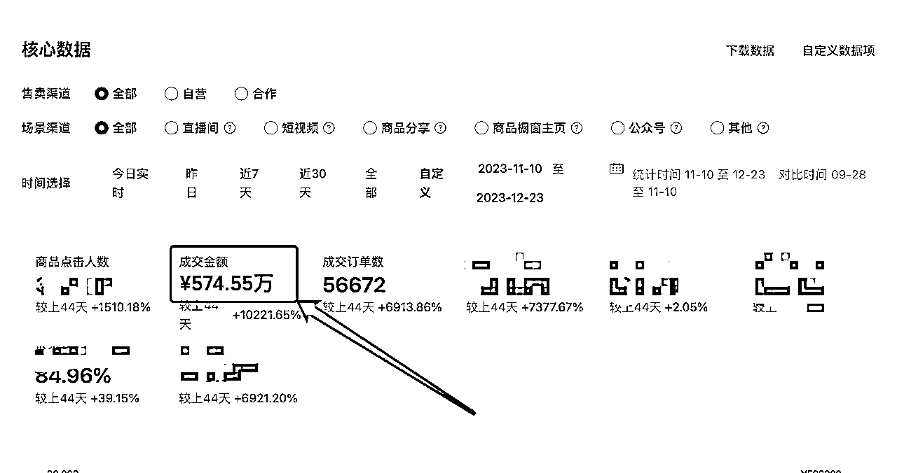
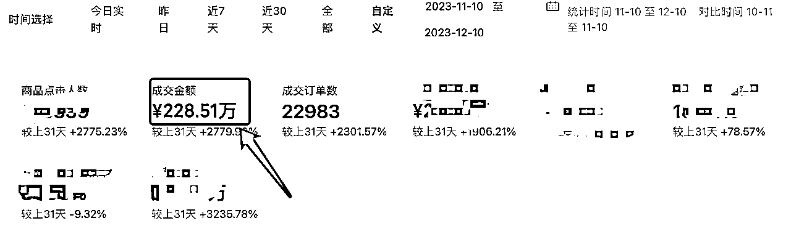

# 视频号小店被冻结 100 万以后，我顿悟了！（附 2023 年终总结）

> 原文：[`www.yuque.com/for_lazy/thfiu8/icc8ogas577gvee5`](https://www.yuque.com/for_lazy/thfiu8/icc8ogas577gvee5)

## (53 赞)视频号小店被冻结 100 万以后，我顿悟了！（附 2023 年终总结）

作者： 晋四喜

日期：2023-12-25

各位圈友好，我是晋四喜。老朋友了~ #视频号

目前主要在做微信**视频号小店****生鲜和中医图书类目后端**，加上无卡支付项目。

今天写这篇帖子，是因为最近两个月视频号小店的大动荡，让我在创业思维上感到一次空前的顿悟，特来和大家分享一下，希望对圈友们有所帮助。

老规矩，为了更好的观看体验，请移步飞书：

[`kfeoftapye.feishu.cn/docx/LHs5di0ZAoAK6Qxd0sEcDoQ4nBh`](https://kfeoftapye.feishu.cn/docx/LHs5di0ZAoAK6Qxd0sEcDoQ4nBh)

下面是一些战绩记录：

* * *

评论区：

乌云密布 : 能被冻结 100 万一个月，多半这品的质量非常低劣了，楼主讲讲选品踩的坑吧
晋四喜 : 不是质量低劣，是售后处理方案的问题。避坑本周内更新在飞书链接里。
乌云密布 : 赞，等看～
晋四喜 : 已经更新了，可以点进去重新看。
乌云密布 : 还是有点没看懂，引发售后的本质在于商品不符合用户的预期，这个预期到底是哪里出了问题？主播的讲解带来的，还是商品本身带来的？这块楼主有在售后处理的时候分析过么？为了好评而努力好评，总感觉不是一个正确的解决方案
晋四喜 : 最终归属肯定是高品质，但凡事有阶段，还没到做品牌的阶段。当下要务是在平台的规则内挣到更多的钱。您应该不打投放吧？太高的产品成本 cover 不住投放，及格就好，损耗是必然会有的。

* * *