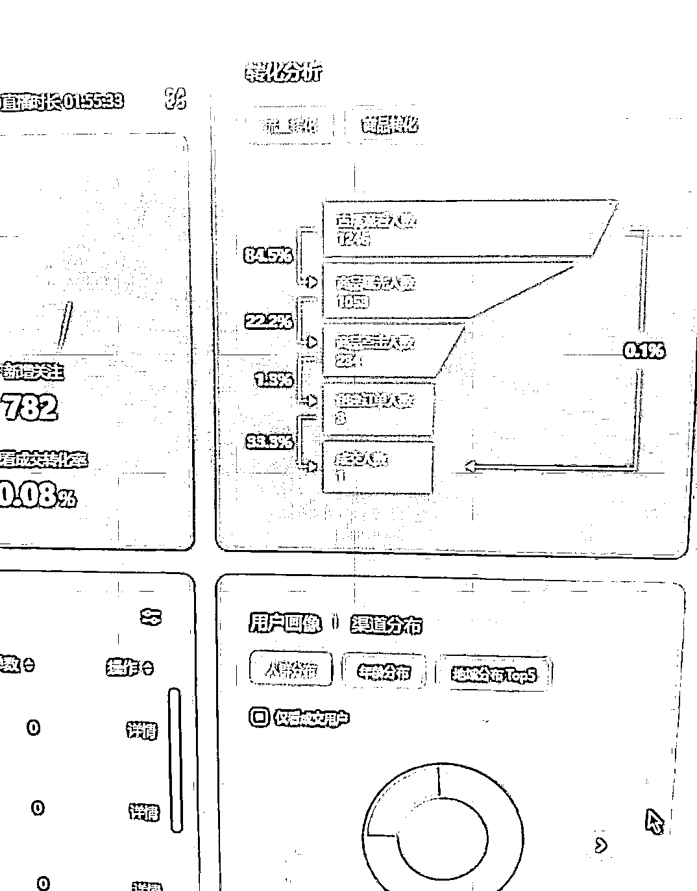
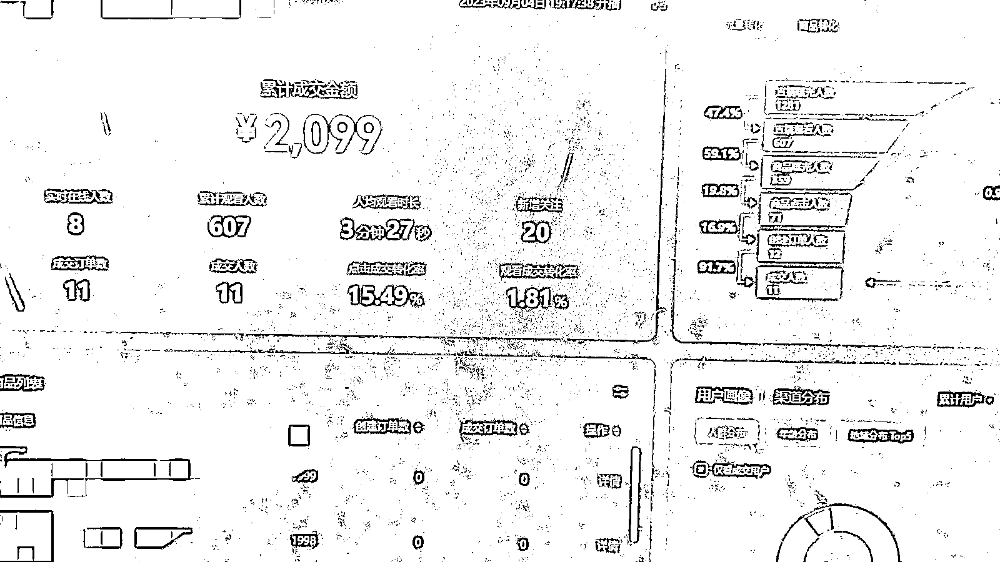
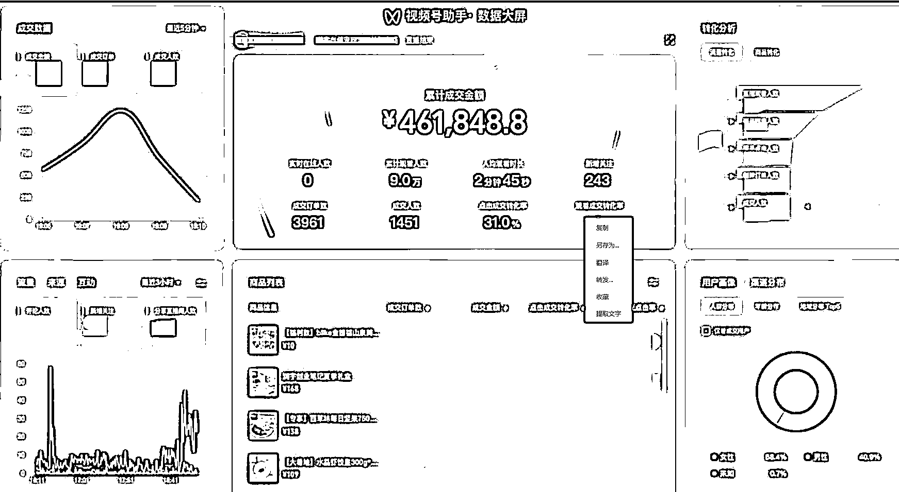
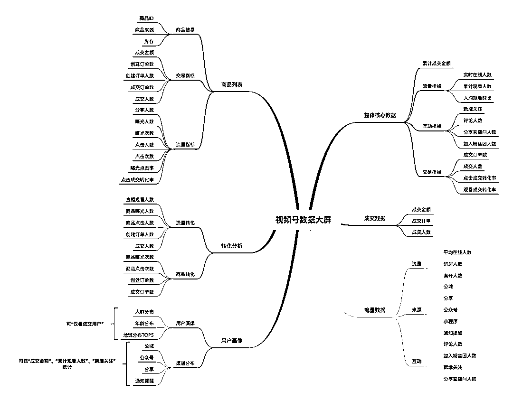
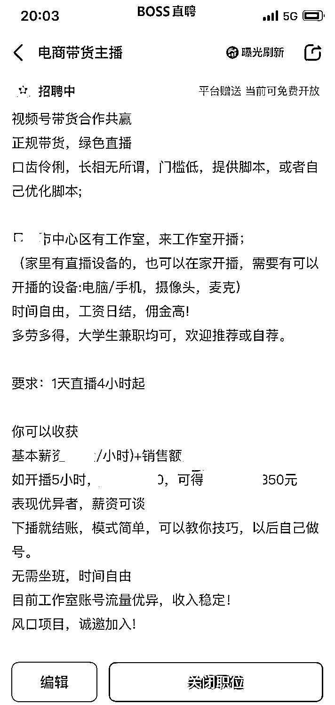
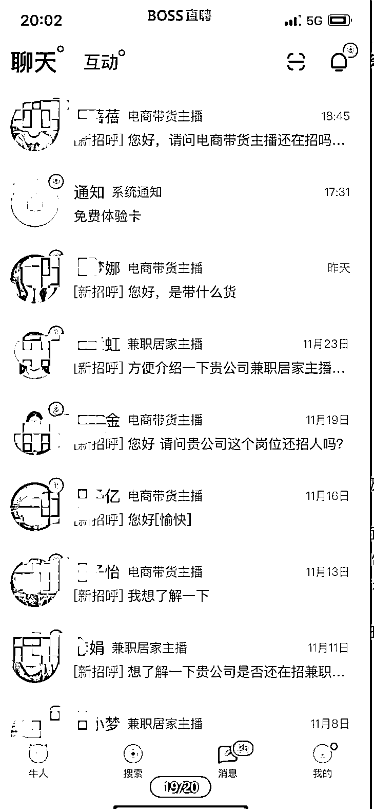

# 视频号直播效果提升 9 倍，我主要看哪些数据

> 原文：[`www.yuque.com/for_lazy/thfiu8/ul7wpfxmgwtxizxv`](https://www.yuque.com/for_lazy/thfiu8/ul7wpfxmgwtxizxv)

## (38 赞)视频号直播效果提升 9 倍，我主要看哪些数据

作者： 旋子

日期：2023-12-29

大家都知道现在流量越来越贵了，不像早期野蛮发展时期了。如果系统给你的流量，不能好好把握，那么泼天富贵就在你指尖白白溜走了。

这个是我们 3 月份播的一场，1053 精准流量，新增关注 782 个，就卖出 1 单，199 元

同一个账号，同一款产品，这个是我们现在正在播的一场，607 个场观，卖了 12 单，2099 元，转化率整整提升了 9 倍！

我这有十几套打磨过的话术模板，圈友需要的话，直接戳我拿吧。

在数据分析中，漏斗可以直观地显示哪个层级的流失最高，从而快速定位整体链路中的问题。各个环节话术的优化是能大大提升转化率的。

一、**数据分析：**首先说进入数据大屏的路径：

①直播中：直播管理——直播间管理——数据大屏

②直播后：数据中心——直播数据——单场数据——数据详情——数据大屏

注意，直播中可以实时看到数据大屏，意味着它的意义不只是事后复盘，更在于直播当下，主播、场控、运营、投手，都可以看到大屏上不断更新的数据。

进入后就会有这样一张图表：

可以看到，数据大屏分为六块区域：

①整体核心数据，处在最醒目的位置上，尤其是累计成交额，带货的时候会实时跳动，非常刺激；

②成交数据，默认显示最近 5 分钟的成交金额、成交订单、成交人数，可以实时掌握成交变化趋势（运营，主播重点关注）；

③流量数据，显示实时流量、流量来源及互动数据，以前看直播是否有公域的人来，只能盯着直播屏幕上的场观来判断，现在则有了更精确的信源；

④商品列表，显示商品信息、交易情况及用户点击/成交等数据，据此优化直播选品组品；

⑤转化分析，显示流量及商品的漏斗转化，可用于每场直播的横向对比，判断运营动作、直播话术的调整对转化的影响；

⑥用户画像，显示用户的性别、年龄、地域，可以“仅看成交用户”，明确成交用户画像。

先来看流量数据：

这个模块，藏着高质量直播间的关键数据：实时在线人数和评论人数。

开始之前，记得在右上角切换时间跨度：范围从“最近 5 分钟”到“最近 3 小时”

实时在线人数=进房人数-离开人数。如果一段时间内的离开人数高于进房人数，流量势必下滑，可以从这几方面找原因：

1.看进房人数，主要是从哪里来的（切换到“来源”就能看见）。

2.如果是分享和公众号来的，你都可以认为是私域和私域的外延，这群人如果留不住，只能说你的内容太差了，自己人都不认。我们的账号通常视频来源居多，由于视频是带货视频，那么这部分流量越多，转化率越高。

3.如果是公域来的，可能是内容与用户不匹配，可以去“用户画像”那个小窗口再确认下。另外，账号运营初期，由于标签不准，公域推的流量往往不够精准；

接下来来到了我最常看的转化分析这里，是以漏斗形式，显示每一层级的转化率。流量转化漏斗包含五层转化率，分别是从观看到曝光，从曝光到点击，从点击到生单，从生单到成交，以及从观看到成交。

在数据分析中，漏斗可以直观地显示哪个层级的流失最高，从而快速定位整体链路中的问题。让我们具体拆解一下

0）直播间曝光-观看主要影响因素是封面图，直播画面，和直播间标题，是否吸引人

①观看-曝光，这一层要注意商品与用户的匹配程度和直播带货节奏。如果商品和目标用户不匹配或者在大流量进入直播间的时候还没有开始上商品链接或弹出的正好是爆冷的商品，就容易造成流量的流失。

如果商品挂上，这个数据低，说明用户停留短，要吸引人停留，通过互动、发福袋等方式提升

②曝光-点击，分析用户看到商品并点击的转化数据。

如果这层转化率低，不仅要考虑商品与用户的匹配程度，更要复盘达人的带货话术是否能激起用户的购买欲。

提升建议：主播要精准讲解商品，并吸引人点击，如加上一句“主播在讲的是下方 1 号链接”因为直播间有些观众只看不买

强化直播间的购物氛围，可以配合道具展示，提升用户了解商品的欲望。

③点击-生单，分析用户点开商品链接并下单的转化数据。想要提高这一层的转化率，就要降低用户的决策成本，包括商品价格、福利机制是否有竞争力、卖点讲解时能否切中用户需求等等。

提升建议：做憋单+放单，憋单，营造供不应求的氛围，如“主播马上就要下播了”“只有两单福利优惠”“直播间有 60 个人不可能每个人都有”“有多少人我们就上多少单”放单时，倒数五个数，营造一起抢购的氛围（说白了就是让观众冲动消费）

④生单-成交，主要流失是拍下没付款的订单

提升建议：打消顾虑，建立信任。再次强调产品主要卖点；赠品 1、2、3...；话术：“下次来就不是这个价了“”“我们是专业做 XX25 年的大品牌”“一排的打已拍，送 XX”"7 天无理由"“送运险”...

以上就是我最常看的数据指标了，直播的时候，可以参考当下数据情况进行调整，如，人少的时候，做互动和停留，人多的时候，尽量做成交。

给大家的话术模板，也基本上涵盖了这些内容，大家一定要明确说不同的话，对数据提升的作用所在，每一句话都是有用的，去看其他人优秀的直播间时，（比如李佳琪），也能归类总结，理解他说每一句话的目的。

以上，就是关于直播间大盘数据分析的拆解。

#### 二、**主播招募与培养**

有时候，好几个号爆单的情况，我们就需要有人一起直播，24 小时日不落直播，公域的流量不薅白不薅，不直播就相当于泼天的富贵从指尖流过，这时候我们可以进行云主播，让主播在家去帮你直播，招募数量多的话，还需要筛选、培训、管理、排班，我大约搭建过 30 多个直播间，招募过上百人，篇幅有限这里就不展开了，有感兴趣的朋友，可以链接我，获取资料模板。包括**兼职主播 jd、主播工资发放规则、灵活用工合同、主播激励方案**等。

* * *

评论区：

风帆 : 私您了
旋子 : xuan626

* * *