# 小红书达人变现项目，单人月入 2W，团队月入 10W+保姆级教程详细拆解

> 原文：[`www.yuque.com/for_lazy/thfiu8/xgochcla81s0v4v5`](https://www.yuque.com/for_lazy/thfiu8/xgochcla81s0v4v5)

## (精华帖)(160 赞)小红书达人变现项目，单人月入 2W，团队月入 10W+保姆级教程详细拆解

作者： 周恩俊

日期：2023-12-26

首先，非常感谢来自五湖四海的朋友平时在生财有术超级给力的分享，因为你们的分享，让我受益良多，有时候在项目运营和公司管理上面，新的思路就是这么被打开的。

为此，我整理了一期关于小红书达人变现项目的详细玩法拆解进行分享，希望能够给正在操作这个项目的圈友带来帮助，谢谢。

以下是我本次分享的项目内容大纲：

> 在开始分享之前，我先对这个小红书达人项目进行一个简单的介绍，有些朋友可能不了解这个项目，对这个项目逻辑也是一头雾水。为此，我还是花时间梳理介绍一下这个项目和它的运营逻辑。
> 
> 小红书达人项目就是普通的素人号，小红书账号，通过分享笔记，涨到了一定的粉丝，粉丝量在 1000+以上，成为达人，就可以收到各大品牌方和广告主的邀约，进行付费的广告笔记植入，小红书账号博主通过接广告合作获得了收益，这就是小红书商单项目。
> 
> 简单来说，就是通过小红书做粉丝然后接广告赚钱。
> 
> 我们可以从别的渠道，搬运图片或者混剪视频素材，选定一个热门的赛道进行涨粉，通过笔记快速涨粉，成为小红书千粉以上的博主，然后去接品牌方广告，从中获取收益的模式。
> 
> 至于广告内容，品牌方会直接提供文案以及素材，我们只需在约定的时间里，发布好推广笔记，就能够获得品牌方广告主的投放费用。
> 
> 这个项目运营的总体逻辑就是：注册小红书账号——选定一个领域养号——发笔记起号——涨粉 1000 以上——实名认证——入驻蒲公英——接广变现。
> 
> 因为我们是矩阵多账号的模式去运营，做的领域有娱乐，小说，情感，美妆护肤，宠物，AI 创作等等，很多的素材都是搬运图文进行伪原创，或者混剪视频素材进行发布的，所以素材的来源非常广泛，全网都可以进行收集，完全不用担心内容创作的问题。这个简单搬运就可以涨粉的项目，就门槛而言，并不算高，适合大多数想要创业或者做副业的人群操作。
> 
> **1.小红书达人变现项目 2024 年市场前景如何？**
> 
> 因为上市的一再延缓，小红书这几年加紧了商业化的步伐，就是普通人都能够在小红书上面分得一杯羹，当下爆火的小红书店铺就是佐证之一。
> 
> 在很多人的固有思维中，始终认为商单广告都是给予大博主的流量反馈，对于小博主而言根本就不可能，但今年小红书放宽了广告商入驻条件以及博主接广告的隐形要求，现在只需千粉开通蒲公英平台即可对接广告变现。
> 
> 小红书的用户大多数集中在一二线城市，并且 70%以上都是女性，高知且付费意识强，可堪称优质流量的洼地，也因此无数个广告商都蜂拥而至，纷纷在小红书上面投放广告，小红书达人项目应运而生。
> 
> 嗅觉敏锐的一批人，已经走在了前沿，通过小红书达人接广，变现了无数次，近几年绝对是小红书达人爆发式增长的时候，未来市场潜力无限。
> 
> **2.小红书达人变现如何进行领域定位？**
> 
> 有道是，选择比努力重要，做小红书达人项目亦是如此。
> 
> 选择对的领域，涨粉的时间可能都会快很多，然后能快速领跑别的同行，快人一步入驻蒲公英接广变现。
> 
> 这个项目，是我们外部合伙人今年 5 月开始实操的，一直到现在，收益还在稳步上升，5 个人的团队，目前能够做到单月产出 10W，这个成绩还算可以的。
> 
> 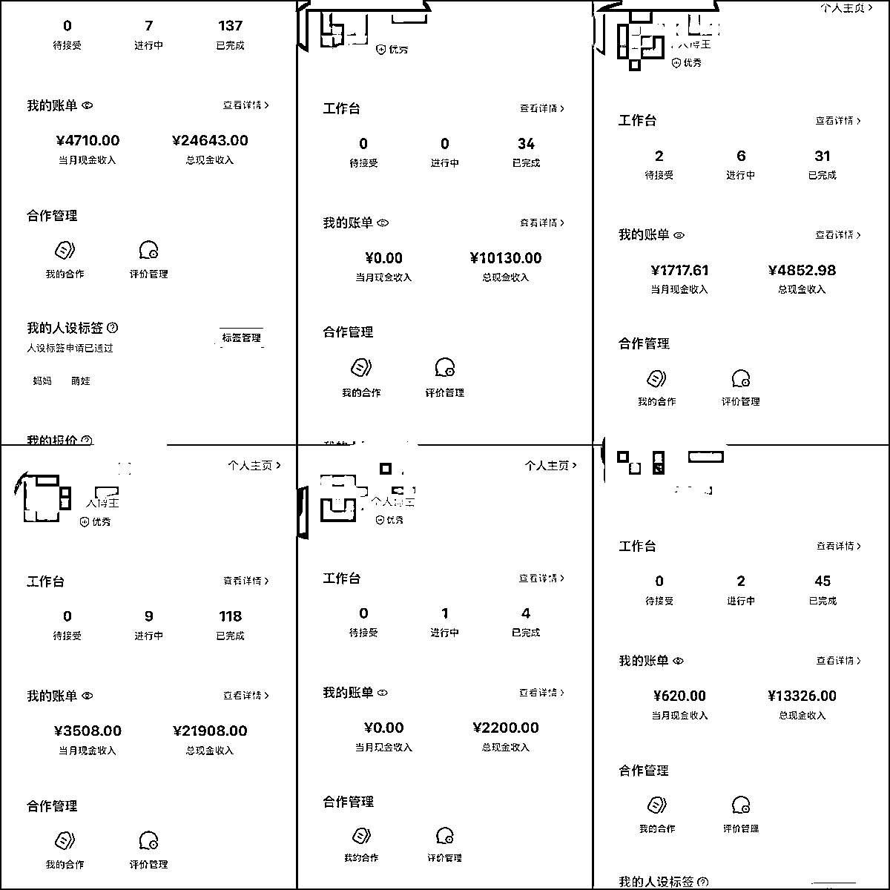
> 
> 根据我们团队实操的经验来看，目前涨粉快的赛道有：娱乐明星，影视剪辑，动漫解说，盘点，星座，公基常识，本地服务类，AI 绘画，抖音快手美食搬运，章鱼哥，正能量，情感，文案语录等等。
> 
> 因为我们是矩阵式多号操作的，所以前期测试的时候，很多领域都有涉及，目前涨粉快的，不外乎这几个赛道，当然赛道的选择是一部分，笔记是否爆又是另外一部分，因为如果笔记不爆，无论选择哪个赛道都好，涨粉都会比较慢的，后面也将会给大家分享制作爆款笔记的方法。
> 
> 那么，我们为什么会选择这几个赛道呢，随机选择公基常识，章鱼哥和抖音快手美食搬运这三个赛道给大家举例子说明。
> 
> 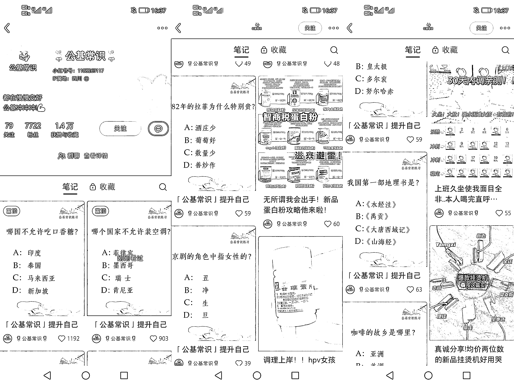
> 
> 首先是公基常识这个赛道，随机选择一个已经入驻蒲公英并且接广的账号给大家进行分析，这个账号目前已经 7000+的粉丝，这个号是 9 月中下旬起的号，在 11 月成功千粉入驻蒲公英，并且开始接了广告，截止到目前为止，一共接了 20 个广告，预计广告客单价 150-200 一单，这个账号已经成功变现了 3000-4000+，是普通人一个月的工资了，这个号单月均变现为 1500-2000 左右，如果多号操作的话，收益肯定会更可观。
> 
> 这个公基常识账号的笔记是一篇笔记 3 道题目的形式，而这些题目我们可以搬运同行近期内爆的笔记题目，并且公基常识的图片模板非常简单，一张纯色的简洁模板或者简单底色的模板，再打上对应的题目即可，固定了模板之后，就剩题目搬运了，文字也是简单复制粘贴即可，一天下来，能制作出好多组图文素材，所以这个赛道相对来讲也是比较简单的，对于新手小白来讲，特别友好。
> 
> 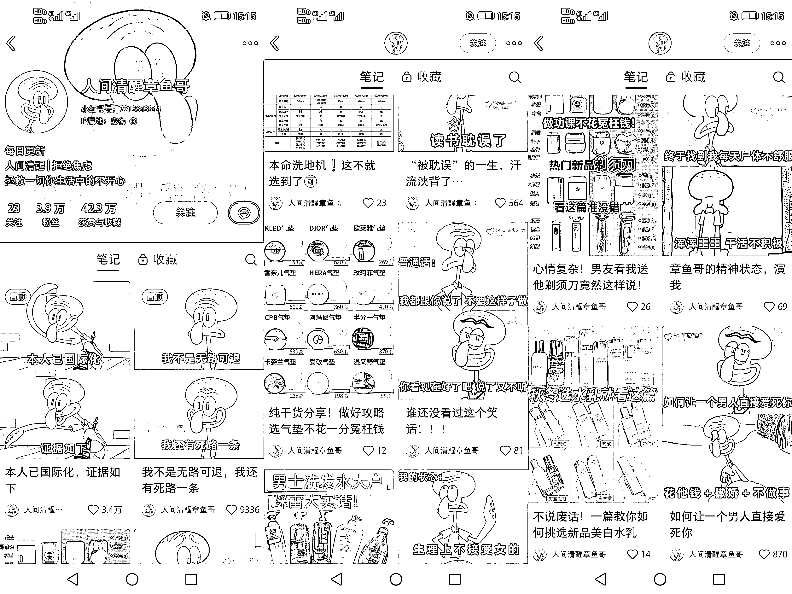
> 
> 章鱼哥这个赛道也是简单的图文赛道，以人间清醒章鱼哥这个账号为例子，给大家进行分析，这个账号目前发的作品比较多，是今年 8 月份起的账号，目前已经有了 3.9W 的粉丝，因为爆得比较快，账号数据一直都比较好，截止目前为止已经接了 75+个广子，预计广告客单价 200-500 一单，这个账号目前已经变现了 15000-30000 左右，并且这种账号可以长期持续积累粉丝，以及后续可继续接广变现，这种账号价值就比较高。
> 
> 那么，章鱼哥的笔记形式是怎么制作的呢？
> 
> 首先我们可以在影视剧平台、B 站、微博以及百度等等平台去找到章鱼哥、海绵宝宝、蟹老板和派大星的图片，影视剧平台可以截取图片，然后可以小红书搜索同行，或者用灰豚进行搜索，看最新爆款的章鱼哥语录是哪些，再把对应的语录搬下来，我们可以用美图秀秀把两张章鱼哥的图片拼接在一起，再打上想要的文字，就是把最近火爆的语录搬下来，就做成了新的素材，然后就可以在小红书进行发布了。
> 
> 至于抖音快手美食搬运这个赛道，顾名思义，我们可以从抖音、快手等平台搬运对应的美食视频，二次剪辑发布到小红书上面。
> 
> 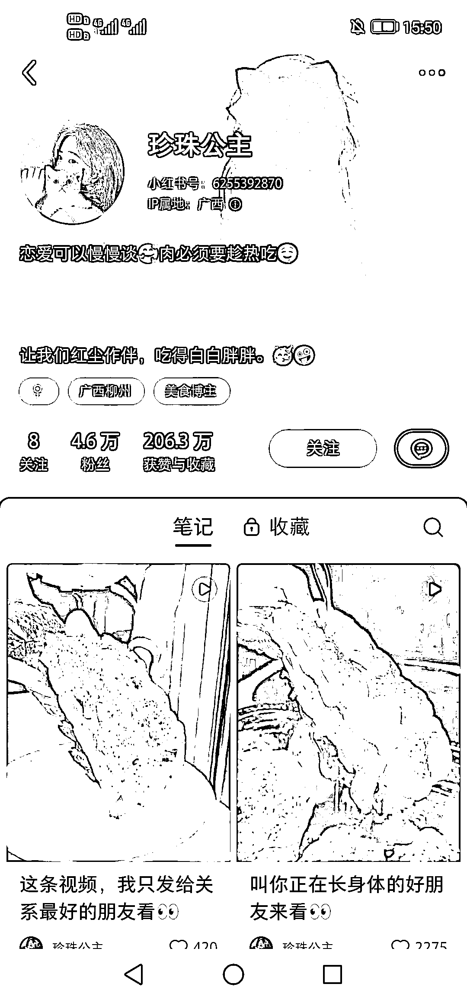
> 
> 接下来，以珍珠公主这个账号为例子给大家进行解析，这个账号不少美食视频都是从抖音上面搬运过来的，因为我们只需截图部分美食片段，通过抖音的识图搜索，就可以找到对应的视频素材，然后通过剪映伪原创在小红书上面进行发布。目前，这个账号作品发布得比较多，粉丝有 4.6W，截止目前接广预计 65+，预计广告客单价 200-500 一条，已经变现了 13000-35000 以上，非常不错。
> 
> 一般做这种美食账号，我们都需要先准备一个抖音号和快手号，并且前 3 天要养号，专门刷对应的美食视频，各种美食推荐，养成这样的喜好推荐，方便我们后续用抖音和快手找美食视频。一般我们找到对应的美食视频之后，可以复制链接，用微信小程序中夸夸去水印，去水印保存下来，然后再导入剪映进行伪原创剪辑，视频伪原创的步骤可参考：掐头去尾，加速，BGM，镜像，画中画，顺序打乱，抠图，文案贴纸，特效滤镜，转场，变音等。经过伪原创处理之后的视频素材，就可以发布在小红书上面去涨粉了。
> 
> **温馨提示：**视频伪原创特别容易违规，建议多个视频混剪在一起，这样原创值才高，单一的视频违规概率很大，相信不少做过这个赛道的朋友，都会有这种体验，单一视频容易受到笔记违规和笔记优化提示，这种就是伪原创去重不彻底导致的，因此有这个问题的朋友要特别注意。
> 
> **3.小红书达人变现如何进行养号，流程有哪些？**
> 
> 选择好领域赛道之后，我们就可以注册账号，然后进行养号，养完号就可以开始发作品涨粉。一般一个小红书账号对应一个手机号，注册时要用正规的厅卡进行注册，并且全程用流量完成操作，注册完之后，就可以按照以下流程进行养号了。
> 
> **养号流程：**
> 
> 第一天：注册账号时，一定要用流量，注册下来后，不要改包装，头像，昵称，简介，也不要刷笔记；
> 
> 第二天：开始养号，刷要做的领域笔记，模仿真人操作，你要做什么领域就去刷什么领域笔记，要对同行笔记进行点赞收藏关注评论，这些操作要过 20-30 秒；
> 
> 每天刷半小时到 1 小时左右，可以分时段刷，有空可以多刷多看。
> 
> 第三天：上午继续养号，改包装，要看下是否有养成，发现页领域笔记要占 70%，着急的话，第三天下午就可以发领域笔记了。
> 
> 提醒一下，一般垂直领域要先试发一篇日常生活、风景、干货笔记等去测试流量，次日小眼睛过 100 以上，就说明账号没问题，再开始发该领域笔记。
> 
> 按照这个流程养完号之后，就可以发作品涨粉了，养号是必不可少的步骤，千万不要忽略了，否则直接发作品，账号没反应，起不来就很耗费时间了。
> 
> **4.小红书达人变现怎么搬运伪原创作品？制作爆款笔记！**
> 
> 一般对于新手小白来讲，刚开始入手这个项目，建议入局图文赛道，像视频赛道的话，更适合能娴熟剪辑视频的、有经验的运营来操作。图文赛道建议做的领域有：星座、章鱼哥、情感、本地服务、公基常识、正能量，文案语录等。
> 
> 首先，我们在养号的时候，账号就养成了垂直度，这样找对标同行和参考笔记就简单多了，一刷新首页就可以看到不少同领域笔记，如果我们刷新了首页，近期内的同领域笔记比较少的话，我们还可以借助灰豚这个工具，进行爆款笔记的筛选和查找，一般来讲，热门领域的爆款笔记至少点赞量在 500+就可以了，再进行参考，一般领域，爆款笔记点赞量至少在 200 以上再进行参考。
> 
> 在灰豚进行筛选参考的时候，可以优先选择低粉爆文，如果近 7 天出来的素材少，可以再拓展到 30 天，60 天甚至 90 天都可以，这样我们能参考的素材就比较多。在用灰豚的时候，一般除了搜索笔记之外，我们还可以查找达人，看对应的同行，以及找一些比较靠谱的 MCN 机构，后面会附上灰豚的使用教程展开给大家讲解。
> 
> **01.图文素材怎么伪原创？**
> 
> 如果是直接搬运的图片，可以考虑常规的伪原创手法，总结起来就是以下几点：
> 
> **修改图片尺寸**
> 
> 首先，我们可以通过修改图片尺寸来实现伪原创。具体来说，就是将原始图片进行缩放或拉伸，从而生成一个新的、与原始图片略有不同的图片。这样做的好处是既保留了原始图片的主要内容，又增加了新鲜感，让读者眼前一亮。
> 
> **更改颜色和饱和度**
> 
> 除了修改尺寸以外，我们还可以通过更改颜色和饱和度来实现伪原创。具体来说，就是将原始图片进行色彩调整，使其看起来与原始图片稍有不同。这样做的好处是能够增加图片的多样性，并且让文章看起来更加生动。
> 
> **添加特效**
> 
> 另外，在实现伪原创时，我们还可以通过添加特效来让图片与众不同。比如，可以在图片上添加滤镜、光晕、阴影等特效，从而让图片看起来更加美观、独特。
> 
> **替换背景**
> 
> 除了调整图片本身以外，我们还可以通过替换背景来实现伪原创。具体来说，就是将原始图片的背景进行替换，从而生成一个新的、与原始图片略有不同的图片。这样做的好处是能够增加图片的多样性，并且让文章看起来更加生动。
> 
> **合并多张图片（或者拼图）**
> 
> 除了单独修改一张图片以外，我们还可以通过合并多张图片来实现伪原创。具体来说，就是将多张不同的图片进行合并，从而生成一个新的、与原始图片略有不同的图片。这样做的好处是能够增加图片的多样性，并且让文章看起来更加生动。
> 
> **使用图形化工具**
> 
> 在实现伪原创时，我们还可以使用各种图形化工具，比如 Photoshop、GIMP 等，来对图片进行修改和优化。这样做的好处是能够让我们更加灵活地操作图片，并且能够实现更加复杂的修改效果。
> 
> 图片伪原创总结起来就是：模板变内容不变，滤镜+调色（对比度，色调，高光等），叠加，镜像，文字，贴纸，拼图抠图等。除了前面的步骤之外，像图片还可以用一些简单的工具去处理，比如美图秀秀、图怪兽和稿定设计等。
> 
> **02.视频素材如何伪原创？**
> 
> 视频伪原创的手法总结起来就是：掐头去尾，加速，BGM，镜像，画中画，顺序打乱，抠图，文案贴纸，特效滤镜，转场，变音等。
> 
> 这里不好展开来讲，不过附上一个剪映入门级别的教程，这个对新手小白来讲，特别友好，直接看视频教程，比我的文字描述来得更加形象具体一些。
> 
> **剪映专业版入门手册：**
> 
> [`www.capcut.cn/learning/topic_detail/7128272592783428894/1page_enter_from=videocut_pc`](https://www.capcut.cn/learning/topic_detail/7128272592783428894/1page_enter_from=videocut_pc)
> 
> 在这里再展开讲解，如何使用灰豚，快速查找达人以及爆款笔记，我们可以通过灰豚工具，在达人榜单，选择涨粉榜进行条件筛选，选择自己感兴趣的领域，看下该领域涨粉速度如何，从中找到好的同行对标。
> 
> 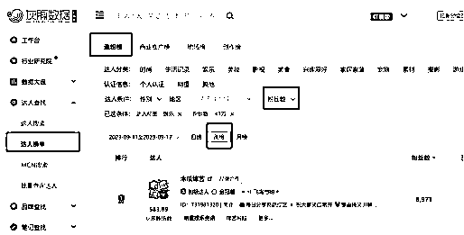
> 
> 其次，我们在灰豚查找对标达人的同时，还可以通过笔记查找，搜索同领域的关键词，然后通过各种条件筛选，找到爆款笔记去进行参考。
> 
> 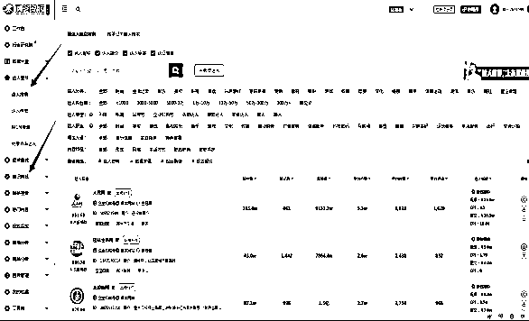
> 
> 除了灰豚之外，如果我们有专业号，可以通过登录蒲公英后台，在后台找到同领域对标。我们可以进入蒲公英，通过博主广场进行筛选领域博主，尽量选择粉丝数在 5000 内，近 30 天涨粉数据快的，这样能筛选出近期涨粉的优秀同行对标。
> 
> 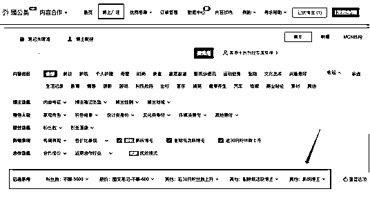
> 
> 除了灰豚和蒲公英后台之外，我们还可以用以下方法去找同行对标和爆款素材，然后进行模仿。
> 
> **小红书：**通过小红书频道页或推荐发现页，去看种草广告，也可以通过小红书蒲公英商家/灰豚等后台，找到热门种草广告，通过广告找到最近起号爆款的素材，一个月爆的素材，点赞过 100，或两个月内达到千粉的账号等，都可以作为参考。
> 
> **抖音：**初定好要做的领域之后，抖音去搜索，一般在半年内，按点赞排行，只要在 100 点赞以上，都可以作为该领域素材参考。
> 
> **快手：**通过搜索领域关键词，按播放量，点赞量去排序，一个月，点赞在 100 以上，都可以作为该领域素材参考。
> 
> **知乎：**搜索要做的领域关键词，通过最多赞同，半年内，点赞在 100 以上，都是可以作为该领域素材参考。
> 
> 借用灰豚软件，进行低粉爆文查找，时间越近越好，爆文素材我们不能直接搬运，可以搜索该素材关键词，去抖音或其它平台，找到同话题不同素材，进行伪原创制作。
> 
> 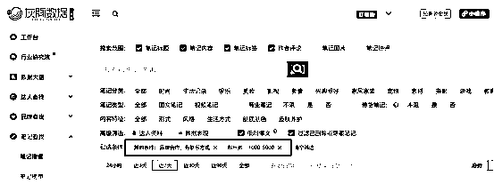
> 
> 前面给大家分享了图片和视频素材伪原创搬运的手法，以及如何找到对应的同行对标，接下来给大家分享一下如何制作爆款素材。
> 
> **01.视频爆款素材：**
> 
> 首先，以抖音快手美食搬运这个赛道作为举例子，讲解如何制作视频爆款素材，我们先在抖音进行搜索，找到几个不同的美食视频，这些美食视频最好都是近期内爆的，点赞量至少在 1000+，而且我们进行混剪的话，一次混剪至少都 3 个视频以上，因为只有多个视频同时混剪在一起处理，原创度才高。
> 
> 单一的视频处理，很容易被小红书系统检测出来，会出现笔记违规或者笔记优化提示，次数多了会影响账号的权重以及专业号会掉灰，影响后续入驻蒲公英。如图所示，讲找到的三个视频同时导入剪映进行伪原创处理，按照前面分享的伪原创步骤处理，处理完了之后，就可以配上笔记文案和标签，在小红书进行发布了。
> 
> 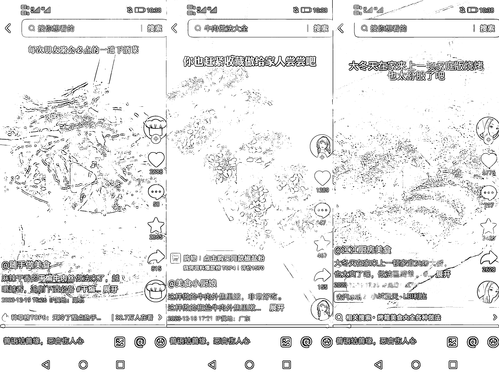
> 
> **02.图片爆款素材：**
> 
> 以文案语录为例子，给大家讲解一下图文赛道如何快速搬运内容，进行伪原创，一般我们是找到近期内同行的爆款笔记进行搬运，一般建议小红书点赞至少在 100+以上的，而且是近期内发布的，我们再进行搬运。
> 
> 如图所示，同行用的是一个纯黑色的模板，用白色字体，简洁又好看，我们可以把同行的文案内容搬运下来，可以截图，然后用 QQ 文字识别或者微信文字提取功能把文字提取出来，再用稿定设计选定一个类似的简洁的模板，把文字套上去，然后新的图片素材就出来了，可以在小红书上面进行发布。
> 
> 在稿定设计上面，我们可以选择类似的模板，把同行爆款的文字复制粘贴上去，然后可以进行调节字体距离和左对齐这些，我们导出来的时候，记得选择无水印导出，而且图片字体的标题和正文，字体最好统一大小，后续统一这种类型的模板，后面制作新的素材的时候，就会方便许多。
> 
> 随机选择同行模板：
> 
> 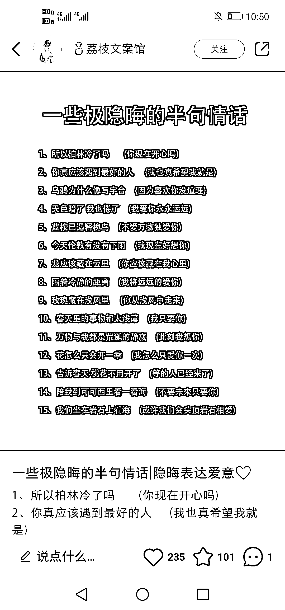
> 
> 稿定设计重新排版制图：
> 
> 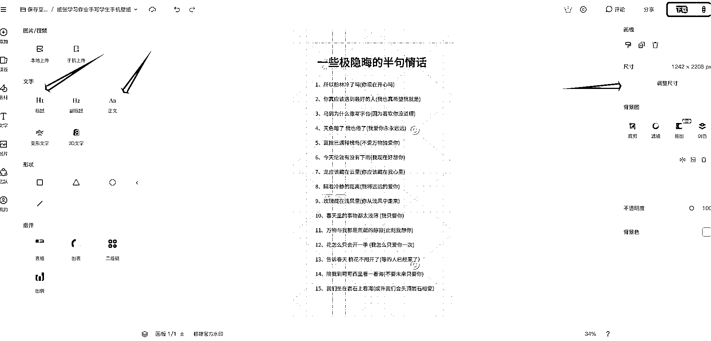
> 
> **5.小红书达人变现千粉后，如何入驻蒲公英变现？**
> 
> 首先讲解一下入驻蒲公英的流程，然后再给大家总结接广以及后期的提现流程。
> 
> 蒲公英入驻流程：
> 
> 第一步：先升级个人专业号。
> 
> 在“我”—“账号与安全”—“升级专业号”—“成为专业号”。
> 
> 第二步：开通蒲公英“内容合作”。
> 
> 在“创作中心”—“更多服务”—“内容合作”—按照步骤进行下一步，即可成功入驻。
> 
> 一般图文的报价，刚开始都是建议设置为 150，不管系统同行均价是否为 170-180，都建议设置为 150，低于同行均价，这样前期才好接广，否则一开始就定比较高的价格，接广会比较少，甚至会出现接不到广这种情况。视频报价随意，因为一般都是图文合作邀约，很少视频合作邀约。如果到后面我们的账号粉丝越来越高了，到时候可以慢慢涨价的，蒲公英也支持改价，每月可改一次，当月改完，一般次月生效。
> 
> 那么，有朋友可能会问，入驻蒲公英之后，还需要填什么资料吗？多久能够接到广告呢？答案是设置完报价之后，基本就可以了，人设标签什么的，暂时不用管，新锐博主快的话，一般 1 到 3 天左右就会收到品牌商家的广告邀约，慢则一周左右，但是我们入驻蒲公英后不要掉以轻心，要保持日更，近期作品质量也要优秀些，最好阅读量平均数能达到 1K 以上，这样邀约广告就会多些。
> 
> 千粉之后，成功入驻蒲公英，那么接广以及提现的流程是怎么样的？总结以下几点：
> 
> > 这就是整个跟品牌商家对接商单的流程，有个细节需要注意，有些商家可能会砍价，比如我们刚开始一单报价为 150，有些商家可能会砍到 120、130、140 这样子，如果商家的广告是日用百货或者其他非医疗类的商品，这个时候可以给他优惠的价格，如果是医疗类的商品，那么我们就要慎接或者不接受砍价了，因为这种类型的商品敏感词比较多，有些发了之后，可能会给账号带来不好的影响，当然这不是绝对的，不用过于担心。
> > 
> > **6.小红书达人变现如何快速接广，进行后期的维护？**
> > 
> > 前面给大家分享了入驻蒲公英之后的流程，那么我们入驻蒲公英之后，要怎么样才能够快速接到广告商单呢？有两个动作非常重要，第一，在此期间我们账号也要保持日更，至少日更 1-2 篇，保持账号的数据活跃，这样接广的速度会更快一些。
> > 
> > 第二，如果我们的阅读中位数比较低，但是又想要快速接到广，必须要花一些时间去跟我们账号的粉丝进行互动，比如看到粉丝有留言或者评论的时候，要及时去进行回复，不要整个人设都很高冷，啥都不回，这样肯定不行的，及时与粉丝进行互动，有利于提高账号的数据活跃度，也会更受品牌广告商青睐。
> > 
> > 一般接到广之后，后续我们账号也要保持日更，维持活跃的数据，这样才会源源不断地有品牌广告商邀约。不过，如果同一天内接到的广告邀约太多了，比如一天来了 3 个邀约，怎么办呢？都发吗？我们建议新号最好是发完一条广告合作笔记之后，至少隔 1 天再发第 2 条，所以很多商家同时邀约的时候，我们可以在微信上面进行详谈，协商好这个发布时间也行的，新号最好不用连着发广告，频繁发广其实会影响到账号，以及后续的邀约，所以我们要适可而止，边发广子的同时，可以夹杂着我们账号的笔记内容去发，尽量将影响降到最低。
> > 
> > **7.小红书达人账号违规了怎么办？如何申诉？**
> > 
> > 操作小红书达人项目，目前最常见的违规就是视频笔记的违规，图文笔记的违规基本很少见，那么视频违规的原因是什么呢？基本上都是伪原创去重不彻底触发了系统的笔记违规，笔记优化提示，需要进行整改，才会继续推流。这种常见的违规偶尔一两次就没事，但是如果你是经常违规，就会导致专业号掉灰，这样后续就入驻不了蒲公英，接不了广告，这样也是很麻烦的。
> > 
> > 图文虽说不容易出现这种去重不彻底的问题，因为图片都是用新的模板去套，只是搬运内容，所以相对来讲，是比较安全的。但是有些图文赛道也容易违规，比如情感、正能量、星座等赛道，有些朋友会因为某些敏感词，从而导致了违规，比如出现负能量传播、情绪价值偏激、封建迷信等等违规，一般出现这种违规，系统会提示你怎么进行整改的，按照要求整改即可，整改完了，基本就没啥影响了。
> > 
> > 不过如果是各种违规导致了专业号掉灰，我们就需要及时去申诉回来了，一般如果是笔记原创性过低导致的，我们可以截图自己处理这个视频素材的记录去申诉，说是自己原创辛苦剪辑的，以此作为申诉依据，看看能不能申诉回来，能申诉回来，肯定是最好的。
> > 
> > 申诉话术参考：薯大大，你好！这个账号，我真的花了很多心血在上面，本来每天制作作品就很辛苦了，居然还被系统限制了专业号功能，我真的好受打击，心情真的低落到了极点，尤其是辛苦创作却得不到肯定，以下是我剪辑视频的记录附图，在此希望薯大大能给个机会，高抬贵手，不要再限制我的专业号功能了，给我的一点美好生活希望吧，跪谢了。
> > 
> > 这个申诉话术仅供参考，不过一般的申诉都是附图作为证据+卖惨，这样通过申诉的概率就会比较大一些。
> > 
> > **8.操作小红书达人变现项目遇到问题，如何进行解决！**
> > 
> > Q：企业专业号是必须要开通的吗？
> > 
> > A：不用，用灰豚看也是可以的，只要看别人的一些爆款笔记做对标或者做定位用的。
> > 
> > Q：企业专业号 需要千粉才可以开通蒲公英？
> > 
> > A：不用，企业专业号就是蓝 v 号，本身就有权限进入蒲公英，普通号才需要千粉以上。
> > 
> > Q：安卓机可以用多开吗？
> > 
> > A：建议一机一号，不太建议多开，容易异常影响流量。
> > 
> > Q：上万播放了的视频，违规了怎么办？
> > 
> > A：自查下伪原创程度高不高，如果有做伪原创且程度高的话，可以进行申诉；
> > 
> > 申诉模板：笔记是自己原创编辑以及编辑的，并非搬运，下图是本人制作素材的记录，还望薯大大移除违规，谢谢。截图我们伪原创（剪辑）的记录，一起申诉。
> > 
> > Q：笔记删多了 对账号有没有影响？
> > 
> > A：删多了，容易影响账号权重，审核通过的就隐藏，不通过的就删除，反正能隐藏的就隐藏，尽量少一些删除。
> > 
> > Q：一个号不给浏览量的话 可以换类别吗？可以换类别的话 是不是又要重新刷几天视频养号后再发？
> > 
> > A：如果你才刚开始发，发的时间不久的话，可以不用先急着换类目的，我们可以观察一下，比如第二天再看一下它的浏览量。如果还是不行的话，再换也行，不过换的话是建议先养号，先养成你想要做的那个领域的一些喜好推荐，然后再发作品。
> > 
> > Q：如果正常操作的话，每天发多少条笔记？
> > 
> > A：个人操作 3~5 个号，每个号每天可以的情况下，各发 2 条笔记，如果时间不够的话，至少 1 条笔记，时间多的话每个号也可以多发。还有，我们可以参考同领域做得好的同行，看看他们前期一天几条笔记，我们也可以参考着发，有些同行的话，我们也有观察到，单个账号一条发 5-6 条的都有。
> > 
> > Q：小红书蓝 V 号实名认证不用账号跟执照法人是同一人吗？
> > 
> > A：个体执照认证专业号不用实名认证的，一张执照就可以认证，只需缴纳 600 元的认证费用就可以了，这个小红书账号不用实名的，直接拿执照认证专业号就可以了。
> > 
> > Q：营业执照经营品类不限吗？
> > 
> > A：只作为入驻蒲公英，简单看数据的话就不限，但是如果后面想要申请 mcn，执照经营范围就需要包含网络技术，信息咨询，文化传媒这一类的经营范围，以下经验范围可以参考下，加上“文化传媒”是最好了。
> > 
> > 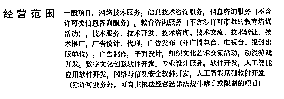
> > 
> > Q：有点赞和评论，就是不涨粉，咋办？
> > 
> > A：在评论区，在视频结尾，在简介里，引导关注；我们新号刚开始主页没有那么多笔记内容，粉丝前期还不知道我们是做什么的，没关注是正常的；笔记内容最好是有分上中下集的素材，这样会吸引粉丝关注，坐等下一篇内容。
> > 
> > Q：发作品的话能用电脑定时发吗，对流量有影响吗？
> > 
> > A：不要定时发，会影响流量，尽量不要定时发或者存草稿箱发，做好立刻就发就可以了。
> > 
> > Q：蒲公英标准 普通 优秀等级，是如何定义？
> > 
> > A：优秀：代表帐号内容及流量状态健康，享有平台基础接单权限的同时，可获得更多平台主动推荐的品牌内容合作机会；
> > 
> > 普通：代表帐号内容及流量状态不稳定，帐号近期存在部分平台不鼓励行为，如：发布不合适/导向不佳/无真实体验/违规推广内容、帐号数据作假、营销动机异常等；
> > 
> > 异常：代表帐号内容及流量状态异常，帐号近期存在大量平台不鼓励行为，如：发布不实信息、不友好/不合适的内容、帐号数据作假等。
> > 
> > 以上就是操作小红书达人项目所会遇到的一些常见的问题，以及解决问题的方法。希望我的分享能够给你带来帮助，谢谢。
> > 
> > 写在最后：
> > 
> > 心有所期，全力以赴，定有所成。
> > 
> > 愿你的努力，终被温柔以待！
> > 
> > * * *
> > 
> > 评论区：
> > 
> > 米米 : 执行大于一切
> > 周恩俊 : 是的，不执行都等于零
> > 芮 rui : 我下个月小红薯运营航海了。
> > 这个我就收藏转发到时候结合着一起操作。非常感谢
> > 周恩俊 : 不客气的哈，有问题随时欢迎咨询
> > 金九渊 : 小红书一个人只能实名一个账号，提款好像只能自己的银行卡，这种情况是怎么解决多账号接广子变现呢？
> > 鱼渔 : 太赞了，真详细，也拓展了思路。我的一个抖音号，全是实拍原创，粉丝还是靠搬运一个超级大 v 的视频涨的粉[流泪][流泪]太难了
> > 周恩俊 : 可以统一挂靠到 mcn 机构下面，由机构统一提现打款。
> > 金九渊 : 也就是小红书申请个 mcn 了
> > 
> > 
> > 
> > * * *