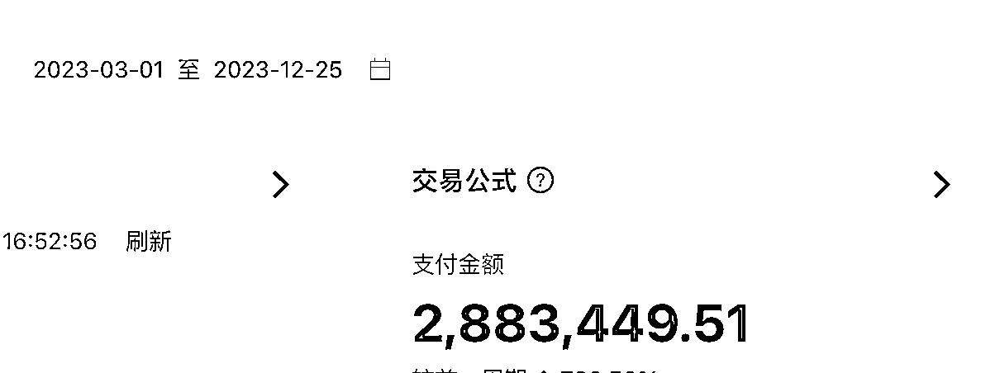
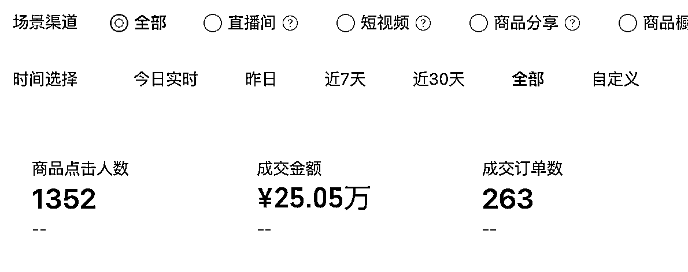
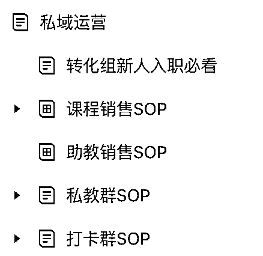
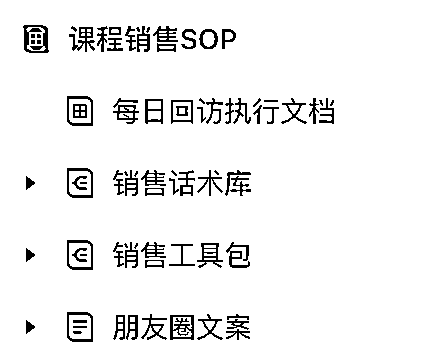
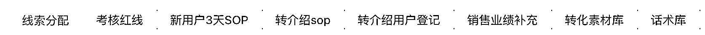

# 小红书引流，私域成交，10 个月变现 300 万

> 原文：[`www.yuque.com/for_lazy/thfiu8/bh4bxnxhoyatx9ph`](https://www.yuque.com/for_lazy/thfiu8/bh4bxnxhoyatx9ph)

## (90 赞)小红书引流，私域成交，10 个月变现 300 万

作者： 史贵鹏

日期：2023-12-26

生财的圈友大家好，我是史贵鹏，一直做的私域相关的项目，目前在做的有社群团购和 k12 教育，还有一款正在筹备中的洗护产品，刚谈好代工厂，预计 3-4 个月后能开始线上销售，所有项目都是公域引流，私域成交的模式。

今天给大家分享的是今年年初开始做的新概念英语线上课程项目，我是和北京这边的一家上市教育公司合作，相当于拿的代理，上课形式类似于斑马英语、火花思维那种，买完课可以在小程序自主学习，目标人群是小初的学生家长。我觉得这个产品偏刚需，而且目标用户是一二线城市的学生家长（妈妈为主），最优质的一群人，囤在私域里变现价值很高，所以就干了，以上是背景。

再简单说下数据，截止到这个月底，10 个月的时间，没花一分钱投流，没做一个大号，纯靠矩阵内容从小红书引流到私域，卖了 300 万的课程，60%的利润率（明年 GMV 应该能翻一倍，利润率提到 70%，今年测试踩了不少坑）。

放点数据的截图，有赞的收款：

视频号的收款：

还有一些是企业微信直接收款的，就不放了。

过程中私域也囤了几万个 k12 家长，还没充分转化，明年会重点搞一搞。

今天重点分享两部分内容，我尽量讲详细点，分别是：

**一、如何靠矩阵内容在小红书引流**

**二、怎样提高私域的转化率**

# 一、如何靠矩阵内容在小红书引流

## 1、确定引流路径

因为这套课程的客单不算低，1000-2000 元，很难在小红书直接成交，所以我在开始设计模式时就决定引流到私域成交。

小红书引流有两种方式，一种是用各种方法留微信，一种是做产品种草，然用户自己去站外搜索。

我选择的是后者，第一种留微信的方式看似直接，其实很难做大，因为做的是和平台对抗的事情，就只能偷偷摸摸，又很废号，而且要同时兼顾内容产出和引流两件事。

做项目肯定是动作越少越好，动作越少越容易标准化，可标准化就意味着能复制，这样的项目更容易做大。

所以我选择的是做产品种草，具体路径是：在小红书种草小程序（上课平台）➡️用户搜索小程序➡️添加销售领取免费体验课➡️销售进行正价课转化

这种引流方式看似路径长，但最终引流转化率并不差，因为直接在小红书留微信这种方式站内动作过多，而且添加率也一般，如果自己站外有平台能承接流量，直接种草反而更有效。

## 2、确定引流方式开始测试

确定使用种草引流这种方式以后，又面临第二个问题：是找 kol 种草？还是找 koc 种草？还是自己做大号种草？

这三种我都没用。

我用了一种伪 koc 种草的方式，新注册了 10 个账号，每个账号都包装成宝妈人设，然后每个账号每天发 1 篇帖子用软广的方式去推荐这个小程序。

我这么干是为了验证自己的判断，小红书单篇笔记的数据确实和账号粉丝多不多有一定的关系，但关系貌似并不大，主要还是看笔记本身的内容如何，所以小红书的低粉爆款笔记很常见。

如果这个逻辑是对的，那我只要做一件事就够了：多发，博爆款率。

然后我就带着一个同学按关键词把历史爆款笔记拉出来，挨个抄，第一周就抄出来一篇几百赞的小爆款，然后 5 个账号全都开始抄这篇小爆款，第二天又爆了一篇，而且引流到私域的用户质量没问题。

## 3、测试成功开始批量复制

这种方法验证成功以后我就开始想办法去复制放大，然后做了两件事：

**1、把爆款笔记模版化**

**2、开始给这个项目加人**

为了最大限度的保证新人写出来的笔记质量 ok，我们把单篇笔记拆解成了 7 个模块：标题、首图、副图、正文、关键词、话题、评论区维护，每个模块都给了样本和内容要求，形成了一份很详细的文档。

这样既保证了新的笔记保留了爆款笔记 70%的元素，又不会被系统判定为抄袭。

然后开始招人，为了控制成本，我们招的都是还没毕业的大三、大四的实习生，最多的时候同时在职 8 个人，组长统一管理，按照我们给出的模版，每个人每天产出 20 篇原创笔记（这个数量震惊过好几位做小红书的朋友。。）。

有人问过为啥不用 AI 去写，我们有试过，但是效果不好，最后还是要人工去改一遍才行，得不偿失，后来就放弃了。

自己的账号数量根本不够，我们就开始找做大学生兼职群的代理，把内容发给代理，代理再给兼职派单，把内容发到自己的账号上，按篇结算。

每天在小红书发 100 多篇笔记，平均每篇笔记可以引流 1.5 个线索到私域，按 30 天的周期算，单个线索的产出在 70 元左右，roi 很不错。

## 4、问题和机遇并存

有兄弟可能会说，既然效果可以，为啥不每天发 1000 篇？10000 篇？

我开始也是这么想的，但是每天发到 150 篇的时候就遇到了问题，经常有人在笔记的评论区吐槽刷到好几篇我们产品的帖子了，内容都一样，一看就是广告。

我就很纳闷，小红书好歹几亿用户，每天一百多篇帖子不至于吧，后来用小号私聊了几个用户，发现他们是用关键词搜索的，因为我们所有笔记都带了品类的关键词，而这个品类又不大，就导致搜索时每 2-3 屏一定会出现一篇我们的笔记。

这个问题也给我了一个启发，之前一直想的都是靠铺量去获取更多推荐，从来没想过关键词搜索还能截获流量，既然单个产品每天的笔记数量上限是 100 篇左右，那我就上新产品，用新的笔记模版去霸占这个关键词。

我重新注册了新的小程序，把代码复制了一套，继续种草。到现在已经是第三个小程序了。

因为在小红书上的曝光量还不错，现在每个月都有博主主动找过来做代理，在自己的账号&私域里帮我们分销赚佣金，算是意外收获。

# 二、**怎样提高私域的转化率**

说完小红书引流，再说说私域转化的部分，我们的产品价格体系是 0 元体验课➡️1000 元线上课➡️2000 元社群服务，30 天的转化率是 10%左右，教育行业里绝对算顶尖水平，我从术和道两部分说下：

## 1、术：所有动作尽可能 SOP 化

我给大家截几张图看下我们私域销售的基础 SOP 文档：

二级列表太多，就是一一截图了。

按照时间线，从 0 天➡️1 天➡️3 天➡️7 天➡️15 天，动作及对应的分支全部 sop 化。

按照关系线，从建联➡️破冰➡️熟悉➡️信任➡️成交，动作及对应的分支也全部 sop 化。

虽然这个项目现在体量还不大，今年只做了几百万，但是天花板很高。我们从第一单开始就在不断的完善整个私域运营体系。保证面➡️线➡️点都覆盖到，持续调优，毕竟魔鬼都在细节里，利润也在细节里。

还是那句话，标准化、可复制，是能做大基础。

sop 本质是为了对抗人的惰性，是为了把我们的私域水平拉到及格线以上。

## 2、道：做私域要学会把人当人

sop 属于术，术做得好能达到及格水平，有了道，就能变成优秀。

关于做私域的道，我觉得就四个字：把人当人。这里偷个懒😂，直接复制一段我之前在公众号发过的内容：

我始终认为一个好的私域操盘手至少要经过两个阶段，先懂技法，再悟心法。

技法相对容易学，面➡️线➡️点，从框架设计、到 sop 梳理、再到具体的文案，只要肯学，只要会抄，这些都不难。

难的是能领悟到做私域的心法，这才是最后能拉开差距的东西。

举个例子，我们每个人微信好友多多少少都会加到几个卖东西的，卖东西就会打广告，但你会发现，有人是骚扰时的硬广，让人看见就烦，有人是润物细无声的种草，不但不烦反而会被吸引。

这背后的差别是运营者有没有意识到私域都是活生生的人，而不是冰冷数字下的流量。

“把人当人”要拆成两个角度看，一是把用户当人，二是把自己当人。

私域运营绝不是简单粗暴的点对点营销触达，而是人与人之间从建联、到了解、到关注、到吸引、到成交、到复购、再到转介绍的关系升级。

所以相比直播的快进快出，私域一定是个慢活。抱着快速收割一波流量心态的人，永远都做不好私域。

能理解这点，就能明白卖同样的产品，为啥私域变现的体量可以差 10 倍以上了。

“把用户当人”

用户加到我们私域里，一定是因为有某一项需求，所以别急着卖货，换位思考，先搞清楚用户的需求点在哪，再往出推产品。

我们能赚到钱一定是因为帮别人解决了问题，顺便赚到了钱。

心态不同会导致动作不同，一个是我要赚你的钱，一个是我要帮你解决问题，流露出来的情绪自然不同，要相信，用户不是傻子，这些他都能感知的到。

愿意接受慢慢变富是一件挺难的事，守着流量不去一把收割也是挺考验人性的，但越急着赚钱越赚不到钱，也是客观规律。

“把自己当人”

私域里很多时候是情绪价值大于产品价值。

很少有人敢说自己提供的产品和服务甩了竞品几条街，多加几个同行看一圈下来，你会发现都大差不差，客户在谁那买都是买，那为什么选择你？因为认同你这个人/品牌。

不同于公域电商平台，私域是想卖货，要先卖人，卖情绪价值，卖认同感。背后的逻辑是“我觉得你这个人靠谱，那卖的东西应该也差不了”。

所以私域首先要解决的问题是如何让客户对自己产生信任。这也是很多人觉得做私域很重的原因之一，这是个慢活，短期见不到大的收益，但绝对算难而正确的事。

能把如何在私域里表现的像个活生生的人这件事想明白，只要产品过得去，变现一定差不了。

这其中，会讲故事是个特别特别稀缺的能力。

少一点营销，多一点人味。

少一点技巧，多一点真诚。

以上，就是这个项目可分享的全部内容，希望能对做小红书和私域的圈友有所启发，抛砖引玉，感谢。

* * *

评论区：

啊浩 : 你好，请问下你们是用什么载体进行分销的呢，是单独开发个小程序放分销的课程么？
史贵鹏 : 分销用的有赞，拍完课了用户会收到兑换码，自己去小程序兑换
米米 : OK
陈大红 : 跟淘宝商家同理，区别是淘宝卖家引导用户去淘宝搜索商家名字，你是引导去微信搜索小程序，非常值得借鉴！！
啊吹(不二) : [强]
Rio : 做对了三件事
易水 : 写的很棒！很受启发！
啊浩 : 那小程序的话就是你们的合作方他们自己的是么？

* * *