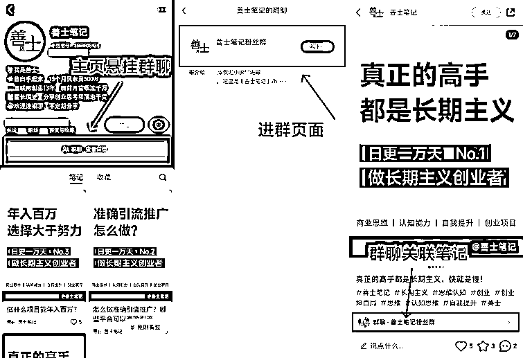
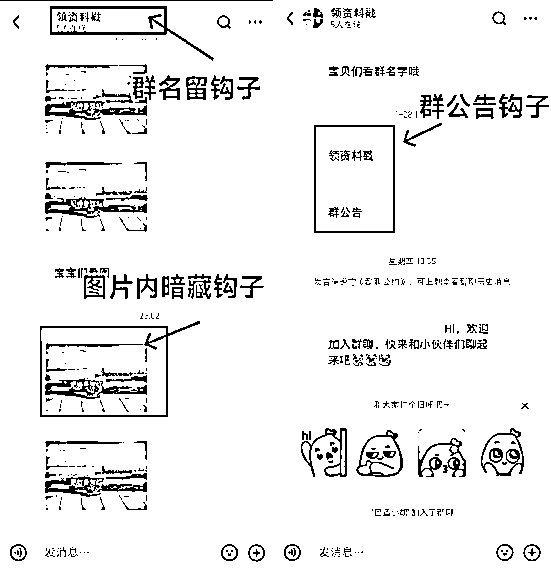
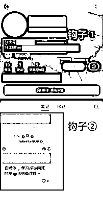
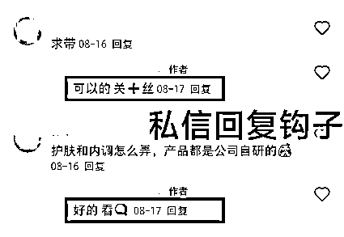
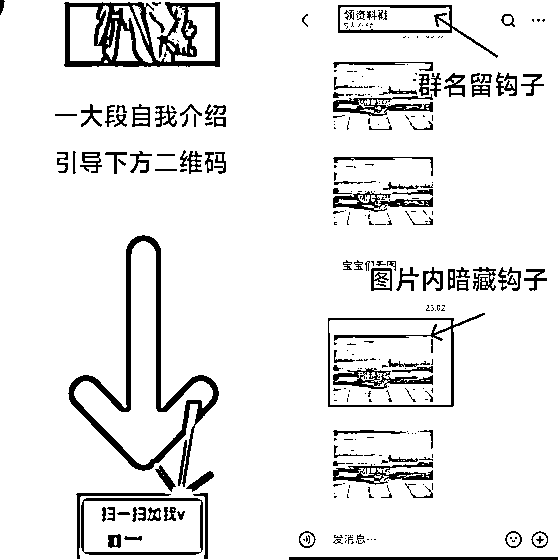
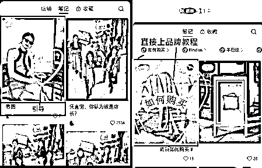
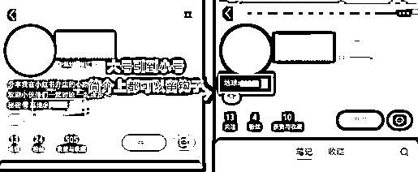
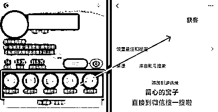
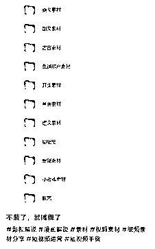
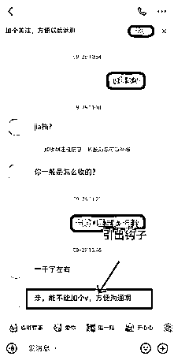

# 小红书怎么引流？9 个亲测有效的好方法！

> 原文：[`www.yuque.com/for_lazy/thfiu8/mqbyx88fuwb0clqp`](https://www.yuque.com/for_lazy/thfiu8/mqbyx88fuwb0clqp)

## (67 赞)小红书怎么引流？9 个亲测有效的好方法！

作者： 💖善士笔记💖

日期：2023-12-27

这是**善士**的第**9**篇笔记

持续日更，做长期主义创业者

小红书今年的发展真的是太快了，从 4 月份开始，小红书开始搭建自己的全闭环商业模式，从种草到转化全部在小红书站内完成。同时官方平台开始着手，禁止站外引流。

在不断尝试以后，总结了**9 个相对比较安全并且有效的引流方法**。分享给大家，请接着往下看👇

**1、小红书群聊**

小红书站内可以创建粉丝群，相信大家平时也能刷到，在博主的首页有悬挂粉丝群的表示，如果用户对你感兴趣，就会加入到粉丝群里面。

**加入粉丝群的好处：**

1、小红书的粉丝群是官方允许创建的

2、粉丝群可以直接关联笔记

3、小红书粉丝群聊链接，可以直接发在评论区，实现丝滑导流

当粉丝进群后，粉丝群的名称/公告/内容，都可以留下你的联系方式。开启你的引流之路。

1、注意，一定要用小号活跃，大号是名片，小号才是你的引流活跃钩子。

2、群名和群公告也是你的发挥主场，只要添加上去的内容不被官方提示禁用，就能一直悬挂上去，后进群的粉丝也可以刷到。

**2、小红书小号引流**

大号作为你的名片，只要进行常规操作就可以了，想要实现引流不被官方发现，这时候小号开始登场。

1.小号留下你的联系方式，直接简介上@大号引导。

2.再发一篇钩子笔记

这样一番操作下来，直接下了两个钩子，还这么醒目，用户怎么着也能看见其中一个。

**3、评论区引流**

评论区可以留下一个钩子，置顶钩子，让每次下滑看评论想要找到答案的用户第一眼就能看到。这里回复的时候注意敏感词，一般可以使用符号、同音词、emoji 替换。主打的就是安全第一。

**4、私信引流**

私信引流方式吧，可以尝试，建议使用矩阵小号来分散风险，同时回复微信号的时候可以回复不同的微信 ID，以免平台检测出你的微信号。

私信方式可以是二维码，也可以是添加了微信名字的图片，还可以是 AI 生成的艺术二维码，只要微信号不明显，都可以尝试。

**ps：群聊的方式同时也适用私信。**

**5、置顶笔记**

相比大家在浏览小红书的时候，遇到感兴趣的博主，都会到主页继续观看其他的笔记，这时候，机会就来了——**置顶笔记**。

置顶的笔记在主页那是相当醒目，留的钩子，可以是使用教程，也可以直接了当的在笔记中留下联系方式。

**6、简介引导**

一个账号的**基础设置里面也可以放钩子**，比如说你的简介。只要在添加简介描述的时候，能过审核的文字，都可以插入你的钩子。

1.大号导流到小号简介的、

2.直接在大号上面留下联系方式，微信，邮箱等等

想过简介审核，前提要知道：你的简介描述里面不能出现手机号码直接丢上去的情况，可以使用 emoji，同义词进行替换。这样通过的概率会很大。

**7、瞬间打卡**

在瞬间打卡上留下联系方式也是一个不错的选择，既明显，又隐晦的留下印象。

**8、晒钩子**

直接将你的资料晒出来，只要感兴趣的用户，直接会在下方留言。

**9、引导对方留微信**

既然官方查导流，倒不如我们直接反其道而行，直接引导他人留联系方式，这种方式几乎就是百分之百的安全。

总之，在小红书，没有 100%绝对安全的引流方式，只有相对来说比较安全的引流技巧，而且方法也得跟着平台政策更新，不断的测试，才能实现目的。

* * *

评论区：

💖善士笔记💖 : 日更一万天，第 9 天
紫煊（重庆） : 谢谢分享
💖善士笔记💖 : [微笑]
windy 梁 : 感谢分享
子枫® : 感谢分享[强][强]
玥玥 : 瞬间打卡是怎么添加在小红书主页的？
💖善士笔记💖 : 左上角里面
玥玥 : 找到了，谢谢🙏

* * *