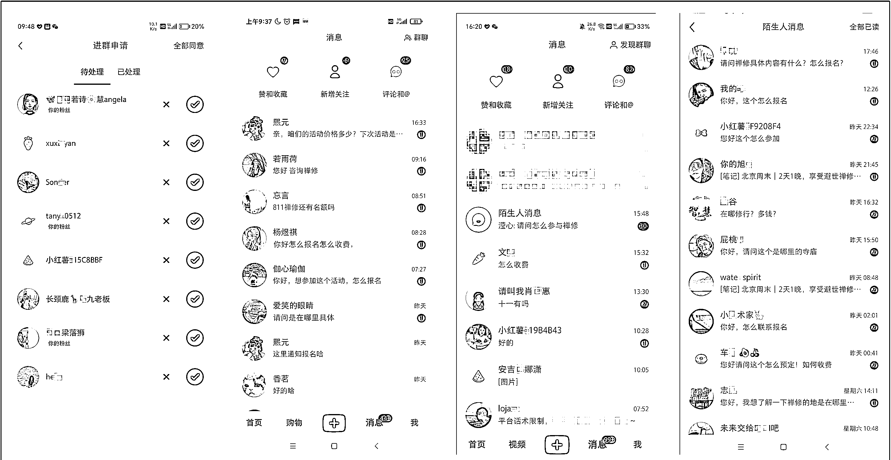
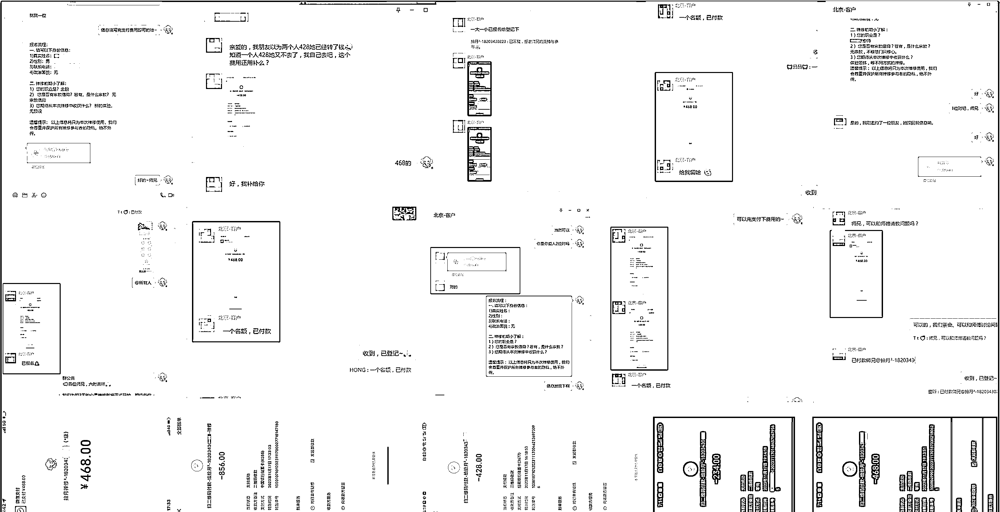
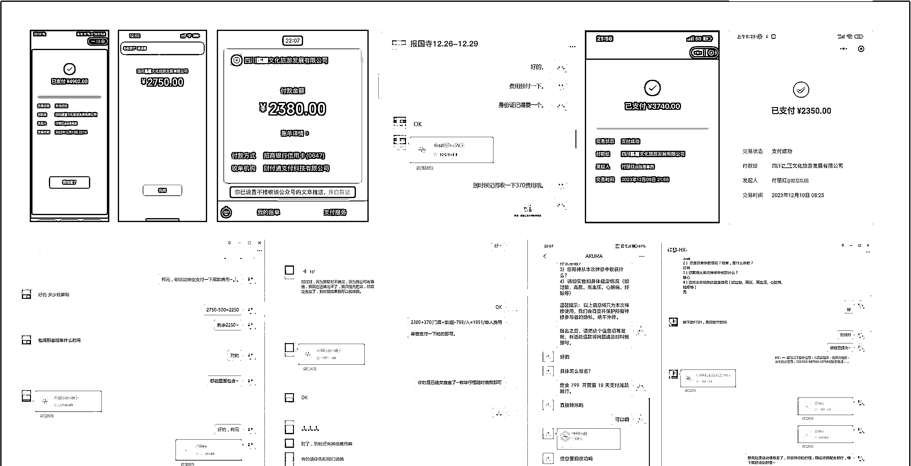

# 1 周变现 7w+，小红书禅旅赛道从 0-1 玩法揭秘

> 原文：[`www.yuque.com/for_lazy/thfiu8/yg4maesye8c75nl8`](https://www.yuque.com/for_lazy/thfiu8/yg4maesye8c75nl8)

## (40 赞)1 周变现 7w+，小红书禅旅赛道从 0-1 玩法揭秘

作者： 安小安

日期：2023-12-26

1 周变现 7w+，小红书禅旅赛道从 0-1 玩法揭秘

大家好我是拾月，11 月份我在生财社群分享过一篇关于，30 天在小红书做禅旅引流变现 5W+的精华文章，包括一些谈单的技巧、有兴趣的圈友可以看看。

通过上次做禅旅的经验，给这次我们团队带来了非常成功的案例。

目录：
1、趋势介绍
2、产品规划
3、价格制订
4、公域流量
5、代理分销
6、转化方案

更多详细内容移步飞书链接:[`t.zsxq.com/15yt4pKjg`](https://t.zsxq.com/15yt4pKjg)[`b3k2jeijqy.feishu.cn/docx/IC2WdG8KnoZbqNxDq0wcdBG1nHg?from=from_copylink`](https://b3k2jeijqy.feishu.cn/docx/IC2WdG8KnoZbqNxDq0wcdBG1nHg?from=from_copylink)

* * *

评论区：

三十年 : 最后选的寺庙是在西安吗？
安小安 : 没有啊，这期主要就是在市区，坐标北京。

* * *