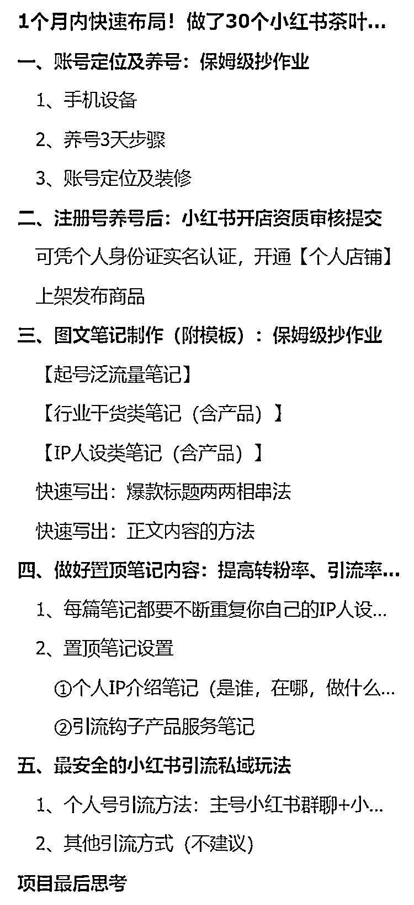

# 做了 30 个小红书茶叶茶人 IP 矩阵号的实操攻略分享

> 原文：[`www.yuque.com/for_lazy/thfiu8/nv4du3sa0ds2ab91`](https://www.yuque.com/for_lazy/thfiu8/nv4du3sa0ds2ab91)

## (32 赞)做了 30 个小红书茶叶茶人 IP 矩阵号的实操攻略分享

作者： 蔡文静好文静

日期：2023-12-29

1 个月内快速布局！做了 30 个小红书茶叶茶人 IP 矩阵号的实操攻略分享

你好呀。我是有教个人做小红书 IP，也可帮企业直接做小红书内容代运营，和企业内训小红书的文静

最近跟一个茶叶产品供应链合作了小红书流量赋能细分行业，这些是咱们矩阵号跑出的爆款

背景说明：
因为考虑到很多茶人都偏向于产品供应链匠心，在线上的学习时间精力有限。所以在分享时，文静偏向先给的是直接实操直接落地。是在他们做出数据结果后，再加餐去分享爆款方法论底层逻辑

接下来给直接分享我们是怎么保姆级布局 30 个矩阵号发小红书内容的？

点击飞书链接：[`gifi56ymyi6.feishu.cn/docx/N7PudcItJonWrUxc4VhcuAPwnud?from=from_copylink`](https://gifi56ymyi6.feishu.cn/docx/N7PudcItJonWrUxc4VhcuAPwnud?from=from_copylink)

* * *

评论区：

Cong : 请教，30 个号需要几个人呢？想知道 30 个号怎么有次序开展，我自己做 3 个号都感觉乱
蔡文静好文静 : 这篇文章我主要分享是用培训陪跑的逻辑，给茶叶店茶叶行业的代理商员工一起做 30 个小红书矩阵号打法~

自营盘我一般是 1 个员工管 10 个 IP 矩阵号。先跑出单账号爆款形式，复用到其他矩阵号上。不断测出更多自己的爆款模板，复用起号更多矩阵号
林深🍑 桃青青🎶 : 这帖真是保姆级别的👍👍👍
无所适从 : 受教了，圈友[抱拳]

* * *