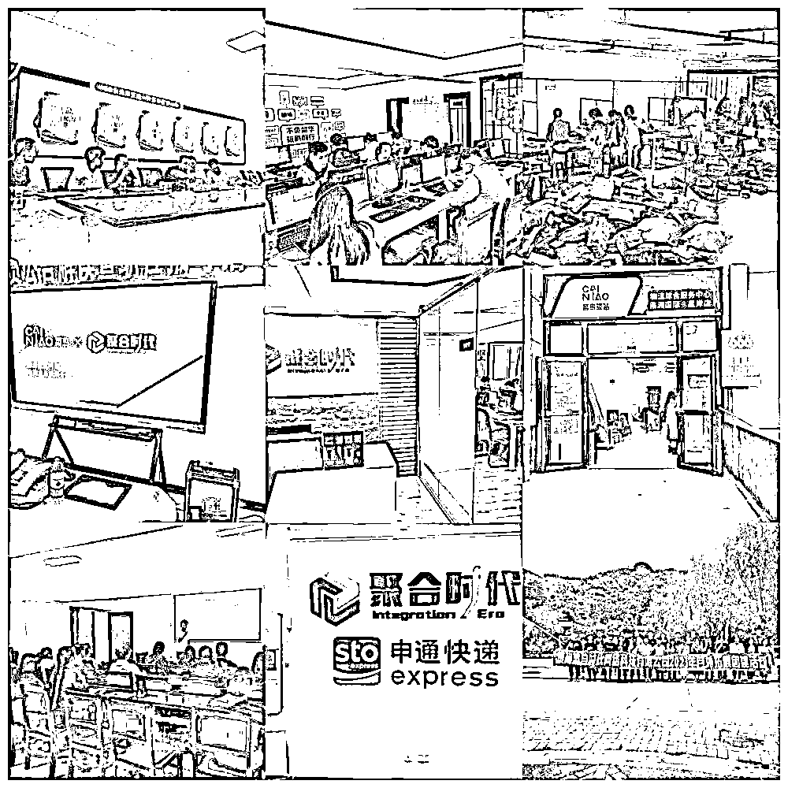
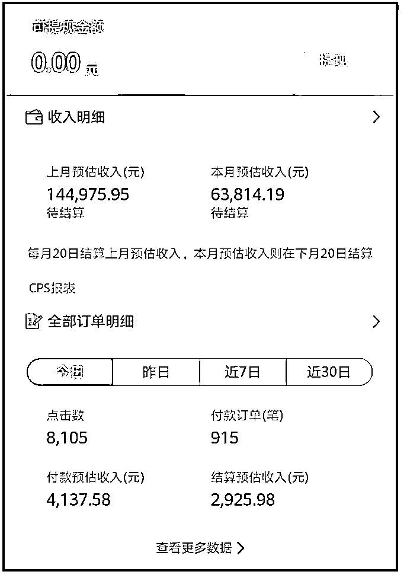
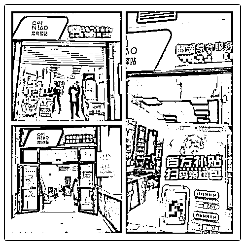
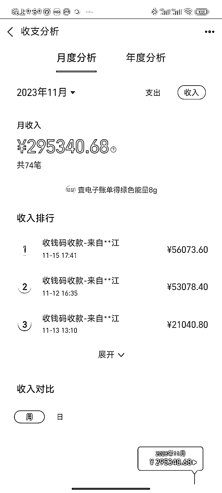
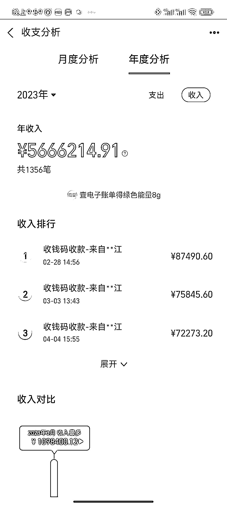
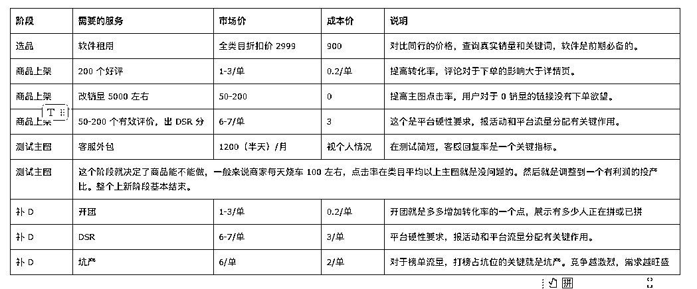
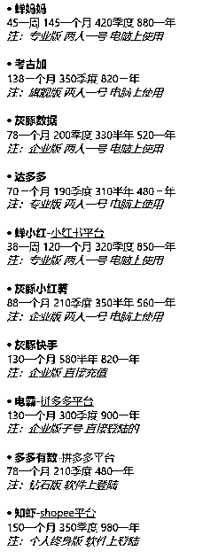
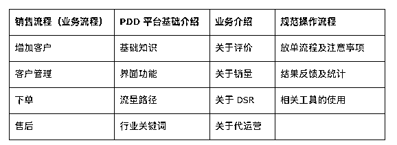

# 家门口的快递驿站，藏着多少赚钱机会？

> 原文：[`www.yuque.com/for_lazy/thfiu8/kvfpq5vheygyst9r`](https://www.yuque.com/for_lazy/thfiu8/kvfpq5vheygyst9r)

## (精华帖)(341 赞)家门口的快递驿站，藏着多少赚钱机会？

作者： 阿木

日期：2023-12-26

一家快递驿站，能靠什么赚钱？快递寄存、送货上门？

运营了 53 家驿站的我，今天来聊点不一样的。

首先，科普一下快递驿站的正经收入来源，派费分成。比如说，一个包裹的总派费是 1.1 元，快递员自己送拿 8 毛，如果存到驿站里，驿站就收 3-4 毛。

如果纯靠几毛钱的微薄收入，驿站就很难经营下去。所以，可以借着送货上门的机会，加到客户微信，从而做淘客或者社区团购生意。后者收益还是挺可观的，我之前尝试团过红枣干，一个小时盈利过万。

新手如果想入局快递驿站，我个人推荐从代运营开始。因为 99%的快递都是电商件，那么 100 个寄件方里，就有 99 个商家资源。通过驿站找到商家，再与商家达成代运营合作，最后基本能稳定月入过万。

潜水三年很少冒泡分享，所以这次想说的内容特别多。我会聊聊快递驿站的现状、机会，赚钱的驿站模型，新手入门的推荐路径，以及我做这个业务的初心。真心希望今天的内容能够帮到大家~

生财的伙伴大家好！做个简单的自我介绍：

我是李欣键，生财的网名阿木，目前在贵州黔南。

主要业务有几部分：

1.黔南本地 53 家快递驿站运营和管理

2.拼多多和抖店代运营，私域卖家 2.7W

3.本地云仓，礼品网，日均发货量在 6Q 件左右

4.本地同城平台，本地团购等

这几年业务基本都是围绕着快递和驿站资源来拓展的，目前有两家公司，一家主要负责代运营和礼品网等线上业务，一家是负责驿站管理运营，以及同城团购等线下业务。团队总共 83 人。

几年时间，整个团队一直处在快速发展的过程中，快递驿站这个资源藏着不少赚钱的项目，希望通过我的分享能给大家一些启发。

整篇文章内容较多，为了方便大家快速阅读整篇文章，大家可以先了解项目大纲：

一、快递驿站的现状分析

二、快递驿站的赚钱机会探索

三、驿站运营的实际案例

四、利用商家资源，稳定月入万元

五、最后聊聊我为什么做这个业务，和大家分享一点初心

本次分享的主要内容就是关于快递驿站的相关事宜以及适合普通人通过快递驿站资源变现的项目。

驿站是现在分布非常广泛，大家每天都要接触的快递末端网点。

很多伙伴来问我关于驿站加盟和驿站的相关事宜，在文章一二三小节中大家可以有个大致的了解。

当然，驿站这种实体项目因为有一定的地域差异性，并且需要不少的快递经验，门槛比较高，所以和生财内容官讨论文章的时候，老师们希望我能给大家分享适合普通人可复制以及门槛较低的项目。

在第四小节中，我将重点说明如何通过驿站包裹获取的卖家资源，给他们提供代运营服务进行变现。目前，根据实操三年的经验，项目依然有非常大的市场，适合普通人操作可以做到稳定月入万元以上。

最后，我在第五节里，分享这几年我个人创业的一些经验，希望创业路上的小伙伴们有一些启发。

## 一、快递驿站的现状分析

**（1）快递驿站的发展趋势**

我从 18 年接触快递行业开始，见证了驿站的飞速发展和面临的挑战。以下是我对快递驿站未来发展的个人观点：

**包裹量增长 ≠ 收入增长**

在我们县城，虽然日均派件量从 3 万增至 8 万，但这并未直接带来驿站收入的同比增长。竞争激烈导致单个包裹的盈利下降，意味驿站着需要更多突进来实现收入增长。

**多元化业务至关重要**

由于传统快递服务的收益有限，我尝试探索新的业务模式。例如，通过返利淘客、本地团购、资源变现等方式增加收入，这些策略不仅增加了盈利，还提升了客户粘性。

快递驿站行业正经历着重要的转型期。为了适应市场变化，快递驿站要提高业务多样性，还需通过优化运营，确保持续增长。

**（2）驿站在行业中的地位和作用**

在快递行业中，驿站起到了至关重要的作用，它们是整个快递服务体系中的重要节点。以下是驿站在快递行业中的地位和作用：

**1、分布网络的重要组成部分**：驿站构成了一个庞大而密集的分布网络，涵盖城市、乡镇、社区等各个层面。这使得快递公司能够更好地覆盖整个服务区域，提高送货的效率。

**2、方便用户自提和寄送**：驿站提供了一个方便的自提和寄送点，使得用户不必等待快递员上门送货，特别是对于那些白天工作或不方便接收快递的人来说，这是一项非常实用的服务。

**3、缓解配送压力：**快递驿站分担了配送中心的工作压力。快递公司可以将包裹集中送到驿站，由用户自行前往提取，有助于减轻快递员的负担，提高整体的配送效率。

**4、服务弹性：**驿站为用户提供了更灵活的取送货选择。用户可以选择在自己方便的时间前往驿站自提，也可以选择将包裹寄送至就近的驿站等待取件。

**5、降低末端配送成本：**通过驿站服务，快递公司可以更有效地管理最后一公里的配送，降低配送成本。相比于快递员逐一上门配送，驿站的自提模式可以更好地集中处理大量包裹。

**6、提升用户体验**：驿站的设置提升了用户的整体快递体验。用户可以更方便地掌握包裹的流转情况，自主选择提取时间，从而提高了整体的满意度。

总的来说，快递驿站在快递行业中承担了优化服务、提高效率、降低成本以及提升用户体验等多重重要作用，成为快递服务网络中不可或缺的一环。

**（3）驿站面临的挑战**

驿站的主要收入就是派费分成。

比如说，一共包裹的总派费是 1.1 元，快递员派送一个包裹就是 0.8 元。如果存放到快递驿站里，驿站的就收取 0.3-0.4 元。

如果驿站每天收 1000 个包裹，收入就是 300-400 元。寄件板块，比如说成本是 5 元首重，收取客户 10-15 元首重，赚取寄件差价。

目前为止，很多驿站都是当地快递公司网点自己弄的加盟。比如说，中通该区域的包裹总量是 500 个，然后就收 5 万左右的加盟费，确保中通的包裹都会放到这个店里。每天就有 150 块钱的收入。

虽然账面是这么算的，驿站行业的猫腻还是比较多的。很多正在经营驿站的老板也是苦不堪言。有几个点：

**1、竞争激烈：**随着电商行业的快速发展，快递行业竞争激烈，各大快递公司通过加盟驿站来扩大覆盖面。这导致了加盟费用上涨，使得驿站面临更大的财务压力。

**2、不确定的收入来源：**驿站收入主要依赖于快递派送费和加盟费，但由于快递公司之间的政策、竞争关系以及加盟费的影响，驿站的收入相对不稳定，经营者往往难以预测和规划。

**3、多元业务盈利难：**尽管驿站提供多元化服务，如零售、生活缴费等，但这些业务的利润相对薄弱，难以成为可持续的盈利来源，使得驿站面临着业务结构单一的挑战。

**4、高人力成本和劳动强度：**驿站通常由少数人员运营，工作时间较长，全年无休。这不仅增加了人力成本，也导致经营者疲劳，人效低下，对驿站的可持续经营构成威胁。

**5、快递战争影响：**快递公司之间的激烈竞争，尤其是快递驿站带来的价格战，使得驿站经营者被动卷入价格压力中，难以提高服务费用，影响了整体盈利水平。

**6、包裹处理压力：**随着电商业务的增加，驿站需要处理大量包裹，对其空间和管理能力提出了更高要求。包裹处理的复杂性和高峰期的包裹数量可能导致服务效率下降和用户体验下降。

**（4）快递驿站潜在的机遇**

**1、稳定的社区用户群体：** 驿站主要服务于周边住户，形成了一个相对稳定的社区用户群体。这为建立长期信任关系提供了机会，同时也为扩大用户群体奠定了基础。

**2、可开发的稳定业务渠道：** 驿站经营者通常受教育程度不高，但通过提供专业业务支持和培训，可以将他们转化为稳定的业务渠道。这为提升服务水平和用户体验创造了机会。

**3、线下交付和售后便利性：** 驿站作为固定的线下交付点和售后网点，具有便利性和可信度。这为吸引更多线上业务提供了基础，同时也为增强用户体验提供了有利条件。

**4、社区服务平台：** 驿站可以发展成为社区服务平台，提供多元化服务，如生活缴费、零售等。通过拓展服务范围，增加额外的收入来源，提高驿站的盈利能力。

**5、合作机会：** 与电商平台、零售商以及其他本地企业合作，共同推动驿站业务的发展。合作可以带来更多的流量和业务机会，加强驿站在当地的影响力。

这些机遇为快递驿站提供了多方面的发展潜力，通过善用这些机遇，驿站可以更好地适应市场需求，提升服务水平，实现可持续发展。

**（5）不建议普通人入局四五线城市的驿站**

如果是想通过开设驿站来作为**主要收入来源**，我建议大家加盟之前需要谨慎考虑。根据个人经验有以下几个原因：

**1、降低的单包裹收益：**随着快递行业竞争加剧和成本下降，快递费用普遍呈下降趋势。这意味着虽然驿站处理的包裹数量可能增加，但每个包裹带来的收益却在减少。因此，驿站的总体收入增长可能不会像预期那样显著。

**2、资金风险和政策支持的不确定性：**在一些小城市，驿站加盟可能涉及较高的资金风险。有些驿站加盟是在没有省区政策支持的情况下进行的，属于市级网点自行决策。

此外，有些驿站的加盟商可能会受到过分美化的盈利前景的误导，最终面临高风险的投资和不稳定的收入。

**3、快递品牌间竞争的影响：**驿站在快递品牌之间的竞争中往往处于不利地位。品牌间的竞争和区域政策可能导致驿站无法平等地处理各个快递品牌的包裹，这会限制其收入来源。有时，驿站可能会因品牌间的斗争而只能处理少数几家的包裹。

对于普通人来说，加盟四五线城市的快递驿站存在多重风险和挑战。在没有深入的市场洞察和行业知识的情况下，这可能不是一个明智的投资选择。

## 二、快递驿站的赚钱机会探索

虽然不建议大家加盟经营快递驿站，但是利用快递驿站资源来展开拓展业务，还是非常香的。

近几年的发展历程一直都是围绕着快递和驿站展开。

**（1）从快递到淘客**

2017 年，我从广州带着挣得的钱回到家乡，入股了当地的申通快递。不料遭遇合伙人的欺骗，处于事业的低谷，迫切需要寻找新的业务机会。

当时选择了淘宝客业务。我意识到本地的菜鸟驿站是一个理想的流量入口，于是开始利用这一平台进行引流和推广。

在一个小区驿站，我提供送包裹上门来吸引客户使用返利，效果显著，这成为了一个重要的吸引点。

**（2）社区团购一小时盈利过万**

有一次，群里的客户询问是否有红枣干出售，我立即在淘宝联盟搜索，发现一款红枣片 19.9 优惠券 10 佣金 50%。与山东的厂家联系，并计划拿来做线下引流活动。当时进货了 3000 包红枣干，每包成本为 4.7 元。

在群里进行了商品价值的宣传后，我公布了一项特别优惠——线上 19.9 元，驿站特价 9.9 元。

消息发布完以后，我去洗了个澡，回来就已经定完了。也就是一个小时，我赚了一万五千多块。尽管利润不高，就两个五百人不到的群，对我来说是一个巨大的惊喜。因为没有任何准备，剩下的一周时间，我都在送货上门。

这次经历激发了我对社区团购的兴趣。为了支撑线上业务，我成立了一家运营公司，逐渐发展成为一个 47 人的团队。

同时，我还建立了自己的云仓库，作为本地驿站的分拣中心。

通过对驿站运营的深入了解，我逐步拓展业务，如今已经涉足 53 家驿站的经营。

## 三、驿站运营的实际案例

目前为止，我在本地参与了 53 家店铺的运营。

我选一家标准驿站来告诉大家收益模型，条件居中，所在小区入住率接近 95%，房价居中，属于快递驿站+零售的标准模式。

#### （1）包裹存放与收益模型

1、包裹存放量：以我们黔南州本地为例，基本计算公式：住户/2*0.3

例如：小区住户 1200 户，每日包裹收益平均在 1200/2*0.3=180，如果有其他的存放点，依情况会减少。

2、运营成本：包括维护费用、租金（如果适用）、人力成本。

3、收益来源：包裹存放费+零售+附带业务

4、用户体验：简化取件过程，确保服务的可靠性和安全性。

5、市场推广：利用社区活动、线上广告等方式推广服务。

6、合作伙伴：与当地同城服务公司建立合作，扩大服务范围。

#### （2）淘宝客业务与私域流量的挖掘

返利淘客是可以和驿站完美的契合

我在 18 年就做过实测，因为目前资金和空余人工除了基础的代运营业务主要放在云仓建设以及同城平台打造上，返利淘客暂停实施，这个板块是随时可以架设起来。

驿站的客户引流主要来自于送货上门，我们本地的人工水平大概在 2500+，按照返利包裹送货上门的原则，或者添加微信，要求付费送货上门，在一周内可以很快把所有的微信全部添加到位。

在门店逐步演示返利过程。经测试，返利+朋友圈推荐，单客户收益可以做到 45-55/每月。

#### （3）自营产品的销售与市场潜力

今年中秋，我们开始结合驿站做同城产品。

我们自己在本地供应链选购产品，做了中秋礼盒。

都匀毛尖茶（50g）+云腿月饼（400g）+蜂蜜（500g） 成品成本 87 元 我们售价是 118 元，每盒是 31 元利润，驿站分润 10 元。消费者在微信群订购，仓库直接发到驿站，驿站配送上门。

第一次生产，所以出品时间其实已经错过了，到 9 月 19 日才出品。30 日就是中秋节。

11 天的时间，53 家驿站一共销售 4437 个礼盒套装。

剩余利润大概在 8 万元左右。

如果控制好生产的节奏，我们预估销售额至少可以做到 200 万左右。

同城的消费者，特别是四五线城市。他的消费都是比较缺乏认知和理性的。

我们通过 10 天左右的预热，让消费者对产品有认知和期待。利用驿站做好售后担保。

只要供应链稳定，同城销售是由巨大的前景。

#### （4）政府合作项目的机会

刚才说到的中秋礼盒，就是一个标准的和 zf、国企合作的结果

我们自身的资金实力不足，所以需要用到国企的资金。国企需要的是任务，要的是流水和成绩。

我们追求的是利润，如何利用本地消费者对于平台公司的信任背书和资金及影响力来为公司创造利润，这个也是值得去探索和思考的。

当本地的流量成规模化以后，我们可以考虑和 zf 及平台公司接触并寻找合作机会。

## 四、利用商家资源，稳定月入万元

**（1）如何通过驿站资源赚钱**

合理利用驿站的包裹。包裹面单上有收寄双方，所以从收寄两个方面来讲解。

**寄件方：**

驿站 99%包裹都是电商件，每天 100 个包裹，假设包裹寄件方不重复，代表着就是 100 个电商卖家。

围绕这些电商卖家，我们给这个群体提供代运营、数据优化、资源整合、代发等服务。

**收件方：**

收件方就是驿站的客户，本地社区用户。

同城的业务包括返利、团购、生活消费。因为同城板块涉及的线下资源较为宽泛，有一定的特殊性和门槛，就暂时不在这里赘述。

因为这次主要分享普通人如何通过驿站电商卖家资源提供代运营变现。

**（2）代运营是什么业务**

代运营是指我们向寄件方提供的一系列收费服务，其中包括代运营、数据优化、资源整合、云仓代发、以及客服外包等业务。

这一系列服务都属于电商经营的组成部分。代运营业务非常广泛，涵盖了电商运营的各个方面。在电商经营中，除了开设线上店铺，其他所有与运营相关的业务均可以委托给第三方，这些业务统称为代运营。

从商品上架到客服售后，都属于代运营的范畴，可以整体承包也可以分项委托。

收益形式也可以多种多样：

a.月基础服务费+提成

b.单项计算

这些都是可以自己定制和商家商量的。

核心就是一个：**你能给他带去更多的收益或者帮他减少更多的开支。**

**(3）代运营业务门槛相对较低**

由于公司位于贵州的一个小县城，并未拥有电商行业的背景，所招聘的员工大多数是没有相关经验的新手。尽管如此，代运营业务在经过一个月的培训和客户积累后就算是正式入职，平均每个岗位能够创造约 1 至 3 万元的利润。

对于那些学习能力特别强的员工来说，能在一个月内实现最高 9 万元的收益。

这些结果反映出这个项目的学习门槛并不高，大部分人通过半个月左右时间的学习和实践都能达到万余的月收入。

**（4）为什么代运营会有机会**

#### 1**、大多数电商卖家都非成型的团队**

我们开展代运营业务已经三年，大部分时间都在回答一些基础小白的问题。后来我们自营店铺以后就清楚其中的缘由。电商行业还是以中小卖家为主，并没有请专业的运营团队，因为高额的人工往往都是一个或几个人身兼多职。

从货源到售后，要想每个环节面面俱到，真的不容易。虽然在官方的学习平台里，规则已经定制好，但大多数卖家没有精力和时间好好学习。基本上都是先执行再说，遇到问题解决问题。就算付费，也比养一个团队的成本会低很多。

#### 2、**便捷的广告投放，让竞争白热化**

拼多多推出 OCPX 和全站推广（点击和展示）的举措旨在使电商运营更为简便，让所有卖家都能轻松上手，降低运营门槛。

然而，这也导致了其他**需要人工干预的板块**竞争更加激烈。例如，销量、坑产、图片点击率、评论质量、店铺分数等等，这些因素对于卖家来说至关重要。

在这一竞争激烈的环境中，我们提供付费服务，帮助卖家解决这些问题，从而提高其在拼多多平台上的竞争力。

#### 3**、人工成本高，可以提供的付费服务多样化**

人工成本高的情况下，我们可以提供多样化的付费服务，以满足卖家的需求。以客服板块为例，客服分数考核时间较长，对于个体经营者而言，很难在早上 8 点到晚上 11 点之间做到及时回复。

虽然有智能机器人，但它只能回答一些基础问题。如果请一个职业客服，两班倒。

一个工位至少 6000 块。而客服外包市场价是 1800 左右，在回答数不多的情况下，一个工位接入 20 个店铺没有问题。

总的来说，代运营这个板块有非常大的发展空间，不仅仅是刚，就拼多多这个市场来说，300 万的卖家市场，加上近两年经济下行，很多人都在电商领域寻找突破口，服务需求更加旺盛。

加上和一线卖家合作，我们可以获取大量的一手信息资源，包括不限于货源、人力资源、类目风口及玩法等。

**（5）从事代运营会有哪些关键环节**

这篇分享的主体是驿站，预期是稳定月入万元，所以会围绕”普通人“”稳定月入万元“这两个关键词。

从**准备阶段**/**获客**（如何找到商家）/**成交**（怎么和商家达成合作关系）/**积累信任**（长期复购）三个方面来详细说明：

#### 1、**准备阶段**

**①** **两台手机，一机一号，只要能正常的使用微信就行，没有特殊的要求。**

准备微信，至少一个人准备 2 个或以上微信。并且每天做好朋友圈工作。

每天至少 4 条朋友圈：

1.  7:00-9:00 正能量话语或者每日新闻

2.  11:00-12:00 客户案例（包括销量视频/效果展示）

3.  14:00-16:00 分享运营技巧（干货分享）

4.  19:00-20:00 客户反馈

不定时穿插一些个人生活类的朋友圈，最好要真实一些，提升信任度。

素材可以直接参照我公司工作号的微信就行。

**② 电销卡**

电销现在查的还是比较严格，公司使用的电销卡就是 240/月租（200 分钟通话）+0.1 元/分钟

用于电话确认卖家身份，主动添加卖家微信。

**③ 电脑一台**

主要是处理账单，还有帮卖家做一些图，3000 左右的电脑配置足够。

**④ 活动资金**

我们以月入万元为目标，一般来说准备 5000 左右的活动资金基本已经足够。

**⑤ 下游资源**

代运营这个行业鱼龙混杂，我们刚开始的一年也遇到各种的 Z 骗团伙，花了几十万试水。这些稳定靠谱的下游资源（团长/主持/做单/软件商）都可以直接找我要就可以。

（拼多多）代运营板块的固定流程：

单是好评一个服务，每天一个客户 200 个好评，收入至少就是 150-300 块。建议新手入局，直接就从客服外包和好评单开始做起，只要是卖家，就需要不断上新款，上新款就一定会有需求。

#### 2、**获客阶段**

**a.驿站获取：**

每天通过驿站获取的方式，通过电话联系确认卖家身份后，迅速添加到微信，并在备注中记录添加日期。根据目前执行情况，100 通电话中有 6%以上的添加率，每个精准客户的获取成本不到 12 块，而每单利润远超过 100 块。

**b.公域引流：**

在 D 音等平台上寻找相关运营视频，通过留言方式吸引卖家主动添加。每个账号预计每天能够获得 3-4 个潜在客户。

**c.转介绍：**

不定期举办活动，激励已下单的卖家通过推荐方式引入新客户，并提供相应的奖励，例如送单服务。

通过这些多样化的获客策略，我们在不同渠道吸引商家，以确保源源不断的客户流入，为业务的持续增长提供坚实基础。

#### 3、**成交阶段**

添加客户以后，发送业务图，并告知不会骚扰用户，有需要随时联系。通过业务展示图向其展示我们的服务，我们可能会遇到两种情况：

**a. 主动询价客户：**

1.  当客户回复后，开始深入了解客户情况，包括货源、店铺状况、经营情况以及需要解决的问题。

1.  在对客户的情况有了充分了解后，我们可以直接推荐相应的服务，以促成交易。

**b. 发消息不回复的客户：**

1.  对于未回复的客户，不需要过于焦虑。可以在三天后进行回访，或者采用低于市场价的促销手段去激活客户兴趣，例如：“今日活动，新客户首单 100 评价 50 元”、“10 元试用店铺托管三天”、“免费店铺诊断”等。

1.  如果客户仍不回复，每隔一周进行一次主动联系，直到客户成交或被删除为止。在被删除后，可以尝试通过另一个账号重新添加客户。被删除的可能原因包括朋友圈管理不善、骚扰过度、客户已停止经营等情况。

通过这样有条不紊的跟进策略，我们能够更好地与客户建立联系，提高转化率，同时避免骚扰客户。

#### 4、复购阶段

**a. 成交后的跟进：**

在客户首次成交后，及时进行跟进，了解客户的反馈和满意度。同时，分享同类目客户的相关操作经验，以激发客户的兴趣和信任感。

**b. 客情管理：**

对客户的经济情况进行判断，建立客户档案。服务的定价和提供的业务量可以根据客户的经济能力进行灵活调整。对于预算较低的客户，可以适当降低服务的深度和广度，而对于职业卖家，可以持续提供更多综合服务。

**c. 以卖家角度思考问题：**

从卖家的角度出发，思考电商经营中的问题。电商卖家在不同阶段都追求降本增效，因此我们要站在他们的立场，主动为客户考虑并提供资源整合的解决方案。通过总结和利用大量电商信息，为客户提供更多有针对性的服务。

**d. 电商代运营的刚需：**

电商代运营是一个刚需，解决信任问题是关键。在价格合适的前提下，客户基本都是稳定的，只要他们持续经营网店，就会寻求合作。建立信任关系是维系长期合作的基础。

和卖家做朋友是一个基础，每逢节假日，不定时的寄送小礼品，维系关系。都可以把这些方式放到客户维护的工作中去。当然，合作的基础是卖家还在经营网店，我们最长的合作客户到目前已经三年之久，每个月提供的利润在 3W 左右。

**合作商家潜在的业务空间：补单业务、跟店、代运营、代发，这些业务对应的门槛**

**E.**拓展业务范围：

**补 D 业务：**

提供补 D 业务，满足卖家的刚性需求，同时推荐给下游卖家，实现中间利润。通过改销量和基础评价，确保新链接的信任度，达到 200 单的基础要求。市场价约为 600，而下游成本价为 200，从中获得利润。

**客服托管：**

提供客服托管服务，根据售前售后、白班和晚班的不同，灵活定价。例如，半天服务大约为 800 元/月，全天服务为 1600 元/月，服务咨询量在 50 以内。这项服务提供基础的人工成本支持。

**代发服务：**

满足卖家对代发礼品的需求，包括包裹云仓入库代发和礼品代发。成本价以极兔为 1.1、通达系为 1.5 左右计算。通常代发量较大，可获得每单 0.1-0.2 的收益。

**其他服务：**

包括修图、软件优惠等，提供多样化的增值服务。这些服务可以根据客户需求进行定制，为卖家提供更全面的支持和解决方案。

通过不断拓展业务范围，公司能够更全面地满足客户需求，提高利润来源的多样性。

只要是服务好，基本上客户就是一直跟着走了。我公司单客户产出大概在 2000-3000/月

当然，大客户的话，每个月能提供的利润几万的利润。

到此，如果是执行力到位，前期两周左右的客户积累。每个月稳定收益 1-5W 已经可以确定。

### 五、如何建立有交付能力的团队，哪些环节可以很好的 SOP，做到让客服完成交付

建立有交付的能力的团队，其实就是 1-100 的过程：

#### **a.增加人手，筛选大于培育**

我一定会把这个事情说在前面，自己有深刻的教训。

有几个原因：

**1.培训时间越长，人力成本越高，同时也代表着他并不适合这个岗位。**

我们现在招聘新人，要求就是一周内学习，两周内出单。一个月能否保证这个岗位的收支平衡是这个人是否合格的衡量标准。代运营这个业务得基础门槛很低，基本上只要做电销，成交就是水到渠成得事。

**2.不要用金钱去衡量人性。**

这个项目属于爆发式的项目，一个新人可能一个月赚几个 W 都有可能。整个过程的流水可能会很大，一定要确定他没有负债赌博等关于金钱的恶习。

**3.不要相信任何人。**

在代运营的过程中，因为客服会和客户深度的交流，所以非常容易就引到他自己的微信上去。要有明确的防火机制。

根据公司的经验，客服这个岗位会推荐几个特点的：

1.  刚毕业涉世未深的年轻人；

2.  保持一定学习能力且有家庭压力的；

3.  不害怕被拒绝，有一定的交流能力。前期的电销，和后期交付过程都需要语音交流。

#### **b.培训，以培养商家的角度去培训。让客服理解平台，理解卖家。**

我们的培训主要是分为四个板块（上表）

一定要让客服知道，卖家容易出现哪些问题，面对这些问题有哪些解决方案，成交前客户可能出现的顾虑，以及最后结果的反馈、售后工作。如何保证客户和公司的利益。内部培训资料都比较完善，有需要的圈友可以直接与我联系。

#### c.核心岗位一定要能把控

比如， 和驿站负责人的对接工作。这个就是客户信息的获取渠道，使用不当会涉及到用户信息 FZ，所以一定需要谨慎。还有就是和下游团队的对接，因为除了自身的人力成本，很多技术都是靠谱的下游团队去完成，所以对接人员掌握着核心技术，这个必须要确保安全。

最后，就是客情管理了，一定要及时的统计，确保客户是在你的掌控之内，客服带着客户跑路也是常有发生的事，会造成很大损失。

我们如何利用驿站资源变现的其中一个项目分享出来，因为这个项目门槛低，有非常强的可复制性，所以就拿出来分享。有不明白的地方，圈友可以留言。

## 六、最后聊聊我为什么做这个业务，和大家分享一点初心

#### （1）我为什么选择做快递驿站

选择经营快递驿站，对我而言，不仅是因为它为像我这样学习和接受能力有限的人提供了一个稳定的客流渠道，而且因为驿站老板和管理者大多是容易合作的普通人。

并且有非常大的可拓展空间，公司就根据驿站资源拓展了很多项目出来。虽然单个驿站的覆盖人群可能仅限于几千人，但是非常稳定并且有信任基础。

#### （2）创业过程中的心得体会

我远远谈不上创业成功，到今天，还会因为资金，人手等问题发愁。也经常会停下来反思自己到底是不是走错路了，到底为什么还在坚持。

不过白手走到现在，还算是吃喝不愁了，认真思考了一下创业过程中有几个点比较重要，执行力，坚持和韧性。这些都是基础配置，不用拿出来说。

**清楚的认识到自己的能力和资源**，知道自己有什么，能干什么，我觉得很重要。考虑清楚自己可以给用户提供什么价值，用户会为了真正有价值的东西买单。

最近一直在思考两位大神分享的创业赚钱思路，大概的意思是**“学习别人已经赚到钱的项目，像素级去模仿。” “待在舒适圈里很重要，因为你比别人擅长干这件事，所以对于你来说才是舒适圈。”**

我觉得非常对，首先，先了解一个赚钱的项目，努力去抄作业。然后，提升自己的能力在利用自身资源，在项目的某个环节上放大。

分享很重要，无论是线上还是线下。公司得以快速的发展，离不开太多人的帮助。首先，就是要分享，要让别人知道你是做什么的，正在做什么。

要不然别人想帮助你都无从下手。我就是太缺乏线上的分享，最近和很多圈友都有过接触，他们优秀的背后无疑都是大胆的分享。

#### （3）与同行及社群成员分享的寄语

加入生财已经三年了，一直都是悄悄地学习。因为圈子里有太多优秀的榜样值得我去学习，也有太多优秀的项目和知识拓展自己的认知。

原来一开始，只是害怕和互联网圈子距离越来越远，错过太多关键的信息，有一种信息焦虑。

现在，认识到分享的重要性，并且通过几次圈友线下的交流对自己成长的帮助。我更加愿意把自己有限的资源和项目拿出来分享，抛砖引玉，吸引更多的人脉和资源。

感谢生财团队，也感谢生财的圈友们每天都在圈里辛勤输出给我学习和成长的机会。一起生财有术！

* * *

评论区：

开心 : 文章好长，明天看[呲牙]
璐璐说钱 : 留个联系方式老板[发呆]
米了个果子 : 太棒了
阿木 : 228355
啊吹(不二) : 很棒，看完了，可以睡觉了💤
半条咸鱼 : 牛逼  熬夜看完了
王巍 : 老乡牛掰[强][强][强]
北国 : 厉害

* * *