# 月销 800 单，营业额 9 万+，从 0 做一家小而美的宠物外卖店

> 原文：[`www.yuque.com/for_lazy/thfiu8/eiow142gn4xtpfu8`](https://www.yuque.com/for_lazy/thfiu8/eiow142gn4xtpfu8)

## (精华帖)(50 赞)月销 800 单，营业额 9 万+，从 0 做一家小而美的宠物外卖店

作者： 刘光毅

日期：2023-12-29

随着养宠人越来越多，随叫随到的宠物外卖变得流行，随便打开一家宠物外卖店，就会发现月销能达到 1000+单。

22 年的时候，我无意间刷到这样一家月销惊人的宠物外卖店，就干脆自己在开了一家。

做这种外卖店，房租不是大头，找个仓库或者普通居民楼就够了，月租可控制在 2000 内，麻烦的其实是一个人守店、一个人管理 500+的 sku。

到目前为止，我在美团、饿了么、私域等全部渠道的月销量维稳在 800 单，营业额 9 万+，利润 1.4 万。我自己还是挺满意的，做自己喜欢的事情，还有不错的收入。

现在入局宠物外卖店其实有点晚了，一线城市基本饱和，二三线城市倒还有些机会，可以尝试。接下来我会分享如何做一家宠物外卖店，希望我的分享能帮助到大家。

大家好，我是佑笙，很高兴能在生财分享我在本地做宠物用品外卖这个生意。

我是一个 7 年养宠人，对于宠物，我非常喜欢研究它们的吃穿用。在疫情那一年，由于我在武汉，能切身体会到食物来之不易，更不用说宠物的粮食了。

也是因为疫情，武汉的外卖业务发展飞快。22 年一次偶然发现美团上有宠物用品店，并且他们的月销惊人，所以萌生出了自己也开一家店的想法。

由于前期自己不会开店，所以找了很多同行，最后加盟了一家自己觉得还不错的加盟商，在武汉顺利开了第一家宠物店爪爪萌宠物用品店。

由于当时店铺离家太远，今年搬迁到了离家非常近的位置，改了一个自己觉得还不错的名字嘤嘤怪宠物用品店，目前也是比较稳定，主要是做美团和饿了么两个平台，主营宠物全品类。

月销稳定在 800 左右，所有平台月营业额在 9 万左右，包含私域。

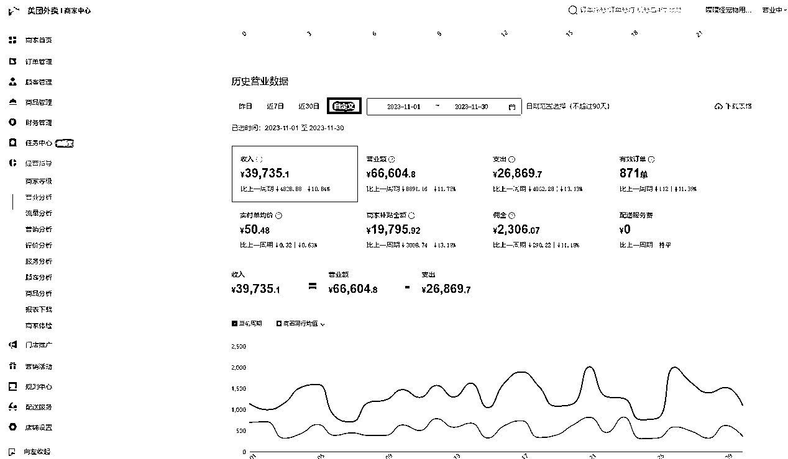

接下来给大家介绍一下，我是怎么做起来这家宠物用品外卖店的。

# 一、选址

想要开店首先得需要有个铺子，由于咱们这种模式主要是以外卖为主，所以需要考虑到周边的客户群，还有竞争对手。

目前养宠物的以老年人和 95 年以后的人群居多，咱们这种主要是针对 95 年以后的年轻人，那么选择的地址肯定是市中心比较繁华且 loft 比较多的地方，这样单身人群会相对来说比较多。

还得考虑到周边竞争，一般来说，周边如果三到五公里范围内，开宠物外卖店的不超过 5 家，基本上竞争就不会太大。

而且也得看看同行销量，基本上同行的销量就能看出该地址大概的体量，一般周边店铺平均 500 单以上，那么这个位置都还不错。

# 二、房租

由于开店，大头就是房租和人工，咱们这种外卖对于线下要求不是那么高，所以可以直接租居民楼就能开。我就是租的一个小区 1 楼，最好也是在 1 楼，这样搬货都会更方便。然后房租尽可能控制在 2000 以内。

当然，如果本身就是开宠物店的就另当别论了，直接起店就行。

咱们这种办理营业执照也非常简单，我个人是在当地社区办理的个体户营业执照，每个城市办理的要求可能会有不同，但是基本上都是在片区管理政务的位置办理，可以打当地电话咨询具体办理地址。

一般线下办理不需要花钱，而且快的话当天就能领证。代办的话一般需要 500 元左右，不想自己跑的话也可以直接找代办。

前期的成本投入主要是房租还有货，房租的话押一付三，我这一共是 6000 元，前期购入设备比如货架，美团打印机，打包袋这些大概需要 2000 元左右。剩下来的就是货钱，配置 400 个 SKU 以上，一个店铺就可以开了。

前期投入的话尽量能省的就省，货架最好买新的，打印机这种可以去闲鱼淘，基本上所有打印机都能适配美团。

然后就是货钱，前期进货粮食由于价格较高，所以尽可能少进一些，大概 3 袋左右一个品类就行，那种进价不是特别贵的，比如罐头猫条的话，可以稍微多进一点，有些商品也是可以多多进货的，多多的进价可能就比一些代理商要便宜一点点。

# 三、收益情况

我的新店是从今年 4 月份开办的，最开始的话一个月差不多 400 单

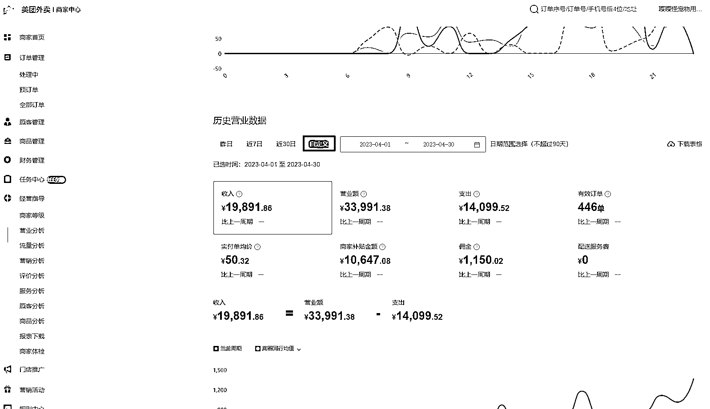

做到后面慢慢增加起来，双十一之前最多的时候冲上了千单。

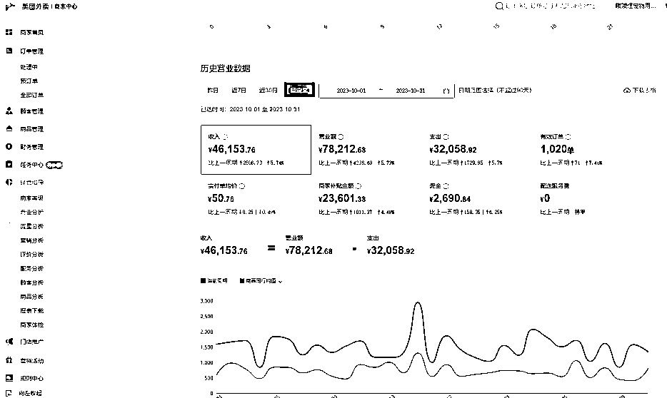

宠物用品行业利润率的话，扣除美团扣点 5%，大概还有 30%到 35%的利润。

# 四、如何找货源？

我的第一批货源当时主要是在 1688 进回来的，因为需要凑很多 SKU，还有很多小的用品和玩具，所以一次性购买齐全是最好的。1688 的小玩具商品可以找一些大一点的店铺。

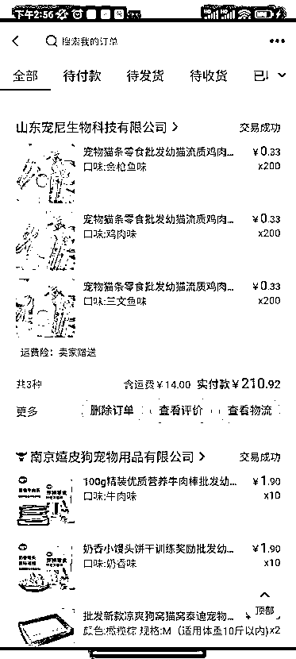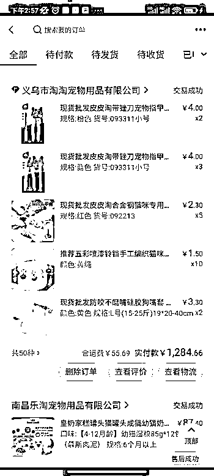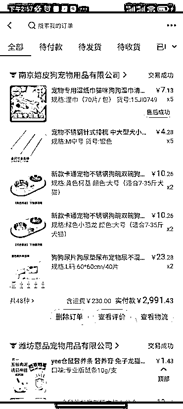

一般回购率超过 20%的店铺品质基本上都不差，买的时候最后付款一定要让店家邮费优惠，有些可能还可以包邮。

然后尽量开一个会员，这样也能有 plus 价格会优惠一点。

宠物主粮的话，一般我是进的主流流量产品，这种产品一般当地都会有代理，直接去对应淘宝旗舰店的后台问，告诉他是宠物用品商，需要进货，一般都会给当地的代理商。

# 五、运营经验和建议

1、前期开店的第一周，主要是要把自己的商品上的美团的后台上，当地美团经理只负责给你下店，里面的装修都需要自己完成。

这个和淘宝店铺基本上差不多，主要是首图要做好，尽量好看一点。

美团可以扫码上商品，这样是最快的，没有码的商品那就只能去截同行的图，或者是自己在多多或者淘宝上搜，用浏览器插件下下来。

什么样的图算好呢，这里不要搞那种花里胡哨的图，图中商品要清晰，然后尽量有产品有点介绍的就最好。类似下图：

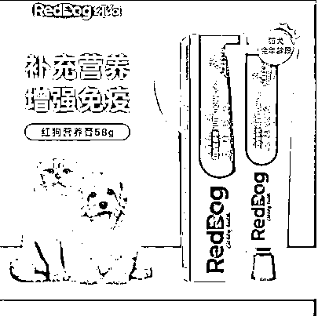

这种图就比较好一点，如果自己扫码上商品，系统默认就是那种白底图，没有多大吸引力。

下方是一个比较好在各平台下载的工具，浏览器里的插件。

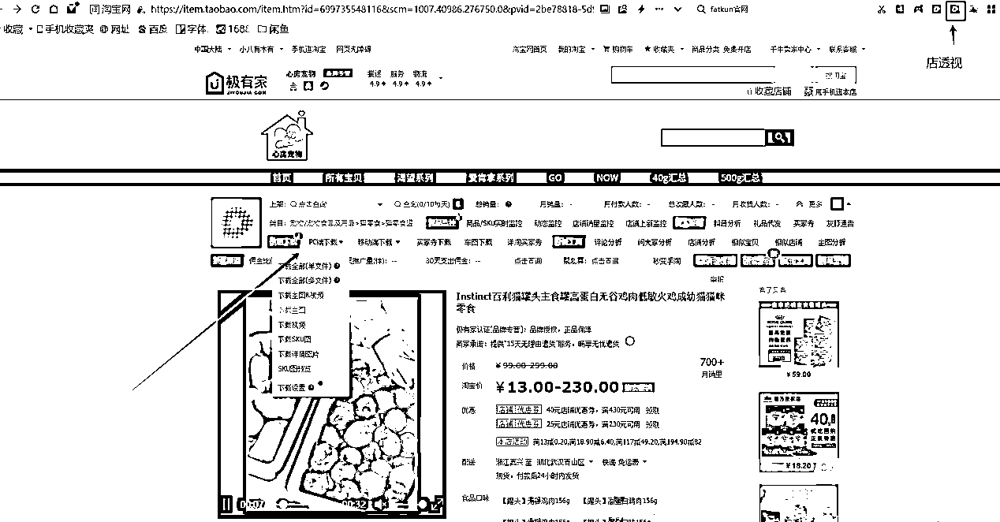

2、标题也和电商一样，尽可能铺满关键字，这样用户在搜索商品的时候才更容易搜索到你。

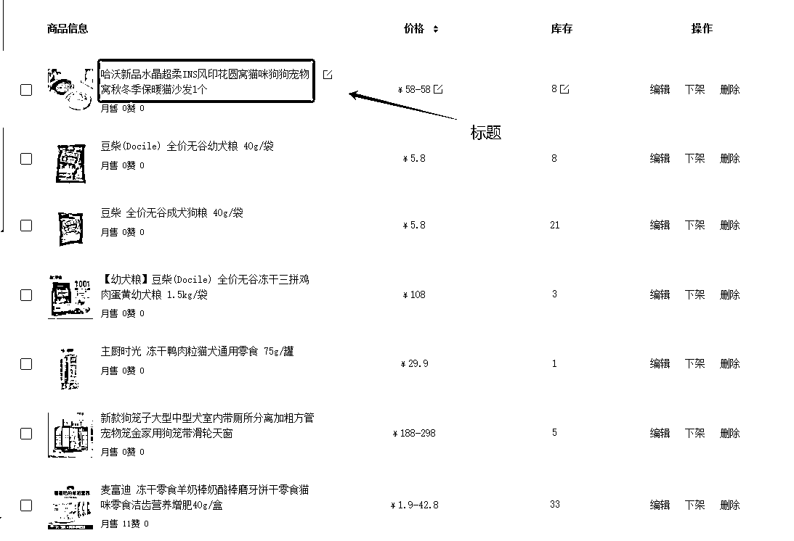

3、定价的话一般会虚高，然后再设置合理的折扣价，比如妮可露这款猫砂，淘宝做活动可能到手 15 左右，但是由于咱们是外卖，配送费需要咱们出，所以价格上需要定高一点，然后再设置折扣。

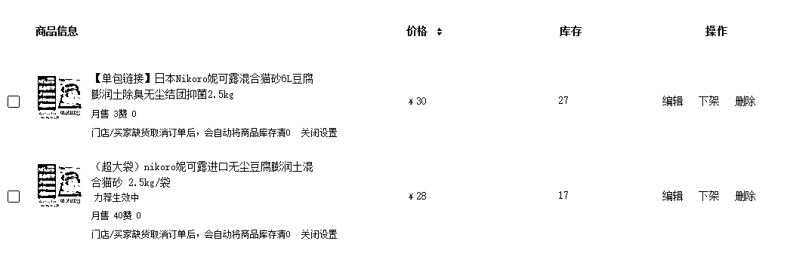

4、店铺开起来以后，前期可能需要刷一点单，把 5 星好评刷出来，然后通过设置爆款商品引流。

爆款该如何设置呢，比如：一般会用需求比较大的产品，例如猫砂。进价如果 6 块钱的话，我卖价定在 21 左右，然后设置两袋起购，第一袋设置 0.01，第二袋原价。

那么相当于顾客是 21 买了两袋，爆品的设置逻辑大概是这样，价格尽量能低，刚好平出也是可以的。

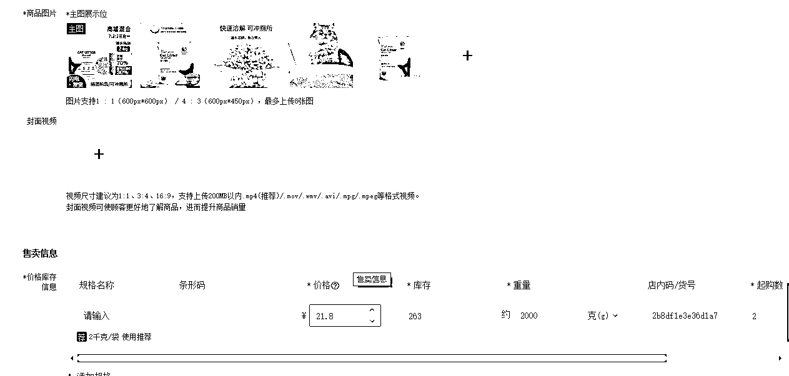

对待每一个新客户，都给送礼品。礼品一般来说几毛到 5 块不等，这里说的是进价。

比如有的顾客买的 20 块的商品，可以送个几毛钱的猫条。比如有些三公里范围内的客户，我一般都会送比较贵一点的东西，这样才能留住顾客让他下一次再到我家下单。

前期哪怕是亏一点都没关系，单量冲的越快，店铺的流量才会越好。

5、一定要注意店铺差评，美团里的一个差评就会让分数下降，从而导致新客户下单会有疑虑，不是太贵的商品我一般能退钱让顾客取消差评就退钱，但是太过分的可以申诉，还是可以申诉通过让差评删除的。

6、运营店铺商品上了 400 个肯定不是不变的，要经常更新商品，比如一款商品有滞销，可以设置折扣卖，但是一般每个月尽量能选 2-3 个畅销商品，我一般是根据同行销量好的，还有后台的一个搜索数据来判断。

另外也可以自己选另类的新品，和同行有却别，价格就可以打上去。比如去年我卖网易严选的猫粮，我发现同行都是卖 1.0 的版本，但是新款 2.0 的版本已经出来了，这时候就得跟上 2.0，我因为这个选品两个月这款粮的月销在二十几袋。

美团就像养孩子一样，要经常去设置里面的活动还有商品，不是商品上上去以后就不管了。

# 六、开店遇到的难点和解决办法

**难点 1：前期开店 SKU 如何录入美团**。

**办法：**

这个是一个非常大的工程量，如果有 400 个品类的话，那通过扫码的方式需要扫 400 次。那怎么才能解决呢？

第一种就是自己把品类一个一个上上去，但是会花费大量时间。

第二种就是加盟的方式，但是市面上加盟的很多，大多都需要花费 3000 到几万费用不等，好处就是可以直接让加盟商搞定后台，你只需要进货打理店铺就好了。

第三种就是找到本身就做这一行的同行，然后通过复制店铺的方式把产品给复制过去，但是这就需要进货也需要和别人店铺的产品一致，并且同行也愿意把自己的店铺 COPY 给你。

但是最终商品上好以后还需要设置折扣还有活动，这里还需要根据当地的消费还有参考其他店铺来设置。

**难点 2：前期店铺单量可能会不稳定**

**办法：**

前期第一个月可以找靠谱的朋友帮忙刷单，每天尽量能有个 5 单左右是刷的，保持每天单量有 10 单以上就可以了。

每周的单量尽量保持在 5 单左右递增，达到 20 单以上后保持稳定就行。当然如果当地外卖风气比较好的话，刷单可能都不需要。

我的店铺也就第一周刷了 5 单好评，后面基本上都没刷过单了，因为刷单还需要注意美团的风控，很容易被抓导致停业一天整顿。

# 七、入局建议

目前的话一线城市有很多店铺了，并且有很多连锁店。

23 线城市还可以入局尝试，想个人创业的话不太建议，目前入局稍微有些晚，但是你可以看看你自己当地如果这种外卖店不是特别多的话，那可以尝试，投资大概在 4 万的样子。

店铺稳定以后可以自己请人守店，营业时间一般是早上 7 点到晚上 1 点。如果前期 4 个月时间单量不能稳定在 20 单以上，那店铺基本上是做不起来的。

我这种相当于是自己亲力亲为，所以一个人的精力有限，只能兼顾一家店铺，多家店铺运营的话，那得专门请一个运营，然后每家店铺都得有一个人或者两个人守店，视店铺盈利情况来定。

以上就是我做宠物用品外卖店铺的分享，希望对大家有所帮助。

* * *

评论区：

行者阿吉 : 您好，请问初期起店只刷单吗？有投广吗？周边 5 公里如果没什么线上外卖店（有的销量也一般），但是线下宠物店比较多的话，能做吗？
刘光毅 : 如果没有宠物店可以看看周边火爆的奶茶店有没有生意，线下和线上是两码事，喜欢线下的一般都不会线上下单。刚开始刷单是必然，不管做什么电商店铺都是最开始需要刷单的，刷多刷少取决于流量了
行者阿吉 : 好的，明白。奶茶店生意很火爆
刘光毅 : 看的是外卖入口奶茶店生意哈，线下线上算是两种不同消费人群的。
行者阿吉 : 明白的。我看的是线上，基本上我小区周边有 10 家左右，品牌奶茶店。线上都还不错
行者阿吉 : 非常感谢您
小律 : 北京，我隔壁前些天就有一家新开的宠物用品仓库，我还想着是怎么运营的呢，今天就刷到了
刘光毅 : 北京那儿卷的厉害，已经开了很多了，北京已经开始做无人仓了，

* * *