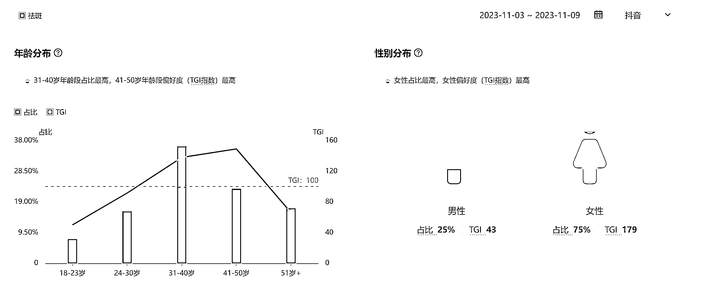
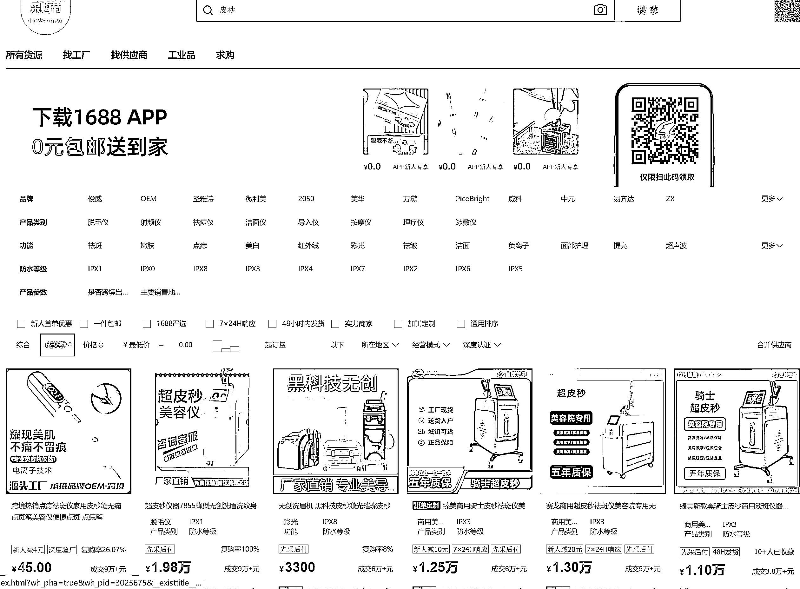
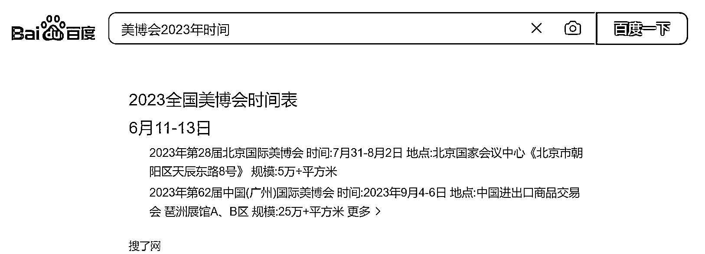
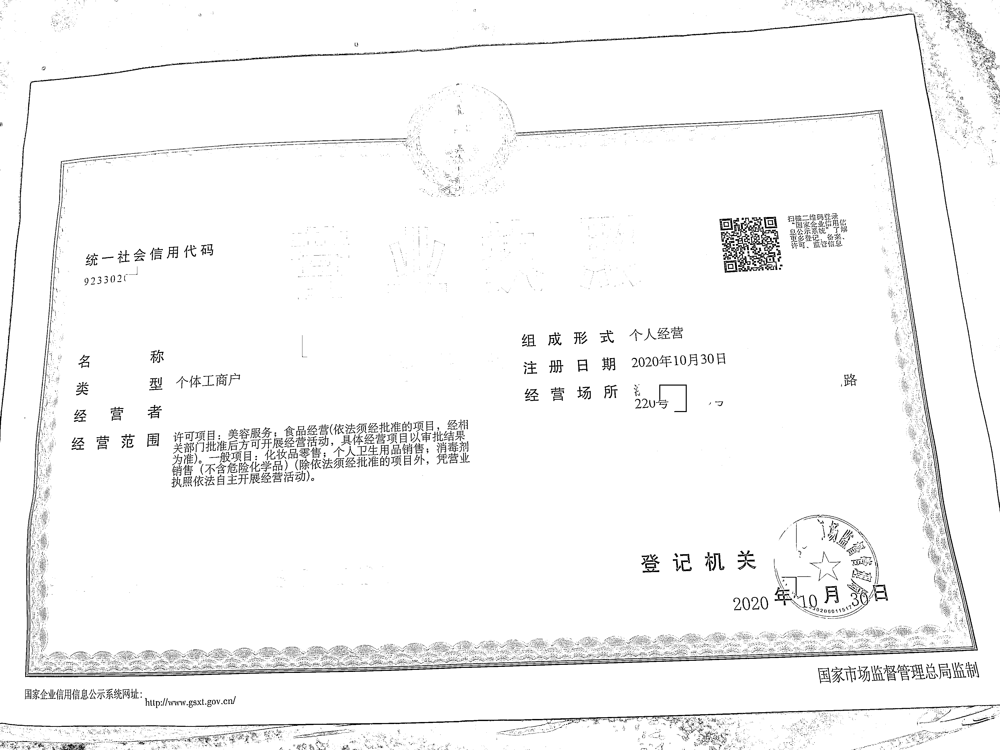
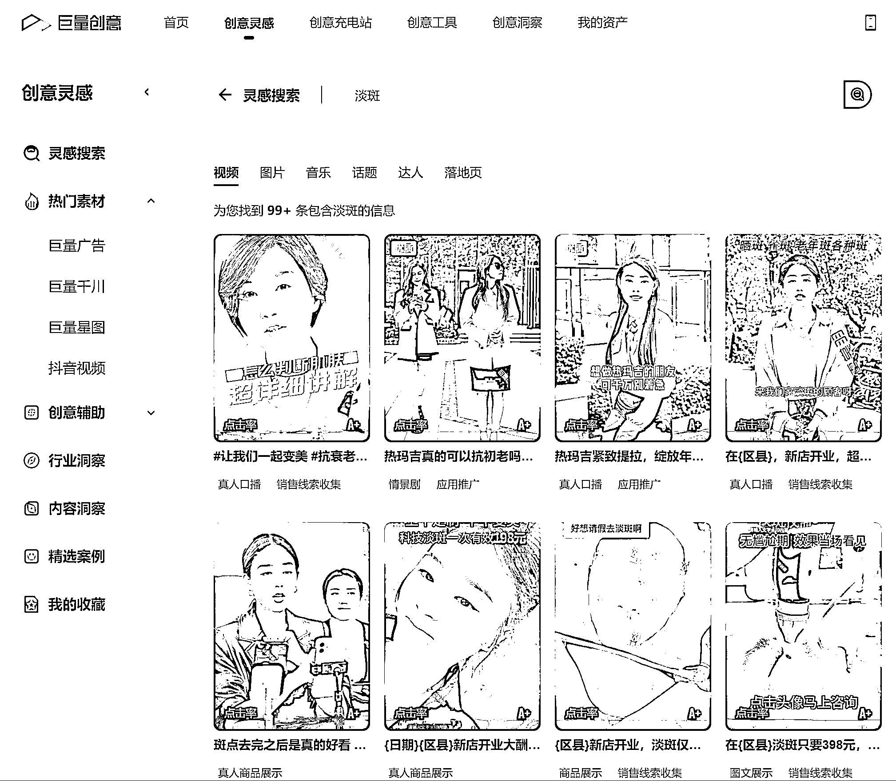

# 投入 50w，3 个月回本，一家祛斑店能赚多少钱？

> 原文：[`www.yuque.com/for_lazy/thfiu8/cil44hww85aqycr4`](https://www.yuque.com/for_lazy/thfiu8/cil44hww85aqycr4)

## (32 赞)投入 50w，3 个月回本，一家祛斑店能赚多少钱？

作者： 乐天

日期：2023-12-28

没有医院技术专业，也没有美容院业务全面，为啥街边的祛斑店，能一家接一家的开？

今天属于是现身说法，聊聊我目前在做的祛斑项目。

我们主要是针对 30+有斑女性，卖祛斑服务（仪器+产品）。客单价比较高，单次服务价格在几千到 1w；治疗周期 6 个月起，客户粘性也强；后续还要色斑修复，也能有持续复购。

高客单、长周期、人脸项目，每一个点都要很重的决策成本。因此，怎么增加户信任感、减少客诉，也是非常重要的环节，需要投入很多的精力与成本。

祛斑店确实能赚钱，我自己单店平均 30W 月营业额，最高做到过 200w+。相应的，投入成本也高，基本 30w-50w。

因此我不推荐新手入局，这个项目更适合有现成美容店，有一定美业基础，需要转型的朋友。接下来我会从项目概况、获客渠道两大方面，来分享这个项目怎么做。

加入生财半年了，经过了一次二手书项目的航海收获特别大。也想着为生财贡献一份力，就把自己熟悉了解的祛斑项目做个复盘，希望对圈友有所收获。

# **一、项目概况**

祛斑店使用仪器+产品祛斑，祛斑后需要配合后续到店做修复类服务。

祛斑后修复疗程周期相对较长，客户基本会超过 6 个月的粘性，修复过程中的产品需要自费购买。客户单次祛斑费用大几千到 1W+，后续也会有持续的产品复购、充值等。

最快 3 个月以内回本，单店平均可以做到过 30W 月营业额，最高 200w+。

但要注意的是，这是一个相对重投入的项目，起步资金往往需要 30～50W 以上，需要大量的人力和广告投入，新手失败率非常高，更适合本身有多家美容店想转型的玩家

**（1）什么样类型的人不适合开这类门店**

**1、想要低成本创业的个体：**这不是一个低成本的项目，而且需要大量的人进行协作，不是 1 个人能搞定的

**2、想要当甩手掌柜的：**不是那种一劳永逸的项目，过程中会遇到各种客诉需要处理

**3、缺少实体运营经验：**需要做人员管理和培训，细化流程和服务

**（2）加盟还是自营品牌**

对于新手来讲，前期流程不熟悉、话术不清楚不熟练、遇到问题自己自己想，光是产品备案这个环节都会耗费你大量的时间和精力。

所以加盟一家做祛斑的品牌是更好的选择，不止提供了全套的产品、流程，还有开店的培训扶持，你熟悉之后，再去自建品牌也来得及。

**（3）店内项目都有哪些？**

这类偏治疗型的服务，和客户之间的绑定是很强的，一旦成交后续销售上不是太大的问题。除了祛斑类的服务，后续的产品还可以销售。

1、日用护肤品：洗面奶、水、乳、面霜、面膜、防晒等

2、功效类套盒：抗衰套盒、蓝铜胜肽

3、合作项目：转介绍到医美机构拿利润分成

项目名称类型定价淡斑体验引流项目 100 元以内，1~3 次祛斑利润项目 3000~1w，根据色斑严重程度收费抗衰后续开发 1000~3000 套盒/周期，能做若干次

前期可以通过淡斑体验，邀约客户到店体验。因为本身成本比较低，很多客户还是愿意去尝试的。

通过在多次接触建立信任后，可以开始转化为正价的祛斑项目。

**1、用户画像**

30 岁以上在意色斑的女性为主，从巨量算数平台也可以看到相关的数据，女性 TGI 指数高达 179。

开一家门店辐射的人群基本可以在直径 5～10km，客户到店做祛斑其实和去医院的心态差不多。并不完全是就近选择，更在意祛斑的效果和价格。

2、**产品怎么找**

**① 通过阿里巴巴搜索“祛斑套盒”，“皮秒”，可以找到相关的产品及仪器。**

通常激光仪器类是需要有相关资质的，小的美容院办不起，很多偷偷的在搞很容易被处罚。

**② 通过线下美博会加盟**

产品不建议自己生产，有起订量要求前期成本非常高，而且备案十分麻烦且漫长，加盟就先用别人牌子

**③ 祛斑店选址**

一般选址会选择人流量较大的商圈店和写字楼店。【这里目前没有特别完善的模型，就不做推荐了】

**（4）客户到店如何提升转化**

这类需客单价高、服务周期长的、人脸上的，都是属于重决策的。

所以从客户看到你的广告到成交之前，都需要不断的建立客户对我们的信任感，可以从客服外呼的环节、微信聊天的环节、到店体验环节流程和话术提升信任感。

**目前比较有效的几种方式：**

**1、店面环境**

门店面积大环境优雅会显得逼格更高，更能要的上价格，1 个 50 平米的写字楼店，是很难转化上万客单的。

**2、名人背书**

店里要准备好相关的物料：明星、网红达人推荐的视频，可以在电视上循环播放。

名人海报、知名专家的合影也可以做成易拉宝或者灯箱，放在随处可见的位置。

甚至可以在到店的环节，让祛斑师主动的给客户做介绍，来增强她对门店的信任感。

**3、客户案例**

由于平台对广告的限制，很多内容你是很难在广告中体现出来的。所以一旦通过活动吸引了客户报名后，就可以不断通过微信，到店的面谈来给客户放案例。

放现身说法。让客户替我们去说服她，用对比照片和对比视频。

例如：“这是张姐 2 个月前在我们家做的雀斑，你看她现在，脸上一点斑都没有了”

**4、专利技术**

什么小分子 XX 技术（前提是有，没有就得靠吹嘘了），X 平米的研发生产基地，每年 X 亿的研发投入，X 位专家化学博士共同研发，国家 XX 发明专利。

**5、品牌优势**

比如 200+连锁门店，深耕行业 10 年专注只做祛斑。

**6、荣誉资质**

1.  上过央视，是 CCTV 推荐的品牌

2.  挂满客户送的锦旗

3.  合作方、机构赠送的奖牌、奖章

**（5）店面装修**

软装部分物料名称采买数量美容床/凳子根据房间数量计算计时器根据床位数对讲机电视机沙发……

**1、办理证照：**

开一家祛斑店是和美容院的资质一样的，需要个体工商营业执照、卫生许可证、3 个健康证。

自己办理会比较省钱，相关攻略可以在抖音、小红书、百度上搜索，一搜一大把：“如何办理个体户营业执照、如何办理卫生许可证、健康证办理”等……

如果你觉得太费事，可以在美团或淘宝上搜“注册公司”找第三方代办，多问几家找个性价比高的。

营业执照的经营范围可以参考下图：

办卫生许可证时通常需要做个甲醛检测，拿到 CMA 认证的证书，美团上也可以搜索到，一定要提前咨询一下是办卫生许可证用，不要买错了。

**（6）员工招聘&培训**

1.  挖人：其他同行，或者美容院挖人

2.  转介绍：同事介绍、朋友介绍

3.  招聘平台：58、BOSS

员工的培训每个品牌不太一样，可以根据你加盟的品牌操作流程来

# 二、如何获客？

**（1）线上平台**

1.  抖音信息流

2.  微信朋友圈

3.  百度搜索

4.  美团

5.  小红书

**（2）线下渠道**

1.  朋友推荐

2.  地推

3.  路过

获客要先通过几十元的淡斑体验来吸引客户，到店后再进行销售转正价祛斑服务。

客户只有到店，才有更多的机会让你去销售，千万不要想着一上来就在电话里成交客户。

这种高客单且需要信任感很强的业务，往往是需要多次和客户的接触和服务，才有可能最终成交。

线上平台通过付费投放广告可以获取客户电话，客服预约的形式预约进店，优先投放的平台是抖音和微信朋友圈，这两个渠道受众广，用户体量大，能够充分覆盖我们的意向人群。而小红书、美团年轻群体偏多。

线上获客需要具备一定的投放能力和短视频能力、数据分析能力，能够持续高效产出起量的短视频，是重中之重。

**（3）广告投放怎么做？**

要想投放广告，就一定要先开户。

广告户可以通过自己注册来开户，也可以通过代理商来开户，两个方式都可以没区别

抖音巨量引擎广告：[`business.oceanengine.com/login?appKey=51`](https://business.oceanengine.com/login?appKey=51)

微信朋友圈广告：[`e.qq.com/resources/wx-moments/`](https://e.qq.com/resources/wx-moments/)

美团商户通：[`zhidao.baidu.com/question/1714036341262449140.html`](https://zhidao.baidu.com/question/1714036341262449140.html)

开户完成后会有官方/官方代理联系你，需要哪些资料对方也会详细跟你说。

你只需要付钱开户，剩下的通常交给代理商来操作。首次充值基本上不会少于 1 万元。像抖音、朋友圈这样的广告账户，是需要有优化师进行操作的，一般代理商都会提供代运营服务，各代理商费用不一，需要自行询问。

你只需要告诉他一些基础客户定向，他们会每天帮你搭建计划，基础定向如下：女性、24 岁以上、门店半径 10km。

线上投放一定要注意平台规则，否则非常容易产生违规，严重的会导致封户，不然好不容易账户跑起来流量了，结果店开着户封了，造成没有必要的成本浪费。

比如抖音常见的违规：要避免涉及容貌焦虑的内容、不能使用受益人证明、前后效果对比等。

**（4）短视频创作**

黄金前三秒、音乐、脚本内容 都很重要。

前三秒不吸引眼球客户很快就划走了，就算你后面再好大部分人不看也没用。

很多人喜欢把视频拍的剧情特别丰富，但产品和服务却说的很少，这在投放时不一定行得通。客户喜欢看但就是不下单、不留电话，最终导致你花了 1W 投广告，结果就赚回来 3000。

其实这和广告是否目的明确有非常大的关系。一定要让客户快速知道你做的是什么，能给他带来什么，为什么要马上买引导他报名，反而更重要。

你也可以参考巨量创意上的视频，进行翻拍（他们咋拍你咋拍）

巨量创意：[`cc.oceanengine.com/inspiration/creative-search`](https://cc.oceanengine.com/inspiration/creative-search)

**效果最好的几类视频**

**1、口播类：**

1 人/多人，口述讲解项目优势，可以有门店环境和项目的镜头搭配画外音。

想做热玛吉的朋友们可千万别着急，我怕你多花冤枉钱……

**2、探店类：**

达人探店，展现全程感受，听说苏州有一家 xx 淡斑店特别火，我今天就替大家看一下，到底是真是假……

**3、流程类：**

直接展现体验流程的部分环节，可以是美容师和顾客的对话

A：姐姐今天第一次来吗？

B：对啊，我在抖音上看到你们家特别火，我就直接过来了

**（5）落地页制作**

落地页就是广告点进去所展现出来的页面。

在这个页面里，需要注意重点活动内容和表单，一定要放在最前面，尽可能让客户快速了解到信息，页面越长能看到最下面的用户越少，整体页面数量控制在 3 屏以内。

表单除了收集客户的姓名和电话外，最好能多附带几个关于色斑的问题。例如：长斑多久、哪个部位的斑点、斑点的颜色等。

目的是为了让客户尽可能的付出一些精力和时间，过滤掉那些随便“点着玩”的，从而提高有效线索的比例，可以抄同行的作业，按照他们的模板仿一个就可以。

**（6）外呼跟进怎么做？**

以抖音为例，所有广告获取的客户联系方式，都会自动进入到飞鱼 CRM 中

飞鱼 CRM 是抖音公司开发的一套客户管理系统，可以用于客服外呼、客户跟进等操作

软件具体操作后台都有教程，基础的部分就不详细说了

**（7）区分客户质量**

所有拨打过电话有意向的客户，一定要标注出来，把精力花在跟踪这类客户的身上才更可能构成成交。

首次沟通的时候，一定要跟客户表明要加他的微信，方便后续联系。

例如：“姐，我这边加你个微信，我发几个案例你看一下”，一般客户口头同意了，通过你好友请求的概率会大大增加，持续外呼接通率是很低的，所以一定要珍惜每次和客户建联的机会，增加沟通的方式。

**（8）归纳客户问题**

所有的客户沟通，飞鱼 CRM 都会保存录音。

我们可以根据录音的内容，把客户问到的问题都记录下来，频次越高的问题，越值得我们去研究话术。

你可以在抖音搜索“淡斑、祛斑”关键词，随便看几个视频，然后返回就行，再刷视频的时候，你可能就会浏览到带广告字样的短视频，可以趁机报个名等同行打你电话，把他的回答记录下来。

咱们可以在他话术基础上进行“优化”，而不是从头造轮子，就会更高效。

**写在最后**

要做好这个项目，其实是非常不容易的，人力成本非常的重，而且祛斑属于偏医疗。

由于是治疗性质的，不可能 100%去掉，要尽量避免客诉，大事化小小事化了。也会偶尔遭遇到职业举报人，在宣传物料上尽量避免绝对化用语：“最好、顶级、治疗”等。

产品本身不是最重要的，目前市面上常见的祛斑手段，比如光电、中药膜、点斑水灯效果都还可以，经过这几年行业的发展，后续控色的产品也非常成熟了。

整个项目难点在于如何获取客户信任提升转化和选址上，转化率高成交成本才会低，利润才会更高。

而源源不断的利润，才能支撑起你持续的进行付费投放，选址本身是所有实体店的重中之重，决定了你可以做到的天花板以及获客成本。

分享内容可能有遗漏的地方，如果疑问可以互相交流。

* * *

评论区：

战劲 : 超皮秒仪器操作需要执证医师才能操作吧？没有资质是违法的啊
乐天 : 这个行业违规普遍严重，光电手段慎用
蚂蚁快跑 : 获客容易点话，盈利还是可以的
闫君 : 首先这是一个非常好的项目，我朋友靠这个赚到两波钱，第一是抖店卖这类“化妆品”的钱，第二是招商的钱。但是，一直无法解决的是，引流获客的问题，关于平台投广告，管制时严时宽。关于短视频一直是管控的。另外这个祛斑的 C 端客户是全国的，不止同城。
谭谭 : 祛斑的产品，反弹比较大，做好后续服务比较重要
兰心 : 祛斑祛痘减肥一直有市场

* * *