# 适合新手的副业项目“电子手工”--百家号搜索话题项目

> 原文：[`www.yuque.com/for_lazy/thfiu8/npdwcodl2y9evnqp`](https://www.yuque.com/for_lazy/thfiu8/npdwcodl2y9evnqp)

## (64 赞)适合新手的副业项目“电子手工”--百家号搜索话题项目

作者： Alan

日期：2023-12-28

大家好，我是 Alan，距离我上次分享项目已经两年多了！这段时间重新鞭策自己分享，所以就有了今天的内容。

今天分享的是今年百度比较主推的一个项目，但目前了解的人还不多，现在属于红利期的项目。

这个项目优缺点很明显，**优点**是收入稳步提升，每天都能看到正反馈。**缺点**是收入增长慢慢递进，没有爆发式增长的那种惊喜，上限也不算高，并且创造性一般，有点像做手工慢慢赚钱的即视感，我自己把这个项目叫做“电子手工”。

目前公开数据中，单单“搜索话题”的收益上限是 3 万多，按照这几个月的情况来看，个人操作的单账号上限基本就在这里了，要突破上限应该要团队多账号的玩法才可以。

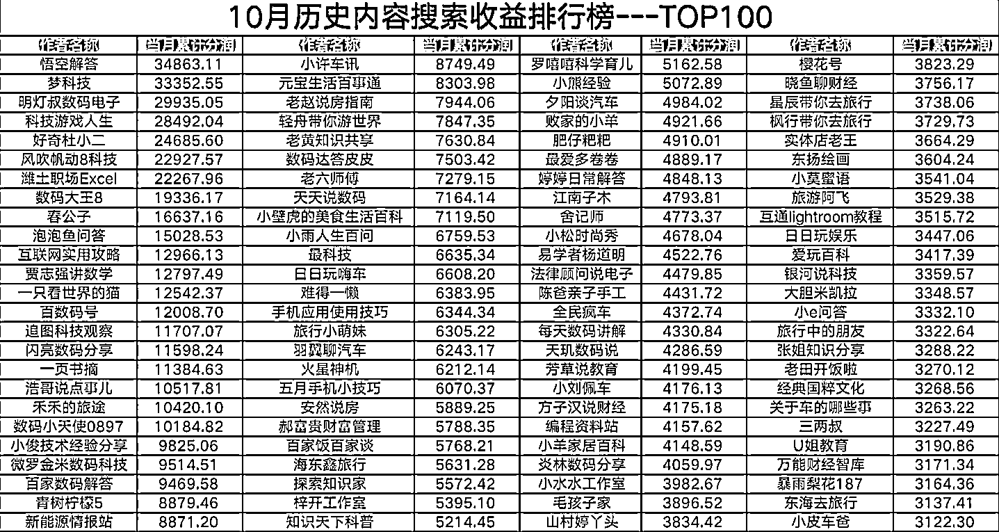

事实上上面的收入只是百家号“搜索话题”项目的收入，百家号的变现方法现在挺多的，加上其他的收入的话也还是可观的。

我为了摸清楚整个项目的玩法以便教朋友入手，自己下场玩了两个月，没有当成主项目在做的，**每天花费 2 小时**左右，**上个月的总收入是 6840**，其中**“搜索话题”项目只是 1500 元左右**而已，其他是顺便参加一起其他活动变现的钱。

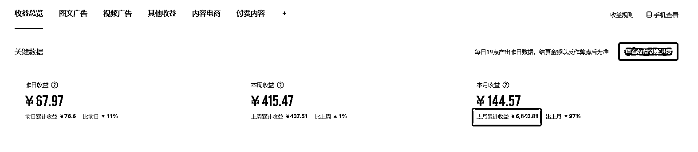

**从我历史的收益情况可以看到，10 月 1 号的的每天收入是 3.77 元，到 11 月 30 号的每天收到增涨到 60 元左右！**

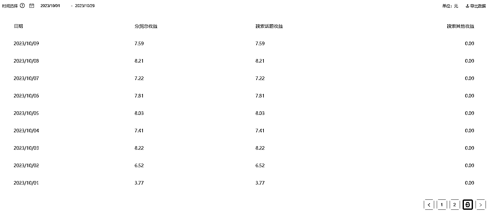

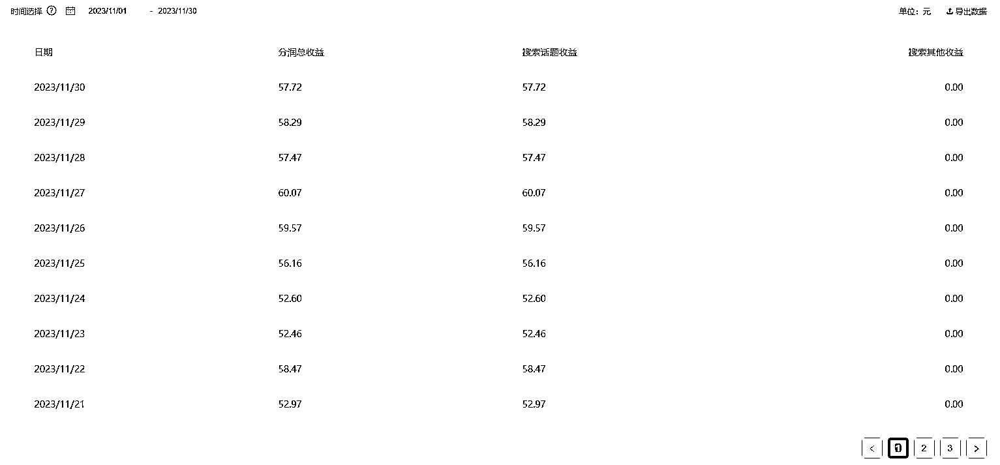

废话说的有点多，下面开始分享整个项目的玩法：

# 什么是“搜索话题”项目？

搜索话题项目是百度旗下的百家号今年主推的项目，百度做这个项目主要是想把搜索引擎的内容更多的导向自己平台。方法主要就是利用大火的 AIGC 生产内容，通过百度自家一整套的 AI 工具完成内容**生产-分发-收入**的闭环。

通过百度**“文心一言 AI”+“百家号内置文字成片”**工具生产内容，通过**百家号平台**发布内容进行分发，最后只要有**网友搜索相关关键词并浏览你的内容**就能形成收益！

  

# **哪些人适合做“搜索话题”项目？**

这个项目最适合刚开始做副业的新手入门，可以说无需任何技巧，操作难度低，收入每天的增长可见，有正反馈激励自己持续做下去。

其次也非常适合擅长做教程视频的人群，因为很多内容都是非常简单的内容，别人通过 AI 生成的视频质量肯定不如专门制作的视频，而更高质量的视频意味着平台会给你更高的权重和更高倍数的收益！

但做这个项目有一个前提，那就是必须有电脑，并且每天至少要有 2 个小时的时间做！在前期需要靠量来让收入增长让自己获得正反馈，后期在通过质量让收入的提升更快速！

# “搜索话题”具体实操步骤：

**1.**注册百家号帐号，注册帐号大家都会，这里就不啰嗦了！

**2.**添加“百家号搜索话题小助手”微信，新号需要通过发送自己的“百家号 ID”给小助手才能开通搜索话题功能！具体格式如下：“辛苦下小助手，我要申请开通搜索话题，这是我的百家号 ID：（输入你的百家号 ID）”。

**3.**在百家号手首页的侧边菜单找到“搜索话题”进入即可。

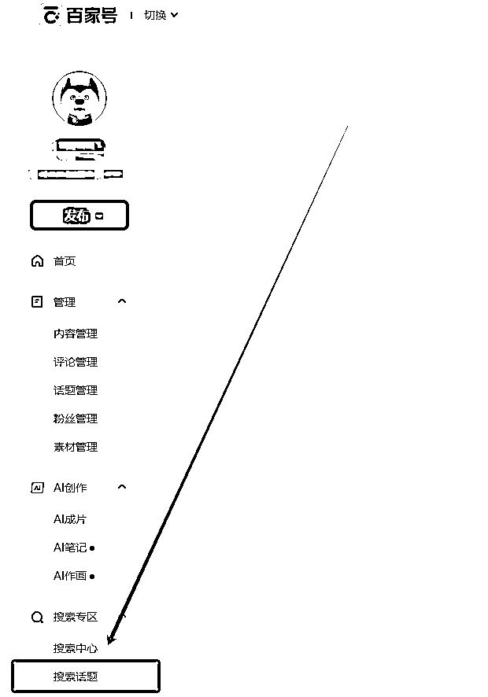

**4.**进入之后就能看到很多“灵感词”，鼠标移动到“抢占”上面后就会出现“发布图文”和“发布视频”两个选项。目前比较推荐发布视频的选项，原因有两个：①视频的流量比图文的流量高。②因为我们主要是通过 AI 进行辅助创作，图文创作会很容易出现相似性，而视频不会容易出现这个问题。

但也并不是不能选择“发布图文”的选项，如果刚好有找到你擅长的灵感词，你自己可以输出一篇比较好的图文的话，也是可以使用图文进行创作的。

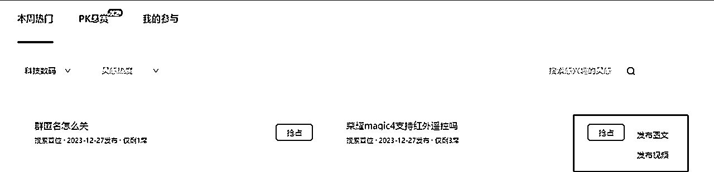

**5.**抢占到的灵感词我们能在“我的参与”界面找到，此时点击“去创作”就可以进行创作了。如果我们选择视频的话就需要上传视频，如果我们选择图文的话就需要输入图文进行创作。

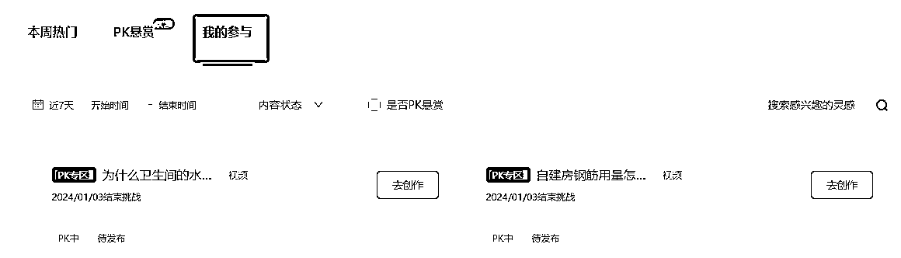

# 如何利用免费的 AICG 为我们生成内容？

AI 辅助工具我们可以直接用百度自家的【文心一言】和【AI 成片】两个功能就好，都是免费！

## 文心一言：[`yiyan.baidu.com/`](https://yiyan.baidu.com)

这个是百度开发的大语言模型，对标 chatGPT，虽然没有 chatGPT 那么强大，但胜在不用魔法就能使用，并且免费版的内容时效性比 chatGPT3.5 很多，这对于一些有近期时效性的灵感词会更有帮助，当然如果你用习惯 chatGPT 也是可以的。

文心一言的使用很简单，直接用你百家号的帐号登录即可，把你抢占到的“灵感词”直接发给它，它就能给出你答案。这里不建议对文心一言进行调教，它的调教难度比 chatGPT 大很多，比较费时间。它生成的内容后面我们可以在后续【AI 成片】功能再度完善。

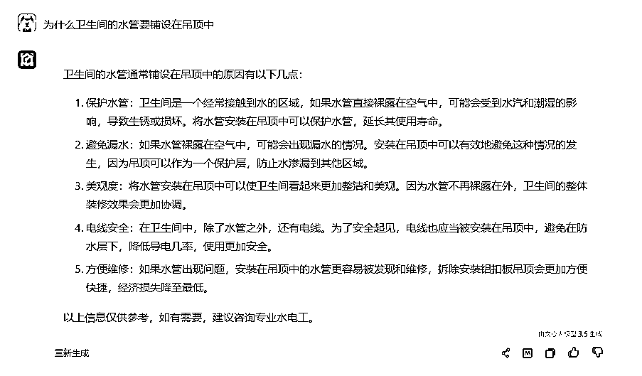

## 【AI 成片】

AI 成片是百家号内置的一个功能，在百家号的首页侧边菜单就能直接找到。

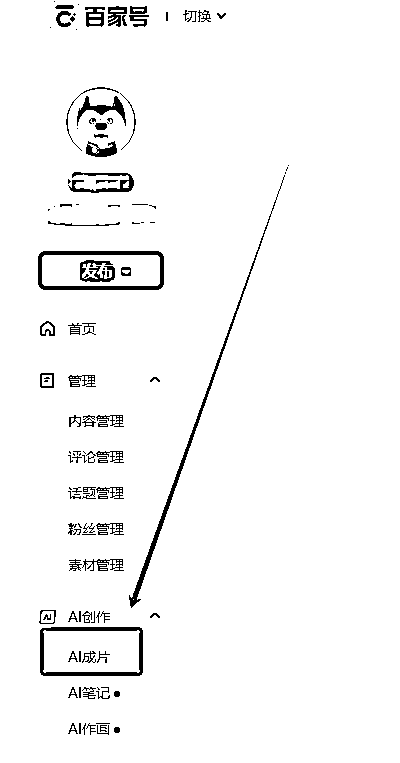

然后我们只要把在文心一言获得的回答，直接复制到【AI 成片】界面的文本框里，然后在点击右下角的“一键成片”就能生成视频了。

但有时候文心一言的回答内容会显得过于生硬，不够口语化，可以在“一键成片”之前点击右下角的“AI 润色”，它能把你的文案进行润色更加口语话，也更加符合视频的文案。

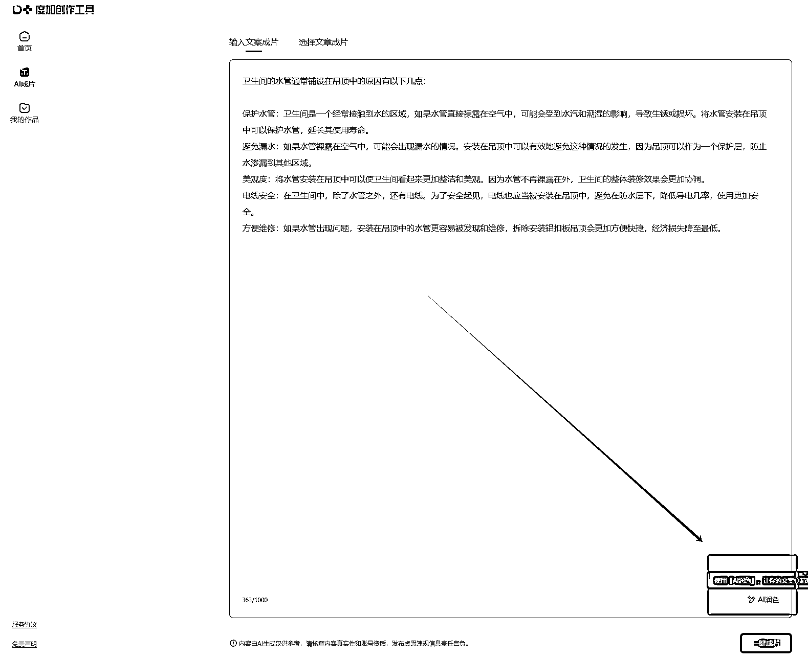

**重点注意：**在生成视频的界面里，可以直接点击右上角的“发布视频”，然后选择“生成视频”就可以，切记不要选择“发布到百家号”，**因为直接发布到百家号是没有关联搜索话题的灵感词的，相当于简单的发了一个百家号的视频而已，不会获得搜索收益！**

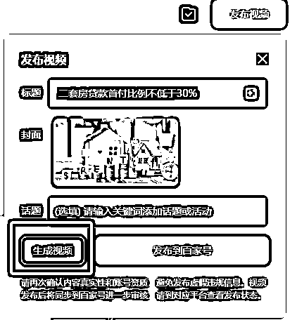

不过有时候生成的视频内容会出现素材跟内容不符的情况，可以简单的检查一下，可以在素材库对一些不符的视频片段进行替换，然后再生成视频！

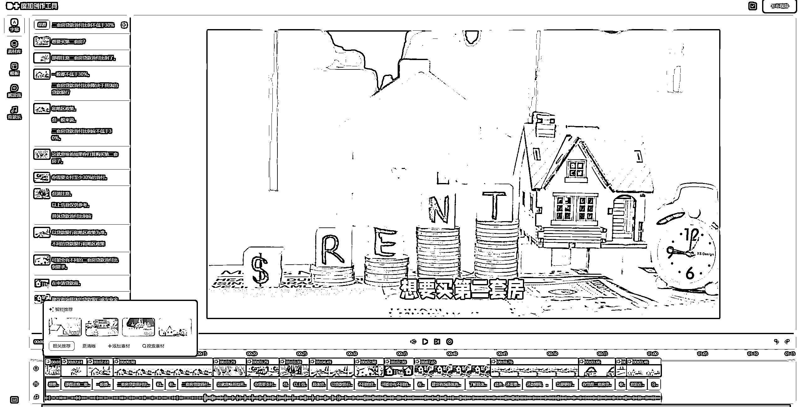

视频生成之后右下角会提示，然后我们直接点击“立即发布”，就会跳出一个新的界面，此时在这个界面不要直接发布内容，还是一样的原因，**此时没有关联搜索话题的灵感词的，相当于简单的发了一个百家号的视频而已，不会获得搜索收益！**

此时这个视频就会存储在草稿里，这时候我们在回到搜索话题的“我的参与”界面，选择对应的灵感词后面的“去创作”，然后选择草稿里的这个视频再进行发布就可以。

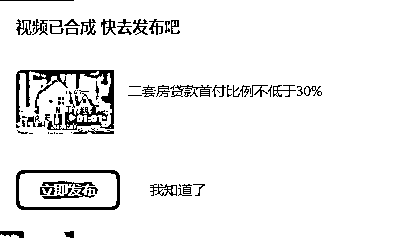

以上操作步骤可能看起来有点复杂，但实际上自己实操一遍就熟悉了，没有任何难度的。

# “搜索话题”项目怎么做收益高？

想要了解怎么做的收益高，首先要了解‘搜索话题’里面不同类目，以及不同类目能给我们带来的收益差异。

## 不同的领域热度不一样

从上面的收益排行榜能很明显的看到，基本上都是收入靠前的都是“科技数码领域”为主，其次就是“旅游领域”和“育儿领域”，可见这些领域相对比较容易获得高收入。

但同时，由于这些领域竞争比较激烈，所以每天需要更多时间关注“灵感词”，否则很可能一下子就被人抢占完了，没有“灵感词”可以做。

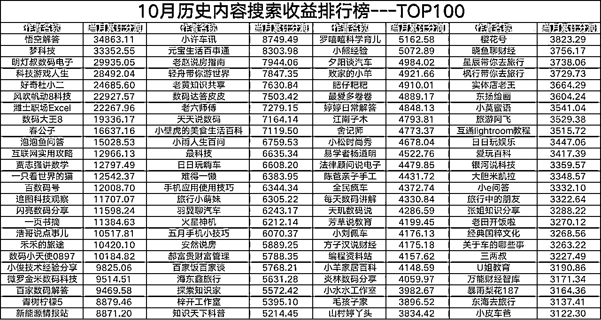

## 不同灵感词的区别

首先，在‘搜索话题’界面有两个选项可以选，【本周热门】和【PK 悬赏】。

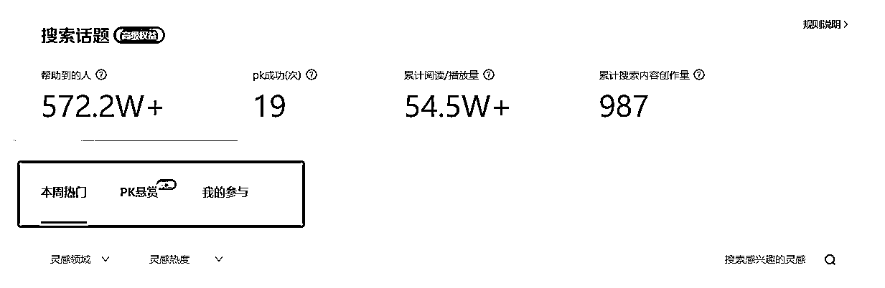

【本周热门】下的灵感话题只要看到就是可以抢占的，一般每个灵感词会可以让 20 个人抢占，只要你看到内容适合你就可以抢占，如果你的内容做的好的话可以在网友的搜索首位就能展示。

【PK 悬赏】下的灵感话题是针对已经有人创作的内容进行 PK,一般每个灵感词可以有 5 个人进行 PK，PK 胜出者可以享受多倍收益（不同话题和不同权限可获得的收益倍率不同，最高可获得 18 倍的收益），即便没有胜出也能享受正常的搜索收益，所以建议有 PK 话题的时候优先抢占并创作。

这两项的官方说明如下可以参考：

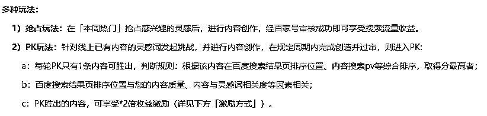

## 灵感词的角标是什么意思？

实际操作后，可以看到一些灵感词下面会有不同的角标，常见的包括[搜索超热][搜索高热][搜索首位]。而在【PK 悬赏】话题下还能看到[N 倍收益]的角标，显示结果如下所示：

不同角标代表的含义如下，**建议这些话题的抢占优先级为【PK 悬赏】>[搜索超热]>[搜索高热]>[搜索首位]>[普通话题]，按照这个顺序创作才能尽快拿到最高的收益！**

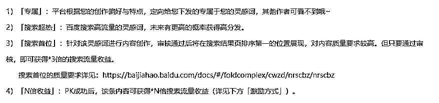

## 不同创作者等级的的收益权重不一样

百家号总共有 3 个搜索身份等级，分别是【基础权益】【进阶权益】【高级权益】，其中【高级权益】能享受到最高，“多倍收益”的权益和“搜索流量扶持”权益尤其有用，能让我们做一样的内容收获更多的收入。

我们刚注册的帐号就都是【基础权益】，要获得两个其他权益并不难，只要你有坚持做这个项目，“月搜索话题审核通过率≥100”的条件是很容易达到的，直接在第二个月就能获得【高级权益】，【高级权益】反而没有粉丝量的要求，其实比【进阶权益】还好获得，【进阶权益】的粉丝要求当然也可以通过操作获得，但多多少少还要一点费用不值当！

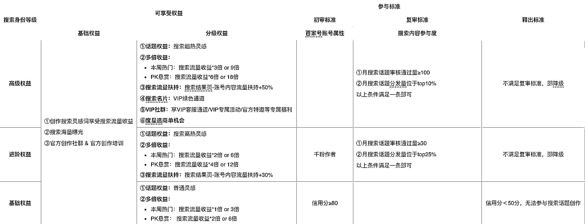

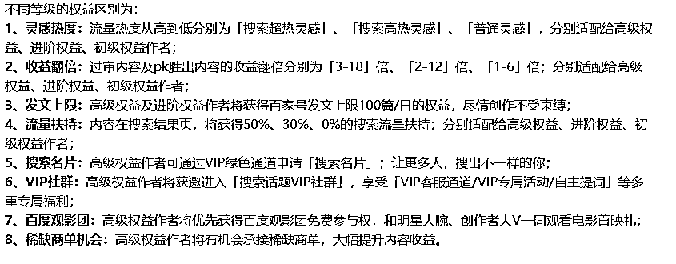

# 结尾

这篇文章本来在月初 12 月 4 号，就开篇写了绝大部分内容，差了一点内容就因为拖延症到现在才补充完整！不过在这期间“搜索话题”这个项目刚好有一些地震级别的变化。

这段时间百家号官方展开了一大波封号流，很多每天收益上百的也在封号其中，但封号问题还简单，小道有办法解决，也帮不少身边朋友解决了封号的问题。但是帐号解封后收入会下降很多，需要比较长的时间才能慢慢恢复。

另外还有一些日收益近千的大佬，他们没有被封号，但是出现收入腰斩甚至脚斩的情况，这里分析过后是有多个原因造成了，但其中很大的一部分原因是百家号开打打击一些大号，避免一些大号抢占太多的收益，想让更多的新人获得更多的收益，同时也降低他们的成本。

所以在这点上目前是稍微利好新人入场的，建议大家直接用新号做，老号不一定有新号好。

这次的分享到此结束，如果大家有什么不懂的欢迎提问，非常乐意帮大家解答！希望大家生财有术！

* * *

评论区：

笑和尚 : 圈友好，请问步骤里面的第二个百家号搜索话题小助手的微信是什么呢，信用分大于 80，但是搜索话题目前无权限，百家号和公众号都没搜索到微信
Alan : 百家号搜索话题官方小助手是这个，BaiduCwzd
笑和尚 : 谢谢
辉哥 : 正常内容的话，为什么会被封号呢。
越努力越幸运 : 进去之后没有灵感词可以抢占呢
老七 : 感谢分享，请问这类项目的项目周期大概是多久。之前做过知乎好物项目，20 年入场，23 年就开始不行了，圈友们，那么这个项目猜测项目周期大概多久呢？
无所适从 : 感觉这个就是百度答主的升级版[微笑]
谭谭 : 做了几个月，现在好难做，价格也少

* * *