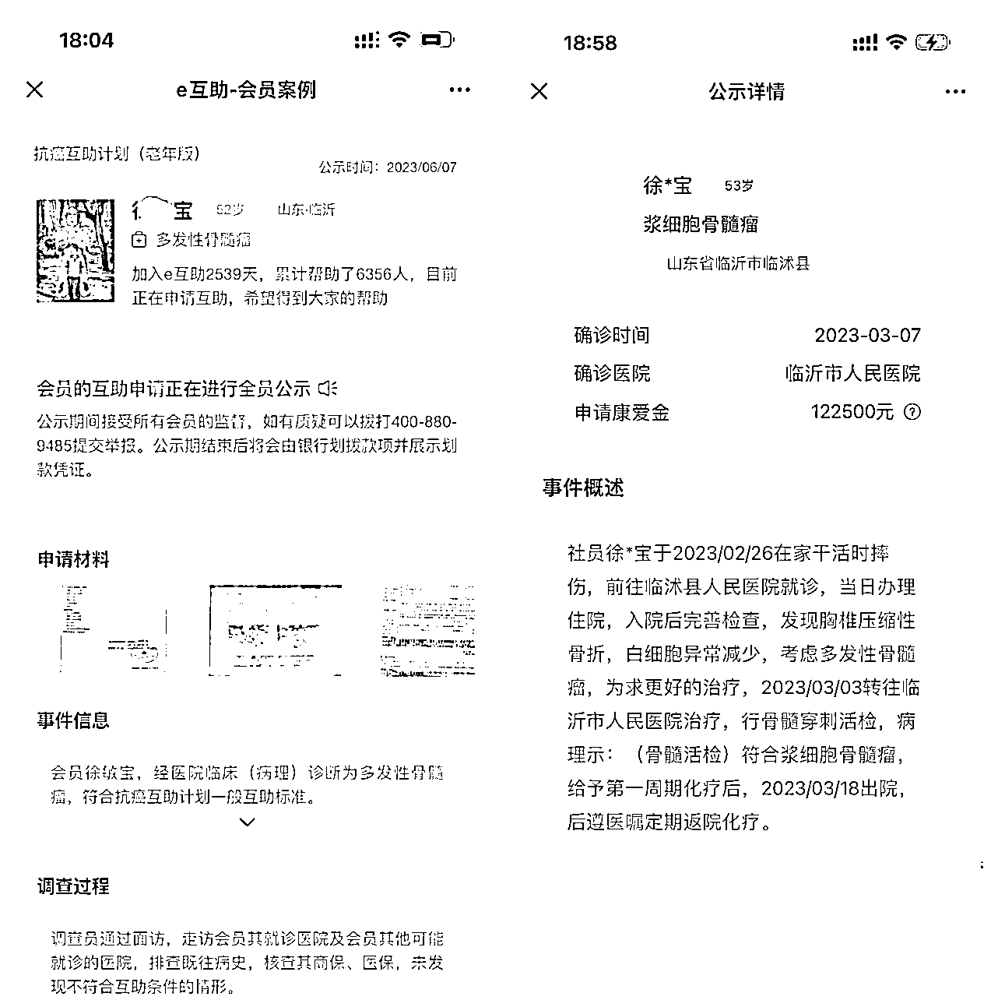

# 人生第 1 次重疾赔付 25 万元，不是保险公司赔的~这你能信？

> 原文：[`www.yuque.com/for_lazy/thfiu8/gkudy32tic0go9a0`](https://www.yuque.com/for_lazy/thfiu8/gkudy32tic0go9a0)

## (61 赞)人生第 1 次重疾赔付 25 万元，不是保险公司赔的~这你能信？

作者： 徐启伟

日期：2023-12-29

[爱心]【纯干货分享】人生第 1 次重疾赔付 25 万元，不是保险公司赔的~这你能信？
大家好，我是徐启伟，来自山东，在上海工作，现在是一名互联网 AI 产品经理。在美团、360 互联网大厂工作过 8 年；做过理财、360 互助保险、营销中台、AI 产品经理。
随着 2023 年迅速接近尾声，我觉得有必要记录下这件亲身经历的事。虽然它发生在我的生命中，但我坚信，所有读到这篇文章的人都能从中受益。看懂这篇文章，那它的价值可能超过数 10 万；
此文章不卖保险，我也不卖保险产品；因为做过 360 互助的产品经理，因此对保险比较了解，有一些观有点暗黑，但你有必要知道；文章主要定位是给普通人看的，如果你年收入过百万，可能我的一些经验会不适用。

内容比较多，为了更好阅读体验，请移步个人飞书文档：

[`xuqiwei1986.feishu.cn/wiki/ZtUVwNcRbin0GDkmZrGc4jDKn5d`](https://xuqiwei1986.feishu.cn/wiki/ZtUVwNcRbin0GDkmZrGc4jDKn5d)

* * *

评论区：

老张 : 感谢分享[抱拳]受用
徐启伟 : 要得罪一批做保险的圈友了，不知贴子能坚持几小时[偷笑]
珊珊来迟 : 哎买了好多保险都不是消费型的[撇嘴]
徐启伟 : 当成强制储蓄也挺好，不然也被花掉了，退休了能有一笔钱返回来或者留给子女
保险经纪人@潘潘 : 作为保险经纪人，以保障为目的，也比较推荐消费型重疾险（我自己配置的也是这种产品）。
奈何客户也有自己的选择，基本上选择储蓄型重疾险的朋友考虑的理由有两点：
1.一辈子平平安安的没有生病，身故赔保额，这笔钱就留给子女了。或者等自己年纪大了，直接退保，获取一笔养老金。
2.纯消费型重疾险不带身故责任，如果有些疾病发病急，来不及确诊达到理赔条件，人就没了，此时重疾险是无法赔付的。此缺点的解决方案是，买纯消费型重疾险+定期寿险，性价比最高。

另，着重提醒，如果是从互联网平台自己购买医疗险或者重疾险，一定对健康告知保持高度严谨。体检报告，门诊住院记录等等，还有社保卡外借的情况，都需要考虑到。
詹伟平 : 说得很良心了，普通人医保不用说了，其次商业保险这块的百万医疗、重疾险、意外险配上差不多了
阿鸿 : 只能说买储蓄型保险的时候是因为钱。骂的时候，也是因为钱。
罗利 : 徐总，问下先心病的婴儿除了新农合，还可以买什么保险呢？

* * *