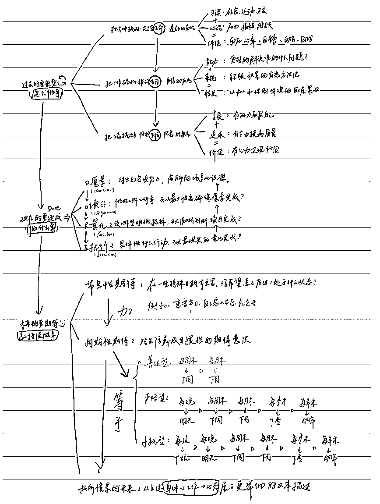

# 我的人生系统方法论

> 原文：[`www.yuque.com/for_lazy/thfiu8/rgi834rm1rpdx62h`](https://www.yuque.com/for_lazy/thfiu8/rgi834rm1rpdx62h)

## (53 赞)我的人生系统方法论

作者： 桃都督

日期：2023-12-25

大家好，我是桃都督，98 年第 3 年年入百万的生财萌新。

我想用一串数字让大家记住我：
1998 年出生、8 岁接触互联网 11 岁开始运营、年入百万的即将第 4 年、朋友圈复盘 7 年+、读过 700+本书、看过 1100+电影、豆瓣 Top250 通关…我是一个典型靠后天努力+复盘迭代成长的人，值得普通人复刻的经验有太多。

这是我在生财有术写的第一篇文章，我有很多想分享的关于“术”的东西，但第一篇我想写一写关于“道”的层面，我一路走来的底层逻辑。用 1.3 万字，全盘分享我的人生系统方法论。

我希望不管你现在处于人生的高峰还是低谷，都希望这套曙光系统可以帮你梳理面对的问题，解决遇到的困难，找到生活的乐趣。
在闪耀的时候，请记得抓住并珍惜当前的光芒。
在低谷的时候，请相信黎明前的第一缕阳光已经来了，并且会越来越光明。

所以我给这套人生系统取名“曙光系统 1.0”，我会不断迭代它，希望可以给大家带来一点点收获。

《曙光系统 1.0》 密码：aehl[`www.yuque.com/taobingzheng/butaoxue/pku02a8pkfgkope9?singleDoc#`](https://www.yuque.com/taobingzheng/butaoxue/pku02a8pkfgkope9?singleDoc#)

* * *

评论区：

梵野 : 哈哈哈 必须得留着睡前看 还的是你
田新一 : 收藏慢慢看，还得是你
周彦充 : 没看到怎么赚 100 万的，[呲牙]
桃都督 : 哈哈哈，这篇是写道层面的，以后慢慢更新术层面的~
桃都督 : 田总好[呲牙]
桃都督 : 梵野姐又看到你啦～
梵野 : 哈哈哈我给叨叨说下次我们组小局，必须叫你，喜欢听你讲，哈哈哈
周彦充 : 哈哈，可以更新下具体项目产品层面的[呲牙]

* * *