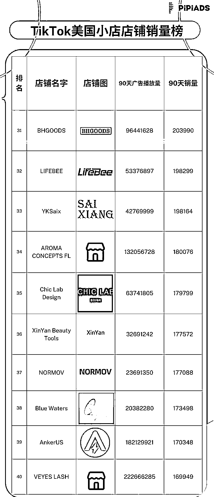

# 2023TikTok 广告年度榜单

> 原文：[`www.yuque.com/for_lazy/thfiu8/iglrutk47kr1t1qc`](https://www.yuque.com/for_lazy/thfiu8/iglrutk47kr1t1qc)

## (18 赞)2023TikTok 广告年度榜单

作者： 阳光杉木

日期：2023-12-25

2023 年接近尾声，TikTok 已成为众多国内外品牌的重要营销战场。通过 Pipiads 数据平台分析，我们可以洞察不同赛道广告主的投放数据销量情况，运营思路等。

接下来，皮皮带领大家一起观察 2023 年 TikTok 广告相关数据榜单                          

# **01 广告受众排名：**

**美国用户群体**

TikTok 的**用户群体主要是年轻一代，尤其是 Z 世代和千禧一代。**

平台因其独特的短视频内容而受到年轻用户的喜爱，这些内容通常是娱乐性的、有教育意义的或是关于自我表达的。

TikTok 的主要市场集中于欧美和东南亚等地区，**广告受众排名前三分别是 美国、印尼、巴西。**而最近印尼市场的一些波动，平台最近与当地电子商务平台 Tokopedia 合作，投资了 15 亿美元后持续去布局未来。

而**巴西市场的受众下**隐藏着的是一个**具有很强爆发力和潜力的电商环境**，但高昂的入关税以及对应的电商基建设施等相关问题，大多数商家观望但很难入场 当**下的主要发力市场依旧是美国**，尤其 TikTok Shop 的爆发增长 为更多的出海企业主增加了新的机会 同时也面临着更多的挑战。

# **02 TikTok 美区平均 CPA**

通过大量的数据提取，目前**美区平均 CPA 是$25 一单**

2024 年选品可以参考客单价能覆盖广告成本的产品，pipiads 调研后发现大多广告主**产品的选品定价区间是$35 往上。**

# **03 2023 年 11 月投放网站榜单数据**

目前**大消耗的广告主品牌站偏多，也有精品爆品站杀出重围。**

吃到 TikTok 流量红利的品牌每年都会预留大量的预算，通过 tiktok 进行品宣和品牌曝光。

就拿**hismileteeth**这个广告主来看

**2021 年开始投放 累计广告展现 8.9B 累计投放天数 738 天**

这是一家非常典型的营销出圈广告主，并且它的产品生产成本非常低，口腔健康赛道有明显的市场需求，这是品牌营销端可以持续发力的原因之一。

# **04 2023 年独立站单款广告爆品的部分数据**

tiktok 爆品产生最多的类目主要有 **服装类目  定制类目**，目前这两个大类目无论小卖 垂直站 又或者大品牌站 都有通过 tiktok 拿到大量的订单金额。

**2024 年独立站玩家对于定制类赛道可以继续关注和研究**，依旧充满机会 对此 **etsy 是一个很好的选品渠道**，大多数的定制爆品 etsy 上同样可以看到它们的身影。

TikTok 投放玩家去**[etsyshop.ai](http://etsyshop.ai)**上面进行**同类型差异化选品迭代。**

# **05 2023 年 11 月投放 CPA 偏高类目数据参考：**

需注意，**投放建议选受众群体广泛类目进行投放和迭代 小众产品及需求量不足赛道，投放效果普遍会差一些导致很难打正，**市场随时间发展会有变化，大家可以**关注 pipiads 获取行业趋势和风口。**

# **06 小店销量榜**

**小店广告排名 1-10 商品**

1.  **高销量类别：女装、美容、个人护理产品在销量上占主导地位**，例如 Unbrush 解结梳和 Cocomint 提取油。这表明个人美容产品在市场上有强烈的存在感和需求，大量建联达人和结合投放，拿到显著结果。

2.  **社交参与度与销量：**如 Unbrush 解结梳的**播放量超过 545 亿次，点赞数达到 1500 万次，与高销量数有着正相关**，表明社交参与度是推动 TikTok 销量的强大驱动力。

3.  **广告投资回报：**在广告花费上看到显著的投资回报，如 Unbrush 解结梳在广告上的花费超过 740 万美元，与列表上最高销量相关。

4.  **消费者评级与反馈：**评分较高的产品往往销量更好，如大多数畅销产品保持超过 4.5 的评分。评论和评分作为社交证明，影响购买决策。

5.  **产品描述与店铺表现：**详细且信息丰富的产品描述，如 Unbrush 解结梳和 The Shadow Work Journal，似乎对销量有积极影响。与自我提升、美容和个人护理相关的关键词的存在可能提高产品的可发现性和吸引力。

6.  **新兴趋势：**列表显示出新兴趋势，如对 Cocomint 提取油和 15 天清理产品的需求上升，反映了市场对健康和福祉趋势的更广泛关注。

**小店广告排名 11-20 商品**

排名第 11 到第 20 的商品涵盖了多种类别，包括美**容个护、女装穿搭、运动健身、家用电器和节日礼品百花齐放。**

 例如**排名第 11 的商品是一款多功能美容仪**，**播放量达到了 93.9M，销量为 197951** 这款产品我多次看到**独立站广告商投放的身影，如今小店继续投放测试取得结果。**

每一个类目赛道下都有爆款脱颖而出，2024 年拭目以待。

**小店广告排名 21-30 商品**

今年年末 **排名 24 的假睫毛爆款拿到大结果**，据 pipiads 和对应赛道卖家交流反馈，**广告 roi 能到 3.几**，订单爆炸式增长。

成功的原因也很简单 **本土货盘布局的大趋势**、假睫毛运输仓储成本及拿货成本都非常低，再加上明显的**高需求结合达人强背书推动了爆品的产生**。

**小店广告排名 31-40 商品**

**排名 31-40 的榜单里依旧可以看到功能性女装的影子 塑身衣**从独立站到小店，持续产生销量的奇迹。

**达人多场景化展示及穿上后的强烈反差，是消费者产生消费的主要原因，核心是解决痛点和显而易见的视觉变化，高需求**结合大量达人的推动，拉爆了整个美国市场。

**小店广告排名 41-50 商品**

**选品的本质是寻找需求**，如**2023 年下半年小店爆火的日程本**，从直接 1688 拿货的中小卖家，又到拿到融资的 DTC 品牌等大多拿到大大小小的结果，有源源不断的机会和可挖掘的商机等待着我们去发觉和查看。

对应的案例可以去看 pipiads 往期的案例文章，里面有更详细的拆解。

# **07 小店店铺榜：**

**美国小店排名 1-10 店铺**

**排名第一的 GuruNanda LLC** 是美国食品药品大众零售领域治疗性芳香疗法的头部品牌，通过**tiktok 小店三个月获取了 75 万订单**。

2024 年 会有更多的品牌入驻 tiktok 小店 或通过 tiktok 进行更多预算的营销。

**美国小店排名 11-20 店铺**

**排名第 11 位的品牌 Wyze 累计获取了三十万＋订单**

Wyze 是一家总部设在华盛顿州西雅图的美国公司，专门生产智能家居产品和无线摄像头，由前亚马逊员工在 2017 年创建，其中四个创始人，有两人是华人。

他们的成功秘诀，我提取到一个最关键的点在于**极致性价比。**

它成功地将带有 WIFI 链接、APP 软件的**无线摄像头的价格拉低到了 20 美元**，而那时候其他的**相似产品都在 100 美元，甚至 150 美元以上。低价+优品 受到消费者狂热的追捧+传播以用户为核心+寻找优质的代工厂+自主研发能力 缺一不可**

美国小店排名 21-30 店铺

**排名 21 的 aliverbeautycenter**同样是一家做美容和个人护理产品的公司**三个月累计 tiktok 店铺销量 25 万单，**牙齿、皮肤、头发等全身护理都有所涉及。

**美国小店排名 31-40 店铺**

**排名 31 位的店铺 BHGOODS 主要做带柄的保温杯**

今年这款产品 tiktok 上拿到了非常惊人的结果，

再加上**全托管非常低的价格切入市场，迅速掀起了购物热潮，**

同时全托管店铺 官方的扶持力度也是多方面的，例如流量倾斜，但同样看重供应链是否有核心优势。

**美国小店排名 41-50 店铺**

**Sweet Furniture 是一个家具品牌、小店三个月累计销量 16 万单。**

**tiktok 上 大件的门槛是非常高的，该类目目前相对较少，同样是壁垒也是机会。**

2024 年小家居赛道能否大放光彩，敬请期待..

以上数据通过 pipiads 数据分析，相关数据供大家参考，部分数据有误差。

* * *

评论区：

暂无评论

* * *