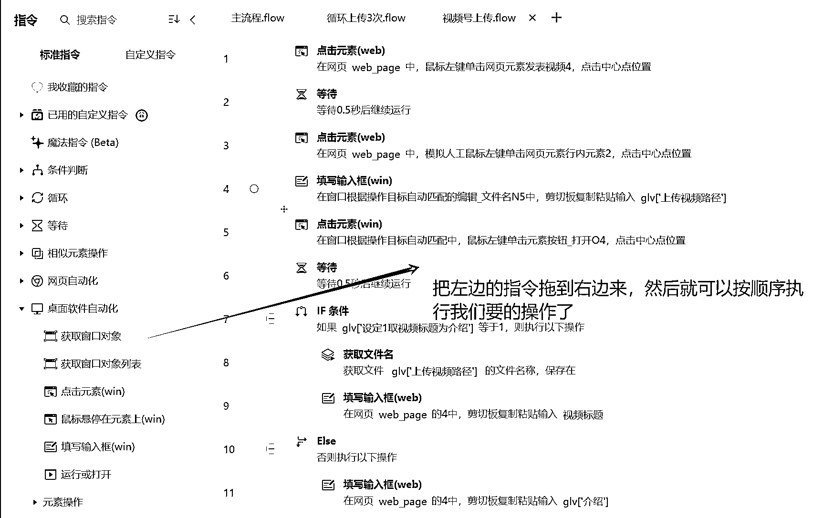
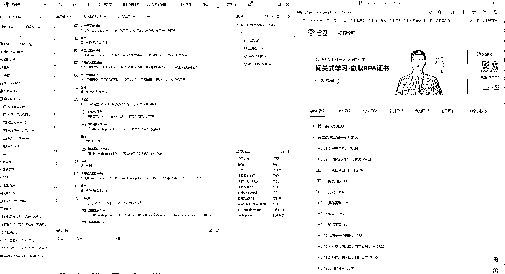
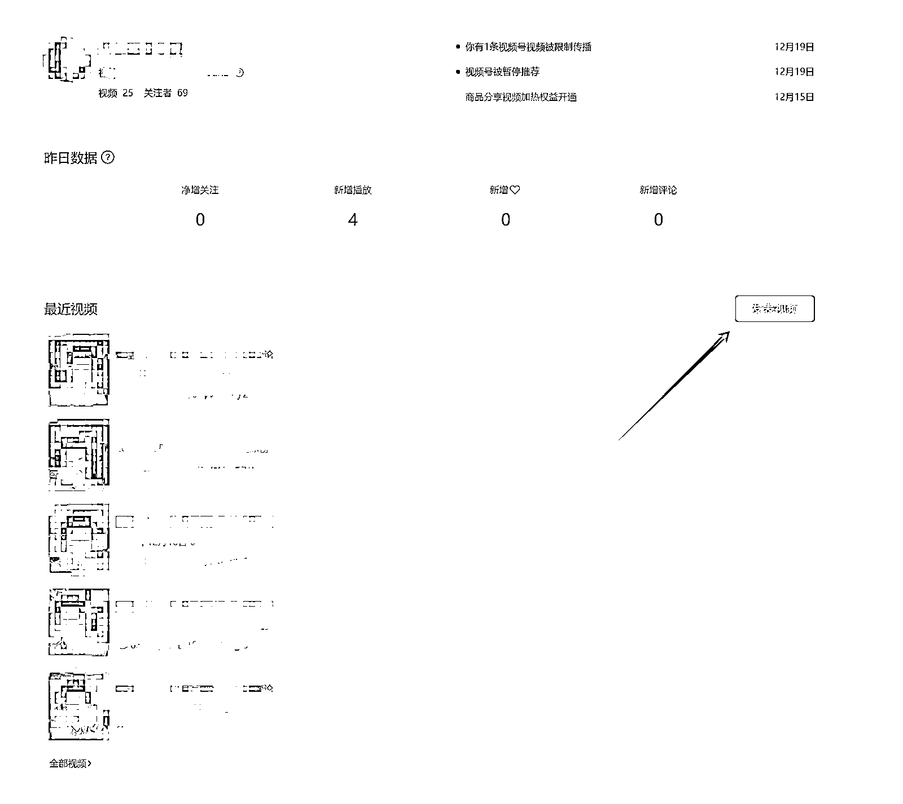
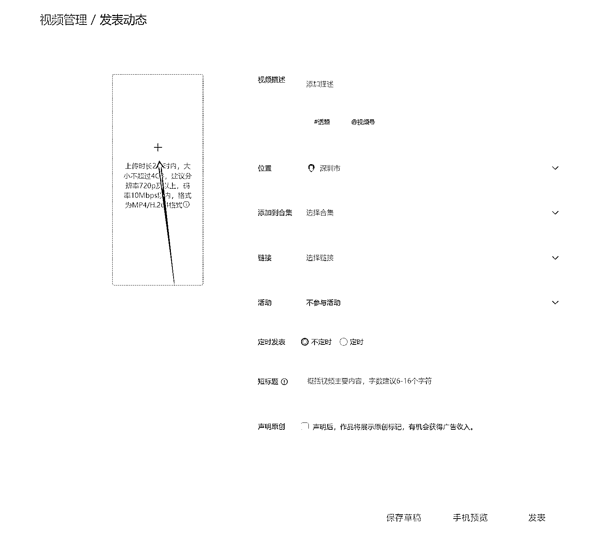
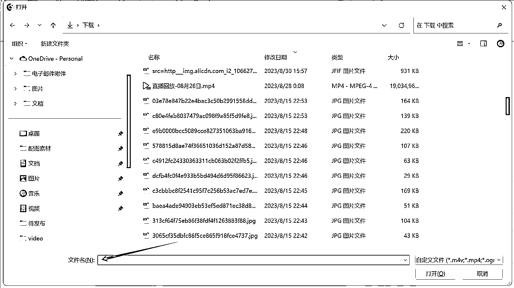
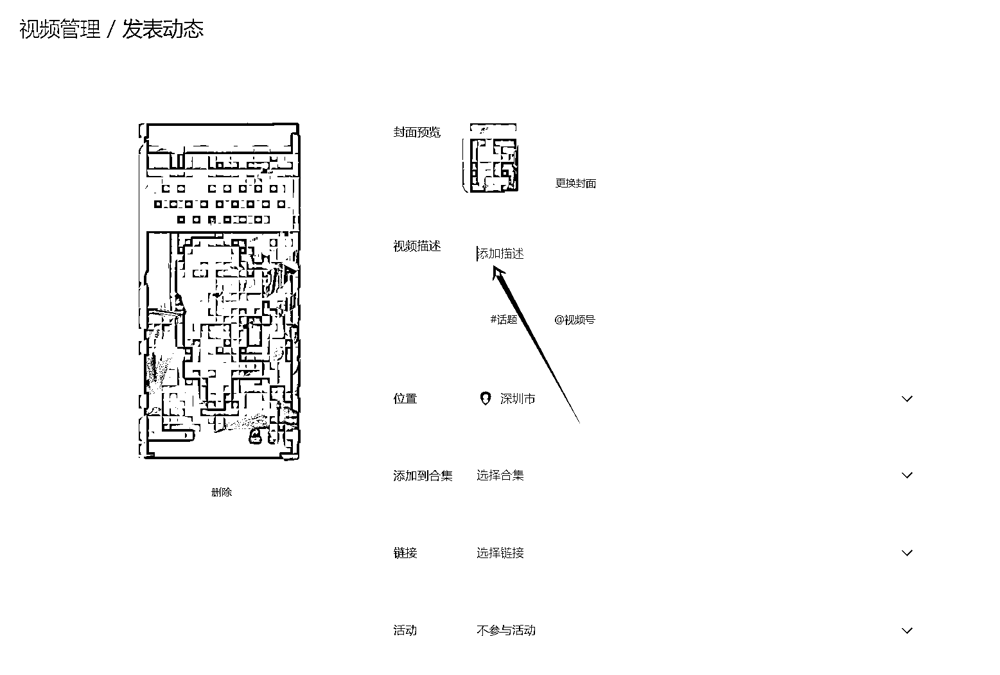
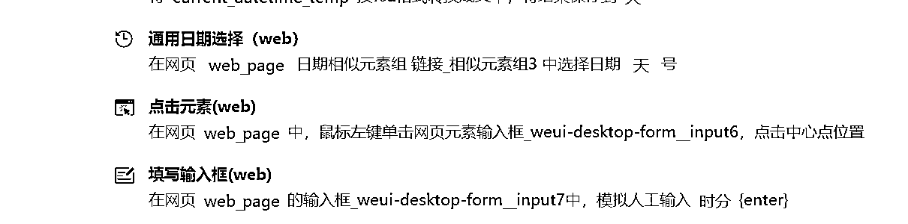
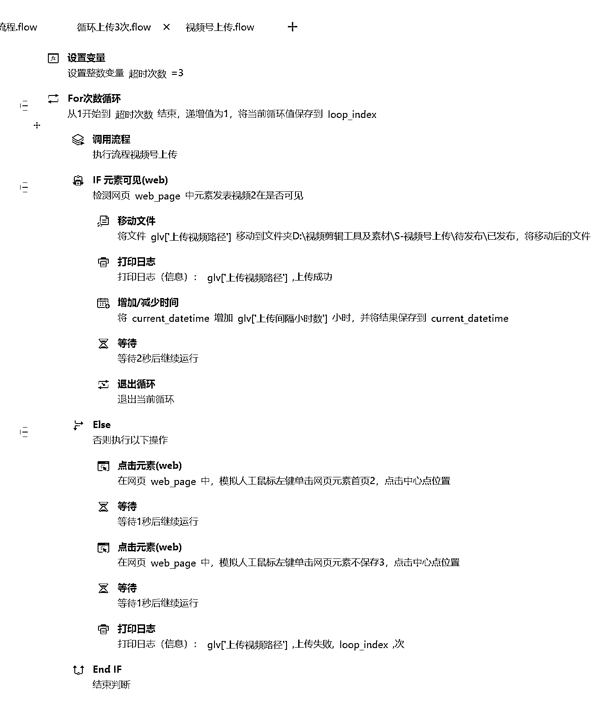

# 宝妈副业如何同时运作 15 个号-视频号批量发布 RPA

> 原文：[`www.yuque.com/for_lazy/thfiu8/queqqwng9q74634w`](https://www.yuque.com/for_lazy/thfiu8/queqqwng9q74634w)

## (54 赞)宝妈副业如何同时运作 15 个号-视频号批量发布 RPA

作者： 旋子

日期：2024-01-05

**关于自己**

大家好，我是旋子，10 年高级 AI 产品专家，90 后宝妈。一个在山顶时上车了深圳的房子，背了 700 万的债，被逼无奈在哺乳期开始了自己的副业之旅。

上次给大家分享了[职场宝妈副业从 0 到 1，通过视频号电商变现 40W 的复盘。](https://docs.qq.com/doc/DZFJ6VURhaldkTWt2)很多小伙伴说我怎么能带娃又做副业，甚至喊我旋超人，其实我有些秘密武器，其中一个就就是 RPA，解放机械劳动，提升效率。

文末会附上我自己写 RPA 的思路和代码截图（写的不好，路过的程序员小伙伴轻点骂），因为一直是自己的团队内部使用，有需要的朋友，我发布一个版本给大家。

# 一、**了解 RPA**

简单解释，RPA 可以自动完成设定的重复工作。比如：批量做视频号最花时间的视频上传工作，每天都要做的对标账号数据查看工作。

## 1、**RPA 帮我做了什么**

最初入门视频号的时候，做的是 2022 年最火的抖音批量搬运视频号玩法。当时视频号每天要发 50~100 个视频。每个视频自己操作，发布时间大概 30s。50 个视频需要半个小时发布，关键是，太枯燥了，还容易出错。

而最初做视频号，没赚到钱，很不舍得买自动发布的工具，因此自己钻研了一下，弄了一个批量发布的 RPA。单个视频发布时间和真人差不多，RPA 自动发布时，我就去忙其他的事情，人轻松很多。

## 2、**用 RPA 的好处**

**第一个好处是，免费**

自动发布软件可能一个月就几十块钱，但是做项目会需要用到各种小工具，每个几十块合起来就是一大笔了。

**第二个好处是，灵活可定制**

最初是觉得不舍得自动发布软件的几十块钱，后来会用 RPA 后才发现，有很多自己做项目需要用的小功能，自己写一个 RPA 会很快，但是想去找市面上好用的软件，很难。

比如：当时实现了 RPA 批量发布后，发现换项目时，视频号上有很多视频需要删除，挨个手动操作太累，写个 RPA 轻松解决。

**第三个好处是，避免一些违规风险**

很多市面上的软件实现功能所使用的操作方法，可能都是会被平台所禁止的，用 RPA 模拟真人操作，安全。

# 二、**RPA 入门**

## 1、**学习 RPA 的心态**

很多小伙伴说，我都不会编程，RPA 是不是很难。我也不是程序员，但是几个小时就学会了 RPA，因为真的很简单。

我是使用的隐刀 RPA，界面和几岁小朋友学的少儿编程界面一样简单，会搭积木就会编程。

## 2、**如何学习 RPA**

不要想着一次性学会然后去编程，这样很快就会放弃了，永远都不会开始编程。

RPA 正确的打开方式是，一边开始编程，一边看教学视频。

不得不说，影刀的入门教程很简单，很详细，我这个没有编程基础的人半个小时就上手了。RPA 视频教程：[rpa-client.yingdao.com/course](https://rpa-client.yingdao.com/course)

## 3、**如何搭建自己的 RPA 并完善**

我的思路是，先搭建最简单，最基础的功能。RPA 能够跑起来了后，再按自己的需要添加功能。

# 三、**视频号自动发布 RPA 搭建思路**

## 1、**基础功能：视频自动发布**

1、鼠标点击发表视频

2、鼠标点击上传视频

3、在弹出来的文件框里输入文件名称（这里说一下我的思路，我把要发布的视频全部放在一个固定的文件夹里，这样取固定的文件路径上传就比较简单，如果不会获取当前文件夹下视频路径的朋友，可以咨询我）

4、输入视频标题（提取将标题写好备用）

5、设定时间（视频号发布时间，天数必须点选，具体时间可以输入框输入）

6、等待上传完成，发布

基本的功能很快就实现了，使用起来效果不错，就是有时候会报错，查看一下就发现是因为有时候网不好，视频没上传完，超时了。

## 2、**附加功能：发布错误处理**

因此需要附加发布错误处理的程序，整理需求：

1、未成功发布的视频需要重发

2、发布成功的视频需要删除/挪走

因此我设置了一个反复发布三次的逻辑，发布成功后会自动将视频挪走。

# 四、**结束语**

做副业，效率比别人高，做的比别人多，项目没选错的情况下，大概率赚的就多。有很多小伙伴做副业做着做着就没了，因为做副业如果效率太低，别人发 10 个视频的时间你只发一个视频，这样确实很难拿到收益，自然很难坚持下来。

除了 RPA 以外，还有很多好用的工具可以提升效率，比如批量剪辑，批量下载等，这篇文章的也是希望给大家一个提升效率的思路。

我是深耕视频号的旋子，欢迎链接。

希望大家省下来的时间都能多多陪陪家人，享受快乐的工作和生活~~

* * *

评论区：

跨境老兵聊电商 : 给你一个思路，上传 直接用获取文件夹 就好了，不需要再填写路径和打开步骤
旋子 : 谢谢大哥！我来试试，文件夹这里当时做了好久
Rio : 影刀市场上有个第三方控件，能解决本地文件轮询。

* * *