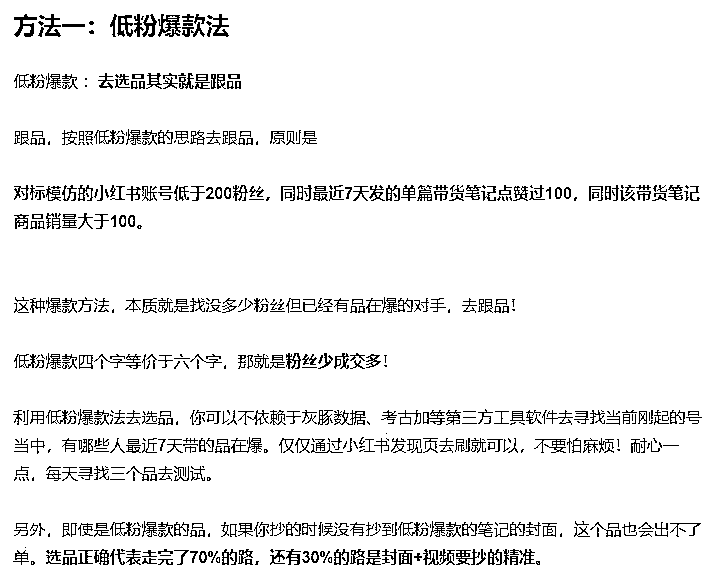
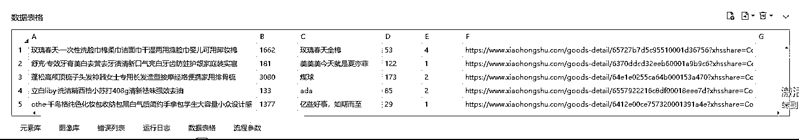
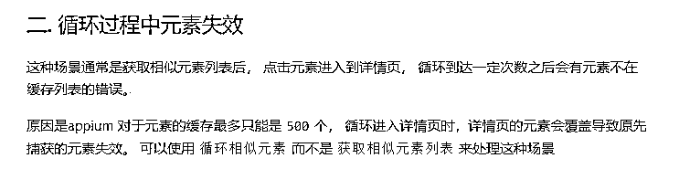

# 没想到！这里还被催更，影刀 RPA 如何自动批量采集小红书低粉爆款商品

> 原文：[`www.yuque.com/for_lazy/thfiu8/iyc438ts1zk2vpgx`](https://www.yuque.com/for_lazy/thfiu8/iyc438ts1zk2vpgx)

## (53 赞)没想到！这里还被催更，影刀 RPA 如何自动批量采集小红书低粉爆款商品

作者： Rio

日期：2024-01-03

都怪我多嘴，看了@锦城随笔  的 [手把手教你使用影刀 RPA 批量获取小红书低粉爆款的商品！全自动解放双手！](https://riodtlbegu.feishu.cn/docx/EkcLdKXHSowEJ1xsX67csVhunad)

说自己用影刀重写一次，本来当晚就写好了，不过觉得发了没用，也不会加精，所以不发了

这么久，忽然收到留言，有人还惦记着

好吧，说到做到，运行效果看这里

这段代码原理来源于伟豪的关于选品的一篇文章，[小红书单店铺单月 6000+利润选品保姆级教程](https://articles.zsxq.com/id_xwveu3e0usfv.html) 这个方法论

脚本是严格按照这个方法去执行，步骤：

1、打开 APP，进入购物列表

2、每个商品都点击进去，采已售数，已经点过就不会再点击

3、已售数大于 100，进入店铺，采集粉丝数

4、粉丝数少于 200，进入笔记列表，翻看前 10 页笔记的点赞数

5、统计点赞数大于 100 的笔记数量（记得，锦城没做这一步）当这个数大于 1 时表示，这就是我们要找的低粉爆款商品了

6、最后把爆款记录在数据表格当中，列表头分别是 商品名、已售数、店铺名、粉丝数、过百点赞笔记数、链接

一开始不觉得能找到，条件这么苛刻，不过代码跑了一晚上，一觉醒来就能得到满满的一张表：

过程中，遇到最大的坑在于回到列表页，发现元素不见了，原因官方给出说明，知道原因，技术上就好解决了

这是核心代码

100200100
defmainargs

defscanSalesession"com.xingin.xhs"
"K:\\workspace\\xhs""%Y-%m-%d-%H-%M"
'//android.widget.TextView[@text="首页"]'

whileTrue
'//android.widget.TextView[@text="购物"]'
forinrange10'//android.widget.TextView[contains(@text,"已买")]/../preceding-sibling::android.widget.FrameLayout/android.widget.TextView'
forinrange'//android.widget.TextView[contains(@text,"已买")]/../preceding-sibling::android.widget.FrameLayout/android.widget.TextView''text'
ifnotin

#读取已售

defreadSaleNumsession,record
'//android.view.ViewGroup[@index="4"]/android.widget.ImageView'if
'//android.widget.TextView[contains(@text,"已售")]'"text"ifand'//android.widget.TextView[@text="店铺"]'
#进入主页
defreadFanNumsession,record
'//android.widget.TextView[contains(@text,"粉丝")]/preceding-sibling::android.widget.TextView'"text"ifand
'//android.widget.TextView[contains(@text,"小红书号")]/../../preceding-sibling::android.widget.TextView'"text"
'//android.widget.TextView[@text="笔记"]''//androidx.recyclerview.widget.RecyclerView/android.widget.FrameLayout[@content-desc]'forinrange10forin"content-desc"ifnotin
0forinif1
if0elseelse

我是专门把实干经验转成赚钱机器，希望有天能躺赚 5W+的 RIO 桑，期待海航中遇到大家！

* * *

评论区：

有方 : 采集多了会封号吗？采集频率设置多少比较合适？
Rio : 用小号采集就好了 没区别
才 : 一直惦记着呢[呲牙]
Rio : [玫瑰]
芮 rui : 大佬就是大佬。实干家

* * *