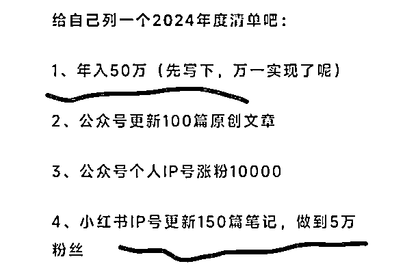
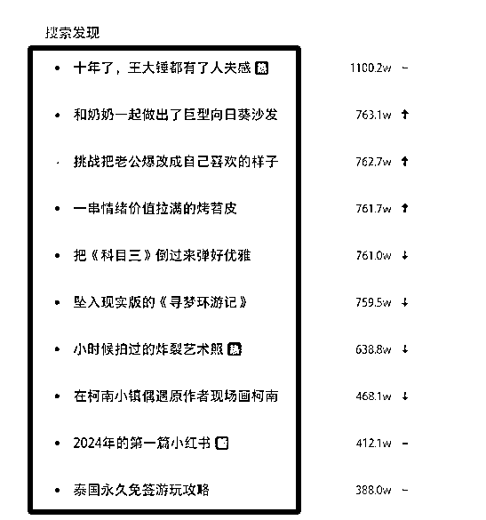
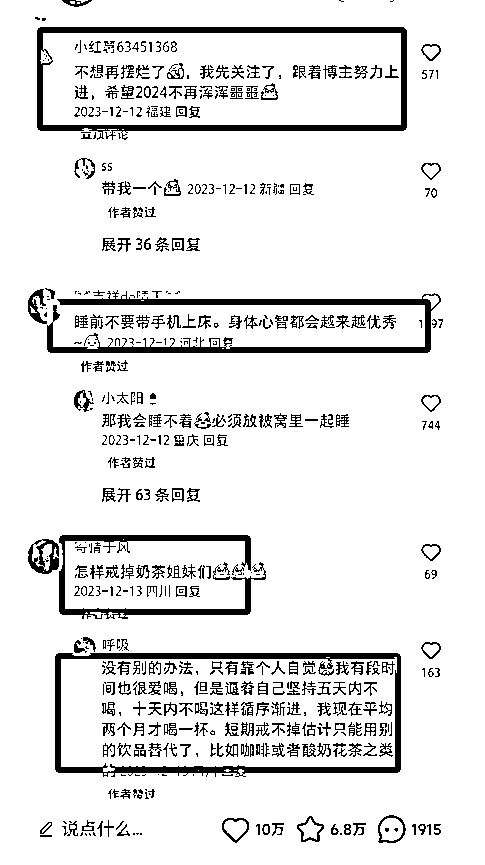
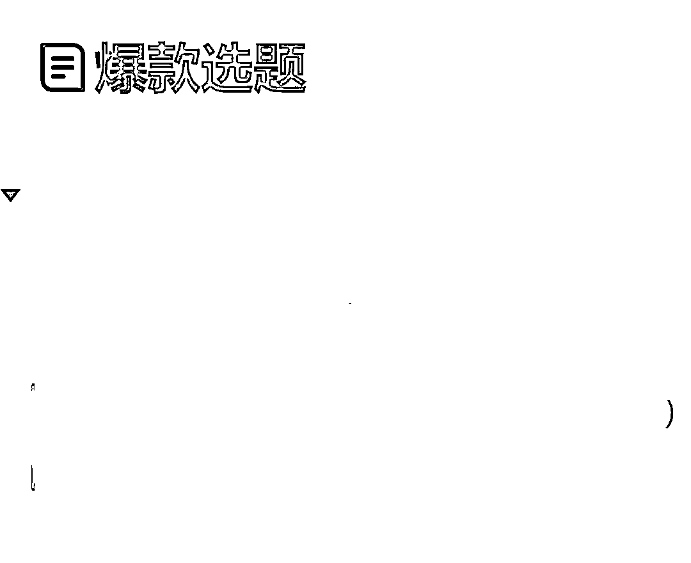

# 做小红书如何寻找源源不断的选题呢？

> 原文：[`www.yuque.com/for_lazy/thfiu8/ep26rzghi9my6yc8`](https://www.yuque.com/for_lazy/thfiu8/ep26rzghi9my6yc8)

## (25 赞)做小红书如何寻找源源不断的选题呢？

作者： 王卷卷在成长

日期：2024-01-04

大家好，我是 93 年的王卷卷，也是一个全职妈妈，去年通过自媒体变现了 10 万＋，往事清零，新的一年让我们继续努力吧。

2023 的复盘里面，我写了今年要写 100 篇原创文章，说实话，我其实心里没底，一个是害怕时间不够。

因为我现在也在带小红书学员嘛，最近连直播都感觉时间挤不出来。

还有一个就是感觉自己灵感枯竭了，不太会写文章了，尤其是选题。

我自己其实是一个比较依赖于灵感写作的人，有时候灵感爆发，写文章就一气呵成，我至今记得我写的一篇游记，现在读起来我都觉得不像我能写出来的，遣词造句，都让我感觉是有别人再给我代笔一样。

最近不是新起了个小红书账号嘛，要大量的写文案，所以也在刻意练习自己找选题的能力。所以今天我主要分享如何在小红书站内找选题哈，大家可以把这种能力迁移一下。

**一、小红书：热搜发现**

这个地方跟微博的热搜榜有点类似，你在这个地方看有的热搜标题是你这个领域的，你就可以点进去看看都是哪些笔记火了，大家都在讨论啥，由此找到选题，触发你的灵感，开始写作吧。

**二、爆款笔记的评论区**

这个地方简直了，你能发现大家的悲喜竟然如此相似，你有被渣男 pua 的经历，她居然也有，连情节都差不多，然后你们互相安慰彼此，隔空来一个抱抱。

关于自律，网友也是有不同的看法，每个看法都是你的一个话题，自媒体人，围观八卦不是真的为了吃瓜，而是给自己积累素材呢！

这些地方到处都是素材，网友评论的每个句子都是大家的痛点，所以啊，抓紧写起来。

**三、对标账号写啥咱就写啥**

对标账号就是我们要输出的这个内容方向的博主，或者是她们身份跟我们类似，风格我可以模仿，这样的博主我可以做为对标账号。

那么如果你是做小红书，你的选题你就模仿她的爆款去写就好了，框架其实都是差不多的，我在粥佐罗大大的《学会写作》里面知道了几个写作框架，给大家分享一下。

01、干货三件套：2W1H

02、观点三步法：总分总

03、同纬度并列拆分

04、逻辑递进拆分

05、不同维度罗列拆分

06、同一点不同案例罗列法

07、时间顺序法

《学会写作》-粥佐罗

**四、一定要提前收集选题**

经过我这几天起新号的感受，我觉得我们一定得提前收集至少一周的选题，如果你能做好一个月的选题那就再好不过了，因为我们写作的时候，需要集中精力，咱们又不是靠 ai 去写对吧，所以还是得自己思考。

那如果说你在这个阶段又去找选题了，我们的思路就被打乱了，像我，好不容易有个整块的时间，可以静下心来写东西了，结果一看我没有选题，坐电脑跟前，半天了一个字都写不出来，这不就是浪费时间嘛！

**提前规划好你的选题的时候，你就可以下笔如有神了。**

以上就是卷卷这段时间实践后总结的一些个人经验啦，希望对你们有帮助啦。

* * *

评论区：

风不停 : 分享的真好 1
Celine : 五节小课搞定 RPA 入门

* * *