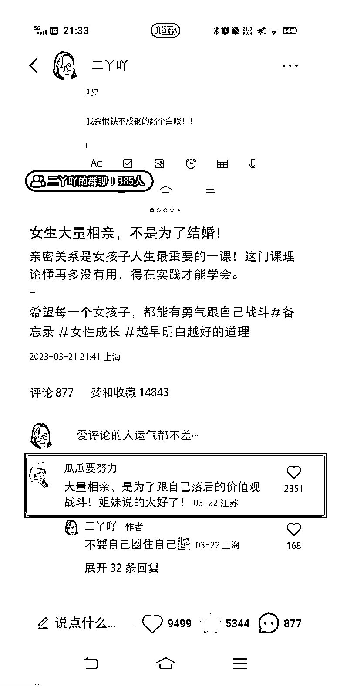
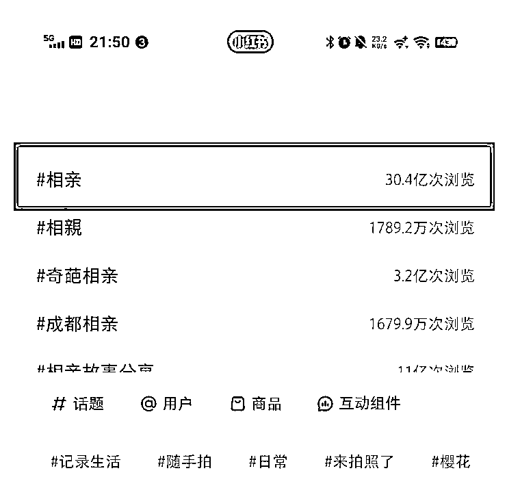
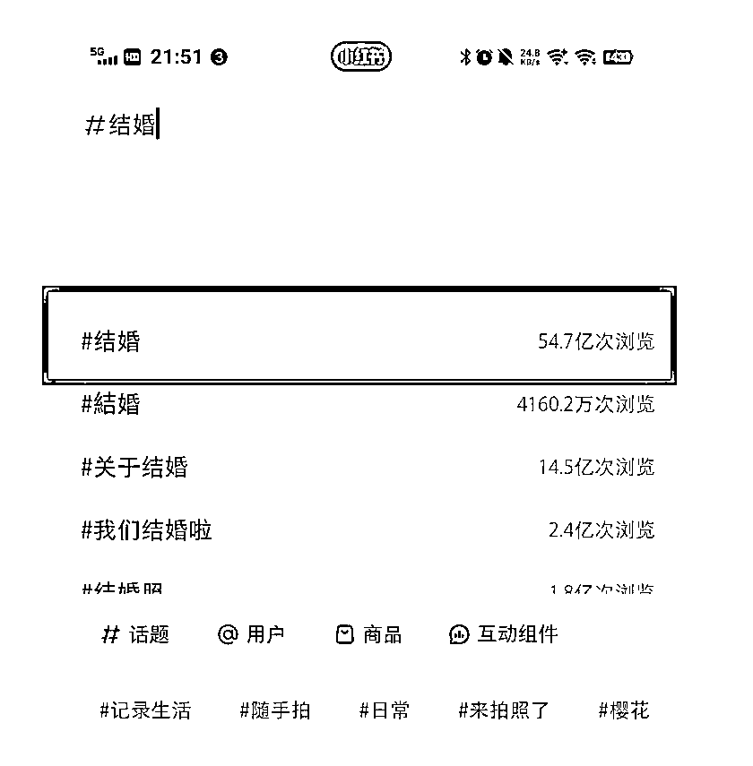
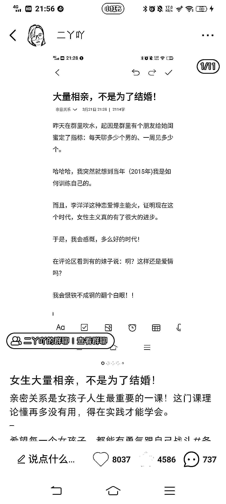
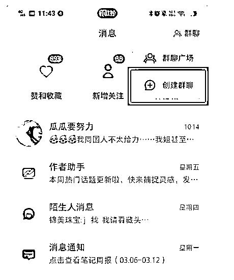
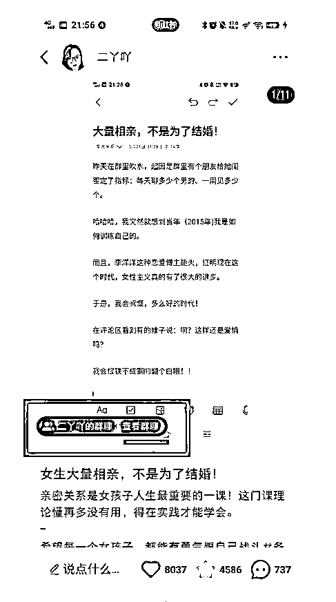
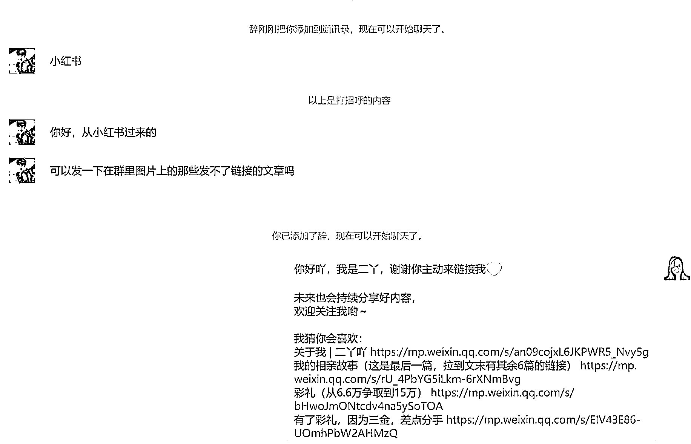
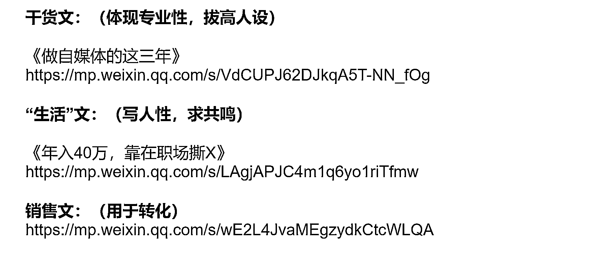
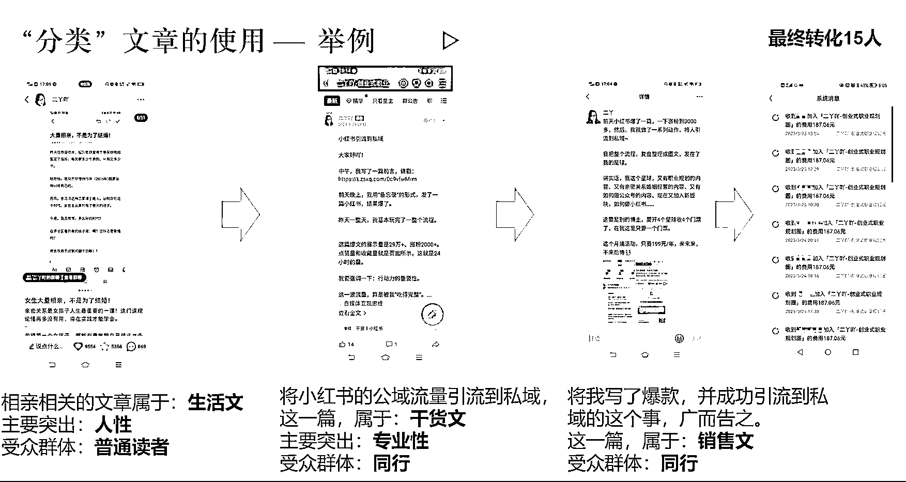

# 红书 1 条笔记变现 4000+，聊聊我的爆款创作思路+引流变现全流程

> 原文：[`www.yuque.com/for_lazy/thfiu8/gv681da4yy2hpdnq`](https://www.yuque.com/for_lazy/thfiu8/gv681da4yy2hpdnq)

## (31 赞)红书 1 条笔记变现 4000+，聊聊我的爆款创作思路+引流变现全流程

作者： 二丫吖

日期：2024-01-05

我在去年 3 月份时用备忘录的形式，发了一篇小红书笔记，这一篇小眼睛 30 多万，点赞 9000 多、收藏 5000 多，直接给我的账号涨粉到 3000+，我马上在小红书建群，在群里引流到微信（十几个人）。

接着在我的公众号+微信宣传我小红书爆款这个事，卖我的知识星球，最终，以 199 元/份的单价，卖出 15 份。

等于这条笔记为我创造了 2980+的营业额，也谢谢大家的捧场，不少人是冲着我的宣传而买我这个星球的。

我今天把全过程给大家整理一下，未来大家自己的产品要结合小红书做引流变现，也可以用这个思路。

接下来跟大家分享一下两块心得：

**一、爆款创作思路：有意识地在生活中搜集讨论度高的选题**

**二、引流变现复盘：行动+反应快=搞到钱**

**一、爆款创作思路：有意识地在生活中搜集讨论度高的选题**

我自己现在写文章，我的素材大多取自于生活，没有特意去找选题。

我有本职工作、还是一位宝妈，日常得带娃、每天能放在自媒体上的时间也就两三个小时，我自己还有一个公众号要经营。

小红书是我今年下决心要做起来的平台，我也花钱买了课。

我们公众号是有个号主群的，日常就是聊得来的几个博主在里面吹吹水。

有一天一个号主在群里说正在自己给闺蜜安排相亲在找对象，这个群里大多是女人，这种八卦的话题就很容易激起了大家的聊天热度，群里没一会就有一百多条留言。

我当时就觉得：哇！15 个人聊这话题能聊出 100 多条？那这个话题要是被我拿出来写文章是不是可以呢？

于是，我就直接用手机，写了一篇（花费半小时）。

接着，我报课的那个付费群里就发了“小红书爆款模板”，其中有一个小红书账号叫做：KKの成长日记。

我翻了一下这个账号的内容，突然就理解了备忘录式的笔记是啥意思。

于是，我就把这一条相亲的内容，复制到我手机备忘录，然后截图，接着发小红书（前后不到 10 分钟），然后，我就去睡觉了。

第二天早上一起来，就爆了。

**通过这条爆款，我总结下来的心得是：**

**1、要在日常中有意识地搜集反馈，一般在小范围内能激发大量讨论的选题，放到大平台上一样能激发讨论，而，只要有讨论，就会有爆的可能性。**

**2、给文章设计“金句”有利于传播。**

这是我的真实经历，所以写起来其实并不费事，属于一气呵成。

这一篇的重点在于故事讲完后那 123 的总结，这种总结特别“提气”，这其实需要有一定的写作功底。那我本来就是一名公众号博主，我每写一篇文章都是有意识地创造“金句”的。

这一篇的金句“大量相亲，是为了跟自己的落后价值观战斗”，是我自己创造出来的。

一是小红书是个女性群体居多的地方、二是现在整个市场女性力量崛起的非常迅速，女性主义也算是一个社会热点，在这种互联网环境下，配上这种金句，文章被传播的可能性就大。

读者一般看完一篇文章不太记得你到底讲了啥，朗朗上口的金句是加深读者对这一篇文章的记忆点。让读者觉得意犹未尽，这样能促进他们的转发，这一篇刚开始就是评论区的读者大量@他们的朋友带动起来的阅读量。

大家可以看到，光这句评论就有两千多的点赞量。

**3、标题，是能爆的基础。**

这一篇的标题上，有几个热词：相亲、结婚。

“相亲”这个词小红书上的浏览量是 30.4 亿次

“结婚”这个词小红书上的浏览量是 54.7 亿次

相当于我一个标题踩了两个热词，而且，我还设置了“悬念”：大量相亲，不是为了结婚。

别人就会好奇，相亲不为结婚为了什么？

结论是，为了跟自己的价值观战斗。

这其实也是迎合了现在女性主义的风气，所以这一条爆了。

**二、引流变现复盘：行动+反应快=搞到钱**

22 号那一整天，我基本玩完了一整个流程。

这篇爆文的展示量是 20 万+、直接给我涨粉到 3000+。

点赞量和收藏量就是页面所示，这就是 24 小时的量。（现在还陆陆续续有点赞，页面点赞已经是 9 千多了。）

我要强调一下：**行动力的重要性。**

这一波流量，算是被我“吃得完整”。

接下来，跟大家分享**“公域流量引流私域”**的操作方式。

1、22 号早上我约每 10 分钟打开一次，每次都是 99+，我就知道可能要爆了。

2、评论区有人问（第一个人）：有群吗？

于是，我看到后，立马，一分钟，就在小红书建了一个群。

其实我那会根本就不知道小红书建群的地方在哪里。

研究了一通后，建群，然后发现这个群是可以“绑定笔记”的。

于是，我就把群聊绑定在我最新那篇笔记（一个群可以同时绑定多条笔记）。

这样，这个群就会跟着这个笔记的流量跑。





点这个“查看群聊”用户就可以直接加群了。

现在这个群已经有 380 多个人了，而这个笔记现在还在推。

简单来说，我这次的操作是先把人引流到小红书的群里。

然后，弄一个简单的回复，比如：大家好吖，群是今天建的，现在我在上班，晚上跟大家分享哦。

因为小红书的群是：先申请，群主同意申请，对方才能进群。

进群的人一波波，就会顶掉内容，于是我每隔一段时间就复制上面这段话，目的是为了晚上能“转化”。

（当然，如果不想重复发言，你也可以选择把内容置顶）

但，其实我也看到过，有的笔记火了，可涨粉效果不好。我最终的目的还是希望多涨粉。

我这一篇，其实刚开始时涨粉效果是不太好的，就是点赞、收藏、留言多，涨粉效果一般。

我发现这个问题后，马上就在评论区拉关注。

他们在评论区留言说：我缺一个军师。

我就回复说：关注我，军师就在这里。

我会去评论区吆喝：来关注我呀，来来来入股不亏。

有个人说：关注你了，宝藏博主。

我就说：爱你宝贝，有眼光。

大概就是这样子去跟他们互动。

一个读者正常看完这一篇文章之后，可能只会被文章的内容所震惊到，他不会记得去关注你的，因为这篇文章的排版并不好，我又是个素人博主，那会粉丝才 600 多。

那这个时候他们就会去看评论，别人是怎么看这个事情的，我自己又在评论区很欢乐地跟他们互动，就比较拉好感。

我吆喝着要让人家关注我，我是一个宝藏博主，相当于他们就会被二次安利，然后来关注我。

所以，我是做了在评论区里面“引导关注、引导加群”这个动作的。

这样做的效果很明显，涨粉的效果是比较好的，一下子涨了 3,000 多粉丝，群也有 380 多个人。

接下来，把人引到群里后，我又做了这几件事：

1、找出我公众号上跟相亲、婚姻、彩礼相关的文章，来匹配这次的分享。

2、整理出分享链接。

3、做图引流。

⚠️ 注意：

1、群里不可以提微信、公众号等字眼，会被封号（weixin、qq 的拼音也不可以出现）。

2、平台对于引流的系统检测很严格。

这个我冒了风险，但因为我整个小红书内容质量还不错、我也有在群里认真分享，我是有赌一把的，目前看来没事。

富贵险中求嘛，我就想着说，要搞就搞一把大的，试一下。

做图风险小。

在小红书的群里分享（我是大专学历，我老公硕士，勾起大家的好奇心），然后引流到微信，准备分享链接、回复模板，通过链接来引流新人关注公众号。

好了，一整个闭环，结束。

虽然，加微信的人不多（十几个的样子），因为我当时分享的时候，小红书群聊里的在线人数其实只有 40 多个。

但是，就这一天：**我小红书的群建起来了、引流的全流程我走完了。**

后续再复制这个流程就可以了。

24 小时，走完全流程。

以上，我做的是引流的动作，引流，是做“市场营销”的动作，并不会马上变现。

转化，是做“销售”的动作，而我销售的动作是爆款后的第二天，也就是 3 月 23 号做的。

销售的动作，需要通过不同类型的文章来承接：干货文、生活文、销售文。

这三种文章，是分别有不同的用处的，我个人的理解是这样：

那我小红书的这个爆款文，以及转化，就是这三种文章的结合。

小红书这一篇爆了后，我当天晚上就写了一篇分享稿，在我自己的付费社群里做分享，第二天将这个分享整理成文章，发在我的付费星球里。

内容就是跟我现在跟大家分享的内容差不多，这属于“干货文”。

然后，截图、带优惠券、发朋友圈、发公众号（我那篇销售文案，阅读量有一千多）

这两篇文案，合计转化 15 个，199 元一个，创造了 2985 元的业绩。

做销售是这样的：一旦产生“批量付费”的情况，我们是可以又利用这个截图再出来卖一波，于是，我又截图了我星球的出单记录。

  基于这个截图，再写一份文案进行销售，发到我的朋友圈。

  这一篇又卖了有 6 个。

合计卖了 21 个，199 元/个，那就是：4179 元。

这就是这一条爆款带给我的销售业绩了。

综上所述，我总结下来的经验就是：**搞自媒体，行动迅速、反应快，就能搞到钱。**

所以，整个过程其实也没多复杂，搞自媒体最关键的是：**行动起来，搞起来！**

* * *

评论区：

暂无评论

* * *