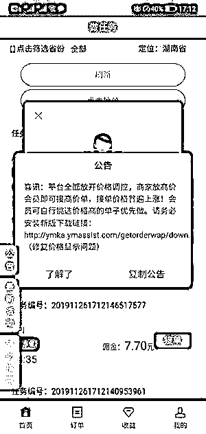
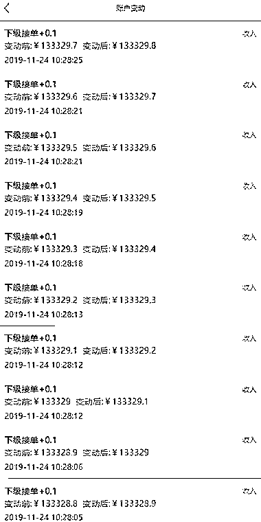
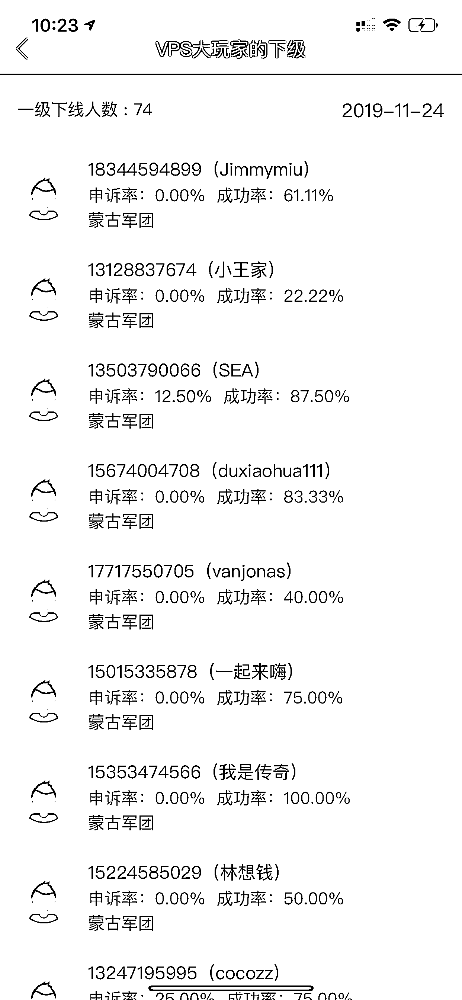
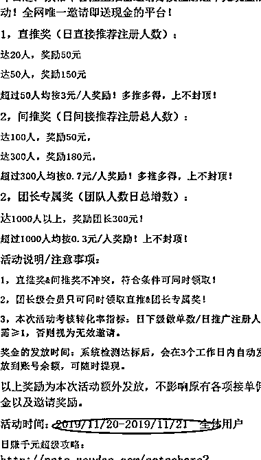

# 七年收款一千万，美国广告联盟

> 原文：[`www.yuque.com/for_lazy/thfiu8/kcanhfrbzwobs5v5`](https://www.yuque.com/for_lazy/thfiu8/kcanhfrbzwobs5v5)

## (51 赞)七年收款一千万，美国广告联盟

作者： 陈辰

日期：2024-01-02

七年收款一千万，美国广告联盟 cj affiliate 完全指南

我最早接触到 cj 联盟，接触到 affiliate  marketing 这个概念是在米课 mrhua 的“老华带你飞”栏目。

老华在那次视频分享里，跟大家展示了他是如何通过 cj 联盟里一个叫 icontact 的广告主，赚到 200 万的全过程。

我看完那篇分享以后觉得很新奇，就开始研究 affiliate marketing 和 cj 联盟。

很滑稽的是，我注册的第一个 cj 账号用的 gmail 邮箱，就是 XXXYZ10000000@gmail 点 com（XXX 要赚一千万）

当时纯是自己和自己开玩笑，给自己的目标要从 cj 赚一千万，没想到几年以后，也算是一语成谶。

但其实，我并没从 cj 这个联盟“赚”一千万，而是收款超过一千万，和其他所有生意一样，经营 cj 是有成本的，但是利润也是很可观了，我在厦门五缘湾有一套海景房，纯是 cj 联盟收的推广佣金供出来的。

除此之外，我在联盟营销这个领域赚到的最大的一笔钱，是在国内，通过学习 cj 联盟的运作方式，我自己做的一个类 cj 的任务分发平台。

那是 2018 年，年初，我们发现了微信体系里的一个隐性需求，就模仿 cj 联盟这种业务模式，搭了一个任务平台，以微信这个新需求为切入点，对接：发任务的人和接任务的人，

在当时，我们连一个正经的技术员都没有，就在淘宝上找了一个野鸡程序员，几万块做了一个简陋到不能再简陋的 app，就开始干了

两年多的时间，这个任务分发平台，一分钱推广费没花，纯靠 affiliate 地推裂变，做到了上百万用户。

有 16 万人在我们的平台放单，超过一百万人在我们的平台接单。

5-30 块钱一单任务，流水超过一亿，给我和我的合伙人赚了非常多的钱。

直到 2020 年底，被帽子叔叔登门了，平台被强制关停，真的是差一点点就去踩缝纫机了。
帽子叔叔登门的原因是，我们的上游放单的客户，有不少业务不合规的人士，自然而然我们收的钱和提供的服务也就不合规了，现在回头看，真是万幸，当时监管还不算太严，只是罚了些钱和勒令停业，这要是放在现在，以我们的体量，百分之百去踩缝纫机了。
撇开最后被关停不谈，这个业务绝对算是一个很成功的 affiliate marketing 创业案例了，服务了上百万人，也着实让我过了一把创业的瘾。

很多人一提 affiliate，一提联盟营销，就是各种广告联盟平台和奇技淫巧，其实这种理解是很狭隘的。
联盟营销是一种商业模式，并不是某个联盟平台和玩法可以概括的，它几乎可以应用到任何你看到的生意里去，是当下互联网流量碎片化一种很有效的推广方式。
这也是为什么我的微信签名是：affiliate 无处不在

而且这个概念的业务，不光国外很火，国内也一样，就说淘宝联盟，淘宝客这个很典型的 affiliate 业务，让多少啥资源都没有的草根逆天改命。

这些年，创业自媒体比较活跃的 kol 里，好多都是淘宝联盟跑出来的，我还尝试把国内淘客的玩法搬到国外去，也一样很有效。

你如果在国内搜索国外广告联盟的相关信息，有三个出镜率很高的关键词，cj/cb/amazon associate，这里的 cb 是 clickbank，amazon associate 是亚马逊联盟。

cb 和 amazon 我之后再做专题分享，今天咱们只聊 cj

cj affiliate，全称是 commissionjunction

这个联盟非常的典型，国外很多联盟都是 copy 的它，基本上你把它搞明白了，国外 affiliate 领域的运作规则和术语也就大差不差了。

我就从注册账号开始，包括收款方式，税表填写，后台功能，广告主的指标以及通用玩法等等，把整个 cj affiliate 给大家捋一下。

相信看完这个，大家就能对国外的 affiliate marketing 有一个比较全面的认识了。

内容较多，请移步飞书：

[`zo58x45lxn.feishu.cn/docx/Itrfd7QIHoPIFkxedMrcj36Cn5b?from=from_copylink`](https://zo58x45lxn.feishu.cn/docx/Itrfd7QIHoPIFkxedMrcj36Cn5b?from=from_copylink)

* * *

评论区：

阿甘｜汽车出口 : 谢谢分享
Rio : 超出我的认知，觉得很厉害，但不明白怎么攒钱
陈辰 : 可以先关注下，未来我会分享更多的关于 affiliate marketing 的内容的
陈辰 : 本质上还是流量业务，国外也有抖音，也有小红书，也有知乎，也有搜索引擎，也有个人 ip，想办法给广告主倒流，然后拿约定的佣金，就是这么个事儿
zhAzha : vps 大玩家？你的博客看了很多遍。确实学到一些知识。
陈辰 : 我不是大玩家，我和他认识，当时我推这个任务平台的时候他也帮我推过
陈辰 : 写这篇分享的时候，在老手机里找的当时的一些截图
北瑜 : 做的是 EMU 吗

* * *