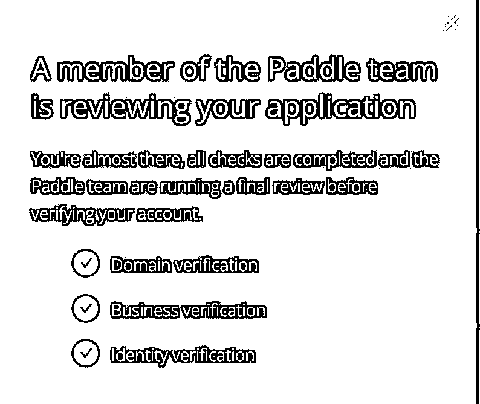
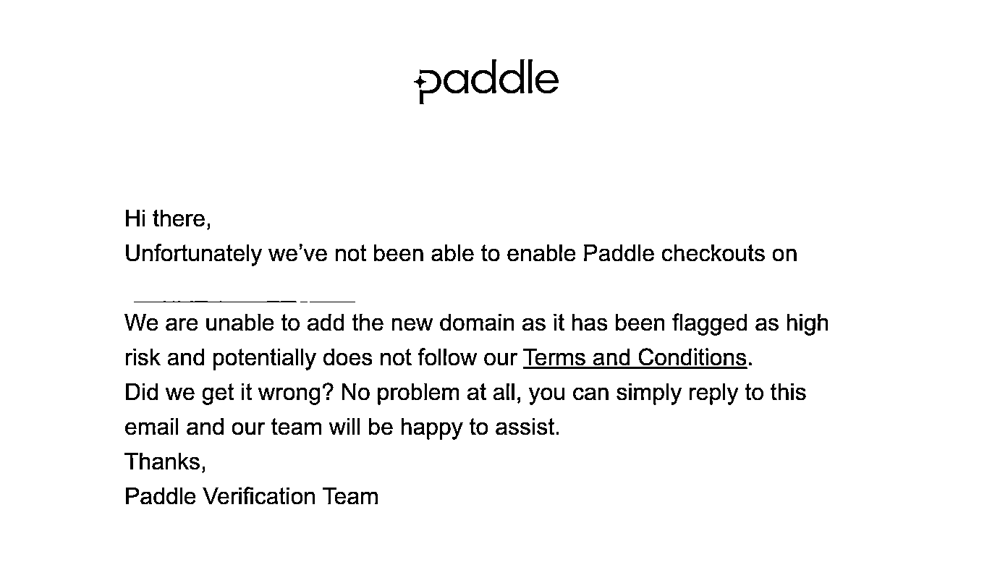
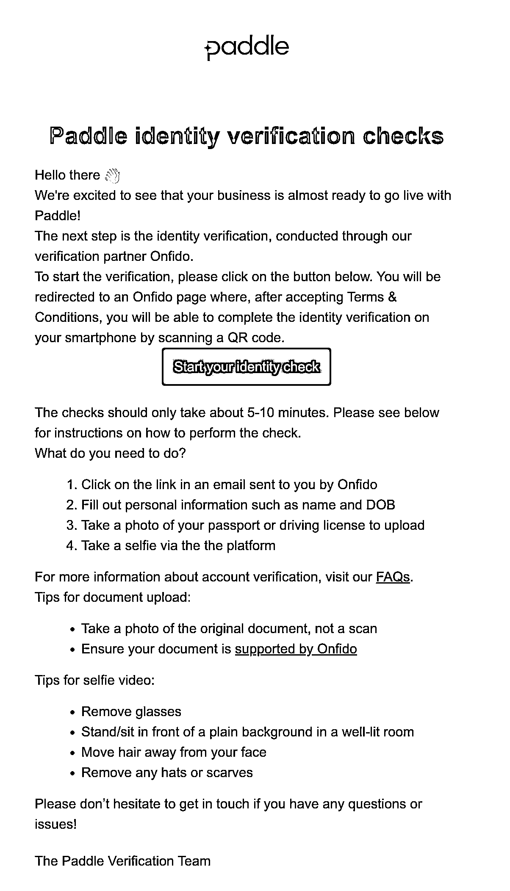
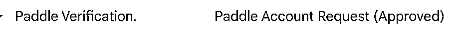

# 出海付费工具支付 Paddle 开通手把手教程

> 原文：[`www.yuque.com/for_lazy/thfiu8/ehvgq3mnthoedmss`](https://www.yuque.com/for_lazy/thfiu8/ehvgq3mnthoedmss)

## (31 赞)出海付费工具支付 Paddle 开通手把手教程

作者： 子木（二哥）

日期：2024-01-04

付费工具，必要的要接入支付，完成订阅或者单次产品付费。推荐的海外支付服务商有：

1.  lemonsqueezy： [`www.lemonsqueezy.com/`](https://www.lemonsqueezy.com)

2.  paddle： [`paddle.com`](https://paddle.com)

3.  Stripe： [`stripe.com`](https://stripe.com)

其中 Stripe 最难申请，需要香港或者海外公司。按接入成本和申请成本考虑，推荐 Paddle

这里手把手申请教程，大概流程步骤如下：

1、Domain verification

2、Business verification

3、Identity verification

## 一、Domain verification

### 1.1 准备官网

注册 paddle 账号前，请准备好以下：

官网：

■ HTTPS 基础

■ 首页（产品 SaaS 定位、场景、Feature、FAQs、support 联系邮箱 等等）

■ 价格页面（产品订阅价格 Pricing Plan）

■ Privacy Policy 页面

■ Terms Of Service 页面（包括 Payments & Refund Policy 段落描述）

（内容哪里来，别创新了 先参考竞品，申请成功，再改官网）

### 1.2 注册账号

注册账号，注意：

1.  邮箱前缀最好是 护照名称拼音（方便最后一步 Identity verification）

2.  注册 user setting 填护照的名称拼音：Last Name、First Name（方便最后一步 Identity verification）

3.  注册类型写 独立开发者，zip code 写 000000，注册地址写中国(随便写的)

### 1.3 添加 Request Domain Approval

打开 Request Domain Approval 地址 [`vendors.paddle.com/request-domain-approval`](https://vendors.paddle.com/request-domain-approval)，填写域名即可

然后等待邮件

○ 收到邮件验证域名所有权

■ 进入域名提供商，添加 DNS，txt，value=邮件中的 code

■ 等待邮件

■ 收到邮件后进入审批流程，等待审批

○ 邮件回复

邮件回复流程大致如下：

如图，我们被拒了第一次。Paddle 说你 There was a problem enabling Paddle checkouts on your domain

你这么模板回复

Dear Paddle Verification Team,

Thank you for your email.

We are a SaaS software company and we fully comply with Paddle's Terms and Conditions.

品牌名 (网站地址.com) is an online SaaS tool for xxxx 业务场景.

Please let us know where we do not comply with the Paddle's Terms and Conditions. Can you please tell me how to improve and recheck the validation?

We look forward to hearing from you.

Thanks,

品牌名 Team

如图，过个 1-2 天会收到 2 封邮件：Domain has been approved 和 Domain Ownership Verified

## 二、Business verification & Identity verification

上图，会受到第三封邮件 Action Required: Paddle identity verification checks。邮件内容如下：

就是 Paddle 通过第三方 Onfido 进行 Business & Identity verification，让你准备好以下信息和流程：

1.  单击 Onfido 发送给您的电子邮件中的链接

2.  填写个人信息，例如姓名和出生日期

3.  拍摄您的护照或驾驶执照的照片以上传

4.  通过平台自拍

文件上传提示：

1.  拍摄原始文档的照片，而不是扫描件

2.  确保您的文档受 Onfido 支持

自拍视频提示：

1.  摘下眼镜

2.  站在/坐在光线充足的房间里，在朴素的背景前

3.  将头发从脸上移开

4.  摘掉任何帽子或围巾

这时候你的护照，派上用场了。点击邮件的链接，去吧 ~

第三方，顺利的话就会通过后发邮件，不顺利就回复邮件证明自己身份。最后，最后你会收到 Paddle Account Request (Approved) 邮件，就大功告成！

整个时间，大概 1 周左右吧！赶紧申请去吧

* * *

评论区：

暂无评论

* * *