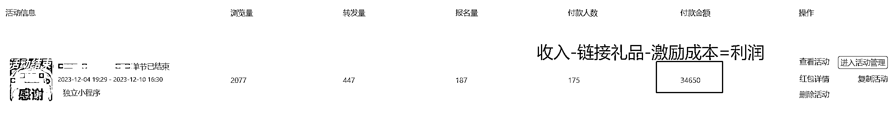

# 帮线下教培机构招生，详细操盘梳理

> 原文：[`www.yuque.com/for_lazy/thfiu8/gnkutdvrlqc75517`](https://www.yuque.com/for_lazy/thfiu8/gnkutdvrlqc75517)

## (27 赞)帮线下教培机构招生，详细操盘梳理

作者： 张老师

日期：2024-01-03

检索生财问题（发现问题），并根据自身能力（解决问题）=提供价值（生财有术）

因行业相关，正好主业针对教培机构招生相关，给教培机构及实体店的圈友们分享一下，如何利用群裂变方案去做区域流量爆破。

（以下主要以教培机构刚结束的双十二活动为例进行分享）

近一年营收总截图：

注：该流程不仅适用于教培，也同样适用于各种[五公里生意]，包括但不限于教培，瑜伽，健身房，美容，摄影等；

看完我的操盘经历后，相信会对你有所帮助。

【请移步飞书云文档，观看体验更佳】

温馨提示：用电脑浏览，体验更佳哈，手机浏览排版有些混乱[`ak5sbcdgi2.feishu.cn/docx/AVcldHQAToby6pxt86AcyMqInje?from=from_copylink`](https://ak5sbcdgi2.feishu.cn/docx/AVcldHQAToby6pxt86AcyMqInje?from=from_copylink)

* * *

评论区：

小丽 : 看完了，真的是教培引流的新思路，主要就是大量行动，群里的氛围带动起来，利用大家的从众心理去成交
张老师 : 嗯嗯，感谢认可，很高兴帮到你🥰
张老师 : 点赞满 50，再来一个转化活动的[愉快]
张老师 : 感谢@涛哥 的润色指导，感谢@孙策 的引荐入门，欢迎各位教培人、同僚多多交流，多多沟通，咱们评论区见哈，必将知无不言，言无不尽！[愉快][愉快]
ZI : 请教一下本地家教现在各个线上平台还能推吗？我有大量本地学生资源。想借助这个赛道变现。[流泪]
张老师 : 教培招生，本质就是利用校区已有资源，通过微信社群等方式，并最终达到裂变新生量的。不知道圈友你的资源是全国性质的还是单区域性质。如果是全国性质可以和那种连锁机构，比如编程猫，希望美术，秦汉胡同等，去谈，如果是区域性质就很好了，可以直接去当地的教培去谈，都很容易变现的。今时不同往日，所有教培都非常喜欢这种低成本获客方式！[呲牙][呲牙][呲牙]

* * *