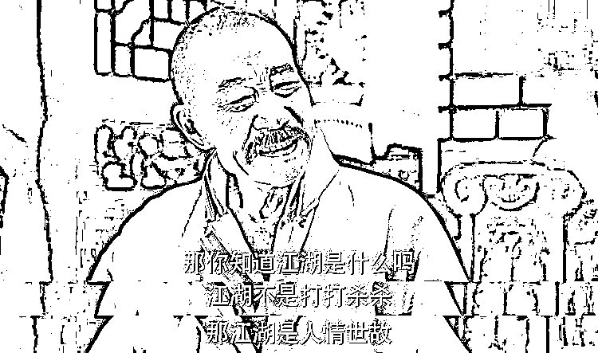

# 行走江湖，你可能需要知道的 120 条常识

> 原文：[`www.yuque.com/for_lazy/thfiu8/cu67x3frzgnv9v67`](https://www.yuque.com/for_lazy/thfiu8/cu67x3frzgnv9v67)

## (精华帖)(560 赞)行走江湖，你可能需要知道的 120 条常识

作者： V 先生

日期：2024-01-09

行走江湖，你可能需要知道的 120 条常识

在我的笔记库中，有一篇笔记叫《真相》，专门记录我在日常中对人性的观察，大多来自我的经验与教训，有的来自对他人的观察与启发，还有的来自千百年流传的俗语谚语。

这里挑 120 条分享给圈友们，仅供参考。

事先声明三点：

1.  研究人性，不是为了给人使绊子，而是为了避开“雷区”，更好地与人打交道。

2.  这些话可能有些让人难以下咽，尤其是顺风顺水，没有经历过什么挫折的朋友。

3.  我说的可能都是错的。

--

1.  被需要胜过被感激。狡兔死走狗烹，飞鸟尽良弓藏。

2.  比别人的目光更可怕的，是你在意别人的目光。

3.  别人对你无法感同身受，比如牙疼。

4.  不经他人苦，莫劝他人善。

5.  不要随便给人提建议、介绍工作、找对象，别人做成了，说是他的功劳，别人做不成，说是你的过失。

6.  不要随便骂别人垃圾，因为当你深度反思自己，也有垃圾的一面。

7.  不要随便收别人的礼物，很多人给你送礼，只是想以小博大。

8.  不要炫耀你认识多少人，重要的是有多少人认你。当你真正要借钱、办事的时候，才会发现有多少人认你。

9.  不要用自己的时间价值去衡量别人的时间价值。

10.  吃人嘴软，拿人手短。

11.  单身是糖，婚姻是柴米油盐酱醋茶。

12.  当别人在聊他自己时，你突然把话题引到你的身上，会引起他人的反感。

13.  当犯错没有成本时，人们通常认为没有必要正确。

14.  当利益相关者越来越少，一个组织的政治基础也就岌岌可危了。

15.  当你感到岁月静好，是因为有人在为你负重前行。

16.  当你看清了一切，你就变成了骗子和傻子共同的敌人。

17.  当一个人想要独吞成果时，他就输了。

18.  刀不割在谁身上，谁就感受不到疼。

19.  对错是由赢家定义的。

20.  凡是敌人反对的，就说明我们做对了。

21.  改变自己是神，改变别人是神经病。

22.  感情可以是锦上添花，也可以是雪中送炭，但不是互相消耗。

23.  功高震主。

24.  古往今来，人的痛苦往往都在于，能力撑不起自己的欲望。

25.  关系越近，越觉得对方没什么了不起，距离才能产生神秘感。

26.  很多人上网，不是为了寻真相，而是为了找认同。

27.  很多时候，引发争执的不是因为观点，而是因为态度。

28.  会哭的孩子有奶吃。

29.  家家有本难念的经。

30.  接近权力让一些人错以为自己拥有权力。

31.  经济上的依附必然导致政治上的依附。

32.  决定报酬的不是你的价值，而是供需关系。

33.  可怜之人必有可恨之处。

34.  利令智昏。

35.  利益决定立场，屁股决定脑袋。

36.  脸皮厚，能吃肉。

37.  没有分寸感的朋友，不是亲密，而是越界。

38.  没有回应就是一种回应。

39.  没有哪一张邀请函是毫无目的的。

40.  没有期待就没有伤害。

41.  没有人能抵挡利益的诱惑。如果有，那就是因为利益不够大。

42.  没有重大投资，谈不上爱。

43.  每一句说出来的话，背后都藏着没有说出的背景信息。

44.  名不正则言不顺，要让一个人做某事，需要给利与正名，正名就是明确身份和权责，给利就是明确回报和激励机制。

45.  你把钱和时间给了谁，你就爱谁。

46.  你不为自己做计划，就会成为别人的计划。

47.  你不优秀，认识谁都没有用，你优秀了，别人都会主动送上门。

48.  你所处的位置，决定你是谁。

49.  你以为一个人是脑子坏了，其实只是屁股歪了。

50.  你永远无法取悦所有人。

51.  你在没有明白一个人的核心利益之前，他在和你的关系中表现出来的可能都是假象。

52.  努力不会让你发财，但不努力会让你负债。

53.  人变得有价值，远远比被人喜欢更重要。

54.  人都需要被看见、被回应、被肯定、被支持。

55.  人过得不顺、不确定、缺爱，就会去寻找宗教。这也是市面上各种神棍的商机。

56.  人就是这样，没有什么就想要什么，有什么就不珍惜什么。

57.  人们对许多事情的感受与评价，往往是此一时、彼一时。

58.  人们根据自己的需要改造了神。

59.  人们利他，通常不是为了他人，而是这样做让自己感觉快乐。

60.  人们通常把对自己利益有威胁的，都叫作恶。

61.  人穷衣服破，说啥都是错。

62.  人微，言轻；财大，气粗。

63.  人心经不起试探，手机经不起翻看。

64.  人性有一个弱点，你越在意什么，那东西就越折磨你。

65.  人一旦不怕失去，态度就会变得很随意。

66.  人因自己的谎言而得利，也因谎言而受苦。

67.  人与人的冲突是利益、价值观、说话与做事习惯之间的冲突。

68.  人与人的关系是相互麻烦出来的。

69.  人在压力之下，就会展现自己最真实的一面。

70.  人总是掂量不清楚自己在别人心中的位置。

71.  任何地方，人多了粮少了就会卷。

72.  容易感恩，就容易被收买。

73.  如果你手里没有筹码，别人会愿意心平气和地坐下来跟你谈吗？

74.  撒娇是因为察觉到了被偏爱的可能。

75.  傻逼的共识也是共识。

76.  谁的可替代性强，谁就是弱者。

77.  谁发火，谁的内心有恐惧。

78.  什么是格局？你心里装着多少人，你为多少人负责，你能养活多少人，你就有多大格局。

79.  世界上没有无缘无故的爱，也没有无缘无故的恨。

80.  世上无难事，只要肯砸钱。重赏之下，必有勇夫。

81.  事情落在别人头上时，每个人都是圣人。

82.  所谓共识就是，许多人对同一个传销项目的可玩性达成一致。

83.  所有的不辞而别都是蓄谋已久。

84.  所有的关系好背后，都符合这八个字：需求匹配，利益一致。

85.  所有马屁的背后，都已在暗中标好了价格。

86.  所有人都喜欢你，直到你成了他们的竞争者。

87.  太考虑别人的感受，注定自己不好受。

88.  贪欲上了线，智商就下了线。

89.  听砖家说的话，先要看清楚砖家的屁股坐在哪，为谁的利益服务。

90.  停止抱怨是修行的开始。

91.  为什么人心会散？多半是因为跟着这个老大赚不到钱了。

92.  希望跟饭一样，不吃不行。

93.  现实中常见这种情况：只要价格合适，没什么不能卖的。

94.  宴席再热闹，也有散场的时刻。

95.  要求别人总是容易的。

96.  一个人主动来找你，往往不是让你出钱，就是让你出力。

97.  一句话的分量，20％来自于内容，剩下的 80％来自于说话者的地位。

98.  优秀的猎人，往往以猎物的形式出现。

99.  有评论区的地方就有杠精。

100.  有些人行为看似不合逻辑，只是因为你还没能看穿他的欲望。

101.  有一种普遍的错觉是：别人会犯傻，但我不一样；上次我上当了，但这次不一样。

102.  有一种束缚叫作：以爱的名义，为你做主。

103.  与人打交道，精准识别对方的需求是第一要义。不管是谈恋爱、带娃，还是开发客户、管理团队。

104.  越怕啥，越来啥。

105.  越穷的人，越相信一夜暴富。

106.  越下沉，越容易遇到垃圾人。

107.  越着急掩盖的，就越接近真相。

108.  再幼稚再拙劣的骗局，依然有人上当。

109.  在你想获得什么之前，先想清楚你愿意付出的代价。

110.  在日常生活中，关系＞观点，如果为了观点上争对错，往往会破坏了关系。

111.  在乌鸦的世界里，洁白的羽毛就是罪。

112.  真话刺耳。

113.  政治的精髓在于看在利益的份上相互妥协。

114.  只要是人，都有可能说谎。

115.  只有当失去时，才会发现谁更离不开谁。

116.  只有见了棺材，才认清什么最重要。

117.  只有真正有安全感的人，才敢讲出自己的不足。

118.  中国人的信仰是：谁灵求谁。

119.  重要的话都在“但是”之后。

120.  最要命的三个字是：我以为。

* * *

评论区：

Shiny 💜 炆紫 : 文字的力量真的是太強大了，有很多感悟[害羞]感謝🙏🏻
丁丁 : 往往都是事情改变人，而人很难改变事情。
V 先生 : 你有什么“行走江湖的常识”，欢迎在评论区分享一下 [啤酒][啤酒]
V 先生 : 谢谢 Shiny[你也分享几条你的观察吧]
V 先生 : 有道理[形势比人强]
丁丁 : [强][强][强]
执 笔 写 洪 顺 : 信法律者，往往都活得很舒服；信人情债者，往往都人财两空。
V 先生 : 签合同，保平安。

* * *