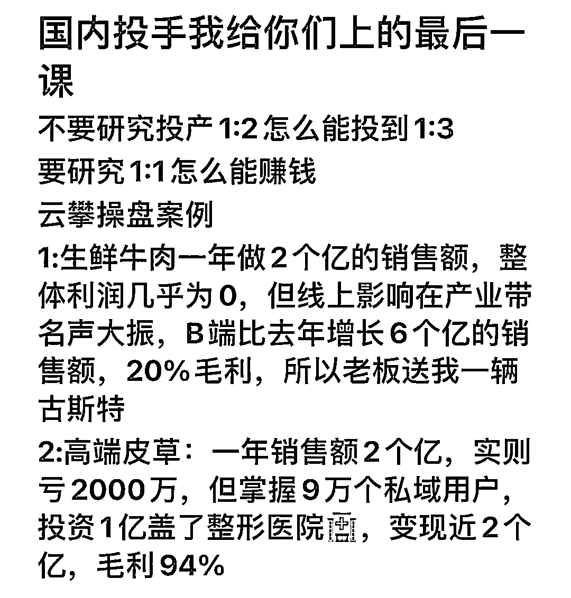

# 两次发售均三天内收款 200W+，我的浪潮式发售方法论全盘分享

> 原文：[`www.yuque.com/for_lazy/thfiu8/udrno5470gh6qvrb`](https://www.yuque.com/for_lazy/thfiu8/udrno5470gh6qvrb)

## (148 赞)两次发售均三天内收款 200W+，我的浪潮式发售方法论全盘分享

作者： 拱卒

日期：2024-01-08

目录

一、前言

二、一个前提

三、四个基本点

a.造势

b.预售

c.发售

d.升华

四、神之一手

# **一、前言**

大家好，我是你们的老朋友拱卒，**受益于生财的学习与启发**

**三年内公司从年入百万利润，到 23 年实现公司利润千万**

这次我来分享下我的年利润千万的私域流量营销之浪潮式发售方法论

一个前提+四个基本点+神之一手

我做私域曾经创造过两次 3 天内收款 200W+的记录，22 年一次、23 年一次....

在我创造这些方法论之前，并没有看过一些关于私域流量营销的书、理论、视频课程，都是顺着人性从战略角度进行的设计

所谓战略，就是基于宏观性和长远性，把各种纷繁复杂的要素按轻重缓急、先后次序进行整理排列，然后拿出最有效的行动方案，真正的战略家是要通盘考虑每一个阶段、每一个动作对于整体的贡献率

所以我不是理论家，也不是空谈，是切实的实战家有数据也有结果

那么从今天开始，我会把我的一些心法结合看到的（现在去看的）理论、书籍，尽量用书面化的语言和步骤呈现出来

但是说实话，这个东西得靠悟和实践，与此同时**更多的精力应该放到搞流量上，因为私域流量营销只是锦上添花，做不到雪中送炭，多把精力放在搞流量上，再把精力放在搞留量上，不要把顺序弄反，顺序弄完一切扯蛋；当然产品力更是核心中的核心，你能帮助别人多赚多少钱，你就能赚到更多钱;赚钱不是从别人兜里掏钱，而是多让他赚 1000，你拿多出来的 1000 的 100。可惜很多人也是把顺序弄反了**

我今天把这些核心的赚钱技巧毫无保留分享出来，也不是证明我比别人厉害，只是希望能帮到大家，希望大家都能超越我

## **二、一个前提**

发售的前提，是让用户预先感知到**你产品/服务的价值**，不然无论你的东西多么牛逼

你冷不丁的咔放出来也没啥用，只是自我感动，毫无艺术可言

当用户感受到你产品或者服务的价值时，**要引导用户做出行为决策**，例如引导给你点个赞，回复个 666，回复个 888 等等

这个怎么引导，要**具体问题具体问题**，不同的场景会有不同的方式，所以我开头说了，得“悟”

当然引导用户的行为决策，也有很多技术在里面，比如不同的好友标签，引导的行为肯定要有所差异

不同的场景、不同的用户群体、不同信任程度要做出不同的行为决策引导，只有这样把价值预知到位从而合理的引导用户做出了行为决策，就成功了一半了

## **三、四个基本点**

### a.造势

势能你可以简单的理解为能量场，你的势能是精神抖擞还是焉了吧唧的，**决定了用户怎么看你**

就像别人看我们的样子，往往是**我们看自己的样子的折射**，所以请你铭记这一点，一定要自己先打起精神，把自己的能量提升上来，再谈产品的造势

回到产品发售的造势，造势的目的是什么？答：**注意力。**用户的注意力在哪里钱就在哪里。所以抖音赚钱呀，因为很多人的注意力整天放到哪里了，时间就在那里了，钱是出卖时间换来的血酬，那**自然注意力在哪里钱就在哪里**

所以我们要造势，我们要吸引用户的注意力，我们要让他们感知到我们的产品感知到我们的价值

所以这个时候，产品虽然没有发布，但是你要对产品进行造势，例如说出产品牛逼的点、产品的差异化的点、产品能对用户帮助产生价值的点、产品的名人背书的点、产品取得的成绩点等等，占领用户心智产生关注

造势过程中也可以借势或者邀请 KOL/KOC 助势、关于借势，推荐金枪大叔《借势》这本书，能加深理解

造势过程中，有很多方法可以采用，我做的两次大发售，**用的都是倒计时发**，层层递减、循序渐进、**抽丝剥茧的展开**，每天进行一次势能增加，然后发售的时候进行爆发

### **b.预售**

预售非常重要，甚至我感觉比发售都重要，**普通人改变结果，优秀的人改变原因，顶级高手改变模型**

发售过程中的高手，就是在预售阶段，已经把客户成交的差不多了，预售的背后是对用户标签管理，造势过程用户心智把握的极大考验

因为在一个前提和造势的过程中，其实潜在用户会跟你的行为，同时做出多个行为决策。那么这个阶段其实很多人你已经知道他对你的产品感兴趣了，那么这部分人就可以提前进行预售了

而且这部分群体，可以给予一定的优惠或者小产品的赠送，进而引导提前转化

预售的过程一定要一对一精细化聊天进行销转，因此这里的每一位用户，都是你的”轻铁杆“用户，值得你去仔细的了解他的需求、他的疑惑、他的问题等等

这个预售过程，往往是转化率极高的，即为有效的，所以在设计倒计时的这几天，其实你应该收的差不多了

当然你要把发售文章或者视频精心打磨好，我的两次发售，文章打磨时间都是超过一周的，这里的每段话，每层逻辑都要推敲思考，牵一发而动全身，至关重要

### c.发售

发售是一场电影的高潮，这是爆发的一个阶段，往往呈现方式是开直播做发售、公众号文章做发售、海报进行发售等等

我个人建议使用公众号文章或者直播，特别是有条件的一定要用直播的形式，因为直播会极大的拉近距离，提升信任感，**我们做生意无非究其一生都在跟信息不对称和信用不传递做抗争**，凡是能打破信息不对称，能拉近信任的方法都是好方法

如果你是用文章，那就如同预售中说的一样，一定一定得精心打磨，**不管是文案还是产品力塑造甚至情绪价值的渲染**，都要思考和设计做到极致，**追求卓越我们才能创造卓越**

关于发售，又有很多小技巧，例如“今天不买明天涨价”、“满多少人涨多少钱”、“买这个送什么东西”、“组团优惠”等等这些设计。这些都是基于人性的，但是还是那句话，具体问题具体分析，不同的销售场景、不同的产品、不同的人群，所用的策略都是不同的。可以多看一些心理学书籍，多看一些史书，启发更多对人性的思考，进而学会顺着人性赚钱，逆着人性让自己的产品让自己值钱

### d.升华

有始有终才是一场成功的发售，完成了一个前提+三个基本点后，这个时候就是休整战场的时候了，这时特别要注意前三步打好的用户标签，对于不同的标签用户进行不同的销转，例如咨询过很多次，但是没成单的；例如付了定金，还没付尾款的；例如要介绍朋友来，还没介绍的等等

不同的标签用户，这是要进行精细化的跟单追单，把一个前提和三个基本点所触达和有用户行为决策的好友发挥到极致

当然这些公域还有一些没有触达或者行为决策的好友，我们要进行后续反复的触达，这时的触达，就可以屏蔽掉已付费的用户，避免进行打扰，这些小细节也要用心注意

对于公域留存的好友，我们可以不断的释放产品力，释放付费用户的反馈甚至成功案例等等进行一个长周期的转化

这里也要切记不能一根筋，因为无论你的产品再牛逼，肯定对于大部分好友是不太感兴趣的，我们能服务的，也只能是小部分人，**放低预期，摒弃玻璃心才能沉下心做好交付**

## **四、神之一手**

对于每一位付费的用户，一定要认认真真踏踏实实的做好交付，例如我本人，会设置一个专门的 VIP 微信，所以付费的我都会导到这里，这个微信是我的第一优先级大于个人生活私人微信

为什么要这些，第一，客户确实是上帝，做好服务是我们的根本是第一要义；第二，维护好一个老客户比拉新十个新客户的价值到大的多。你在成就客户的同时就是在成就自己，**你能帮助别人多赚多少钱，你就能赚到更多钱;赚钱不是从别人兜里掏钱，而是多让他赚 1000，你拿多出来的 1000 的 100**

所以为什么要讲利他，因为一切基于利他的模型设计，都是多方共赢的结果

所以神之一手是什么？是客户的**终生生命周期价值管理**

举例哈，我本人的基本盘是大学生，我现在有接近 10w 的大学生私域流量，在这个过程中，会产生很多付费大学生产品的用户

其中一层层筛选，我们把产品服务价值给他做好了，他买了 1 次还会买其他产品。我们这边有很多，买了创赛资料的，还会买数学建模辅导，还会买保研服务，还会买付费内推还会买考研伴学或者留学服务，还会买我的论文辅导，等他毕业了还会买关于赚钱的实战营，甚至还会买合伙人等等

这一路无疑是对他帮助很大，对他产生了价值，他有了信任才会持续跟我们的。只要基数最高大，服务足够好，给客户产生的价值足够大，这一整个业务链条的筛选人数也是很可观的。我们这边甚至有部分用户，单人产值过 50w（5 年）

所以我们持续不断的大学生私域，可以让我公司估值越来越高，盘子越来越大，流量越来越多，例如别人在搞创业粉的时候，我不搞，我去培养和筛选，虽然时间很长，但是回报率极大

所以很多人看不懂我的业务盘，看不懂我是怎么做到私域千万的。就是因为这“神之一手”这个看不见的手，可以把利益与价值发挥到极致，进而把客单+终生价值挖掘到极致

分享一个图片，看不见的“战争"才是最牛的，能被看见的都是高手的冰山一角，因为这不是一个维度的竞争

更多的阅读体验请看飞书

[`tuhr2ryzy9.feishu.cn/docx/YdTkdmxfmoFpjRxCcmXcgANInTg?from=from_copylink`](https://tuhr2ryzy9.feishu.cn/docx/YdTkdmxfmoFpjRxCcmXcgANInTg?from=from_copylink)

最后再次感谢生财感谢亦仁哥，从加入生财到现在一直都紧密的从生财学习

也感谢一路上支持帮助我的人，希望给你们创造更多价值

* * *

评论区：

Miss 董｜依依妈 : 学到了[呲牙]，感谢拱卒大佬分享
张可粒 : 前排占个位置，最近也在琢磨如何从百万跨越千万量级！跟拱卒学私域操盘！
拱卒 : 互相学习[抱拳]
拱卒 : 加油
维生 : 佳哥牛🐮！！
柏阳 : 佳哥太厉害了[强][强]
拱卒 : [玫瑰]
拱卒 : [玫瑰]

* * *