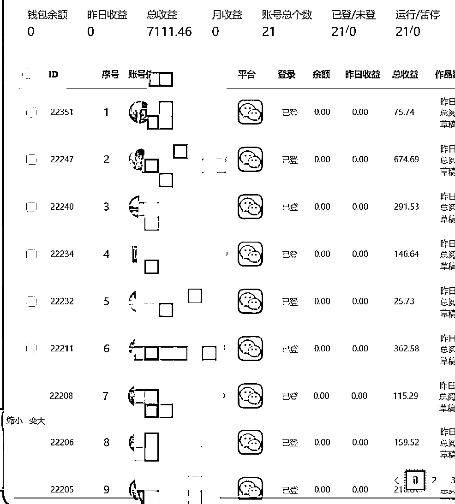
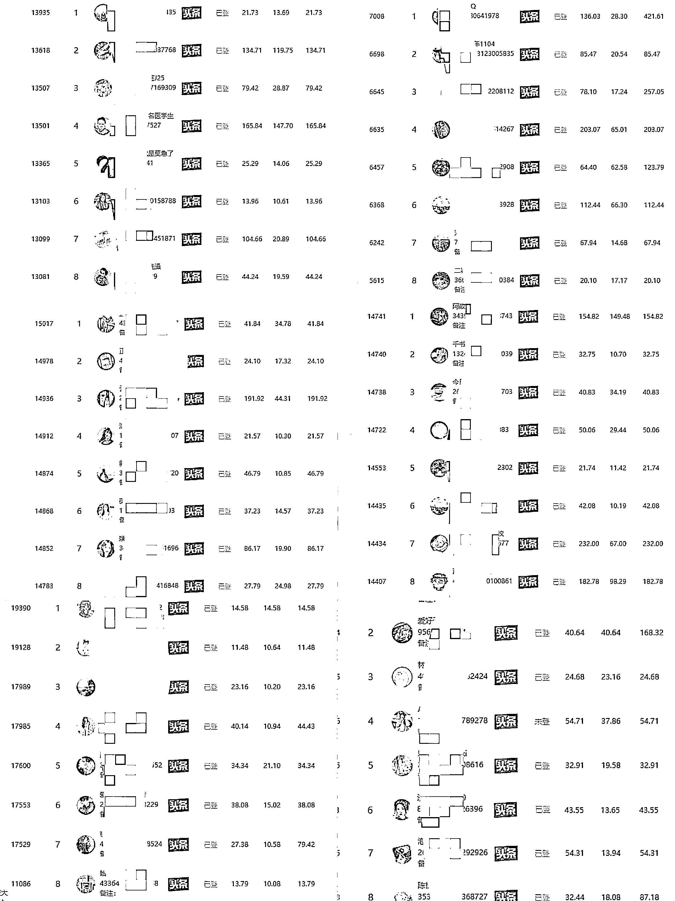

# 公众号头条爆文，适合小白和不愿意动脑的矩阵玩法

> 原文：[`www.yuque.com/for_lazy/thfiu8/fspu96cg2606ng2k`](https://www.yuque.com/for_lazy/thfiu8/fspu96cg2606ng2k)

## (60 赞)公众号头条爆文，适合小白和不愿意动脑的矩阵玩法

作者： 高不浅

日期：2024-01-08

公众号头条爆文，适合小白和不愿意动脑的矩阵玩法如何月入 10W+

自我介绍和项目简单介绍

大家好，我是一位在西安的 00 后圈友，加入生财快一年了，但是基本都是在潜水，本次文章除了向大家分享一下公众号和头条爆文小白和不愿意动脑的矩阵玩法外，也想锻炼一下自己的写做水平，第一次写文章，如果有不清楚或者表达有误的地方还望各位哥哥姐姐海涵！

生财一直是我用来获取最新的互联网资讯，项目拆解的第一来源。我闲下来没事就会刷 风向标，里面各位圈友提供的信息总会带给我一些惊喜。

这次项目是我在 8.9 月份在风向标刷到了大量的公众号流量主，头条流量主的帖子，并且亦任大大也在 8 月 7 日发布了他对公众号爆文的精准预测，出现了赚几十万的公众号流量主收益的案例，我越发觉得这个赛道可以尝试一下。航海项目里出现公众号爆文写作这个项目的时候，我是非常想参加的，因为我觉得圈友和亦任大大的眼光没问题，但是由于我还是一位在校大学生，时间上有所冲突，错过了航海的这艘大船。

当参与航海的哥哥姐姐们晒案例的时候，我是库库拍大腿啊！好像错过了一个亿！哈哈哈，夸张了哈！
但是我对自己还是有起码的认知，原创写作！自己排版配图！我估计我是一定做不了的！手残党的痛苦谁明白！而且我确实没有那么多的时间去动脑子写原创，于是我想到了一个法子，既然原创我搞不定，而且起号充满了不确定性，那我直接做一个勤劳的“搬运工”就行了呗！

不想动脑子写原创，我把其他平台上的爆文批量下载下来，然后用 AI 去批量洗稿达到伪原创的文章。不想慢慢起号，我直接批量去搞了 20 几个公众号一起发！主打一个批量哈哈哈！这应该就是大佬们说的矩阵吧。
质量不够，咱们以量取胜！然后你们猜怎么着？从 0 到 1 还真被我跑通了！一个月收益 10w+！

既然这个玩法可以玩，那我也不介意分享出来，也希望认识一些哥哥姐姐可以互相学习！
飞书通道[`mqy7qm4fm6j.feishu.cn/wiki/OgzWwEDK3iirE7k2huPck6xMnuN?from=from_copylink`](https://mqy7qm4fm6j.feishu.cn/wiki/OgzWwEDK3iirE7k2huPck6xMnuN?from=from_copylink)

* * *

评论区：

是 Vivian 呀 : 这个工具真心不错
alex27 : 这个工具可以付费使用吗？
泡泡邮递员 : 光是账号批量注册实名就难倒百分之 80 的人，没有这软件一个人管理十几个号更是难上加难
高不浅 : 可以
高不浅 : 注册我们都是自己引流，然后让引流来的粉注册上号给我们托管，利润 46 分
D's-hubby : 这是啥软件呢？
老七 : 请问做的什么领域，我之前用 4 个账号伪原创公众号的情感豹纹，做了大概 2 个月没起来，就放弃了，不知道是不是领域选择的问题
随心远行 : 打不开啊

* * *