# 小红书商业知识体系｜年入百万的数据验证方法论

> 原文：[`www.yuque.com/for_lazy/thfiu8/fyg7787wp3ykms19`](https://www.yuque.com/for_lazy/thfiu8/fyg7787wp3ykms19)

## (精华帖)(194 赞)小红书商业知识体系｜年入百万的数据验证方法论

作者： 徐宿

日期：2024-01-12

除了下场实操，大家需要更系统和简单的方法论，我这套大概率会对你有用。

过去的半年多，我和两个小伙伴去小红书实测，用这套知识体系做了不到 100 万 gmv，利润大概 50 万。

我觉得我这套知识体系在其他平台也通用，可复制性极强，因为够底层，希望更多人能用到这把剑（每一个环节都制作了思维导图）。

这篇文章会包含：

**1、选品的本质**

**2、选题的本质**

**3、网感的本质**

**4、交易的本质**

**5、商业写作的本质**

**6、数据分析的本质**

先展示一些成绩证明：

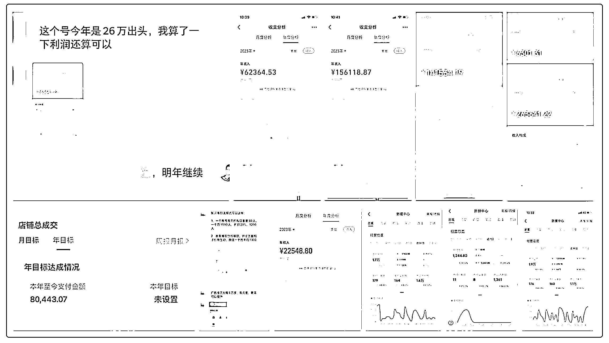

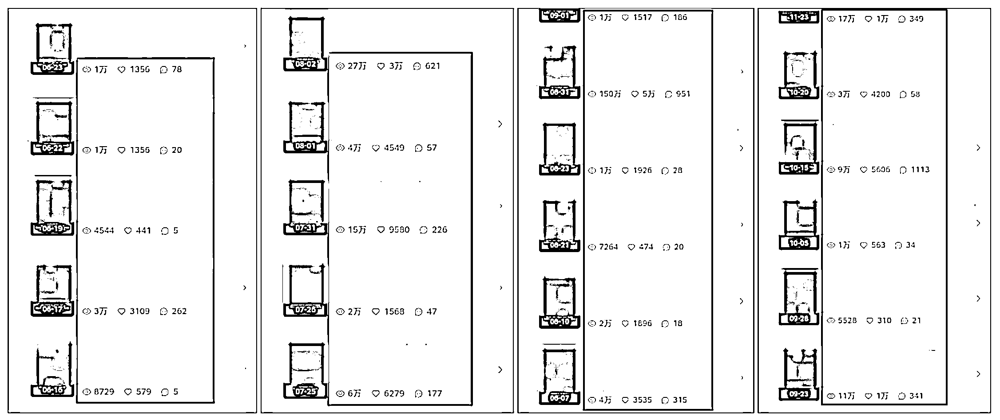

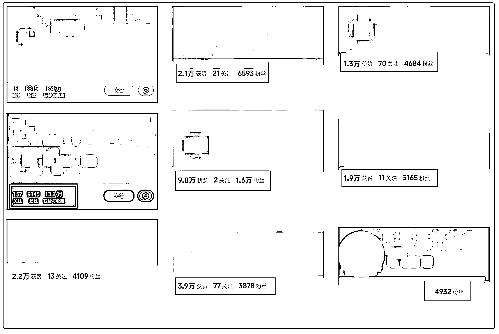

这些数据真实可查，其实也不是什么了不起的成绩，只是想说我的方法论经过了实战验证，大概率能增加你赚钱的成功率。

# 第一部分：小红书整体的商业知识体系

# **世界观**

我以前在《创业的本质》一文中说过，创业就是创造一套经济系统，赚到钱只是系统中一个重要环节。

在此之前你还要了解很多基本的知识和条件，是那些基本条件的凑足，导致了「赚到钱」，而不是随便听市面上一个鸡汤故事，比如熬过吃糠咽菜的日子真诚感动上天的话，就能赚到钱，这很扯淡。

新手去小红书创业或者做副业，我认为必须要理解 2 个重要的概念：**价值交换、交易理由**。

**价值交换**

一切生意都要围绕价值交换来实践，这是商业的第一原理，如果有人跟你说不需要思考价值交换，那么他的职业多半是劫匪。

你要去小红书赚钱（或者任意其他平台），首先要思考的就是你要怎么和别人进行价值交换，对于小红书来说，你至少需要和两方进行价值交换：**平台&读者**。

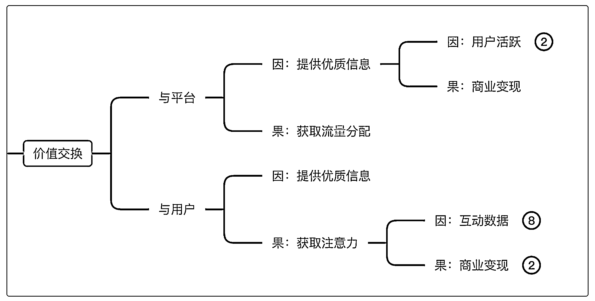

咱们圈友里有很多野路子朋友，总是想着怎么去免费的疯狂薅平台流量，其中确实有牛逼的人能薅、能抢的到，那是人家的本事。

但更多新手和普通人没本事，却想要处处钻漏洞引流，那你就等着做一个号死一个号。

我可以把有效引流的方法都提供给你：

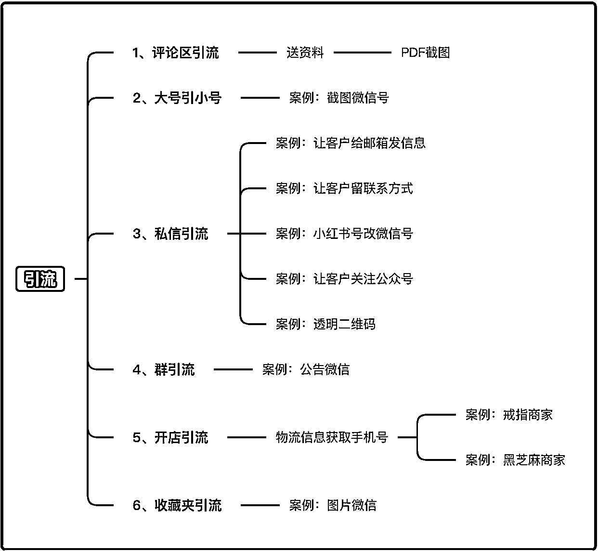

但你是否能承担得起账号的损耗成本这是个问题。

理解「价值交换」的第一个意义在于，它可以让你知道凡事都有代价，赚钱是一个利弊权衡的过程，空手套白狼并不容易，你必须付出点什么，哪怕只是投入时间（其实时间才是最大的成本）。

**与平台交换**

创作者要发起价值交换，首先必然是与平台在进行价值交换，因为你是以平台为媒介进行你自己的经济系统构筑。

而平台也是人做的，它也需要承担天价的服务器维护和产品开发运营成本，所以你必须看懂平台的需求。

**1、平台到底有什么需求？**

很简单，平台的核心需求之一也是赚钱，也需要活下去。

**2、平台是如何赚钱的呢？**

通过看小红书的年财报相关信息就能知道，支撑它继续活着的主要因素是：资本支撑、广告抽成、电商服务。

**3、那他为什么能从资本、广告、电商这些地方拿到钱？**

这就涉及新手不容易理解的知识：**注意力资源**。

经济学的一个基本假设是这个世界上的资源永远是有限的，比如全中国一共 14 亿人，每个人一天 24 小时，平均能够用来刷各种 APP 的闲暇时间可能不到 4 小时，那么把所有人数乘以这 4 个小时，就能得出一个国民总时间资源。

一切交易都需要时间。

想要促成任何交易行为，必然需要时间投入，时间背后就是人的注意力资源，你日常在抖音或者拼多多买东西，不可能看到什么眼都不眨就买什么，你总需要对那个东西进行一番了解，产生了基本的信任和价值判断才会去消费。

**4、那小红书的时间从哪里来？**

不就是从每个用户身上拿么，资本之所以愿意支撑小红书，品牌之所以愿意出广告费，不就是因为小红书本身的用户规模大，有时间（注意力）资源么。

所以，站在平台的角度考虑，平台需要的是维护庞大的用户活跃度，有了活跃量就说明全国有很多人的注意力被拿捏在这个 APP 上，当国民对它有了注意力的投入，资本、商家就能通过这个池子持续获利，就愿意给小红书钱、给广告费。

而基于平台需要用户活跃度的诉求，创作者就需要源源不断的提供优质内容，只有优质内容可以让用户花大量的时间在小红书，当小红书有了用户的注意力就可以拿去卖钱，作为回馈，你的内容越优质，小红书给你推的流量越多。

**6、那小红书如何判断内容优质性呢？**

总不能人工一条条审核吧，于是它开发了各种内容价值识别的技术功能，大致的因果逻辑是下面这张图：

**5、你和平台交易什么？**

你作为创作者与平台交换的，至少是你的时间成本，你用时间创作内容跟人家换取曝光量。

而且，小红书绝对不是你亲爹，也不是因为你的内容好所以很想赏赐给你流量，是因为你的内容对它的用户有价值，所以他必须给你的内容推更多用户，不然它也要承担用户流失的代价，这是比较平等的一件事。

**6、那小红书如何判断内容优质性呢？**

总不能人工一条条审核吧，于是它开发了各种内容价值识别的技术功能，大致的因果逻辑是下面这张图：

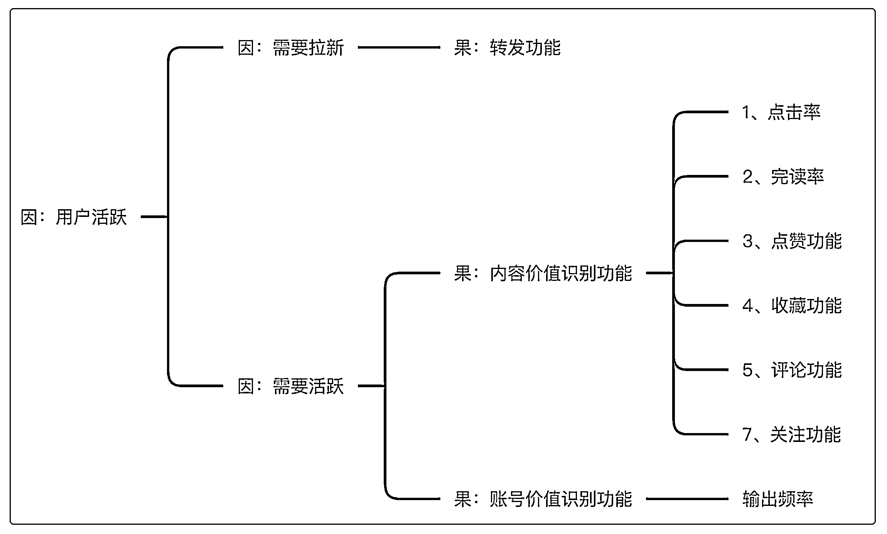

按照这样一种思考方式，你就会知道每一个功能背后意味着什么。说白了，学习是一个祛魅的过程，赚钱最终都会基于各种因果关系顺理成章的发生。

  **与读者交换**

人是一种信息动物，我们的大脑每天都需要吸收各种信息来提醒自己还活着，还能思考，还能知道我是我。

基于这个需求，创作者通过平台发送优质信息出来，一步步吸引到读者阅读，这个过程就是获得读者注意力的过程。

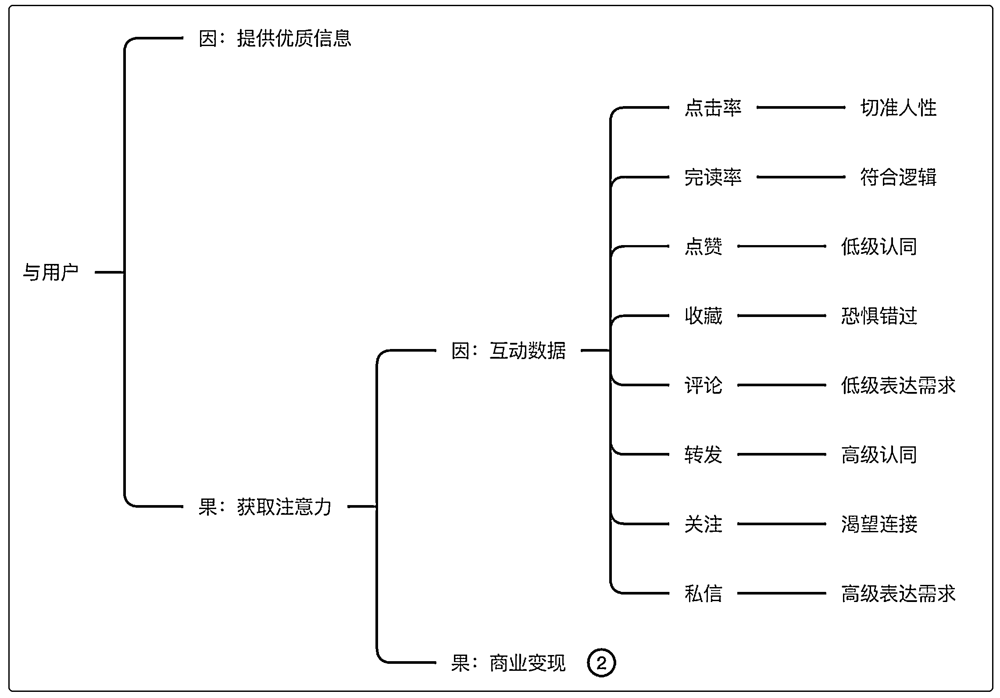

当你的内容被平台推送给陌生读者，他们会依次通过互动行为对你的内容进行价值反馈，小眼睛点击是最浅层的价值反馈，后面的完读、点赞、收藏、评论、转发、关注、私信甚至购买产品，是逐渐认可价值的一个过程。

这就是凯文凯利为什么说那句话：**目光所及之处，金钱必然相随**。

小红书 APP 的每一个功能，都有或大或小的意义，都是用来让你反思自己内容价值的，没有人因为你随意发篇内容直接给你钱，这和现实中你在路边看到一个东西不是直接冲上去给钱是一样的逻辑，又不是二傻子，总需要一个了解和信任的过程。

任何一个想要去小红书做生意的创作者，不是单纯的创造好内容就够了，你必须尽量同时满足平台、用户以及自身利益三方面的诉求，才能长周期的在上面赚钱。

理解了价值交换，就能理解平台的各种功能和数据，理解平台的功能和数据，你就可以通过观察数据来指导行动。

这是最重要的一条因果链，理解以后可以大幅度提升做事的成功率。

**交易理由**

交易是一种互动行为，想要同时满足多个端口的价值交换诉求，就需要把「交易」这两个字进一步理解。

交易，不只是一手交钱一手交货，刚才说过，用户首先付出的是注意力，你投入时间写内容，他投入注意力看你的内容，这本身就是一种交易。

虽然，我们最终的目的是和用户完成金钱交易，但在此之前，其实暗地里看不到的地方，你需要先和用户完成一场场注意力交易，整个过程大致如下图：

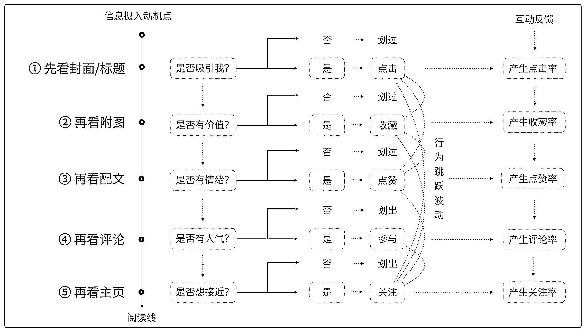

上面这张图中，每一个环节都涉及内容的制作。

是因为你产出了有价值的内容，然后用户觉得值得投入时间，于是他的注意力不知不觉被你获取。

而在此之中，如果你还想让他投入金钱和你产生交易，那么在他投入时间看你内容的那段过程中，你需要激发他的购买欲。

所谓交易，就是一连串互动行为，交易的本质就是持续的产生互动行为，对于小红书来说，整个旅程的因果关系是这样的：

因为封面切中了他的信息获取需求，所以他**点击封面↓**

因为内容很有价值，所以他通篇读完↓

因为一下子看不完，所以他得收藏起来↓

因为很有共鸣，所以得点个赞↓

因为还有一些因为，所以他要在评论区留言↓

因为感觉你有价值，所以点个关注↓

因为你卖某个东西，所以他**付费购买。**

没做过生意的人，总以为交易不就是你买我卖极其简单的事儿嘛，是，确实简单，但真实的交易并不是瞬间直接发生的。

真正的金钱交易来自于你与客户事前千百次的回眸对望，需要多个回合，需要用放大镜来看。

每一个环节，其实都需要一个互动理由，你的每条内容必须创造这种理由，主要包括：**点击理由、收藏理由、评论理由、关注理由、购买理由**等。

你得给你的读者创造理由，给他创造一个无法拒绝互动的理由，才能和他产生一系列交易行为，直到最后完成金钱交易。

请不要把这句话念出来：**我会给他一个无法拒绝的理由**。

我相信赚小钱是可以通过科学和努力实现的，而「**提供正确的互动理由**」就是那个让赚钱逐步成为 100%发生的核心因素。如上是我认为很重要的两个概念，下面直接上做小红书的整体方法论。

# **方法论**

做小红书（或者其他平台）的核心流程非常简单，主要分为 3 个环节：**挖掘需求、制作产品、交易运营**。

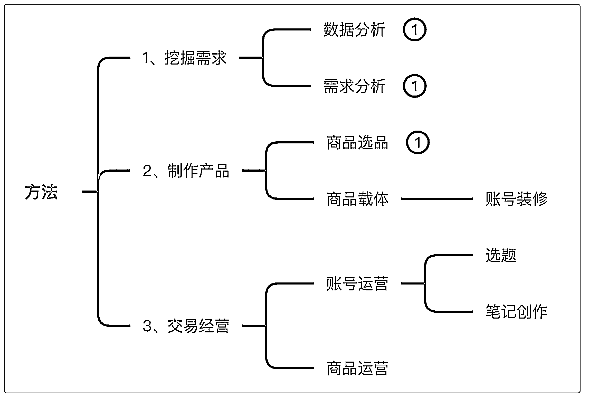

**环节 1：挖掘需求**

要赚钱，就要去交易，要交易就要知道有没有市场需求，没有需求就没有交易。

新手去做小红书，由于没有标尺和方法论，总习惯按照自己的喜好来做内容。

比如我 1 年前做小红书，自以为是的选了一个小众赛道，吭哧吭哧做了两个月实在没反馈，阶段性放弃了。

你按照自己的喜好做内容，发出去没数据反馈很正常，因为按照自己的喜好做事满足的是自己的需求，而不是别人的需求，没有人为你的喜好买单。

这就是为什么很多小红书培训老师建议新手先找对标账号和对标模式的原因，**对标找得好，弯路走的少**。

**为什么在早期必须找对标？**

因为对标账号为你验证的商业逻辑，验证了市场上有那个需求。

正如查理芒格说的那句话：**钓鱼有两个原则，原则一，去鱼多的地方;原则二，不要忘记第一条原则**。

同时，需求也有不同层次的分类。

这些层次我在上文「交易理由」环节说过一部分，比如最浅层的需求是阅读需求，用户只想免费看你的内容，比如各种搞笑段子，恋爱技巧，只点赞收藏就是不给钱；

比较深层的需求是解决足够痛的现实和精神障碍，比如家里洗衣机坏了该怎么买新洗衣机，比如学习成绩不好怎么办、冬天太冷想买个羽绒服怎么选等等，这种需求他们会评论、关注、私信咨询、甚至直接购买。

你要想办法弄清楚你到底解决的是什么层次的需求，能的话尽量找离钱进的需求。

挖掘需求涉及两个核心技能，一个是数据分析能力，我会在下文**【数据分析的本质】**环节中详细说，另外一个是「需求分析能力」，以后会单独写一篇文章，这两个能力虽有交集，但本质不同。

**环节 2：制作产品**

要赚钱，就要跟别人发生交易，要交易就得给别人一些东西，这种东西就是大众所说的产品。

通常我们认为产品是一种商品，比如鞋子袜子裤子等等，但我在下文**【选品的本质】**会说到，产品是一种解决方案，商品只是产品的一部分，这块儿的方法论等会儿会写在那部分。

**为什么一定要区分产品（解决方案）和商品？**

因为有价值交换原则的存在！如果你区分不清楚产品和商品的区别，你在做事的过程中就会少算一部分成本。

比如抖音有很多美女小姐姐，在平台上发黑丝照片特别容易吸引流量，只是因为自身没有好的商品去变现，做着做着就倒闭了。

如果反思他们去做账号的成本，其实每天只是花花时间拍照片，并不付出什么成本对吧？

但实际上，他们付出的时间成本、机会成本都属于「产品思维」中最高价值的成本，如果你只有商品思维，根本看不到这些损耗。

制作产品，即包含怎么选择商品，也包含你的小红书账号装修，因为小红书的账号本身就是你给用户提供解决方案的一个载体。

就像是你在线下开商店，你本身卖的是商店里面的商品，但如果你商店装修的不好，那你的商品可能也卖不了高价，而如何装修小红书账号我在文末会提供方法。

**环节 3：交易运营**

挖掘需求是为了确定有市场需求，制作产品是为了确定能解决需求，剩下的就是持续的进行交易运营，这是一个长久的事情。

为什么要叫做「交易运营」？

因为我在上文说过，「交易」是一系列的互动行为，有些环节你可以借助工具完成，比如当一篇笔记发出去以后，点赞、收藏、关注等等互动行为是用户和小红书 app 本身可以自动化完成的；

但有些环节你需要人工去运营，比如一篇笔记发出去以后，你得安排小号去做评论区的引导，再比如有人评论和私聊咨询你产品怎么买，你得进行人工回复，人工引流到私域。

类似下图这样，都是精准意向，如果你不去回复引导，就没办法进入后续的交易互动环节：

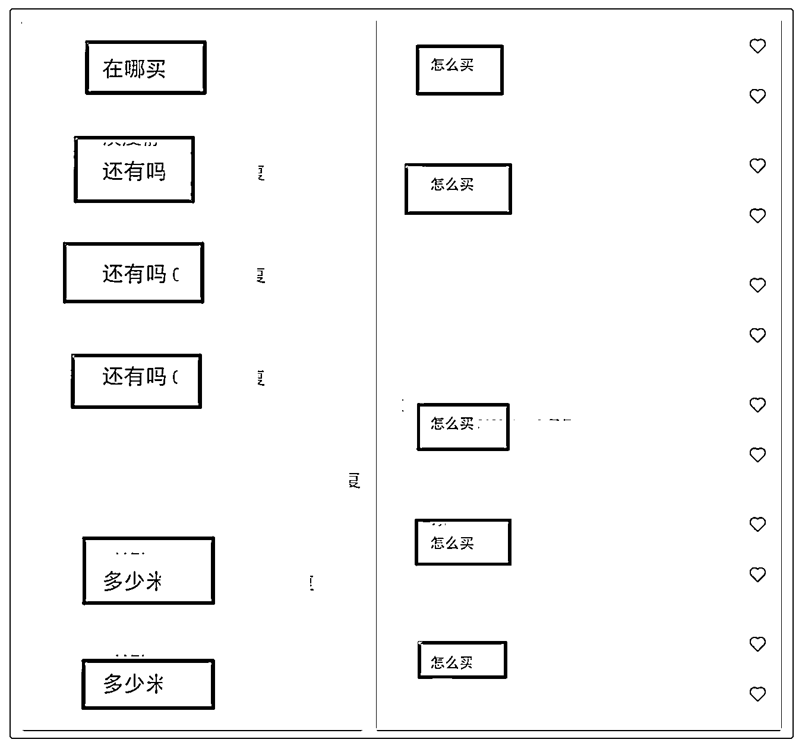

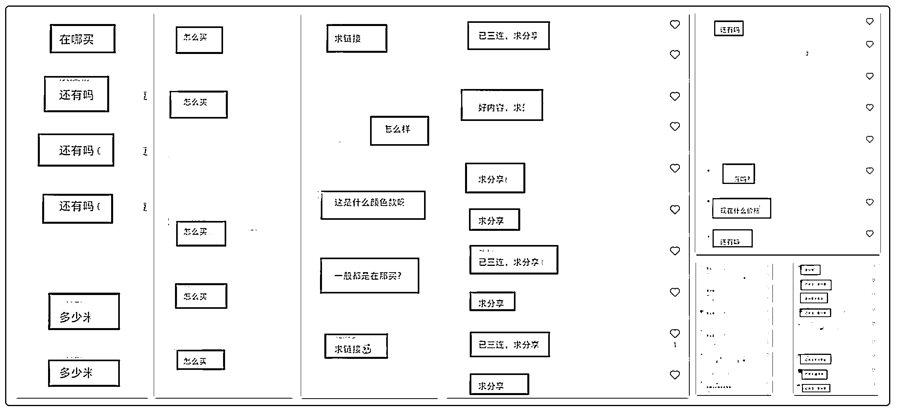

上面那段话中有几个关键词其实是提高你「内容推流量」的核心秘诀。

**交易运营**主要分为「账号内容运营」和「商品交付运营」，前者就是负责输出内容获取流量，后者负责接待客户进行金钱交易。

账号内容运营的重点我等会儿会在《商业写作的本质》，《选题的本质》和《网感的本质》3 篇文章中分享，而关于商品运营，我以后会单独写文章分享。

如上，构建一套小红书商业经济系统涉及的三个核心步骤已经说完。听起来非常简单，挖掘需求、制作产品、交易运营，只需要 3 个步骤，但其中最少涉及 8 个重要环节其实都需要你实操去经历。

下面是每个环节更细节的世界观和方法论↓

# 第二部分：选题的本质

# **选题不对，内容白费！**

2017 年过春节，跟着我爷爷给他家贴对联，贴到最后还剩一张「福」字时，老人节省的毛病犯了，非要把它贴在本已有一张福字的门墙上。

我愣跟他掰扯了半个小时，谁也说服不了谁，由于审美不同，我认为摆俩不对称的福字放在大门口，一点儿也不美观；他则认为两个福字非常好，可以提升家人今年的幸运度。

没多久我姑姑来送年货，只说了一句话「贴多了会**破财**」，老爷子立马跟听见瘟神上门似的，赶紧把刚贴的福字撕扯掉。

多年以后的今天，我经历渐长，意识到每个人都有自己的一套认知框架和语言体系，想要说服或者吸引别人听你的话，必须先要挖掘别人大脑中的记忆痛点关键词，挖掘的过程，就是选题的过程。

# **选题的本质**

如果我们把人脑中的记忆点抽象成二维图像，每一个事物的概念词占比权重各有深浅，大概可以看到这样一副画面：

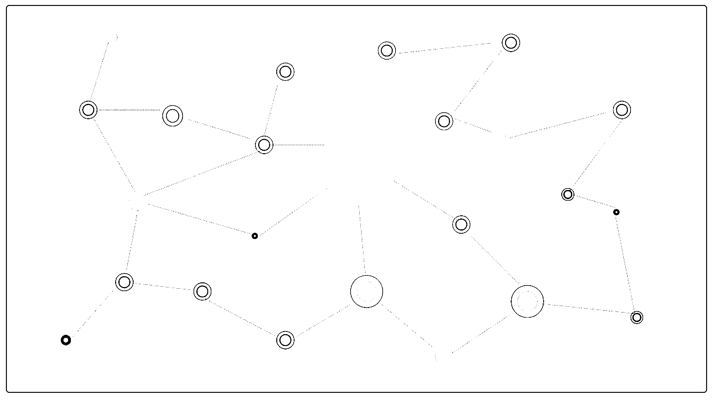

在每个人的大脑中，对于不同的词语概念的记忆深度是不一样的。

比如我爷爷对于「破财」这个词的印象和恐惧度特别深，那么在他的大脑中，涉及到某些领域的沟通时，很有可能「破财」这个词就是最红最痛的那个大圆点。

如果一个人对某些词的记忆深浅图谱如上所画，那么你去统计一堆人的图谱，就能知道这个群体的记忆图谱：

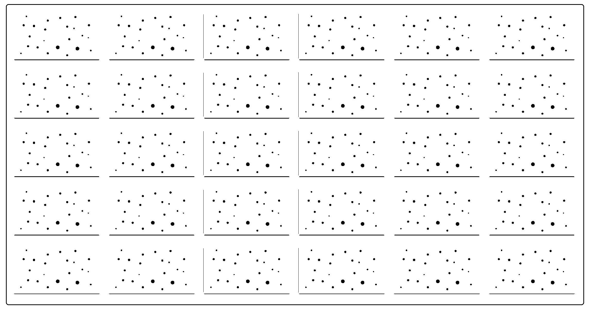

数据量够大的时候，你就能发现某些关键事物、词语、问题，是大多数人都印象深刻、非常在意、有本能的想要了解和点击欲望的。

我们把「多少人在意」称为「**共识度**」，共识度越大的话题和知识点，内容写出来后能覆盖的人群就越多。

所谓选题，就是基于这种思维，去选择尽可能更大范围的共识痛点，或者尽可能精准的共识痛点的过程。

一个流程要承担一个流程的责任。

选题要承担的责任，是尽可能吸引更大范围或更精准的用户群注意力（具体是吸引更多人还是更精准的人需要取决你的目的）。

掌握了选题的底层方法，你可以让你的内容获得更大的基础阅读人群、或者更精准的读者群体。

# 选题的做法

我下文会在【选品的本质】模块说到一个概念，人之所以要做选择，是因为资源有限！。这里也一样，内容的创作是需要付出时间成本的，早期需要尽可能围绕回报率高的共识痛点去创作，你才能快速做起来一些账号。

选题的做法主要分为 3 个环节：**搜集案例、分析案例、实战测试**。

**第一个环节：搜集案例**

选择要基于大量的数据样本，没有数量，就没有选择空间。

拿小红书来举例子，你想在那个平台快速做出一些自媒体账号，就需要先了解某个群体的共识痛点，挖掘这些共识痛点最快的方法是先搜集一批对标账号和内容。

有一种简单的执行步骤：直接在小红书主页的检索框，输入该领域的关键词。然后在「综合」和「最热」里面，从前往后取 20~50 位博主，进行筛选搜集，爬取这些对标博主的所有笔记。

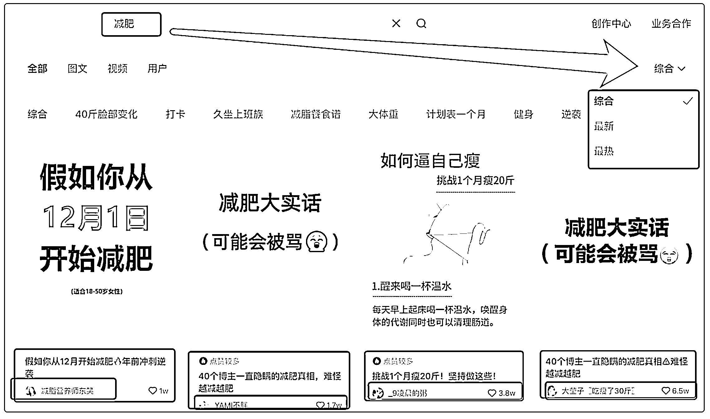

注意，这一步我在梨云的指导下学到一个很重要的知识：你搜集案例的时候，应该通过**搜集对标博主的全部笔记**，而不是用「标签链接」去搜集「优质笔记」来找你所在领域的共识痛点。

因为对标博主，通过以往发的内容，形成了垂直账号，帮我们验证了哪些是共识痛点，而直接爬某个话题标签的选题，你看到的当然全是爆款，根本不存在选择。

案例的搜集入口和方式有很多种，但最终的目的，是沉淀一套我等会儿会在**【网感的本质】**模块儿提到的选题库，模板如下：

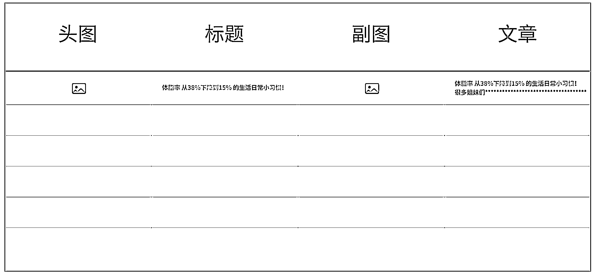

直接去用飞书之类的云文档持续搜集就行，当你搜集到了足够的优质案例，接下来就可以进行共识痛点的挖掘。

**第二个环节：分析数据**

经常听互联网很多自媒体培训老师讲「爆款内容」和「爆款选题」，我习惯把「爆款」这个词换成「**异常值**」。

爆款透着玄学的味道，运气成分比较重，而「异常值」听起来比较科学，普通人只需要对比数据就能判断，容易落地执行。

分析数据的目的主要是挖掘「异常值」内容，通过对点赞量、评论量等数据的对比，筛选出那些数据高的内容，其中就藏着共识痛点，痛点即是需求。

关于简单需求的分析模板，等会儿会在**【网感的本质】**模块儿进一步讲解，现在先把模板给你：

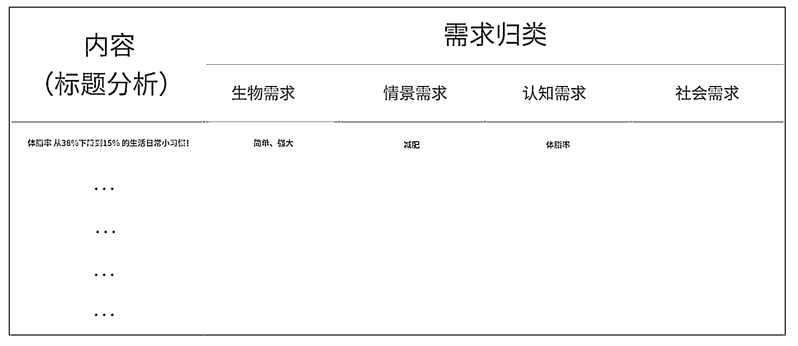

当分析到一定数量，比如 50～100 个共识痛点，只需要对数据进行归类整合，一个你想要做的垂直领域的选题库就出来了。

  **第三个环节：实战测试**

这一个环节就一个动作：**落地去测试**。

凡是涉及到改变别人的事情，都需要真实经历，才能拥有自信的体感，那种支配和掌控世界的权力感会令人着迷。

人是一种惯性动物，经济学有个效应叫做路径依赖，当你做一件事有正反馈的时候，你第二次做的时候还是会模仿第一次的方法，因为这样做事的成本会大大降低。

如果不实战迭代，你就没有正反馈，没有正反馈，根本就无法坚持。认真反思我过去取得的一些成绩，并不是说我能力有多么的厉害，只是我确实热衷研究那些东西，乃至于热爱和痴迷。

附送这部分的知识体系导图：

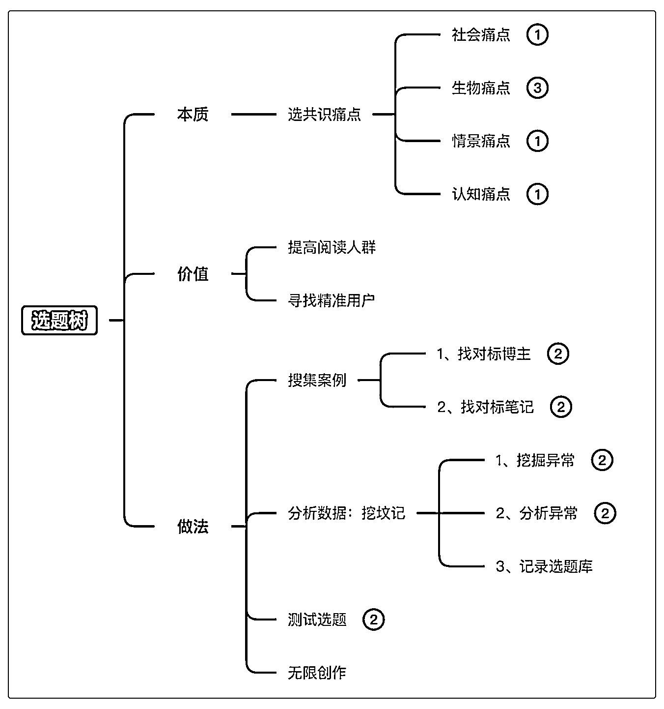

# 第三部分：网感的本质

2008 年，我被同桌带着第一次去网吧上网，120 平左右的房间里密密麻麻挤满了电脑，出于对陌生环境的警惕和恐惧，我紧紧跟在同桌身后。

他和我同年同月，但个头比我高，见识比我多，行走在这种鱼龙混杂的小世界里，不管对面碰到的人是旧相识还是陌生人，都能在只言片语之间观察到对方成色，在给一片口香糖的功夫里拉近关系，打成一伙，称兄道弟，而后把我介绍给别人认识。

那种游离在小孩子的人情礼往之间，彼此神交意会，心照不宣的能力，当时令我很羡慕。

你不得不承认，有些人从小就擅长在现实社会跟别人打交道，他们能通过一些简单的言行，精准的把握住对方的社交风格和需求，然后采以对应的模式迅速跟对方建立关系。

如果把这种感知对方状态和采用对应行为模式的能力类比到网络上，我想，就是互联网人所说的：**网感。**

有网感的人，在网上随意发一篇文章，都很容易火，没有网感的人就像现实世界中那些木讷的呆孩子，很难跟别人展开深度互动，掀不起任何信息风浪。

今年 6 月份，我开始研究如何训练网感，大概花了 2 个月时间，通过在小红书发笔记，连续创造了 20 多篇爆款笔记，爆款率 98%：

  

这是当时做到的一些数据。

# **网感的本质**

内容是一种产品，不论是短文、长文、视频，在商业市场中，他产生的目的首先是为了获取读者的注意力。

如果我们把读者拥有的「注意力」看成一种货币，那么读者为什么要消费注意力来阅读我们的文章呢？

答案很简单，**因为我们的文章可能对读者有价值**，只有有价值的内容，读者才愿意花费时间投入注意力来看你的内容，否则没有人看你。

对于创作者来说，**网感的本质就是内容价值感知力**，你能站在读者的角度，感受到什么样的内容我一定会点击，一定会点赞、评论关注，那么你就有网感，否则你只能自嗨。

# **网感的训练方法**

把内容看成产品，那么读者就是你内容的用户，你必须理解你的用户在想什么。

俞军在《俞军产品方法论》一书中对于理解用户有这样一段话：

“

我们说的理解用户，是要从具体的个人去积累一个一个案例，因为每一个用户都不一样。

当案例积累足够多，就可根据一些数据，逐步形成用户分布模型，然后基于这个模型去设计产品，比如调整策略、改变沟通方式，在这个改变迭代的过程中验证自己的假设，不断地修正用户模型。

”

网感的训练首先是训练理解读者的能力，这其中首先要「逐一积累」，然后形成你的「读者模型」，你只有知道你的读者们的认知层次、嗨点在哪里，才能创作出他们愿意看的内容。

具体的训练方法很简单，只需要 3 步，分别是：感受价值、制定标准、实战迭代。

**第一步：感受价值**

你认为有价值，没用，得读者认为有价值。

价值是每个人的主观感受。

比如同样是 100 万现金，对于我来说是有价值的，但对于马云来说，这玩意儿对它没啥用；再比如同样是这篇文章，对于写作者来说，可能很有价值，但对于不在互联网上创作的人来说，没啥大用。

训练网感的第一步，就是去感受什么内容提供的价值，能覆盖更大范围的读者。

**1、先大量分析爆款，寻找共性**

拿小红书来举例，你只需要找到你所在领域中最热门的那些内容，按照如下的表格把他们罗列出来，逐一分析即可：

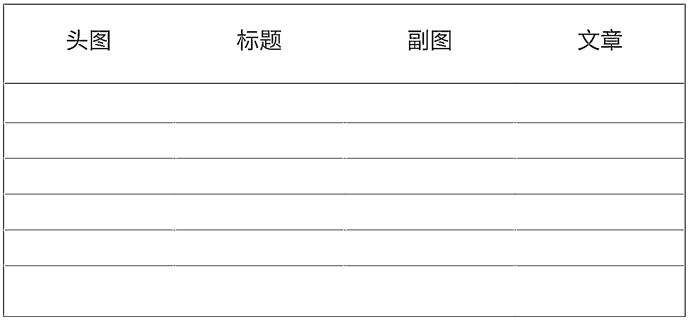

不论是头图、标题还是正文等，每一个环节的重点在于你对读者阅读到那一刻，他当下的需求分析。

就是读者在阅读到那里的时候，那些内容到底能解决读者什么问题，能解决某方面问题才是在提供价值，有提供价值才能让他继续读，如果用户本身没有问题或者没感受到你的价值，那么你也就无所谓价值的提供。

人类大脑在吸收信息的时候，是按照固定的单位吸收的，脑科学告诉我们，人在一个时刻只能记忆吸收最多 4 个信息单位。

所以，我们经常会看到，很多做营销厉害的人，比如广告行业的金枪大叔，他的抖音账号习惯用最简单的关键词去做内容的封面；再比如那些经典的思维模型、中国的各种成语故事、三十六计是最容易让人记忆的。

于是，**分析需求一大核心秘诀就是从关键词入手**，你需要把爆款内容的标题拆分成一个个关键词，直接去判断那些关键词的重要性。

分析的模板我在上文说过，大体可以用下面这张：

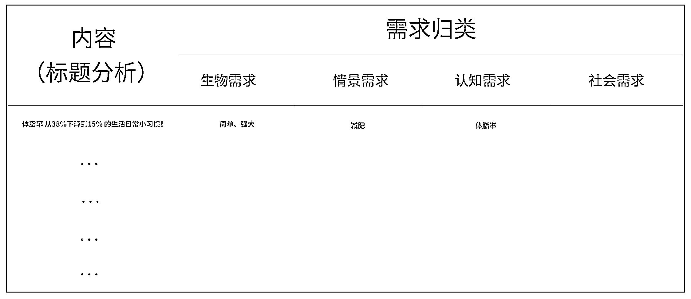

关于每一种需求具体如何甄别，我后续会写一篇详细的文章来分享，这里先跳过。

  **2、沉淀共性，构建模型库**

当你分析的数量达到一个度，比如 100 篇，你就能很轻易的看到你所在领域里面，大多数人的一个认知共识，比如减肥领域，大家最在意的是什么内容。

基于这样的分析，你可以建立对应的各种模型库，比如选题库、标题关键词库、图片模板库等等：

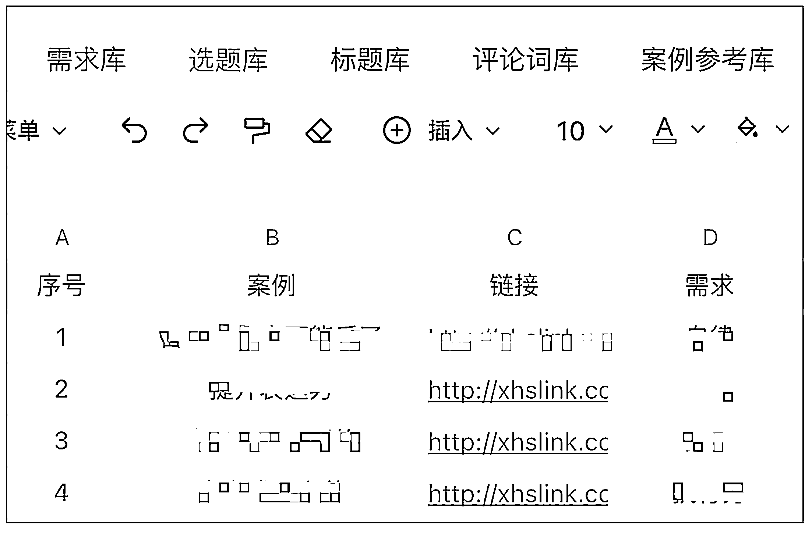

这些模型库就可以成为你后续高效写作的加速器和定位仪，每次写作都能让你的数据保持稳定的水平。

**第二步：制定标准**

所谓标准，就是能爆的内容一定符合某种规律，我们找到这种规律，把他总结下来。就能把飘忽不定的「网感」变成可执行的 SOP 流程。

有了各个环节的模型库，其实制定写作标准就会很容易，下面提供一个简单的模板：

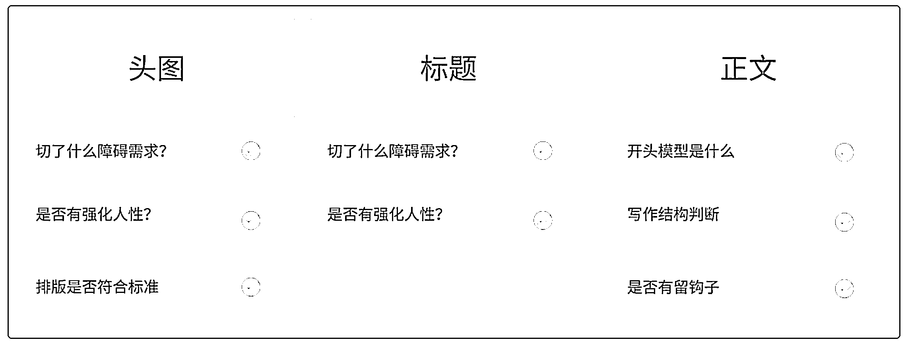

内容创作的标准，是互动数据之所以产生的一大原因，而标准的寻找考验的就是你对用户需求的理解，具体要如何制定每一个环节的标准，我后续会单独写一篇文章分享。

**第三步：实战迭代**

这一步也只有 4 个字：下场输出。

网感的训练，是让你洞察内容中体现的信息和用户需求有什么关系，最终要验证这些关系，必须自己下场实操去感受。

网感考验的是理解力和经历，如果自己没有能力去经历这种流程，根本不可能对这个流程有理解，老师再怎么教，也没用。

**学习不是见闻，学习是输出**。

大脑中的思维是在你表达信息的时候梳理清楚的，而不是只看别的什么课程就能变成高手。你在做内容的过程中，测试数据的过程中，就是在学习的过程。

很多事情，很多道理，年纪到了都能会、都能懂，但社会比的是谁先懂，早懂和晚懂是不一样的命运。

附送这部分的知识体系导图：

  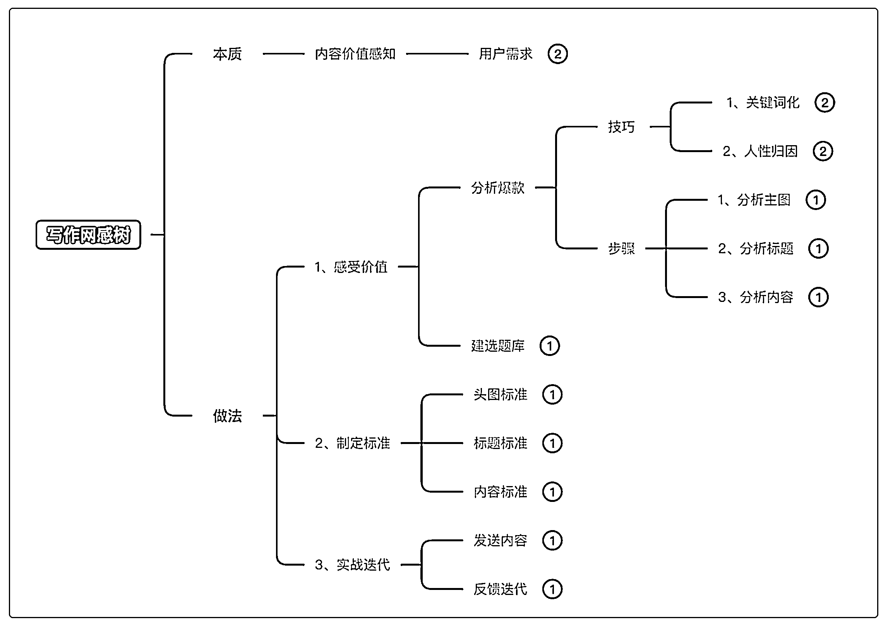

#   第四部分：商业写作的本质

# **商业写作的本质**

写作是一种表达和展示方式，人进行表达通常有两个目的，一为寻求共鸣，二为获取资源。商业写作偏向后者，比较功利。

如果我们把一个普通的小红书用户行为路径做个执行步骤预演，简单的过程大致是这样的（以我为例）：

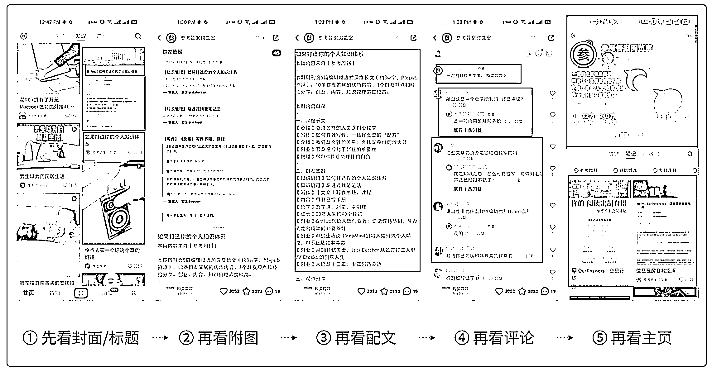

在这个过程中，读者从头到尾每一步都在进行注意力投入，每分每秒的投入都带着主动或者被动的价值判断，具体大致的判断流程，上文说过，可以理解为下面这张图：

  

由于每个人的行为偏好不同，细节的动作可能差别比较大，但从宏观上看，小红书信息流产品的机制是这么一个流程。

所以在小红书进行商业写作需要做的，就是在上图中每一个环节尽可能和读者创造互动机会。

阅读是一种无声的动作，只有产生互动才能进行商业价值计算，设计出关键互动功能比如「点赞、收藏、评论、关注、私聊、购买交易」等，是小红书平台（任何内容平台）做出的努力。

而写作者要知道的是，每一种互动行为都代表着一种需求的满足/产生，从初级的点击、点赞，到深度的互动意向比如评论、关注、咨询购买，都是商业价值的体现。

**商业写作的本质就是创造互动机会**，互动机会产生商业价值。

创作者以「内容」为载体给读者提供信息价值，读者以注意力和互动行为的投入作为交换，两方共同完成不同层级价值的循环闭路，这是关于小红书内容生产的一种世界观。

# 商业写作的做法

以小红书内容写作为例，基础的内容生产流程只需要 3 个环节：撰写内容、植入互动因子、持续迭代（沉淀模板）。

**第一个环节：撰写内容**

在这个环节中，你只需要把你想要写的选题扩展成标题、头图、附图、正文即可，选题的寻找方法上文说过。

标题和内容的写作方法是个比较大的话题，推荐你去看咱们圈子里梨云的公众号内容，她有非常系统的文章和课程。

**第二个环节：植入互动因子**

互动因子可以简单理解为：**能让人产生行动欲的关键要素**，可以是某些词语、某些图片、某种符号。

这些因子直切人类的各种需求，有一种驱动人产生行为的魔力。

一个流程要为一个结果服务：标题和头图要为目标读者的点击欲服务。附图要为完读率、点赞率、收藏率服务。正文和评论区要为转粉率服务。

拿标题和头图来举例子：

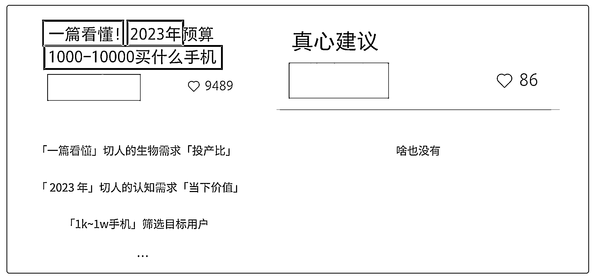

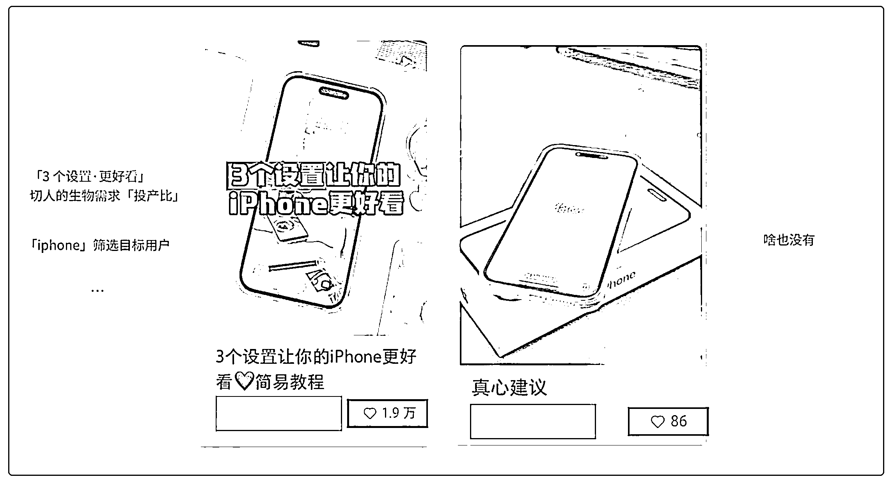

标题和头图的责任，是用来筛选和强化读者的点击欲望，如上两个对比图中，同样是针对「手机」做内容的标题和头图，二者的从互动因子的差别上直接决定内容的数据差距。

拿附图来举例子：

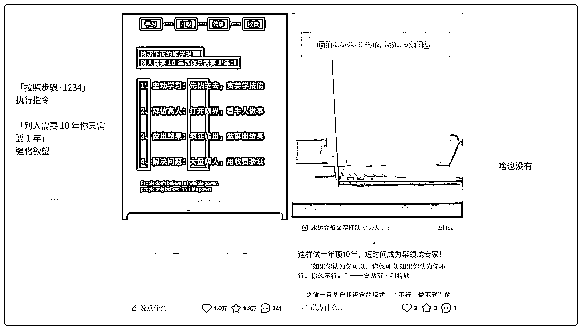

附图和正文要承担的责任，是创造完读、点赞、收藏互动机会，这需要让读者感受到内容的价值，如上图中，左边的案例植入了「执行步骤」这种互动因子，而右图什么都没有，最终的数据差距会有一些明显。

拿评论区举例子：

  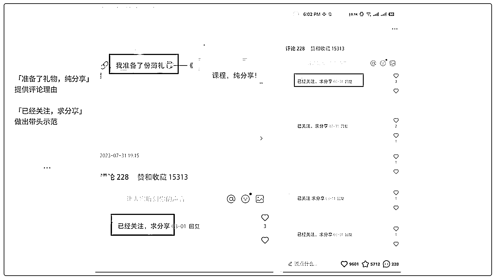

正文和评论区要承担的责任，是进一步提升读者的互动率，如上图通过设置「赠送礼物」「演员示范」的互动因子，可以大幅度提高内容的互动率。

这里有个额外的知识，其他平台暂未研究，但在小红书平台里，评论的互动量对内容的推流影响很大，举个实操案例：

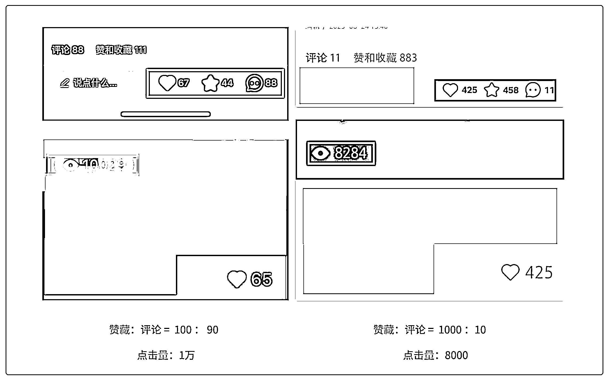

上面这两个账号是我运营的两个账号，选题和内容方向都很接近，左图的赞藏互动和评论互动数据接近 1:1，创造了 1 万的点击量；而右图赞藏哪怕加起来接近 1000 ，由于评论量连 10 个人都没有，笔记的点击量没有破万。

数据样本不多，或许不能笃定的说在互动行为中「评论」的价值一定比「点赞收藏」高很多倍，但我保守认为评论比赞藏的价值高 2～3 倍是不会错的。

看到这里，关于「互动因子」你心里应该有点儿概念了，至于具体应该如何寻找这些互动因子，他涉及到需求的挖掘，我之后会单独写一篇相关的文章。

但在当下，我可以提供一套收集互动因子的简单模板给你，希望对你有帮助：

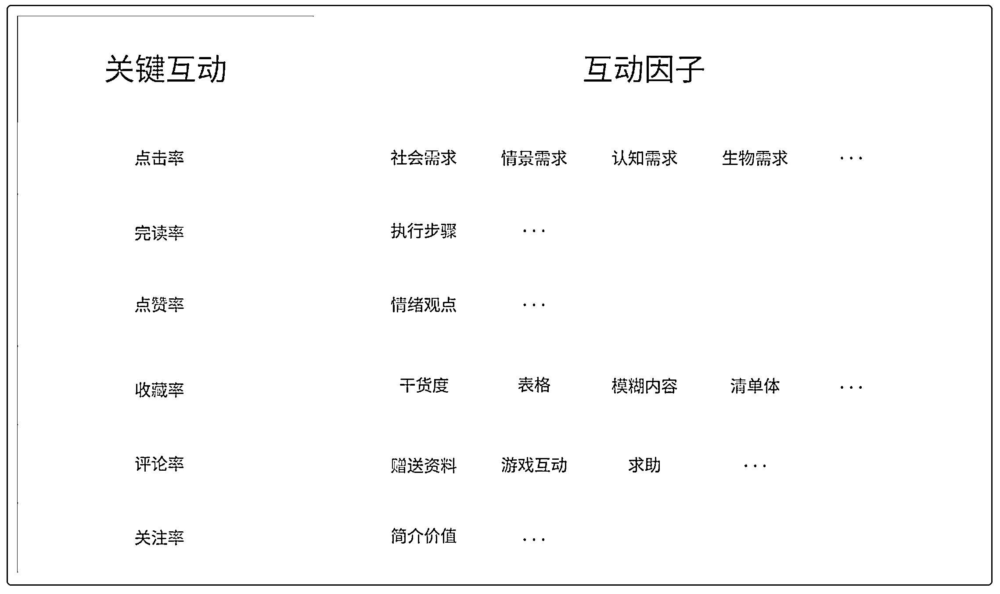

如上模板只是一个参考，其中多有举例，不要咬字眼，你可以基于这个思路去持续收集属于自己独特的一些互动因子库。

互动因子这个词，是我自己创造的，它的本质是一种「理由」，也就是在每个关键环节，你需要给读者提供到他执行某些行为的理由，比如人家为什么要给你评论？肯定是因为你内容的某个地方给了他评论的理由，点赞、收藏、关注、私聊、购买，亦如此。

这是一个修炼理解力的过程。

**第三个环节：沉淀模板/持续输出**

商业内容的生产，想要保持长周期稳定提供，必须有稳定的内容模板，你可以观察下面四个优质案例，会发现他们都有固定的内容风格模板：

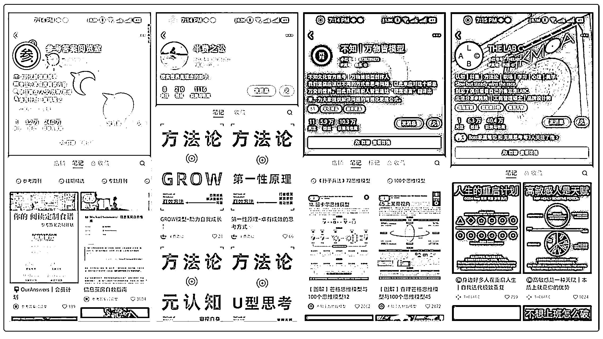

内容的模板表面上看只是一种展现形式，但他其实是一种引导用户认知的模型，我在上文**【选题的本质】**环节说过，你需要尽可能降低用户理解你内容的难度。

很多做小红书内容生产的新手朋友，把自己的内容模板整的花里胡哨，独创各种自以为漂亮的不得了的风格，实际上一点也没考虑别人的理解成本（参考一下我前两天说的「破财」）。

表达什么，固然很重要，怎么表达，也很重要。

一个功能要承担一种价值，内容模板承担的核心价值在于降低读者的理解门槛。沉淀出稳定的内容模板，不仅可以降低读者理解你的门槛，获得更大的内容曝光率，除此以外还可以提高你的生产效率。

最后，你需要做的仅仅是持续输出，通过用户的互动反馈，通过你到底是否达到你商业内容的目的（比如赚到了钱），来迭代内容质量、模板质量。

附送这部分的知识体系导图：

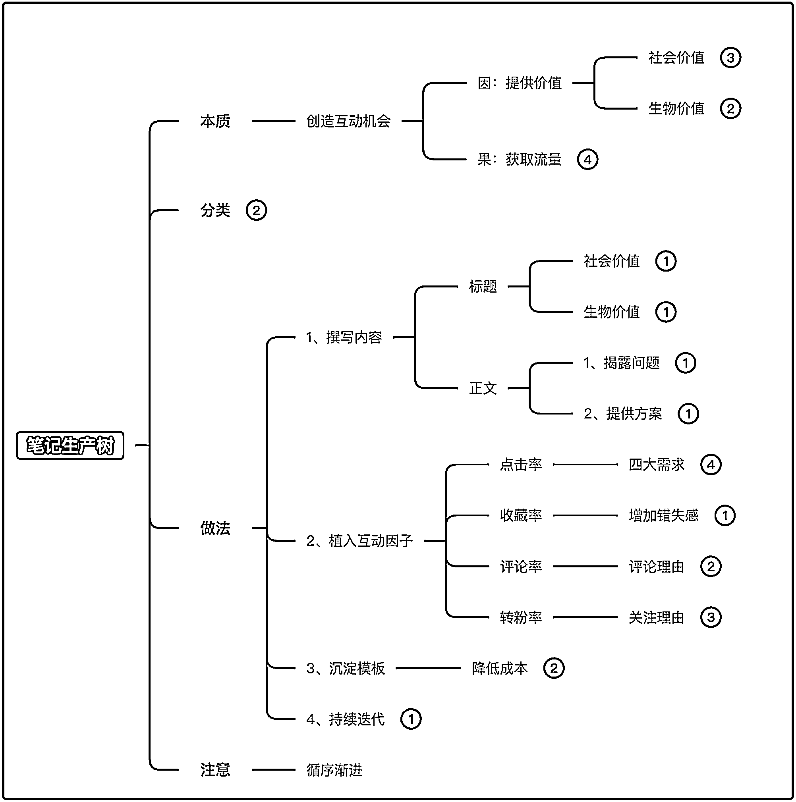

# 第五部分：数据分析的本质

# **数据分析的本质是挖掘利差**

开头说过，我等会儿会在【选品的本质】环节提到一个概念“人之所以要做选择，是因为这个社会的资源是有限的，这是经济学的基本常识，如果资源是无限的，你就不需要做选择。

之所以要选择，是为了做出对自己更有利的投资决定，尽可能保证自己的付出有更好的回报。

那么做选择到底是一个什么样的过程呢？

其实很简单，拿做小红书的内容来说，你去小红书写内容前，其实就是要计算出写哪些内容投资回报率更高，数据会更好，涨粉和赚钱会更快，做选择就是这样一个计算的过程。

凡是「更高」「更好」「优劣」等词，你只记住一句话，这是在说一种相对感受，永远没有绝对。它要求你必须把两个同样的数据摆在面前比较，当你发现某一个数据比另外一个数据好，那么就能得出「更高」的计算结果。

也就是说，没有参照目标或者更多的数据，你就无法比较，也就无法分析，而分析的一大主要目的是，在多个数据之中判断他们的价值高低。

数据分析本质上就是这么一个挖掘和判断投资回报利润差距的动作流程，简单讲，就是**挖掘利差**。

# 数据分析的做法

**第一环节：收集数据**

常言道选择大于努力，选择要基于数据分析，数据分析要基于真实、足够的数据量。

如果你没有足够的样本，怎么分析都可能做不出好决策。

如何去搜集数据，用什么工具搜集数据，生财很多圈友都写过，我没有必要继续卖弄，这里直接给你提供一个参考模板（拿小红书笔记数据收集做例）：

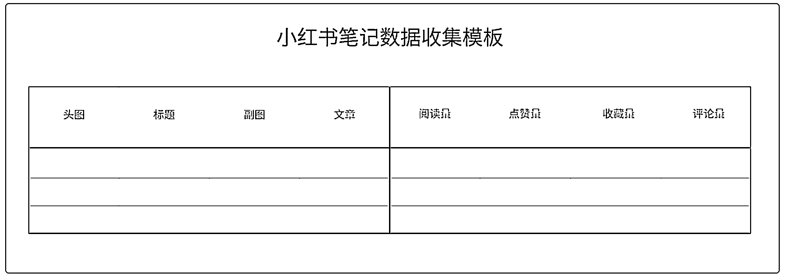

**第二环节：分析共性**

数据背后是人的行为，行为背后是人的需求，分析共性就是分析他们背后有什么共同的需求。

对于需求的分析上文书过，以后会单独写一篇内容给圈友，这里还是用小红书标题做例子，重复贴以此上文提过的模板（同时强烈推荐咱们圈子力@梨云发过的，小红书数据分析实操案例）：

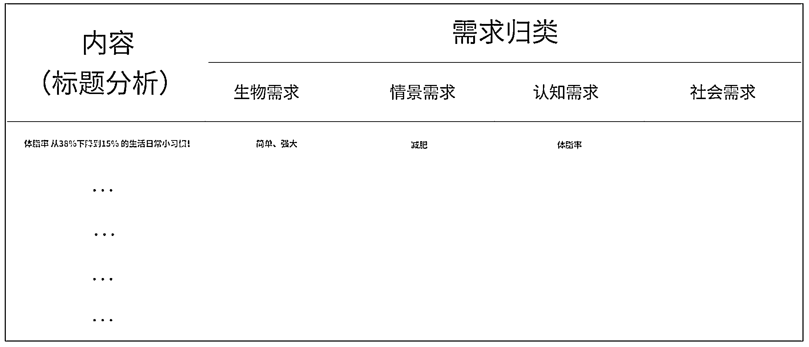

不同类型的数据，分析的目标必须不同。

比如你要分析某类选题的文章数据，目的应该是得出什么样的选题、文章结构、开头模型更容易获得流量；而如果是要分析某些账号数据，可能要分析的是他的变现模式投产比、账号存活周期等。

**第三环节：优劣排列**

这一个环节非常简单，只需要把不同的数据按照各自想要实现的目的指标排列，比如完犊率、点赞率、收藏率、转粉率等等，你可以得出各种目的指标下最好的选择策略。

比如下图中，在家电领域的空气净化器赛道中，如果我想让内容发出去点赞很高，那么直接按照点赞量排序，然后分析提取排在前 20 篇内容的标题和内容模型，模仿写作，你的内容不会太差：

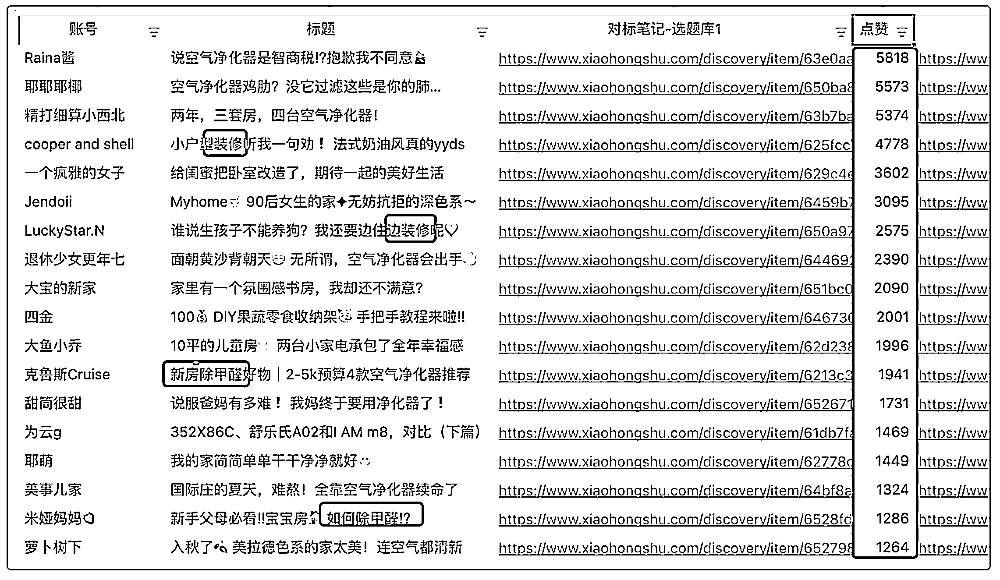

如果你自己要在线上做小红书（或者抖音/快手/知乎/微博等），都可以套用它来搜集。

# **陷阱！**

你去任何自媒体平台赚钱，有点脑子的培训老师或者博主都会讲「数据分析」是必不可少的环节（同类型的环节还有很多）。

在多数老师的言论中，他们会给我们传播一个观念，数据分析（或者 xx）作为一项技能，是可以通过书本和理论学会的。

但是抱歉，这是个骗局，拿我的案例来说，下图是我两个月前创作的两篇小红书笔记：

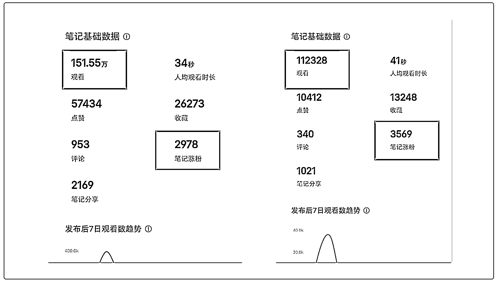

第一篇的阅读量有 150 多万，可以说是大爆款内容了，但是它的转粉情况只有不到 3000，这个转粉的比例计算下来只有：0.2%。

而第 2 篇阅读量虽然只有 10 万，但转粉有 3500，这个转粉比率计算一下是：3.5%。

二者的转粉率差距至少是 17 倍。

我把这两篇内容前后对比了十多次，发现了两个区别：

从人群上看，前者吸引的都是在多数领域认知很低的人，后者吸引的是在商业和职场领域有一定认知的人。

从内容上看，前者是那种非常鸡汤、神秘、玄乎的内容，大而无当，后者是科学严谨逻辑清晰的内容。

那么你这里会想，既然如此，以后就按照这个模版来创作就行。

但是抱歉，这就是重点，**没有「既然如此」**，大多数自媒体新手根本到不了「既然如此」，因为他们如果按照老师教的方法去分析，屁都分析不出来，你只有事后才能理解。

我想表达的是什么呢？

**没有体感之前，纯理论的数据分析全是个人偏见，你如果不下场去做事，事后复盘，你根本就没有分析能力，都是自己在骗自己，你的分析技能无法内化**。

数据分析本质是一种归纳现象，推理预测未来的能力，而归纳和推理的基础，必须基于自身有相关的亲身经历体感，这和费曼讲的「以教为学」本质是一个逻辑，你可以叫他「以做为学」。

# 一个故事

2008 年的时候，我的数学老师痴迷于炒股，她自认为在我们那个小镇没有人比她更懂互联网炒股，于是每天拿着笔记本定时定点看 K 线，有时候上自习课自己太忙，宁愿把她女儿直接托付给我照看，也必须在关键时刻买入买出。

2008 年下半年，我这位老师怒亏 70 万，直接气的住进医院生了好大一场病，决心以后再也不炒股了（这件事最倒霉的是他老公跟着背债）。

为什么那些成天呆在家里吸收网络信息炒股的人，大数赔多赚少呢？

因为他们以为单凭自己那点儿脑力计算就能掌握时局，孰不知市场的变化波谲云诡，你不在第一线亲历，最终分析的都是别人的二手数据，很有可能分析出个蛋。

# 第六部分：选品的本质

这是最后一个部分，也是最重要的一个部分，其中提到的一些心法多数来源于圈友刘小排和盗坤，我自己补充了细微的体感。

有一些糟糕的项目如果你能早点发现结局，那当下付出多大的代价舍弃，对于未来都是赚的，可惜这个世界没有如果。

经常听人说，选择大于努力，比如拿做知识产品来说，下图中的知识产品是我今年参与做过的其中 4 款，前 3 款的销量明显比第 4 款多了至少 10 倍：

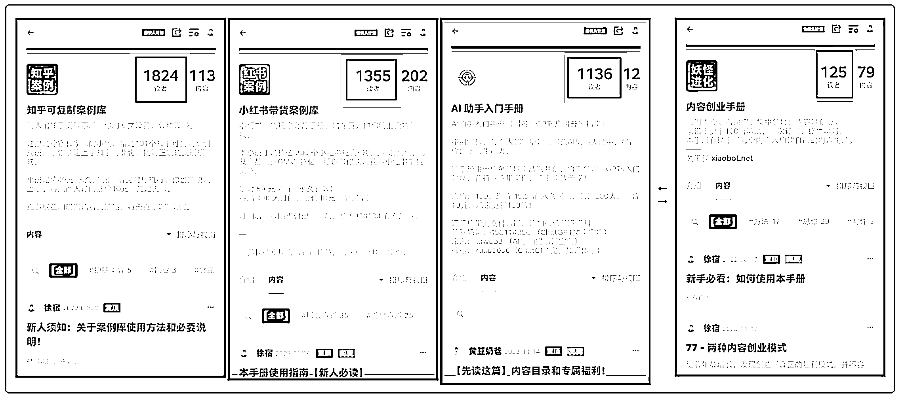

尽管我主观上认为，最后的这款产品要比前两者价值更大，但客观数据上看，大家更喜欢为前者买单（不考虑营销方式的话）。

我认同选择大于努力，但如果你把他看成一种技能，且不去下场失败多次，一个普通人是无法掌握这种技能的，创业新手在找方向这件事上，需要投入极多的时间去试错，成本真是高。

# **选品的本质**

我们去研究生活中各种事物本质，就是对那些事物做出概念界定。

所谓选品，简单理解是你要去做生意，应该选择什么样的产品去卖，这直接决定你能赚到多少利润、你此后一段时间的人生方向。

人的世界观决定方法论，你对事物了解的越清晰，总结提炼方法论的时候成功率越高。所以在思考方法之前，必须对「选择」「产品」这两个词做清晰的认识。

**1、为什么要做选择？**

逻辑简单，实操不易。之所以要做选择是因为，这个世界上的资源是有限的（时间有限、体力有限、人数有限），但每个人的追求是无限的，我们总想要赚更多钱、积累更多财富、短时间做更多事。

资源有限，欲望无限，于是产生了冲突，从基因深处注定，我们每天的第一大本能诉求可能是：**追求回报率**。

追求回报率就要做最优决策，选择，就是做这个「最优决策」的过程，如果你人生的选择很少，那么你其实就不存在做最优决策的机会。

**2、产品是什么？**

俞军在《产品方法论》中说「**产品本质上是一种解决方案**」，这个定义非常清晰。

强调产品是一种解决方案，就是在说你做的不是一个单一的物件，而是一整套流程和系统。

比如：

你是卖衣服的，你不可能把衣服挂出来就能让别人买，你得标价格，你得有客服人员在顾客问问题的时候站在旁边解答，你得在网上做海报做宣传，而这些顾客看不到的成本，也是你产品的一部分。

所以，我们不妨把交付到顾客手里的东西叫做「商品」，自己在做的整个系统叫做「产品」，商品是产品的一部分，产品是一套套解决方案。

**3、产品来自哪儿？**

说产品是解决方案，其实就说明了产品来源于问题或者叫需求，遇到了问题和困难才需要方案，没有问题也就不需要方案。

比如人类爱干净，需要经常洗衣服便捷省力，那么就可以买洗衣机，但如果说你不爱干净，你不需要洗衣服，穿多邋遢你都心安理得，那洗衣机作为一个商品，也就没了它的价值。

一个产品，要承担一种责任，责任承担的越重，这个产品越有价值，你赚的钱可能就越多。下文我会把「产品」这个词统一用「方案」来代替：方案 = 产品。

**4、选品的本质就是选择解决方案**

如上，我们可以知道：选品的本质就是选择解决方案，而且最好是选择已有的解决方案。

如果是要自创产品，那就不叫选品，那叫创品，这是两回事儿。

之所以要选品，是因为早期的创业者没有创造新品的能力，很多时候我们以为的惊艳方案对于用户来说可能是一种自嗨，比如我开头举例的小报童数据。

想要提高赚钱的成功率，我们需要优先筛选市场上已经被验证的解决方案来确定市场需求，基于这些大概率正确的市场需求来复刻方案，获取基本的利润，赚到更容易赚的钱。

# **如何选择解决方案**

# **1、收集方案**

上文说做选择需要基于足够的数量，没有数量就不存在最优决策，因为你没得选。不少人早期创业比较难受的点在于，可选择的空间太小了，手里根本没有什么好项目。

所以选品第一步，就是要去市场上收集足够数量的解决方案，有了数量才能做选择。

这里面比较重要的 3 个落地点是：**收集的标准、收集的维度、收集的方法**。

**1）收集标准**

标准来源于目的。

我们去收集方案第一个标准是：**有稳定的交易量**。

也就是尽可能收集那些持续赚钱的方案。

比如：

我们要去小红书、抖音平台选品，那必然需要去看那个商品的销售量和销售额，如果一个商品卖了半年都没产生什么交易量，那估计就是这个方案没有市场，数据在多数时候不会骗人。

交易数量可以确定市场需求量；交易频次、稳定性，可以确定这个需求是不是可以长期做。

这个标准的缘由在于，大多数人做生意核心诉求是赚钱；而从顾客的角度看，只有能解决他真实问题和需求的商品他才会付出真金白银。

所以从这两个角度收集，可以筛选出持续稳定能够赚钱的方案。

但这还不够，这个世界上能持续稳定赚钱的方案太多了，但大多数和你没啥关系，因为给你你做不了。

收集方案的第二个标准是：**那些方案特别差**，你感觉你上你也行。

这是个违反直觉的逆向思考，通常人们认为需要收集那些尽可能成功的方案，但更多时候，这些方案收集回来，我们做不了。

之所以要「选品」，是因为我们自己资源少能力小，必须选软柿子捏，如上两条标准可以确保我们收集到足够的自己能做、且市场已经验证有交易量的方案。

**2）收集维度**

有了标准，你需要有一些更容易着手的落地点去收集，我这里给你提供 3 个主要的维度：从商品、人群、需求出发。

**从商品出发**

从商品出发，是最简单的收集方向，商品是一个解决方案最直观的体现，我们可以轻易看到各种商品的交易量。

举个例子，如果你想在淘宝做生意，你可以直接去搜想做的行业的各种商品交易数据：

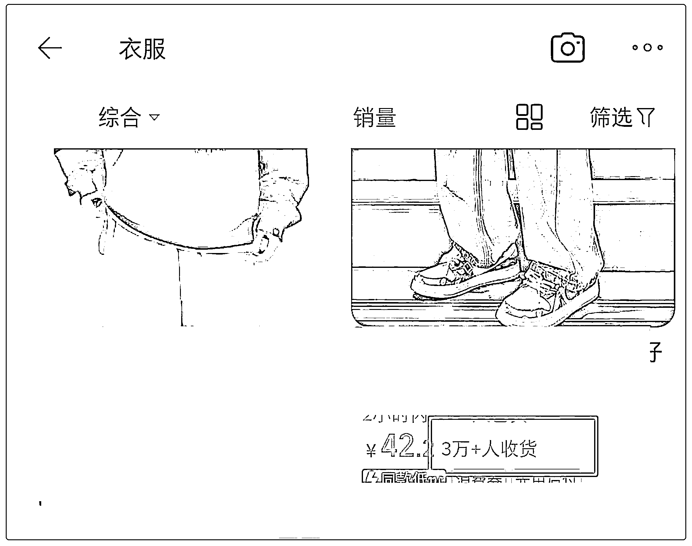

这些平台上商品的交易量，是直接可以看到的，你可以尽情的去收集有交易量、且你能力范围内能做的方案，这里每个平台具体的收集方法以后找其他机会聊。

**从人群出发**

这个角度相对较难，但如果你长期混在一个圈子里，你可以清晰的理解某个群体的一些痛点需求。

比如我有个朋友非常热爱运动，篮球、羽毛球、乒乓球、徒步都特别喜欢，他自己在这个圈子里呆久了，非常知道同类们喜欢什么东西，隔三差五约我打羽毛球。

我当时做知乎带货的时候，偶然间想起他的爱好，决定基于这个人群去做选品，然后泡在百度贴吧、中羽社区和他的几个网聊群，泡了三四天后去写带货文章，发现流量特别凶猛，一个月卖了几千单货。

**从需求出发**

最终，我们仍然要回到用户需求的角度。

如果你能精准的判断你想要做的市场，用户到底有什么需求，其实可以直接从这个需求出发来选品，这里有两个方式可以切入：

**从自己身上找：**

比如我父亲自己喜欢养花养草，于是他经常刷抖音上的绿植类视频，某一天我去查看抖音上这类商品的市场空间发现非常大，去生财有术一搜，已经有人靠做这个赛道赚了 100 多万。

**从别人身上找：**

比如以前我有一个学员，她在月子中心工作，时间长了以后，发现孕妇妈妈整个孕育期会有非常多的需求，于是 3 年后，她自己开了一家服务月子中心的小公司，就专门解决她收集到的几个核心需求。

**3）收集步骤**

收集的主要步骤只需要 3 步：

第一步；确定关键入口

第二步：用人工或工具

第三步：录入电子表格

首先，搜集方案需要一个搜集入口，对于线上渠道，下面 5 种关键入口可以作为基础入口经常利用：

  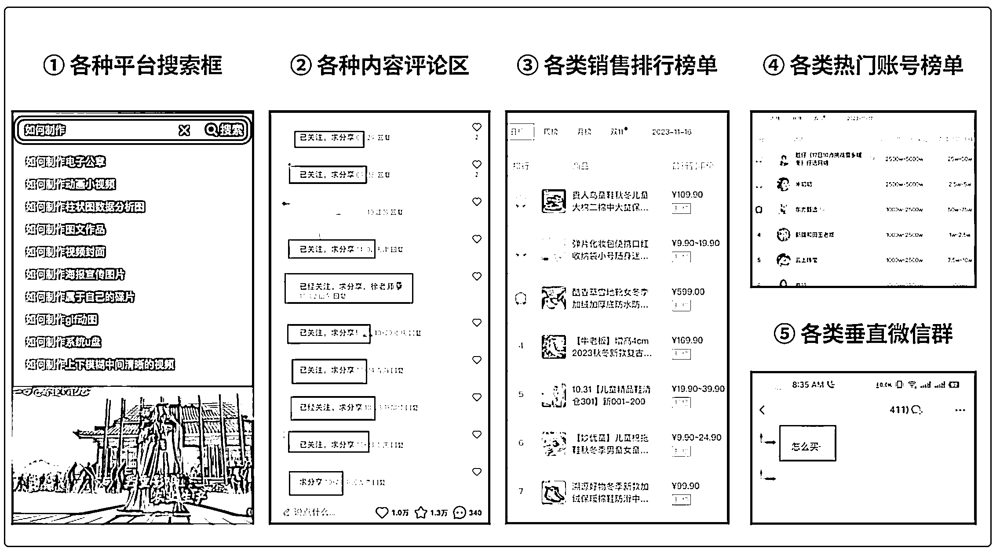

然后，可以利用人工或者工具搜集的方式进行搜集。

比如我自己在某些阶段，为了不丧失对异常值需求的敏锐度，会固定让自己每天刷淘宝/抖音/小红书等能看到市场需求的软件 1 ～2 小时甚至更多（用数据工具搜集以后单独写文章分享）。

最后，你需要把你搜集到的各种解决方案录入表格，我推荐一个新手表格模板给大家：

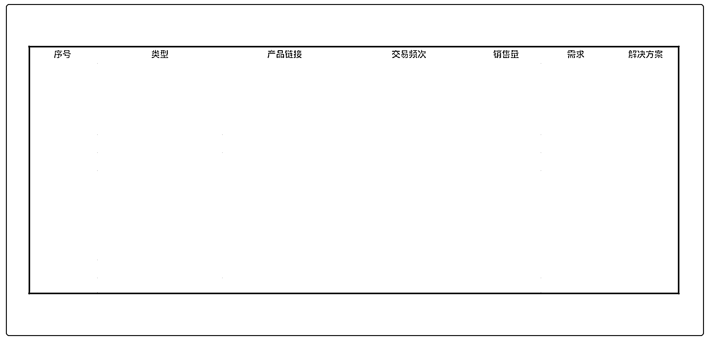

按照这样的一套流程，你可以相对容易的，为下面的选择提供足够的解决方案数量。

# **2、分析方案**

分析的目的是为了做判断，判断我们能不能用这套方案、做这个市场。

**1）分析核心需求**

上文我说，解决方案来自于需求，没有需求也就没有解决方案。所以分析的第一步，就是确定每一个解决方案解决的核心需求到底是什么。

比如：

上文中说的绿植市场，我一开始认为我爸爸或者其他父母喜欢养花养草，但深入思考我发现，其实他们喜欢的并不只是花草本身。

他们真正的需求其实是「自然事物和环境带给他安静生长的感受」，他需要把自己的注意力投入到某一自然物件「养成的过程体验」，这和小孩子喜欢搭积木的逻辑一样，过程会给了他们内心某种宁静和舒适。

了解了核心需求，有利于你后续做更准确的判断以及测品，具体核心需求的确定方式，要回到需求等级图谱中，后续我会专门写一篇文章来帮大家做衡量判断。

**2）分析成功因素**

一个方案能实现最终的变现赚钱，不是一个环节做好就可以，我们需要找到它整个流程的关键成功因素或节点。

举个自己的例子：

年初的时候做过一个信息产品叫做「知乎案例库」，当时一周卖了 1500 多份，累计产生了 10 万左右的销售额，后来有几个朋友跑来说他们也想做类似的产品，但是结果却并没有想象的那么好：

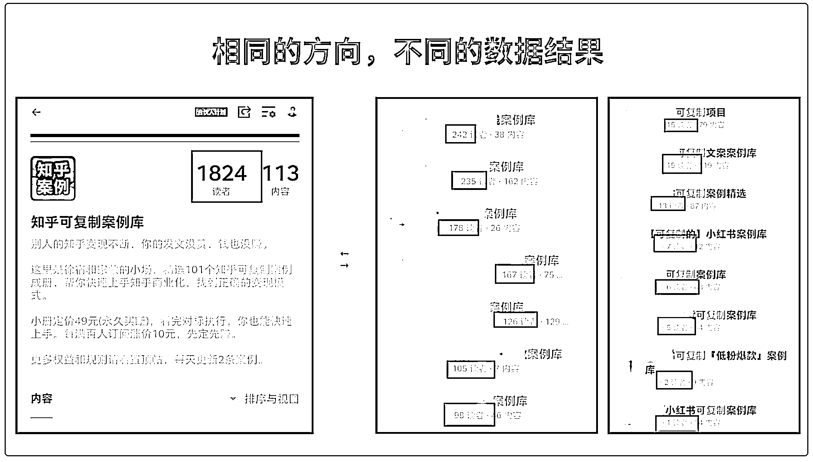

为什么同样的方向，结果相差这么大？

因为造成结果的因素并不只由方向决定，这个小产品能卖到一个数量，更多靠的是我以前有基础影响力积累、同时更有运气邀请到非常有影响力的朋友帮忙推广。

商品可以复制，背后的供应链、推广渠道并不容易复制，有就是有，没有很难开展，只有分析清楚成功因素，才能确定自己到底能不能复制。

**3）分析供需市场**

查理芒格说，手里拿着锤子的人，看什么都像钉子。

当你确定了一个解决方案，你会觉得这个世界上所有人都需要他，但事实是，并没有那么多人。

分析供需空间，就是分析某个市场的商品供应方和需求方数量，判断到底有没有你的参与空间，目的是为了确定你想要参与的这个项目的天花板。

举个例子：

我们知道每家每户都需要洗衣服，不看数据的话我们可以确定中国人今年需要 14 亿台洗衣机，但实际上按照家庭为单位计算，只有 3～4 亿家庭用得到，再抛除家里已经有洗衣机且不打算更换的，2022 年中国的洗衣机交易数字是：3600 万台。

实际的市场和拍脑袋猜测的市场，差距可能是 100 倍，我们需要尽可能找出那些求大于供、尚未被垄断的市场。这里具体分析供需市场的方法，以后写文章分享。

# **3、判断匹配性**

分析清楚大概每个项目的核心需求、成功因素是否可复制、市场是否有空间够我们参与，我们就可以来做判断。

判断什么呢？

判断自己的资金、精力、人手是不是匹配做，有很多项目看起来非常好，但你没有时间、钱和对应的人才，就没法落地去做。具体的判断流程如下：

第一步：确定目标

第二步：筛选配对

第三步：匹配就做/不匹配更换

**首先确定目标：**比如你有一个明确的赚钱目标，人生的不同阶段，能力、欲望都不一样，20 岁的时候，一年的目标可能是想赚 10 万，这是个具体的目标，有很大概率实现，但到了 30 岁，你一年的目标可能是赚 100 万，这并不容易实现。

**其次筛选配对：**从所消耗的资金、拥有的时间、人脉、货源等等，做配对。

**最后落地测试：**如果匹配就进入测试项目环节，如果不匹配重新去方案库中走上面的流程。

# **4、测试方案**

到这一步，我想说的是，**前面的所有步骤，都属于假设**！

只有真正的实操去测试，才能知道行不行得通。

1931 年，数学家阿尔弗雷德·科日布斯提出了一个经典的思维模型，叫做「地图不等于疆域」，意思是说，所有的文字理论、数据调查，只是对过去时间发生的一种抽象统计，并不等于未来依然如此。

一个解决方案到底能不能变成钱，最终需要你动手实操去卖，这是没法用文字和思考解决的事。

测试方案的方法非常简单，首先你需要像素级模仿市场上成功的解决方案，真正的赚到钱、跑通流程后就算确定了它的有效性，剩下的是就是复制+创新了。

看到《财富流》一书中说：**所有成功的企业家或投资者，在遭遇生意失败后，都能东山再起，因为他们掌握着了解他人需求并提供解决方案的能力。他们知道这种能力是人类迄今为止最佳的工作保障**。

**附上这部分的知识体系脑图：**

**正文完！**

* * *

这套知识体系，我花了 4 个月打磨，边实践边迭代，边做文字记录，边构建知识体系，过程中看了 120 多篇生财相关的精华文章，自己实操作废了 6 个账号，整体积累的文字稿不低于 5 万字：

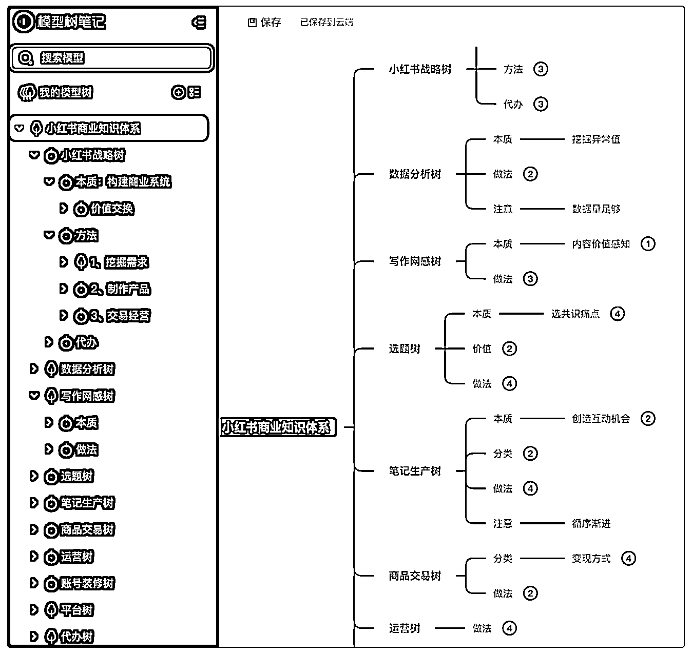

从价值来说，我认为至少值 10 万。

如果你有点迁移头脑，会发现这个系列的内容不止适用于小红书，底层的方法论在抖音、快手、B 站可能也行得通，生财有术社群已经有人直接拿着我其中一部分框架套去做咸鱼平台了：

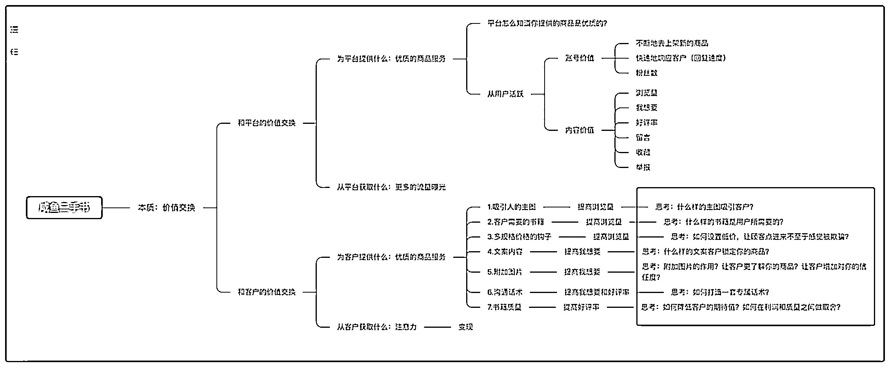

写作是一种整理思维的过程，对于写作者本人来说，内容是思考的痕迹，而对于阅读者来说，它是你可以继承的遗产。

但到底能吸收几分，还看个人过往经历和理解力。

**需要注意的一些陷阱**

以前看《道德经》讲，道可道非常道，我把这句话理解成：能说出来的都不是真正的道。

很多经历过的事情，通过文字写出来的价值多少都会打折。我自己研究知识体系日渐深久，意识到方法再怎么写的详细，本质仍然是各种抽象概念，不是真实本身。

日常生活中，我们每个人其实多半在盲人摸象，你有你的视角我有我的视角：

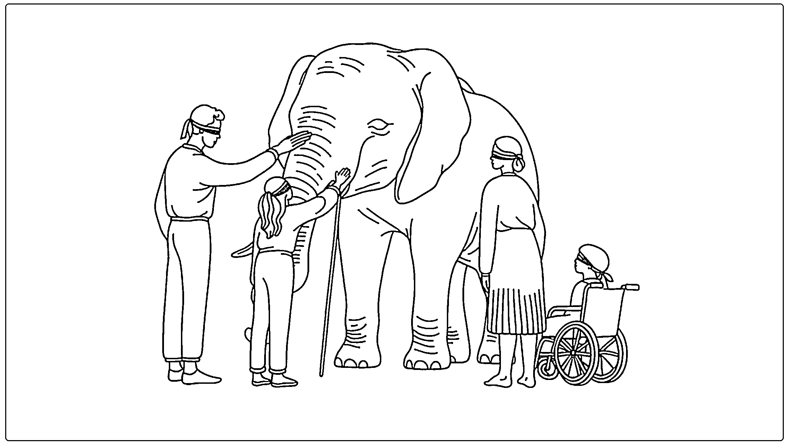

想要真正的获得成绩，需要实操去做具体的事，在具体的事情里千锤百炼，修成大器。

我提供的系统，不是让你避免千锤百炼，而是让你找到一个值得千锤百炼的路。

时代艰难，信息爆炸，有太多人告诉你，你应该掌握越来越多的知识，但事实是一个人大脑的内存有限，你真正要做的是尽可能清除杂物，只保留那些最有用的知识去长期实践，获得现实成绩。

# 写这篇文章的两个目的：

一是基于上次在生财分享过《什么样的知识体系对于赚钱是有意义的》：[`t.zsxq.com/16YuPRpyw`](https://t.zsxq.com/16YuPRpyw) 。这篇文章算是对那篇的进一步实践补充，能够帮到更多人我自己会很开心。

二是我自己有「个人知识体系」和「商业知识体系」相关的培训业务，如果有圈友和老板需要掌握，可以基于这篇文章来对我进行一个了解和链接。

其实这篇文章可以分成 6～8 篇来发到生财，但感觉必要性不大，一次性都说完吧。

文章不算短，能看到这里的可能是真的看进去了，我是徐宿，祝你好运。

* * *

*另外，我本人不做任何小红书赛道相关的培训，该写的都在这篇文章中，有更细节的问题推荐找@梨云去咨询，我小红书的成绩都是受她培训得来。

* * *

评论区：

梨云 : 我们通常更多的是讲从用户角度去思考，徐宿这篇文章的其中一个切入点，是把我们拉到了更高维度，从平台视角来讲透注意力资源的变现逻辑，让人对内容创业又多了新的理解。关于数据分析，文中提到《如何分析各种小红书账号的赚钱模式》在这里加餐🍚[机智]：[`t.zsxq.com/16raegeyv`](https://t.zsxq.com/16raegeyv)
徐宿 : 强烈推荐大家把梨云这篇文章看十遍，非常有价值，我当时就是受这篇文章启发对数据分析有了体感[得意]，梨云牛逼
朝暮拾花 : 优秀的联动啊
朝暮拾花 : 深夜拜读，辗转反侧，难以入眠，起来再读一遍，晚安😴
不然 : 反复读了几遍，深受启发，感谢大佬！不光是做小红书，文里讲的核心点对于其他领域也一样有用，庆幸自己没有错过
徐宿 : 能给你启发我很开心，一起发财
徐宿 : 哈哈，不然，你慧眼识珠
空 : 感谢分享[抱拳] 学习了太多的术的层面的知识，今天再看到您这篇道的层面的文章，感觉把所有的技能都打通了。[强]

* * *