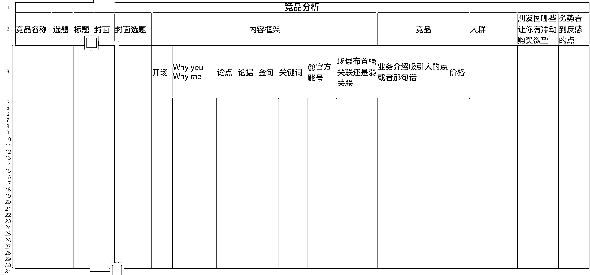

# 做心灵疗愈博主怎么让用户买单？

> 原文：[`www.yuque.com/for_lazy/thfiu8/gw6su3nocvzpt23g`](https://www.yuque.com/for_lazy/thfiu8/gw6su3nocvzpt23g)

## (75 赞)做心灵疗愈博主怎么让用户买单？

作者： 心理疗愈师安稳

日期：2024-01-12

身心灵行业，到底是帮人疗愈财运不断，还是故弄玄虚割韭菜？

我自己是从 19 年开始做疗愈师的，到现在靠小红书引流，能做到月入 3w。期间我做疗愈个案咨询了很多人，他们大多是真的经历着痛苦需要帮助，而疗愈恰好可以帮她们找回自己的力量。

身心灵和其他行业不一样，不可以带着割韭菜赚钱的心来做。讲到底这是一个能量平衡的宇宙法则，当你带着割韭菜赚钱的发心来做疗愈行业，你的福报会被损耗，你赚的钱也会留走的。

今天我会来给大家简单科普下身心灵行业现状，也顺便教大家怎么在小红书做一个疗愈博主，做到一周引流 80 人，月入 3w+。从起号、内容、引流、私域，各个方面都会有涉猎，希望能够帮到正在看文的你。

大家好呀，我是安稳，是一名身心灵疗愈导师。

身心灵疗愈经济最近有点火，我自己做身心灵疗愈是在 2019 年开始做的，目前每个月会有 3w+收入。今天跟大家分享一下我做身心灵疗愈行业的经验。

# 一、身心灵疗愈行业介绍

在说身心灵疗愈行业之前，我想跟大家分享一下什么是身心灵。身心灵的概念是什么：

1.  身：意识，理性，思考、认知、逻辑； 讲道理、分析、身体。

（心理辅导方面：认知疗法）

1.  心：潜意识，感性；感觉、情绪、意义；感受、推动力；情绪、关系。

（心理辅导方面：催眠疗法、NLP 疗法）

1.  灵：系统，灵性；关系、心灵、深层影响；心灵相通/玄学的东西；能量、频率。

（心理辅导方面：西塔疗愈、系统排列、阿卡西阅读）

大部队人的生活中，关注的都是【身】的部分，注重理性、逻辑分析；

而从事身心灵行业的人都在干什么呢？我们在做的，关注一个人【心】【灵】层面，身心灵疗愈的工作，就是在这两个层面，找到问题症结，给到适合的治疗引导，推动来访者找回自己的力量。

# 二、疗愈项目市场

截止 2023 年，全球心理亚健康人数突破 10 亿，同比 2020 年增长达 100%，心理健康问题成为后疫情时代人们关注的重点领域。

目前，需要被疗愈的人越来越多，行业内卷、经济下行等因素使得人们更容易出现情绪问题，失去了对自我的认知和连接，人们会因为过度疲劳、压力、精神疲惫、焦虑内耗等问题来寻求心灵疗愈调整。

但是目前国内市场上，国家前几年停止了心理咨询师从业资格证培训的原因，目前国内能够给到有效的心理疗愈帮助的人是很少的，有很大的市场缺口。

同时，给这些问题提供解决方法的疗愈类产品不断涌现着，例如正念冥想课程、颂钵疗愈个案/课程、催眠疗愈、潜意识疗愈、西塔疗愈等等。

# 三、身心灵疗愈行业与传统心理疗愈的优势

**第一、身心灵疗愈行业相比较与传统心理学呢，在商业变现角度，优势在于好入门，也好变现。**

我的一个老师说，她之前做家庭教育课程，招生可太难了。但是自从开始讲灵性疗愈课，随随便便就招几十上百个学生。

我想也是因为灵性疗愈课程分享的知识，相较于传统心理学更通俗易懂，另外门槛也不高，只要感兴趣就可以来学习了解。

**第二、身心灵疗愈的技术见效快。**

前面讲到身心灵的概念解释，传统心理学疗愈更多在一个人的【身】层面做疗愈，做认知的调节。

而好的身心灵疗愈技术，是去到一个人潜意识深处找问题答案，相对来说，效果会更快更好。因为潜意识信念才是很多情绪、心理问题的根源卡点。

# 四、做身心灵疗愈我做了哪些事情？

**第一步，起号，做疗愈类博主。**

目前，我主要是在小红书平台做心灵疗愈博主，粉丝 2.4w。

我对身心灵疗愈行业本身是很感兴趣的 也做了很多疗愈和学习。在我准备做博主之后，我就开始在平台找对标账号，找喜欢的身心灵博主账号进行学习，找身心灵领域大热的选题、风格来制作视频。

首先，我确定了自己的定位：要做一个能量疗愈博主，给到粉丝正能量的支持。

在此方向下，我首先做的是找同领域 10w-20w+粉丝的疗愈类博主作为对标账号，进行拆解学习。

有的账号粉丝可能就几万，但是看起来变现数据好、互动率高，评论区对博主本人表白很多的，我也会去拆解学习。因为互动率高，意味着这个博主有‘人气’，粉丝对她信任度高，这个也是我想要的。

在找了几个对标账号之后，我会去研究他们的主页搭建：

主页就是你在小红书上的门面，如果主页没有包装好，别人点进来， 都不知道你是干啥的， 当然就不会关注你了。

主页的设置主要是分为四个部分：

**第—点，账号昵称。**

1.  首先大家—定要记住你的名字， — 定要突出你账号的定位，让人—看到你的名字就知道你是干啥的。

2.  可以是赛道名， 加上人设。比如疗愈师安稳，设计师小杰；

3.  也可以是人设加上内容定位， 比如虎哥说车、老爸测评；

4.  也可以是人设名， 比如可爱妹、呆妹小霸王。

**第二点，账号头像。**

1.  可以放高清人物照， 面带微笑有亲和力的照片， 比装酷耍帅的照片更加有吸引力。建议大家不要放美颜到连亲妈都不认识的自拍照。

2.  那其次也可以直接放账号的文字图，如果你是自家品牌，可以直接放品牌的 Iogo 就 行。

3.  也可以放上与你定位有关的图片，比如冥想博主，可以用一个正在打坐冥想的图片。

**第三点，主页背景图采取人设形象照。**

**第四点，简介。**

1.  简介的目的，是为了增强人设，加强账号背书，让观众对你产生信任感，所以写简介和你去参加面试—样，—定要把自己有多牛逼，通过简单的文字描述出来。当然，这里的牛逼是指你和账号定位相关的成果。

1.  其次， 你可以在简介里简单描述出你可以为粉丝解决什么问题， 提供什么价值，为自己的变现做好准备。

比如，我的自我介绍是这样的。

**第二步，在进行了基础的账号搭建之后，就要开始发内容啦。**

发内容也是一样去看对标账号的内容，找热度高的选题来拆解。我的做法是，去到对标账号的主页，把她们账号里千赞以上的笔记记下来，进行内容学习。

为什么是千赞以上？因为如果有上千赞，就说明这个选题是很火的，基本上我发了也会有很多流量曝光。

我的做法是把高赞笔记的文案架构逻辑拆解出来，找到模版。

在小红书上找到一个高赞内容后，复制视频链接，去轻抖小程序把文案扣出来。逐段分析别人的文案。

我一般会在通过这些指标去分析：

在这里，就是要磨练制作爆款内容的能力了。

我自己总结下来，做博主，涨粉的角度，最关键的就是选题，当你选题本身就很火，大家都关心的话题，你多拆解几篇内容，找出规律，照着别人的内容模版写一篇发出去，流量就是会很大，会吸引很多粉丝。

我的涨粉并不是慢慢累积的，而是突然爆了一条视频，然后涨粉四五千，这就是找对选题的好处。

找选题的方法就是进入你的领域话题，找最热话题，你能看到的就是大火的选题，也是人们都关心的问题。找一些自己想讲的话题，拆解高赞（过千赞）的作品去学习。

**第三步，引流方法+私域成交。**

引流是我用了大家都在用的引流方法。

首先，设置一个免费赠送的引流产品，引导大家去到小红书群里，在群里获取微信来领取资料。

在身心灵疗愈领域，比较好引流的品 就是吸引力法则有关的课程资料。你需要多找几个对标账号，看看别人都在用什么引流，那就是粉丝比较需要的引流平，引流效果会很好。

**我具体是如何引流的呢？**

**首先，做好引流产品。**

比如我用吸引力法则课程资料引流，我就提前制作好了一个吸引力法则显化音频冥想课。然后针对这个引流品，我制作了一条吸引法则视频，视频里开屏先说很多朋友通过我的显化方法成功了，来留住观众；

然后简单讲原理，讲具体方法；讲完具体方法后，加上一句：我为大家准备了一个显化音频，大家有需要可以来拿。

不要直接在视频里说免费赠送或者是私信我领取，你简单提一句就好，感兴趣的人会在评论区问你的或者主动私信你的。

果然，我的那条视频评论和私信都有问音频。

我的方法是群聊引流，所以回复某一位粉丝的问题，让对方进群领取，然后将这条评论置顶。再安排一个助理号在群里引流。

这个方法引流还是蛮不错的，在不限流的情况下一周可以引流 80+精准粉丝。

**第四步，私域维护。**

**①引流**

在引流来的粉丝加入私域后，会让助理拉她们进我的粉丝群，每天在群里发一些正能量的疗愈有关的内容，以及不定期开设公益疗愈课程直播，在课程里进行答疑和疗愈分享。

在课程里推广我们的主要产品，目前来看虽然转化率没有那么高，但是变现我觉得还是满意的.

因为我的属于高客单产品，疗愈的产品本身也不在于走量，一单收入 1500，有几个人来买单就挺不错，在后续的疗愈体验下，很有可能来报名疗愈师课程（1w）。

**②朋友圈打造。**

朋友圈就是你的名片，别人对你的第一印象。我的朋友圈封面就是自我介绍的内容，让别人清楚我是干嘛的，以及了解我的价值观。每一个疗愈师都有自己的特色，把自己的特色可以写到你的朋友圈封面上去。

在发朋友圈方面，主要有以下内容：客户反馈、干货分享、生活日常。

1、**客户反馈：**

每天都要发布，包括一些收款图。有的人刚做没有客户反馈，那你就发客户咨询截图；

咨询截图都没有？那就去做流量吧，先把客人引流过来。

**2、干货分享：**

要多发，尽可能每天发，你的朋友圈越能给人提供价值，别人越爱看你朋友圈。

干货不一定非要原创，我经常会摘录一些认为有用的心理学知识发朋友圈。

生活日常的部分，我一般喜欢发自拍生活照，或者一些美食照片；以及表现个人性格的。

这一点要注意，发好看、吸引人的照片；

其次是要有“人气”，跟别人分享你今天做了什么，你的感悟，你的快乐小事情，都会让人感觉到你是一个活生生的人，从而对你更加信任。

**③视频内容配比。**

在有一段时间我对着吸引力法则发了很多内容，我发现虽然粉丝上涨，但是吸引来的客户并没有变多。

我复盘之后，发现原因主要在于我发布的内容都是引流内容，很多人看完可能就滑过去了，也不知道我可以提供什么服务，自然不会来找我做个案咨询。

于是，我找了身心灵疗愈里，大家比较关心的细分话题，结合自身专业服务来拍摄视频，比如离婚后情绪问题大，那我就拍了一个“如何疗愈离婚创伤”；

在视频内容里说明自己的背书，然后分享简单的内容，最后说有问题可以评论区留言。我会在评论区置顶写：有问题可以留言，如果需要针对性的帮助可以私聊我。

这条视频流量不大，但是因为是吸引精准客户的，我通过这一条视频赚了大概 1w 多。

我停更了一段时间，来找自己的用户画像。大致确定下来：25-45 左右的成年女性，中产，高学历有精神追求，对冥想、爱自己、疗愈的内容相信并且感兴趣，可能会有育儿或者亲密关系的情绪问题。

针对这个画像，我输出了一些离婚疗愈视频、情绪调整的视频，现在吸引来的客户，主要是 30+的妈妈们，客群痛点主要在于：

妈妈们经历家庭、职场、育儿的压力，妈妈们的另一半对感情比较钝感，不能为她提供情绪价值，经历这些的妈妈都是很适合的疗愈用户；妈妈们的孩子出现心理问题，不想上学、压力大，然后带小孩来找我做疗愈。

你可以根据自己的定位来制作内容，如果你是做家庭教育的，那么你就照父母育儿关心问题+你的专业服务来制作作品。

一定要注意发这个部分，这个能提高变现。也因此，我意识到了做小红书内容配比的重要性。

**50%的内容发引流选题，30%发专业相关，20%发人设有关内容。**

这个比例引流要占主要部分，其实人设也很重要，但是我自己发的很少。

一定要记得发专业有关内容，这样的视频流量点赞可能不高，但是收益其实是很不错的。

**④如何转化客户**

**第一点，目前的转化主要以公益课分享、直播为主。**

当粉丝从公域过来后，会让助理邀请她们进我的直播粉丝。一般会在群里上一些公益课，公益课的内容根据我要卖的产品来定。

比如我要卖个案疗愈，我的公益课会出一期与情绪疗愈有关的内容，在课程里带大家体验微疗愈、正念冥想，并收集学员们的反馈。

不忙的话，每个月都会开公益课分享，在公益课里解答学员问题和推荐课程。

**第二点，朋友圈多发疗愈反馈。**

我会把工作安排、个案疗愈记录呀、课程碎片知识、个案反馈、个案答疑都发在朋友圈，这些都要每一天发，尤其是反馈的部分。

粉丝看了你朋友圈经常发的好评反馈+疗愈干货知识，潜意识会越来越信任你。

**⑤交付环节**

交付目前都是我一个人在做交付，配有一位小助理，为我做接待和安排时间。后期可能会从我的学生里面找一些优秀的疗愈师帮我承接越来越多的客源。

1.  好的交付意味你的疗愈能真的给别人带来结果，别人才会持续在你这里买单。

这个需要你不断积累疗愈经验和心理学的知识，我这两年花了 6 位数在心理学和灵性方面学习，在学习中提升自己的格局和能力，也在不断接个案，提升自己的疗愈能力。

我的疗愈技术在很多同行这里都是算很好的，她们评价就是稳 准 快。

我一直在学习提升的原因是：只有当自己的能力提上去了，在做一些成熟女性的个案疗愈时，你才能真的帮到她，知道她问题症结在哪并清晰指出来。

如果自身的知识储备太少，遇到一些大龄、有阅历的客户，是会完全招架不住的。

五、如果新人入局来做会是什么样的路径，什么经验分享？

上面讲的是变现做法，这里跟大家讲讲专业技能正规入门路径。

**第一点，就是获得认证资质。有给别人做个案疗愈的资质。**

我主要推的身心灵疗愈技术叫做西塔疗愈冥想技术，推它的原因一方面是价值观相同，一方面是它的内容体系很成熟丰富。

想做身心灵行业，是先有资质。那做西塔疗愈这个技术举例，你首先需要获得官网的从业者认证，然后才可以接个案。获得认证的方式是在官网认证导师这里进行 10 天的受训，即可拿到结业证书。这个培训费用在 1w3 左右。

如果要成为授课导师，那就需要继续上课获得导师资质，这个费用大概要 6-7w 左右。

**第二步，是开始引流接个案，培养自身疗愈能力。**

一般疗愈师会在小红书或是抖音等公域平台发公益疗愈的广告引流。或者是建立一个身心灵疗愈领域的账号来引流，显化博主，冥想博主，心理博主等。

这个直接找对标账号做就好啦。不过刚开始你没有什么粉丝量，只是发公益疗愈广告，也会有人来找你的。这也是前期积累客户的方式之一。

**最后，我想分享一些发心的部分。**

做身心灵行业和其他行业不一样，不可以带着割韭菜赚钱的心来做，讲到底这是一个能量平衡的宇宙法则，当你带着割韭菜赚钱的发心来做疗愈行业，你的福报会被损耗，你赚的钱也会留走的。

我做疗愈个案咨询了很多人，来做疗愈的人，他们是真的经历着一些痛苦需要帮助，而疗愈是一个可以帮助她们找回自己力量的技术。

如果自身实力不够就开始接个案，授课，因果不虚，我相信这对疗愈师自身是非常有损害的。

如果你自身没有修行好，没有疗愈好自己就来帮助他人，你可能会发现你无法给到别人真正的支持。可能你传递的也是自己负能量。

所以还有一个重要的点就是你需要疗愈好自身，这是最好的掌握身心灵行业逻辑的方法了，也就是切身体会到成长。

当你修行好自己，以纯净的爱去做这行业，会自然吸引来很多优质客户，有很多财运过来～

* * *

评论区：

EVA : 真没有那么好做的，这个赛道。
心理疗愈师安稳 : 只能说，缺乏政策管理以及行业本身的神秘特殊性，就很鱼龙混杂。保持好自己的初心就好啦
EVA : 我现在开始发展公益许愿项目[害羞]，算是个标新立异的新突破吧
昆屿 : 男的适合做这个赛道吗，我之前搜过，疗愈博主基本都是女的，我一个账号是做自我疗愈的（非人设账号），主要变现是卖自我疗愈方面的书，之前想过再进一步深入做这个方向
心理疗愈师安稳 : 男的可以呀。不在于性别，在于内容嘛。
心理疗愈师安稳 : 加油[调皮]
心理疗愈师安稳 : 可以对标一下小红书上的 意臻，就是个男的
心理疗愈师安稳 : 还有方楷

* * *