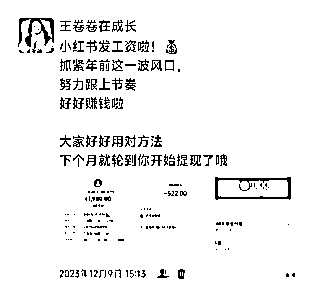
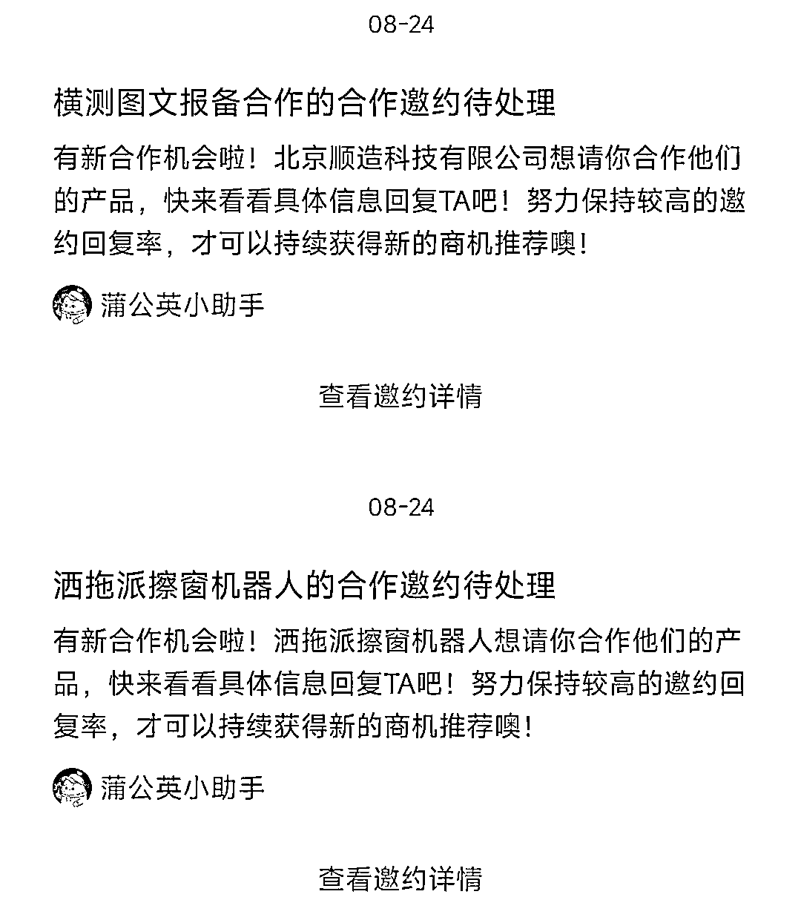
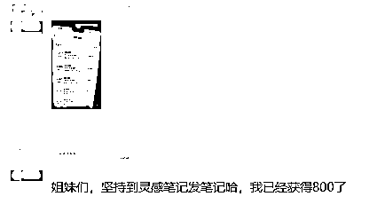

# 我好像找到做小红书能赚钱的秘密了

> 原文：[`www.yuque.com/for_lazy/thfiu8/enyec2s7hpdp0shl`](https://www.yuque.com/for_lazy/thfiu8/enyec2s7hpdp0shl)

## (51 赞)我好像找到做小红书能赚钱的秘密了

作者： 王卷卷在成长

日期：2024-01-10

大家好呀，我是卷卷，一个 93 年的全职妈妈，边带娃边做自媒体，去年变现了 10 万+，重启了自己的人生。

我自己做过好几个小红书账号了，都是做到千粉就没有动力更新下去了，今年不是有了直播的风口吗，我想冲一把，做个万粉账号出来，所以今年的重心会在小红书。

今天分享的内容也还是小红书哈，2024 想做个小红书账号赚钱的宝子们可以继续往下看了。

对了，如果你不知道怎么开始的话，可以找卷卷领取“7 份小红书运营资料”，关注我之后，在后台回复就可以了。

下面我们开始今天的分享：

之前在小红书直播的时候，总是有新人问我，怎么开始做小红书呢？

这可真把我问倒了，一句两句说不清楚，所以今天干脆给大家写篇文章说一下。

一、注册账号

首先我们得注册一个小红书账号，咱们如果还没想好发什么内容的话，其实可以用微信啊、qq 账号 等社交账号去登陆先大量的浏览你感兴趣的笔记。

等咱们确定要做的赛道了，就可以直接绑定手机号来刷对标账号了。

但我想给大家说个我自己的经验哈，就是大家别把养号想的太玄乎了，

咱们就想想自己不知道做小红书可以赚钱的时候，刷小红书的那种心情，带着这种心情去做小红书，一般都是可以把账号养号的。

正常的点赞啊、搜索啊、收藏、评论，关注，作为一个素人，这些动作你都是怎么做的，正常去做就行，

只不过我们把感兴趣的目标，换成咱们想模仿的人就可以了呀。

二、选赛道（做定位）

其实咱们选好赛道的同时，意味着咱们也做好了自己的定位。

之前很多博主说，定位不是想出来的，是做出来的，但是开始做之前，咱们至少得有一个大概的思路，

**这里给大家提供两种思路：**

愿意露面的咱们可以做有人设的 IP 号，分享自己的个人成长、学习自媒体的干货，真人出镜，真实场景，

那这样的话，咱们后期账号起来了，价值也是很高的，我们能接的广告也是很多。

愿意露面又有自己产品或者货源的，咱们也是走个人 IP 的思路，但是要记住哈，你可以做的选题就是围绕咱们自己的产品来做的。

做精准人群就好了，不要想着又要大流量，又想人群精准，这个是没办法做到统一的，咱们想赚精准人群的钱，就只能舍弃泛流量了。

比如你是一个教儿童画画的老师，你想给小孩子通过线上教学教她们画画，那你就不能去发你开画室创业的经历，你得分享什么？

分享你教小朋友画画的场景，分享你画画技术的专业，分享你带的小朋友画出来的画多好看，分享你画室的环境多好（这部分可以获取线下的流量）

有客源了你就可以出自己的儿童绘画课程。就按照这个思路去做就可以了。

**那咱们不愿意露面的咋办呢？**

咱们可以给自己布置一个学习的环境，拍不露脸的照片或者视频就可以了，这个你们可以去看静静教主，就用这种思路去做就可以了。

不愿意露面咱们又没啥自媒体经验，又不想花太多时间去学习的咋办呢？

卷卷也给你们想了个办法，我去年 8 月知道的这种做小红书的方法，起号还挺快，变现速度也挺快的。你们想学的可以继续往下看了。

这个赛道咱们统一叫它“**小红书商单**”，意思就是接商务合作的意思，简单来讲就是靠接小红书蒲公英（广告）的这种账号。

但是我们做的这种又跟那些大博主动辄一个广告几千的不一样，这种广告报价都很低，大概在 200-300 这样，

一个账号做到 1000 粉就可以开始接广告了，一个月差不多接个 8-10 个广告，赚个 1500-3000 就差不多了，再多害怕你们蒲公英等级异常了。

咱们要保号第二个月继续接啊，那可能会有人嫌弃了，就赚个 1500 块钱，有啥好做的啊。

你还别看不上，如果你多做几个账号你看看赚钱不赚钱，这时候又有人问了，小红书哪有那么好做起来，涨个粉丝跟登天一样难。

我之前也跟你们一样的想法，我之前做过两个 IP 号，涨粉其实都不是很快，而且特别费时间，写文案，作图，两三个小时就过去了。

发出去还没动静，你说气人不气人呢，这样很多人真的难以坚持下去。如果你是一个啥也不懂的自媒体小白，那是很难坚持下去的。

所以我去年 8 月发现这个赛道的时候，我觉得这个赛道简直绝了，真的适合我这种普通人啊，

于是立即执行，10 天就涨粉到了 1600，而且开始变现了。

后来我又用同样的方法做了第二个账号，也是很快就起来了。所以我才跟大家说，一定要多个账号去运营，才能多赚钱，我之前在一个群里看到一个博主运营 3 个号，一个月变现了 8000 多块钱。

好，那我们赛道选择好了，我们就可以去搭建账号了，接着往下看。

二、账号搭建

确定好自己要模仿的账号风格之后，我们就得给自己搭建账号了，也就是咱们的店面专修，

我们账号搭建包括：头像、昵称、简介，邮箱，实名认证（这个要重点说一下）

头像：建议大家用真人头像，这个容易跟粉丝建立信任，但是咱们如果实在不想出镜，那就用动漫图也是可以的。

如果咱们要做商单那种不露脸的类型，那我们的头像就可以直接找个动漫图就可以了。

昵称：昵称最常见的格式有：××在成长/××极简生活/××在逆袭等等

如果是不露脸的就自己想一个好记的就可以，也可以直接按照对标的模式，改后缀，加你自己的独有的昵称就行。

需要注意的是，千万别起英文名字或者繁体字，这样不太好叫哈，影响咱们名字的传播度。

三、笔记内容要利他

时刻要想到，咱们写的这个笔记别人为什么要看呢？你的内容有没有给人帮助，给到别人干货价值或者情绪价值呢？

想清楚这个，咱们也就知道该怎么去做内容了。

四、封面风格要统一

封面风格统一，粉丝点进去之后，发现你的封面整洁统一，是不是更愿意关注你呢？

五、笔记灵感去发布

亲测有效！我有个学员经常在这里去发笔记，她免费薅了很多官方给的流量券，真的很香，所以大家尽量去这里发布笔记哈，

**还有一个小秘密，新号你们一定要去订阅笔记灵感哈，会直接白给你 200 的流量券哦**

好了，以上就是今天的分享了，明天我们继续讲接下来的内容，关于小红书干货系列我会持续更新的哈。没关注的宝子抓紧时间关注一波。

#小红书

* * *

评论区：

坏脾气的小可爱 : 卷卷太厉害了宝！
王卷卷在成长 : [调皮][调皮][调皮]终于开始骨气勇气更新了谢谢小可爱么么哒
书豪 : 牛
芮 rui : 学到了，有用知识又增加了。
对我小红薯运营航海非常有帮助
微微星光 : 怎么做到一千粉呀

* * *