# 3 分钟，学会批量制作 100 条小红薯爆款笔记

> 原文：[`www.yuque.com/for_lazy/thfiu8/fgs64nw40mxmez3w`](https://www.yuque.com/for_lazy/thfiu8/fgs64nw40mxmez3w)

## (58 赞)3 分钟，学会批量制作 100 条小红薯爆款笔记

作者： 💖善士笔记💖

日期：2024-01-10

这是**善士笔记**打卡的**第 24 天**

日更一万天，做长期主义创业者

开篇善士想问大家一个问题：**如何一天制作 100 条小红书笔记？**

看到这个问题是不是感觉很惊讶？一天别说写 100 条小红书笔记，就是灵感突然乍现，写个 10 条差不多也就耗光了，更别提内容质量了。

是不是感觉有点难度？完不成？

**但善士想说，这都 2024 年了，试试 AI 工具辅助完成，效率直接翻倍。**

我每天都在使用 AI，今天与大家分享一下如何使用 AI 批量创作小红书笔记内容，带你进入一个全新的创作世界，让你能够以**更高效、更有趣**的方式写出优质的小红书内容。

**1**

**如何用 AI 批量创作小红书笔记？**

小红书笔记分为图文和视频两种形式，今天先教你批量做图文笔记。开始批量创作之前，先别急，我们先从使用 AI 工具，制作一篇小红书笔记开始。

**一、AI 写文案**

现在市面上好多 AI 写作工具，国外的有 ChatGPT，NationAI，国内的百度文心一言，copyAI，腾讯混元助手（目前在内测），火山写作等等。

几乎遇到一个新的 AI 写作工具，我都会尝鲜玩几天，用下来发现，在小红书文案写作中，还是有很多可以优化的空间，**这期间也遇到了比较适合写小红书的 2 款 AI 写作工具，接下来分享给大家。**

**1\. 多种草 AI**

[`duozhongcao.com/`](https://duozhongcao.com)

多种草目前共有 16 个 AI 智能写作功能，从账号定位、账号简介，到标题生成，再到正文写作、视频脚本创作一应俱全，覆盖小红书内容创作全流程、全场景。

**操作指南：**

只需要输入你的想法，再添加几个特点描述就可以了，获得 5 个标题和一段小红书带有 emoji 风格的文案，还有相关搜索话题。

这样一篇小红书的笔记就制作完成了。

如果你想获得的文案内容更加精准的话，可以试试用这几个方向：

**1.内容主题 2.要求和相关背景 3.产品特点 4.受众人群 5.表达语气等**

如果想批量制作同类型笔记，再点一下【生成】按钮继续生成下一篇，不到一分钟的时间。

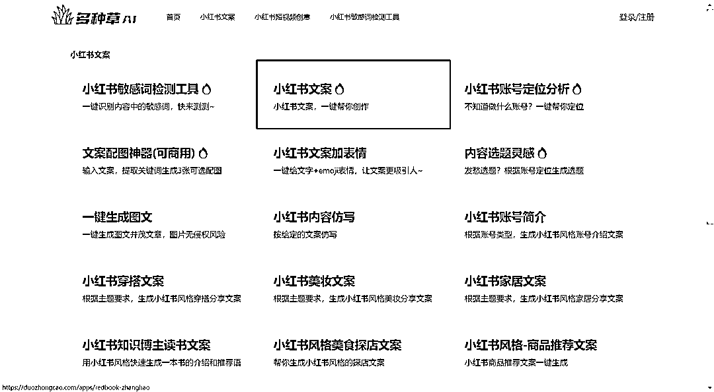

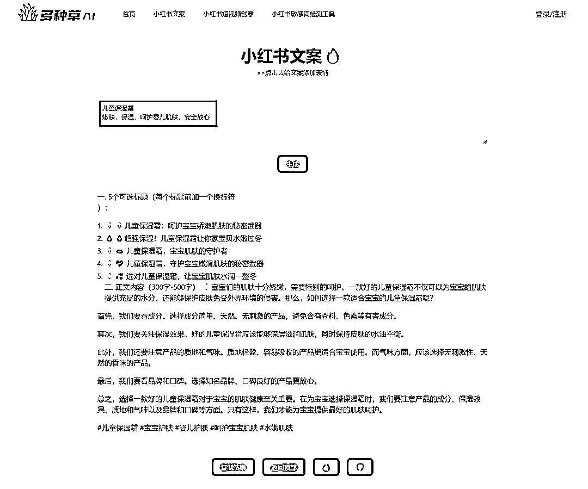

**2\. iThinkScene**

[`app.ithinkai.cn/`](https://app.ithinkai.cn)

自动生成自媒体文案，覆盖小红书、抖音、知乎等平台，图文、短视频脚本、直播话术等都能一键生成。

**操作指南：**

使用起来也是一句话的事，下面是举例子：介绍 6 个免费的 AI 绘画工具。马上就能根据需求生成一篇小红书笔记文案。

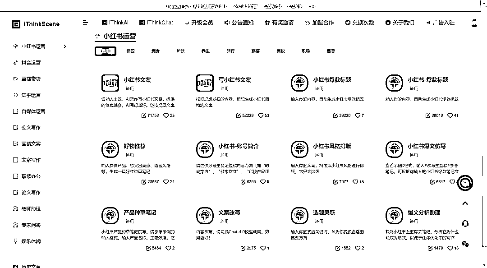

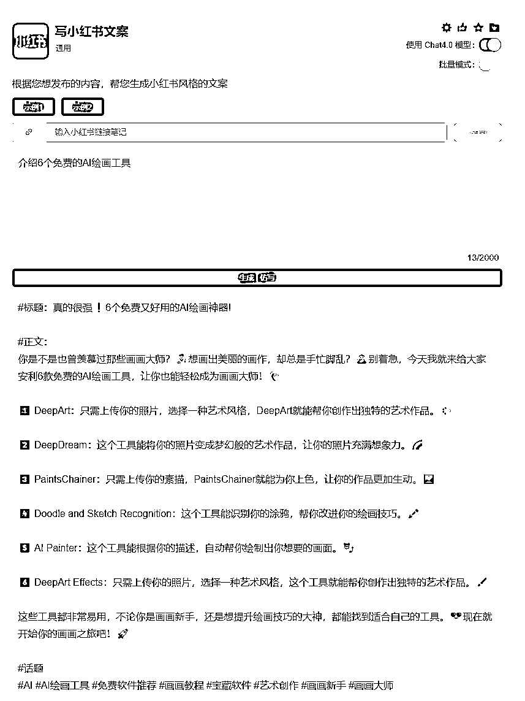

比较好用的是，iThinkScene 在制作笔记页面有一个**【批量模式】**的按钮，支持同时生成两篇内容。

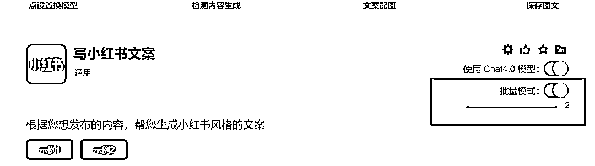

文案有了，那么如何制作小红书图片？

**2**

**二、如何制作小红书图文？**

**1.iThinkScene**

[`app.ithinkai.cn/`](https://app.ithinkai.cn)

刚刚咱们有讲到的 iThinkScene 文案生成下方有【文案配图】按钮，开启这个功能就可以在网站已有模板中挑选合适的图文封面进行一键生成了。

**注意：**

1.你的笔记标题字数需要与该模型标题字数对应，字数只能在模型最大字数以内才能使用。

2.此项功能需要开通会员才能使用。

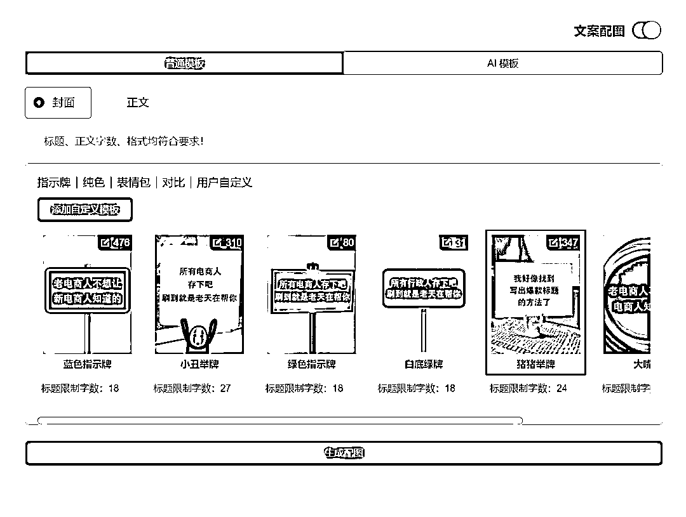

**2\. canva**

[`www.canva.cn/`](https://www.canva.cn)

这个里面的模板大部分都是免费的，可以直接拿来调整使用，而且里面有丰富的素材库可以直接添加，我自己也在用。

一般操作就是，先选中一个模板，然后根据自己笔记的风格粘贴文字，稍微调整一下布局，制作完成一页图文以后，右上角再次添加一下页面，就能实现批量制作了。简单好用，小白也能轻松上手。

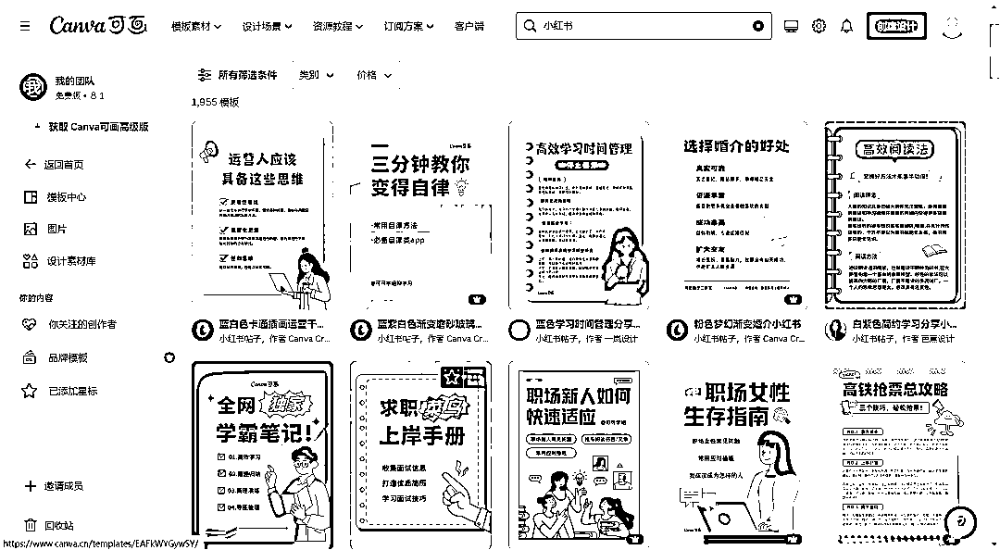

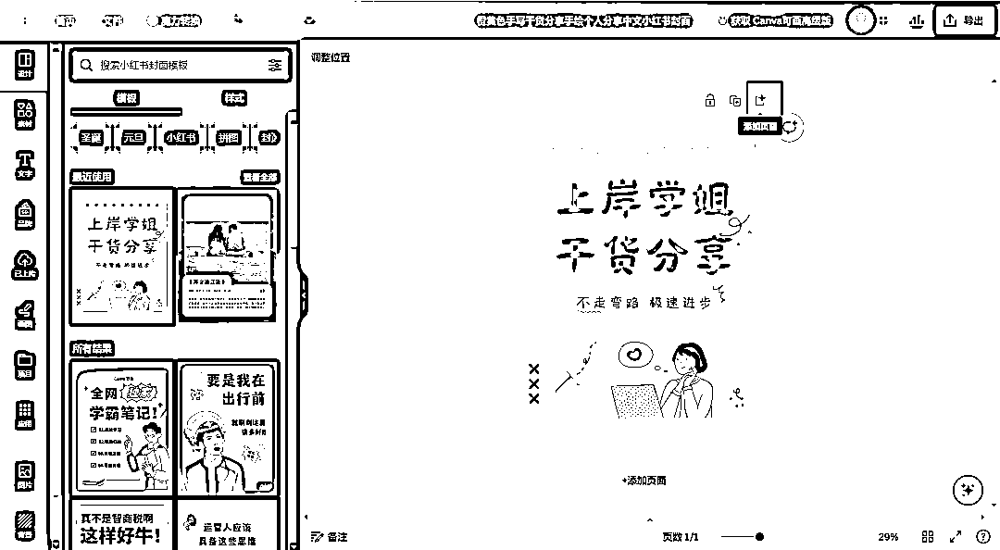

**3.稿定设计**

[`www.gaoding.com/`](https://www.gaoding.com)

稿定设计里面我一般会用到两个工具帮我实现批量制作图文。

第一个：

同样是直接搜小红书模板，这个跟上面 canva 的操作是一样的，找模板，换文字，再添加页面就可以了。

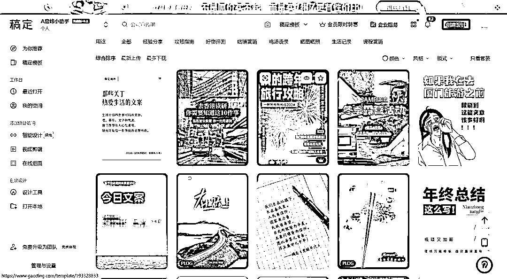

第二个：

稿定自从 2023 年中旬就开始添加各种 AI 工具。

如果不想用上面的模板，想出自己的风格，又不会设计的小伙伴，制作小红书笔记，可以在【设计工具】里面找到【小红书封面】，添加一个主副标题，就能 AI 自动生成一张封面，然后继续添加页面，稍微改动就可以了。

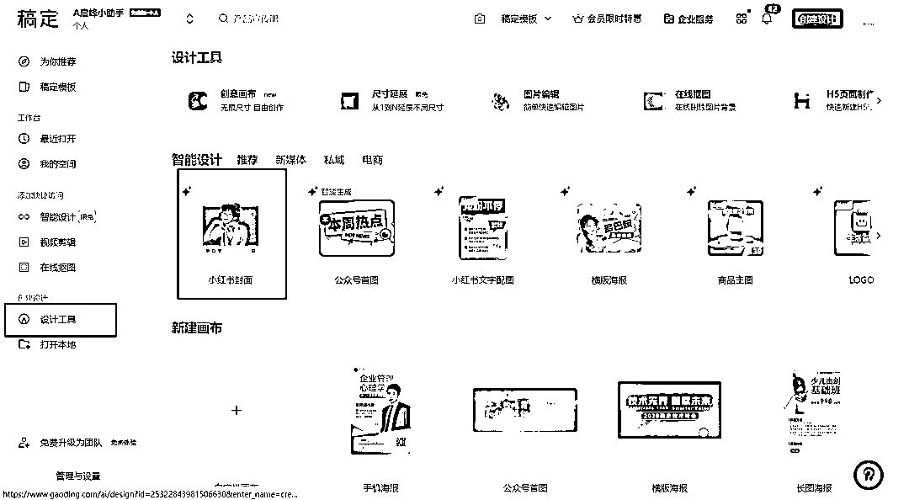

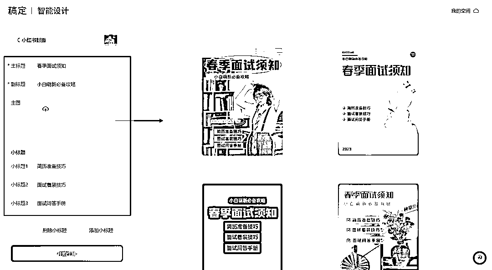

**以上就是今天想要分享给大家的内容，流量为王的时代，如果你没有过硬的内容，那就先从量变开始。**

不断的动手实操后，就会有质的飞跃，不要觉着难，用好工具，一切都会变得简单起来。

* * *

评论区：

💖善士笔记💖 : 这是善士笔记打卡的第 24 天
日更一万天，做长期主义创业者
快乐小新 : 感谢
Jeffrey : 多种草用起来不错
💖善士笔记💖 : 有用就好
芝士巧克力 : 感恩分享[强]
💖善士笔记💖 : 喜欢就好

* * *