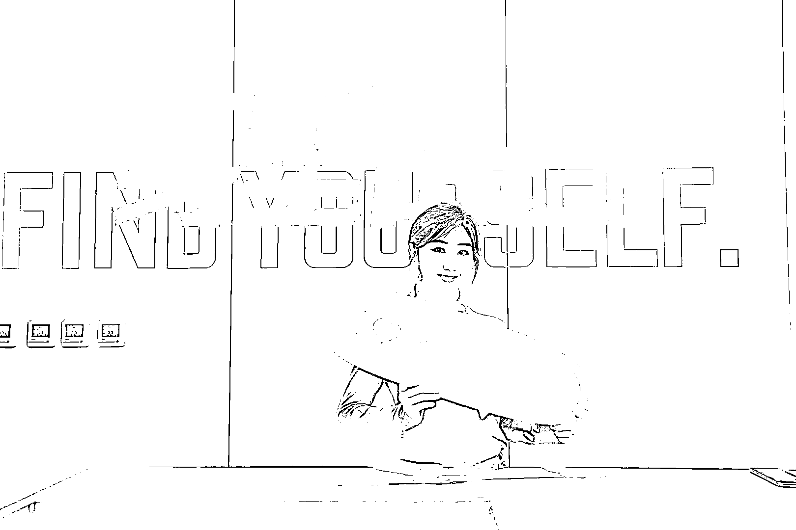
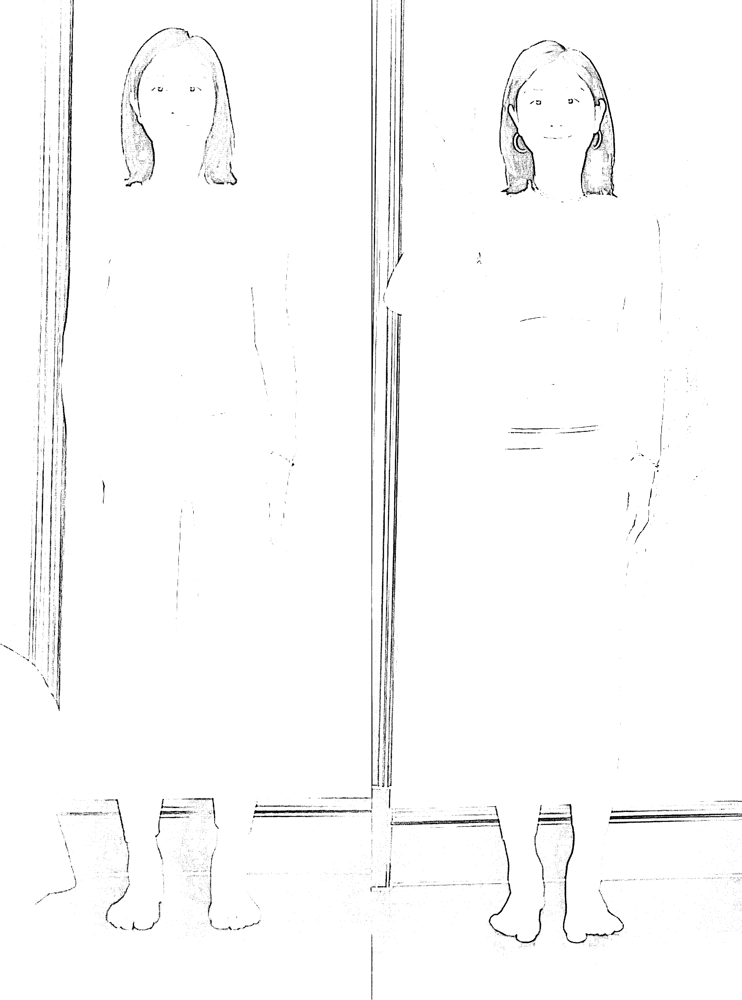
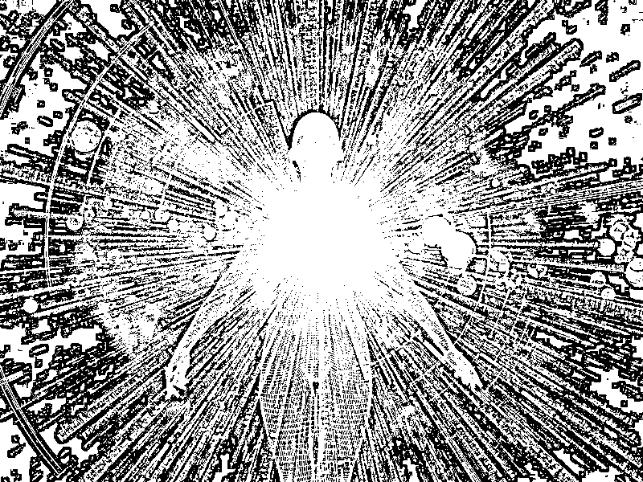
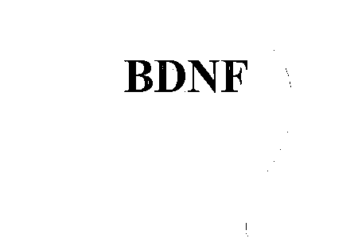
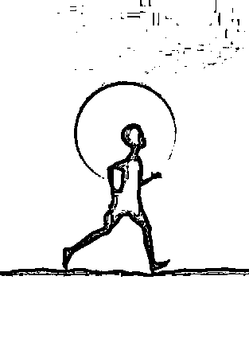
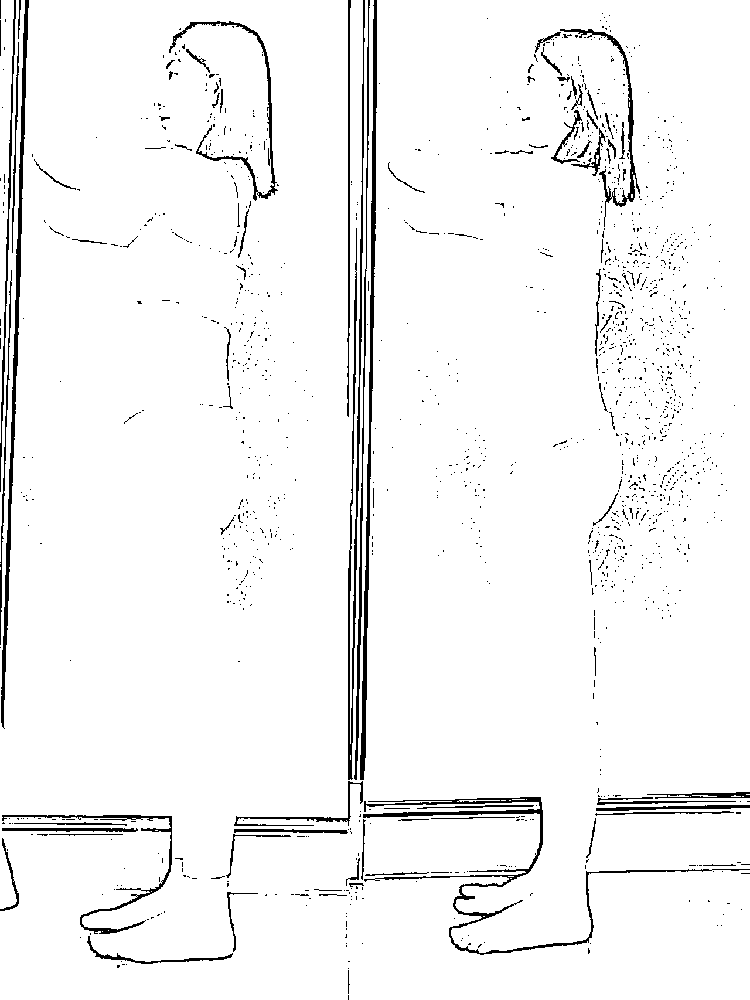
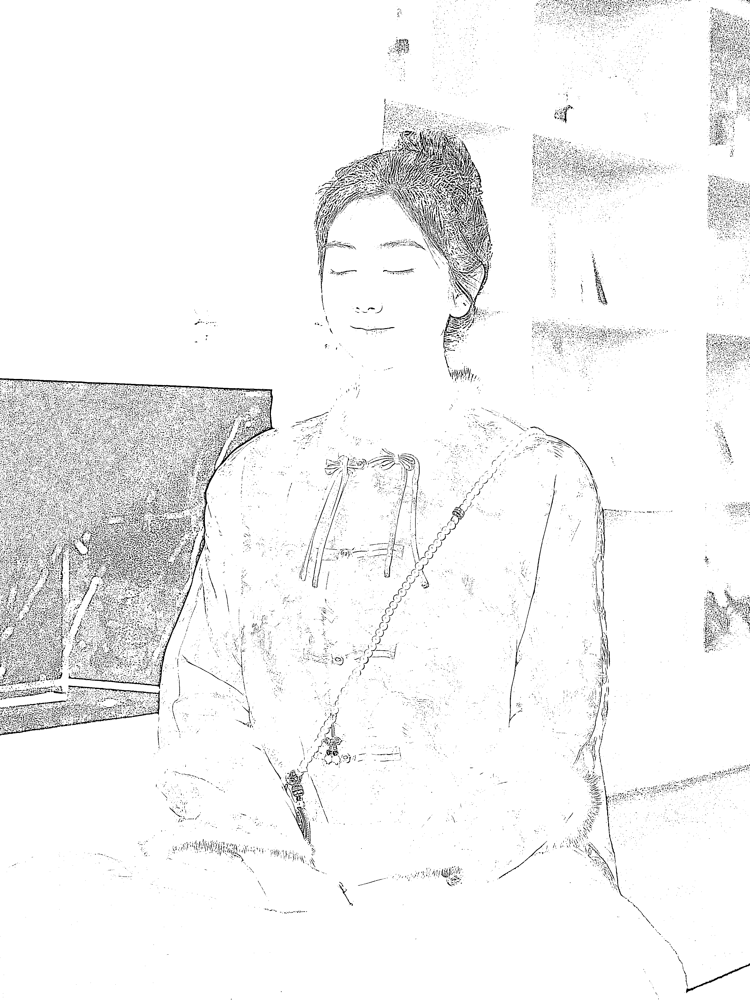
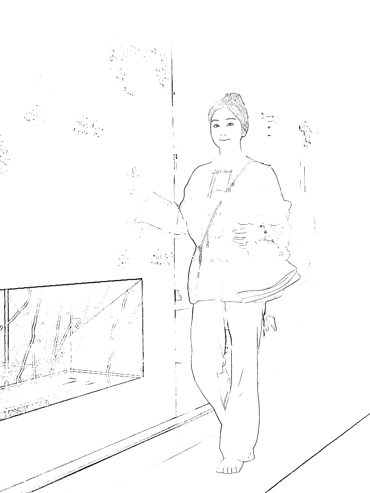

# 创业者如何恢复守护能量，消除焦虑内耗，元气满满赚钱

> 原文：[`www.yuque.com/for_lazy/thfiu8/gn2cka3eozzw7zw7`](https://www.yuque.com/for_lazy/thfiu8/gn2cka3eozzw7zw7)

## (32 赞)创业者如何恢复守护能量，消除焦虑内耗，元气满满赚钱

作者： 碧瑶

日期：2024-01-10

大家好，我是运动疗愈教练碧瑶，在全网拥有 100 多万粉丝的「治愈系运动」博主。擅长通过各类动静的运动调节情绪，缓解压力，管理身材，减少内耗，让精神安住于身体，保持身心脑一致，自在畅快的表达自己的灵魂。

作为创业者，很多人都经历过心力交瘁、身心疲惫的状态。自己内在的精力已被耗尽，而表面还像一个炫线木偶在支撑着。其实只有自己知道，距离身心崩溃只需要一刹那间。

今天也同样作为创业者、疗愈教练，我来跟大家分享将我自己、和我的学员能量状态彻底改变的方法。让你**快速恢复能量保持能量，消除焦虑内耗，元气满满赚钱。**

>三年前，我创业做了运动行业的 MCN 公司，成立了自在身心瑜伽体系，提出「运动疗愈师」理念。而我本人也是一个把运动当作我终身信条，和奋斗使命的人。

我 16 年在 Keep 初创团队做产品研发经理和瑜伽体系负责人。当然了，我并不是运动科班出身，我的老本行是金融与会计。毕业于英国曼彻斯特大学商学院金融硕士，也是一名 ACCA 注册会计师。

>缘起

转行的原因，就跟我的身体和情绪有关。先来讲讲缘起：

12 年前，我因为自身代谢性疾病，吃饭、睡觉、精神、情绪、身材都差到了极点。医生告诉我是遗传性的，终身服药就好了。那时候，刚刚 18 岁的我看着周围活力、漂亮的、好身材的同龄人，心情一度抑郁，也开始自我封闭。

那个年纪我肯定是不服于现状的。在我当时的男朋友（现在的老公）的鼓励下，他带我走入了健身房，规律运动、健康饮食，系统学习关于人体和心灵健康方面的知识。没想到我竟然如此疗愈了自己的身体，收获了令人羡慕的身材，更是拥有了「运动精神」，帮助我走入了非常多的人生高光时刻，也决定了我一生的事业和使命。

所以，起局我现在的事业，我沉淀了 12 年。

亲身实践的同时在社交媒体记录分享、后来到从事线上线下教练、再到成为 Keep 的初创核心课程设计师，也发现大家运动的真正目的并不是减肥这么简单，而是要缓解自己的焦虑，希望变美的同时，更希望变得更强。

2020 年，在我创业初期恰巧刚刚怀孕，后来面对着初为人母、面对初创公司的繁杂事务、面对着突如其来的一起，我每天背负着很大的压力和负面情绪，脸上前所未有的爆痘、长胖、而且精神精力都很差，没力气全对任何事情。

于是我开始第二次自我救赎，不同的是，这次我加上了静修修心的部分。

先给大家看一下我自己在压力巨大能量很差的情况下，开始身体运动+静坐冥想 30 天之后面部和身材的变化：

也是从那个时候开始，我更加坚信运动+冥想助力保持好状态、好精力的最佳良药。

通过这件事情，我的自在身心瑜伽体系也逐渐研发成型了。

自在身心瑜伽跟大家平时接触的瑜伽有些区别，它是以东方智慧为底层逻辑，结合了西方人体、运动、营养科学理论集合而成的一套更适合东方人的，练身、修心的训练体系。

1.  通过运动修身做身材管理

2.  通过静坐冥想做情绪管理

3.  通过读书提升智慧和认知，做心力管理，

这是三个生而为人非常重要的自我成长系统

而课程也是以陪伴、共修的形式，在社群内进行的。

>他/她们的变化

我的其中一位学员，她是一位工作能力超强的创业者。用一年的时间将一个接散单的广告公司做到了流水千万，为大型综艺节目策划广告植入的公司。在第二年，她感觉耗尽了所有力气，想要解散公司，并不是因为不赚钱，而是因为她心力交瘁。

她在我的直播间遇到我，跟我做了一次晨间伸展和静坐，说我从来没有感觉到过原来我的精神也可以充电。她说这两年她虽然物质富足，团队也给力，但是自己时刻处于高压状态，精力完全被耗尽。无论是健康、体重、情绪神经状态都像一个炫线木偶。

她暴饮暴食、间歇性疯狂运动，睡眠越来越差，夜晚就是她最恐慌空虚的时候。事业一做就能来钱，但是一但开始，感觉随时就会崩溃。

她尝试过很多调整状态的方法，多睡觉、规律运动、看心理咨询、出去旅行，都找不到精神充电的感觉。她说我一直是个能力很强的人，但现在厌恶自己怎么能力这么弱了。

我问她，你想过能力和能量的区别吗？

这一问，她想了很久。

能力是一个人成事必备的属性，也是每一个创业者都有用的东西。

而能量，是助力你能够发挥能力、并且持久发挥的必备基底。

一个有能量的人，能自如的应对压力、遇事不慌做事不累，精力充沛得迎接挑战搞定难题。

一个有能量的人，大目标和方向感会一致很强，很少会迷茫，能够觉知自己的优势，持续点燃做事的动力和热情。

一个有能量的人，拥有更稳定的情绪，更理性的反应，和更自如的表达。懂得如何与自己相处、如何他人的关系相处。

因此，有能量的人内心的力量是很强的，对自己的认知、觉知、和表达都是自在自如，豁达欢喜的。

后来，她开始跟我做自在身心瑜伽，我们在线上共修。每周按照我定制的课表做疗愈主题的运动+晨起和睡前冥想+培养正念饮食+共度读身心方向的书籍，一个月后，她给我的反馈是，她又活过来了，她又变成一个鲜活的人了。不仅如此，她这一个月可以跟食物好好相处、睡一个踏实安稳的觉，运动也逐渐规律，非常健康的瘦了 5 斤，肤色都看起来更白了。

>补充能量的终极公式

其实很多创业者都是如此，一直都在忙碌，在向外追赶，从来没有向内看过自己。直到问题出现，才意识到能量远远比能力更重要。而随着疫情开始的这几年，越来越多的人体验过了身体健康差、情绪状态差，对自己的工作生活究竟能有多大的影响。这才开始重视起了运动、冥想等等一些修心的方法。

内在有能量的时候身体自然会健康，想做更多事，也会由内而外散发出来吸引力，带着你去完成你想都不敢想的很多事；而没能量的时候先别说做不做事，保证别生病才是要紧的。

而通过我这些年自己的训练经验，在线上线下带学员，我总结出来的补充能量的公式是：

能量=外貌➕健康➕精力➕脑力➕心力

而外貌，其实是内心状态的显化。

而实现他们的方式是通过：

疗愈运动+正念冥想+读书写作

练身改善外在，提升健康，修炼精气神；

修心身心脑一致，增长认知，提升内在韧性。

>运动改造大脑

提出运动疗愈这个理念，是因为运动本身是一个向内探索的过程，很多不运动的人，是不熟悉也不会感知自己身体的。除此以外，运动还有更深一层对人的影响。有一本书叫做《运动改造大脑》你会重新认识运动对人生的意义。

接下来我会通过书中的三个观点跟你分享，运动对我们大脑、内心、情绪，究竟有多大的影响。

一、运动刺激脑神经元，开发大脑

我们的运动和思维模式都跟祖先的进化息息相关，祖先会进行大量的运动才能够追到食物、养活自己。因此，大脑和运动之间形成了一个链接，运动会刺激大脑神经元，由此带来了更复杂的运动动作，所以才形成了今天如此复杂又宏大的人类大脑，甚至会影响我们的思维模式。

但是，想一想，今天人们的运动量有多少呢？

运动量大幅度下滑，导致现代人的一系列心理和生理问题，包括抑郁症、焦虑症等，跟运动量不够都息息相关。

为何如此呢？这要从一个叫 BDNF 的概念说起。

BDNF 叫脑源性神经因子，可以理解为大脑的肥料，为大脑提供营养物质。也就是说，BDNF 促使了大脑神经元之间的链接和活跃程度。连接变强了，你的大脑就会变得更厉害。书里的实验证明，运动恰好能够促进 BDNF 的分泌，我们在运动身体的同时，也在锻炼着自己的大脑。

二、运动可以大幅度减少压力，因为运动可以给人带来「掌控感」

人们通常觉得压力大是因为我们觉得失控，很多事情是我们控制不了的，因此自我评价变低、对未来的期望也会降低。这个时候，当你能够在自己的身体上产生掌控感，你就会觉得能够掌控你的人生，那种喜悦和快乐就能够大幅度缓解压力。

三、运动可以缓解和治疗焦虑

运动可以通过缓解肌肉紧张、增加血清素抑制神经递质和氨基丁酸来治疗焦虑，医生在治疗焦虑症的时候，通常会给患者吃一种叫做 beita 受体阻滞剂的药。而运动也能够分泌这样的东西。当心率达到一定程度的时候，自己的体内就会分泌这样的东西，会让人变得不那么焦虑和恐惧。

除此以外，大家熟知的内啡肽和多巴胺的分泌，也是我们运动的时候感到快乐的主要原因。

>大家看到这里，就能明白为什么我们想修炼一个好的心态、好的状态，不只需要静态的冥想，更需要动态的运动。

动+静，修身+修心，才是最根本的提升自己的方式。

>运动难坚持？

但是说起运动，可能大家会说，道理都懂，但就是运动太痛苦了，自律不了，也坚持不下去。其实运动的方法对了，不存在坚持。举个例子，如果说去吃火锅、或者吃甜品，让你每周吃 3 次，你需要逼迫自己自律或者坚持吗？答案一定是 no，因为你在吃的过程中是享受的、快乐的。

所以让大家无痛自律、或者能够坚持一件事情的唯一方式，就是你在做这件事情的当下是快乐的、满足的。除此以外，别无他法。那么运动，也变成跟吃火锅或者甜品一样让我成瘾，让我快乐吗？

答案是，是的。这也是我研发自在身心体系的原因，希望大家不仅仅练后得自在、在练习的当下也是自在、舒服、喜悦的。那么怎么能够做到呢？

>自在身心体系便是无痛自律的过程

一、根据身体构造安排合理的运动

很多人坚持不了运动，要么是因为选择运动太累、要么是因为刚开始不久就受伤了。这都是因为你在不了解自己、也不了解运动的情况下选择了不合理的项目。你的身体从未适应过某个模式，这时候你突然对它发起挑战，它当然要对你作出反抗。所以了解身心构造，身心所需很重要。

经所以想要坚持运动的同学们，正确的运动顺序来了：

先练【筋膜】

再【调整呼吸模式】

然后【矫正不良体态】

接着是【关节灵活和稳定性训练】

最后才能开始高强度【燃脂塑形等训练】

而大多数人都是在没有给身体过渡期，直接开始了不适合你的运动。你的身体要么痛苦要么受伤，你自然也坚持不下去。自在身心瑜伽里，运动练身的部分就是从筋膜开始练习，让你在身体和内心都极度舒适下开始运动这项生活习惯。而你不用担心效果满，因为从筋膜运动开始，你就能肉眼可见的看见自己神奇的变瘦了。就跟做完筋膜美容，你的脸能够马上小一圈是一个道理。

当你练习的时候内心极度舒适、练后身材效果立竿见影的时候，你还会担心想要放弃吗？

二、简单快速地开始冥想

当人在冥想的时候，就是静心、内观、恢复自己对自己认知的过程，也是最容易产生心流和内心充盈感受的过程。

*当人可以时刻处于平和状态的时候，便会吃得好睡得香，也会更有精气神在忙碌之余做运动。配合运动时，当内心静定、大脑清醒之后，你便会更自然得去坚持。

还有一项值得分享的研究成果是，当人拖延症犯了的时候，马上开始 10 分钟冥想，效果非常显著。

三、阅读与身心相关的书籍

知其然、知其所以然。当你能够了解做一件事情的底层原因和逻辑，能天然激发你去做一件事的动力。所以在我的体系中，运动+冥想+读书三者缺一不可。而每一个阶段对身体不同的运动方式，会搭配上相符的冥想和书籍。

我会带着我的会员精读《运动改造大脑》去真正了解运动对人体的神奇之处；

精读《清醒地活》体验冥想如何带来一个全新的自己；

精读《学会吃饭》在静坐中找到对于饮食的正念，去享受真正享受美食本应为人带来的喜悦、而非克制和贪婪的恶性循环。

通过以上三者的配合，在我自己实操，和 10 年的教学经验中，帮助无数个想要变美变强、想要坚持运动但放弃无数次的学员蜕变了。最让我感动的是，有几位线上学员对运动的热爱已经持续了近十年，而后也因此成为了健身/瑜伽兼职教练，为自己和更多人带来蜕变、治愈、和正能量。

所以，通过这些年自己的实操，和线上线下带领学员实操的经验，大家应该能够感受到通过身与心的训练，可以让自己外在美、内在能量强，做一个感染力超强的人。大家所熟知的吸引力法则，一定是首先你变强了，那么你所吸引来的一切便变得没有那么吃力。而你会收获的回报也会是自然而然会发生的。

因为你，全身都在绽放光芒。

最后，祝愿大家都可以开始运动、开始冥想、开始阅读与身心相关的书籍，找到承托自己能力的那一份最重要的，能量！

* * *

评论区：

哇咔丸 : 我在做运动疗愈课，能加 v 交流吗？
碧瑶 : biyaoli ～
Jaffe 西木 : 高度认同，非常科学[强]

* * *