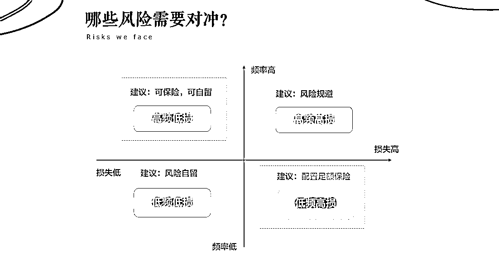
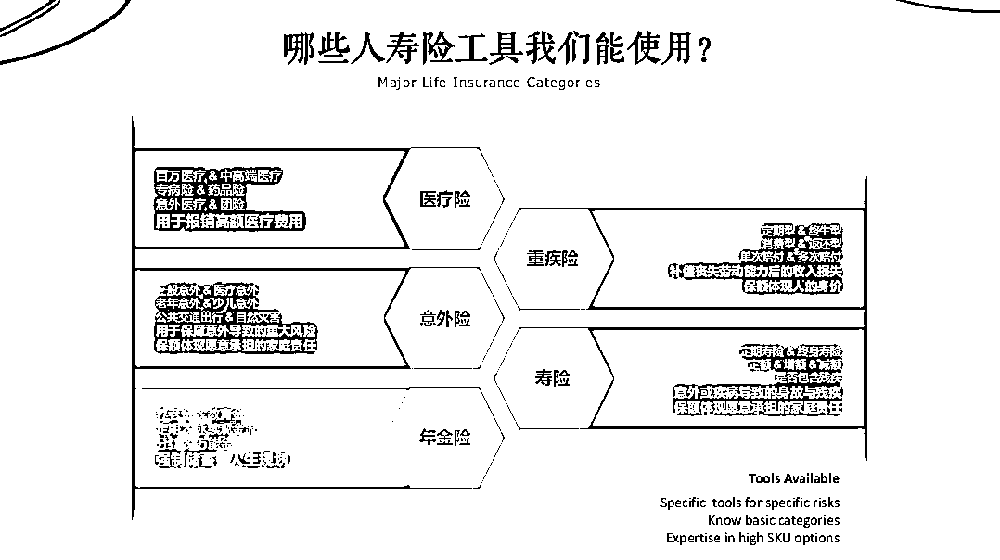
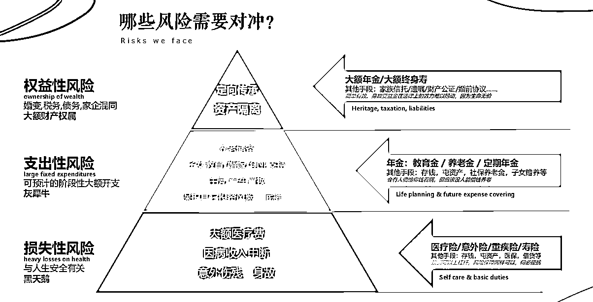
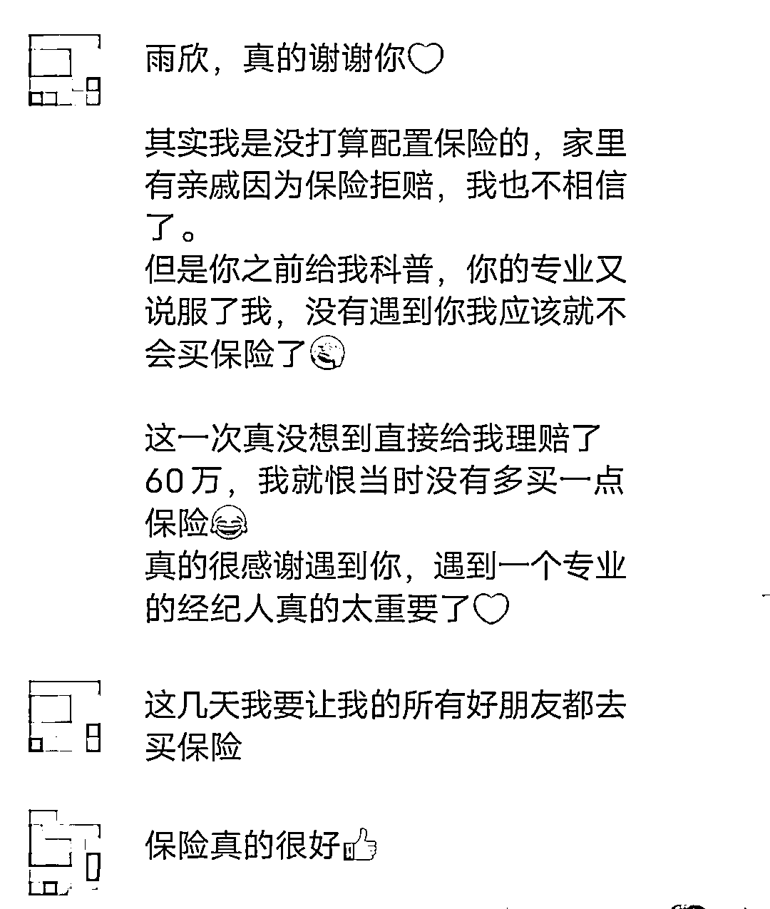

# 给自由职业者的保险配置指南

> 原文：[`www.yuque.com/for_lazy/thfiu8/ghfhibbn9cbq27nd`](https://www.yuque.com/for_lazy/thfiu8/ghfhibbn9cbq27nd)

## (14 赞)给自由职业者的保险配置指南

作者： 雨欣

日期：2024-01-09

生财之星你们好啊！我是头部保险经纪人雨欣，一个从编制内语文老师辞职到保险行业，又从保险行业把自己做成理财顾问的专业搞钱人，保险老司机。

每次跟生财自由职业的圈友，同时忙碌好几份工作的圈友聊天，聊到理财，我都会发现大家并不知道自己如何规划理财。甚至都没有要保险配置的意识。

但当我跟他们说，保险配置完，把兜底的部分规划完再规划上冲的部分，他们认为确实应该有一个保险。结果我一看体检报告，有一些伙伴已经没有资格买保险了。

有些朋友则是跟我说自己家里有保险，但是不知道自己买的好不好，资产配置对不对，我一看，浪费了很多钱，少赚几十万。

所以，如果你正在考虑把保险作为家庭资产的一部分，或者对保险有疑虑，或者家里买过保险，但是对保险的认知只是局限于理赔，那读完这篇文章一定会知道如何给自己做资产配置，选对保险

全文 6000 字，不推荐保险，只解决问题！

选择保障好的保险，却又云里雾里的，看这一篇文章就够了！

目录：

1、编制内老师转保险赛道，从自己理财到帮助大家理财

2、服务 600+ 客户后，我用自己的方法论总结的最佳理财框架

2.1 保险如何保障人？自由职业者如何配置？

2.2 保险如何保障钱？自由职业者如何配置？

2.3 如何搭建最佳理财框架

3.总结：一厘米宽，一万米深

## 一、**编制内老师转保险赛道，从自己理财到帮助大家理财**

我之前的工作是编制内的语文老师，问题解决型学习者，编制内工作做的并不喜欢，主要还是在于这个工作没有带给我成就感。

当了老师后才发现老师原来并不是我所想的那样教书育人，学校也不过是一个公司。教书只是其中一项业务，还有各种其他业务，开党会，完成领导的 KPI，组织活动，手写上万字的读书笔记。但这些事情在我看来都是都是琐碎的浪费时间的面子工程，而我又不得不做。

没有成就感迫使我想要找一个适合自己的工作。加上我习惯于遇到问到解决问题。所以当老师的那段时间学了各方面的知识。

喜欢心理学，又想解决学生的心理问题，考了中科院的心理咨询师的证。也想过要转型为心理咨询师。

喜欢英语，发现招聘 APP 不少好的工作需要会英语，开始上手读英文版的《西方文明简史》，花大量的时间精力金钱去考雅思，为跳槽做准备。

又因为大量的学习和知识付费，每个月会月光这个问题让我思考怎么理财，学习金融和理财规划，考了各种各样的证书，理财规划师，养老规划师。

在那个时候就已经接触到保险了，但是我自己都没有想过自己有一天会成为保险经纪人，我只是在为辞职做准备的时候，把路上遇到的各种问题都解决了一遍，但在拨云见日之前，我也不知道我适合什么。

虽说现在看来，过去学习过的很多知识都在为现在的我赋能，英语，心理学，宏观经济和微观经济，社会学，逻辑学，金融和资产规划，这些都让我对这个世界有深刻的洞察，但在当时，我只是想要多探索世界，快速找到适合我转行的赛道。

直到我自己的学生家里遇到变故，严重的疾病拖累了孩子的家庭，我突然想到其实遇到重疾应该是可以用保险对抗这种风险的，我还没有多少存款，我不希望自己因为疾病把仅有的一点存款花光，于是开始了给真正意义上的帮人配置保险。

因为了解过代理人和经纪人的区别，知道经纪人不会站在一个保险公司的立场去推荐产品。而**我的初心就是给自己和家人配置专属于我们的个性化保险，为身边的信任我的朋友提供他们的私人定制的专属保险方案****，**所以我的配置保险的过程也是自学，考证，给自己和家人买好保险。

我用一张图说明经纪人和代理人的区别，看完这张图你就明白为什么我没有选择一一询问身边的代理人，而是自己去学习成为经纪人。

配置完自己和家人的保险之后就是好友同事，一些学生家长。身边信任我的朋友我都让他们做好兜底的规划。

而研究不同家庭的风险规划的时候，我发现这个工作非常适合我的学习需求，就这样，本来辞职前夕规划的独立教师赛道，因为各种各样的原因，突然转行去了金融赛道。

而前期大量的知识学习和整合，也为我从保险经纪人转型为更加宏观的理财顾问做下铺垫，现在的我不仅懂保险，也懂股市，基金，各种金融工具。今天的内容主要是分享保险，之后我会再写一篇帖子，跟大家分享，普通人如何做到年化 10%

## 二、**服务 600+ 客户后，我用自己的方法论总结的最佳理财框架**

首先，保险是一个金融工具。既然是金融工具，就必然有杠杆作用。简单来说，就是用 1000 元，撬动 100 万的杠杆，而这种杠杆放在保险里就是医疗险，重疾险，寿险等产品，花较少的钱，撬动更高的杠杆。

其次，保险的另一个金融工具属性是：对冲风险。巴菲特和查理·芒格最喜欢的金融工具之一就是保险，因为保险能对冲他们的高风险投资，这也是这两位投资大佬的对冲基金（Hedge Fund）的底层逻辑。

那什么是对冲呢？对冲哪些风险呢？如何对冲呢？

简单来说对冲就是做一些毫不相关的事情，比如你很喜欢买股票，股票作为高风险高收益的产品，存在较大的可能性损失本金，那你就需要选择一个降低损失的金融工具。可以是存银行理财，也可以是存保险。

但其实不是所有的风险都需要对冲的，比如我们切菜的时候存在可能性，会不小心切到手指，这种情况想要降低风险，可能是雇佣一个保姆来切菜。但你会为了手指不被刀划伤而雇佣人做菜吗？这个一定不是主要原因。

所以像这种虽然频率比较高但很小的风险，我们可以自留。

但有些风险属于频率低，但一旦发生损失极大的风险。比如车祸，比如发生重大疾病，如癌症、急性心梗等。

面对低频率高损失，且必然会发生的风险，我们的最佳应对方式就是配置保险。

而自由职业者尤其需要保险，一方面确实因为工作忙碌，时不时会熬夜。还有一方面是，工作不稳定，一旦发生发生重大疾病，体制内的人可以一边发薪水一边休假几年，但自由职业者就直接没有收入几年了。这种损失，自由职业者尤其无法承受。

至于高频率高损失的风险，比如工地工人，跳伞教练，当警察，如果不是天命感召你，我的建议是直接不做，规避风险，除非热爱。毕竟这种高风险职业，绝大多数保险公司都不愿意承保。

**2.1 保险如何保障人？自由职业者如何配置？**

对于保障人的保险，统一都被叫做人寿险，这些工具都有不同的用途。

**（1）.医疗险**：用于报销医院内的医疗费。市面上的医疗险种类繁多，医疗险中的基础保险是社保，但社保是广而不包。这就好像去学校食堂吃饭，我们可以吃到最便宜最实惠的菜，但是如果想要吃的好，就需要去下馆子。

社保的作用是，保障最基础的药物——甲类药和乙类药。而药效最好，价格也最昂贵的进口原研药，丙类药，社保均不会报销。比如辉瑞制药厂，这个药厂的药前期花上亿的研发成本，药物昂贵，药效很好，得重大疾病的人又更倾向于花重金买好药，这些都是社保不报销的。电影《我不是药神》讲的就是这种买不起药的境遇。

社保之上就是惠民保了。惠民保是政府推的惠民类的保险，价格便宜，报销一部分，不需要健康告知，对于买不上保险的老年人来说是很好的选择。

惠民保上去是百万医疗。百万医疗就好像电动车。它可以通过较少的钱实现较高的杠杆，但因为作用有限。

百万医疗再上去是中端医疗，中端医疗就好比是小汽车。使用频率也非常高，适合自由职业者。

另外还有一个高端医疗，也有一部分自由职业者或者创业者可以配置的保险，高端医疗就好像坐飞机了，它所解决的问题就不仅仅是风险对冲，还有海外最先进的医疗资源，或者指定到大陆任何一家三甲医院的最好的专家医生那里。这部分钱是花资源人脉，高效率，好体验上面。

**（2）.重疾险**：医院外要花各种的钱，重疾险直接给一笔钱。重疾险经常会被大家跟医疗险搞混，其实重疾险是翻译不够好的问题，它最初发明的时候，名字叫失能补偿险，所以本质就是补偿收入损失。

比如翠花作为自由职业者，年收入 30 万，如果得了肺癌，休养 5 年，这 5 年的收入损失就是 150 万，且这 5 年还可能花钱请护工，买补品，去疗养胜地休养。重疾险就是在补偿医院外这些隐形的花销。

医疗险和重疾险往往都是不可分割的一对。因为它们是在不同维度解决同一类型的风险——低频率高损失的重大疾病风险。

因此，重疾险的额度测算也往往按照 3-5 倍的年收入来测算。

**（3）.意外险**：报销意外导致的风险。主要有两个方向，一个是高频率低损失的风险，还有一个是低频率高损失的意外。

高频率低损失的风险就是之前提到的切菜切到手这种了，还有猫爪狗咬，摔倒骨折，鱼刺卡喉咙，小孩子追赶打闹弄伤。

低频率高损失的风险主要就是车祸，飞机失事等。一旦发生就是巨大的损失。

现在的意外险往往也都是综合的，低频高损和高频低损责任都包含，自由职业者日常也会用到。

**（4）.寿险**：死亡或全残会赔付一笔。如果你是丁克的自由职业者，可以不需要寿险，因为寿险管的是身后事，死亡后赔付，一定是把钱打给家人。

比如翠花关心自己孩子的教育费，死后配偶要一个人还房贷，父母的赡养，那翠花就需要寿险。

另外，寿险还有一个金融工具属性是资产传承。

## **2.2 保险如何保障钱？自由职业者如何配置？**

图片中还没有讲到的就是年金险，它的主要作用就是保障钱。

****年金险**：每年给钱的保险。因此它的作用是子女教育金规划、家庭理财和养老规划、传承规划。**

**常见的年金险的形式是跟社保一样的，每年存一笔钱，退休之后开始每年领钱至终身。但也有灵活的年金险，比如 5 年或 10 年之后后就开始领取至终身。**

**我在过往的咨询中，遇到相当多的用户都是私企或者自由职业者想要配置年金险，最重要的原因还是，社保是按最低档交的，等到退休的时候每个月领 2000 到 3000 左右，完全不够生活。**

**因此在年轻的时候就给自己配置一笔年金险，等到退休的时候，加上补充的商业养老金，每个月可以领 1 万甚至 2 万，比公务员还多。**

**而且终身的现金流，可以规避长寿带来的花光钱的风险。**

**假设翠花给自己 60 岁存 200 万，一年花 10 万，20 年花光，假如翠花活到 100 岁，剩下 20 年怎么办呢？这个境遇就是当下日本的境遇。**

**但假如翠花把 200 万变成每个月领 1 万，那她就可以每个月领 2 万到 100 岁。翠花一共领了 960 万。**

**年金险的作用也正是对冲养老风险，以及类似的，可以预计的，一定会发生的，大额开支的风险。**

****

**除此之外，寿险中还有一种可以对冲权益性风险的保险，叫做**增额终身寿险**，想了解具体如何规划整个家庭的资产配置，可以关注下一篇文章。**

**总而言之，人生的绝大多数风险，我们都可以使用保险来对冲。**

**首先最基础的是损失性风险，也就是黑天鹅事件，不被人轻易注意，概率小，但一旦发生损失很大的风险，比如疫情，比如意外身故、伤残，因病收入中断，大额医疗费，可以用保险中的医疗险、重疾险、意外险来对冲。**

**当然，图片中我也有列出其他对冲方式，比如存钱，屯资产，用医保，借贷等等。但是这些对冲方式都是注定会花光之前的钱或者资产，更糟糕则是钱财两空。**

**而保险则是花较少的钱，保住更多的钱，这也是它的杠杆属性。**

**因此在损失性风险上，保险也是自由职业者最优的金融工具。**

**其次要关注的就是支出性风险。也就是灰犀牛事件，就在眼前的风险，大概率要面对。比如为养老储备财富，子女教育和婚嫁，住房，汽车置换等。**

**对于编制内人群对冲风险的方式之一是编制内相对高的养老金，或者也可以养儿防老，让子女给钱，但自由职业者和私企则用商业养老金来对冲低社保和长寿风险是更优选。**

**最后就是权益性风险。这个风险不是所有人都有的，有些创业者走到后来，积累足够多的资产，想把资产指定给配偶或者子女，保险会比房产，婚前协议更靠谱。**

**比如房产会在人走后按照《遗产法》平均分给配偶、子女、父母，而保险则会按照投保人的意愿指定给子女或配偶，且受到《保险法》监管，写进合同，板上钉钉。**

## ****2.3 如何搭建最佳理财框架****

**看完上面部分，你会发现，保险其实本质都是对冲风险带来的巨大财富消耗。**

**因此，选择给家庭成员配置保险的原则，一定是挣钱最多的那个人保障最多，因为一旦经济支柱倒下，他的几十万甚至几百万几千万的挣钱能力瞬间会变成 0。**

**很多子女很孝顺，想着给父母买保险，因为父母身体不好，可能会生病，但是父母是不挣钱的，不是说不给他们买保险，而是重心不在他们。**

**也有很多父母很爱自己的子女，给他们买了高额保险，但是，假如父母倒下了且没有保险，小孩子是没有能力挣钱照顾父母的，而父母又没有收入，也是父母自己不愿意看到的局面。如果爱子女，给自己配置上保险，也是一种爱。**

**对冲完损失性风险之后，就是配置保财的年金险或增额寿险，对冲支出性风险，这个是我们的安全垫。**

**为什么需要安全垫呢？**

**如果想要资产增长，必然是需要理财的，那万一炒股，买基金亏损了怎么办，如果飞得太高又没有给自己留足够的安全垫，直接掉下来真的会摔死。而保财的保险，就是你的安全垫。**

**这个框架简单来说就是，做好损失性风险的对冲，再留好安全垫，这些都是提高自己下限的。所有这些都做好之后，再把剩下的钱放在高风险高收益的地方，这是博上限的，但也要有心理准备，博上限的钱会全部没有。**

**我服务了 600+家庭总结出来的框架其实非常简单，大道一定是至简的，但是大道也往往可以演绎出很多变化的推论，所以对于不同的家庭，**保险和资产规划是千人千面的，不同的人的风险偏好不一样，家庭负债不一样，现金流也不一样，雨欣往往会根据不同人的情况和需求，去做不同的规划，做到更加懂你更加适合你。****

**另外，对于可投资资产超过 1000 万的高净值人群，大概率是用不上重疾险了。但他们更加需要用到高端医疗去购买全球医疗资源，更好的服务体用，用大陆的大额保单做资产规划，大陆没有《遗产税》《赠与税》等各种七七八八的税，所以大陆保单非常友好。如果全球都跑，我会建议把香港保险加上，并且做全球资产的配置。**

**资产配置这一块我会之后再详细写一写。**

## **三、**总结：一厘米宽，一万米深****

**其实看完上面的分享，你会发现雨欣不是单纯只懂保险的保险经纪人，我对各国税法的了解，对国内法律的明晰，对金融工具的使用以及框架和方法论的总结，都是基于我过往的知识和经验。**

**我在私下是一个不大说话的内向型，但我把绝大多数时间花在提升自己的硬实力上。但反而是这种内向让我获得了很多朋友的信任。**

****

**我深知我不擅长交际，那我就不做一个善于交际的理财顾问，我做一个能真心实意为客户做好规划的顾问，提高自己，就是对客户最好的反馈。我想做的是，一厘米宽，一万米深！**

**如果你看完这篇帖子，觉得还读的意犹未尽，还有想了解的细节，比如理赔的问题，投保时涉及的临床医学问题，比如宏观经济或微观经济，比如婚姻法和遗产法以及更合理的资产配置等等，你都随时问我，雨欣一定知无不言，言无不尽。**

* * *

**评论区：**

**暂无评论**

****

* * *