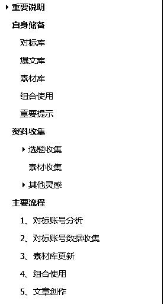
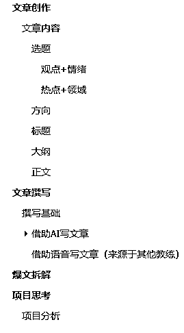

# 公众号文章内容质量提升教程

> 原文：[`www.yuque.com/for_lazy/thfiu8/kikf1516ca6zyhn5`](https://www.yuque.com/for_lazy/thfiu8/kikf1516ca6zyhn5)

## (精华帖)(305 赞)公众号文章内容质量提升教程

作者： 张波

日期：2024-01-18

大家好，我叫张波，我这个神秘人又来了，最近做了公众号爆文写作（原创）的教练自己也有了很多新的感悟，结合公众号未来的走向，我写了这一篇《公众号文章内容质量提升教程》，希望能够提升大家的内容水平。

本次针对爆文内容的提升，结合一些新的方法，引入科学的工具，来提升公众号文章内容质量，探索出可以继续批量化高质量的内容，提升账号的权重或者收益。

《公众号文章内容质量提升教程》：

项目分析​
1、虽然公众号项目单价越来越低，通过 AI 写的文章账号很容易就会被限流，提高写作方法让自己的文章越来越接近手工写的文章；​
2、通过引入其他平台高质量的内容，例如播客、抖音等高质量的内容通过语音转化软件。​
3、未来单价可能还会更低，我相信公众号的基础流量还在，冬天已经到了春天还会远吗？​

未来选择​
•继续持续做大量的账号，继续用 AI 写，然后自己发获取短暂的收益，然后账号被限流。​（不建议）
•进行内容质量的提升，让自己的账号活的更长久一些，一点点的让自己的账号成为腰部账号。​（长久之路）
•大量的人加入爆文项目，就看谁能够快速适应调整，快速的做出应对，谁才能笑到最后。

如果你只是一个小白的话：
《公众号爆文进阶教程》：[`k170ac9yh31.feishu.cn/docx/KbupdqExXo8z9pxL5RqcUzJOnfb`](https://k170ac9yh31.feishu.cn/docx/KbupdqExXo8z9pxL5RqcUzJOnfb)[`k170ac9yh31.feishu.cn/docx/PlpQdDbzkoaZoMxPf3dczRiunhc`](https://k170ac9yh31.feishu.cn/docx/PlpQdDbzkoaZoMxPf3dczRiunhc)

* * *

评论区：

王洋 : 我是这期公众号航海的船员，张波教练进行了 4 期的高手领航直播，解说详细；另外也很有耐心
安七 : 波波教练牛逼！
幸运的弘道 : 牛的
sunyue : 谢谢波波教练分享～

对标库+爆文库+素材库，很有用呢[强][强][强]最近正在完善填充中，梳理完对账号，文章的感觉更清晰啦！

还有那个笛卡尔坐标，回忆起痛苦的高数😖

已收藏，后面可以反复看，反复琢磨。很荣幸在波波老师船上，谢谢你每次直播的认真分享和群里的耐心解答～我们船教练都好棒🎉
陈俊贤 : 可以➕下？
磊 : 高手呀[强]
海阔天空 : yyds
Dancy : 太厉害了，牛啊

* * *