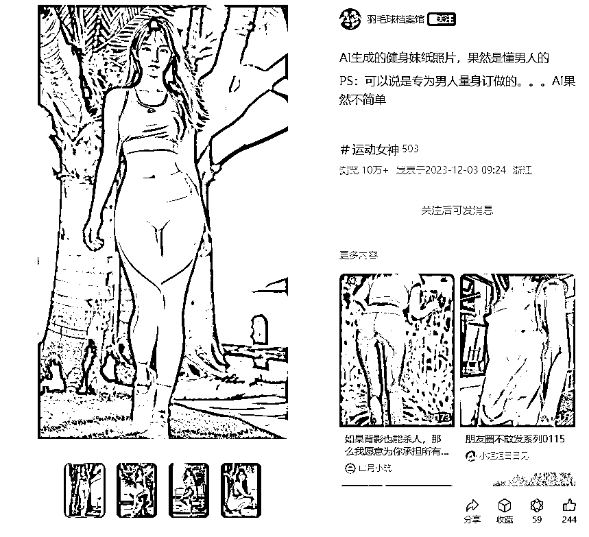
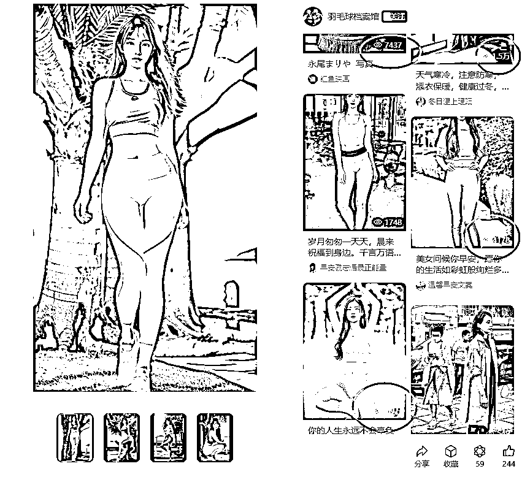
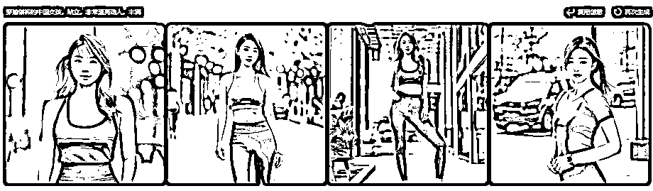
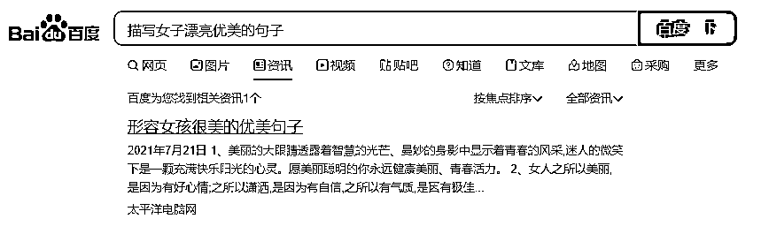

# 公众号流量主 AI 生成美女早安问候，边赚钱边涨粉

> 原文：[`www.yuque.com/for_lazy/thfiu8/atx63xx4g5kxx0gh`](https://www.yuque.com/for_lazy/thfiu8/atx63xx4g5kxx0gh)

## (34 赞)公众号流量主 AI 生成美女早安问候，边赚钱边涨粉

作者： 深圳老刘

日期：2024-01-19

今年以来在自媒体领域发生了很多变化。

年初 AI 爆发以来，我们看到很多行业正在被 AI 技术不断的洗牌重构；

公众号推出图文版的[小绿书]对标小红书图文；

映刀 RPA 自动化 AI 流程的日益广为人知。

我们发现在这些新技术的加持下很多业务正在悄然的发生巨变，今天就以小绿书（公众号图文文章）为例介绍一下通过流量主赚取收益的玩法。

这个领域已经热了有半年了，但依然还是有很多人没有深入了解 。最近我了解一下这个领域，借今天的机会与大家分享一下自己了解一些情况，简单介绍一下如何自动化操作这个项目。

虽然小绿书也有很多领域，比如明星倩照、健康养生、穿衣搭配等，但是我看到很多**早安问候的笔记非常火爆。**

可以非常容易找到很多几万，10 万+的笔记内容。

在小绿书上面与小红书不同的是，不是用爱发电，而是有实实在在的流量主收益。一篇 10 万+的笔记正常可能有 200-500 元左右的收益，甚至有更多的。

不过这类早安问候类的内容不再是以前常见的大福字、天天开心之类的老年人爱看的素材。

而是换成了这类穿瑜伽裤的美女 AI 最为常见。

以下面的截图为例，就是一篇 10 万+的笔记。正文内容就直接说明了素材来源源于 AI 生成。

正文非常短小，仅仅 100 字不到。

顺着这条笔记的推荐，我们还可以找到更多的同类笔记内容，以及更多的发此类素材的博主。

在星球上面我们经常可以看到很多人分享这类主题的流量主收益，收益相当丰厚。

实际上既使没有爆文，只要帐号状态正常，坚持发，每天一个帐号也可以做到 2-10 元不等的收益。

**为什么小绿书上面这类内容会大行其道**？可能有以下几方面原因。

一、公众号的受众群体有很大关系，公众号以男性粉丝居多，与小红书完全是不同的人群。

二、此类内容通过 AI 制作非常简单，不存在版权的困扰。比明星照素材更加丰富和多样化。

三、可以借助 RPA 等工具自动生成，可以简化素材获取的流程。甚至可以结合 RPA 做到全自动生成和发布，人工要做的就是不停对 AI 语术微调一下，再收集点问候语配合就可以了。

四、可以矩阵操作，很多人已经跑通流程，在几十，几百的批量上号操作。

五、还有一点附带的好处，这类帐号一般都能自然涨粉，在没有爆文的情况每天也都可以自然涨粉 4，5 个以上。

下面我们重点说一下要自动化批量操作这些项目的一些核心环节。

**一、大量帐号的问题**

帐号自己找个人收购，一个帐号 100 元左右，也可以用公司帐号申请，指标会多一些。如果批量化操作，至少要搞到 10 个左右的号，才具有稳定的收益。如果没有条件准备太多的帐号，那就精细化操作也可以。

**二、领域方向问题**

上面说的美女早安问候类，还有很多领域都是可以操作的，比如人生成长类的罗翔莫言说、宝妈省钱技巧、清简生活类、星座类，这些大家可以根据自己的爱好和资源，去确定。

当然最好是找可以结合 AI 生成图片的才好批量化、自动化操作。

**三、自动生成素材**

可以自学 RPA 映刀工具，将 AI 图片创意咒语放到 Excel 里面，再逐一复制到 AI 工具里面慢慢生成即可。

图片生成以后，文字就更简单了，再说没有太多人看文字。文字可以从百度批量复制搭配到图片里面就好了。

**四、AI 话术问题**

AI 的话术是生成图片的关键，其实也是相当简单的。百度上面就可以找出来很多，再根据自己的理解，作一些修改和要求就慢慢可以找到比较好的语术了。

相同的话术每次都可以生成不同的内容，或者稍稍改改加点文字要求换背景和颜色要求， Excel 里面批量就可以改写几百条出来。

**五、自动串联发布**

这个项目虽然爆文的机会比较高，但是我们观察那些爆文的帐号，也不是每天都爆。大部分都是 10 天，半个月，甚至 1 个月爆一次。要想赚钱就要矩阵批量化操作。

这样才能把这个项目放大 10 倍，100 倍的去运营。

可要放大还是些一些阻碍，图片可以 AI 生成、话术可以百度搜索。但公众号发文每次还要人工扫码，复制这些图片再去点发布按钮，人工就要花相当多的时间了。

这个项目本身最大的优势就是自动化，几乎 0 成本，所以最后借助 RPA 打通这个环节，就可以做得很省事了。

* * *

评论区：

悟空悟空空 : 厉害

* * *