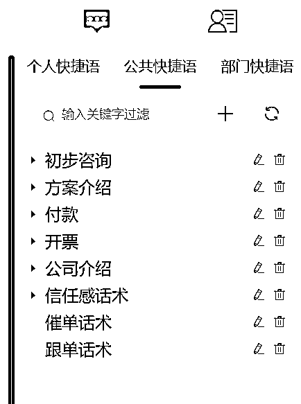

# 聚光投放做广东公司团建业务，从 0-1 半年 200w 营收复盘分享

> 原文：[`www.yuque.com/for_lazy/thfiu8/vaulek7tz8p8ozzz`](https://www.yuque.com/for_lazy/thfiu8/vaulek7tz8p8ozzz)

## (精华帖)(97 赞)聚光投放做广东公司团建业务，从 0-1 半年 200w 营收复盘分享

作者： 吴大脸

日期：2024-01-18

现在小红书旅游赛道很火，生财也开了航海实战，今天分享旅行社当中很重要的一个分支业务——公司团建。

我们从 3 月份开始摸索，通过聚光投放搜索广告做广东公司团建业务，到 9 月份，引流了 1000 多个客户，营收 200W 左右。

找了一些还保存的当时收款截图。

这篇文章我会复盘整个业务如何从 0-1 做起来的。

# 一、团建业务为什么能跑通

**1、流量端**

不用拼团，最开始想的就这个，如果自己设计产品，面向 C 端用户，拼成一个团太难了，没有行业积累，不像旅行社有专门的组团社拉人，自己又做不起来量，很难持续做下去。

公司团建就不一样，成 1 单就来 10-30 人，不用去凑人。

**2、产品端**

刚开始想的是只推自己设计的团建产品，如果持续有客户，能做起来，因为资源全部自己对接，利润控制得不错。

等整个业务跑通，结果和我预想的不太一样。预想的是小红书客户质量高，按照我们自己设计的团建产品，成 1 单客单价有 2-3W。

结果来的客户 80%人均预算是在 1000 以下，我们自己设计的方案不在他们预算内，还有一些预算够但这个方案不喜欢的。

所以我们找了旅行社合作，用他们的团建方案做辅助，争取转化每一个客户。

最后产品端这块就可以理解成自营 + 外包给旅行社，外包给旅行社就和现在航海实战的小红书境外旅游项目很像，客户定好方案后，旅行社给同行价我们，我们加价报给客户，后续的交付也交给旅行社。

自营是产品自己设计，对接各方资源，后续的交付也是自己。

# 二、野路子付费流量打法过程

我最早 22 年 6 月份就开了聚光户，当时是测其他业务，充了 5000 块官方直客销售拉群对接了一个服务商运营小组，9 月份正式投放，和我们开会沟通了下投放细节就开始做了。

一天烧几百，对方告诉我要先把互动数据跑出来才有效果。当时哪禁得住这消耗，关键是没一点效果 ，就直接关停了。

于是，当时测的这个业务由于我的认知局限，就暂停了广告这条路，还把日常更新交给了坑爹的代运营（只是说靠代运营不可能做起来），后面服务期到了就开始自己更新了。

现在回过头看当时负责投放的服务商运营人员的聊天记录，觉得自己好白痴。

## 1、只做搜索广告

23 年 3 月份，我之前写的一篇笔记数据出现了异常，每天评论都会增加 1，2 个咨询类的评论，我感觉到这篇笔记布局的一些关键词吃到了搜索流量。

我一直记着一句话“投流是自然流量的放大器” ，我马上想到了通过投流放大，这次我自己上手投，花了半天时间把聚光后台使用手册看了个大概就立马新建计划开始投放，而且只投搜索广告。

没想到每天消耗不到几十块就能来 2，3 个精准咨询。

这时我没局限于“投流是自然流量的放大器” ，立马给同类型但没有自然流的另外一篇笔记新建计划开始投流，结果也是有效果，2 篇加起来一天能有 7、8 个精准咨询。

这种精准咨询稳定了一个月后，我冒出个想法，搜索广告的逻辑是把我的笔记强制排到用户搜索结果前面，那只要我的笔记专门围绕主推团建方案写产品笔记不就好了。

说干就干，新开了一个团建企业号，刷了同行大量的高互动笔记，刷到了一篇和我们主推团建方案类似的笔记，互动数据又很好，虽然是 22 年的，因对小红书认知的提升，知道爆款一定会重复爆，我就决定模仿这篇。

把这篇笔记为什么会爆做了拆解，从封面拼图形式，到封面关键词选取和封面文案排版都 1:1 模仿，标题也做了改进，我甚至觉得最后数据一定会超过他，对标笔记的图片审美没我好，正文内容框架我也结合了不同同行笔记的优点。

当时因为没有建立起系统的投流体系，这篇笔记一发出去后，都没等看自然流怎么样我就直接开了搜索广告，结果确实爆了。

后面靠着这种只做投流笔记的打法，团建业务每个月投流花 10000 左右，流量持续稳定吃了 4 个月多。

## 2、适合投搜索广告的业务条件

这种打法有运气，聚光做得早，竞争没那么大，明年情况怎么样不清楚，但流量肯定越来越贵。

团建业务为什么靠搜索广告能跑出来，而我后面测其他产品的时候就没有跑出来，复盘后有 2 个原因：

1、业务相关关键词搜索量不大，或者关键词搜索量大但搜索这个关键词的人群太泛了。

2、后端产品利润不够高

关键词搜索量不大有可能竞争很激烈，大家都在抢这个关键词，导致出价高。搜索的人群不精准，意味着大海捞针，你的获客成本肯定会高，这个时候如果后端产品利润撑不起来，投放就跑不正。

像我调研的一个业务，论文代写和课题申报的，竞争就非常激烈，之前看出价甚至到了 8 块，现在查是 3 块了。

如果你的业务有强相关关键词，竞争不大，利润还可以，那值得去用搜索广告去试一下。

## 3、搜索广告流程改进

我这种不养号，开完户就直接写笔记投流，恰巧我对团建业务产品型笔记的把握度还可以，并不具有普适性。

在开始向外学习后，我认识到这个流程是有很大的问题的，真正投流还是需要体系性的打法。

不可能每个业务的投流笔记都能像团建业务这样把握好，还有一部分原因是投放的红利获客成本才做到这么低。而且团建业务的投放成本是不是有机会可以通过投流笔记的迭代降到更低？因为投流笔记越优质，获客成本就越低，有些甚至相差一倍多。

改进后的流程：

1、养号

先通过高互动型笔记把账号数据做起来，提升账号权重，确保自然流正常。

2、搜索广告搭建

根据自己的业务把关键词做分类，按照词性来搭建不同计划，确保一条搜索计划里的笔记素材和投放关键词对应，切忌不同词性关键词全都放在一条计划中，笔记和搜索词不匹配，造成无效词的高消费。

以旅游业务举例，按照不同词性分有：

这种分类不同行业有不同的，还有诸如品牌词、品类词、人群词之类的，核心是做好分类，保证一条计划里的投放关键词都是和笔记素材相关的。

3、测笔记

**测试期**

关键词选好分好类后，每条计划至少放 3 个笔记去测试，赛马机制跑出效果最好的笔记。

**优化期**

筛选出可以第一批数据好的笔记，通过调整预算、分时段出价、地域定向，调整封面等方向优化，总结优质笔记特征。

**放量期**

不断积累可放量的优质笔记，提价或横向复制投放稳定的素材，进行放量。

## 4、如何学习聚光投放

### a）学会用官方的手册-聚光帮助中心

3 月份做投放的时候，我花半天时间看完聚光帮助中心就开始投了，聚光投放学习门槛很低，聚光帮助中心的内容完全够用，如果有疑问，人工客服进行咨询，响应速度非常快，我自己起码发起了 20 次咨询。

### b）学会用官方的学习平台-种草学

小红书推出了一个专门的学习平台，种草学，网址：[`xue.xiaohongshu.com/`](https://xue.xiaohongshu.com)

这里面的东西就算进阶的，里面有各个行业的一些案例和培训，老师都是小红书官方商业化部门的，我自己从里面受益颇多。

### c) 下场实操

光说不练假把式，开户之后就下场实操，从实战中获得经验，投流手的经验都是花钱烧出来的。

### d) 加一些交流群

遇到问题可以交流经验，有时候卡点的一个问题，有人一句话就点醒了。

# 三、塑造高客单产品的价值

注重美感，没塑造价值之前，不要谈价格。

团建赛道产品同质化严重，各家旅行社的产品都大差不差，而且人家也下场做，如果只是拿着他们的方案去对接客户，卖不起价利润低，拼价格又是个中间商，怎么做下去？

我们除了自己设计的主推产品方案，也对接了几家旅行社，他们都有专门的方案库，分类的很详细，但是有个很致命的问题，因为他们是做批发的，主要还是对接同行，方案做的都不咋滴，图片不高清没有氛围感，描述性文字太多，即便是个价格高的方案也会让客户觉得不值那个价。

对接高客单用户，如果全是这样的方案，一下就被对方 pass 掉了。

我们主推产品方案的图片都是请摄影师拍然后调色的，我挑选一遍后选用，加上简洁的文字说明，整体排版让人一看就是值这个价。

女性用户确实更注重感觉，团建加过来的客户基本全是女的，方案营造出来的感觉很大程度上决定她会不会选我继续沟通，如果她开始沟通细节问题了，那说明基本上选我没跑了。

这里讲个例子，我做的方案都是标准方案，客户有些时候需要调整一些东西，兼职销售会拿着源文件改动，改完后就有客户说怎么这个突然没那种好玩的感觉了，我一看确实没那么好了，改动的图片、字体都差点意思。

我们主推产品方案面对人均 1000 以上预算的客户转化率很高，但整体转化率偏低，因为很多低客单的客户消费不了。

我们又基于旅行社的方案库，每个价格区间都挑选或者组合出 1-2 个不错的方案，自己重新包装设计，转化了不少人均预算低于 1000 的客户。

# 四、用兼职做最重要的客户转化环节

团队最开始 2 个人，我负责搞流量，另外一个负责对接转化客户。

刚开始一天 5，6 个客户就对接不过来了，我们主推自己设计的产品方案就 3 个，而且客单都相对较高，不是所有客户都喜欢和消费的起。

客户的需求多样，为了提高转化率，愣是每天要做 7，8 个方案，资源不熟悉做起来非常耗时间且痛苦，不过一个月也出了 4，5 单。

招了 1 个全职旅游销售后，减轻了很大的转化压力（经验多的自己有很多团建方案，且对各种资源熟悉可以快速根据客户需求调整新方案），成交了一些并不喜欢或者预算低于我们主推方案的客户。

一个月后因为双方磨合出问题，销售离职了。

那时日均 30 个客户左右，我也开始对接客户都对接不过来。只好开始用兼职，再边找全职。

有全职销售的时候，转化流程是通过承接客户的微信，先对客户进行基本情况的咨询，再把基本情况按模板填写，分配给销售，确认后把客户和销售拉群对接。

整个对接链路很繁琐，时间一长，群非常多，客户都没法很好的持续跟踪，甚至有出现漏给客户方案的情况。

后面我做了一个小改进，每次拉群时，群聊名后面带上当天日期，每天晚上搜索下当天日期，一个个点进去看有没有遗漏，及时催促销售跟进。

销售用的手机和微信是专门配的，防止销售私加客户。

要启用兼职了怎么搞？不可能每个兼职都配手机和给他们一个微信号，这样成本太高了，而且兼职人员流动性大。

这时果断上了生财大佬公司开发的私域工具，很好的解决了这个问题，用这个工具对接上微信后，可以开无数个客服账号。

我只要给兼职分配客服账号，对方网页登录账号就可以对接我给他分配的客户，界面和微信差不多。

聊天记录在客服账号网页端和微信端是实时同步的，我只要拿着那台承接客户微信的手机，就可以看到每个客户的跟进情况，及时辅助兼职销售进行成交。

但是兼职也符合二八法则，虽然开了这么多账号，真正有战斗力的就 2 个兼职销售，她们时间比较充裕、态度好、学习能力强，辅助带着对接客户 5-7 天基本就不用管了，可以自己出单。

# 五、调研同行改进自己

调研同行和体验同行完整的业务流程，是做业务非常重要的一个环节，如果是知识付费产品，甚至要花钱去体验产品和交付，可是团建产品没法体验哈哈哈哈。

前期跑起来我虽然没加同行，但等业务稳定后，想着优化各个环节，就要去看同行整个业务链条上有没有值得学习的地方。

因此让兼职照着我给的流程做了一个同行调研，从前端引流到后端转化整个过程都要截图出来并总结出可以学习的点。

放几张当时兼职写的总结截图看看。

通过这个调研报告，了解了流量做得好的同行后端方案和转化水平，学习了一些可以改进的点，当然也有很多同行的雷点，属于前端流量做得很好，后端转化一塌糊涂。

# 六、感悟与错误决策

## 1、小团队啥都得会，没人时自己要顶上

我刚开始只搞流量，转化客户人不够，开始对接客户，出单了团带不过来，自己去当领队。我很抗拒带团，虽然我可以把服务做好，但我不是那种会活跃气氛的人，所以每次出去当领队都很难受。

## 2、SOP 化，降低对人的依赖

我关注很久的跨境大佬小北，看到他发了一篇做生意的一些逻辑公众号文章，深受启发。

“降低对人的依赖，因为人都是会走的；想办法将工作难度简化，兼职化。”

当时启用兼职是无奈之举，又因为全职销售走后一直没有找到合适的人，就一直用的兼职。

我当时带兼职浪费了很多时间，每来 1 个兼职，我都要重复一遍先带他熟悉我们的主推产品、怎么给客户算报价等，而且给客户改方案需要什么资源的时候都要找我，我再发给他们。

看完这篇文章后，我就把可以 SOP 化的流程都初步整理了一遍。

a）所有的方案都按价格做了分类，每个价格区间包装 2-3 个成交过或者精选的方案，新人来只要先熟悉这些方案；

b）每个方案都做了在线表格标准报价表和成本，新人对接客户报价阶段只要对着标准报价表来；

c）以往对接客户经常问到的一些问题，整理成 Q&A，在客户对接系统直接点就可以发送给客户；

d）所有资源整理到飞书线上化，做好分类，遇到资源问题优先飞书找，再不行的才问我。

当然还在持续改进，理想状态就像小北说的“招过来的人，我不需要你多牛逼，我也不需要你太发挥，只要老老实实按照我们设定好的流程来做就好了”。

## 3、承接客户的微信运营好朋友圈

一个非常大的失误，因为我不擅长发朋友圈，承接客户的微信居然就只发过 2 条朋友圈，没有晒一个客户好评和成交单，甚至于微信头像都用的不是真人的，而是卡通的，满满的雷点。

如果运营好朋友圈，我相信转化率还会提高，更何况团建成交过的客户很多国企，事业单位和大厂部门的。

朋友圈运营其中很重要的一个内容类型就是晒单，这个晒单包括成交、交付过程、用户反馈、结果展示。

跟不少需要卖产品，但是朋友圈做得不怎么好的人偶然交流过，觉得不爱发客户成单，或者自己觉得晒多了客户会反感，一定要改变这个观念，发起来。

至于朋友圈怎么系统打造，有一期航海实战，可以去看航海手册学习一下，做私域的这个价值非常大。

## 4、提高客户加 v 率的技巧

1、及时回复私信

有没有及时回复客户私信，决定了你有没有机会加到微信。为了尽快响应，用了官方的客户进线短信提醒，我觉得有延迟还不够快，我就一直盯着手机，当时我给自己的要求是半分钟内响应，一天最多也就 30 个咨询，流量不大，应付的过来。

2、设计好话术，不要上来就引导加 V（私信咨询量大的情况不适合）

我把客户进来咨询可能会问到的问题的回答以及我要问他的问题都写成一段段话，然后放到输入法的快捷用语功能里，发给客户的时候直接点击就可以。

先回答他的问题，再问他一些基础问题，最后引导他加微信，并给他一个合适的理由，他觉得我挺专业的，才会有更大概率加微信。

团建业务，客户加微信后，转化的时候需要先问客户一些问题了解需求，如果在小红书问了一遍，加了微信对不上人，又问客人一遍需求体验感不是很好。

为了让流程衔接更丝滑，有段时间我甚至不直接发微信号，聊到让对方发微信号，我们加他，这样客户的需求和微信都能对得上。

基本都要到了微信，这也侧面证明了设计好话术的重要性，不要一上来就直接引导加 V。

3、客户不回复，进行多轮追量

这个是我最近学到的，之前遇到给客户发了私信不回的情况，就不管了。

看到‘好多鱼’分享这种情况要追量，拍大腿啊，能多争取一个客户是一个客户。

追量的意思是客户开口后，如果给他发的私信不回复，用新的话术追他，追到他加你为止，一般追量分三轮。

还有量不大的情况下，每个用户的点赞、收藏、关注、评论都可以主动私信，如果量大，筛选下用户，因为一个账户每天只有 20 个主动私信额度。

这是生财圈友分享文章的截图，我一直保存着，如果像这样坚持给每个和你互动的粉丝发这样的私信，又能加到一批客户。

## 5、一段时间只做一个流量渠道

团建业务是做小红书渠道起来的，小红书流量稳定后，当时想放大拓其他流量渠道，抖音、百度都开了户，测试下来效果都不好，还分散了我的精力，如果把钱和精力都持续放在小红书上，效果会更好。

如果团队不大，预算有限，一个渠道做起来了，就加码投入，把所有精力和钱都 all in 进去，进行饱和式攻击。

## 6、想都是问题，做才是答案

这句话经常听到，相信下场实操项目的都深有感触。

团建这条业务线有流量后，甚至承接客户的微信号都没准备，我们就这么开始了。前面还是加到私人微信，后面才启用了以前一个啥都没有的号开始承接客户。

客户成单后要签合同，我们连合同模板都没有，怎么办？百度文库搜索啊，用多个文档，整合出了一个合同模板，就这么签了第一单。

自营产品缺领队没人带团怎么办？先自己上，然后开始带人培养，最后才找了有经验的导游，之前根本没导游资源。

还有很多很多问题，都是遇到然后一步步解决，不要预想太多问题，还没做就先吓跑自己了。

* * *

评论区：

Sy : 团建+旅行社+论文，跑搜索的底气是因为高客单，毛利率客单价低跑搜索打不住的
吴大脸 : 是的，文章里说了哈
拱卒 : 收获满满
沐轩 : 非常详细，值得反复阅读和实操。
吴大脸 : 谢谢支持
吴大脸 : 谢谢支持
悟空悟空空 : 广东团建客户量确实很大，去年兼职带过几次团，大部分都是团建，还有亲子团
吴大脸 : 亲子团倒是不知道，没涉及，你还兼职带团哇，主要熟悉哪些地方

* * *