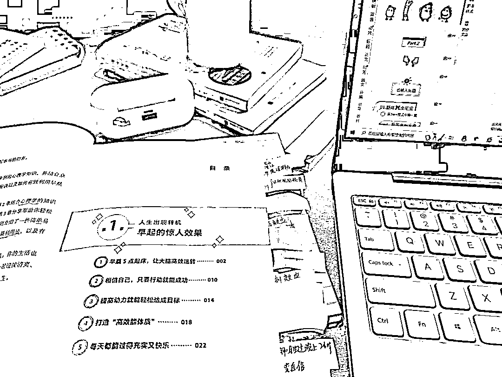
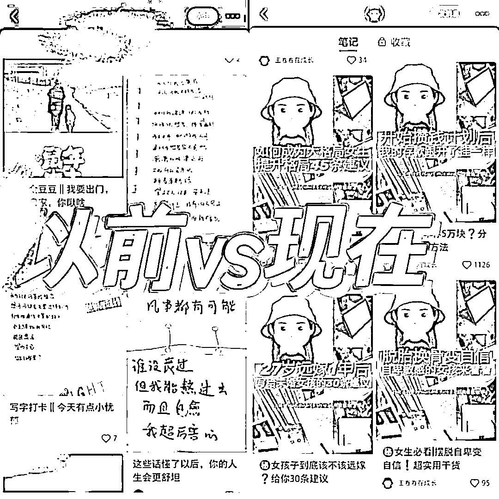
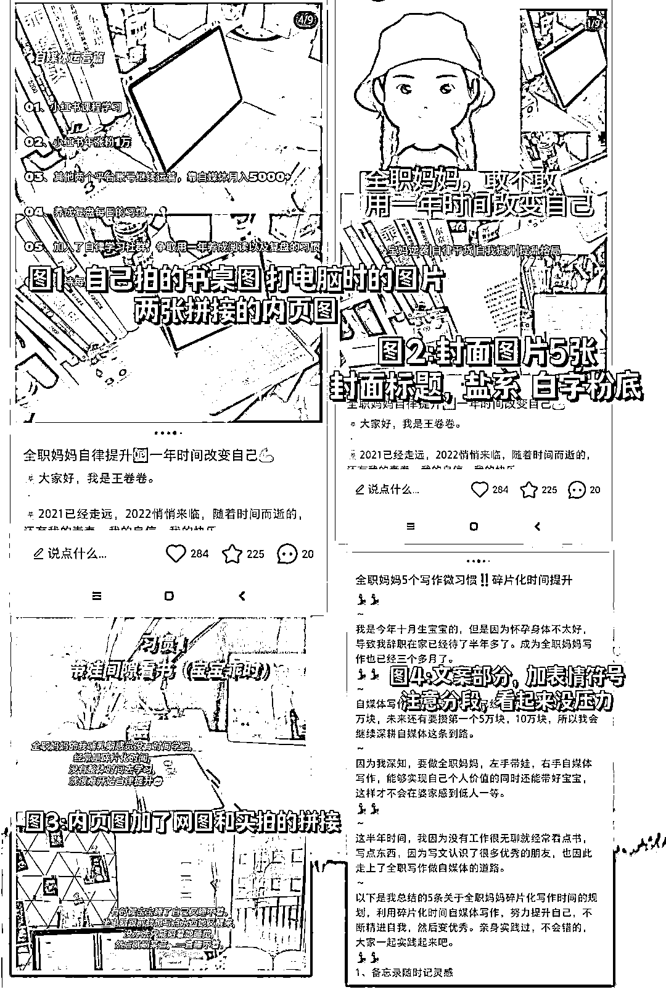
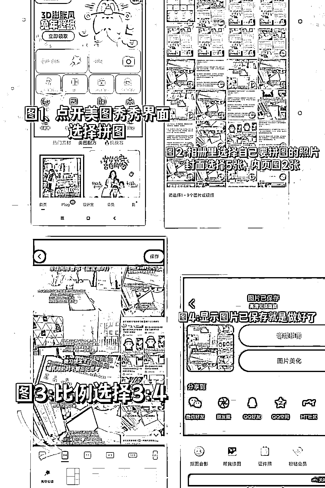
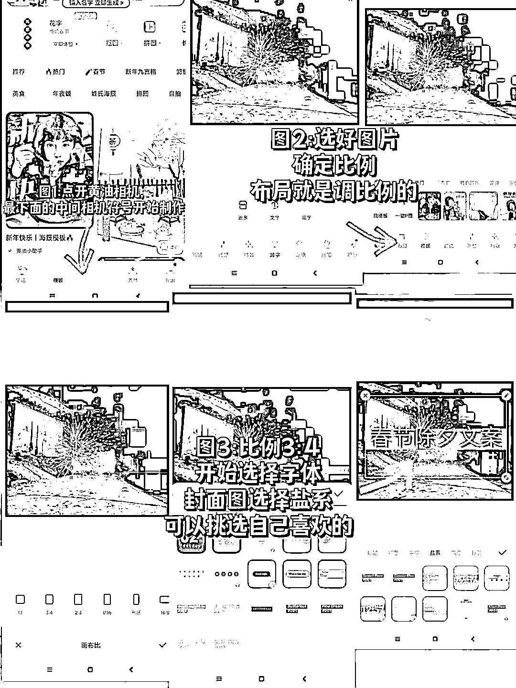
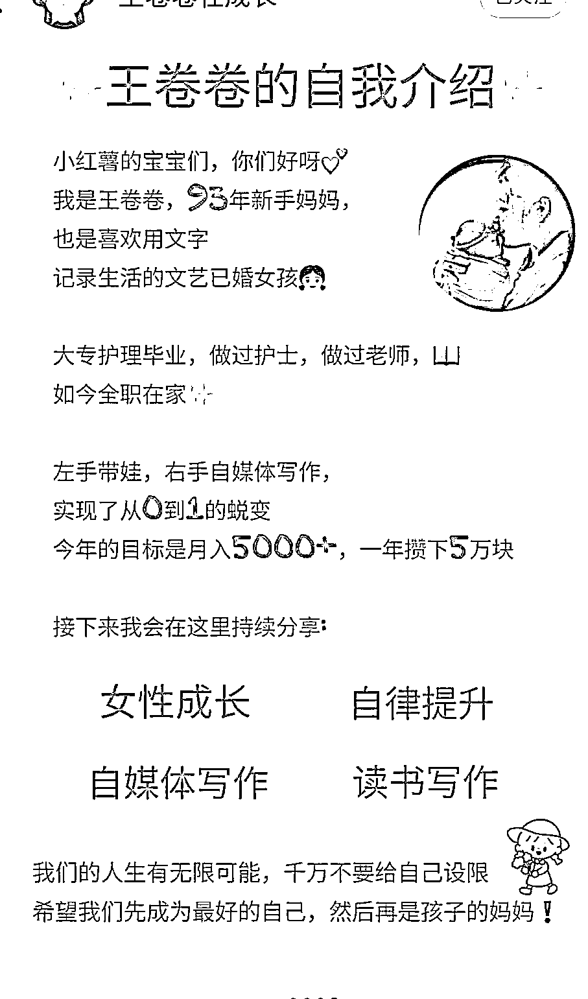
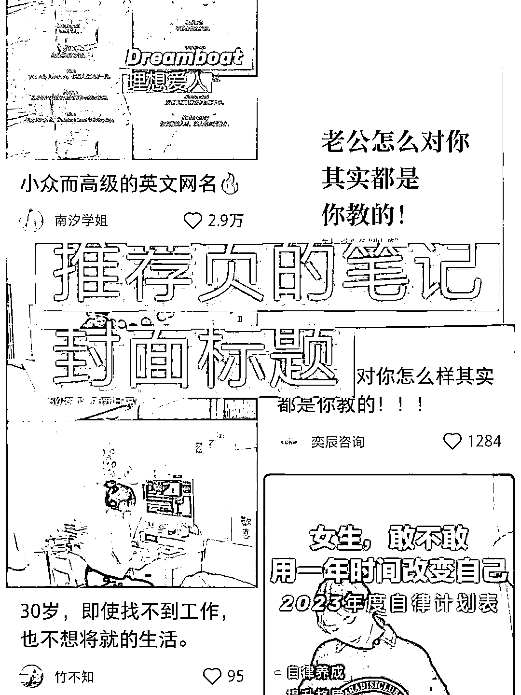
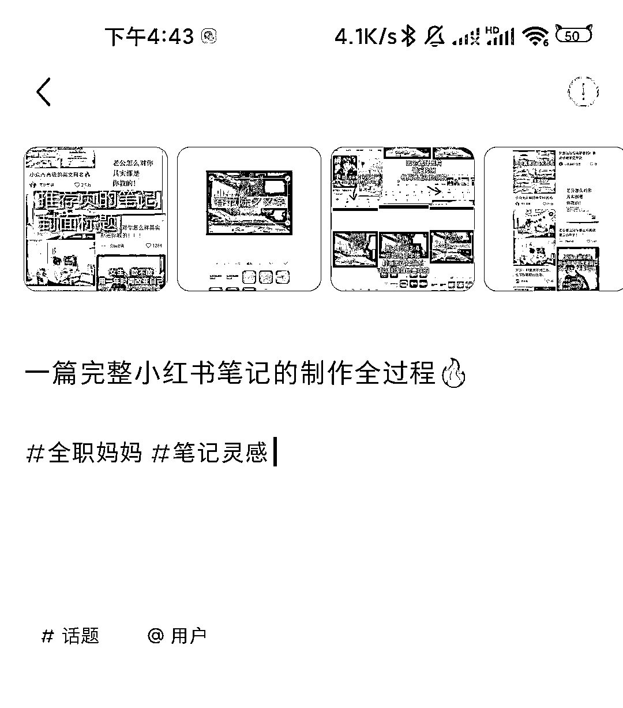
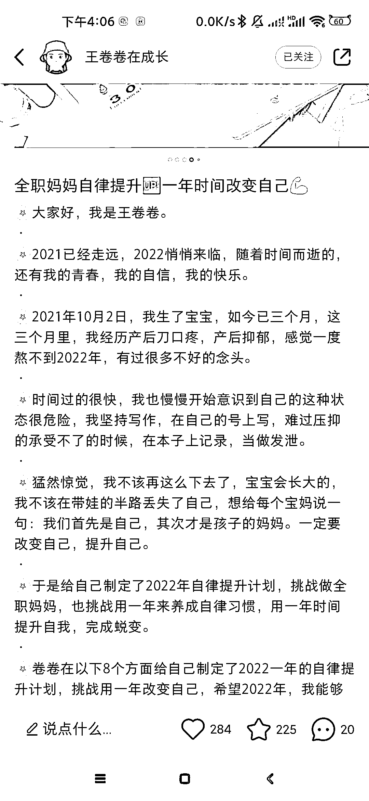
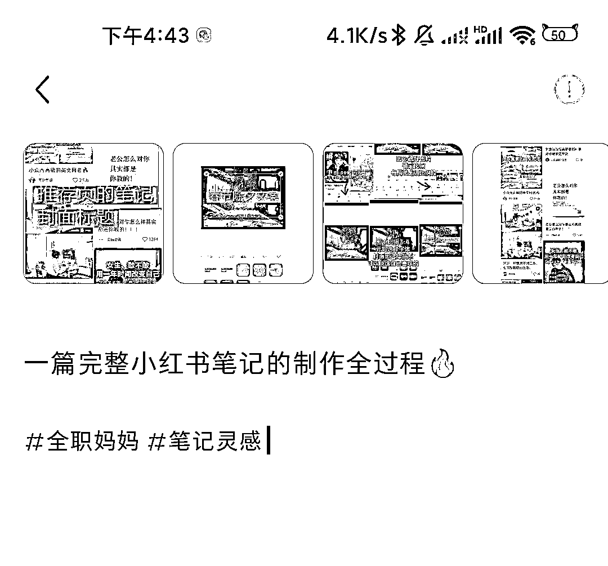

# 小红书 3 个月涨粉 3000+，小红书笔记制作流程大揭秘

> 原文：[`www.yuque.com/for_lazy/thfiu8/yiaywg4p6dtvez8k`](https://www.yuque.com/for_lazy/thfiu8/yiaywg4p6dtvez8k)

## (30 赞)小红书 3 个月涨粉 3000+，小红书笔记制作流程大揭秘

作者： 王卷卷在成长

日期：2024-01-19

之前发布了一篇关于小红书蒲公英提现的文章，有小伙伴问我，说可以分享一下作图方法吗？

一两句话也说不清楚，而且我觉得肯定有很多小伙伴都想知道小红书上那种好看的封面都是怎么做的，给大家分享一下，想做小红书的小伙伴就可以去实践了哦。

今天卷卷就从我自己平时作图的方法和习惯来给大家说起，希望我的分享能够帮助到大家哈。顺便说一句，卷卷以前也不会作图，绞尽脑汁的去尝试，但是自己瞎摸索还是没有摸出个名堂来，

所以我就付费学习了小红书，跟着老师学习一个多月，慢慢熟悉了一些作图技巧和方法，也知道发什么样的笔记数据会不错。

这个也是我第一次为知识付费，但幸好我没有踩坑，也学到了一些真的东西，因为我知道自己一个人摸索不出头绪的困难和焦虑，所以我想把我学到的内容结合自己的实践经验，分享给更多的小伙伴，希望 2024 年，

我分享的一些干货或者观点，哪怕一句话，对你有用，那这就是我值得欣慰的事情。那我也会觉得，我坚持写作这这件事是值得的。（说句俗一点的，我又想赚钱，还想影响一部分跟我一样的人，早点觉醒）

小红书真的是一个对新人很友好的平台，哪怕你是一个素人，只要你分享的内容对某一个人有用，那你就会吸引这一个人给你点关注，点赞，如果你分享的内容足够利他，真的是站在别人的角度分享，那绝对是能够做成功的。说句实话，我刚开始做小红书的时候，几百粉丝的时候就已经变现了。

所以我希望大家把看过的内容实践起来，去行动，去改变，去慢慢完美。那下面我给大家说怎么制作一个小红书笔记的图片全过程。

**小红书笔记构成：**

1、封面图

2、内页图

3、图标

4、文案标题

5、文案

6、关键词和话题标签

**一、咱们先说说小红书笔记的封面图**

一般建议是大家自己拍照，我的第一个小红书账号的图片多数是自己拍的书桌图，还有小宝宝的图片，用自己的生活周边照片，显得比较真实，利于打造个人 IP，和读者建立信任感。

如果你不想用自己拍的照片，也可以用网图，我一般用的是豆瓣上的图片，一些影视剧图，明星的好看图片，

甚至淘宝上也可以找图，就是如果你是打造学习型博主，你可以搜一些文具，书桌的图片，有很多。

**做法：**

拍的照片或网图用 5 张，在美图秀秀上完成拼图，美图的操作把步骤放下面图片里，大家看一下。当然你也可以用 2 张，4 张，都行，比例是 3:4

拼图完成之后，保存到相册里，然后点开黄油相机，加滤镜（有时候不加）这个需要注意一点，你的滤镜风格尽可能的每次都保持一致，还有封面图张就保持 5 张。

在黄油相机里我会加花字，封面图的文字用的是花字里面的盐系。找自己喜欢的文字就可以，但是也要有一定的美观性。

**图好文一半，花香蝶自来。**

小红书的读者对图片的审美比较高，我自己现在也达不到超级好看，但我觉得先开始做，慢慢的提升肯定是没有错的。

黄油相机加字，调滤镜的步骤给大家放图片了，可以跟着操作一下。

**二、内页图**

小红书的图片一共能发 9 张，我们的封面图占据一张，内页图就剩下 8 张，我们需要把自己本篇笔记的重要内容都写在这 8 张图片上，当然了，你也可以在笔记的正文文案部分写出来，就是具体内容可以放图片上，文案部分写上大概的条条框框就行。

也有一些博主喜欢在笔记的最后一张图放上自我介绍，那这个自我介绍是每次固定的，你可以仔细研究做一张独属于自己的自我介绍图。

剩余 7 张写文案干货。

**三、图标**

图标就算封面图上那个大标题，也就是我们刷推荐页面第一眼看到的笔记印象。

很多干货类的博主，都是会有封面标题也就算图标的，但也有一部分博主没有，这个写不写，根据自己决定就好。

图标我一般用的就算黄油相机加文字，用的是盐系里面的文字。

**四、文案标题**

需要注意的是，我们的文案标题只能写 20 个字，可以适当加表情符号，比如🔥，㊙️这样的表情。

一篇标题的字数 20 字

但是记住，一个表情符号代表 2 个字符，也就是说，你加 1 个表情符号就意味着用去了 2 个字的空间。

所以文案标题要仔细认真的去想一个合适又夸张，但又不是那种标题党的感觉。

这个要在不断的更新笔记和学习中积累经验，也就是不断的提升自己的网感，是一个比较长期的过程，一定要积累。

需要自己实践操作，我只能说给大家提点建议。

**五、文案**

文案也就是你这篇笔记的核心内容，你要表达什么？你的干货是什么？写出来就好了，我一般是提前在有道云笔记上写了，然后复制到小红书发布的。

需要注意的是，小红书上的用户都比较偏年轻一点，所以我们的笔记内容可以适当加一些表情，显得有趣又更加美观一点。

**五、关键词和话题标签**

关键词也就算你这一篇笔记的主题，比如我写全职妈妈靠自媒体写作实现经济独立，那自媒体写作和全职妈妈就是我的关键词。

我把关键词在我的笔记里合情合理又适当的多出现几次，或者我的标题里面加上这些关键词，

那我们吸引过来的读者就算喜欢写作的、全职妈妈、想靠自媒体写作赚钱的这样一些群体。

关键词的作用就是利于给我们的创作领域打精准的标签，你坚持更新这一领域的内容，平台也就知道给你推荐什么样的人群来关注你了。

标签，这个就是我们看别人笔记的时候，笔记文案部分，划到最下面的一些带有# 号的词汇。

这个就叫做标签，如果我们的笔记是文案整理，那我们的标签就带上#文案#适合发朋友圈的文案等等等等，以此类推，你发的内容，你想让更多喜欢这些内容的人点进去看，你就带一些这样的关键词，但关键词我不建议带特别多，感觉很乱，我们只需要选择几个热度比较高的带上就行了。

需要注意的是，我们的文案部分，字数也是有限制的，最多 1000 个字。到这里，我们的一篇小红书笔记就做完了，今天给大家讲的就是我自己常用的几个软件，

但是网上也有很多博主用稿定设计做小红书封面，素材也是很多，大家可以去尝试一下。有不清楚的可以评论区交流哦。

#小红书干货#小红书

* * *

评论区：

暂无评论

* * *