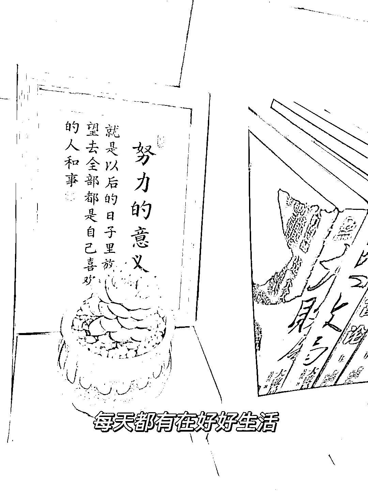
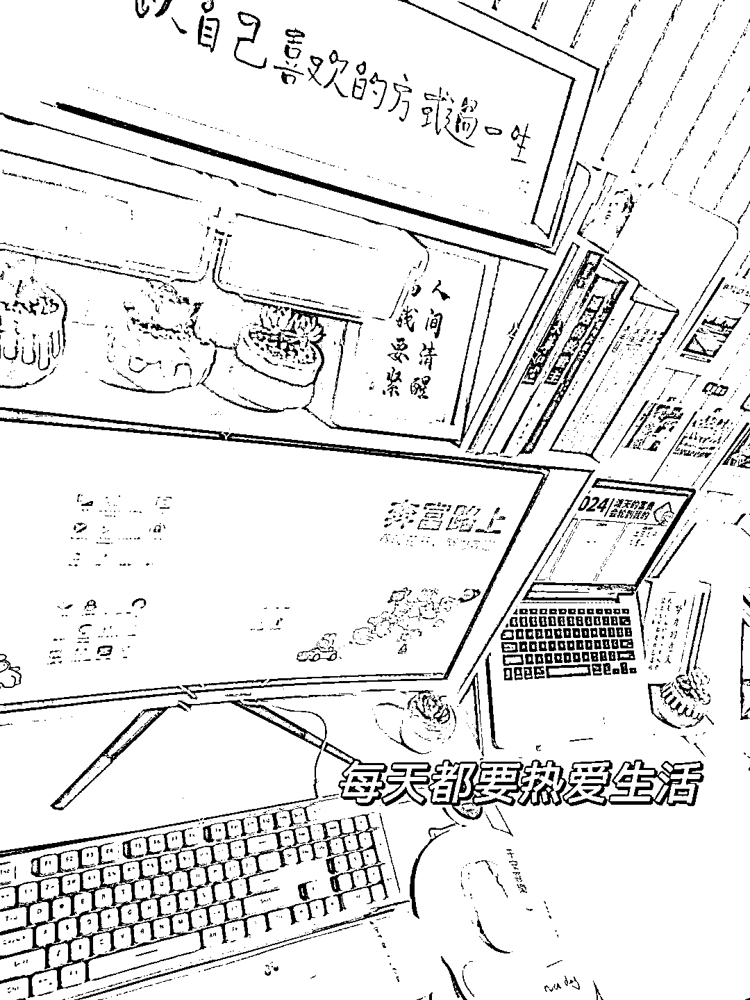
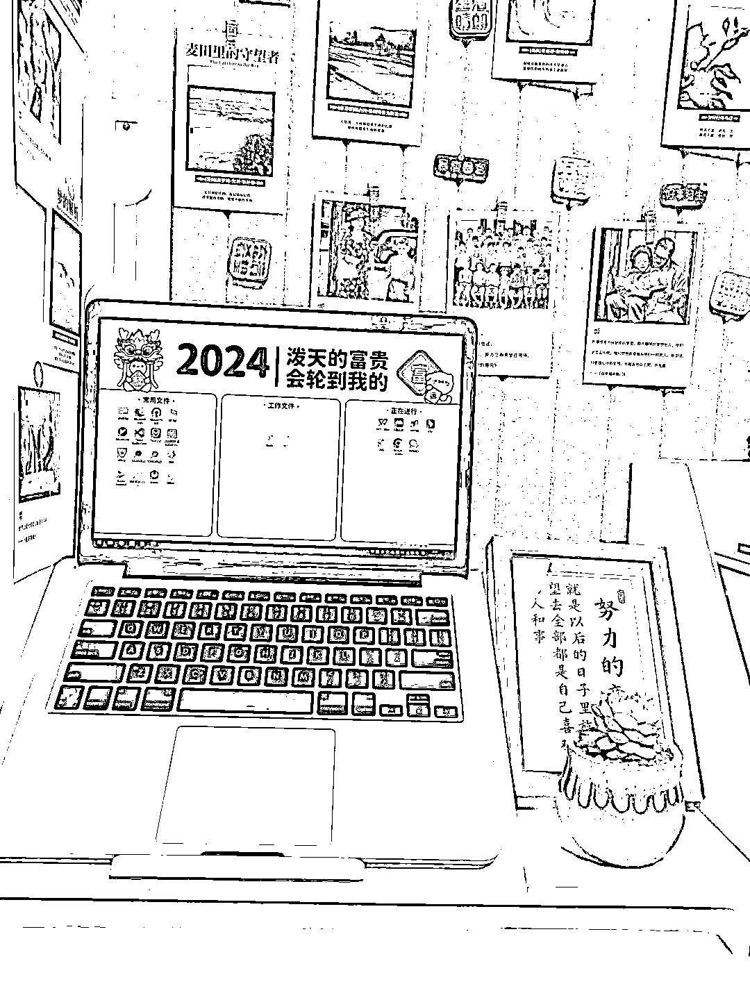

# 你的小红书账号养号了吗？

> 原文：[`www.yuque.com/for_lazy/thfiu8/abma9gtd2rwdav5i`](https://www.yuque.com/for_lazy/thfiu8/abma9gtd2rwdav5i)

## (26 赞)你的小红书账号养号了吗？

作者： 格子

日期：2024-01-17

有多少小伙伴是一注册完小红书就立马发笔记的？结果发完后发现数据很差，一个月两个月都没有一点起色。

你甚至以为你账号隐性限流了，但我想告诉你，其实是你太急了，没有养号导致的。

不知道大家有没有听过一句话：**小红书养号养得越好，笔记越容易爆。**

这句话真的一点也不夸张，以前我也觉得养号纯粹是瞎说的，直到我废了 10 几个小红书号，才明白，有些南墙是一定要去撞才会回头的。

我刚开始接触小红书在 2022 年，但是那会对小红书的认知基本为 0，每次注册了账号就立马改资料发笔记，结果废了一个又一个账号，尤其是一旦你新号一发就出爆款，大部分活不过三天。

**2023 年下半年，我将 80%的精力投入了小红书，才发现，原来养号如此重要，而我也因为养号养得好，2 天 3000 粉，20 天万粉，第一次感受到小红书泼天的流量。**

所以这篇文章，将会毫无保留地和大家分享我做小红书摸索并总结下来的保姆级的养号攻略。

**一、为什么要养号？**

通俗易懂地来说，养号就是模仿正常人的操作来使用和浏览小红书笔记、正常地和其他用户进行互动，这是为了让系统识别你这个账号是真实的个人用户，而不是机器批量起号。

另外，养号也是为了垂直，比如你要做情感领域，那你养号就多刷情感对标，到时候等你发布作品的时候，推流才会更精准。

最重要的是，如果不养号，一注册新号就直接发笔记，一旦笔记出现爆款，就很容易被系统判定为机器快速起号，直接给你账号限流，申诉无门。

**所以，养号既是为了告诉系统咱们是正常用户，也是做垂直的一个过程，并且养号期间还能顺带多观察同行的爆款，培养网感，积累素材，等自己需要用的时候，直接就能找到。**

**二、怎么养号？（重点来了）**

1、注册的时候只设置性别，年龄，选择和自己感兴趣/要做的领域，其他信息不要动，不要去改头像改资料，发作品前一天再去改。

2、至少养号**3-5**天，看领域，有些领域需要养 10 天半个月甚至更久

**第一天:**

打开小红书，搜自己即将要做的领域的关键词，就会出来很多同行的笔记，可以点击同行的笔记进去看，看到不错的内容点赞收藏，也可以关注一下博主。

基本上刷了 10 来分钟，首页上就会出现很多同行的笔记。

看到同行的笔记，可以适当对他们的作品进行点赞，收藏，评论以及关注。

注意：操作的时候不要太频繁，不要每个笔记看都没看就随便点赞收藏关注！

比如，看了五个作品之后，对第六个或者是第七个作品点赞，然后再重复这样的操作，太频繁了的话系统会检测出营销的作弊。

也可以适当地评论，大概五个点赞评论一个，要做到 5:1 的比例，评论的内容自由发挥，但是不要太离谱，不要发与此笔记无关的内容，更不要发营销、引流的内容，就是纯粹地站在一个粉丝角度对笔记进行评论。

**第二天：**

继续做垂直标签，按照第一天的养号流程，标签做的越好，爆的几率越高。

第二天首页大部分都会是我们同行的笔记了，如果首页少的话，那按照第一天的步骤继续搜关键词。

另外看到大爆款，也可以自己收集起来放进自己的素材库，后续也可以作为自己笔记的选题。

我们刷同行作品，不单单只是为了完成养号这个动作，而是要拆解同行的笔记，培养自己的网感，知道近期爆款是什么内容。

**第三天：**

看看推荐页(发现页面)里的视频里面有没有推荐给你符合你赛道的笔记，如果有，就可以对推荐页里面的笔记进行正常的点赞与关注等操作，如果没有，重复第一天的操作，搜关键词去找。

**3、每天养号的时间在 30-60 分钟**

当然了，不是说你一次性就要刷一小时，可以根据自己的时间灵活变动，用碎片化的时间去刷也可以，比如吃饭空隙，比如上下班地铁公交车上，比如晚上下班时间，这个无所谓。

**不管做什么领域，都需要养号，有些领域养个 3-5 天就可以了，但是有些领域对养号的要求特别高，可能需要 10 天半个月。**

总之呢，就是宁愿晚一周发笔记，也不能急一天发。

**三、最后，再给大家补充一个注意事项：**

小红书必须一卡一机一号，不能多个号在一个手机上切换，也不能多个号在一个局域网内使用，一旦一个账号出现限流，你这个手机/ip 就被锁了。

如果需要注册新的小红书号，这个手机不能登录过异常以及违规、限流的小红书账号，如果之前有过这样的小红书号，这个手机一定要恢复出厂设置，是一定！最好是换个手机。

刚刚注销的手机号不能立马去注册新号，至少放上半个月，最好是用赶紧的手机号注册，尤其是因为引流而违规的手机号，千万别注册新号了。

好了，今天的分享就到这里啦，这些方法都是我踩过很多坑费过很多账号总结出来的，希望对大家有帮助。

* * *

评论区：

贤雅 : 壁纸好看[呲牙][呲牙][呲牙]
less 💋 : 那还得多拿俩手机也不方便
格子 : 没钱更不方便吧
格子 : 谢谢
less 💋 : 你说得太有道理呢[尴尬][尴尬]
less 💋 : 向你学习～搞副业赚钱💰
贤雅 : 分享一下
水水 : 小红书不用养号

* * *