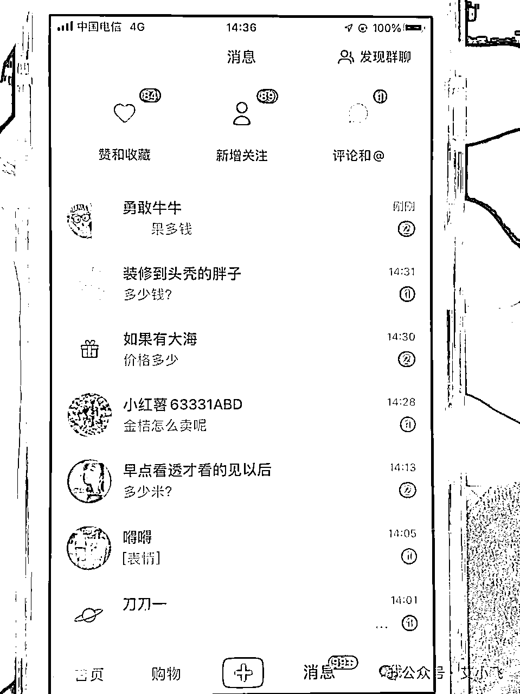

# 分享小红书做电商日赚 200 的经验

> 原文：[`www.yuque.com/for_lazy/thfiu8/gvikbbbb8x4cgqkc`](https://www.yuque.com/for_lazy/thfiu8/gvikbbbb8x4cgqkc)

## (27 赞)分享小红书做电商日赚 200 的经验

作者： 艾小飞

日期：2024-01-17

【分享小红书做电商日赚 200 的经验】

哈喽，大家好，我叫艾小飞

咱们好久都不聊项目了，今天来说说。最近这两天我在小红书上赚到钱的经验和案例分享给你们

我知道很多朋友们都还没有找到一个适合自己的项目，更没有通过一个项目真正的赚到钱。

所以这篇文章我将会为赚不到钱而发愁的朋友们写的，希望能给你们某些新的赚钱思路，学以致用。趁过年前能轻松的赚到更多的钱。

我做的这个项目产品是跟季节性有关的。就是我们广西柳州本地的融安脆蜜金桔

文章里总结了我是怎么发现这个项目，发现项目以后我是怎么去实操的

感兴趣的圈友可以移步飞书文档！

链接：

.[`lw03aeuj0n.feishu.cn/docx/DBP9dkc9josW6Qxn4cZc99dmnCg?from=from_copylink`](https://lw03aeuj0n.feishu.cn/docx/DBP9dkc9josW6Qxn4cZc99dmnCg?from=from_copylink)

* * *

评论区：

芮 rui : 对于我这个犹犹豫豫的人真的是一个助力啊。一直在观望，还是下去搞一搞 我打算去测评宠物帽子新年前卖起来。
海阔天空 : 执行力好强大[强]
vv : 艾总👍👍对我迭代小红书太有启发了，你的好多关键动作直接打通我的任督二脉呀
安可 : [强][强][强]

* * *