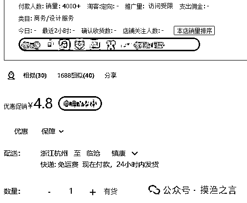
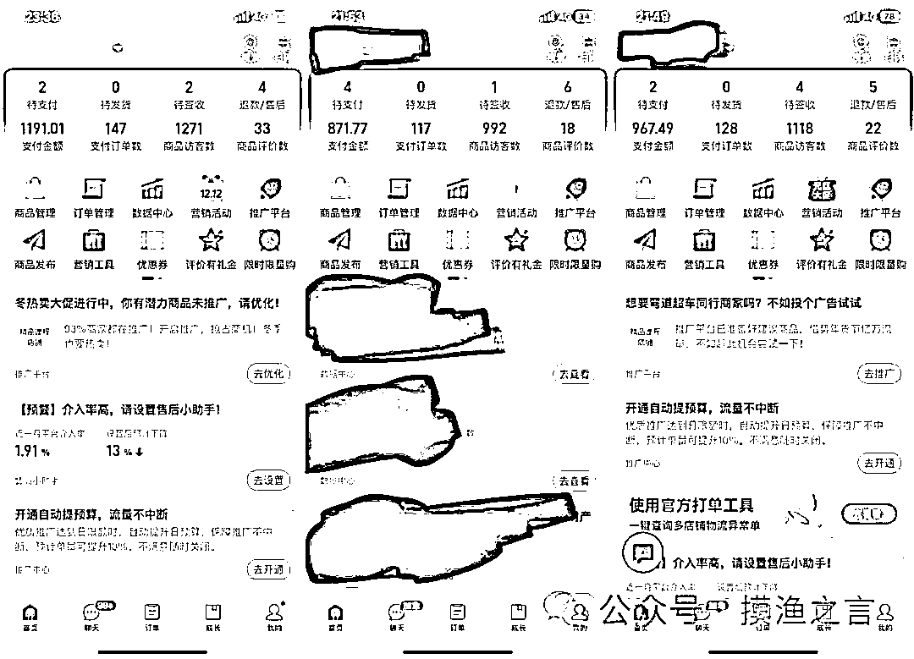
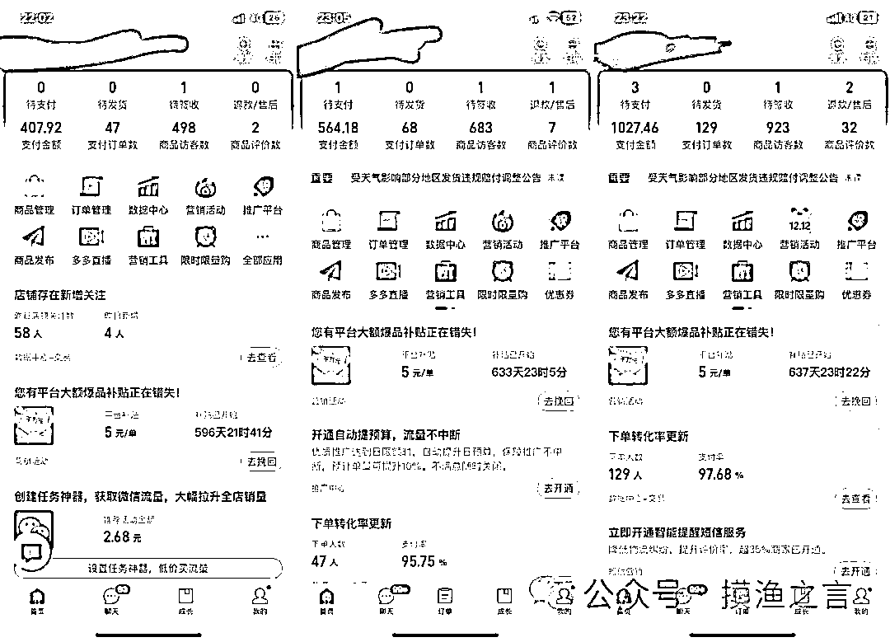
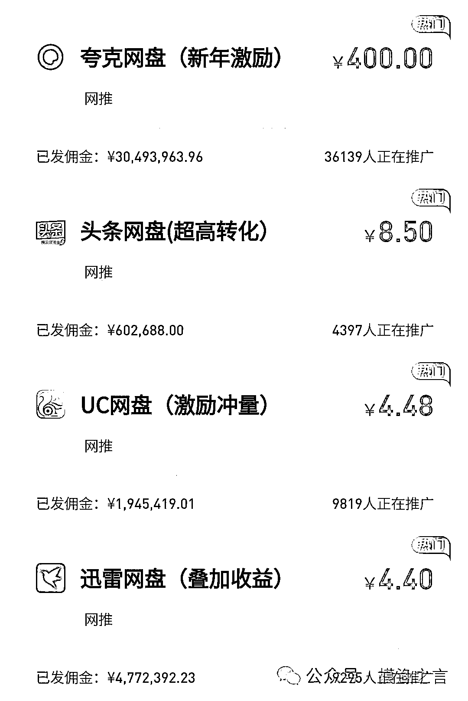
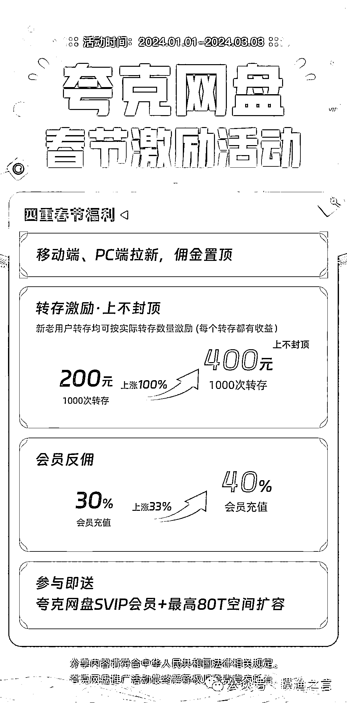
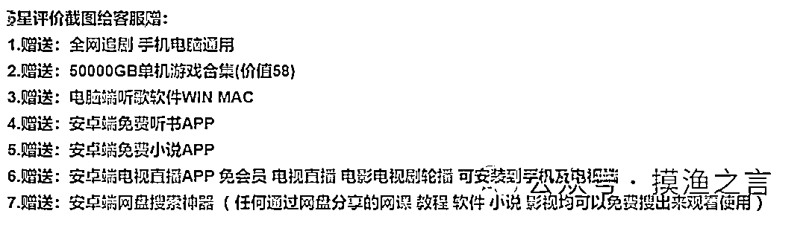

# 多多虚拟玩法：无脑铺货玩法单店日利润 1000+

> 原文：[`www.yuque.com/for_lazy/thfiu8/ol21a8bgud8299rn`](https://www.yuque.com/for_lazy/thfiu8/ol21a8bgud8299rn)

## (27 赞)多多虚拟玩法：无脑铺货玩法单店日利润 1000+

作者： 摸渔之言

日期：2024-01-15

​其实虚拟产品一直都在有人操作，从最开始的 c 店，到后面的咸鱼，多多，玩法经久不衰，你要说简单吧，确实简单，不就是搬运上架吗，你要说难吧，确实也难，多少人不会选品，导致自己的店铺清退下架。

典型的一看就会，一做就废。

你要说虚拟的利润低吗，其实不然，单品几块钱但是需求量大，大家可以看到，这个品销量 4k+，12 月份上架，单单一个品就盈利了 1w+

这不也快过年了，好多人决定暂时放一放实物，所以最近找我咨询虚拟项目的伙伴还不少。今天就分享一个能够日入 1000+的虚拟项目给大家，可以批量做店，如果你有足够的人手，足够的店铺，日入 1w 都没什么问题。

话不多说，上干货。

我们最近研究的玩法就是结合了 2 种操作简单但是收益稳定，**微付费+网盘玩法**，达到了 1+1＞3。先看下我们最近的数据情况

虽然说虚拟项目的同行竞争已经很大了，但是我们通过**全站开车+低价+网盘拉新的骚操作，结合差异化上架和自动发货裂变，主打一个措不及防。**

裂变这里要说一下，品是一方面、私域更是一方面，要知道**私域的一个粉丝目前在市场价格都到几元至十几元，网创粉更是达到 20 多元，这个价值远远超出了你售卖虚拟品的价值。**

看到了吧，网盘拉新玩法，一份时间 3 份收益，这对于人们做个小副业，不是嘎嘎香？

目前夸克是移动端 4.7，pc1.9.头条 8.5，uc 是 4.84，迅雷是 4.65 你们计算一下这几个加起来是多少钱。4.7+8.5+4.84+4.65=22.69！

这里你可能会比较疑惑了，一次不是只能拉一个吗，怎么才能 4 个一起拉，这个方法有很多的呀。别着急往后面看，后面会系统的来讲这个项目应

该怎么去玩。

做过拼多多虚拟的应该都知道吧，100 块钱正常能开出 20-40 单左右来对吧。但是这个也分产品，看产品的需求了。

咱们就按照 30 来来计算，30 单只是这个佣金就有 600 多了把。去掉 100 的推广费还能剩下 500 啦。那么接下来，我教你怎么通过这个方式日入 1000+。

这个项目是我亲自测试过的，我现在有 5 个店再测试，平均每个店铺一天有 200 单左右，推广费一天 600 平均(一个店)

这个方法就是 1 毛钱玩法（也可以做高价，用全站卡投产），这个玩法我之前有介绍过，但是很多人并不明白怎么回事。这个项目可以在淘宝，多多，甚至小红薯，知乎上面都可以做，我最推荐的就是多多，**因为多多你只要花钱，他是真的给你单子，只要你价格够低，转化不是问题。**

就做教程和素材，其他的最好不要碰，有些是违规的，有些容易被投诉之类的。这个需要上货 200 来个，当然你多上也行，我是上了 200 多个。多了太麻烦。

**好下面来说具体的实操步骤:**

1、咱们首先得有这个推广的资格，这个资格不是他们这些个网盘平台给的，我们需要找一个第三方的推广链接，咱们拿到这个佣金其实已经被别人扒掉一层了。

可以找我要网盘拉新的链接，然后获取这个项目的推广资格

2、找货源，建议淘宝找，因为淘宝有很多 1 分钱，的商品，哪怕贵一点的也无所谓，花点钱弄过来，然后上架到咱们得店铺，价格就设置 1 分钱，或者 1 毛钱，总之就是低价。

因为低价才能转化高。图片直接用他们的图就可以了。不要找那种图片很烂的那种，找写看起来比较好的。

比如新年的 ppt 模板，总结素材，教程，等等一大批的产品，但是有人名的，有品牌的，有版权的最好别碰，这种产品容易违规。

3、怎么多推，那就需要用点手段了，首先不能特别懒，上来之后你首先得把咱们准备的货源上传到咱们得对应网盘里面去，我一般是一次拉两个，因为拉太多了客户容易没耐心了。比如他买了 a，我就送个 b，免费的大家都喜欢。但是免费的太多了就不行了。

4、做好以上三步，我们就稍微运营一下店铺，改个销量，出个评价啥的，然后坐等出单就可以。

只要出单，你发链接给他，可以买个软件自动发货，他只要没有这个网盘他就需要注册新账号，或者下载对应的 app，我们可以做一套教程，发给客户。这样只要他注册或者下载了，咱们就能拿到佣金了。

简单吧？不要说你的付费推广不赚钱，不要说类目太卷了，你只是没有找到正确的方法而已。

真正稳定赚钱只有一条路，认真做店铺，把执行力拉满，走捷径行不通。

**富在术数，不在劳身；利在势居，不在力耕。**

* * *

评论区：

专业酒店代订阿福 : 大佬求指教，我的店传了几百个虚拟品，但是一直搜不到，求怎么解决
KK 妍 : 大佬，请问怎么链接你？或者方便加我吗？WSY520126
筱夏美饰 : 好像说了又好像没说
理想 : 大佬，拼多多虚拟课程需要交多少店铺押金
摸渔之言 : 1000 押金
摸渔之言 : 好像按照方法做了，又好像没做
摸渔之言 : [OK]
理想 : 感谢哥

* * *