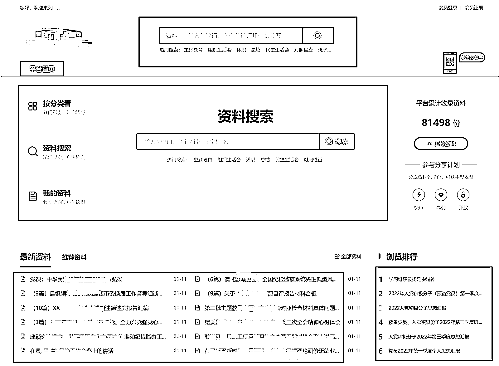
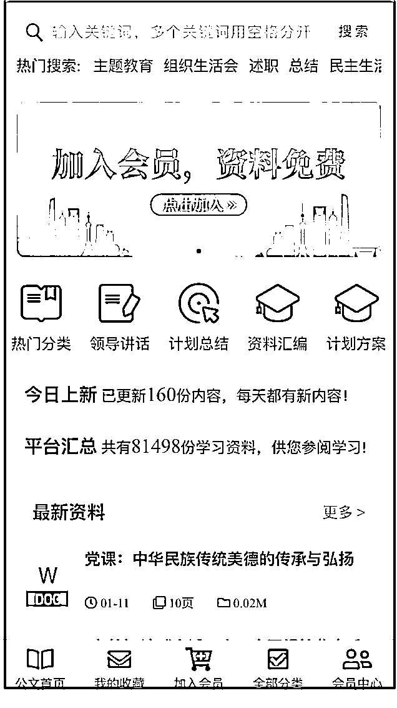
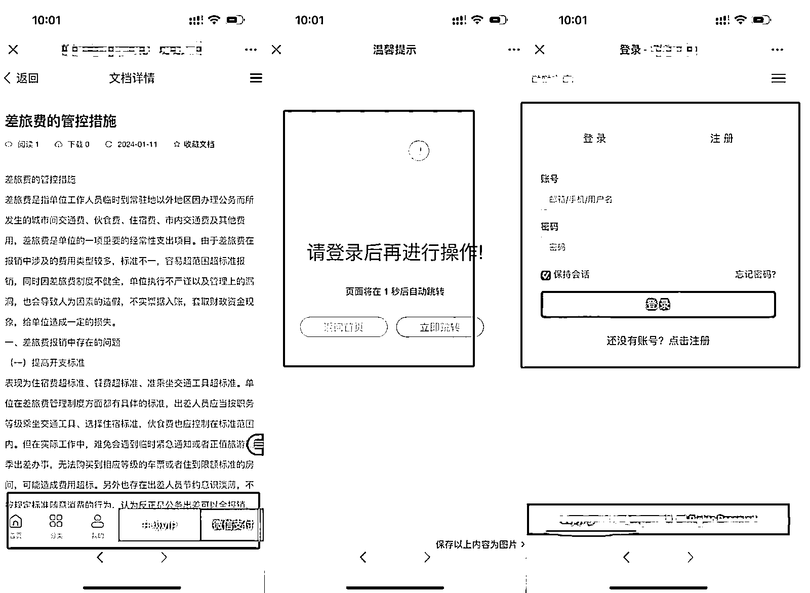
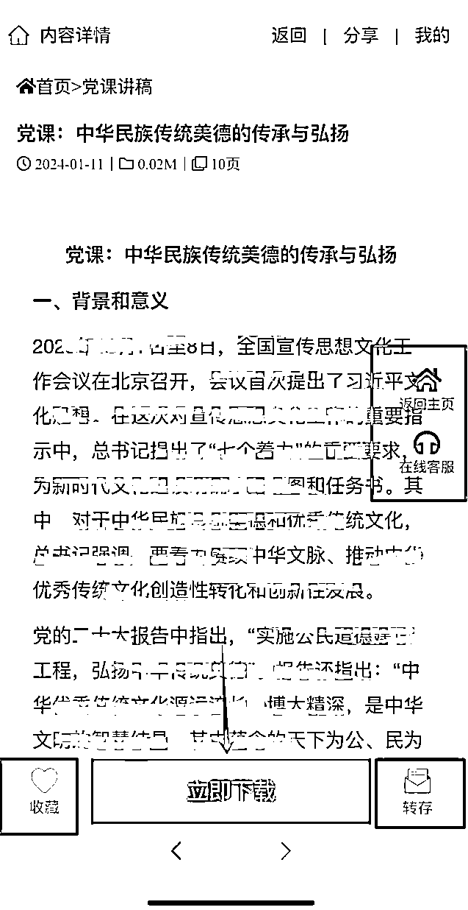
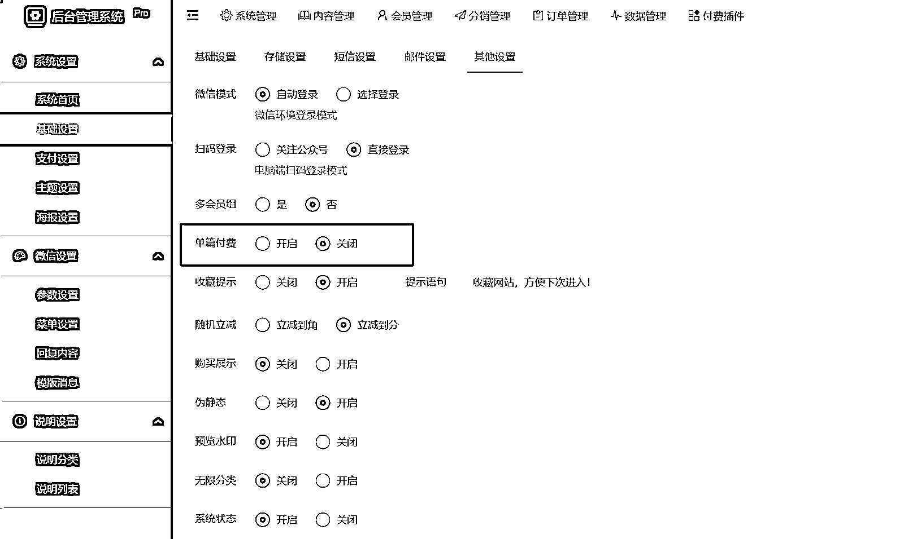
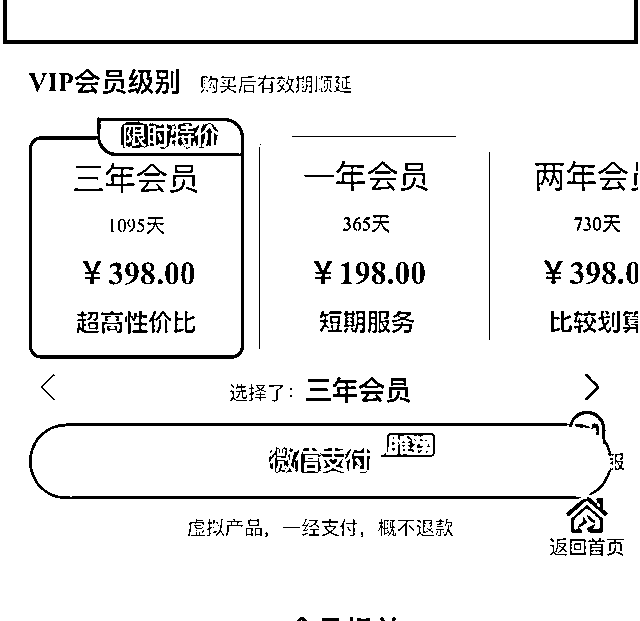
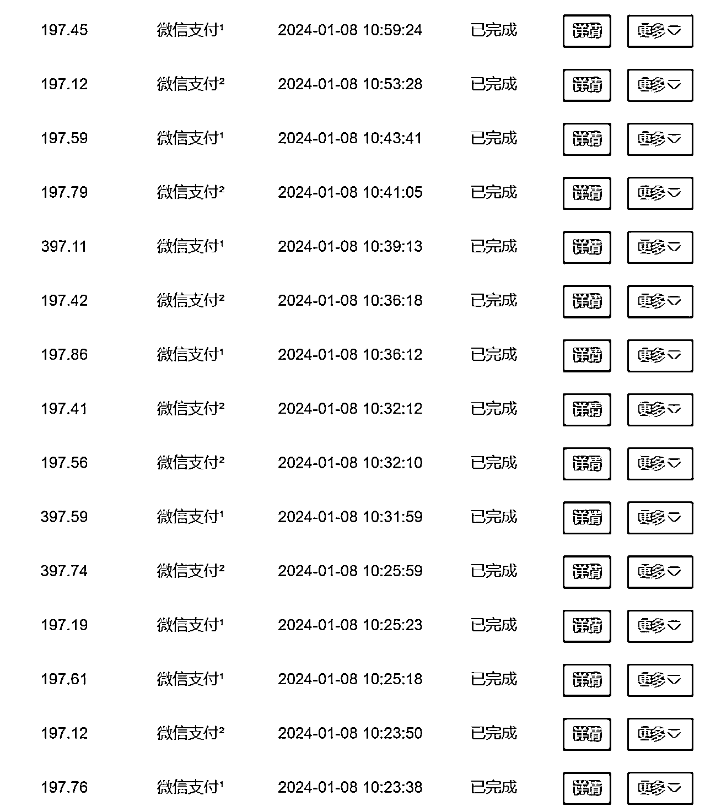
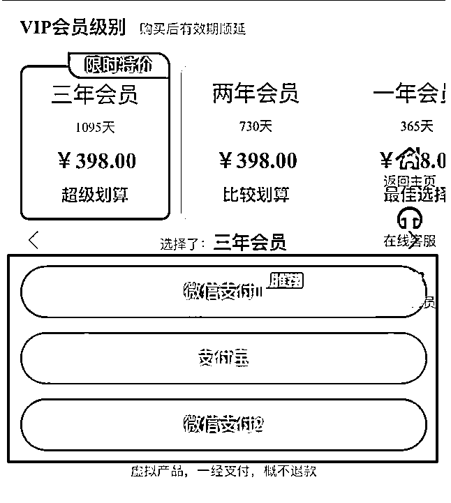
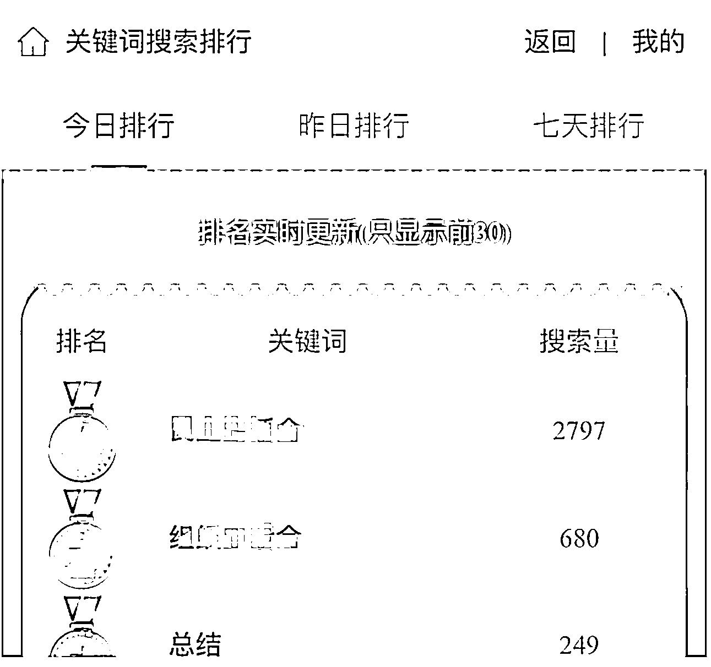
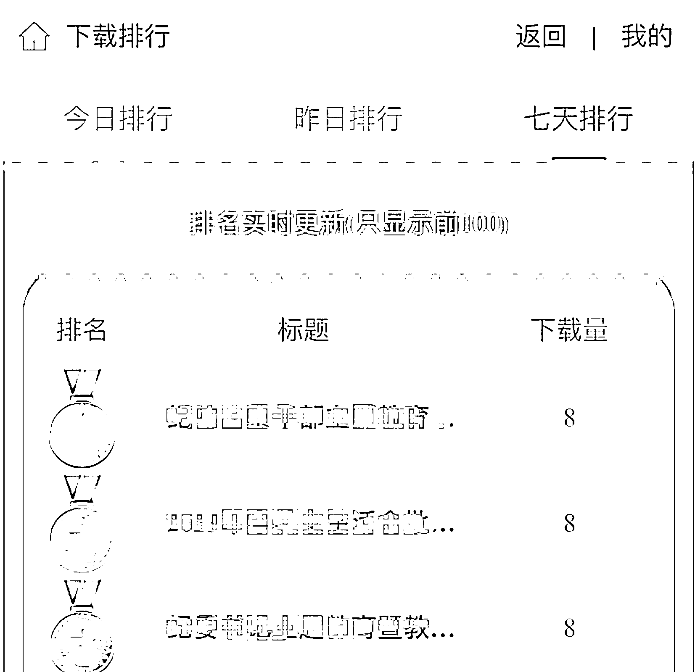

# 如何迭代系统，提升成交率，做到十万单销量

> 原文：[`www.yuque.com/for_lazy/thfiu8/izfh6zxy55gr22m5`](https://www.yuque.com/for_lazy/thfiu8/izfh6zxy55gr22m5)

## (25 赞)如何迭代系统，提升成交率，做到十万单销量

作者： 郭耀天

日期：2024-01-17

大家好，我是郭耀天，人称郭少

前面写了关于公务员项目，很多人都有兴趣，这个月是公务员项目需求高峰期，还没有看前面分享，点击下面链接

[如何挖掘公务员需求，打造自己的赚钱系统，两年十万单复盘](https://wx.zsxq.com/dweb2/index/topic_detail/588521285821884)

生财有很多人操作项目，都是分享操作项目结果，很少分享操作细节的，把操作项目细节分享给大家

公务员资料需求大，操作公务员项目之前，研究市面上做公务员项目的大部分展示销售方式，或者说如何让用户接触，有人用 QQ，有人用网盘，有人用电商卖资料，有人做论坛，有人做网站，有人做 h5，我们有底层的系统，用定制化开发，适合大众的系统，做项目的都知道，体验好了，成交上升不少。

确定定制化开发系统后，就在搜索引擎，把网上能搜索的网页，电脑端，能找到的都整理了，每一个系统都去体验，看到好的收藏，公众号上能打开的系统都去研究，前后深度研究几十个同行，各种展示都有，最终体验到一个不错的系统，模仿升级，也是现在我们一直使用的界面。

刚开始上线的时候页面根本不是这样的，这个页面是调整了无数次，能简洁尽量简洁，就拿搜索下面的热门搜索这些关键词，都是后面不断的迭代的，目前这个项目，这个页面算是电脑端经典页面了，很多同行都在模仿。

手机端，也调整很多次，不管是主页，还是细节，都做了不断的迭代优化，手机端看到这个页面的系统，大部分都是我们下面的加盟商，少部分是模仿我们的页面的，自己开发的。

这里再说几个细节地方，比如有的同行，开发的电脑端，手机端，连最简单的微信扫描登录都没有，需要别人使用手机注册，用手机注册固然很好，但是这个群体的手机不会轻易去注册平台，懂就懂了，所以最好方式就是打开电脑端就可以扫描微信登录。

手机端一样，很多系统用户都准备付费了，又跳转需要注册，需要绑定，用户都跑了，自己体验都复杂别说用户去使用，做项目，做产品，一定要简单，使用快捷，如果你遇到这种，你会注册付费吗？

我们自己解决这些问题时候，把自己变成一个用户，各种优化迭代，看看我们的页面，主页没有任何联系方式，没有弹窗，点击进入内容后，看到内容全部是真实文档预览，右边有返回主页，在线客服，

其实用户比较喜欢的是底部的功能，不是会员提示加入会员，是会员就会显示下载，左边是一个收藏，点击就可以直接收藏，下次方便找到，右边是一个转存，体制内使用邮箱比较多，这个转存功能，只要输入邮箱，内容就直接发到你邮箱，方便快捷。

有时候是一个小小的迭代，成交率提升很多，现在还不断的优化，根据用户的需求不断的优化，很多系统无法做，用的是别人提供的模版，别人根本不会给他优化这些细节，很多开发的，根本不懂用户使用习惯，怎么好使用，怎么方便，这也是我们能把公务员这个细分项目能做到十万单原因。

再说说支付优化，目前做公务员项目的，有电商平台成交，单价太低，有做私域成交，无法自动化，做有网站卖单篇的，系统刚上线时候，也销售单篇，一篇 19.9，一天可以出上几百单，单利润很低，用户购买单篇就没有后续了。

最后把单篇关闭了，成交率利润直接上来了，用户看到一篇需求的，无法单篇购买，多数会考虑购买会员，会员 198 一年，单篇 19.9，显然卖会员赚得多点，就这样一个简单的优化，成交利润翻倍，现在还有很多同行是开单篇的，最好不卖，看起来单子多，其实对成交额影响很大。

这是能做到十万单一个点，做单篇早就能突破，但是利润上不去，就这个点优化利润就上升不少，还有就是定价策略，当时研究网上时候，有 39.9，有 69.9 元,99 元.169 元，218 元，298 一年的，后面我们取了一个中间，直接定价 198 一年，三年 398，两年也是 398，这个思路是通过天眼查学习的。

会员展示定价时候，把二年会员，三年会员故意设置成一样的价格，如果你看到这样的设置，你是怎么想，我咨询一些用户，他们说感觉搞错了，398 元能买三年，怎么会购买两年了，直接买三年，当用户下单三年 ，你不是赚更多了吗。说到这里，再说说使用系统成交的好处，不需要太多的售前咨询，只要系统内容质量足够优质，用户搜索看预览，看到内容好，直接下单了，如果是引到私域成交，无法给用户展示这些内容的，这样不仅解放了客服，更主要是可以做到实时成交，这也是操作虚拟资料借助系统操作的原因。

看到上面的成交截图，看到上面成交金额都不一样，这里还有一个点，也很重要，当开始上线后，没有这个功能，支付经常出问题，支付估计觉得 shua 单，支付经常异常，后面给技术沟通了，把每单的金额都设置不一样，成交时候自动减掉，从这次优化后，异常的情况就更少了。

对于支付接口也优化了，目前我们对接三个支付渠道，一个是微信商户，一个是支付宝，目前很多系统根本无法使用支付宝，其实支付宝使用人也很多，一个是第三方支付虎皮椒，目的就是一个支付出问题时候，其他支付可以继续使用，但是当订单太多的时候，还是无法满足，还是会异常，客户就跑了。

在支付的基础上，再次优化，开发了轮换支付功能，一个支付渠道可以同时嫁接三个支付，三个渠道就相当于九个支付，每次支付都会切换不同的支付，遇到爆单的时候，就不会出现异常的情况，就算有也比较少。

那么多内容，如何知道用户需要那些内容，那些内容比较火，通过用户搜索，下载就知道那些资料是当下需求比较大的，做推广的时候，只需要把这些下载大的，搜索比较大的关键词内容全网发布，找到都是其他想要这些资料的人，把这个权限给我们推广的伙伴，随时看到最新的数据，根据数据区做推广，效果就起来了。

上面这些就是我操作公务员项目中，一些重要优化，升级，还有一个点就是加入分销裂变，项目跑通招募更多的推广者，把佣金给他们，这套模式适合很多项目的操作，特别是虚拟项目，有人喜欢做电商，我喜欢做系统，如果对开发，虚拟项目有兴趣，可以对接，如果你有比较好的虚拟资源也可以合作，我们有系统，可以根据系统定制开发，我们有成熟的运营体系。

* * *

评论区：

倪大胖 : 厉害。方便问下这个系统的开发成本吗
郭耀天 : 目前花几十万
倪大胖 : 好嘞 多谢

* * *