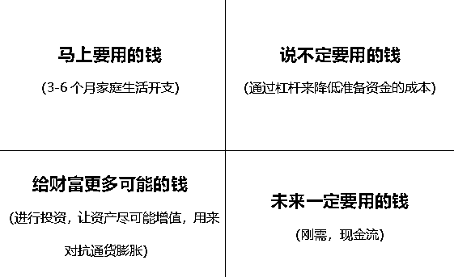

# 会花钱和不会花钱的有钱人

> 原文：[`www.yuque.com/for_lazy/thfiu8/dgpmkcq0q3pg5o89`](https://www.yuque.com/for_lazy/thfiu8/dgpmkcq0q3pg5o89)

## (22 赞)会花钱和不会花钱的有钱人

作者： 忻忻

日期：2024-01-26

很多人都对有钱人的世界充满向往，想知道有钱人的生活。亦仁老大让我组织一期聚会聊聊这个话题。仅向几个圈友分享这些~~八卦~~（信息）不免有点可惜，于是我把有钱人花钱这个挺值得探讨的话题沉淀成文章，和大家共享。

会想到这个话题，是因为我看到过很多手握九位数的资产却把钱花得打水漂的人，也见过以一当十迅速扩大资产规模从百万到百亿的人。

都说赚钱难，事实上，到了钱是拿来数零的时候，花钱更难。花得不好的人，用我们行业一句话来说，**“有钱人最终都是被金融收割”**。之前爆雷的那些大名鼎鼎的公司，真正在里头跌进黑洞的，还是有钱人居多，只不过他们闷声不响，觉得丢人，而已。

说到会花钱，想和大家先分享一个不那么有钱的人，花了三十多万却花得极漂亮的故事。

我们姑且把她称为小 L，在 30 出头的时候，进了一个商学院，开启了逆袭的人生。

小 L 去商学院，跟田朴珺的想法可不一样。她当时想的是，这是我走入有钱人世界相对来说最最简单的途径了，我就去试试看。当时是为什么去报了这个？因为被公司裁了，赔偿 N 加 6，一共贴了她五十多万。她出去玩了两个月，花了 5 万块钱，手里还有点钱。

我觉得她真的好会花钱！虽然她轻描淡写——MBA 只要三十几万，我把这个钱花掉了，买个包买个车没意思。但是细想和深想，这种不在乎的洒脱里，有相当的远见。

小 L 说自己当时有个特别有意思的想法，进商学院见到好多老板，只要愿意搭理我的，跟我气场合的，我就采访他们一下，问问他们到底是怎么做生意的。

如果他们愿意告诉我，也愿意和我多聊聊，我就把我这个小菜鸟的情况跟他们说说，看他们愿不愿意给我一些指点。商学院里男性比较多，不少人还是有些“好为人师”，也许趁这个机会能学到一些东西。

存着这样的想法把钱花出去了，MBA 要读好几年，认识那么多人，她后来手里光 offer 就拿了六七个。虽然她不是老板们的级别，但是老板们会觉得她这样的思维模式已经不是普通的员工的高度了。

这些老板们还无意中教了她很多，于是读完两年就先去了一个超级的大厂做了一个 director 的职位，先是把年薪做到了大概七八十万，后来拿到新的项目。

她的故事验证了我一直认可的一个观点——

**没钱的人会特别在乎投资回报率，而真正大的投资回报率是在你一开始不算投资回报率的时候才能有的。**

为什么？因为我们能算的投资回报率都在我们自己熟悉的领域。

赚几百万的人逃不出七位数的框架，但是如果先不去计算，动作和思维模式就会非常的有很多可能性。

当然这也有一个巨大的风险，就是可能会有巨大的回报，但也可能就什么没有都没有。

所以不去算 ROI 花出去的钱，在一开始是做好了准备不要具体的投资回报的。越是这样，越是可能有惊喜。

这其实很难。我们大多数人本能地都会算投资回报率。比如很多生财圈友也会去混其他圈子，这个那个合伙人、私董会等等，投出去的钱隐约还是带点儿念想——我什么时候把它赚回来，甚至 10 倍 100 倍赚回来对吧？

**这么花钱，叫花在项目上。**

衍生一下什么叫把钱花给项目。大家可以问自己一个问题，假如这个项目不是我自己执行，而是花钱来加速它的成功/增加成功的可能性，那我该花在哪个地方？比如说我是要买什么关键资源还是优质货源等等。答不出来的话，其实就是不懂这个项目。

但有没有人投了不懂的项目还赚到钱的？肯定有。并且如果不只是一次能投成功的话，这个花钱的本事就值得我们去思考了。

**第二种花钱的方式，叫花在人身上。**

我想好好和大家区分一下把钱花在人身上和花在项目上的区别。

有些人说我虽然不懂这个项目，但是操盘手我相信他的能力，所以给他投钱，这是前者，还是第二种花钱的方式？

其实这还是第一种，给项目投钱，只不过，判断项目的一个维度是操盘手，而已。

真正的把钱花在人的身上，一点儿也不高大上。

我们赚钱到底是为了干什么？好好吃饭，住大房子，拥有游艇、飞机、珠宝，各种买买买……或者是家人和自己生病的时候不看是不是报销的药品甚至不在乎在地球的哪个地方救治……

让自己和其他人的生活品质有直接的提升，叫做把钱花在人的身上。不妨去看看，舍得给自己或者朋友花钱的人，通常人生不会过得太惨。比如著名“朋友”王思聪，他有句话的意思是我不在乎别人和我交朋友是不是为了我的钱，反正他们都没我有钱。

除此之外，主要是“数钱”的所有花钱方式，都叫把钱花在项目上。很多有钱人是不舍得把钱花在人身上的人，永远都在钱生钱，这其实很可怕。他们的爽不是来源于生活本身，而是数字游戏。尤其是做企业和专业的投资者，渐渐地会失去做人地快乐，只有追逐数字的快感。而金融市场收割的大片“韭菜”，也往往是这群人。

**金钱的游戏不颁发阶段性的奖项，它通常只在人生的终点收一份答卷。**

所以那些在非常年轻的时候就赚到了相当的数额的钱的人，反而是值得警惕的。

忽然涌来的巨额的钱很可怕。如果我的钱是一点一点赚到的，我的认知大抵是可以 cover 我花钱的需求。但是包括我们生财在内的一些行业和赛道，真的就是一年的时间迅速赚到好几千万，接下来的功课更在于这个财富我们能不能守得住。

这里就要和大家梳理“财富”和“资产”的差别了。

有保险公司的沙龙讲座经常给客户举例子，房产股票是资产，买成保险或者存在银行叫财富，更有甚者只有保险是财富，美其名曰“挤去水分的资产才是真正属于自己的财富”。

这个说法可以作为参考，但毕竟是保险从业者立场的解释，不免有失偏颇，我们把外延扩展一下——

**真正的财富是要满足三个条件的，否则只是放在那里好看的资产：**

**金额管理、权属管理、自由管理都在自己手中。**

**先来讲金额管理。**

为什么很多人说自己是富有的穷人？坐拥价值 5000 万的房产，可是要用钱的时候比如回购股权，那么就得先把房子卖掉/抵押，换取现金流，此时你说价值 5000 万就是吗？人家可能只给你变现 4000 万，所以其实财富的金额是打了折的。

相对来说，活期存款哪怕定期，或者是保险退保现金价值，说好多少就是多少，的确金额安全系数很高。

但是只有它们拥有金额的自主吗？一家正在上升期的公式股权变现，或者曾经的学区房，也曾经是相当拥有财富金额的自主权。

那种价值看涨的是不是就是非常优质的资产，可以放在那里呢？有钱人所以称为有钱人，还得是他自己能用这些钱。好比《繁花》里的范总，钱都是厂子的，**这就引入了权属管理的自由**。

说得更通俗点，就是这个钱不会有一天突然不算我能动用的钱了。

举个最简单的例子，我在大 A 有 500 万的市值，今天也的确抛售了 500 万，可是 T+1 哇，明天我才能用这 500 万，今晚还是很穷，是扎扎实实的没有钱。

如果停牌了呢？如果账户被冻结了呢？如果我的另一半知道我网银密码转账给别人了呢？……

相信这些例子都能让大家很好地理解权属管理了。

**最后来讲讲财富的自由管理。**

这也是“会用钱”的相当高阶状态。

昨天去看《年会不能停》，有个情节颇有感触。公司遭遇现金流危机，于是“反派”建议董事长优化上千名员工，但是被裁的人不是那些真正没有能力干活的，而是各部门之间正直（音）斗争的牺牲品。另一边，开一个年会极尽奢侈，要花 6000 万。

董事长其实并无法真的完全确定他的钱在什么时候给哪些人用，用来做什么。签字就代表权力了？签出去的钱是真的给优秀员工加工资吗，谁知道呢。给孩子打的 300 万在国外读书+生活的费用，孩子是不是都用在认真学习吃好睡好，谁知道呢。

很多有钱人意识到这件事了，于是他们考虑家族信托，每笔大额的钱花出去的时候是按照他们的意志进行的，豪门太太生个孩子有多少钱，孩子考到藤校有多少钱，孩子想创业启动资金给多少钱，拿了计划书过来额外能给多少钱……

带大家看一个老生常谈但是角度清奇的“花钱”工具——四象限图。

我们不去参考什么所谓标准普尔的说法，那个我觉得根本对于真实的生活不适用，它不但没有帮助有钱人好好地梳理花钱这件事，甚至会令人产生逆反。

每个人都是有自己独特价值观的，所以不存在什么“应该”在某个地方花多少比例的钱的概念。

好比有的人就是赌性很强，他的爽感来自于投钱并且充满期待的过程大于赚到钱本身，你和他说风险投资不应该超过资金量的 30%？

所以这个工具的用法是，**我们来区分一些花在人身上的钱和花在项目上的钱，然后根据自己的选择优化花钱的方式。**

花在人身上的钱，用狭义的定义，它分 2 个部分：

①马上要用的钱，就是日常的一些开销，生活成本等。

②未来一定要用的钱，通常是刚需，比如孩子读书，以后过日子甚至养老。

除此之外我们都理解为给项目花的钱，比如说什么生老病死的突发事件，或者是公司突然之间要增资等等的钱。它们和给财富更多可能的钱本质是一样的，**就是降低成本，博取收益。**

**换一个说法，叫使用杠杆和时间周期。**

这都是让人觉得很爽的词，因为它们是钱能够越变越多的基础。

举个简单的例子，我们买车买房会贷款吗？如果是还没想好什么时候买，其实只要攒一个首付的钱就可以了。

比如大概三年后买车，三年以后不知道车价是多少，但杠杆思维就会让他只要预留 10 万块钱，剩下来攒到的所有的钱，都可以去投入（项目）。

假使不投谜一般的大 A，投一个直播间。大概率三年以后，赚得比还贷款的钱多。

所以除了狭义的用在人身上的钱，其他都是赚钱的渠道。毕竟人要吃饭生活，这个钱没法上杠杆和周期，今天买一碗饭但是不吃，三天以后吃两碗？多少有点离谱了。

很多人这个点上想不通，我看到好多不愿意买保险的人。其实我一直觉得买保险也是要确保你有更多的钱可以赚。比如得了病要看，但是不得病就不看，那怎么办呢？假如看病要花 5 万 10 万，一定要留存 5 万 10 万？买个保险不就行了吗，可能才几千块钱。省下来 4 万块钱我投流，这不是很爽吗？

还有些客户，已经准备好一个月 2 万块钱生活费，将来小孩要用的钱也准备好了，手里还剩下 800 万，凭什么给他说 800 万只有 40%可以做风险投资？为什么一定要人家买保险做存款？

教人做事，对方会很难受的。

好比有些人镜头感好而且是话痨，你教他小红书最适合图文。好嘛，人家做一个图文 2 小时还丑，录一个视频 10 分钟轻轻松松，搞什么图文啊！

**尊重每个人的个性和选择，钱毕竟只是工具，没有一个人可以要求另一个人应该怎么对待钱。**

但是有些底线还是要有，刚需的钱它留下来，接下来一切都可以。

有些人很疯，砸十个直播间，总能砸出点水花？

有些人求稳，虽然用杠杆，但是 backup 做好。大家都很开心，我们自己的生意也会做得很好。

前面讲的是杠杆，再来说说时间周期。如果你生意做大的话，一定会碰到这个事情。因为钱会不够。

投项目钱好像永远不够，我们把复杂的事情简单化。把投项目（企业）理解为有些人赚钱的目标就是给公司花钱，那么假如客户自己有个儿子，可以理解为赚钱的动力是养未来的自己，养亲生儿子，和养公司。

大家觉得一个做实业起家的有钱人，这三笔钱，他哪个最舍得花？

大概率还是最舍得给公司花钱，这就是厚此薄彼吗，如果用时间周期看就不一定，给亲儿子的支持眼下变少了，但是 5 年以后公司交给儿子，相当于给了他更多的钱。

所以钱不够的时候，解决问题最简单的方式，要么就是时间，要么就是杠杆，而不是抠抠搜搜。

我们说有钱人也有不会花钱的，其实就是他们只对数字有概念，而不会区分花在人身上和花在项目上的钱，也不知道使用杠杆和时间周期。

**生财有术是开始，花钱有术是本事。**

让我们一起和财富做好朋友。

* * *

评论区：

七小 : 姐，文章可以分段落处理一下，不然看着太累了[捂脸]
忻忻 : 嗯嗯，回家电脑上操作一下😂

* * *