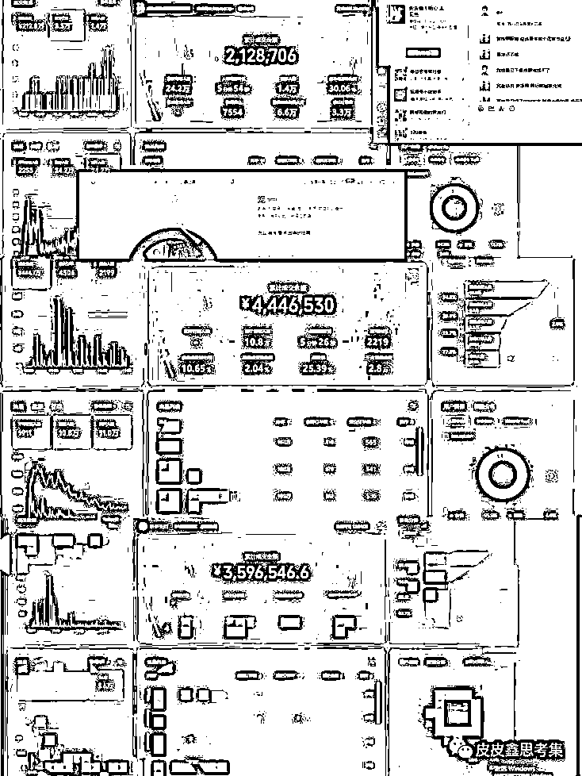
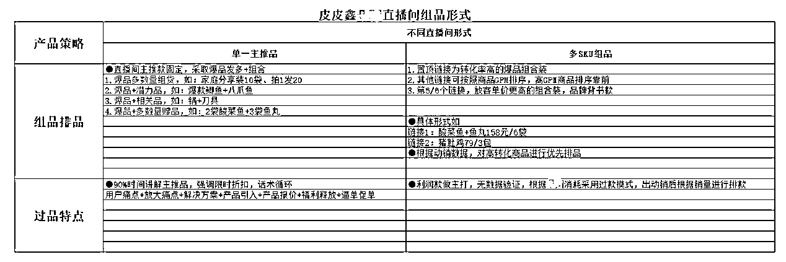

# 视频号操盘经验：1 人，10 人，100 人的付费投放策略有哪些不同？

> 原文：[`www.yuque.com/for_lazy/thfiu8/mgfizq5hkidf8a2i`](https://www.yuque.com/for_lazy/thfiu8/mgfizq5hkidf8a2i)

## (98 赞)视频号操盘经验：1 人，10 人，100 人的付费投放策略有哪些不同？

作者： 皮皮鑫

日期：2024-01-26

这是一份视频号 0-1 的操盘手册，全部来自我的实操经验。

我从去年 11 月入局视频号，和大多数从抖音转型操盘手一样，冲着风口去，然后亏得一塌糊涂，最后靠直接付费猛砸起号，有了起色。

虽然视频号各种机制都不够完善，也没有明确的规则。但，我明显感觉到视频号的流量是真的很便宜，同一产品，我在抖音卖 50 块钱，在视频号卖 89，卖的比抖音贵，付费广告投产竟然是抖音的三倍。

身边其实有很多朋友，把视频号做得很好，但问他们怎么做到的？大部分都说不出个所以然来。

所以今天我就摸索出来的经验分享给大家，关于视频号前景的深入分析，直播团队的组建框架，货品选品的策略，以及如何通过短视频内容创作和微信豆投放来提升直播效果的实用技巧。

希望通过分享我的故事，以及那些在视频号运营过程中的得与失，能够帮助更多和我一样的同行们少走弯路。

# **前言**

小伙伴大家好，很高兴能跟这么多做视频号的小伙伴交流微信视频号的玩法。

我今天想分享的是《视频号 0-1 的操盘流程》，又如何从 0-1，1-10，10-100 的过程。

大家从去年开始许多朋友，都在陆续入局视频号，视频号就像大家眼中所谓“风口”一般，但事实真是如此吗？所谓的风口不一定是你的风口。

我从去年 11 月开始入局视频号，也是抱着这样的心态进去，然后亏损的一塌糊涂，后面经过调整方向及方式才出现了业绩的上涨。

因为我也是从抖音过来的，已具备抖音的实战经验转型到视频号上，本借着已有经验去做视频号，发现行不通。

**那为什么现在非常推荐大家入局视频号呢？**

因为我有个社群的用户，他们即使没有做过抖音，啥都不懂去做视频号，今年七月才做视频号，到现在为止一天也卖个两万多，还只是一个人做的。

于是，我问他：“你在这途中做了哪些动作使你成功的？”他不假思索的回答我说：“自己都不知道怎么做起来的，就拿抖音上的一些爆款来去播了一段时间，直播间就一直爆”。

可见，一个他是这样，我商家社群里的其他朋友，问了快 63 个用户，他们都对自己的成功，说不出个所以然来。

还有一个做线下销售的女性，做了两个多月视频号，一天能卖个十来万销售额，跑来问我怎么放大？才一个人做的......视频号现在是个人进来，他都能做，但首先你的选品这块得没问题。

再说下我们自己直播间的情况，我是有做抖音的，转型到视频号来，我是直接付费猛砸起号的。

但，我明显感觉到视频号的流量是真的很便宜，同一产品，我在抖音卖 50 块钱，在视频号卖 89，卖的比抖音贵，付费广告投产竟然是抖音的三倍！这玩自然流也好，玩付费流量也好，这个流量成本多便宜啊。

现在去做视频号，今天的流量一定是未来三年最便宜的！我明年会把自己公司的业务，全部 all in 视频号，砍掉之前抖音的业务，值得我全身投入。

我接下来会跟大家从以下主题分享：

1.  皮皮鑫的前世今生-必看

2.  视频号的前景

3.  做视频号的那些踩坑之路

4.  视频号的选赛道方式

5.  视频号的直播算法拆解

6.  直播团队的组建框架

7.  货品的组建与玩法运用模型

8.  场景如何搭建

9.  主播怎么流水线批量复制培养

10.  短视频内容怎么创作

11.  微信豆的投放方式

12.  各大起号方式的直播玩法拆解

13.  操盘手运营技能如何提升的拆解

14.  微信视频号的长效经营规划

# 一、**皮皮鑫的前世今生-必看**

以下是我从事视频号，以及为什么接触了抖音电商行业全部经历过程，文章链接可点击打开，长达一万字，愿你在文中找到坚持的力量，同时你也可以搜微信公众号“皮皮鑫思考集”进行阅读。

[皮皮鑫的前世今生经历文](https://mp.weixin.qq.com/s/VNCU_T0o_WocqaiQMISPAA)

您好陌生人，很高兴认识你，我是皮皮鑫（真名叫刘俊鑫）如你在面临转型做视频号，或许我能帮到你。

今天我想重新让你认识一下我。同时非常谢谢你愿意打开这篇文章来认识我，这篇介绍或许会有点长，可能会耽误你一小时时间，自此再看完后，我也希望我与你之间能成为好朋友，或成为你人生路上的指引灯亦或者你成为我的路灯。

我呢？比较皮且爱玩，喜欢深度思考爱看书，也懂点手相八字玄学类、偶尔研究一下奇门遁甲、帝王之术，还有只奇葩的六只手指，这就是我。

过去，在我身上体验了人生死亡时刻、迷茫、焦虑、高峰跌落、原生家庭的黑暗.....等等，可谓我的前世到现在像是经历了两极反转的人生一样。

前段时间，跟一位许久未见的异性好朋友吃了一顿饭，她说道：这十多年认识你至今，感觉你的经历就像看电视剧一样，我一直有在关注着你，从你转到我们初中学校开始就发现你很独特。

反而，现在我一到工作压力重的时候，我就会去看你的过去到现在的每一段经历，真的很像电视剧般的生活。

我这么多年，学习到了几个个经验：

受到我大学老师的邀请，说我能不能分享一下自己这么多年的学习经验？这无疑对我是至高无上的荣耀。

2019 年，我考上广州暨南大学工商管理系，有一天我跟我的英语老师走在大操场上聊起了天，我说我未来想帮助更多人，我不想因为我过去不堪的经历再让其他人经历体验了。我想创造一个流量型平台、一家伟大创于社会价值的公司。

老师非常兴奋地看着我，真的就像看见我已经实现了目标那样的眼神透露出满怀欣喜，我那时候也特别兴奋，莫名得到了极大的认可！我内心中的火彻底被点燃了，我到底是什么神仙人物？竟然有人会相信什么都不是的我，我感动的哭了。

紧接着，我在大学期间像发了疯的拼命三郎，凭借着半年时间学完大学四年的课程并参与了考试，虽然中途有过辍学，但也是花了将近一年空余时间自主学习考完所有的学科顺利毕业。我顿时感觉我就像天选之子般，非凡人做非常人之事。

那时，我就如同打开了第三只眼，我发现任何事情都有规律，学习也都有方法论。

只要不断地学习，不断地吸取他人的脑袋中的智慧，就任何事情都能抄抄抄，抄完了优化成为自己的，我称它为吸星大法，如同万物不为我所有，但万物都皆为我所用。

第二：则是只要找好赛道选对方向，在合适的时机进入战场，从顶层规划出发，倒推设计自己的人生，再通过一切资源代价高举高打结合人、资源，我所说的高举高打是降维打击，我也只做降维打击的事，这样能事半功倍。

如果实在焦虑迷茫了，我建议你去读道德经、易经，里面是本万能钥匙。

第三：你们所看到我的一切表现，言行举止、思维方式，这都是我这么多年赚到的钱全部用来投资了自己的大脑，即使过去身无分文时我也会去不断投资自己大脑保持学习。

一路上很多赚的钱也没有去花钱买什么特别豪华的车，特别奢侈的衣服手表啥的，不断用钱投资自己学习演讲、企业管理、决策力、投资学......等等，以至于自身的外在形象十分简陋。

因为我觉得，我更多时间想花在对自己产生持续价值的身上，而不是花在每天想着要穿什么？我的一位贵人 50 多岁的大老哥跟我说过：“现在的中国人永远只相信自己相信的，不会相信任何真相，他们也不喜欢”。

以至于大哥跟我说过的话，印象非常深刻，我也相信在世界不到 5%的概率下，太少太少出世的智者了。每个人都是非常平凡的那个人，接受自己的普通，允许别人是别人，也请允许自己是自己。

这么多年，我与自己握手言和，自洽和解，与父母和平和解、与世界和解、与不公的人事和平拥抱。我从未状态如何好过，从未内心如此的有力量，非常感谢大家每一个人，是你们帮助了我精神的富足，也非常开心自己把自己从深渊中拯救了。

以上是我多年总结到的经验。

**我的童年经历：**

我于九十年代年尾出生，95 后，也快接近 00 后了，外在形象也真的看起来非常稚嫩，常常被说太小了，以至于让我有些自卑。

乃至在家中过去也特别自卑，且生活在不是一胎的家庭，家里孩子中排名最大，爸妈从小到大跟我说最多的话就是：你作为哥哥，你不会让着弟弟吗？爸妈的这句话让我此时依然非常揪心。

很多人的童年是被父母关心着长大、出生豪门要么是家道中落，我出生在一个非常穷的山里，潮汕区域的揭西河婆良田乡的一间瓦房里，有机会你去到儿时的地方你会发现这是人住的吗？

一到下暴雨时，屋子就会疯狂的漏雨，搞得整张竹子铺的床全是雨水。而爷爷奶奶老一辈们都靠在山寮里种果子为生，而父母在我 4 岁时就去深圳打工谋生去了，我的童年是靠爷爷奶奶好不容易把我养活。

那时候体验了吃不饱的日子，爷爷奶奶就经常去隔壁村的邻居家借干粮给我吃，本想着喝粥，粥里的米饭没几粒，剩下的都是粥汤，经常吃着没几粒饭的粥汤。

（这是我生活到 7 岁前的家）

吃不饱还经常生病，甚至这个隐患到我上小学时，查出来了急性肠胃炎+身体营养不良，经常低血糖晕倒。

直到我 7 岁时，终于我进城里了，爷爷奶奶父母们把辛苦赚来的钱，才在镇里盖了水泥房子搬了进去，房子没装修，还都是水泥生活了好几年。

我的童年生活跟娱乐玩可谓是半点扯不上关系，因为我是被爷爷奶奶抚养长大，我的童年在之余都是干农活。虽然搬到镇里了，但是家里前面还有家后就是农田，就经常被爷爷奶奶叫去田里种菜、耕番薯、剥花生来卖到市场里，天天就跟着爷爷奶奶出去卖菜卖花生，搞得浑身脏兮兮的。

别看我爷爷上学上到四年级，奶奶没上过学，但他们那朴素的农民品质让我在之后的生涯里起到了很好的榜样，你虽然爷爷没怎么上过学。

但他做生意的思维非常强，非常精打细算，儿时就经常屁颠屁颠的跟着他们后面看们怎么卖菜跟人打交道，爷爷每天跟我说的一句话就是：你要努力读书，不要让人瞧不起，一定要改变自己的命运。

皮皮鑫希望你记住：你的所有不堪经历都是你的财富，也终将让你感受到“知识确实能改变命运”。

这个时候，相信你看到这里你已经很不耐烦了，我的长篇大论真是让人心烦啊！如果你愿意继续了解我，请接着往下看。

后面，父母去了惠州惠东做生意，卖过水果、开过摩托车店、做过女鞋加工厂......我也被父母带去了那上小学。

一到小学里，我的第六只手指不小心给同班同学看到，受到了同学们的嘲笑，也受到了同班同学的殴打。

一度陷入非常自卑的心态，为什么所有人都讨厌我、不喜欢我？我不服输，我心一直默念给自己激励，即使所有人讨厌我，我都要活成不一样的自己，我要学习比他们还要好。

我既然是另类奇葩，那我就做人群中最独特的存在吧，而后在校园的每一天我都是笑嘻嘻的。我一脸质疑的向我那奇葩的六只手指去看了看，我心想着为什么世上要生我下来？

父母为什么又要生我下来？一定是上天要我完成一件伟大的事，所以让所有人讨厌我、让所有困难向我而来。从那个时候，我就开始在想人的规律了，为什么人与人之间有不同的地方，到底要怎么样才能变得更加强大？

皮皮鑫希望你记住：如果你有被嘲笑过、受到过身边人嘲讽不要紧，请记住：非凡人干非凡事，身边的人都是普通人，你就要活成最闪耀的自己。

我还记得非常清晰的一次：有一天，学校给我布置了一个任务说临摹汉字，我为了写一个“我”字，不会写，父母把我在那晚上用水管毒打了一顿，打的我浑身是伤，还狠狠的骂了我说道：这么简单的字都不会写，怎么就这么蠢？父母天天在外工作，怎么就养了这么不聪明的你。

当时年仅 8 岁的我心理受到了非常大的打击，我心里想要是我这么蠢你们干嘛生我？

我心里充满了怨恨，而后我的几年也是被毒打过来的，父母也没怎么上过学，初中毕业学历，给了我非常多负能量的教育，靠着他们理所当然的毒打式教育我也活到了现在，我很庆幸活了下来，我一想起我被打到进医院、浑身是伤、鼻青脸肿......

什么样的毒打式都经历过了一遍，我当时的心理是：非常恨我的父母，为什么要让我活在这种家庭？我当时无数次想过自杀，夜晚睡觉一直捂着被子在哭，生怕被人发现。

皮皮鑫希望你记住：即使你面对再大困难再大挫折也不要紧，即便父母都不相信你也罢，不如跟这世间的灾难斗一斗，谁更强？只要你不认输，谁都不能让你输。

**我的青年时代：**

紧接着，进入到我的小升初的时期，因为我每天被父母这种教育熏陶式再加上我爷爷对我说的话，我发誓我一定干赢所有人，我要改变所有，我凭借着全年级前三的成绩考进了当地最好的中学读了一年。

然后那时候我特别叛逆，爱玩、爱自由，我跟父母大吵要回老家读书，甚至拿上了刀逼向父母，最终没办法，父母让我回去读书了，爷爷托了身边的关系让我进了揭西一中，于是自我成长轨迹发生了转变，慢慢开始变成一个不爱学习的我（也可以理解为成为一个捣蛋小王子了）。

非常爱玩，玩心很重，开始了早恋、轮滑、天天去网吧打英雄联盟、逃课去打工、做微商做淘宝贩卖商品。也因过早的接触了社会中的许多朋友且每周会到一个餐厅宵夜摊去打临时工啥的，持续干了两年各种类型的临时寒暑假工，过完整个中学。

依稀记得那个时候做起来非常辛苦，每天下午两三点顶着大太阳干活到凌晨天亮六七点，一天干个十多个小时，拿着一天 50 块钱的工资。

不过庆幸的是那期间接触了各种各样形形色色的人，啥套路啥玩法都接触了个遍，从而自己在学校中也被称为网红一样的存在形成一定的势力，可以理解为捣蛋小王子了哈哈！

再后来，初中考高中，没考到最好的高中，同班同学纷纷开始填起了志愿，有的填了去读专科学校有的去了高中也有的早早步入了社会打工......这个时候，高中落榜没考到，状态一度低迷不起，即使自己再想努力，也没机会了，甚至想过不想读书了，就此结束吧。

但我妈跟我说：让你回老家读书，高中没考到，别读了，出来打工吧，别浪费钱去上学，替父母分担一下压力。我特么的，我这时候恼火了，为什么弟弟要读书要去干嘛就都让他去，你甚至劝我早早放弃自己，这还是亲生的吗？那时候，我就不爽了，我要去读书，无论读什么都好。

一再思索是读高中还是读大专呢？思索再三选择了去广州读专科院校，那么是基于怎样的一个决策选择了去广州读，而没有选择其他城市呢？

原因是因为自己想去广州一线城市看看外面的世界，看看外面世界到底是什么样子的。

身边家人还是朋友给我推荐了其他什么三四线城市或者学医专业啥的，我都没考虑，因为当时我觉得这些就不适合我，我从那时候的想法就是想着以后我要自己创业当老板的，要创业实现自己的音乐理想的。

说起来可笑，那时候一心想去音乐学院学唱歌，遭遇了身边所有人的反对，包括家人跟很好的朋友，那时候内心中特别难过，大家总觉得学唱歌音乐这些没前途的，要赚钱才是真的，也有可能我的天真想法被大家认为是极其蠢的，是一个另类的存在。

背后的原因应该说是这个遭遇了这个打击，想脱离身边所有人，我要证明给大家看，去大城市读书闯闯看，内心中的想法是：我就不信这个邪了，干不过这世间的伦理，倒要跟他们眼中的“不可能”碰一下。

当时的想法是非常纯粹炙热的，也从中学那个时候心中种下了一颗“报复心”的种子，种子从这开始发芽，以便成为后来的我。

后面，去广州开启了读书之旅！于这个城市这个学校而言，完全陌生的环境，让我倍感新鲜，真像农村人进城市的感觉，而且依稀记得当时自己的穿搭很 Low，比现在还 low，整的来说就是精神小伙本人。

而后在校期间参加了一些社团进去玩了半年左右，我在想我是不是也可以创造一个出来呢？

当时真是说干就干，立刻拉身边的朋友舍友跟班级同学组织，走创建社团申请，途中一波三折将近两个月过去了，还未申请下来，遭遇学校老师们还有各类同级社团的阻拦，因为自身创建的社团是直接对标学校的一个计算机协会，一开始就对标了一个巨头，这对我手无寸铁的人真是不自量力。

还经常叫身边朋友去敌方社团去参加个一两个星期，看看对方是怎么样的模式，人员架构怎么设计的等等......不过，搬运了一些模式后，事情还不是很顺利，人心管理层的不稳定，我个人能力的匮乏，空有一腔热血，导致所有人员的流失率非常高。

这期间不断的提高个人的综合能力，幸得寻得一名指导老师的帮助，这位老师是位非常正能量满满的刘怡女老师，可谓是大姐姐一样的存在，但是对我也非常严厉苛刻。

这期间教会了我为人处世、看待问题的一些观点及独特的解决方式，帮助颇深，然而社团历经创建了一年的发展，逐渐在学校已经有一定知名度地位了，自身的能力得到了飞跃的提升，衷心感谢当时身边人对我的“打击与帮助”。

后来，又经历发展了一年，看着自己创建的社团，发展成了百人团队，成为了整个学校中数一数二的头部优秀社团，并帮助许多同学们自主创业做电商，开设闲鱼售卖产品，当时自己可以说也小赚到了人生中第一桶金一样。

皮皮鑫希望你记住：人生在世，请给自己更多折腾，什么都可以去尝试。

**我的大学时代：**

这个阶段，我的心态思维发生了改变，第一次从骨子里想去真正改变。在专科学校中，我发誓：我一定要靠我自己杀出一条血路出来。

我大量忙于社团之余跟上课时间，大量的自学高中知识，把赚来的钱全部投资到自己身上，在临近老家高考之际，我回去插班参加了高考，而后我考到了暨南大学。

不过又遭遇了自己父母老妈的反对，对我说：读书了就该去赚钱了，继续读书有什么用，浪费钱。那时候迫于无奈之下，内心中是极想去大学深造读书的，目的还是为了看更大的世界，结果是惨遭父母的拒绝......

而后又选择了去工作创业，一毕业出来时就收到了凡科集团的 offer，HR 小姐姐给我开的薪资当时是 6K 做产品运营，心里高兴极了，其实这部分的薪资在同班还是同校人之中相对是较高的了，更多的是得益于在校期间以及兼职做电商运营能力的提升，所以我真的非常感谢我所经历的人事物。

而我打电话跟爷爷说了好几个小时，我说我想去暨南大学读书，我不想再跟父母一样跟身边亲戚一样碌碌无为，也不想再生活在人的最底层了，能不能借我一些钱去大学读书，我赚到后还你。

当时一年的学费跟伙食费对我来说我缴不了学费，基因在专科学校时，我把所有赚来的钱都投入了自己每天报班学习、参加各种各样的训练营。

最终，得到了爷爷奶奶的支持，对我慈祥地说道：学费你就不用管了，尽管去读，我就算砸锅卖铁甚至把家里的房子卖了，你都一定要去上大学，都好不容易考到了。

十二年的寒窗苦读，换来了 2019 年 9 月进入暨南大学的机会，秉承着“知识改变命运”的理念。

在校中又继续坚持着创业，到一个全新的大学生活，又是一个全新的环境，全新的体验激起我对未来的好奇心，而后我被分到了三人的一个宿舍，开始了我的大学之旅。班上又一不小心当上了班长（从小到大乃至到大学一直当着班长过来），真感觉这个头衔对我挥之不去一样。

不过可惜的是，在大学上了半年后就辍学了，原因因为自己在大学期间时间太闲了，然后又觉得费用较高就干脆撤了，但是在这期间收获到了很多。还记得在这期间上一位 60 岁教授奶奶的必修课时，教授课堂上聊了一个话题：听完这节马克思主义课程，你们想成为怎样的人？

让大家对于此内容做一下总结并举手回应。我跟舍友一并举了个手，我说：根据国家目前的发展，科技扔在进步，我想成为一个对社会有价值有用的人，不惜牺牲性命作为代价。

中间课程的内容我忘了讲了啥来着，但是我说了这么一句话，我的记忆至今依然深刻，教授这个问题就好像小时候幼儿园老师对我们说过的一样，你想成为怎么样的人啊长大以后？

我这回答就又像是非常异想天开一般，同学们都感觉到非常诧异，而后教授私下找我谈了一下话对我说：

“你非常有自己的想法，可是你的理想需要付出非常大的代价，你做好了心理准备了吗，我活了几十年了，在课堂上公然说这话的很少，我希望你好好爱这个世界，不要轻易放弃，即使自己不想在这个学校读书了，我还是会把大学所需要学习的课程考试资料都发给你，你自己去考一下，相信你可以的”。

当时听完教授奶奶的一顿鼓励及肯定，我感觉受到了极大的尊重，内心中超想哭超感动.......

从小到大都自己的所有想法都被身边所有人反对，在反对的声音中长大过来的，突然来了一个人支持自己，真心感受到世界是温暖的，觉得不再是孤身一人前行了。

皮皮鑫希望你记住：即使一个人默默前行都不要怕，请时常怀着那份强大信念坚定前行，无所畏惧往前冲！

**我的全新创业时代 1.0：**

从暨南大学辍学后，就又回到了自己创业的道路上，已经快到 2019 年年尾了。

随后，在经历了半年多后，自己无意中结识到一位朋友，与其进行合作，这个时候将近做了半年左右，店铺终于起色了，每天在爆单，店铺干上了头部，可又因为我个人思维认知判断力的缺乏，大量下订单库存积压，导致严重亏损。

在这之中不断跟许多供应商，江湖中的四五十岁的老狐狸们打交道了许久，慢慢变得对所有人陷入了怀疑不相信的状态，真的是一路踩坑踩到底了，我当时心态已经完全炸了，心想我对世间的人保持着真诚之心，为何亲戚还是所有朋友都在利益面前，对我刀锋相向且毫不留情呢？

一下子把我打老实了，我算是感性头脑办事一开始，根本没有理性去分析，你们接触的我现在为什么性格由此小心谨慎，喜欢分析判断？

都源于这一年的遭遇，对人对事还是对自己，老天也非常眷顾我，不忘得让我把大坑都踩一遍，连自己非常亲的亲戚朋友看到我遭这境遇时，还不忘坑我一把，真 tm 是个大好人！

我的混沌期：我是如何走出去的？

经历了以上创业经历过后，自己有一两个月陷入了废物期，每天无所事事对什么事情都提不起劲，每天摆烂各种玩游戏.......而在这时候 2020 年年底遇到了我合作伙伴的客户，也算是我后面每个阶段的“人生导师”贵人吧！

他建议我重新回到广州，对我说着他的经历，他对我说了一段印象深刻的话：“我创业五年了，如果我一开始毕业出来不着急创业，先去公司上班干个两年，我会少走很多弯路，这几年下来一路踩坑且亏亏赚赚的，你先别想这么多，先去广州工作个几年”。

我当时啥也没想，听了这位朋友的话，当时算是跟他初遇相识没多久，就砍掉自己所有本身的业务，斩断自己所有的牵挂及情绪吧，马上收拾好行李，又再一次孤身一人前往广州了。

心想，我这么心高气傲的人，我不想输，我要打回这一仗，思考我到底是怎么输掉的？

我后面又有时间去广州打工一两个月，那两个月说实话也是让我找到财富密码的两个月，我去打工的目的其实就想去外面到处看看，两个月我去了十多个公司上班，50 多个公司面试交流。

我以大学毕业生小白的身份进去的，面对这些公司，个人之前的任何经历我一概不提，我就特么想进去看看这些公司到底是怎么玩的，商业模式如何设计的？

包括人员管理任何一块，我都不忘“偷师学艺”进行参考学习。于是我在公司看到有人做抖音很赚钱，我就想后面去尝试看看。

你也可以把我定义成是“卧底式学习”，我同时向几十个人导师进行学习，深深挖他们的脑髓里的思维模式，到底是怎么让自己长久利于不败之地的，在见了大量人后，我把他们的方式做了分析及利弊结合，让我对今后的人生规划有了大致的方向吧，不能说很清晰，紧接着我又开始了创业合作之路，拉拢了大量的投资合作方开展新的项目。

皮皮鑫希望你记住：凡事都有答案，何必苦苦努力？找不到答案的时候，多走出去调研、多看书。

**我的全新创业时代 2.0：**

时间到了 2020 年年底，在拉拢了大量投资方开始，我开启了抖音直播创业。我也在开始了大量研究直播到底怎么玩？

开始自己穿上高跟鞋拍视频直播，直播刚开始就我自己一个人在跑全程，就连每天出单的打包我都亲力亲为去做。

我记得最清楚的一次：快递员刚开始看我这么少件，连过来收件都不愿意过来，我只能自己骑着小电驴把那几个包裹跑个 5 公里送过去，每天晚上卖出去的包裹就自己送过去。过去了三个月，快递员也对我阴阳气地嘲讽道：“你这过了三个月还是这么几个包裹，做什么直播，你要不考虑来我这里当下快递员维持一下？”.

我没怎么理会他，因为做了三个月没什么起色，投资人那边的钱我又不敢怎么用，我就每天继续坚持着直播跟每天去送送外卖，赚点费用维持着自己生活开支。

但苦尽甘来，不知是不是上天眷顾我？直播间人数突然猛飙，那天我拼命直播紧接着招了人去直播，哗啦啦的爆单了！而后，直播间 GMV 不断地从 10 万、20 万、50 万做到了单场一百万。

但这个时候，我在想如何复制更多直播间？不断地招人来复制，接连着失败亏损。

这个时候灵机一动：这些直播间先稳着，我去外面公司面试几十家看看，也面试了将近 100 家，我发现了这些人直播间的模式不同，有做的好的那些人我就立马开始复制他们的模式，公司里面的每一点我都不放过 copy，甚至把对方公司的人全撬走了，以至成为我的核心合伙人让他去执行这些。

我呢会去干嘛呢？我每天开始跑出去交流，加入大量圈子开阔更高层的思维，去研究适合自己的生意模型及公司运作的规律、研究股权设计、薪酬设计等等。

我有了更多的时间思考，以至于后面我的思考能力越来越强，执行力开始弱了下来。结果，我又迎来了失败，特么的因为用人失败、公司管理出现问题导致，这次我亏损的没这么多，源于有资方的加入让我亏的没那么多。

但，我在总结这些所有失败点，都是因为我个人的思维认知不够，我停下来两个月时间去旅游去逛逛各种地方走走，开始思考人生活的价值。

**我的全新创业时代 3.0：**

2021 年年底了，我抖音创业依旧开始了，我又很快地打到了头部，这次我选择了更多方合作及品牌代运营。接了很多明星头部、各大类目知名品牌多方运作，很快我破圈了，得到了大量的资源及资金支持。随着我又闲下来，我开始思考我怎么才能更加轻资产化运作，更加低成本低风险呢？

我开始联合多公司去设计业务板块模式，2022 年整一年你会发现我都是在学习的路上，大量的阅读历史易经道德经、奇门遁甲、四书五经，也在大量与各个公司企业家交流，交流了 1500 家左右，一天好几个深度交流，很少时间是在公司内的。

原有业务不断稳固加持着，让原有业务在 2022 年 11 月开始研究视频号直播带货，我自己从外获得地信息不断向内输送。

此后我们在视频号也取得了一些成绩，也是踩了一路上的坑，从单场几百营业额持续了一个月到单场几千、几万、几十万、上百万的过程，我仅仅作为一个直播电商上的一个想要拼命努力冲破牢笼的那个人，我过去是那么的愚蠢踩了这么多弯路。

至今也是，甚至未来我也会踩更多的弯路，但这对我是心灵上的修炼，我希望我不断走向深渊黑暗，不断走向死亡、归零之心，在趋势跟敌人要打倒自己之前，先把自己杀死，让自己不破不灭，方能涅槃重生。

有意思的是今天在朋友圈看到晨哥发一段话，他是这么说的：有人问我，在朋友圈为什么很少看到我晒数据，我不是很少，我是没有！

直播四年，好像除了 22 年初晒了个百万开门红，就再也没发过了。我不是说晒不好，有些人就是单纯表达喜悦，干了大半年直播，终于爆单了，我不仅不否定，我还为他开心！！！

我不能，作为知识博主的身份，说话不能只考虑自己的，有些人可能因为喜欢你，你发个圈都奉为圭臬。很多人以为的直播行业，是人均法拉利、人均百万 GMV，醒醒吧，现实不是这样的，现实就是现实，我从来不干引发焦虑的事。

什么是现实，少的赚点孩子奶粉钱，大了一个月赚别人打工一年的钱，极少数赚一辈子花不完的钱，这些人，妈的，百万里面都没一个！

我还是希望传递更多正向价值观的，创业，慢慢来，比较快。发运动多好啊，我就不信比起天天看大屏爆单的朋友圈，一个自律人的打卡日常还能被你拉黑了？如果没有，要不我抖个机灵，顺便点个赞？

我立刻点了个赞，朋友圈那些晒数据的，我就不想说了，但凡要晒我岂不是天天都有的晒？我真不想拿我这些数据去怼你们，你以为你很牛吗？天天晒个没停了，有完没完？

但在年底收获了一个小目标，是我开始想着不如每天写个深度思考记录下来，刚开始写的时候一点字都想不出，经过大量每天的写思考至今，让自己的写作能力不断地得到训练，极度的获得非常不一样的能力。

我几乎可以在任何公开场合下发挥演讲，而且是脱稿演讲，这一点在 2023 年期间颇有收获。

2023 过年期间，我做了这一年的个人规划及未来五年规划，我会选择去干一个 IP。年一过我就在 2023 年 2 月 11 日定下了未来三个月要完成的五大目标：

①写作：每周一万字长文，每日由 500 字总结提升到千字深度思考总结，涵盖每日细分解决方案，提升个人写作能量；

②抖音 IP：三个月实现每日发一条视频，总共数 100 条视频，一条视频为一分钟，做不到就罚款；

③直播：每天两小时以上开播时间，自己即使是对着空气无人在线也罢，依然坚持开播；

④阅读：每天最少一小时以上的阅读看书量，月度完成思维导图并直播输出；

⑤交流：每天找两个人进行深度思维碰撞交流。

以上目标完成到 5 月 11 日，都超额完成任务，这个任务仍在继续中，永不停歇，这也是我未来要做的这件事必经的路。

这个 IP 我希望我做的是对所有人有价值的，虽然我初期的价值不是特别大，但是希望看到这里的有缘人，你如果认同我，我希望你能与我一同去共创这个圈子、也希望你是非常乐于分享、积极正能量的一个人。

我对自己未来的展望即是：我能通过自身的努力不断成长，变得更加强大，能对大家输出源源不断的价值，这个价值不论是哪方面，直播带货也好，判断决策也好，只要哪一天你觉得需要到我的帮助，可以随时后台留言

**我的全新创业时代 4.0：**

敬请期待皮皮鑫的下一个时刻，我会比所有人更卷更玩命！

# **二、视频号的前景**

视频号让你的生意减少焦虑：

大家都觉得视频号是风口，每个人都在说这个话题，但真相是这样吗？不止于此，视频号的整个阶段的状态跟它的实际我们实操过后感受到的优势，视频号现阶段三大优势：

①成本低：用户可重复触达

②隐私强：数据相对隐藏

③利润高：综合利润可观，相对在这个平台不需要怎么付费都可以获取很多精准流量。

现在去入局视频号在平台流量这么大的情况下去做，可以将各个平台导私到私域；链路短，价值高（价值高意味着用户忠诚度高、消费力高、可持续触达用户）。

目前视频号适合的三类人群：

①有品牌：传统线下品牌，强产品力白牌

②有私域：有私域运营力，有私域用户量

③有时间：宝妈、退休银发、大学生、农村轻创业都比较适合。

视频号对于抖音玩家而言简直就像开卷考试一样，不管做没做过抖音，现在来做视频号，就像提前拿到了财富剧本。

我们大可把抖音赚钱的路子再到视频号再重复做一遍就行，一样能赚到大钱。

# 三、做视频号的那些踩坑之路

在大量与很多视频号创业者操盘手深度接触后，做视频号也是死伤无数，有的进场有的退场，但做视频号失败最根本一点就在于赛道选择错误，那什么是做视频号好赛道的基本前提呢？

直播需要资金、能力、资源三者匹配，三者之中你如果超过两个都无法满足具备，那你做这个项目大概率是失败的，想都不用想了。那么我将从接触起码两千多名视频号操盘手中做个死亡复盘总结：

**（1）3000+操盘手的选择赛道失误复盘：**

**1、自有工厂，不经过数据调研，直接上视频号开干：**

①   认为传统电商淘宝天猫卖的好，就以为直播也能卖的好；

②   认为线下渠道卖的好，就以为直播卖的好；

③   认为线下渠道本来就不好，还想靠抖音翻身。

我认为那是盲目自信，认不清自己的能力边界，看着别人直播数据大屏 GMV 几十万几百万，就以为自己也行了？在做啥梦呢？

**2、有供应链资源，就以为是供应链优势：**

①  常见的“我认识几家顶级的工厂，入局视频号“；

②  仅限于你那有限的圈子下的有限选择，自认为顶级；

③  产品可能很好，但有没有能力做是个问题；

那是你太小瞧视频号了吧？也是对视频号缺乏深刻认知的一大毛病。

**3、供应链具备卖点优势，不具备产能+用户+售后+竞争优势：**

①   产品能出单，但是产能跟不上；

②   产品能爆单，但是用户天花板太低，用户增长乏力；

③   产品能爆单，但是售后跟不上，产品规模出单必出问题；

④   产品能出单，但无法抵抗内卷，到最后被同行干死。

**4、 供应链有优势，但团队没有优势：**

①   产品对主播要求高，但解决不了主播问题，你一个吃主播的产品，你却没有好主播；

②   产品对团队能力要求高，但解决不了玩法问题，你想玩千川？无奈自己没有好的素材团队；

③   产品对资金要求高，投流成本高，或者压货成本高，无奈你要去选择一个纯付费类目的赛道。

为什么大家会出现这样的问题呢？我认为有三点，第一就是不经过调研，是供应链选择错误的最大因素；

第二忽略了直播壁垒，以为有货找到方法就能卖货，就像一些传统电商的商家或者创业小白；

第三缺乏了电商环节的链路分析，只看供应链，不看卖货环节中的要素匹配，如人、资金、资源的匹配，都一概不想，你不死谁死？

**（2）怎么选择一个好赛道**

那我们在选择赛道上应该考虑哪些点呢？我统称为三维要素匹配模型：能力、资源、资金。

**1、能力：**

在已有的直播项目操盘嫁接的能力，例如一直做付费流的，你突然转去做女装自然流，这是你并不具备的能力；

还有就是你所需能力短时间内是否可快速达成？例如一个食品直播间，通过内容创作做图文；相反，你缺乏一个强主播，偏偏要去做自然流，学自然流，也是对自我的盲目自信。

**2、资源：**

第一你缺一个供应链资源，以为就是有货就是供应链了吗？不妨你在选择中问自己几个问题，如：我能找到这个赛道的供应链吗？我有相关资源吗？我找到的供应链资源，经过调研具备产品价格优势吗？供应链能从产品质量，产能上符合要求吗？你先把我说的这几个问题回答了再说其他；

第二地区限制范围的人才资源，你也问自己这么几个问题，如：你的产品需要出镜人设，能找到相关的人才吗？需要懂行的运营，行业内能筛选出来吗？我需要强转化主播，能快速找到合适的主播吗？

**3、资金：**

说到资金这一块，大家都会认为做直播不就那一点钱，甚至看见还有人没钱都能做起来的，那是以前抖音视频号的时代了。

现在的你人货场视频，其中一个点不具备极致优势还想玩自然流吗？你多半在幻想…。我们在做直播过程中，你的资金应该以半年为项目周期去匹配，看下自己的口袋是否充裕；

还有一点就是缺资金，那么你外部能不能找到投资伙伴，能否解决投资人问题，这一点很关键。

# 四、视频号的选品方式

前面我有说到过踩视频号的一些坑，核心还是在于选择赛道上，今天我想聊一下如何在这么多类目中选出一个适合自己且能匹配够得着的赛道，选择永远大于努力。

你在一个细分竞争少的赛道中稍微努努力就能赚点钱，相比之下要是你在女装中去拼，越努力只会离倒闭越来越近。

在选择市场中有那么几个基本准则：一在大类当中找蓝海；二在红海当中找蓝海；第三则是自己造一片海。

请把我说的这三个点印在你的脑袋中，我们在中国军事战争中看到的很多是以少胜多，刘备以一万兵力大战项羽五万兵力，可是你有没有想过你会是那其中一个吗？我认为我没有他们这样的实力及运气，相比之下我只选择比自己弱的对手赛道上进攻，比自己强的我都不会选择入场，这是生存法则。

**那么在视频号上如何通过第三方工具数据化筛选出可做的赛道呢？**

我推荐几个第三方工具，如：蝉妈妈、有米云、飞瓜、考古佳这几个都相对不错，可以在上面软件中按照我说的方式进行筛选一。

在赛道筛选的过程中有两种途径：

第一则是我先盘点供应链，验证赛道，整理所能拿到的供应链赛道资源进行数据分析；

第二则是我不知道做什么，我先筛选，数据分析先筛选出来再想办法找资源，那么这两种方式途径看下你自身是哪种类型，再进行匹配选择。

**接下来我将聊聊数据化工具筛选直播赛道的方法论，在这过程我分这两个大点跟大家聊聊：**

在数据上屏蔽红海，减少犯错概率：红海中筛选

**1、大赛道判断：**

一二级类目已没有细分的必要，细分三级类目，头部的垂号和品牌自播账号日成交额，已经有稳定日 GMV 在 50 万的直播间，而且很多（3 个起），就已经是红海；

头部越多，流量竞争效应越明显，存在马太效应，新直播间流量竞争门槛高，对团队要求高。

**2、小类目判断：**

三级类目 20 万以上直播间，超过 3 个，第一名与第二名差距明显，第 2-5 账号之间整体接近，说明红海，但因市场规模原因，数据总量不大；

受用户天花板影响，用户已经有固定选择，新直播间抢占原有用户、以及拓展新用户体量难度大。

在数据中寻求蓝海，蓝海永远存在：蓝海中再次筛选

红海当中找蓝海：存在头部账号，证明了市场的可行性，根据三级细分再垂直，寻求单品类增量，品的细分就是人群的细分。不要嫌钱少，一个赛道站稳是一家直播公司的立身之本。

大类当中找蓝海：细分到三级类目，日 GMV10 万以上不超过 3 个，而且第 1 与 2-5 明显差距，但在播直播间大于 10 个，则大致可为蓝海。

我自己造一片海：完全没人做，但传统电商有市场+供应链头部，达不到做起来也会被卷死。

死海：完全没人做，传统电商也没人做，先知先觉者引领，那是天赋创业者，先知先觉者炮灰，99%创业者。

希望观看的朋友能以这种筛选方式进行选择赛道，很多人也会问我这个赛道能不能做，竞争激烈吗？

不存在什么赛道能不能做，行行出状元，而是你在做这个赛道过程中能否匹配到这个行业类目的门槛，这个比较关键，主要从资金、资源、能力上重点分析：

**1、从资源角度上做匹配：**

你是否本身具备供应链，若没有供应链，那你周围是否有供应链资源呢？如果还是没有，那你只能放弃，重新下一个赛道挑选。

如果你具备供应链优势，过渡到供应链优势，也分两个小点来调研：

一通过调研同行数据，抓取前 10 名同行做对比（价格、利润、质量、售后等）；

第二则通过对比同行数据，你问自己这么几个问题看自己是否具备，同等质量上价格有优势吗？利润是否可以支撑你打千川？产品的质量是否支撑你的售后？厂家的库存深度，迭代能力如何？你能回答出说明你心中有了答案，如果一个都回答不出，哪凉快哪待着先。

**2、从能力角度上做匹配：**

你没有经过任何调研，就不要随意评判这个赛道行不行，这不是睁眼说瞎话吗？

我们起码调研拆解分析 50 个对标账号直播间，然后从直播间的人货场、视频、团队、供应链等等维度进行分析后，才可以得出一个直播间玩法的具体框架。

能力上通常所需涉及的几个关键人物，例如你的主播是否需要人设型主播，你自己有吗？当大部分同行都是人设型，说明人设极具重要性，需要强转化主播，我有吗？

第二就是你的操盘手，整个团队的统筹人物，现有的能力能够熟悉同行的玩法吗？达到同行所具备的玩法能力周期需要多久？能不能找到这样的人？最后一点则是你的短视频团队，在做抖音中视频创作一块一直是重中之重，你的团队是否具备对应的内容生产能力？团队是否能快速培养起内容生产能力呢？

**进行综合性决策分析：**同样你也思考清楚这几个问题，一旦你思考清楚，你在做直播间的过程中的赔率才不会这么高，如果你团队能力能满足，说明可以进行下一步匹配；

如果团队能力不足的情况下，是否可以快速培养；团队能力不满足之下，还能不能用钱招聘解决？如果以上都不能解决，或者快速满足，不硬上，硬上必折断，换下一个更乖，这个男/女渣了你，难不成你还要跪舔吗？听我一句，坚决不要做舔狗好吗？

**3、从资金角度上做匹配：**

思考赛道所产生的成本：场地成本、设备成本、人员成本、货品成本、投放成本。

**如何了解一个行业的成本：**

第一个核心点就是破圈，加入一些付费圈子链接到关键人物，付费永远是捷径，找到做过这个赛道的同行或者未做过但是直播经验丰富的同行，去向他们请教；

第二也是破圈，花钱或者用感情，二者选其一，你这个时候需要重点去关注这几个问题，如：直播间人员匹配的成本、冷启动直播间硬件成本、直播间场地成本、产品拿货或囤货成本、涉及的投放成本、直播间流水的回款周期等等，你最起码要链接到 3 个同行给出的成本反馈，当然是越多越好，你的数据越有真实参考价值。

**进行综合性决策分析：**假设你自己的资金成本允许你做这个项目，能满足条件，将进入到下一个环节；如果自身资金不满足，对外融资也能满足，一样可以进入到下一个环节；

如果这个赛道实在需要重资金注入并且口袋不够无法解决，你只能选择换赛道，并且你要给足项目 6 个月的运营成本，是最保险的预估方式。

那么说了这么多，我们从上面能获取到什么有价值的信息呢？单从选赛道中我做出结论：

第一要以数据作为参考支撑，数据代表理性客观存在，用数据分清楚市场位，是选好一个赛道的基本前提；

第二市场位上，能力+资源+资金匹配效应越强，赛道风险越低，相反，三者超过两个都不具备，大概率做不起来；

第三大部分人赛道选取的失误，都是因为模型没想好，可即便懂了，很多人还是义无反顾，这就是人性中的惰性。

# 五．视频号的直播算法拆解

起初，做视频号时，我犯了个思维错误，按照着抖音的思维去做视频号，以为把成交、互动数据做够了就能源源不断的视频号推流。显然，这些动作都不能在视频号获取流量，而视频号我通过大量试错研究，才发现了它的推流逻辑。

接下来我来聊聊视频号的推流算法：

**（1）视频号原生算法：社交推荐制算法**

1、内容→自有私域流量池→（完播、点赞、评论、转发、加关注）→非自有私域二度社交属性流量池→更多维度的社交流量池（朋友点赞的内容更容易被优先曝光到你面前）

2、总结来讲就是你有许多私域流量的话，那么系统会 1.1 的推送系统精准人群给到你，只要你够多私域流量是可以撬动更多流量的。

**（2）视频号新增算法：类抖去中心化推荐制算法**

1、相对去中心化，谁能力强谁就能得到流量，俗称赛马机制（系统把你放在流量池中让你于同层级的同行实时进行赛马 PK）。

那么考核你更多的是你短视频内容跟直播间内容在能冲破系统给你的考核，自然会给你更多流量，而系统考核流量池分为这几个标准：

一级流量池（300-500）、二级流量池（500-5000）、三级流量池（5000-50W），那在你流量冲到 100W 后人工会介入审核。

2、那赛马，赛的是哪些马？时间马、金钱马

1.  视频侧：完播率、互动率、转粉率（+关注）；

2.  直播侧：停留时长、互动率（点赞、公屏评论、转化、关注）；

3.  转化率：即时成交转化率、GMV

3、如何简单理解去中心化化推荐制算法？你把你自己当成为平台打工的逻辑就好了，你需要不断拿结果告诉你的老板，你能力是 OK 的，你要拿高工资，告诉你的老板你能干成什么事情，你能解决它的什么问题。

4、如果你做视频号，你要不断的思考这三个问题：我们的视频想要获得曝光，我们需要完成哪三项 KPI 率值指标？

我们的直播间想要获得曝光，我们需要完成哪三项 KPI 率值指标？我的内容能力在其他平台数据都跑的好在视频号就一定能获得推荐？

# 六、直播团队的组建框架

视频号初入局最好是自己先去跑通，躬身入局，把手弄脏，等你跑通了再想着去扩团队，我这一章节分享的会是关于成熟团队的组建搭配，你如果还没跑过 0-1，就自己先跑完模式及流程，这一章或许对你无太多帮助。

不同起号方式的团队人员结构：

1、自然流起号直播间：

1.  绿幕模式直播间：主播、运营、场控

2.  仓库走播直播间：主播、运营、场控

3.  半无人手播直播间：主播、运营

2、短视频付费投流直播间：

1.  主播、运营、投放、场控、编导、拍摄剪辑

3、内容人设号直播间：

1.  主播、运营、场控、编导团队

**不同岗位的 SOP 绩效考核方式：**

**（1）操盘手**

1.  薪酬体系：保底 2w 底薪，不同城市不一，加直播间利润分红 30%起，底薪可长期不变，分红根据直播间盈利规模设置阶梯。

1.  考核标准：试用期一个月，提供欲接手直播间信息，询问/要求撰写完整的运营方案；试用期之间，查看运营方案的执行能力及预期效果

**（2）主播**

1.  薪资体系：专业主播保底 1w 底薪，不同城市不一，新手主播 4000-8000 水平，提成平均 1%，成本合理角度，按照客单价制定提成；试用期一过，即便试用期，同样享受提成

1.  考核标准：是否有效带动 GMV 增长为根本考核、日常直播间数据的整体考核，但不计入绩效、新手主播除了绩效考核，关注能力成长。

**（3）运营场控**

1.  薪资体系：保底 4000 底薪，不同城市不一，加直播间奖励，设置每月 GMV 总目标，达到可提供阶梯性奖励。

1.  考核标准：按照日常岗位细则，做好对应工作，场控合格可转岗主播享受主播待遇

**（4）编导**

1.  薪资体系：编导底薪 1.5w 起，加直播间主播分成提成，一般情况下主播提成*20%

1.  考核标准：两个试用期考核爆量素材产出

**（5）拍摄剪辑**

1.  薪资体系：拍摄底薪保底 8k 起，加直播间奖励，拍摄底薪等同运营，享受阶梯型奖励；剪辑底薪保底 5k 起，加素材增量奖励

1.  考核标准：按照日常岗位细则，做好对应工作

**（6）投放**

1.  薪资体系：内部员工，保底底薪 8k 起，加直播间奖励，外部合作，无底薪，消耗*2-5%

1.  考核标准：按照日常岗位细则，做好对应工作

# 七、货品的组建与玩法运用模型

**（1）自然流玩法的货品搭建 SOP 方案：**

从玩自然流的货品中，跟大家聊聊玩自然流需要组合怎样的货盘，才能玩的起来，自然流所组的货品有这么几个：引流款、福利款、利润款、战略款、赠品款。

为什么玩自然流起号都需要引流款？你一定要想清楚一个问题为什么客户要来你直播间，无非这几点原因：

1.  他是你的忠实粉丝，凭借你的 IP 人设停留而购买你的产品，显然你不是；

1.  你的货足够好，功能，颜值，新奇特且具备差异化，显然你也很难做到；

1.  直播间内容优质，你的主播、活动玩法等等都非常吸引客户的眼球，需要非常好的创意；

1.  超级性价比，用绝对价格优势去弥补你产品的缺陷，但这种门槛极低，只要同行打价格战你就不具备任何优势，价格没有最低，只有更低；

在玩自然流时，一定要准备好你的引流品是什么？引流款天生具备煽动能力，怎么才可以称为引流款呢？我分这几点去跟大家拆解一下。

①普适性，大多数都认识，能接受，它能承接大部分泛流量；

②认知价格高：在大多数人眼中，这个产品具备较高的市场价格，例如像苹果手机、LV、古驰包包在你感知中就是个高价值产品；

③采购成本低：你的进货渠道成本相对较低，具备价格优势；

④品牌优先：越是品牌越具备认知，越有价格锚点；

⑤不冲突或互补：你的引流款与你的利润款不形成冲突，甚至是连带销售。

⑥总结：条件具备越多，越具备煽动力

**福利款：它具备流量承接能力**

①卖点充分，或者同行爆款降价；

②性价比高：同样质量、款式的产品，在别的直播间无法享受（进一步提供下单理由）；

③价格梯度弱：与利润款价位差距越大，对福利款要求越高

④不追求盈利：通过降低价格，扣除利润，达到与同样相比具备性价比优势

⑤总结：说服用户下单，完成转化率+GPM

**利润款：具备直播盈利能力**

①潜在爆款：往期同时段、同季节爆款或爆款的升级款；近七天黑马榜单爆款，黑马账号爆款；保持单品利润，同时又能比同行具备价格优势；

②常规爆款：近期长时间霸占榜单的同款或者相似款；保持单品利润，同时又能比同行具备价格优势；

③总结：利润款保持利润，出爆品拉爆直播间

**战略款：具备价格锚点能力**

①客单价高，可以拉升直播间整体档次；

②客单价高，可以衬托直播间其他商品；

③利润率高，一旦卖出即可获得大额利润

④总结：发挥价格锚点，老粉推动成交

**赠品款：具备打单逼单能力**

①关联性强：与主推款不冲突，甚至形成相关效应；

②认知价高：在大多数人眼中，这个货具备较高的市场价值；

③采购成本低：基于信息差或者自身供应链优势，实现较低采购成本，减少赔货；

④总结：发挥利益诱导，促进直播成交

**不同组品在玩法中的实际运用：最常见的组品模型**

①引流款：自然流起号 99%依托引流款；

②福利款-承接流量：福利款非必须，看主播转化能力+价格梯度，价格梯度越高，福利款数量越多；

③利润款-创造利润；

④战略款：根据直播间营销套路组合；

⑤赠品款：为正价款下单力度做补充

**（2）视频流玩法的货品搭建 SOP 方案：**

视觉化，是视频测爆品直播间选品的终极标准：

①没有憋单款驱动，视频直播间天然存在自然流弱势；

②唯有强视觉化，才能大幅度降低创作爆量作品的标准；

③唯有强视觉化，才存在短视频爆流直播间的可能性

**（3）不同组品在玩法中的实际应用**

①福利款：承接流量+前期打标签的作用；

②利润款：创造直播利润+测试新的直播爆品；

③战略款：奠定价格锚点；

④赠品款：为正价款下单力度做补充

**（4）什么样的产品符合短视频爆款潜质？**

①强视觉，产品的卖点能够通过视觉极致展现；

②卖点本身在同品类中就具备优势：功能性超级强、功效型非常明显、外观非常好看、新奇特调人眼球、最大划算有优势；

③性价比，是所有直播间形式选品的必选项：保持单品利润，同时又能比同行具备价格优势。

**（5）微信豆玩法的货品搭建 SOP 方案：**

1.  高利润：利润的重要性远远大于价格的优势性，没有利润很难支撑玩付费；只有高利润，才能不断支持规模化投放；产品整体单价不重要，产品利润比才重要，最低 50%以上。

1.  低退货：最大化降低投放不可收回的折损成本，优先选取天然就具备低退货风险的产品，保证后端利润。

1.  规律强：往期同季节，同时段爆款依然有爆款概率；二类电商供应链，往期抖音爆款，依然有概率成为视频号爆款。

1.  新奇特：大部分直播间见不到的独特产品，同行直播间，线下商超没见过的更具有爆点。

1.  卖点强：本身在同类品中就具备优势，具备条件越多越具备爆款潜质：

①功能性超级强

②功效性非常明显

③外貌非常好看

④新奇特调人眼球

⑤最大划算有优势

1.  强视觉：产品的卖点能够通过视觉极致展现，如果做不到，除非直投能拉升投产比。

①听觉通过视频感知---例如无线麦；

②味觉通过视频感知---例如蛋黄酥；

③触觉通过视频感知---例如踩屎鞋；

④功能通过视频感知---例如假发；

⑤量大通过视频感知---例如饮品；

⑥颜值通过视频感知---例如礼物

1.  不同组品在玩法中的实际应用：

①福利款：作用在于冷启动打标签，带动成交流量；

②利润款：作用在于创造直播利润，测试直播爆品；

③战略款：作用在于奠定价格锚点；

④赠品款：作用在于要与主推款不冲突，甚至形成相关效应，促进正价地款成交。

1.  如何找到符合能投付费高利润的品呢？有哪些渠道？提供几种方式

①发挥资源：利用已有人脉找品、圈子找品、六度人脉花钱找品；

②借鸡生蛋：有现货播现货，无现货找代工，不到万不得已不自主生产；

③矩阵打品：不要依赖单个品做微信豆纯付费，选品能力不足，本身就是博概率，也可以依赖蝉妈妈这些第三方工具去看看别人的产品利润佣金如何，再到阿里巴巴对比一下拿货成本，有没利润。

1.  千川直播间组品形式，怎么排品才能组的好？

**（6）直播场景如何搭建，一章全搞定**

最近，有很多刚做视频号的朋友，正在面临直播场景不知道怎么搭建，直播场景搭建的简直不忍直视，没法看。那我今天就把场景这一篇一次聊完，让大家搭建场景再也不是难题。

皮皮鑫希望你记住，有时候你跟同行即使是同品同价、同个运营团队，但影响你们之间最大差距就是场景，一个好的直播场景能留住更多用户，同时你们的付费流量成本都相差好几倍。

**直播场景是留人的第一要素：哪些因素影响了你直播间没人？**

①滑到系统推荐直播页面时，你的这个时候极大影响了你的进入率，还有你整个直播间场景呈现的画面视觉感+听觉，你主播声音好听跟主播声音不好听那进入率能一样吗？

②直播场景的吸引力，极大影响了直播间用户的停留

③直播间产品的摆放位置，你怎么摆放的，产品的卖点+贴纸是否呈现了你的利益点？这一块极大影响了购物车+商品点击率。

皮皮鑫请你再三切忌：**曝光进入率不行，什么玩法都没用；没有什么比改变场景效果快**

**一个合格的场景应该具备哪三部分？**

①主推区：请牢记三个小点

1.  用户 2 秒内，就能识别你在卖什么的直播间；

1.  你的主播站在哪里，用户进入直播间就会注意哪里；

1.  展示区的核心作用是在于突出主播讲解以及展示的产品。

②展示区：请牢记两个小点

1.  再优秀的直播间，也无法保证你的主推款就一定是观众喜欢的；

1.  延长观众在直播间的停留时间，展示其他商品。

③道具区：增强品牌信任感，告知你直播间有什么福利活动，通过活动留人。

**（7）哪 7 个场景因素影响直播间转化了？**

直播间陈列、直播间环境、直播间设备、直播间灯光、直播间声音、直播间场地

**1、直播场景七大因素的流程优化**

**①直播间场地：**

1.  个人主播控制在 8-15 平，团队直播控制在 20-40 平，美妆直播 8 平即可

1.  直播前测试场地隔音和回音情况，隔音不好或回声太重用隔音棉，棉中间加固木板解决

**②直播间场景：**

1.  浅色、纯色背景墙为主，以简洁、明亮为基础打造，切勿花哨

1.  大多以灰色系偏多，简约、中立且色彩易搭配

**③直播间声音：**

1.  适当的放一些背景音乐，背景音不能太大，最好使用抖音自有版权音乐

**④直播间灯光：画面不好，很多时间，差距就在于灯光的角度和位置**

1.  美食类和家居类：适用暖光，衬托美食的色泽，让粉丝视觉上更有食欲

1.  服饰类和美妆类：适用白光，有利于在镜头面前展示衣服、化妆品等产品的真实状态

1.  鞋帽&彩妆护肤品类：建议冷光多用冷色系的白光

**⑤直播间设备：**

1.  手机：99%用的是苹果手机，不要插卡、有锁的手机，手机最好用两部，一部用于直播，一步用于发布直播片段

1.  补光灯：环形补光灯，支架和补光灯是一体的

1.  灯光配置：有顶光灯，其次，还需要有侧光，除了这两个灯光之外，我们还需要轮廓灯

1.  其他设备：背景墙、产品展示台、手机支架、散热器、充电线充电宝、直播手机/电脑（改价格）、声卡（相机比较远，可以用无线麦克风，蓝牙耳机）、道具（秒表、计算器）

**⑥直播间环境标准：**

1.  保持光线清晰、环境敞亮、可见物品整洁

1.  放置模型/模特，小直播间不要超过 2 个，大直播间根据空间而定

1.  直播信息建议用小黑板，标明直播间的重要信息，比如是否包邮，模特身材，服装尺寸等

**⑦直播间陈列：**

1.  陈列架更好的展示商品，让直播间看起来整洁有序

1.  如果直播间特别小的话，建议直播的商品摆在镜头里

那么在看到对标账号好的直播间场景时，自己想抄想模仿，又怎么才能模仿到位呢？这一套方式是我完全像素级模仿对标，也是最快模仿的一套。

**（8）怎么样快速模仿竞品直播间场景？**

**①寻找竞品有哪些途径？**

1.  可以通过抖音或者视频号推荐流滑动出现的直播间

1.  拆解排行榜同品类账号，也可以通过蝉妈妈软件去找，虽然是做视频号，但很多是很不错的直播间场景，可应用在视频号上。

1.  合适的竞品一定是满足这几个的：画面友好+符合产品+适应人群+高销量作为筛选

**②竞品 1 比 1 复制基础上改良：抄超钞，借鉴经验，适当改良**

1.  主推区：场地、背景图、主播穿着、展示台、商品陈列摆放位置

1.  展示区：展示台、商品陈列

1.  道具区：秒钟、尺码牌、直播间贴纸

1.  其他要素：声音、灯光、设备、贴纸

**③验收直播间场景合格的六大拷问：都符合，则通过可采用**

1.  用户 2 秒即视感，能够留人

1.  用户 2 秒认知感，是否知道在卖什么

1.  商品是否层次分明，主推款，次推款

1.  卖点是否可视化、福利是否展示全面

1.  视觉效果是否舒服，听觉是否符合场景

1.  整体效果是否能够符合你的人设定位

**优质直播场景搭建的经验总结：**

①视觉上的冲击是点击率的第一生产力；

②人性上的挑逗是停留率的第一生产力；

③越贴近生产流程的直播场景，越能激发用户的购买欲；

④越贴近人设的直播场景，越能激发用户对商品的信任感

⑤新账号想要在人、货上的突破更为艰难，场景搭建的竞争会简单很多；

⑥99%的内容直播都是虚假繁荣，缺乏与产品强相关的行为，就像给 70 岁的大爷塞小卡片；

⑦最好的直播场景，最好的营销话术，就是爆款，货即内容。

**绿幕直播间场景指南，所要买哪些设备？**

①绿幕：3-4 米，越大越好；

②电脑：I7-12 代，3060ti 显卡，16g 内存

③收音麦：猛犸 m1

④监视屏：55-65 寸（2000-3500）；独立购买监视器支架

⑤直播设备：

1.  单反（佳能 800D+8-55 镜头+三脚架+HDMI 适配器）

2.  摄像机（升华会议摄像机 3300-5000）

⑥灯光设备：

1.  补光灯（1200），双色温（2200）

2.  有预算条件尽量买好一点的，例如爱图仕。

**（8）主播怎么流水线批量化复制培养？**

**1、视频号平台有哪几种主播类型呢？**

**①平播型主播：**

1.  说话语气较慢，直播节奏较为平稳，以过款居多；

1.  多出现在品牌直播间，短视频直播间、高客单直播间

1.  平播型主播考验拆品能力，产品转化能力

**②节奏型主播：**

1.  说话语速较快，节奏明朗，气氛调动能力强

1.  了解用户心态，擅长根据活动策划直播氛围

1.  多出现低价、促销、清仓直播间

1.  节奏型主播懂玩气氛、懂流量拉升，培养要看人

**③运营型主播：**

1.  平播跟节奏型两者均有，相比较更具备运营思维

1.  大多数情况主播即操盘手，能完成独立起号

1.  运营型主播一般内在驱动，可遇不可求，属于典型的创业者心态。

**2、主播怎么去提炼产品卖点呢？**

主要思考这几点：主播脑子思考的过程，就是训练主播对产品产生认知的过程

①谁会用到我的产品？年龄、性别、角色、兴趣标签

②在什么地方会用到？家里、办公室、车上、大街上

③在什么场合会用到？同学聚会、参加婚礼、见客户、讲解方案、面试、相亲、孩子毕业

④在使用产品时涉及到什么关系？子女、父母、夫妻、婆媳、上下级、朋友

⑤在什么时间会用到？24 小时里、季节、阶段

⑥在什么心情会用到？喜怒哀乐

**3、八步培养一个新手主播怎么拆解话术**

1.  **学习话术，最笨的方法一定最有效：牢记皮皮鑫说的三个点**

①不要原创，不要高估新手主播的能力

②不要模仿，模仿的话术主播嘴巴发麻

③授人以鱼不如授人以渔，让你的主播用脑子直播

1.  **八步打造属于主播自己的话术：**

①寻找对标：让主播去找你产品相似的直播间，满足高人气、高转化、高互动三个点的对标直播间；

②录制对标直播间视频：主播观看并自行录制两小时话术，主播看一遍加强记忆，录制两小时确保完整；

③扒话术：通过笔或者电脑，直接抄下来，抄的过程就是反复看的过程，抄的过程就是记忆的过程，让主播一定要自己抄下来；

④拆解话术：采用 Excel 表格将话术拆解，分解的过程在提醒主播思考，分解更能训练主播对话术的模块化思维；

⑤话术融合：结合自身产品，人设塑造话术，将他人的产品话术替换自身的产品话术，将话术风格根据人设重新编排匹配；

⑥训练主播：主播将话术全部倒背如流，有了前期步骤记忆更简单，只有倒背如流才能临危不乱，模仿对标账号话术的风格，停顿、节奏、抑扬顿挫在哪，录屏下来由负责人考核过关；

⑦主播上战场：先小号试镜，再大号实战，小号与运营场控配合流程和默契，上大号先做副播，练习一段时间才做主播；

⑧话术创新迭代：创新是倒背如流自发形成的过程，主播会主动调整话术内容，长期坚持就具备了话术编写能力。

**4、七天培养一个新手主播成为 S 级主播的 SOP 方案**

**第一天上班：让她了解行业，了解直播：**

①什么也不要做，给主播提供 10 个竞品直播间；

②要求看直播，从上午十点看到中午十二点什么也别提醒；

③下午两点找主播谈话，询问问题：问她记住了哪些直播间的名字；这些直播间播了什么品，什么价位；看到主播说了什么，具体怎么说的；主播是如何引导用户下单的；记住了哪些场景，都看到了什么；

④为什么要对新手主播临时提问？检验主播是否偷懒没看，没看的可以直接开掉了，检验主播是否会思考，嘴巴张不开的可以直接开掉了，试探主播的可培养能力，便于辅助决策是否后期重点培养，好的主播一定是主动+会思考+会总结；

⑤再次让主播看 10 个正在开播的直播间，2 个小时查看正在直播的直播间，告诉主播两个小时后会继续来问问题，时间到点继续重复问之前的问题**（这个过程只有一个目的，让主播知道既然要做主播，连直播都不会看，那就不适合做）**

⑥下班前教主播正确分析直播间的方法：滑到一个账号时（看账号信息，看橱窗商品）；查看前端短视频（发了什么作品，拍的什么形式，作品播放量情况，拍的有什么优点）；

1.  场景端（直播间什么样子，主播台用的什么搭建，背景台用的什么搭建，直播间用了什么道具）；

1.  直播端（主播在主卖什么商品，什么价位，产品卖点是什么，主播长什么样子，说了什么话术，节奏是怎样的，直播间做了什么活动，用了什么卷，做了什么促销）；

1.  购物车（都放了什么商品，卖什么价位，每个商品销量情况如何）

⑦要求每一个主播必须干的一件事情：要么给你一台手机，要么自己手机，刷成同品类推荐流；每天保底关注 5 个账号，每天保底观看两小时**（让主播形成观看直播的思维，让主播眼睛沉浸在竞品直播间）**

**第二天上班：先定行业认知，中定直播认知，再定产品认知**

①第二天上班主播要做的事情：陈列直播间商品，让主播自行分析商品；下午午休后，询问主播对产品的属性、卖点分析；大部分主播无法提炼系统化卖点、因为缺乏读品能力；教他如何采用下方读品模型，对产品进行拆解与提炼；

②挖掘场景，是卖点提炼的必经流程

1.  谁会用到我的产品？年龄、性别、角色、兴趣标签；

1.  在什么地方会用到？家里、办公室、车上、大街上

1.  在什么场合会用到？同学聚会、参加婚礼、见客户、讲解方案、面试、相亲、孩子毕业

1.  在使用产品时涉及到什么关系？子女、父母、夫妻、婆媳、上下级、朋友

1.  在什么时间会用到？24 小时里、季节、阶段

1.  在什么心情会用到？喜怒哀乐

③产品的卖点提炼：

1.  外观：外观是产品最大的广告，差异化的外观是最直接的卖点，外观卖点展示（外包装是否有创意-江小白、颜色是否有寓意-小棕瓶、形象是否有创意-奶酪棒、风格是否有引领-国风）

1.  材质：对材质/原料及材质的拆解，其差异化令用户更信赖质量与价值，材质卖点展示（材质是否有讲究-冰丝棉、材质是否有组合-五谷杂粮、材质是否有创意-木光灯、材质的独特性-枸杞原浆、材质属于什么级别-医用无致敏棉）

1.  工艺：工艺是虚实点，加入自己的元素及背书，突出独家性，工艺卖点展示（什么独家工艺-古法焙烧、什么原理的工艺-九蒸九晒、什么配方的工艺-植物萃取合成、什么大师的工艺-非遗传承人）

1.  数字：数字越具体，卖点真实，给客户清晰感，数字卖点展示（次数-第一道奶源、个数-双茧蚕丝、时间数 -12 小时蒸制、流程数 -5 层过滤）

1.  地域：地域卖点是难以复制的，是品质的高度认可，地域卖点展示（气候-地中海气候、地区-新疆长绒棉、地理-北纬 30°、地形-高原盆地、地貌-喀斯特地貌）

1.  人群：人群细分，不同需求，具备差异化特殊卖点，人群卖点展示（专属为什么性别定制、专注为什么年龄定制、专属为什么地域定制、专注为什么职业定制、专属为什么肤质定制）

1.  背书：专业权威的认可就是卖点，背书卖点展示（产品设计专家-设计师、研发者、产品生产专家-工程师、产品行业专家-学科教授、监测检验机构、产品决策专家-学术观点、科学统计、新闻报道、科研成果、产品引领专家-明星达人、社会精英）

1.  理念：越是借用客户已有的消费理念，就越能获得客户认同，理念卖点展示（产品设计理念-弧形枕头更能缓解颈椎压力、产品使用理念 -45°科学喂奶、产品品牌理念-小米只赚 5%毛利、产品行业理念 -43°才能激活胶原蛋白）

1.  概念：唯一、不可复制，可以实现差异化竞争，概念卖点展示（解决用户痛点（引力被、暴汗服））

1.  情怀：持久的情怀卖点引发用户共鸣，情怀卖点展示（创始人的苛刻-乔布斯、反对对立-坚持用真牛肉不掺假、极端化定位-轻生活卫生巾、颠覆行业-锤子手机、只服务少数人-坚持纯手工制作）

④主播下班前做的事情：提交产品的卖点提炼文档，要求主播记忆卖点文档

**第三天上班：培养模块化话术能力**

①对话术形成模块化思维的好处：拆解整体为部分记忆，往往大于记忆整体；将话术模块拆解，便于针对性提升话术板块。

②负责人亲自讲解一段话术脚本：现提供脚本让主播阅读两遍；手把手教新主播各模块话术的特点

③活动话术：活动是什么？例子：我们是新号开播，前期不为卖货，前期就是做推广打广告做宣传，这是给到所有粉丝的一份见面礼；为什么做活动？今天怎么做？粉丝要怎么做？

④互动话术：放出诱饵，例如：现在直播间有 50 个宝宝，待会抢到福利的回来打抢到了，我再上 50 个福利。给出规则，给出行动指令。

**第 4-5 天上班：培养话术创作能力**

①寻找对标：让主播去找你产品相似的直播间，满足高人气、高转化、高互动三个点的对标直播间；

②录制对标直播间视频：主播观看并自行录制两小时话术，主播看一遍加强记忆，录制两小时确保完整；

③扒话术：通过笔或者电脑，直接抄下来，抄的过程就是反复看的过程，抄的过程就是记忆的过程，让主播一定要自己抄下来；

④拆解话术：采用 Excel 表格将话术拆解，分解的过程在提醒主播思考，分解更能训练主播对话术的模块化思维；

⑤话术融合：结合自身产品，人设塑造话术，将他人的产品话术替换自身的产品话术，将话术风格根据人设重新编排匹配

⑥训练主播：主播将话术全部倒背如流，有了前期步骤记忆更简单，只有倒背如流才能临危不乱，模仿对标账号话术的风格，停顿、节奏、抑扬顿挫在哪，录屏下来由负责人考核过关；

⑦主播上战场：先小号试镜，再大号实战，小号与运营场控配合流程和默契，上大号先做副播，练习一段时间才做主播；

⑧话术创新迭代：创新是倒背如流自发形成的过程，主播会主动调整话术内容，长期坚持就具备了话术编写能力。

**第 6-7 天上班：主播直接上场试镜直播：**

①主播上场-先小号试镜，再到大号实战：小号与运营场控配合流程和默契；上大号先做副播，练习一段时间才做主播，负责人制，前期带主播每天复盘。

②话术创新-创新是倒背如流自发形成的过程：主播会主动调整话术内容，长期坚持就具备了话术编纂能力。

**皮皮鑫给老板们招聘主播的劝告**

1.  面试时多问问题，多调研背景，降低入职跳槽风险

1.  3+7+30 模式，3 天无薪试岗 +7 天带薪试岗 +30 天带薪试用

1.  对主播坦诚，不要画大饼，欺骗引发预期不符

1.  尽可能让主播了解新号的常见情况，比如冷启动

1.  对主播除了工作外的技能培训，合理的绩效体系

1.  孤立无圈子，是打工人最容易跳槽的精神理由

# 八、短视频内容怎么创作？

**（1）怎样才算是视频号合格的带货视频？**

**①从效益考量，对比短视频 vs 带货短视频：**

1.  短视频（涨粉为主要目的）：考核播放量、点赞率、互动率、转发率、完播率。

1.  带货短视频（直播间成交主要目的）：直播间曝光次数、直播间进入次数、直播间点击率、引流直播间金额

**②怎样才算一个及格的带货作品：**

1.  标准：衡量一个带货作品的优劣，是有多少精准流量导入直播间并形成规模成交

1.  爆量带货作品必备特点：简单粗暴、突出商品、产品是什么、针对什么人群、能够解决什么痛点？卖点即爆点（功能、外观、性价比、独特性）、创意加持、弱化营销、给作品赋予符合抖音算法的展现形式（匹配你的目标受众，能结合视频号短视频的特点、穿插近期热门的爆款元素）

**（2）优秀带货视频的原理满足几个要素：**

1.  内容垂直，以产品为核心；

2.  画面直白，直接突出卖点

3.  界面干净，时长 5-20 秒

4.  视觉大于文案，视觉大于口播

5.  效果对比，痛点鲜明

6.  解决配乐，相信大数据

7.  树立人设，情感认同

8.  能触碰到审查规则的极限就是爆量的最高线-擦边球内容

9.  卖点提炼难，赋予产品本身没有的卖点

10.  抓住前 2 秒，剩下慢慢编

11.  剧情演绎，内容带动产品

12.  抄=超=钞

**（3）怎么借鉴同行的优秀素材，是否值得模仿？**

①看品类：同类同品最佳，其次同类不同品；

②看时间：作品近两周爆大热门，并出现规模效应；

③看点赞

④看评论区：点赞多少不重要，核心看评论数量及相关性

**（4）怎么找到可以模仿的对标作品？**

可以视频号搜索栏搜索、选择一些视频号平台第三方工具进行检索

**爆量视频怎么一比一复刻？测试爆量作品，原有框架怎么裂变**

1.  裂变第一原则：1：1 直接复刻，2 进制修改重复

2.  裂变第二原则：

①场景-寻找类似的场景

②音乐-音乐不改变

③文案-沿用前三秒，结合卖点修改文案

④人物-尽可能接近，或者模仿的

⑤配音-非侵权直接引用，或自主配音

**（5）裂变第三原则：**

模式-直接沿用原有的模式；场景-寻找类似的场景；设备-设备可变化，特殊类目除外；画面-尽可能模仿；音乐-音乐不改变；

卖点-借鉴形式，融合自身卖点；文案-沿用前 3 秒，结合卖点修改文案；人物-尽可能接近，或者模仿；配音-非侵权直接引用，或自主配音

**爆量带货短视频的实操总结**

①画面美感！开门见山不墨迹，核心抓住前 3 秒

②时长缩短集中在“5-20 秒”，视觉化呈现表达

③不直接强化利益点，利益点置后或者蜻蜓点水

④文案很重要，但是画面视觉永远>文案表现

⑤标签精准，直来直去，别走弯路，卖啥拍啥

⑥对于电商短视频而言：产品>形式>内容

# 九、微信豆投放方式

许多人在投放过程中会遇到各种投放问题，其实许多原因在于没投过太多金额，自己投出去没底，就像投个一两百觉得没效果，就放弃了投放，还怪系统的流量不行，最核心的是没有整体性投放规划目标。

我们在做视频号投放的过程中，自己最好做个表格，怎么投放，每一阶段的投放方式又如何调整等等，先记下来，如果实在不懂的时候找个投放过的人多问问，好过自己慢慢踩坑摸索。

初期建议大家多投放微信豆，ADQ 就不要先写着投放了，我们自己投放 ADQ 的效果也不太好，我们高峰微信豆投放会去到一千万的消耗体量，从大量投放数据的实操经验告诉大家。

微信豆投放的 SOP 方案：

**（1）微信豆作为放大自然流量的作用：基础承载力不足，别妄想通过付费拯救自己**

1.  **怎么判断该不该投付费？分这么几个指标去判断**

1.  看视频的播放量：视频播放量 12 小时内是否呈现陡增趋势数据，并快速递增；

1.  查看视频的点赞评论占比：视频评论区的内容是否跟你所售卖产品强相关，内容强相关；

1.  直播间的产品是否是同行爆款：在无法判断这个品该不该投时，直接看同行竞品直播间的销售情况如何，是否是个潜力爆款；

1.  **潜力爆款与潜力作品如何投放？**

1.  小额投放：少金额单次 200 块钱人民币投放，上一轮效果消耗中途好再加投；

1.  多批次：分开多批次投放，降低试错率；

1.  转化目标：系统推荐/达人相似

1.  时间选取：建议 6 小时以上，投放时间越长流量越精准；

**总结：投放前期追时机，中期追叠投，后期追数据。**

**（2）微信豆可以用在于商品测款，测品，那怎么通过付费测品呢？**

1.  测款期间作品发布规则：准备多账号，每个账号拍摄不同风格视频发布账号仅限测试，一天新号建议发 3-5 个作品，作品不同产品不同分别测试。

1.  测试投放微信豆规则：每个视频可以投放 500 豆子，查相关性评论是否有客户对产品视频感兴趣，从而判断产品是否可行。

**（3）可用于前期账号打标签建模型的作用：**

1.  新号日常发布垂直作品，一天 1-3 条，等账号权重积累足够下，随着权重发布视频数量逐步递增。

1.  微信豆打标签时，如果是走短视频带货类型就投放关注数涨粉/点赞数+定向人群选择（根据你产品人群选择即可）+投放时间 6-12 小时，连续投放 7 天。

**（4）微信豆也可以用作于账号破冷启动投放：**

1.  账号开播弊端：在线低影响互动，或者直播在线人数少没办法测款；

1.  微信豆解决流量：开播即刻投放，直投直播间，连投 1-3 笔，单笔 100-300，新号投放到限制投放为止；选择自定义人群投放；转化目标成交为主。

1.  投放微信豆的目的在于：解决初始流量问题、制造直播间羊群效应、配合福利品迅速拉出口碑分，并把成交密度做上去建立基础权重。

**（5）微信豆也可以用作于账号纠正标签：纠正标签有几种方式如下**

①准备往期爆款，或者同行爆款拿出来做成交密度；

②短视频拍摄爆款带货作品：用爆款视频来打标；

③直接微信豆付费建模：开场即投放；直投直播间；小额多笔叠投；自定义人群投放；直播间成交。

**视频号投放技巧九大总结：****这是整个视频号投放的核心，切记每一个点**

1.  素材决定消耗：投放前先优化直播间、视频素材（封面、背景图、商品图等），且确保店铺 DSR 分数较高。

1.  小额多投：建议创意多条投放计划搭配投放，每一个账号可以建 4 条以上的投流计划，每个时间段内至少有 2 个包同时在跑。

1.  投放时长：单条计划投放 6 个小时以上，观察 0.5-1 小时内的测试结果，投产高的多笔叠投，投产低的及时调整。

1.  组合策略：通投+高价抢精准流量组合，先把量跑起来再提高人群精准度。

1.  小额多笔订单投放+长时间投放+达人相似定向

1.  投放预算：根据产品的客单价和毛利率测试不同的出价，找到产品更合适的投放 ROI 比例，产品客单价低，出价也相对较低。

1.  出价技巧：先出低价试跑，跑不出来再提高出价，保持稳定进入量，转化好再出高价抢量。

1.  根据推广目标调整出价：根据产品的客单价和毛利率测试不同的出价，找到产品更合适的投放 ROI 比例，产品客单价低，出价也相对较低。

1.  复投逻辑：统计历史投放数据，找到优秀的计划复投，建议调整出价，提高 30%以上流量点出价，更容易起量。

# 十、各大起号方式的直播玩法拆解

**视频号目前常见的几种起号方式：**

1.  IP 起号：如一些知识付费博主或带货人设的一些博主，通过发布短视频打造自身 IP，积累高净值粉丝群体并提高短视频质量，通过短视频进入直播间成交比例可达 60%。

1.  私域起号：将已有私域用户导入视频号，作为流量池而快速通过账号冷启动期；通过私域（社群/朋友圈）宣传直播利益点，在直播中通过口播引导加企业微信，公转私。

1.  直播自然流起号：听名字就是薅平台的免费流量来完成直播间起号，坚持每天日不落拉时长，提高用户转化，挑选符合直播间风格的主播；定时开播，培养用户习惯；精选爆款来承接直播间流量，撬动更多的自然流，而相应自然流的玩法对商家来说难度极高，他所需要极强的人货场、直播活动、节奏的细节把控。

1.  付费起号：根据目标用户画像选择投放微信豆或 ADQ 获取新流量；前期关注成交密度，提升流量破基础层级；通过货盘组合提升销量。（引流款/福利款/利润款/形象款）

1.  短视频起号：显而易见的是直接通过单渠道发布视频来起号，该起号方式需要大量通过发布视频来积攒粉丝并形成种草，才能有效在直播间完成成交，起号时间周期会相对较长，并且依赖团队的短视频创作能力。

1.  五频共振起号：显而易见，是将以上的五种起号方式结合起来的玩法，这种起号方式目前也是我们自身团队一起奔跑的方向，唯独这种起号方式是最稳定的。

我们自己大几百万的账号直播间，目前是采用三频共振的操作方式：纯付费拉+自然流+短视频，我的起号方式只能做大家参考，每个人的起号方式有所不同，它涉及到团队的能力占比，你有什么能力就用什么起号方式。

# 十一、操盘手运营技能如何提升？

每一个操盘手所应该具备一种能力，就是拆解对标账号的能力，你应该学会如何把对标颗粒化拆解，让对标在你面前就像没穿衣服一般，那我跟大家聊聊怎么去拆解对标，仔细看完。

**（1）数据化拆解对标的 SOP 方案：**

①优秀竞品账号选取标准：同类同品，起号不超过 30 天，七天内最佳

②哪种渠道找对标：视频号直播广场

③账号拆解：滑到一个账号时（看账号信息，看橱窗商品）；查看前端短视频（发了什么作品，拍的什么形式，作品播放量情况，拍的有什么优点）；

1.  场景端（直播间什么样子，主播台用的什么搭建，背景台用的什么搭建，直播间用了什么道具）；

1.  直播端（主播在主卖什么商品，什么价位，产品卖点是什么，主播长什么样子，说了什么话术，节奏是怎样的，直播间做了什么活动，用了什么卷，做了什么促销）；

1.  购物车（都放了什么商品，卖什么价位，每个商品销量情况如何）

④账号拆解的目的：通过拆解账号，可以快速了解对方玩法；借鉴黑马账号优点，提升直播间能力；挖掘优势性竞品，用做爆品测试

**（2）微信视频号的长效经营规划**

接下来我就跟大家分享一下，做视频号每一个阶段应该怎么去做，以及你们做视频号的战略目标应该是怎么样的，以至于做到每一步不会迷茫焦虑，按照这样的方向去做，直接干到顶！

**（3）视频号的阶段发展规划拆解**

**①从 0-1 阶段：**

1.  扎根产品，选取初级玩法匹配：爬取黑马账号，挖掘同行玩法；参加对外交流，学习他人玩法；自行研究算法，设计原创玩法

1.  定下目标，3 个月往死里干：

1.  提前设计好直播流程，准备好再开播

1.  事必躬亲，自己带着团队冲一线

1.  给团队犯错的机会，每场务必复盘总结

1.  放平心态，死号没关系，大家都死号

1.  保持学习，不断对外交流，汲取外部经验

1.  3 个月直播结果复盘：思考两个问题

1.  产品问题：产品竞争力不足、是否可以弥补？不可，换赛道

1.  团队能力问题：是否足够优化？是就换赛道，不能就继续优化；是否可外界吸纳优秀选手？否就换轻松门槛进入的赛道

1.  直播从 0 到 1 的标志，判别度过 0-1 的方式：

1.  直播流量趋于平稳，不在处于新号拉流阶段

1.  GMV 位于行业中腰部或以上，能养活团队或盈利

1.  团队各基础扎实，并且对该品类玩法具备成熟经验

**②从 1-10 阶段：**

1.  成熟直播间，优化天花板：不断提升优化能力，将直播间推向能力范围内的天花板；保持成熟直播间的盈利模型，保持公司的良性运转

1.  新增直播间，提升新容量：扎根同品的风险远远小于新品类，基于爆品，用爆品带动同品类直播间

1.  优化直播间经验，玩法跨界复制：基于经验，用经验复制不同品类直播间；降低预期，精力核心在原直播间品类

1.  直播从 1 到 N 的标志：

1.  单直播间做到行业头部，具备长效壁垒；

1.  具备同品类直播间的复制，做到矩阵型盈利

1.  直播团队可分化，分别具备独立起号的能力

1.  整体处于细分类目中腰部以上，例如大类目单月 1000 万 -5000 万级别

**③从 10 到 N 的阶段：**

1.  搭建抗风险壁垒：不局限单个品类，多品类可实现盈利，不局限单个玩法，多玩法可操作；

1.  深挖公司价值：GMV 增长放缓下，布局下游供应链，做成本压缩；产品流量性风险，深挖产品内核，探索品牌价值；扩大价值变现度，布局直播周边营利性服务

**皮皮鑫对入局视频号玩家的真心话：一定要重复看**

1.  错过了抖音不要紧，视频号依旧是未来 5 年内最好的机会，不要被失败案例影响了你的心态；

1.  选对赛道，好的赛道自带流量，好的赛道降低成本；

1.  事必躬亲，只有自己会对项目负责，不要寄托他人；

1.  扩展圈子，大部分你认为的迷茫，技能都是信息差，走出去结识高手，花钱去降低信息差，认知差；

1.  控制心流，能简单做成的项目注定没有壁垒，但视频号有壁垒，不要过于急功近利，给自己多一点时间成长去做视频号。

* * *

评论区：

至简 : [流泪]前面看哭了，希望皮皮鑫未来路上，遇到的都是善意的人。
离心之巅 : 先赞后看[强]
皮皮鑫 : [爱心][爱心]谢谢你
皮皮鑫 : [强][强]
KK 妍 : 皮皮鑫，很棒喔！那么多磨难都没有打败你，现在的你闪闪发光，教授奶奶没看错人，你很优秀喔！
皮皮鑫 : [爱心][爱心]
皮皮鑫 : 谢谢你的肯定
叫我小目标 : 无疑皮皮鑫是成功的，真正的年轻有为呀。视频号我还在观望，你已经跑出了结果。以你为榜样。

* * *