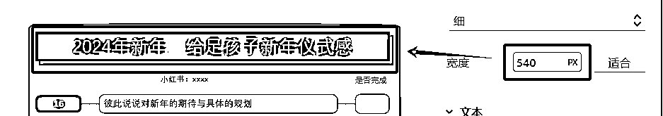
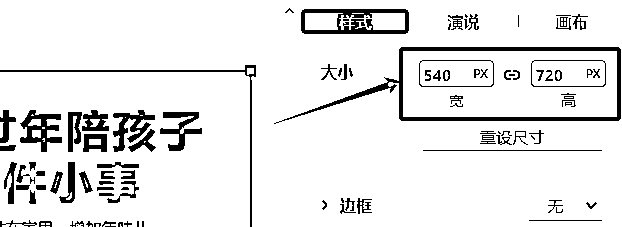
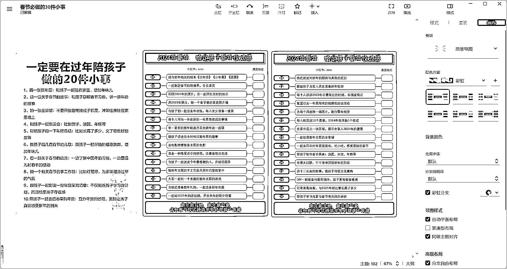
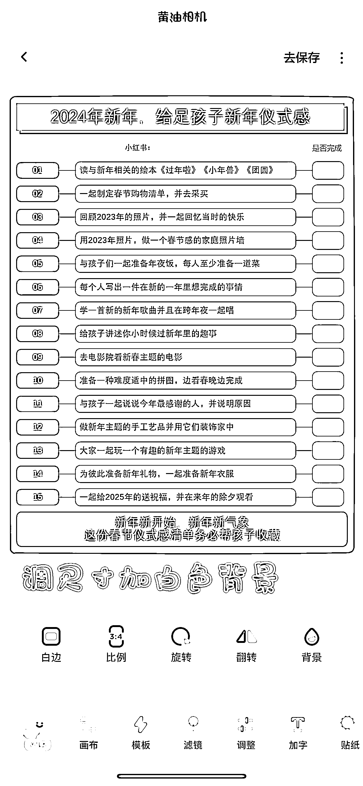
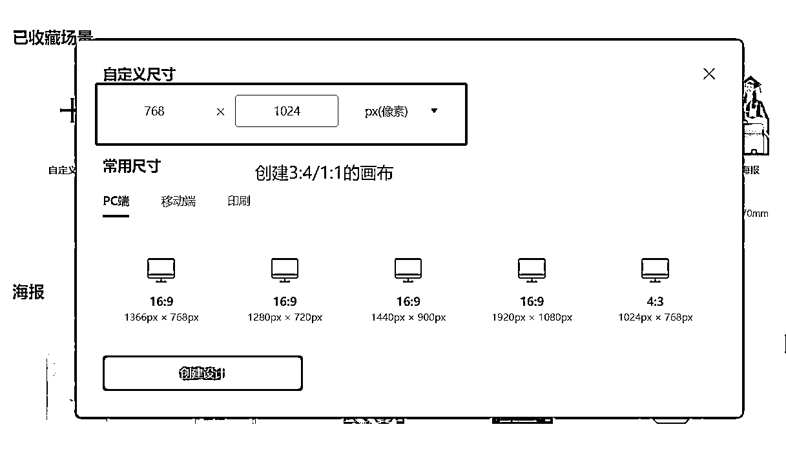
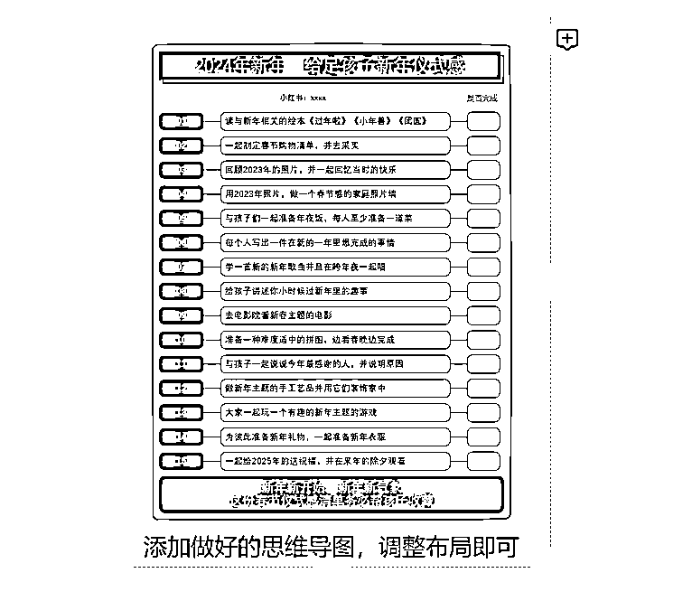
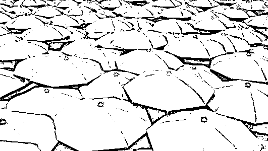

# 如何把思维导图运用到小红书运营及社群破圈中

> 原文：[`www.yuque.com/for_lazy/thfiu8/vq1ni0blgrtdiv58`](https://www.yuque.com/for_lazy/thfiu8/vq1ni0blgrtdiv58)

## (13 赞)如何把思维导图运用到小红书运营及社群破圈中

作者： 哆啦小梦

日期：2024-01-25

各位生财圈友大家好，我是这期航海【思维导图特训】船上 2 群的小梦，很荣幸收到邀请作为优秀船员给大家分享航海期间的收获。

本次航海期间收获如下：

1.  **小红书运营：**从没有遵循三个一被关小黑屋限流，到借助思维导图做图文收获赞藏 600+的笔记

2.  **在社群破圈：**从一个不在群里说话的小透明，到成功变现并获得高手的认可和曝光机会

* * *

你好呀，我是小梦，之前是 4 年的全职妈妈，现在一朝觉醒，立志在 7 年赚取 300 万 FIRE 资金。

我今天分享的主题是**如何把思维导图运用到小红书运营及社群破圈中**

### 一：思维导图在小红书笔记中的应用

本次航海我是这里的船员，也是小红书运营的志愿者。航海前因为没有遵循三个一小红书被限流，不断折腾 2 个月无果。

直到重办 2 张手机卡，也不知道效果如何，但是等肯定没有结果，我就跟着小红书航海不停的发笔记测试。

在模仿爆款笔记中，使用梨云老师高手领航中介绍的方法制作封面。至于内页，则使用了竖版导图呈现。在作图中总结了 3 点经验与你共享：

#### **1、确定小红书笔记图片尺寸，是 1:1 还是 3:4**

按照自己以往的图文笔记风格或者是参考对标笔记的尺寸即可

#### **2、确定尺寸后在思维导图中插入一个同尺寸的图**

这个是在罗卜老师高手领航中学习的，方便确定导图的布局，让最终做好的图尺寸不会偏差太大

这里有个小技巧分享给大家：竖版导图为了让用户在手机观看时有更好的体验感，**最长的主题宽度也就是标题的宽度建议在 500-700px。**

确定好导图的宽度后，可以**把参考图的宽度设为一样的数值**，可以根据参考图的大小确定一张思维导图要放多少内容，避免做好之后才发现不合适需要二次返工。

参考图与竖版导图的大小对比

#### **3、使用其他软件给图片加背景同时调整尺寸**

做好的竖版导图截图保存后并不是严格的 1:1 或者 3:4，可以借助黄油相机/稿定设计等软件给图片加背景，同时调整想要的图片尺寸

1.  **黄油相机**

1.  **创客贴**

走完这些步骤，你就获得了一组符合小红书笔记图片尺寸的竖版导图，完美规避因为导图尺寸不统一而让用户的体验感下降。

### 二：如何借助思维导图破圈成交

想要在别人的付费社群引流的前提，一定是**为这个社群提供价值反哺群主**之后的动作，而不是上来咔咔加人。

否则轻则退费踢出，重则你在这个圈子里的口碑也没了。羽毛多重要，群里的大佬都知道，刚起步我的就不在关公面前耍大刀啦。

如何反哺，去中心化是很好的选择。如何去中心化？那就：**人无我有，人有我优！**

竖屏导图的普及度不高，而且罗卜老师是怎么被生财看到，被雪姨看到的？因为竖屏思维导图~

所以**我们不能只学习如何做图，还要学习破圈思路。**比如拆解风向标、热门项目，做成思维导图，分享出去。从有利于发圈宣传的角度出发，比如制作航海高手分享回放的拆解，分享给大家。

我按照这个思路进行分享的第一张图，给我带来第一笔成交。隔天发出的第二张图，被高手认可，分享到朋友圈带来曝光。

到这里，刚 2 张图就已经被看见被发现被记住。接下来，就是把正确的事情重复做，以换取确定性结果。

### 三：最后的话

竖版导图的运用还是小范围的，我们完全可以借助它的特点来为自己的每一件事赋能，包括小熊老师也在高手领航也中介绍过，导图真的可以贯穿我们的一生。

我是小梦，一位正在觉醒的全职妈妈。分享中如果有没介绍清楚的地方，欢迎随时互动沟通~

#航海实战#

* * *

评论区：

廿七 : 看你的文章好后，让我惆怅的脑子瞬间有了灵感，你太棒了，点赞👍
哆啦小梦 : 那可太好啦，一起生财有术

* * *