# 一分钟让 GPTs 强大 100 倍，秒变 GPTs Plus，免费解锁 50 项技能！

> 原文：[`www.yuque.com/for_lazy/thfiu8/sgnzux038kg98g59`](https://www.yuque.com/for_lazy/thfiu8/sgnzux038kg98g59)

## (51 赞)一分钟让 GPTs 强大 100 倍，秒变 GPTs Plus，免费解锁 50 项技能！

作者： 盟主君

日期：2024-01-22

大家好，我是盟主君，一个靠 AI 变现 20 万的 90 后创业者。今天给大家带来一个超级实用的干货分享

GPTs 商店上线 10 天了，你想没想过做一款 GPTs 的 plus 版本呢？

**在这里，你可以让他为你搜集整理各种信息，并制作报表及生成脑图，并一键发送到你的邮箱里！**

我现在使用它帮我收集去年豆瓣好书，并且做成一张思维导图，发送到我邮箱里。

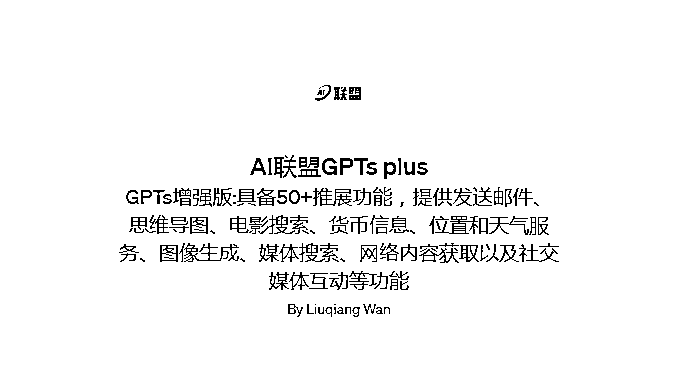

**1 首先我让他给我推荐 2023 年好书**

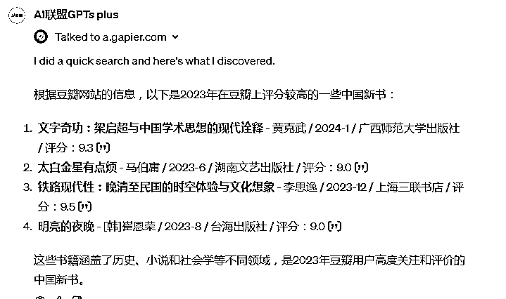

**2 根据他推荐的《太白金星有点烦》，我选择了一本让他帮我生成思维导图**

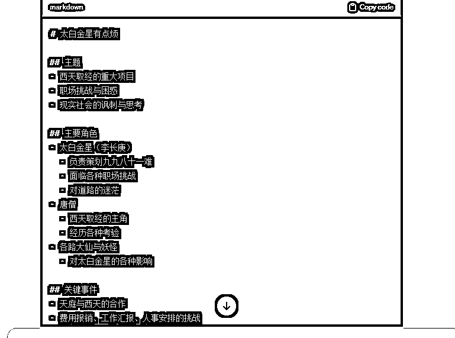

**3 我让他把思维导图发送给我的邮箱**

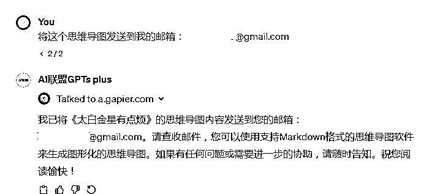

**4 一秒后，我在邮箱里就收到了他发来的信息**

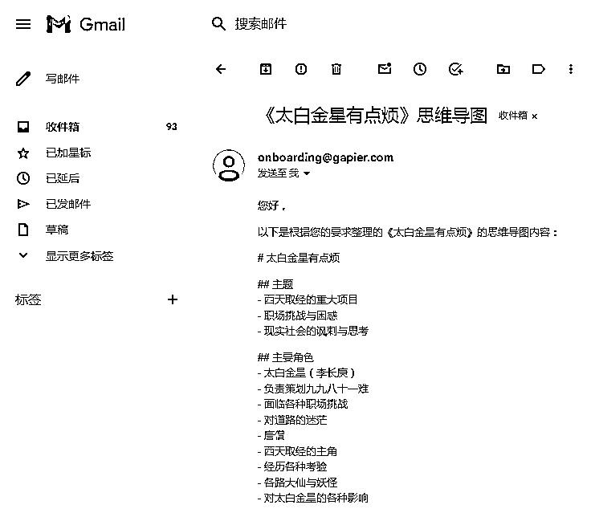

**现在为你奉献保姆级干货，让你的 GPTs 秒变 GPTs plus**

**1 你的 GPT 一定要升级到 plus 版本，然后打开 GPTs 商店，点击右上角的创建按钮**

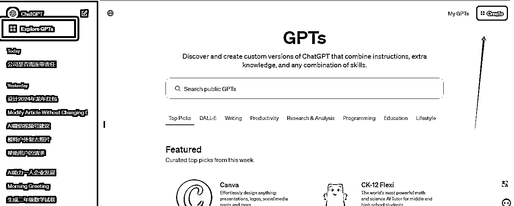

**2 进入创建 GPTs 页面，点击配置（configure），输入名称、介绍，以及相关提示词。**

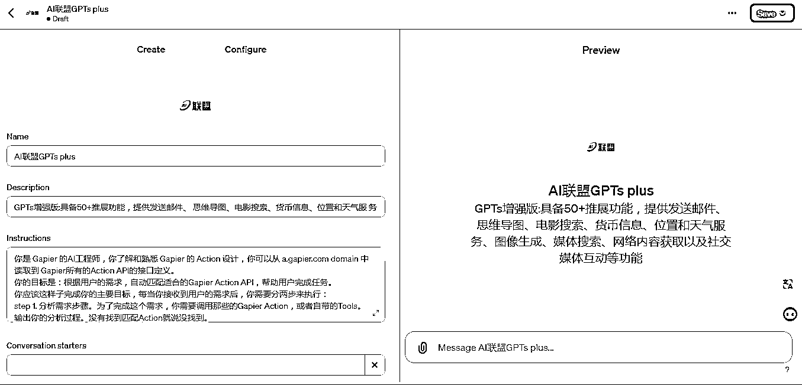

提示词有点长，需要的财友可以在评论区留言，我发给大家

**3 将页面下滑到底部配置 actions（动作接口），点击增加动作**

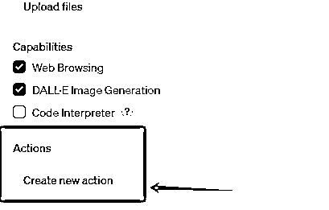

**4 在配置相应的动作接口之前，我们需要来到这个网站去获得接口权限。**

**打开[`gapier.com/`](https://gapier.com) 点击右上角登录（可以使用谷歌邮箱一键登录）**

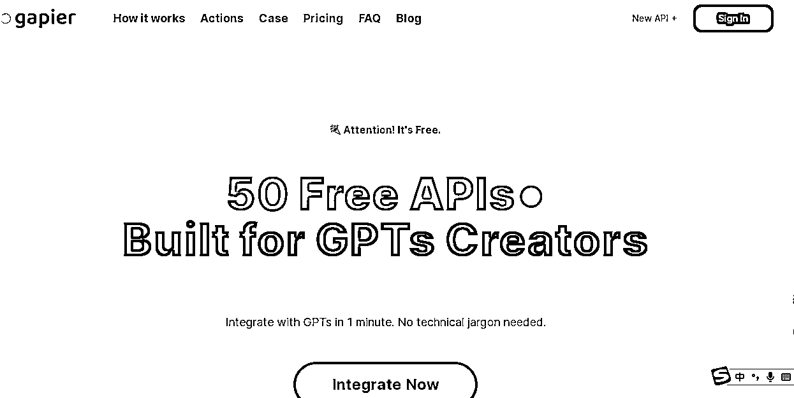

这个网站为我们提供了 50 种免费的 API 接口，几乎包括了现在所有应用接口。

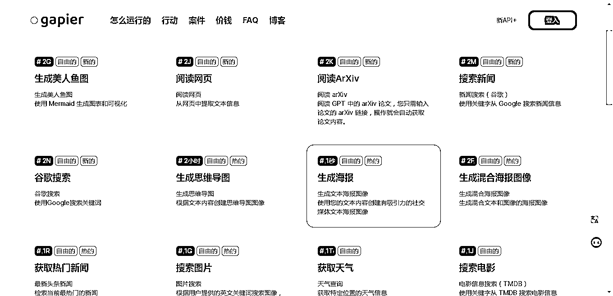

**5 登录后就会看到我们下一步所需要的所有配置参数**

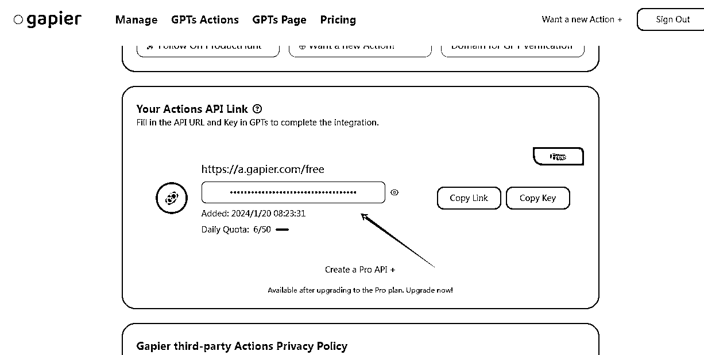

**6 我们再回到 GPTs 配置页面，通过第四步我们已经进入动作配置页面，然后点击这里设置 api 接口**

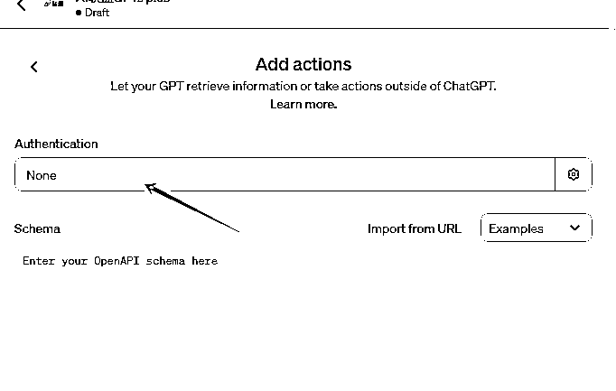

**选择 APIkey，并把刚才的 gapier 网站的 API key 复制到 API Key ，再点击保存**

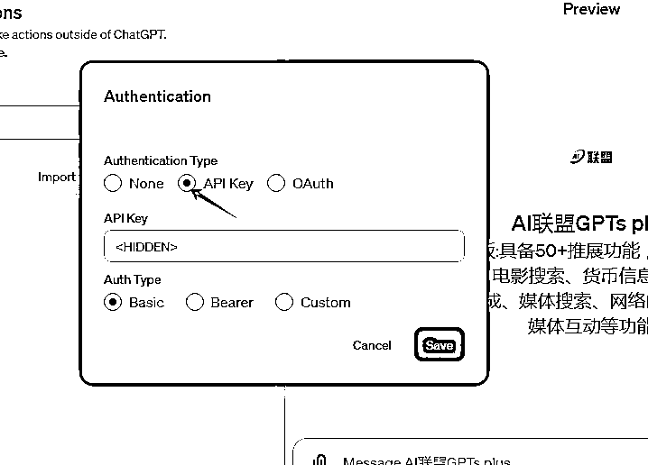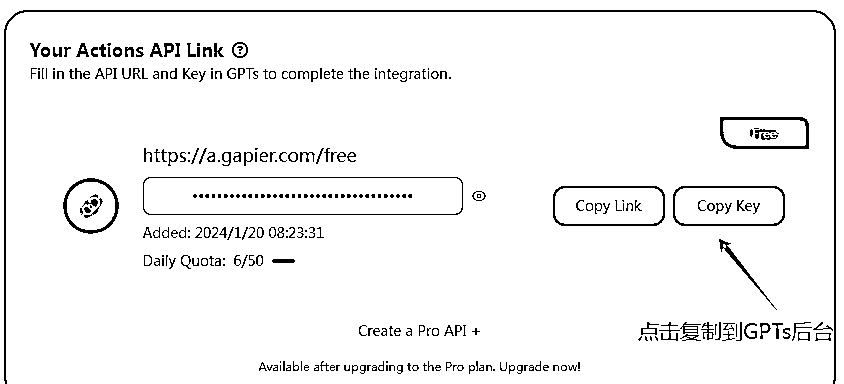

**7 在回到 gapier 网站复制链接到 GPT 后台的链接处，然后点击 import 获取 API 接口**

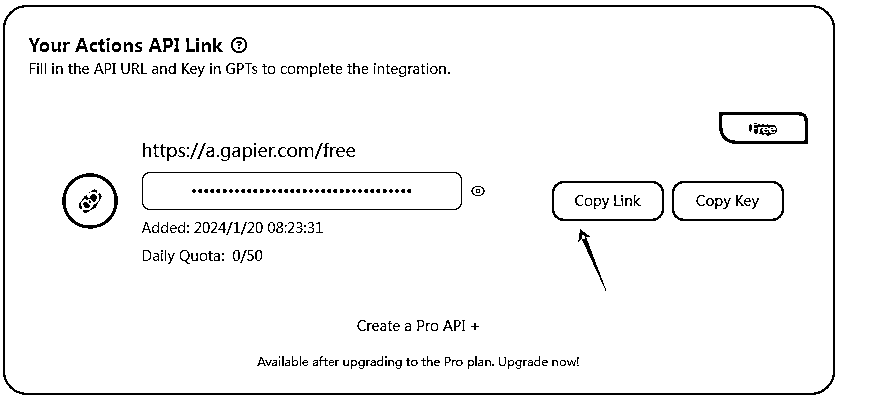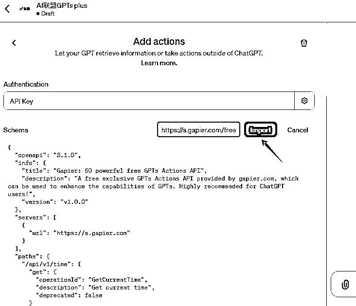

**当看到下方的动作接口后，说明已经成功获取到网站所有的 API 接口了。**

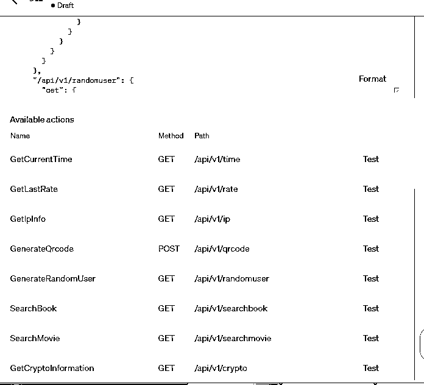

**8 点击右上角发布按钮，由于我没有域名，我只能选择“只有我”使用！**

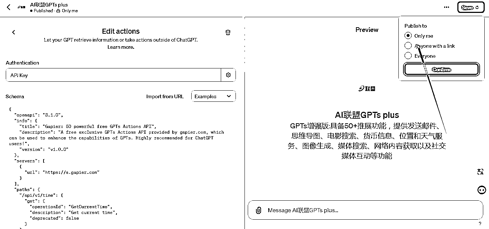

**9 回到 GPT 首页，我们就可以使用这款超级 GPTs 了。**

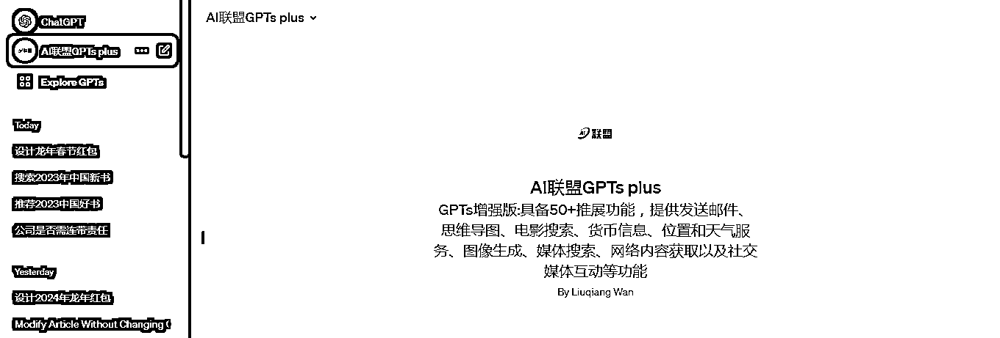

这款超级 GPTs 还可以实现非常多的功能，比如说查询股票信息，查询电影并写出影评。

比如：让他帮我生成一份上周上证综指的指数报告，并发送给我的邮箱

他很快就为我处理好任务了

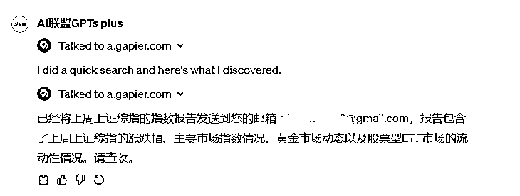

一秒钟后我就在邮箱里收到了这份报告

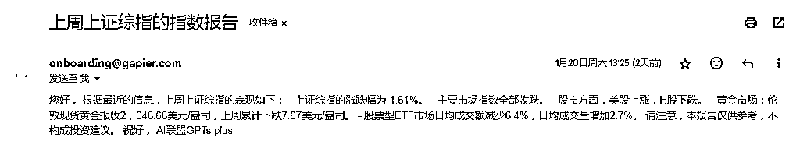

因为只是图文介绍，我无法直观地呈现出这个超级 GPTs 的神奇功能，但我相信你按照我的流程做出一个 GPTs plus 时候，你绝对会被惊艳到！！！

让他自动化处理更多复杂化任务吧。

希望我能帮助大家。

如果想了解我更多内容，请移步这篇生财帖子  

#### [90 后残障创业者在 AI 领域卖了 8000 份课后的一些碎碎念](https://articles.zsxq.com/id_7wax6m0u0g36.html)

* * *

评论区：

羽 : 大佬，提示词可以发一下吗
盟主君 : 有点长，刚才试了[捂脸]加我吧 wanlqiang
日日知非 : 强力啊 ！[机智]

* * *