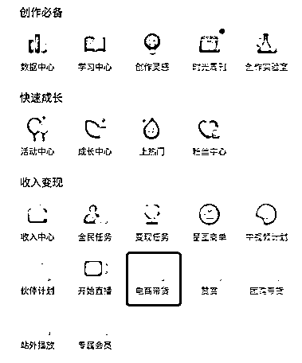
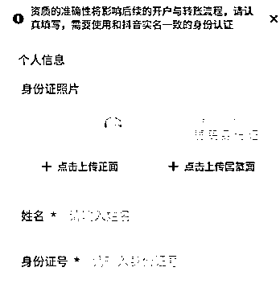
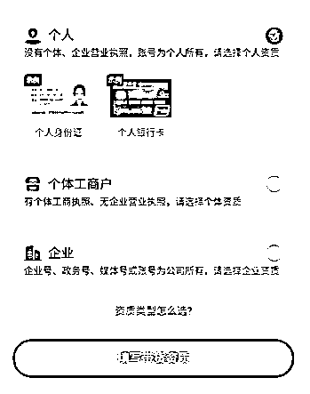
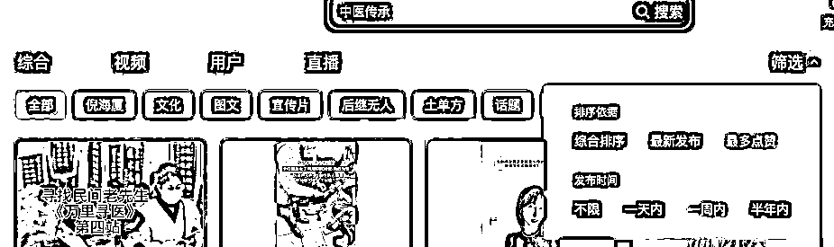
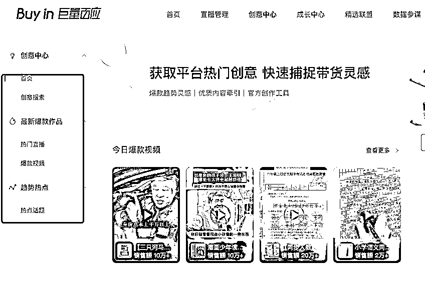
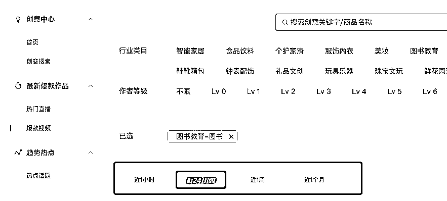
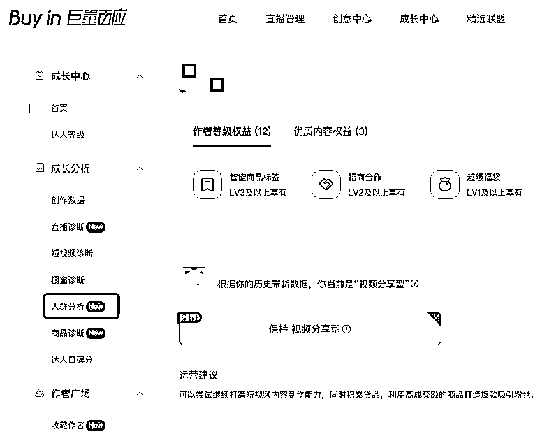
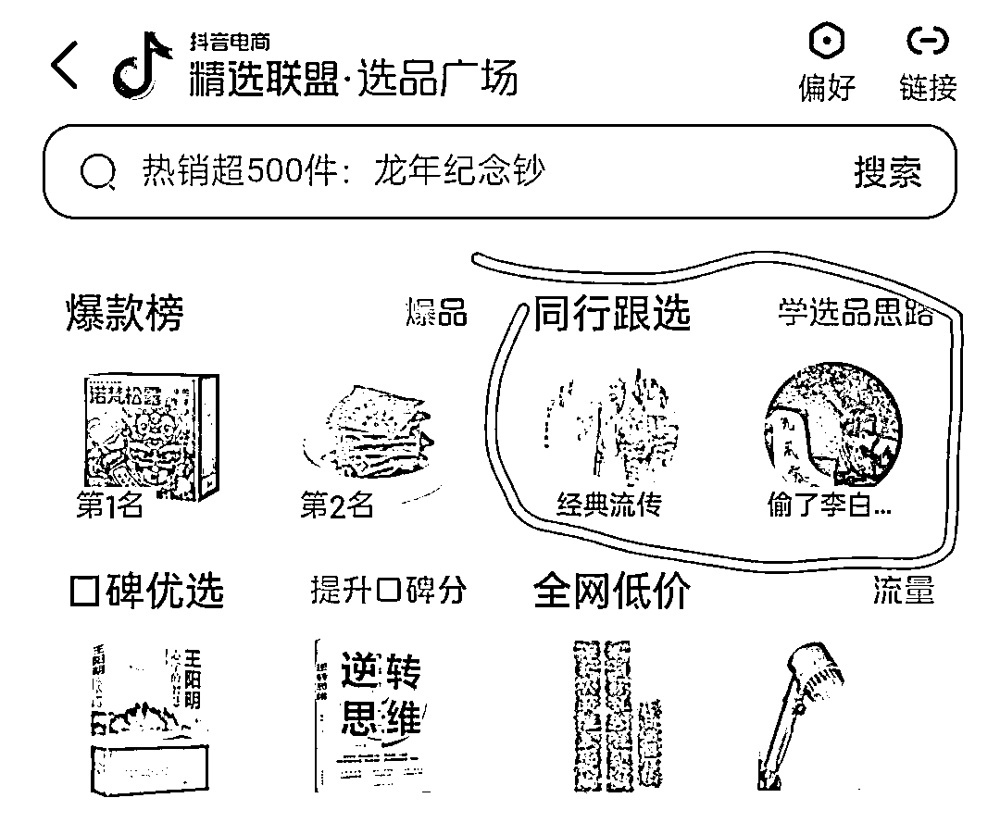

# 做一年中老年带货的思考与总结

> 原文：[`www.yuque.com/for_lazy/thfiu8/ml9ytpoigsw1vtdp`](https://www.yuque.com/for_lazy/thfiu8/ml9ytpoigsw1vtdp)

## (42 赞)做一年中老年带货的思考与总结

作者： 小马哥 xy50

日期：2024-01-22

大家好，我是小马哥。

从去年开始做中老年短视频带货项目，这个项目也可以称为中老年养生带货、银发养生带货等等名称。

核心就是人群、产品、变现形式，针对的便是中老年人群，养生品，采用短视频带货的形式来进行变现。

这个就是这个项目的三个核心点：围绕中老年人群所衍生的养生方面的需求进行短视频带货。

从去年开始一直是围绕抖音平台来展开，不过近期视频号也比较火，两个平台重点人群也是中老年的人群。

但实际操作中其实两个人群还是会有一些需求差异点的，比如我们目前以图书为主，这类的品则是中年人会购买的多，毕竟现在养生还不迟，可以去学习中医中的内容，以及一些养生类的内容；而老年人则是有各类的细分需求，根据自己的账号来进行带货即可。

整个项目其实简单逻辑就是先把中老年人通过内容吸引过来，然后进行持续带货，循环下去即可。整体流程会分为几个部分：起号开通橱窗功能、发布带货视频并带货，持续发布吸引中老年的内容。

这个就是一个基本的一个流程，但细分则涉及到起号流量内容选择、开通带货权限、持续性的挖掘可借鉴的内容模板（区分流量内容与带货内容）、测品、持续选品。

总之做带货项目就是不断的测品不断的发布新的带货视频、流量视频。

**橱窗开通**

在做中老年养生带货项目前期需要准备哪些：

抖音类的：

1、准备手机号 2-5 个，注册抖音账号 2-5 个，抖音账号前期可以先不用实名，虽然现在可以 0 粉开橱窗，不过只能引导去橱窗下单，转化率比较低，可以前期进行注册账号后不实名，千粉后再实名进行开通橱窗。

2、开通橱窗需要千粉，这个即可以通过内容来进行涨粉又可以借助一些方式来直接涨粉。

内容涨粉则需要去寻找一些优质的对标内容，去进行模仿；而借助一些方式就是各种方式进行涨粉。

有免费也有付费的，根据自己的情况来走

3、千粉满足后，开通橱窗带货功能：

操作步骤：

打开抖音后，点击我的-右上角有三个横-选择【抖音创作者中心】-在账号数据下面有个全部，点击打开-其中【变现】中有【电商带货】

点开后跟着来进行操作，会让进行绑定银行卡、实名等内容，绑定银行卡、支付宝、微信等是为了后期结算的时候进行打款，实名则是账号与身份证进行绑定，从而与收款进行一一匹配

带货根据自己的情况来选择是个人或者个体、或者企业来进行开通，每个开通背后的财务逻辑是不一样的，企业就是对公的逻辑。个体则是对私的逻辑。

而围绕账号的搭建，比如名字头像，以及简介这类的，其实可以搜索下同行，后期调整也可以，不是特别重要的，前期营销内容（也就是广告类的，比如头像、简介、封面）相对弱一些即可。

视频号：

视频号与抖音的区别在账号体系上相对来说有一点复杂

需要首先有微信号，而微信号则需要进行养，这个对账号、网络环境、以及本身手机号方面，日常操作会有一些要求。

手机号一般是可以通过几个方式来进行解决的，一个是自己去办不同的运营商的手机号，最好是把消费额度降低。另外就是办理主副卡，不过这个依然需要占用实名名额，只不过是因为缴费的原因，副卡走了主卡的消费了。尽量不要注册一些不相关的卡，去正规渠道来进行办卡。

视频号的第一步就是要有微信号，通过微信号来开通视频号，实名认证后便是开通视频号橱窗，因为政策变动比较大。

之前一个人可以开 5 个视频号 5 个视频号橱窗，现在只能 2 个，而且视频号需要满千粉或者小店账号才可以，用小店开通橱窗功能后

最近要选身份，是达人身份还是小店账号，以及店铺授权号。

店铺授权号只能售卖店铺的产品，所以这个也是一步步的来，最好我们用达人的身份来进行开通。

# 起号-我们之前是如何起号的

从去年开始操作中老年短视频带货项目，也可以说是天时地利，去年下半年的情况大家想必也懂的。

那么当时候入手这个项目，便是这种环境下人人对健康的重视，尤其是中老年人针对这块非常重视，同时有一个中西医的争论，所以我们是这么来进行起的。

去抖音或者各大平台搜索中医传承等相关的关键词，去看近期有哪些内容点赞量、互动量比较高，然后去下载素材进行模仿剪辑。

去年混剪其实还可以，以及大多数人基本都是做的混剪，混剪所主要的便是需要去重，去借助剪映的一些滤镜、以及一些相关的调整来进行去重。

下载后然后跟着同行，他们怎么剪辑我们也跟着怎么剪辑，剪辑完后如果流量 ok，那基本上都会上 w 播放的，我自己操作有上 80W，因为害怕对账号有影响，所以爆了后进行隐藏删除。

所以之前我们就是找相关话题的内容来进行起号，尤其是近期有流量类的内容，存在争议性的内容。

当然今天来看，这类的内容其实比较泛，另外就是如果对内容尺度把握不准则会存在封号的问题，很多人反馈都是这类的。

那么今天如何来找对应的内容进行模仿起号了？

1、继续还是之前的方法，去寻找一些相关类的内容，找一些复制性高且风险性低的内容，什么样的内容风险低了，就是不提功效类的

关键词：中医传承、传承文化 这类的关键词除了日常借助这类的来收集之外，还可以逐步拓展，也是一个拓词的过程，去看同行带的话题词，去看一些 seo 类的内容中围绕这类的话题词，总之随时在整理汇总中，逐步聚焦至一个点上。

2、抖音创作者平台[`creator.douyin.com/creator-micro/home`](https://creator.douyin.com/creator-micro/home)

猜你喜欢中的一些内容具有参考性

3、就是刷我们父母的账号，他们日常看的一些内容，其实是我们创意的来源，有很多的内容其实很简单，但是就是天然吸引中老年进行互动

起号的目的其实就是将账号内容人群相对定下来，有人看有人互动有人关注，然后一段时间内涨粉至千粉，去进行带货。

起号内容的选择尽量与后期的品结合起来，比如围绕中医那就做中医相关的起号内容，想做健身就做相关的，总之中老年养生带货还很多。书籍、百货、食品都可以。

选中人群，做对应的内容，然后带对应的品。

如何看一些品，一些内容，可以看看抖音商品橱窗中的创意中心，这里面既可以是我们选品的方向，也可以是我们内容对标的方向。

总之起号只是开始，比如你已经满千粉了，这起号就是帮你奠定前期的内容基础，让账号人群推流更精准一些。

如果你刚刚开始，那么起号就是一方面让你对内容有一些感知，锻炼寻找同行、人群类的内容，以及锻炼剪辑能力。

# 流量内容与带货内容

我们起号一般是围绕流量内容来做文章，而带货则是需要用带货内容来进行做文章。初次听是不是感觉比较懵圈。

我来说下流量内容与带货内容的区别，从字面意思来说就是我们的内容的目的是什么，是为了拉流量还是为了进行变现，这个就是内容本质的区别。

内容区分了自然我们在找内容的过程中，便能清楚的了解一条内容的目的是什么，比如我们经常在巨量百应的创意素材中看到的内容基本是带货内容。

另外说下两者的关系，流量内容你可以单独做流量内容，又可以做带货内容的。我们往往看一个剧情的时候，会经常刷到一些中间插广告的玩法，这个就是流量内容+带货内容的结合。

先用流量内容将你吸引进来，然后后面猝不及防的广告。当然还有一种本身就是广告，但可以做流量内容来进行使用，比如一些访谈类的内容。

总之内容的玩法千变万化，我们可以先从基础的开始，去将内容从目的性方面来进行拆解，从而更好的借鉴。

流量内容我们去剪辑的过程中是看其观点，冲突性，以及对用户的有用性。点赞评论收藏这些都是用户对内容的反馈。一条内容有争议性一般都是评论区会讨论居多，而一条内容有用一般是点赞量或者收藏量会居多。

所以我们去找内容就可以根据这个来进行简单分析，来去思考自己是否可以模仿。

而带货内容则有一些结构，这个就需要不断的进行模仿，比如一些书可以直接直白的进行推荐，而有些则是进行讲故事，去讲书中的内容，从而吸引停留，继而完成后期的带货接入与转化。

高明的内容，其实就是有 IP 背书的内容，这类的内容既可以做流量内容，还可以做带货内容。

所以好的产品其实就是有内容的产品，这个内容就是有 IP 进行背书。

比如额尔古纳河虽然很多人吐槽也不怎么好看，但架不住董宇辉去讲解，这类的讲解本身就是对书的内容的加持。

所以我常常看到很多人借助一些名人来去分享一些书籍，或者去分享好物的逻辑就在于这个，天然具有内容的高度，会比自己写要好很多，因为这个就是背书的加持，有内容的产品。

接下来我说下如何去进行拆解一些内容，从而去模仿学习快速的提升我们对内容的感知度。

# 如何进行内容拆解

前面说了流量内容与带货内容，无论如何，我们做电商带货或者其他短视频，所有的逻辑都是借助内容来撬动平台的流量。

虽说内容很难，但一旦对群体的喜好了解后，借助内容还是很好撬动流量的。作为屌丝唯有深耕内容才能更好的撬动平台，让自己获得收益。

如何对内容拆解，拿简单的流量视频来说，其实很简单，我们把一个内容的视频画面、文字、文案标题、音乐等来进行拆解，如果想更多的拆解可以把评论区，以及整体账号的内容方向带上。

拆解的过程中有时候不需要用手记录下来，更重要的是用脑来进行拆解，看到一个画面你就明白他这个视频是如何剪辑的，需要哪些素材，素材与素材之间是如何衔接的。以及视频的核心点是哪个，一层层的来进行分析。

而在分析内容前，其实就是首先要会剪辑，唯有会剪辑你才能把一个视频模仿出来。

刚开始模仿就是直接把视频下载至本地，用剪映来打开，然后拖动到轨道上，将视频与音频进行分离，然后对镜头进行拆解，虽然现在有智能镜头分割功能，但是初期手工来剪辑会比较好一些。

然后内容方面就需要进行调整了，比如背景调整，比如画中画进行调整，总之把视频拖到剪映拆解的目的是重新复制出新的视频，而且还要考虑到去重的情况。我们不能一比一来进行模仿，要做到就是给到一个视频，我们在一部分改变的情况下，重新生成一个新的视频。

模仿+改造，来去调整文字、里面的片段元素等等方面的内容。

用模仿来去锻炼剪辑能力，用改造来锻炼素材收集能力，用剪映来提升素材改造能力。

总之同行就是我们的老师，用同行的素材来进行学习，形成自己的视频内容。然后发布去进行检验。

流量视频核心需要注重于视频背后的内容，而带货内容则需要注重流量内容与带货内容的衔接（文字衔接、视频衔接等等）

总之就是不断的模仿+改造，同时经常性的刷抖音来锻炼自己对内容的感知能力，某些内容你一看就知道这个内容我是可以模仿的，甚至在刷的过程中你就在思考，这个内容哪些地方我可以借用，或者我该如何进行调整，形成我自己的内容。

总之在内容拆解中学习。

当然也可以拆解的更细一些，有一些表格他们甚至把视频中的架构拆解出来，比如第几秒的内容，他们的目的是什么，尤其是涉及剧情类的内容，将镜头语言与文字、产品都一一对比起来。

对于我们来书这种拆解比较细的上手还是比较难的，但是简单点的我们还是可以的，这个视频用了几个镜头，哪些是画中画，这个视频是如何做出来的，我要做怎么去做，这样的方式来进行思考。

当量多了之后，你也知道如何剪辑，那剪辑背后的内容自然会有一些自己的想法，于是开始去剪辑自己的作品。

我目前一般是先写脚本，然后再用脚本中的内容去匹配一些素材，来进行剪辑从而形成自己的视频内容。

平常也可以多看看一些优质的视频，尤其是一些手作类的，他们的衔接基本用自然或者动物来进行衔接（也可以理解成空镜头），我观察到这个点后发现国外的一些视频与这类有着异曲同工之妙。

可以说优秀的作品也是混剪来完成的，他们是如何衔接的，这个就是我们需要学习的地方。

# 选品，变现重中之重

之前提到了内容拆解，当我们对内容掌握之后，就需要根据人群的需求来进行选品。

选品的方式有很多，我简单说下：

1、看巨量百应，你根据自己想要做的方向，先对品了解下，比如近期主要出货的是什么品，比如最近过年，过年类的的确是一个品的方向。

2、刷抖音，借助抖音的推荐算法来去找自己感兴趣的内容，前提是先把自己的号刷成你内容兴趣的方向，这个方式也很简单，就是多搜关键词，最好用小号来进行操作。一方面这个方式可以让你了解更多的内容，另外一方面就是会有一些品出现。

3、看同行直播间，同行直播间的一些品，我们是可以借鉴的，这类的品我们接触久了后就可以根据自己的兴趣来进行选择。

4、看手机端的电商橱窗中的选品广场的推荐，以及有一些同行的选品。

这个只是一部分选品，总之就是大量去看后台的数据、大量刷视频看近期的品，以及优秀的同行数据。

从去年开始一直到现在操作，我基本每天的动作就是去看巨量百应的创意，不断的对内容与产品进行学习。

下载优秀的同行内容创意，去看他们是如何将流量内容与产品融合起来的，总之通过大量的学习，你会对内容越来越掌握可以。

这里给各位推荐一下下载类的技巧，如果你对网页代码比较熟悉，那么你可以直接 f12，检查找到对应的链接地址进行下载；如果不懂可以直接安装猫爪这类的插件进行下载。

前面提到流量内容与变现内容的区别，就是你中有我，我中有你，经常去看巨量创意就会越发的发现这一点的情况。

总之每天要做的工作就是：选品-剪辑-发作品，此外相关的就是选品、找商家沟通，要佣金政策、要素材，要样品。

总之要经常与商家沟通，勇敢要样品，要政策。

选到品，然后有同行的内容参考，自己来跟着操作学习，然后去拍摄，剪辑，发布作品。

人群方面可以参考创作者中心的数据中心（[`creator.douyin.com/creator-micro/home`](https://creator.douyin.com/creator-micro/home)）

手机端可以在我-三条横杆-抖音创作者中心-账号数据详情-粉丝数据 中查看

巨量百应的数据会相对准一些，会有一些带货方面的人群数据参考

最近发现手机端的选品广场中，有个同行跟选，这个地方既可以发现同行，去进行查看其内容，又可以看其品，同时品对应的内容是如何做的也可以看到。

总之在算法的加持下，同行都无所遁形。

# 中老年人群账号方向分享

之前提到我们是做中老年人群的带货账号，一开始我们是围绕中老年的养生方面的需求，会去做一些中医类的书籍，或者养生类的汤包，以及在去年的演变过程中，一部分会去操作 fs、地理、相术类的书籍。

其实在发展的过程中我们会发现一些比较稳健类的方向：

1、纯中医类的书籍，每天去分享推荐的书籍

2、古中医类的书籍，这类主要是需要引流至抖音来进行，类似于虚拟资源一样。去分享各类的之前的旧版书籍。或者一些 pdf 类的资源

3、中老年健身，每天去分享一些健身动作，比如围绕某一个部位，肩颈啊，或者手部等等类的

4、一些稍微不怎么明显的方式的中医小知识

当然如果更衍生的话，其实围绕某一些点都是可以去进行操作的，尤其兴趣类的会更广。

不过由于中医这类的相对来说会受限，所以尽量去做一些稳健类的业务。

目前带货也有另外的一种玩法，就是做私域，去帮一些商家去进行引流到私域，然后按 cps 进行结算。

这个方式可以借助短视频或者直播来进行操作。如果流量精准这个是可以起一个盘子来进行操作的。

卖书送课程便是这个逻辑。有些商家会把书的价格拉的很低，然后分佣在 50%，那么你就要看他有没有去夹带引流卡片了。所以有时候商家赚钱并不在于给与分佣与成本的差价，而在于后端的高客端价。

如果你想搞一个方向，其实这个是一个很好的方向，借助引流来去做一成沉淀，再去引流去私域做二次沉淀。

当然围绕中医的方向其实还有很多，比如会有一些账号做的比较高端，类似于彭南科这类的文化账号，去将中医药方的过程步骤用视频展现出来，而不去刻意去重点提及药效。

或者去讲解草木类的内容，经常刷抖音会记住一句话：多识草木，少看人心。这类的账号便是去讲解草木类的内容。

还有便是拿一个品来进行操作，比如围绕艾草类的产品等等，总之其实方向还是很多的，随着接触的深入，融合的深入，基本上都有垂类的。

然后围绕一个垂类反复的去做，抖音还是适合做垂类的，因为垂类越垂，人群越精准，然后后期转化率越高。

至于内容形式，是口播还是混剪，后期就看是否需要做 IP，那么你需要了解的就是口播拍摄方式，布景如何打造，如何打灯等等类的内容。

都是一个由浅入深的过程，当然越专业越不能丢失原始，自己是如何崛起的，这份最初吸引人的，也就是整体账号的基调。

其他相关的内容：

[2023 年短视频带货：做带货就是专注于自己，做好自己的事情](https://articles.zsxq.com/id_gijfim1toux9.html)

[视频号直播带货需千粉，汇总一些目前的解决方案](https://wx.zsxq.com/dweb2/index/topic_detail/811458224411812)

[巨量百应类的操作细节](https://wx.zsxq.com/dweb2/index/topic_detail/814445425244522)

* * *

评论区：

暂无评论

* * *