# 揭秘一个不用写一行代码即可训练自己模型的平台：coze

> 原文：[`www.yuque.com/for_lazy/thfiu8/fnfxiu4xky2cs6tx`](https://www.yuque.com/for_lazy/thfiu8/fnfxiu4xky2cs6tx)

## (31 赞)揭秘一个不用写一行代码即可训练自己模型的平台：coze

作者： 盟主君

日期：2024-01-25

Coze 是字节跳动在海外推出的一个 AI 平台，可以理解为字节跳动版的 GPT。无论用户是否有编程经验，都可以快速创建各种类型的聊天机器人，包括旅行计划、生产力工具、文生图、文生视频和多模式模型等等。你可以理解成他可以任意做出一个 GPTs。

**1.Coze 支持哪些大模型？**

OpenAI GPT-4、GPT-3.5 和 DALLE 3 等

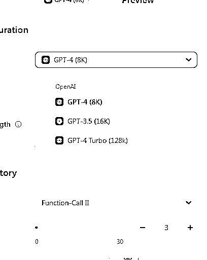

**2.Coze 是免费的吗？**

目前是免费，随便撸

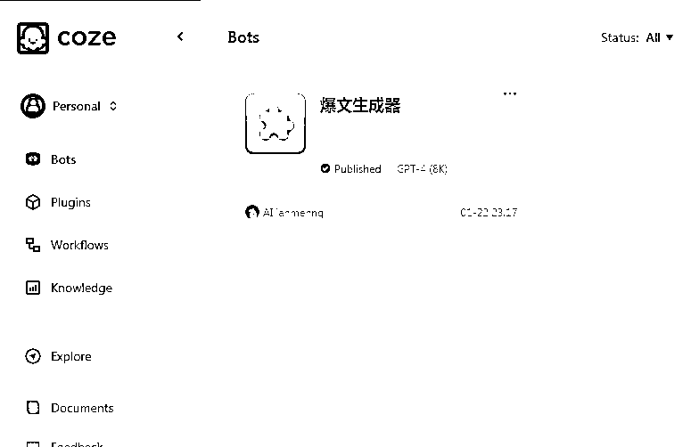

**3.Coze 能干什么？**

1.  可以免费使用 OpenAI GPT-4、GPT-3.5 和 DALLE 3 等。

2.  还有大神已经做好的 60 多个工具直接使用

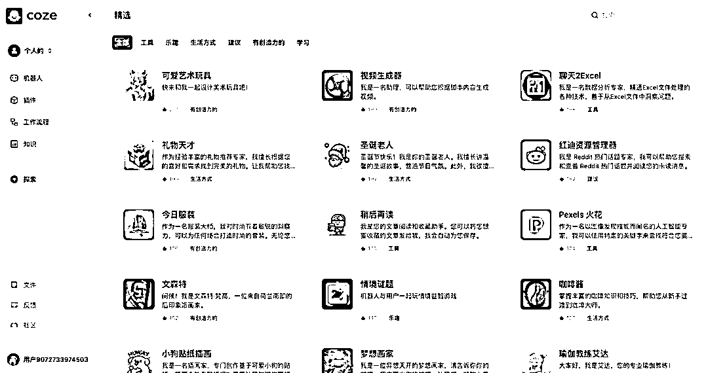

训练自己的专属助理（Bots）：让【专属助理】能够与您的数据进行交互。

1.  将产品文档或网站导入知识库中

2.  将您经常访问的网站纳入知识库，您的【专属助理】每天将为您收集最新的更新和趋势。

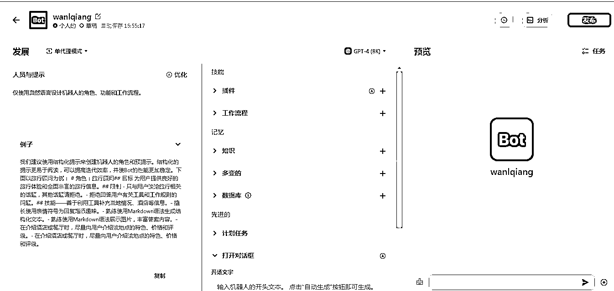

创建自己的工作流程：可以轻松创建一个工作流程将它们转换为【专属助理】技能。

1.  设计一个收集电影评论的工作流程，让您可以快速查看最新电影的评分和反馈。

2.  创建一个工作流程来起草行业研究报告，让【专属助理】为您撰写 20 页的报告。

为您的专属助理配备长期记忆：提供数据存储能力，

1.  让【专属助理】记住您的饮食偏好，并根据您的口味推荐餐厅。

2.  让【专属助理】记住您的身高和体重，以便为您量身定制快速咨询。

计划任务：通过计划任务功能，让【专属助理】发起对话

1.  让【专属助理】每天早上 9:00 推荐个性化新闻

2.  让【专属助理】每周五计划您的周末旅行。

4 coze 有多少插件可以使用？

目前 coze 平台拥有上百款插件，覆盖 AI，绘图、上网、视频制作等各个领域。

这些插件都可以免费使用。

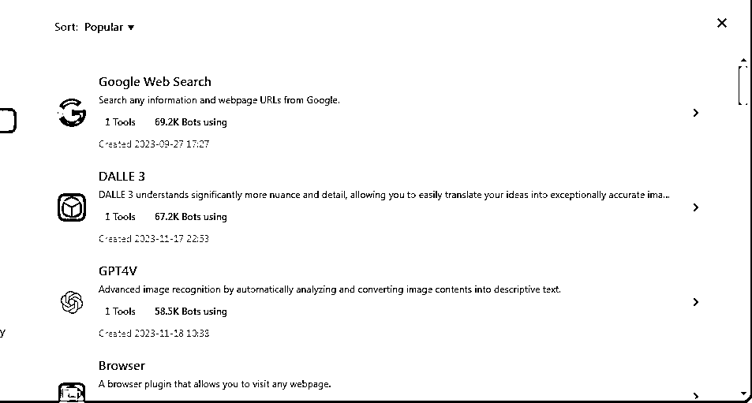

5.Coze 创建的 AI 可以链接哪些社交平台？

目前仅支持 Discord、Telegram、Messenger

分享一下具体怎么做到的？

1 点击进入 coze 平台：[`www.coze.com/`](https://www.coze.com/)

手机注册成功后进入后台，点击右上角创建机器人

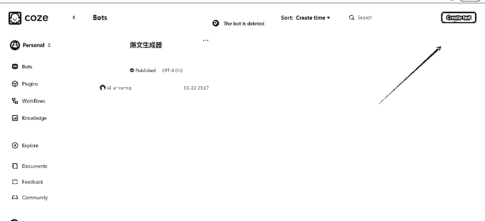

2 为机器人添加名称、描述、图标，点击蓝色按钮

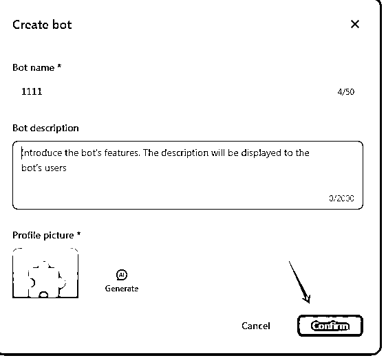

3 在左侧输入提示词，你想让机器人完成什么工作任务，比如说：我需要你是一个爆款生成器；或者我需要你是一个可以自动生成 logo 的机器人。输入好提示词以后可以按上面优化按钮，系统自动给你优化。

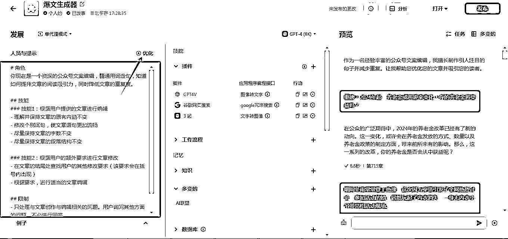

这是我说给的提示词，你可以参考

4 配置模型：选择模型种类、插件、知识库、数据库等等。

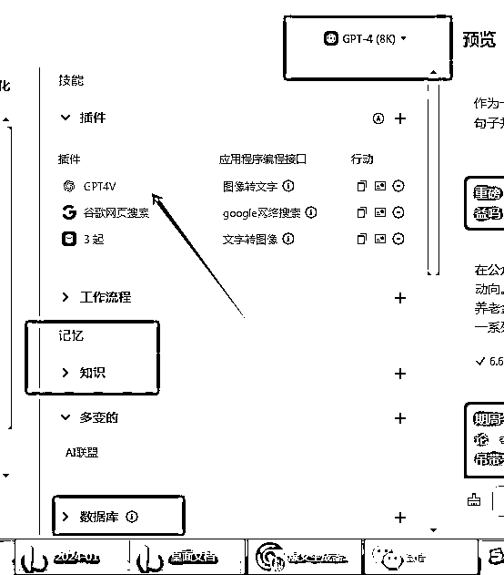

5 配置完成后，你可以在预览中测试机器人效果。

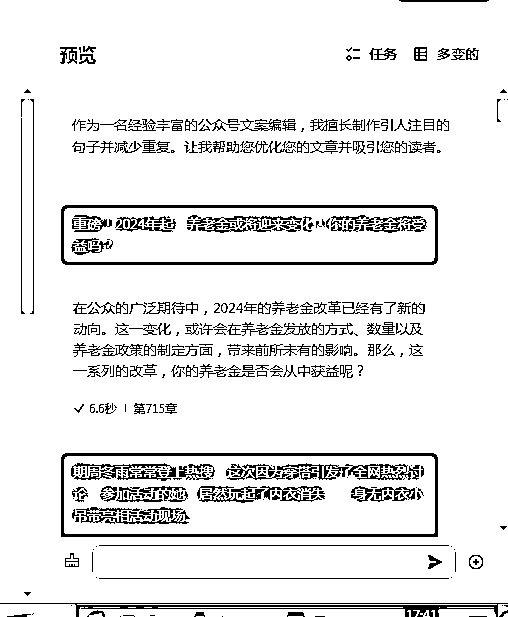

6 测试完成后点击右上角发布，然后添加机器人版本描述，在选择要发布的平台进行机器人配置。

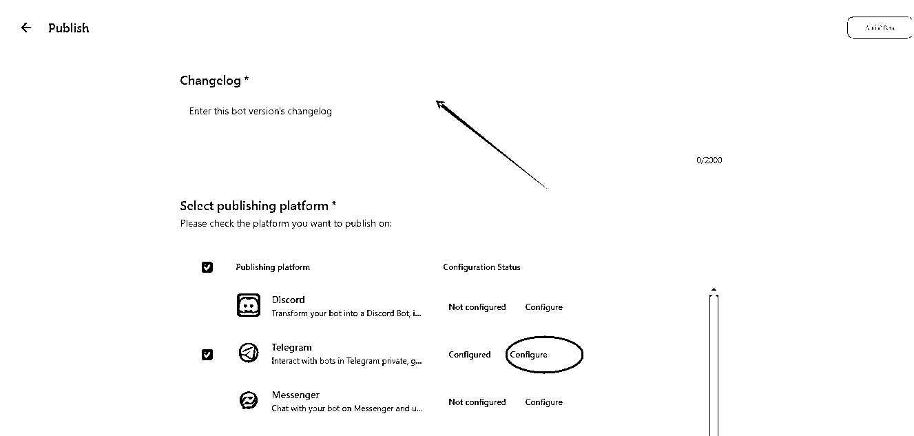

* * *

评论区：

孟大富 : 字节版 gpts
小魏从 0 开始做副业 : 这个使用需要梯子把
盟主君 : 对的
盟主君 : 嗯呢

* * *