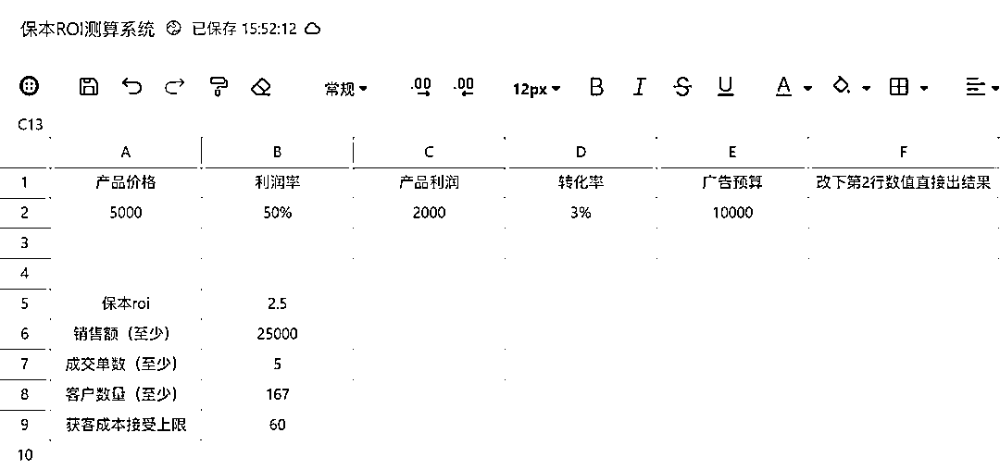
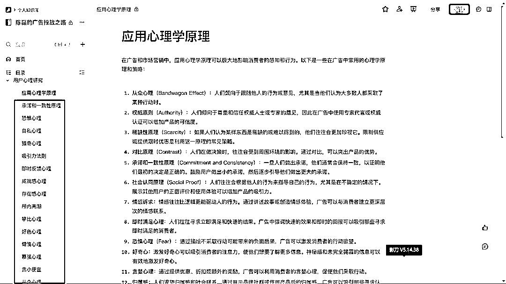

# 广告投放数据分析优化方法论！

> 原文：[`www.yuque.com/for_lazy/thfiu8/gunse9peostzf5x2`](https://www.yuque.com/for_lazy/thfiu8/gunse9peostzf5x2)

## (14 赞)广告投放数据分析优化方法论！

作者： 陈磊

日期：2024-01-23

有问题不可怕，就怕找不到问题。

投广告，但不会看数据，不知道该做些什么操作，没有一种广告优化的思维框架，可以好好读一下，这一篇的目的很简单，用底层逻辑方法论做思维框架支撑，让各位老板懂得如何调整广告。

如果你调账户没有思路，读一遍，希望能帮你找到测试方向。

ROI 测算（知己知彼）

超级转化率（定位问题）

AB 测试（解决问题）

值与不值（判断取舍）

关键指标（配合超级转化率、AB 测试、值与不值做支撑）

行为心理学（营销支撑）

**其中的超级转化率，AB 测试、值与不值是核心三板斧，使用频率最高。而 ROI 测算、关键指标、行为心理学是配合核心三板斧，为其做支撑，相互配合使用。**

**1、ROI 测算**

知己知彼，百战不殆。

投广告的目标是滚雪球，快速放大，而最难的就是雪球成团。如果投产打正后，不断放大，加大投入，快速循环即可。

对大部分老板来说，走通投放第一步非常重要，但市面上没有一家机构教这个。

陈磊邀请你共同编辑表格《保本 ROI 测算系统》

[`www.yuque.com/g/chenlei-aycaj/vn5sne/fxedx3uekbgsa9xl/collaborator/join?token=Vgli3D1WgqfwrmC6&source=doc_collaborator#`](https://www.yuque.com/g/chenlei-aycaj/vn5sne/fxedx3uekbgsa9xl/collaborator/join?source=doc_collaborator&token=Vgli3D1WgqfwrmC6)

只要修改里面的数据，会自动帮你算出保本 ROI 的数据，这个可以理解为及格线，高于这个线就及格，你就能赚钱，反之则亏钱。

**2、超级转化率**

超级转化率：曝光-点击-私信-转化，上一层到下一层都会流失掉一部分的用户，我们的转化流程越长，则可能流失掉更多的用户。因而，我们要提高超级转化率就有两个思路：一个是减少转化的步骤，一个是提高每一层的留存率。

公式：超级转化率=转化率 1*转化率 2*转化率 3*转化率 4……一条转化链路上，尽可能拆分出层级，更加细致的优化。超级转化率越高，效果越好。

可得：超级转化率=点击率*私信率*加粉率

通过超级转化率可以快速定位问题，问题找到了，再针对性解决问题。

有一个概念叫做“系统之美”，从曝光到转化，可以通过超级转化率拆分，优化各个节点，但又是一个整体，牵一发而动全身。系统之美讲的就是在一个系统中，动了其中一个因素，会连锁其他因素发生变化。

在广告上，同样是的，既要拆分找问题，又要合并看全局。

**3、AB 测试**

AB 测试，最行之有效的技术手段。需要满足 2 个条件。明确测试对象和其他条件不变。

例如：客户反馈质量有问题，通过分析全流程。假设问题条件是插件描述 ，在其他条件不变的情况下，换一条话术，给予 100 多个流量，看测试结果。结果只有好和不好，好，说明实验成功。不好，说明排除一个因素（排除法）

AB 测试的结果，一定要记录分享给团队，无论结果好还是不好，都是经验的叠加，都是团队财富。

规则是什么？规则是道。

如果你在做 AB 测试的时候，遇到平台已经明确的规则，不要和平台对着干，这个成本很高，会让你身心疲惫。

AB 测试，测的就是规则，测的是未知，未知变已知，这就是经验。

重视细节，细节决定成败。

在做 AB 测试的时候，你所选的测试对象，越细越好，这个得到的结果才是最有价值。

**4、值与不值**

这是一个价值观,也是一个衡量标准。

在我们投广告的时候，经常遇到抉择，不知道该怎么选，因为有很多都是不可逆操作。

举个例子，你有一条计划，跑量能力还可以。但你认为转化率不够高，这个时候你想调整计划，你很犹豫，不知道该不该动。

如果动，可能会更好，也可能会差，甚至会调不回已经有的结果。

如果不动，现有的结果还能接受，但想要更好的数据。

运用值与不值的概念：

尽可能收集足够多的数据，佐证自己的判断，如果一条计划，到了必须动的时候，果断动。

盘算得失，动的好处多，还是不动的好处多。这个是一个比大小的数学题，哪个好处多就选哪个即可。

在广告投放中，所有的抉择都可以用值与不值的概念，帮你做出理性的判断，不要我觉得（自我脑补），要用数据佐证判断。数据比感觉更有用，哪怕出现偏差也不会太大。

没有绝对的对与错，但要避免做错决策，这一个决策可能会让你与“成功”擦肩而过。

再举个例子，一个大部分广告主都会面临的问题。你投了 10000 块广告，流量质量可以（定义：是不是你的客户，你一聊都清楚。），成本也不错，但你的项目转化周期长，此时手里只有 2 万的预算，这个时候你投还是不投？

如果投，会面临资金压力，但会获取更多流量，增加出单的概率

如果不投，能缓解资金压力，等出投产比的时候再投，心理承受能力会更强。但不确定广告暂停一段时间，重新开启，会不会买不到已经有的成本和质量（温馨提示：已知条件，跑的好广告要一直跑下去，会越跑效果越好，暂停，控预算，修改计划等操作都会影响计划）。

运用值与不值的概念：

这个路口，你会怎么选？

这是 2 个真实的案例，我都遇到过。没有对错，无论怎么选都是对的，也都是错的。

唯一能决策的方法论就是值与不值，值就是对。

**5、关键指标**

你需要清晰知道你的转化链路上，每一个关键指标的存在价值以及影响因素，配合超级转化率、AB 测试、值与不值等方法论来使用。

拿知乎外链引流加粉链路为例子

曝光-点击-插件曝光-插件点击-落地页曝光（跳小程序）-长按识别-加粉成功。

这中间的每个节点都是关键指标。从曝光到加粉，这个是一个系统，是一个整体，相互影响（系统之美），拆分开又是独立的个体（超级转化率），而影响超级转化率的就是关键指标。

点击率*插件曝光率*插件点击率*落地页曝光率*长按率*加粉率=超级转化率。

其中点击率=点击量\曝光量

插件曝光率=插件曝光量\点击量

插件点击率=插件点击量\插件曝光量

落地页曝光率=落地页曝光量\插件点击量

长按率=长按识别量\落地页曝光量

加粉率=加粉成功量\长按识别量

这个环节中，任何一个率值过低都会影响到整体（超级转化率），我们要优化的就是其中细节。

举个例子，点击率过低，影响因素就是点击量和曝光量。继续拆分

**分析：可能影响曝光量的因素**

投广告先拿量，有量才有调整的机会，这个量就是曝光量。

**ECPM 值**

如果你使用了 OCPC、OCPM 这个的出价方式，那就考虑一个概念，那就是 ECPM 值，这个值是平台方的千次曝光收益，对平台来说，哪个广告主能给平台带来最大收益，流量就会卖给谁。

ECPM=预估点击率*预估转化率*出价

2 个用户，点击率和转化率相同，出价高的一方有量。反之也一样，出价相同，点击率相同，转化率高的有量。这个比的是综合得分，不是单一维度。

**出价**

出价越高，平台赚钱越多，你的流量自然越多，广告投放是买卖关系，并不是慈善关系，用最少的钱办最大的事，买到有性价比的流量就好。

**预算**

有时候预算没有给到，系统会不分配那么多流量给你，这个无可厚非，表示理解。

**分析：可能影响点击量的因素**

如果点击率低，但有曝光量，那问题就可以从点击量上找了

**标题**

在知乎上，标题是帮你筛选流量，也是影响因素占比最的一个。

**封面**

有封面图和没有封面图，有图，图是否醒目，可以考虑这些因素。

**描述**

描述也是第一句话，圈选的人群是否精准，有没有吸引力，知乎的描述会外显，用户没有点击就能看到。

考虑标题、封面能否承接流量，能抓到多少，定向和标题、封面是否垂直等问题。

调整账户，最难的不是解决问题，而是找到问题（调整方向），问题找到了，再去做 AB 测试解决问题就简单了。

所有的关键指标，都有影响因素，这些影响因素全部可视化，自己多预览几遍广告就会非常清楚了。这一套是底层逻辑，你可以套用在任何一个媒体，一个链路。

**6、行为心理学**

外行看热闹，内行看门道，你的广告内容中，加了多少心理学手法，让欲罢不能，还是平平无奇？

正所谓套路得人心，在制作广告的时候可以加一些行为心理学手法，可以有效提高转化率。

看我红框圈选的这些，通过字面意思很好理解，我相信每个人都能看得懂。拿去拆解你同行的优秀广告，看看应用了多少。再看看你能用多少。

在运用这些行为心理学原理的时候，结合实际情况，把握好尺寸，恰到好处，点到为止，起画龙点睛之妙。

推荐阅读，相辅相成。

[广告投放避坑指南 100 条（适用于抖音、小红书、知乎，百度等各媒体）](https://articles.zsxq.com/id_ol4ica1pm4j2.html)

* * *

评论区：

拱卒 : [强]
陈磊 : 感谢认可
冬日暖阳 : 这边是做巨量投放广告吗
陈磊 : 有做
冬日暖阳 : 我这边也是做这个的

* * *