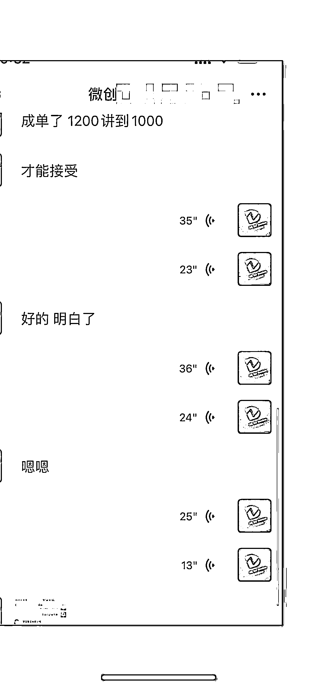
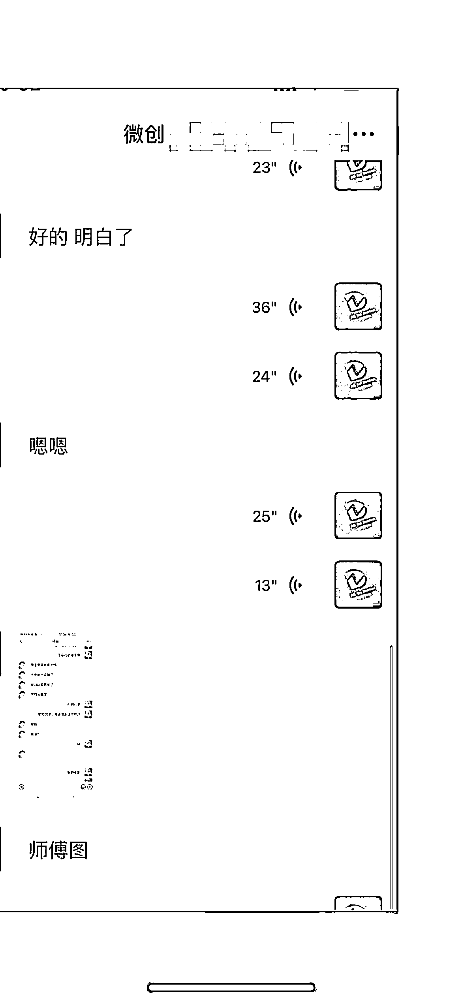
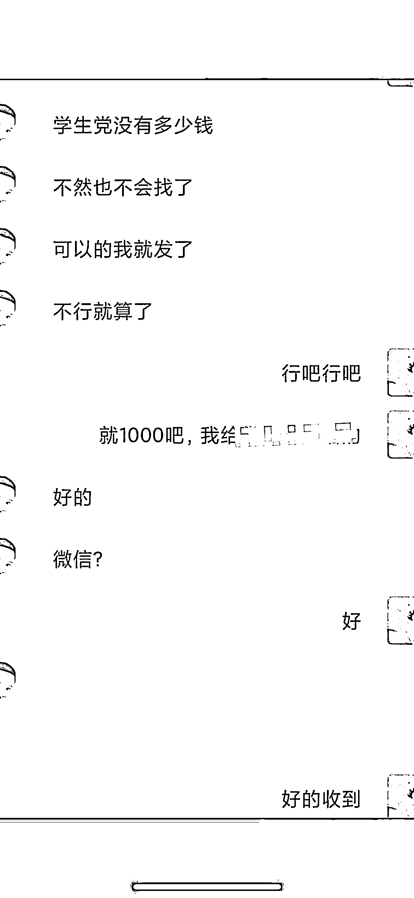
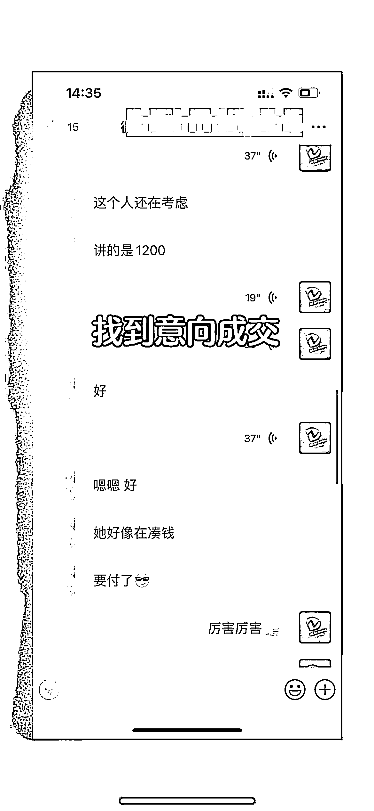
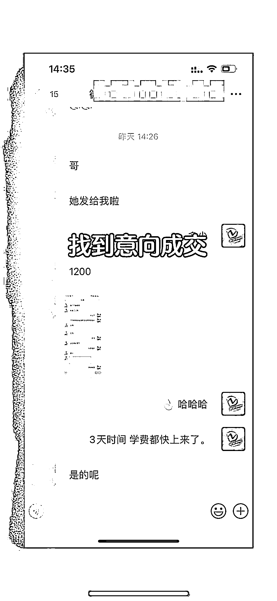
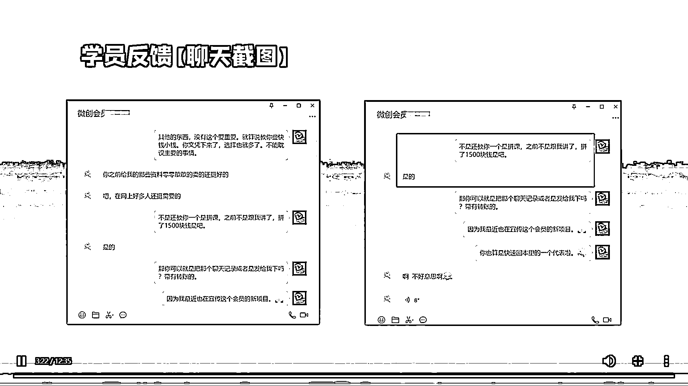
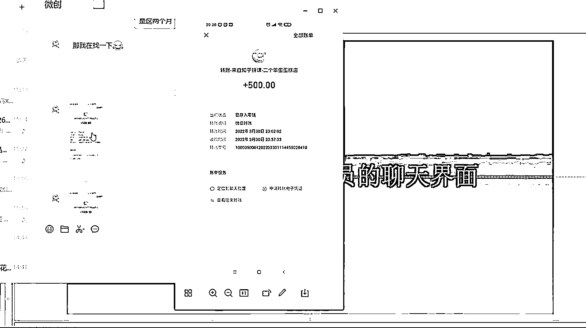
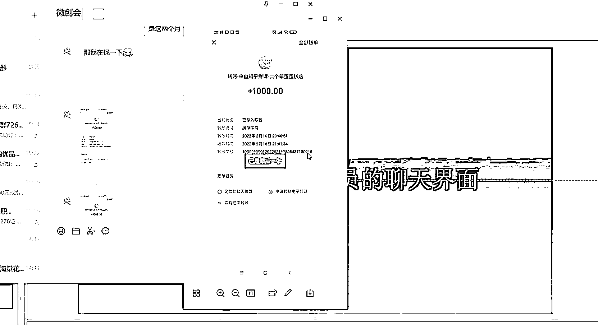

# 实操单日收入 1500 的账号资源的玩法以及流程操作，有账号的必看必学必操作

> 原文：[`www.yuque.com/for_lazy/thfiu8/amreendezekfg5fw`](https://www.yuque.com/for_lazy/thfiu8/amreendezekfg5fw)

## (11 赞)实操单日收入 1500 的账号资源的玩法以及流程操作，有账号的必看必学必操作

作者： 泽言

日期：2024-01-24

这个小项目叫做账号学费的快速回血，在每次想报名一套课程的时候呢，每个人的想法在**开始的时候**其实都很一样的，就是能够利用学到的这个东西来赚钱。

比如说我在大学时候学了一套设计课程，想报名这个课程，想法很简单。特别是学这个带有技术的课程，就是想要学到这个东西，然后有一个收入嘛。

**在报名前**，也因学费的问题反复的思索犹豫纠结和考量是否真的可以赚到钱，毕竟这个课程学下来需要大几千的费用，对于一个学生来说无疑是一笔巨款，几个月的生活费可能就搭在这个学费上了。

但当接到一种承诺的时候真的是戳中了心坎上，说可以 200 分期首付款，后期的学费，会以兼职单子的钱来交，就是说可以兼职来赚钱的，哪怕只为了这一个小小的承诺，就可以抛掉之前的所有顾虑，然后交钱分期。一个月大几百的一个费用，分个半年一年的，想着有后期的单子来做，还能学到一技之长，想想也很开心。

**但是往往结果**，并没有像之前老师承诺的那样。而且离我们想象的预期差别还有点大。在报名课程之后，除了有一个学习账号的权限和每个月按期的一个分期账单，其他的似乎什么都没有。更别说可以兼职。可以接单子等这些。

那么分期已经做了，学费已经交了，每个月还要扣除大几百的生活费在这个课程上。上面也说了，一笔大几千的费用，对于一个普通的学生来说，确实是一笔比较大的开支，毕竟一个月的生活费才 1000 左右。大半年的一个生活费，全搭在这上面了。

这时候心里百般滋味，有口难言，后悔自责当初就不该报这个课程，好像被戏耍了，除了手里学习的账号和账号里的正常每天直播，其他的承诺无疑是一个噱头。很生气，但还是强忍着继续学，每期视频课程都是当天直播，并且有重播，一期的课程大概是 30 多节，期限是一年，学费分期交的是半年或者一年。如果遇到这样情况，都会多多少少的有点不舒服。单子兼职，之前讲好的承诺的都没有。

**那么我们是否就接受了这样的结果呢？**或者是选择退款还是继续的去学习。摆在眼前的也就这么俩个选择。那么有没有这样的例子，就是你又能学到这个账号的课程又能快速赚回学费，后期还能再用这个赚到钱。后期能不能赚到钱确实也不好说。因为这要看你自己的一个实际学习状况和学习水平。但是目前来说可以让你有第 1 种体验，就是又能学到这个账号的课程，还能快速的赚回了学费。

**那么需要你怎么做呢？**其实这就源自于你的一个资源优势，是你有一个这样学习的账号，这个账号你说没有价值吗？毕竟是你用几千块钱买来的。

有人当听到这句话说，是倒卖吗？你可能只猜对了一半，一个账号能够达到效果是可以做到最高百分之 80 的一个学费回血。要怎么做到呢？

接下来讲一下一个真实的案例情况。当时我报名了一个设计学院的课程。在两个星期学费回血了，当时和大家一样吧，就是为了能提供兼职，这是一个非常诱人的一个报名条件。但最后并没有得到这样的一个待遇的时候，沮丧是难免的，但过程中对自己对这个事情也进行了一个深度的思考，兼职的话无非是提供甲方的单子你来做。仔细想想！

**第一方面**，如果你真的掌握了技术，把这门学的还不错的话，那么你这个兼职这件事还要靠人来提供吗？**第二方面**如果你通过这个课程并没有学到太多东西，或者说你对于这个课程的学习，也是三天两天中断一天俩天继续的状态。没有深刻的掌握这门技能，那么试想一下有哪个甲方愿意把自己的单子花钱来请你做呢？这个就是一个非常现实的问题。那么这时候你该怪谁呢？是怪他没有提供兼职还是怪自己确实没有学透？我想你想法肯定是趋向于前者，我也不例外。

但是当你看到这个案例课程也可以反思一下。到底是不是这个道理？简单的道理谁都懂，只是自己就是不愿接受罢了。

接下来，竖起耳朵，或许当你听懂了下面的内容，你就可以赚回了学费了。为什么这么说，因为有几个方法复制伙伴通过了这个方法梳理顺利的赚回来少则 1000 多则 1500 的一个学费，相关截图可以放在下面,这个是方法有了，去做，做的好回本的就快，做的不好回本就慢，如何去做拼课呢？（做思路复制的真实展示）

**流程讲解如下**

1.你有的资源是这个账号，这个账号是你几千块钱买来的，那么现在你学完了或者不想学了闲置了怎么办，如果把账号看成一个实体的房子，那么你闲置了房子怎么办，1 卖出去，2 租出去，对账号也具有这样周转，拼出去，共享出去，这个是变现的底层逻辑，就是把你几千块钱的账号 有偿共享出去

2.说到有东西呢那么卖给谁，有没有人需要，拼不出去咋办，其实谈到这个问题的时候应该还没去做，我用几个账号的实操案例以及其他人实操结果证明了，这个赚钱的方法百试百赚，时间问题，为什么说是时间问题呢，你做就可以加快回本，不做，永远不会 有人找到你，做什么，引流，去哪引流，去有人评论讨论这家机构的平台引流，看看小红书，知乎，或者去抖音，肯定有人在发抱怨，发这家机构好不好，发资源拼课。还有哪里有人需要，想想你是从哪里报名的，怎么加到老师的微信的，那个平台也有很多像你一样的人，这就是引流的通道，平台不会限制你留言评论互动的权力，也不会限制你私信权力，我们借助的就是通过这个平台找到这个需要的人

3.具体怎么找，上面说了那几个平台，去上面搜索关于这个机构的名字，里面很多可以发布信息的地方，你可以留言，我的课程学完了，包含哪些课程，有小伙伴要吗、有小伙伴一起学习吗？基本上就是展示你有什么，你可以给带来什么，留言后就是最重要的中转环节，私信加微信

私信加微信，一定要加到微信，才能成交的可能

4.加好微信，直接正常了解，拼课就是一人一半的费用，理论是这样，但是最好她少出一些，比如 2900 课程，他给个 1000-1200 就可以接受，她想报名还省了不少，还不用贷款，还能学习课程，但凡靠谱谁都会考虑的，在乎你如何的建立信任，达成成交，具体的话术大概要把账号相关介绍清楚，聊聊自己的学习心得，报名过程，学的怎么样，但凡你沟通环节不错，都可以成交得很顺利

5.意向可以多加，真实对待每个加到的朋友，成单后她转账你把课程账号密码发给他，中途有什么问题都可以相互沟通

好了，按照步骤做吧！！！

**三个点来总结**

**第一点**，快速回血的要求是什么？要求很简单，就是你有一个账号，期限越长越好。只有你这个期限长了，你这个账号价值也就很高。

**第二点**，怎么做？拼课，不以盈利为目的，以学习交流为主。进行网课拼课；事实上也是这样，绝大部分人不会说靠这个怎么怎么样的。只是在你的熟人朋友甚至是网络上认识的人进行一个学费的分摊。如果你的课程是 2900，那么实际上只交 1500，当你学完课程的时候，你再拼一个，这个账号学费就等于回血了。

**第三点**，找谁拼?这个问题呢，对于我来说，我作为互联网的灵活就业者，凡是涉及找这个东西，首当其就是依靠于网络。包括说的找谁拼课这个问题。那么怎么拼？你在哪里看到这个机构的广告就在哪里都找拼课的人用私信留言的方式。

按照我说的，在 10 天之内。一定会有意向人。那么多少天能够成交呢？这里呢，不好判断。因为这里掺杂了你有没有做这个事这个问题，如果你真的是做好的话，大概在两个星期到一个月之间，一定是会回本。这里就是以资源作为优势的一个互联网变现典型案例，

以上呢就是在保证你可以学到课程，并且能快速让学费回本，**至于后期是怎么赚钱呢？**怎么样能有一个长期的一个收入？这个长期的收入是有个前提，是你真正掌握了这个技术。至少在做一些图片，在做一些效果图的时候，能够很流畅的有自己的一个想法，或者是对于一些 P 图改图以及工具上面的使用，可以很好的掌握。这里是以你的技术优势做了一个变现。那么怎么来找这个渠道呢。这里举一些例子。

**我之前的有一个网络上认识的朋友**。他的变现渠道很简单，就是找了一家的淘宝店铺进行了合作。然后呢，接到的单子他做的话可以有分成。那么淘宝就是平台，就是你有技术之后实现变现的一个途径。

**还有一个是我同届学习设计的同学**。他在学完了基础和提升两个课程之后呢？就在花瓣网啊。上传了一些作品或者是搬运一些素材。积累了一些粉丝。这部分的流量呢，又导入到个人的微信里。结果，他靠卖一些资源 ps 的软件，插件。素材，模板。轻轻松松的也变现了。

**最后一个就是我**，当时报了课程之后呢，**拼课**是我的第 1 桶金。那么社团的一些**照片处理**呀。比如说证件照啊，社团组织聚餐旅游照片，长期以往呢，就会积累了一些校园的客户。就是做一些简单的修图啊，做图啊这些。这个也实现了很好的变现渠道。

**那么总结来说就是：单一的知识是无法形成变现的**，不管知识是你有资源还是你有技术，你要将这些原始东西结合某个桥梁连接起来，这个连接可以是某一个平台。也可以是连接你的周围的人。

总之，变现是一个框架，那么在你之后的学习当中，不再以狂学为主。不再于从第 1 节课刷到最后一节课为主。**而是什么有用学什么**，你要做什么单就学习如何做这样的单的类型课程就可以了。

好了，生财有术的伙伴们，讲了很多。希望你在看到这篇文章的时候，也能够赚到你的第 1 桶金。还有不懂的话可以评论留言，方法简单，但是得去做，做才会有结果。希望在分享过程中真的可以帮助一些人实现第一笔意想不到的的入局收入

虽然这分享的篇幅不长，但是把产品思维，流量思维，成交思维的小模型都套用了，最好的产品往往是从自身出发，没有产品不可能，创造一个，最好的引流就是哪里有需求，哪里就是你的目标用户，最好的成交就是性价比高

价值共享。

最后：祝愿大家生财有术

* * *

评论区：

希平 : 有点过于理论

* * *